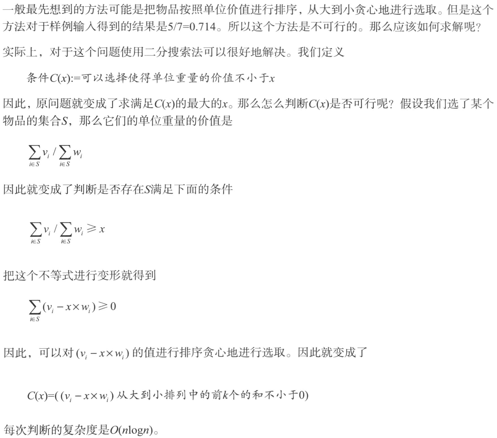
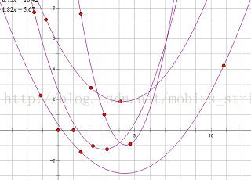
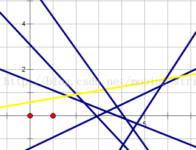
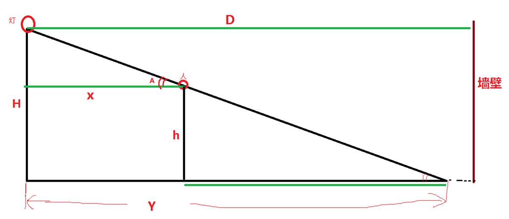
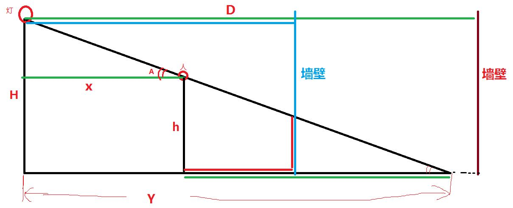

本页面将简要介绍二分查找，由二分法衍生的三分法以及二分答案。

## 二分法

### 定义

二分查找（英语：binary search），也称折半搜索（英语：half-interval search）、对数搜索（英语：logarithmic search），是用来在一个有序数组中查找某一元素的算法。

### 理论背景

在《计算方法》教材中，关于非线性方程的求根问题，有一种是二分法。

方程求根是常见的数学问题，满足方程：
 f(x)=0

的数x′称为方程的根。

所谓非线性方程，是指f(x)中含有三角函数、指数函数或其他超越函数。这种方程，很难或者无法求得精确解。不过，在实际应用中，只要得到满足一定精度要求的近似解就可以了，此时，需要考虑2个问题：

1. 根的存在性。用这个定理判定：设函数在闭区间[a,b]上连续，且f(a)∙f(b)<0，则f(x)=0存在根。
2. 求根。一般有两种方法：搜索法、二分法。

搜索法：把区间[a,b]分成n等份，每个子区间长度是∆x，计算点xk=a+kΔx, (k=0,1,2,3,4,...,n)的函数值f(xk)，若f(xk)=0，则是一个实根，若相邻两点满足f(xk)∙f(xk+1)<0，则在(xk,xk+1)内至少有一个实根，可以取(xk+xk+1)/2为近似根。

二分法：如果确定f(x)在区间[a,b]内连续，且f(a)∙f(b)<0，则至少有一个实根。二分法的操作，就是把[a,b]逐次分半，检查每次分半后区间两端点函数值符号的变化，确定有根的区间。

什么情况下用二分？两个条件：**上下界[a,b]确定、函数在[a,b]内单调。**


### 过程

以在一个升序数组中查找一个数为例。

它每次考察数组当前部分的中间元素，如果中间元素刚好是要找的，就结束搜索过程；如果中间元素小于所查找的值，那么左侧的只会更小，不会有所查找的元素，只需到右侧查找；如果中间元素大于所查找的值同理，只需到左侧查找。

二分非常高效。所以，如果问题是单调性的，且求解精确解的难度很高，可以考虑用二分法。

在算法竞赛题目中，有两种题型：整数二分、实数二分。整数域上的二分，注意终止边界、左右区间的开闭情况，避免漏掉答案或者死循环。实数域上的二分，需要注意精度问题。

### 性质

#### 时间复杂度

二分查找的最优时间复杂度为 $O(1)$。

二分查找的平均时间复杂度和最坏时间复杂度均为 $O(\log n)$。因为在二分搜索过程中，算法每次都把查询的区间减半，所以对于一个长度为 $n$ 的数组，至多会进行 $O(\log n)$ 次查找。

#### 空间复杂度

迭代版本的二分查找的空间复杂度为 $O(1)$。

递归（无尾调用消除）版本的二分查找的空间复杂度为 $O(\log n)$。

## 整数二分模板

先看一个简单问题：在有序数列a[]中查找某个数x；如果有x，找第一个x的位置；如果没有x，找比x大的第一个数的位置。通过这个问题，给出二分法的基本代码。

示例：a[] = {-12,-6,-4,3,5,5,8,9}，其中有n = 8个数，存储在a[0]～a[7]。

1. 查找x = -5，返回位置2，指向a[2] = -4；
2. 查找x = 7，返回位置6，指向a[6] = 8；
3. 特别地，如果x 大于最大的a[7] = 9，例如x = 12，返回位置8。由于不存在a[8]，所以此时是越界的。

下面是模板代码。
```cpp
int bin_search(int *a, int n, int x){
	//a[0]～a[n-1]是单调递增的 
	int left = 0, right = n; //注意：不是 n-1 
	while (left < right) { 
		int mid = left + (right-left)/2; //int mid = (left + right) >> 1; 
		if (a[mid] >= x) right = mid; 
		else left = mid + 1; 
	} //终止于left = right 
	return left; //特殊情况：a[n-1] < x时，返回n 
}
```

下面对上述代码进行补充说明：

1. 代码执行完毕后，left==right，两者相等，即答案所处的位置。
2. 复杂度：每次把搜索的范围缩小一半，总次数是log(n)。
3. 中间值写成mid = left + (right-left)/2，不能写成 mid = (left + right)/2; 有可能溢出，在有负数的情况下，会出错。

### STL 的二分查找

C++ 标准库中实现了查找首个不小于给定值的元素的函数 [`std::lower_bound`](https://zh.cppreference.com/w/cpp/algorithm/lower_bound) 和查找首个大于给定值的元素的函数 [`std::upper_bound`](https://zh.cppreference.com/w/cpp/algorithm/upper_bound)，二者均定义于头文件 `<algorithm>` 中。

二者均采用二分实现，所以调用前必须保证元素有序。

如果只是简单地找x或x附近的数，就用STL的lower_bound()和upper_bound()函数。有以下情况：

1. 查找第一个大于x的元素的位置：upper_bound()。代码例如：
pos = upper_bound(a, a+n, test) - a;
2. 查找第一个等于或者大于x的元素：lower_bound()。
3. 查找第一个与x相等的元素：lower_bound()且 = x。
4. 查找最后一个与x相等的元素：upper_bound()的前一个且 = x。
5. 查找最后一个等于或者小于x的元素：upper_bound()的前一个。
6. 查找最后一个小于x的元素：lower_bound()的前一个。
7. 单调序列中数x的个数：upper_bound() - lower_bound()。

### 例题

???+note "Two Sum"
    输入n ( n≤100,000)个整数，找出其中的两个数，它们之和等于整数m(假定肯定有解)。题中所有整数都能用int 表示。

???+note "解题思路"
    下面给出三种方法：

    1. 暴力搜，用两重循环，枚举所有的取数方法，复杂度O(n2)。超时。
    2. 二分法。首先对数组从小到大排序，复杂度O(nlogn)；然后，从头到尾处理数组中的每个元素a[i]，在a[i]后面的数中二分查找是否存在一个等于 m - a[i]的数，复杂度也是O(nlogn)。两部分相加，总复杂度仍然是O(nlogn)。
    3. 尺取法/双指针/two pointers。对于这个特定问题，更好的、标准的算法是：首先对数组从小到大排序；然后，设置两个变量L和R，分别指向头和尾，L初值是0，R初值是n-1，检查a[L]+a[R]，如果大于m，就让R减1，如果小于m，就让L加1，直至a[L]+a[R]=m。排序复杂度O(nlogn)，检查的复杂度O(n)，总复杂度O(nlogn)。检查的代码这样写：

    ```cpp
    void find_sum(int a[], int n, int m){ 
        sort(a, a + n - 1);      //先排序
        int L = 0, R = n - 1;    //L指向头，R指向尾
        while (L < R){
                  int sum = a[L] + a[R];
                  if (sum > m)   R--;
                  if (sum < m)   L++;
                  if (sum == m){     
                  cout << a[L] << "    " << a[R] << endl;  //打印一种情况
                  L++;   //可能有多种情况，继续
                  }
        }
    }
    ```

???+note
    对于 $n$ 是有符号数的情况，当你可以保证 $n\ge 0$ 时，`n >> 1` 比 `n / 2` 指令数更少。

## 二分法的典型应用有

### 最小化最大值

注意，这里的有序是广义的有序，如果一个数组中的左侧或者右侧都满足某一种条件，而另一侧都不满足这种条件，也可以看作是一种有序（如果把满足条件看做 $1$，不满足看做 $0$，至少对于这个条件的这一维度是有序的）。换言之，二分搜索法可以用来查找满足某种条件的最大（最小）的值。

要求满足某种条件的最大值的最小可能情况（最大值最小化），首先的想法是从小到大枚举这个作为答案的「最大值」，然后去判断是否合法。若答案单调，就可以使用二分搜索法来更快地找到答案。因此，要想使用二分搜索法来解这种「最大值最小化」的题目，需要满足以下三个条件：

1. 答案在一个固定区间内；
2. 可能查找一个符合条件的值不是很容易，但是要求能比较容易地判断某个值是否是符合条件的；
3. 可行解对于区间满足一定的单调性。换言之，如果 $x$ 是符合条件的，那么有 $x + 1$ 或者 $x - 1$ 也符合条件。（这样下来就满足了上面提到的单调性）

???+note "序列划分问题"
    例如，有一个序列{2,2,3,4,5,1}，将其划分成3个连续的子序列S(1)、S(2)、S(3)，每个子序列最少有一个元素，要求使得每个子序列的和的最大值最小。

    下面举例2个分法：
    
    分法1：S(1)、S(2)、S(3)分别是(2,2,3)、(4,5)、(1),子序列和分别是7、9、1，最大值是9；
    
    分法2：(2,2,3)、(4)、(5,1),子序列和是7、4、6，最大值是7。
    
    分法2更好。

???+note "解题思路"
    在一次划分中，考虑一个x，使x满足：对任意的S(i)，都有S(i)<=x，也就是说，x是所有S(i)中的最大值。题目需要求的就是找到这个最小的x。这就是最大值最小化。
    
    如何找到这个x？从小到大一个个地试，就能找到那个最小的x。
    
    简单的办法是：枚举每一个x，用贪心法每次从左向右尽量多划分元素，S(i)不能超过x，划分的子序列个数不超过m个。这个方法虽然可行，但是枚举所有的x太浪费时间了。
    
    改进的办法是：用二分法在[max, sum]中间查找满足条件的x，其中max是序列中最大元素，sum是所有元素的和。

???+note "[通往奥格瑞玛的道路](https://www.luogu.org/problem/P1462)"
    给定无向图，n个点，m条双向边，每个点有点权fi（这个点的过路费），有边权ci（这条路的血量）。求起点1到终点N的所有可能路径中，在总边权（总血量）不超过给定的b的前提下，所经过的路径中最大点权（这条路径上过路费最大的那个点）的最小值是多少。

    题目数据：n≤10000，m≤50000，fi，ci，B≤1e9。

???+note "解题思路"
    对点权fi进行二分，用dijkstra求最短路，检验总边权是否小于b。二分法是最小化最大值问题。

    这一题是二分法和最短路算法的简单结合。

    1. 对点权（过路费）二分。题目的要求是：从1到N有很多路径，其中的一个可行路径Pi，它有一个点的过路费最大，记为Fi；在所有可行路径中，找到那个有最小F的路径，输出F。解题方案是：先对所有点的fi排序，然后用二分法，找符合要求的最小的fi。二分次数log(fi)=log(1e9) < 30。
    2. 在检查某个fi时，删除所有大于fi的点，在剩下的点中，求1到N的最短路，看总边权是否小于b，如果满足，这个fi是合适的（如果最短路的边权都大于b，那么其他路径的总边权就更大，肯定不符合要求）。一次Dijkstra求最短路，复杂度是O(mlogn)。

    总复杂度满足要求。

### 最大化最小值
当然，最小值最大化是同理的。

???+note "[进击的奶牛](https://www.luogu.org/problem/P1824)"
    在一条很长的直线上，指定n个坐标点（x1, ..., xn）。有c头牛，安排每头牛站在其中一个点（牛棚）上。这些牛喜欢打架，所以尽量距离远一些。问最近的两头牛之间距离的最大值可以是多少。
    
    这个题目里，所有的牛棚两两之间的距离有个最小值，题目要求使得这个最小值最大化。

???+note "解题思路"

    1. 暴力法。从小到大枚举最小距离的值dis，然后检查，如果发现有一次不行，那么上次枚举的就是最大值。如何检查呢？用贪心法：第一头牛放在x1，第二头牛放在xj≥x1+dis的点xi,第三头牛放在xk≥xj+dis的点xk，等等，如果在当前最小距离下，不能放c条牛，那么这个dis就不可取。复杂度O(nc)。
    2. 二分。分析从小到大检查dis的过程，发现可以用二分的方法找这个dis。这个dis符合二分法：它有上下边界、它是单调递增的。复杂度O(nlogn)。

???+note "参考代码"
    ```cpp
    #include<bits/stdc++.h>
    using namespace std;
    int n,c,x[100005];//牛棚数量，牛数量，牛棚坐标
    bool check(int dis){     //当牛之间距离最小为dis时，检查牛棚够不够
        int cnt=1, place=0;  //第1头牛，放在第1个牛棚
        for (int i = 1; i < n; ++i)     //检查后面每个牛棚
            if (x[i] - x[place] >= dis){ //如果距离dis的位置有牛棚
                cnt++;      //又放了一头牛
                place = i;  //更新上一头牛的位置
            }
        if (cnt >= c) return true;   //牛棚够
        else          return false;  //牛棚不够
    }
    int main(){
        scanf("%d%d",&n, &c);
        for(int i=0;i<n;i++)    scanf("%d",&x[i]);
        sort(x,x+n);             //对牛棚的坐标排序
        int left=0, right=x[n-1]-x[0];  //R=1000000也行，因为是log(n)的，很快
                          //优化：把二分上限设置为1e9/c
        int ans = 0;
        while(left < right){
            int mid = left + (right - left)/2;     //二分
            if(check(mid)){       //当牛之间距离最小为mid时，牛棚够不够?
                ans = mid;        //牛棚够，先记录mid
                left = mid + 1;   //扩大距离
              }
            else
                right = mid;      //牛棚不够，缩小距离
        }
        cout << ans;              //打印答案
        return 0;
    }
    ```

### 最大化平均值

???+note ""
    有n个物品的重量和价值分别是wi和vi，从中选出k个物品使得单位重量价值最大。

    样例输入：
    
    3 2
    
    2 2
    
    5 3
    
    2 1
    
    样例输出：

    0.75

???+note "解题思路"
    

???+note "参考代码"

    ```cpp
    #include<stdio.h>
    #include<algorithm>
    using namespace std;
    #define INF 0x3f3f3f3f
    bool cmp(double a,double b)
    {
        return a>b;
    }
    int n,k;
    double y[20010];
    int w[20010],v[20010];
    bool C(double x)
    {
        for(int i = 0 ; i < n ; i++)
        {
            y[i]=v[i]-x*w[i];
        }
        sort(y,y+n,cmp);
        double sum=0;
        for(int i = 0 ; i < k ; i++)
            sum+=y[i];
            if(sum>=0)
                return true;///x太小
                return false///x太大
    }
    int main()
    {
        scanf("%d%d",&n,&k);
        for(int i = 0 ; i  < n ; i++)
            scanf("%d%d",&w[i],&v[i]);
        double st = 0,en = INF;
        for(int i=1;i<=100;i++)///精度
        {
            double mid = (st+en)/2;
            if(C(mid))
                st=mid;
            else
                en=mid;
        }
        printf("%.2f\n",en);

    }
    ```

### 二分答案

解题的时候往往会考虑枚举答案然后检验枚举的值是否正确。若满足单调性，则满足使用二分法的条件。把这里的枚举换成二分，就变成了「二分答案」。

???+note "[Luogu P1873 砍树](https://www.luogu.com.cn/problem/P1873)"
    伐木工人米尔科需要砍倒 $M$ 米长的木材。这是一个对米尔科来说很容易的工作，因为他有一个漂亮的新伐木机，可以像野火一样砍倒森林。不过，米尔科只被允许砍倒单行树木。
    
    米尔科的伐木机工作过程如下：米尔科设置一个高度参数 $H$（米），伐木机升起一个巨大的锯片到高度 $H$，并锯掉所有的树比 $H$ 高的部分（当然，树木不高于 $H$ 米的部分保持不变）。米尔科就得到树木被锯下的部分。
    
    例如，如果一行树的高度分别为 $20,~15,~10,~17$，米尔科把锯片升到 $15$ 米的高度，切割后树木剩下的高度将是 $15,~15,~10,~15$，而米尔科将从第 $1$ 棵树得到 $5$ 米木材，从第 $4$ 棵树得到 $2$ 米木材，共 $7$ 米木材。
    
    米尔科非常关注生态保护，所以他不会砍掉过多的木材。这正是他尽可能高地设定伐木机锯片的原因。你的任务是帮助米尔科找到伐木机锯片的最大的整数高度 $H$，使得他能得到木材至少为 $M$ 米。即，如果再升高 $1$ 米锯片，则他将得不到 $M$ 米木材。

??? note "解题思路"
    我们可以在 $1$ 到 $10^9$ 中枚举答案，但是这种朴素写法肯定拿不到满分，因为从 $1$ 枚举到 $10^9$ 太耗时间。我们可以在 $[1,~10^9]$ 的区间上进行二分作为答案，然后检查各个答案的可行性（一般使用贪心法）。**这就是二分答案。**

??? note "参考代码"
    ```cpp
    int a[1000005];
    int n, m;
    
    bool check(int k) {  // 检查可行性，k 为锯片高度
      long long sum = 0;
      for (int i = 1; i <= n; i++)       // 检查每一棵树
        if (a[i] > k)                    // 如果树高于锯片高度
          sum += (long long)(a[i] - k);  // 累加树木长度
      return sum >= m;                   // 如果满足最少长度代表可行
    }
    
    int find() {
      int l = 1, r = 1e9 + 1;   // 因为是左闭右开的，所以 10^9 要加 1
      while (l + 1 < r) {       // 如果两点不相邻
        int mid = (l + r) / 2;  // 取中间值
        if (check(mid))         // 如果可行
          l = mid;              // 升高锯片高度
        else
          r = mid;  // 否则降低锯片高度
      }
      return l;  // 返回左边值
    }
    
    int main() {
      cin >> n >> m;
      for (int i = 1; i <= n; i++) cin >> a[i];
      cout << find();
      return 0;
    }
    ```
    
    看完了上面的代码，你肯定会有两个疑问：
    
    1.  为何搜索区间是左闭右开的？
    
        因为搜到最后，会这样（以合法的最大值为例）：
    
        
    
        然后会
    
        
    
        合法的最小值恰恰相反。
    
    2.  为何返回左边值？
    
        同上。

## 实数二分
实数域上的二分，比整数二分简单。

实数二分的基本形式
```cpp
const double eps =1e-7;        //精度。如果下面用for，可以不要eps
while(right - left > eps){     //for(int i = 0; i<100; i++){
      double mid = left+(right-left)/2;
      if (check(mid)) right = mid;           //判定，然后继续二分
      else            left  = mid;
}
```
其中，循环用2种方法都可以：
```cpp
while(right - left > eps)  { ... }
```
或者：
```cpp
for(int i = 0; i < 100; i++) { ... }
```
如果用for循环，由于循环内用了二分，执行100次，相当于实现了1/2^100的精度，一般比eps更精确。

for循环的100次，比while的循环次数要多。如果时间要求不是太苛刻，用for循环更简便

### 例题

???+note "[Pie](http://poj.org/problem?id=3122)"
    主人过生日，m个人来庆生，有n块半径不同的圆形蛋糕，由m+1个人（加上主人）分，每人的蛋糕必须一样重，而且是一整块（不能是几个蛋糕碎块，也就是说，每个人的蛋糕都是从一块圆蛋糕中切下来的完整一块）。问每个人能分到的最大蛋糕是多大。

    最小值最大化问题。设每人能分到的蛋糕大小是x，用二分法枚举x。

???+note "参考代码"
    ```cpp
    #include<stdio.h>
    #include<math.h>
    double PI = acos(-1.0);    //3.141592653589793;
    #define eps 1e-5
    double area[10010];
    int n,m;
    bool check(double mid){ 
        int sum = 0;
        for(int i=0;i<n;i++)        //把每个圆蛋糕都按大小mid分开。统计总数
            sum += (int)(area[i] / mid);
        if(sum >= m) return true;   //最后看总数够不够m个
        else         return false;
    }
    int main(){
        int T; scanf("%d",&T);
        while(T--){
            scanf("%d%d",&n,&m); m++;
            double maxx = 0;
            for(int i=0;i<n;i++){
                int r; scanf("%d",&r);
                area[i] = PI*r*r;
                if(maxx < area[i]) maxx = area[i]; //最大的一块蛋糕
            }
            double left = 0, right = maxx;  
            for(int i = 0; i<100; i++){  
            //while((right-left) > eps)   {      //for或者while都行
                double mid = left+(right-left)/2;
                if(check(mid))   left  = mid;   //每人能分到mid大小的蛋糕
                else             right = mid;   //不够分到mid大小的蛋糕
            }
            printf("%.4f\n",left);    // 打印right也对
        }
        return 0;
    }
    ```

## 三分法

### 引入
三分法求单峰（或者单谷）的极值，是二分法的一个简单扩展。

单峰函数和单谷函数如下图，函数f(x)在区间[l, r]内，只有一个极值v，在极值点两边，函数是单调变化的。以单峰函数为例，在v的左边，函数是严格单调递增的，在v右边是严格单调递减的。


(1)单峰函数　　　　　　 (2)单谷函数

???+warning "注意"
    只要函数是单峰函数，三分法既可以求出其最大值，也可以求出其最小值。为行文方便，除特殊说明外，下文中均以求单峰函数的最小值为例。

如何求单峰函数最大值的近似值？虽然不能直接用二分法，不过，只要稍微变形一下，就能用了。

在[l, r]上任取2个点，mid1和mid2，把函数分成三段。有以下情况：

1. 若f(mid1) < f(mid2)，极值点v一定在mid1的右侧。此时，mid1和mid2要么都在v的左侧，要么分别在v的两侧。如下图所示。


情况（1）：极值点v在mid1右侧

下一步，令l = mid1，区间从[l, r]缩小为[mid1, r]，然后再继续把它分成三段。

2. 同理，若f(mid1) > f(mid2)，极值点v一定在mid2的左侧。如下图所示。下一步，令 r = mid2，区间从[l, r]缩小为[l, mid2]。


情况（2）：极值点v在mid1右侧

不断缩小区间，就能使得区间[l, r]不断逼近v，从而得到近似值。

如何取mid1和mid2？有2种基本方法：

1. 三等分：mid1和mid2为[l, r]的三等分点。那么区间每次可以减少三分之一。
2. 近似三等分：计算[l, r]中间点mid = (l + r) / 2，然让mid1和mid2非常接近mid，例如mid1 = mid - eps，mid2 = mid + eps，其中eps是一个很小的值。那么区间每次可以减少接近一半。

方法（2）比方法（1）要稍微快一点。

(有网友说不要用方法（2）：“因为在有些情况下这个 eps 过小可能导致这两个算出来的相等，如果相等就有可能会判断错方向，所以其实不建议这么写，log3 和 log2 本质上是一样的。”)

注意：单峰函数的左右两边要严格单调，否则，可能在一边有f(mid1) == f(mid2)，导致无法判断如何缩小区间。

??? note "为什么不通过求导函数的零点来求极值点？"
    客观上，求出导数后，通过二分法求出导数的零点（由于函数是单峰函数，其导数在同一范围内的零点是唯一的）得到单峰函数的极值点是可行的。
    
    但首先，对于一些函数，求导的过程和结果比较复杂。
    
    其次，某些题中需要求极值点的单峰函数并非一个单独的函数，而是多个函数进行特殊运算得到的函数（如求多个单调性不完全相同的一次函数的最小值的最大值）。此时函数的导函数可能是分段函数，且在函数某些点上可能不可导。

### 另一种解释

三分法与二分法的基本思想类似，但每次操作需在当前区间 $[l,r]$（下图中除去虚线范围内的部分）内任取两点 $lmid,rmid(lmid < rmid)$（下图中的两蓝点）。如下图，如果 $f(lmid)<f(rmid)$，则在 $[rmid,r]$（下图中的红色部分）中函数必然单调递增，最小值所在点（下图中的绿点）必然不在这一区间内，可舍去这一区间。反之亦然。


???+ warning "注意"
    在计算 $lmid$ 和 $rmid$ 时，需要防止数据溢出的现象出现。

三分法每次操作会舍去两侧区间中的其中一个。为减少三分法的操作次数，应使两侧区间尽可能大。因此，每一次操作时的 $lmid$ 和 $rmid$ 分别取 $mid-\varepsilon$ 和 $mid+\varepsilon$ 是一个不错的选择。

### 实现

#### 伪代码

$$
\begin{array}{ll}
1 & \textbf{Input. } \text{A range } [l,r] \text{ meaning that the domain of } f(x) \text{.} \\
2 & \textbf{Output. } \text{The maximum value of } f(x) \text{ and the value of } x \text{ at that time } \text{.} \\
3 & \textbf{Method. } \\
4 & \textbf{while } r - l > \varepsilon\\
5 & \qquad mid\gets \frac{lmid+rmid}{2}\\
6 & \qquad lmid\gets mid - \varepsilon \\
7 & \qquad rmid\gets mid + \varepsilon \\
8 & \qquad \textbf{if } f(lmid) < f(rmid) \\
9 & \qquad \qquad r\gets mid \\
10 & \qquad \textbf{else } \\
11 & \qquad \qquad l\gets mid
\end{array}
$$

#### C++

```cpp
while (r - l > eps) {
  mid = (lmid + rmid) / 2;
  lmid = mid - eps;
  rmid = mid + eps;
  if (f(lmid) < f(rmid))
    r = mid;
  else
    l = mid;
}
```

### 例题

???+note "[洛谷 P3382 - 【模板】三分法](https://www.luogu.com.cn/problem/P3382)"
    给定一个 $N$ 次函数和范围 $[l, r]$，求出使函数在 $[l, x]$ 上单调递增且在 $[x, r]$ 上单调递减的唯一的 $x$ 的值。

??? note "解题思路"
    本题要求求 $N$ 次函数在 $[l, r]$ 取最大值时自变量的值，显然可以使用三分法。

??? note "参考代码"
    === "三等分"

        ```cpp
        #include<bits/stdc++.h>
        using namespace std;
        const double eps = 1e-6;
        int n;
        double a[15];
        double f(double x){       //计算函数值
            double s=0;
            for(int i=n;i>=0;i--) //注意函数求值的写法
                s = s*x + a[i];
            return s;
        }
        int main(){
            double L,R;
            scanf("%d%lf%lf",&n,&L,&R);
            for(int i=n;i>=0;i--) scanf("%lf",&a[i]);
            while(R-L > eps){  // for(int i = 0; i<100; i++){   //用for也行
                double k =(R-L)/3.0;
                double mid1 = L+k, mid2 = R-k;
                if(f(mid1) > f(mid2)) 
                      R = mid2;
                else   L = mid1;
            }
            printf("%.5f\n",L);
            return 0;
        }
        ```
    === "近似三等分"

        ```cpp
        #include<bits/stdc++.h>
        using namespace std;
        const double eps = 1e-6;
        int n; double a[15];
        double f(double x){
            double s=0;
            for(int i=n;i>=0;i--) s=s*x+a[i];
            return s;
        }
        int main(){
            double L,R;
            scanf("%d%lf%lf",&n,&L,&R);
            for(int i=n;i>=0;i--) scanf("%lf",&a[i]);
            while(R-L > eps){   // for(int i = 0; i<100; i++){   //用for也行
                double mid = L+(R-L)/2; 
                if(f(mid - eps) > f(mid))
                    R = mid;
                else L = mid;
            }
            printf("%.5f\n",L);
            return 0;
        }
        ```
    === "OIWiki版本"
        ```cpp
        --8<-- "docs/basic/code/binary/binary_1.cpp"
        ```

### 习题

??? note "[Uva 1476 - Error Curves](https://onlinejudge.org/index.php?option=com_onlinejudge&Itemid=8&category=447&page=show_problem&problem=4222)"
    给你n条开口向上的二次曲线Si（a>0），定义F（x） = max（Si（x）），求F（x）的最小值。

    ??? tip
        分析：三分。F（x）是一个单峰函数，先单调递减后单调递增，利用三分求最小值。

        
            
        首先，证明两个二次函数构造的F2（x）为单峰函数；

        （如果不成立，则存在两个连续的波谷，交点处一个函数递增另一个递减，矛盾，不会取递减函数）

        然后，用数学归纳法证明，Fi（x）为单峰函数，则Fi+1 = max（Fi（x），Si+1（x））也是单峰函数；

        （如果存在两个（或更多）连续的波谷，交点处一个函数递增另一个递减，矛盾，所以只有一个波谷）

        结论，综上所述得证结论，只存在一个波谷。
    
    ??? note "参考代码"

        ```cpp
        #include <algorithm>
        #include <iostream>
        #include <cstdlib>
        #include <cstring>
        #include <cstdio>
        #include <cmath>
        
        using namespace std;
        
        const int DATA_SIZE = 10001;
        
        double a[DATA_SIZE];
        double b[DATA_SIZE];
        double c[DATA_SIZE];
        
        double F(int n, double x)
        {
            double max_value = a[0]*x*x + b[0]*x + c[0];
            for (int i = 1; i < n; ++ i) 
                max_value = max(max_value, a[i]*x*x + b[i]*x + c[i]);
            return max_value;
        }
        
        int main()
        {
            int t,n;
            while (~scanf("%d",&t)) 
            while (t --) {
                scanf("%d",&n);
                for (int i = 0; i < n; ++ i)
                    scanf("%lf%lf%lf",&a[i],&b[i],&c[i]);
                
                double l = 0.0,r = 1000.0,div_l,div_r;
                while (r-l > 1e-10) {
                    div_l = l + (r-l)/3.0;
                    div_r = r - (r-l)/3.0;
                    if (F(n, div_l) < F(n, div_r))
                        r = div_r;
                    else l = div_l;
                }
                
                printf("%.4lf\n",F(n, l));
            }
            return 0;
        }
        ```

??? note "[Uva 10385 - Duathlon](https://uva.onlinejudge.org/index.php?option=com_onlinejudge&Itemid=8&category=15&page=show_problem&problem=1326)"
     一些运动员，参加铁人两项，跑步r千米，骑车k千米，现在知道每个人的跑步和骑车速度，问能否设置一个r和k，保持r + k = t，使得第n个人会取胜，如果可以求出时间和r，k

    ??? tip
        设第一部分长度是x，第二部分的长度是L-x，t（x）= x / v +（L-x）/ u；

        $ f(x) = max(x/v_n + (L-x)/u_n - (x/v_i + (L-x)/u_i)) $

        化简后得到

        $ f(x) = x/v_n + (L-x)/u_n - min(x/v_i + (L-x)/u_i)$

        下面证明 $f(x)$ 为单峰函数（ 即 $min(x/v_i + (L-x)/u_i)$ 为单峰函数）：

        

        首先，只包含两条直线，一定是单峰的函数（或者是单调的）；

        再次，设i条直线是单峰的，插入第i+1条（如图黄色的直线），那么得到新的函数；

        其中，左交点上的直线斜率一定小于 $l_{i+1}$，右交点的直线斜率一定大于 $l_{i+1}$；

        （因为相交后在右侧的斜率大的在上面，左边斜率小的在上面）

        由斜率递增的直线段构成的连续分段函数一定单峰（最低点两端都是单调的）；

        结论，综上 $f(x)$ 是单峰函数。

    ??? note "参考代码"

        ```cpp
        #include <algorithm>
        #include <iostream>
        #include <cstdlib>
        #include <cstring>
        #include <cstdio>
        #include <cmath>
        
        using namespace std;
        
        const int DATA_SIZE = 10001;
        
        double L,u[DATA_SIZE],v[DATA_SIZE];
        
        double F(int n, double x, double L)
        {
            double min_value = x/u[1] + (L-x)/v[1];
            for (int i = 2; i < n; ++ i) 
                min_value = min(min_value, x/u[i] + (L-x)/v[i]);
            return min_value - x/u[n] - (L-x)/v[n];
        }
        
        int main()
        {
            int n;
            while (~scanf("%lf%d",&L,&n)) {
                for (int i = 1; i <= n; ++ i)
                    scanf("%lf%lf",&u[i],&v[i]);
                
                double l = 0,r = L,div_l,div_r;
                while (r-l > 1e-4) {
                    div_l = l + (r-l)/3.0;
                    div_r = r - (r-l)/3.0;
                    if (F(n, div_l, L) > F(n, div_r, L))
                        r = div_r;
                    else l = div_l;
                }
                
                if (F(n, l, L) < 0)
                    printf("The cheater cannot win.\n");
                else {
                    printf("The cheater can win by %.0lf",F(n, l, L)*3600);
                    printf(" seconds with r = %.2lfkm and k = %.2lfkm.\n",l,L-l);
                }
            }
            return 0;
        }
        ```
??? note "[UOJ 162 -【清华集训 2015】灯泡测试](https://uoj.ac/problem/162)"
相比 Wildleopard 的家，他的弟弟 Mildleopard 比较穷。他的房子是狭窄的，而且在他的房间里仅有一个灯泡。每天晚上，他徘徊在自己狭小的房子里，思考如何赚更多的钱。有一天，他发现他的影子的长度随着他在灯泡和墙壁之间走动时会发生变化。一个突然的想法出现在他的脑海里，他想知道在房间里他的影子的最大长度。


    ??? tip
        首先不考虑照在墙上，用相似三角形可以手推出 $y=x\times\frac{h}{H-h}$。

        

        如果照在墙上，也可以再弄一个相似推出 $y=D-x+H-\frac{D\times(H-h)}{x}$。

        

        其中，$D-x$ 代表在地上的影子，$H-\frac{D\times(H-h)}{x}$ 在墙上的影子。

        易发现存在单谷性，可以用三分。

    ??? note "参考代码"

        ```cpp
        #include<bits/stdc++.h>
        using namespace std;
        const double MIN=0.00001;
        double tanA,H,h,d,D,m1,m2;
        double get_len(double a){
            tanA=(H-h)/a;//这里大家可以画个图帮助理解
            D=H/tanA;//下面那条的长（在没有墙的情况下）
            if(D<=d) return D-a;//如果没到墙，就直接返回地上影子的长度。
            D=D-d;
            return d-a+D*tanA;//d-a是地上影子的长度D*tanA是墙上影子的长度.
        }
        int t;
        int main()
        {
            cin>>t;
            while(t--){
                cin>>H>>h>>d;
                double l=0,r=d;
                int p=100;//控制三分的次数，这样子写比较好控制时间复杂度，也不用为精度担忧。
                while(p--){//三分模板，还是挺容易理解的，大不了上百度。我三分的值是人到灯垂直下来那条线的距离。
                    m1=l+(r-l)/3;
                    m2=r-(r-l)/3;
                    if(get_len(m1)<get_len(m2)) l=m1;
                    else r=m2;
                }
                printf("%.3f\n",get_len(l));
            }
        return 0;
        }
        ```

??? note "[洛谷 P7579 -「RdOI R2」称重（weigh）](https://www.luogu.com.cn/problem/P7579)"
    rui_er 为了准备体测，买了 n 个实心球准备练习，但是却发现在发货时混入了两个质量明显较轻但外观相似的球（这两个球质量相等），且已知这两个球的质量之和大于一个正常的球。为了防止影响训练效果，现在需要找出这两个球。因为手动找太慢了，现在拿来了一个天平，可以在两侧各放上若干个球，得到两侧的质量大小关系。请你帮帮 rui_er，在使用不超过 k 次天平的情况下，找出这两个较轻的球。

    ??? tip
        根据题意，一个假球比一个真球轻，但两个假球比一个真球重，显然询问一要得到信息肯定要使 p=q，否则得不到任何有用的信息。

        考虑分类讨论：

        第一种情况：在 n=2i 个球中找一个假球。
        
        考虑将球拆为两组，每组有 i 个球，并询问。因为只有一个假球，显然两组的质量肯定不相等，此时假球在质量更小的一组。

        第二种情况：在 n=2i 个球中找两个假球。
    
        同样拆成两组，各 i 个球。如果得到 =，则两组各有一个假球；否则两个假球都在质量更小的一组。

        第三种情况：在 n=2i+1 个球中找一个假球。
        
        将球拆为三组，分别有 i,i,1 个，询问 i 个球的两组。如果得到 =，则单独的球是假球；否则假球在质量更小的一组。

        第四种情况：在 n=2i+1 个球中找两个假球。
        
        同样拆成三组，分别有 i,i,1 个。询问前两组。如果得到 =，则两组各有一个假球；否则在质量更大的一组（总共只有两个假球，可以断定这组必定全为真球）中取一个球与单独的球询问，质量相等则两个假球都在质量更小的一组，否则单独的球是假球，另一个假球在质量更小的一组。

        现在思路就比较显然了吧，初始状态是 [ 1 , n ] 中找两个假球，然后按照上面的分类讨论进行二分即可。

??? note "[Cable master](http://poj.org/problem?id=1064)"
    有n段长度分别为Li的电缆，要求把它们分割成K条长度为X的电缆，问X的最大值为多少。

    ??? tip
        将X视为变量，可知它的范围为0~max;  那么问题就变成了电缆长度取X时，所得的电缆条数大于，还是等于，或小于K的问题。  用二分查找法能很快的找出K的值，不过要注意精度，直接输出时会四舍五入，五入时的结果肯定是错的，注意向下取整。
    
    ??? note "参考代码"

        ```cpp
        #include<cstdio>
        #include<cstring>
        #include<cmath>
        #define maxn 10010
        #define INF 100001
        double a[maxn];
        int n,k;
        
        bool dix(double x)
        {
            int num=0,i;
            for(i=0;i<n;++i)
                num+=(int)(a[i]/x);
            return num>=k;//满足条件是返回true，不满足返回false 
        }
        
        int main()
        {
            while(scanf("%d%d",&n,&k)!=EOF)
            {
                int i;
                for(i=0;i<n;++i)
                    scanf("%lf",&a[i]);
                double left=0,right=INF,mid;
                i=1000;
                while(i--)
                {
                    mid=(left+right)/2;
                    if(dix(mid))
                        left=mid;
                    else
                        right=mid;
                }
                printf("%0.2f\n",floor(right*100)/100);//注意精度，可不明白%0.2lf输出为什么会错 
            }
            return 0;
        } 
        ```

??? note "[寻找段落](https://www.luogu.org/problem/P1419)"
    给定一个长度为 $n$ 的序列 $a$，定义 $a_i$ 为第 $i$ 个元素的价值。现在需要找出序列中最有价值的“段落”。段落的定义是长度在 $[S, T]$ 之间的连续序列。最有价值段落是指平均值最大的段落。

    **段落的平均值** 等于 **段落总价值** 除以 **段落长度**。

    ??? tip
        首先二分答案，即：二分最大平均值。

        我们将a全部减去mid，问题转化为判断是否存在一个长度在s~t范围内的区间它的和为正，如果有说明还有更大的平均值。

        用前缀和和单调队列维护。

        然后用单调队列求出 $sum[i]-min(sum[i-t]~sum[i-s])$ ,然后判断是否大于0即可。

        ```cpp
        bool can(double mid)
        {
            for(int i=1;i<=n;i++)
            sum[i]=sum[i-1]+double(a[i])-mid;
            int head=1,tail=0,q[maxn];
            for(int i=s;i<=n;i++)
            {
                while(head<=tail&&sum[q[tail]]>sum[i-s]) tail--;
                q[++tail]=i-s;
                while(head<=tail&&q[head]<i-t) head++;
                if(head<=tail&&sum[i]-sum[q[head]]>=0) return 1;
            }
            return 0;
        }
        ```

??? note "[小车问题](https://www.luogu.org/problem/P1258)"
    甲、乙两人同时从 A 地出发要尽快同时赶到 B 地。出发时 A 地有一辆小车，可是这辆小车除了驾驶员外只能带一人。已知甲、乙两人的步行速度一样，且小于车的速度。问：怎样利用小车才能使两人尽快同时到达。

    ??? tip
    **最佳做法是数学**
    首先车带一个人行驶x段距离，然后丢下 折回找另外一个人 半路碰上 带回终点

    刚好与第一人共到 根据这个策略 列出公式

    $(s-x)/a=2*(2*x/(a+b)-x/b)+(s-x)/b$

    化简最后得 $x=(b+a)*s/(b+3a)$

    最后时间即 x/b+(s-x)/a

    要是二分的话，就是二分x，根据是第一个人还是第二个人先到来决定是增大还是减小x。

??? note "[借教室](https://www.luogu.org/problem/P1083)"
    我们需要处理接下来 $n$ 天的借教室信息，其中第 $i$ 天学校有 $r_i$ 个教室可供租借。共有 $m$ 份订单，每份订单用三个正整数描述，分别为 $d_j,s_j,t_j$，表示某租借者需要从第 $s_j$ 天到第 $t_j$ 天租借教室（包括第 $s_j$ 天和第 $t_j$ 天），每天需要租借 $d_j$ 个教室。

    我们假定，租借者对教室的大小、地点没有要求。即对于每份订单，我们只需要每天提供 $d_j$ 个教室，而它们具体是哪些教室，每天是否是相同的教室则不用考虑。

    借教室的原则是先到先得，也就是说我们要按照订单的先后顺序依次为每份订单分配教室。如果在分配的过程中遇到一份订单无法完全满足，则需要停止教室的分配，通知当前申请人修改订单。这里的无法满足指从第 $s_j$ 天到第 $t_j$ 天中有至少一天剩余的教室数量不足 $d_j$ 个。

    现在我们需要知道，是否会有订单无法完全满足。如果有，需要通知哪一个申请人修改订单。

    ??? tip
        二分策略很容易想到，直接在订单编号中二分即可，

        但是我们如何判断呢？？

        线段树是一种方法（但用了这个你也不需要二分了），我们运用于线段树功能相同的前缀和

        设c[]数组为前缀和数组，则对于一个 $d[i],s[i],t[i]$,则将 $c[s[i]]+=d[i], c[t[i]+1]-=d[i]$

    ??? note "参考代码"

        ```cpp
        #include<iostream>
        #include<cstring>
        #include<cstdio> 
        using namespace std;
        int n,m;
        int diff[1000011],need[1000011],rest[1000011],r[1000011],l[1000011],d[1000011];
        bool isok(int x)
        {
            memset(diff,0,sizeof(diff));
            for(int i=1;i<=x;i++)
            {
                diff[l[i]]+=d[i];
                diff[r[i]+1]-=d[i]; 
            }
            for(int i=1;i<=n;i++)
            {
                need[i]=need[i-1]+diff[i];
                if(need[i]>rest[i])return 0;
            }
            return 1;
        } 
        int main()
        {
            
            scanf("%d%d",&n,&m);
            for(int i=1;i<=n;i++)scanf("%d",&rest[i]);
            for(int i=1;i<=m;i++)scanf("%d%d%d",&d[i],&l[i],&r[i]);
            int begin=1,end=m; 
            if(isok(m)){cout<<"0";return 0;}
            while(begin<end)
            {
                int mid=(begin+end)/2;
                if(isok(mid))begin=mid+1;
                else end=mid;
            }
            cout<<"-1"<<endl<<begin;
        }
        ```

??? note "[跳石头](https://www.luogu.org/problem/P2678)"
    在起点和终点之间，有 N 块岩石（不含起点和终点的岩石）。在比赛过程中，选手们将从起点出发，每一步跳向相邻的岩石，直至到达终点。

    为了提高比赛难度，组委会计划移走一些岩石，使得选手们在比赛过程中的最短跳跃距离尽可能长。由于预算限制，组委会至多从起点和终点之间移走 M 块岩石（不能移走起点和终点的岩石）。

    ??? tip
        使得选手们在比赛过程中的最短跳跃距离尽可能长。如果题目规定了有“最大值最小”或者“最小值最大”的东西，那么这个东西应该就满足二分答案的有界性（显然）和单调性（能看出来）。

        那就好办了。我们二分跳跃距离，然后把这个跳跃距离“认为”是最短的跳跃距离，然后去以这个距离为标准移石头。使用一个judge判断这个解是不是可行解。

    ??? note "参考代码"

        ```cpp
            #include <iostream>
        #include <cstdio>
        #include <cstring>
        #include <cctype>
        #define maxn 500010
        using namespace std;
        int d,n,m;
        int a[maxn];
        int l,r,mid,ans;
        inline int read(){//我喜欢快读
            int num = 0;
            char c;
            bool flag = false;
            while ((c = getchar()) == ' ' || c == '\n' || c == '\r');
                if (c == '-') flag = true;
            else
                num = c - '0';
            while (isdigit(c = getchar()))
            num = num * 10 + c - '0';
            return (flag ? -1 : 1) * num;
        }

        bool judge(int x){//judge函数，x代表当前二分出来的答案
            int tot = 0;//tot代表计数器，记录以当前答案需要移走的实际石头数
            int i = 0;//i代表下一块石头的编号
            int now = 0;//now代表模拟跳石头的人当前在什么位置
            while (i < n+1){//千万注意不是n，n不是终点，n+1才是
                i++;
                if (a[i] - a[now] < x)//判断距离，看二者之间的距离算差值就好
                    tot++;//判定成功，把这块石头拿走，继续考虑下一块石头
                else
                    now = i;//判定失败，这块石头不用拿走，我们就跳过去，再考虑下一块
            }
            if (tot > m)
                return false;
            else
                return true;
        }

        int main(){
            d = read();//d代表总长度，也就是右边界
            n = read();//n块石头
            m = read();//限制移走m块，思考的时候可别被这个m限制
            for (int i=1;i<=n;i++)
                a[i] = read();
            a[n+1] = d;//敲黑板划重点，再强调一遍，n不是终点
            l = 1;//l和r分别代表二分的左边界和右边界
            r = d;
            while (l <= r){//非递归式二分正常向写法，可理解为一般框架
                mid = (l+r) / 2;//这再看不出是啥意思可以退群了
                if (judge(mid)){//带入judge函数判断当前解是不是可行解
                    ans = mid;
                    l = mid + 1;//走到这里，看来是可行解，我们尝试看看是不是有更好的可行解
                }
                else
                    r = mid - 1;//噫，你找了个非法解，赶紧回到左半边看看有没有可行解
            }
            cout << ans << endl;//最后的ans绝对是最优解
            return 0;
        }
        ```

??? note "[Drying](http://poj.org/problem?id=3104)"
    n件衣服要烘干，第i件衣服的水分为a[i]，烘干机每次只能放进一件衣服，每分钟能烘干的水分为k，同时每分钟没有放在洗衣机的衣服的水分会自然蒸发1，求最短需要多少时间把衣服全部烘干。

    ??? tip
        我们二分的是题目所求也就是最少用的时间，写到二分里就是mid。那么我们如何判断mid是否符合要求来缩小范围呢？

        先来想想简单的部分：如果所有的a\[i\]都小于mid，那么肯定是可行的，都不需要用洗衣机，放在那风干时间也不会超过mid。

        但是如果有的a\[i\]大于mid呢？我们知道如果这些衣服都不放洗衣机的话，也会自动减少水分，这是自然发生的，不管你有没有用洗衣机，然后设给i件衣服用了t时间的洗衣机，那么mid时间后，自然风干后剩下的水就是 $a[i]-(mid-t)$ (因为在洗衣机里不能风干),

        这些水没有别的办法只能用洗衣机了，所以，我们只需要看这这些 $a[i]>mid$ 的衣服用的洗衣机时间的总和有没有超过mid，如果超过了，肯定是不满足的。

        剩下的问题就是如何得到这个t，很简单，风干后剩下的水就得用洗衣机来除掉，又知道用了t时间的洗衣机。我们可以推导出一个式子：$k*t=a[i]-(mid-t)$  我们需要看的就是这些t的总和于mid的比较关系

        移项之后可以得到：$t=(a[i]-mid)/(k-1)$

        有两个需要注意的地方：

        1、t的结果需要向上取整，因为你的余数再用一次洗衣机无非就是多1个时间，但是如果你风干的话，就是用至少1时间，向上取整的方法咱们后面再说

        2、这个式子的分母是k-1，当k==1的时候要单独拿出来讨论，不然会RE，也很简单，其实k==1的时候就相当于风干呗，直接输出最大的含水量就可以了

    ??? note "参考代码"

        ```cpp
        #include<iostream>
        #include<cstdio>
        #include<algorithm>
        #include<cmath>
        using namespace std;
        int n;
        long long k;
        long long a[100055];
        int judge(int x)
        {
            long long sum=0;
            long long maxx=0;
            for(int i=0;i<n;i++)
            {
                if(a[i]>x) //自然风干时间不够，需要使用洗衣机 
                {
                    //sum+=ceil((a[i]-x)/(k-1)); //这里用ceil函数会WA
                    sum+=(a[i]-x+k-2)/(k-1); //分子后面+（（分母）-1）这种取整方法我也是第一次见
                }
                if(sum>x) return 0;
                
            }
            return 1;
        }
        void solve()
        {
            int l=1,r=a[n-1];
            while(l<=r)
            {
                int mid=(l+r)>>1;
                if(judge(mid)) r=mid-1;
                else l=mid+1;
            }
            cout<<l<<endl;  //这里是我的习惯问题，while里边的判断条件习惯写成L<=r
        }                   //那么l=mid+1,r=mid-1,同时最终输出哪个也得好好想想
                            //当l==r时如果不成立肯定要取L+1,这里正好不成立后l会加1，所以输出l
        int main()
        {
            scanf("%d",&n);
            for(int i=0;i<n;i++)
            {
                scanf("%lld",&a[i]);
            }
            scanf("%lld",&k);
            sort(a,a+n);
            if(k==1)
            {
                printf("%lld\n",a[n-1]);
                return 0;
            }
            solve();
            return 0;
        }
        ```

??? note "[Dropping tests](http://poj.org/problem?id=2976)"
    有N个物品的重量和价值分别为Wi和Vi，从中选取K个物品使得单位重量的价值最大。也就是使得K个物品的ΣVi /ΣWi最大

    ??? tip
        使用二分搜索解决这类问题：

        ΣVi /ΣWi >= x也就是Σ(Vi-x*Wi)>=0。X越大，式子左边越小，一直逼到=0的边界！

        贪心思想去找最大的可行解x即可：对Vi-X*Wi排序，选取前K个看是否>=0！

    ??? note "参考代码"

        ```cpp
        #include<cstdio>
        #include<iostream>
        #include<algorithm>
        #include<cmath>
        
        using namespace std;
        const int maxn=1005;
        const int INF=0x3f3f3f3f;
        int N,M;
        int w[maxn],v[maxn];
        
        double y[maxn];//v-w*x
        
        bool cmp(double a, double b)
        {
            return a>b;
        }
        
        bool C(double x)
        {
            for(int i=0; i<N; i++)
                y[i]=v[i]-x*w[i];
            sort(y,y+N,cmp);
        
            double sum=0;
            for(int i=0; i<N-M; i++)
                sum+=y[i];
            return sum>=0;//从大到小选N-M个，看x是否为可行的解；
        }
        
        int main()
        {
            while(cin>>N>>M&&(N||M))
            {
                for(int i=0; i<N; i++)
                    cin>>v[i];
                for(int i=0; i<N; i++)
                    cin>>w[i];
        
                double lb=0,ub=INF;
                for(int i=0; i<100; i++)
                {
                    double mid=(lb+ub)/2;
                    if(C(mid))lb=mid;//最大化可行解
                    else ub=mid;
        
                }
            printf("%.0f\n",lb*100);//POJ上G++不能%lf
            }
        }
        ```
    
??? note "[K Best](http://poj.org/problem?id=3111)"
    Demy有n颗钻石，每颗钻石都有价值和质量，现在要带走其中的k颗钻石，要使得单位价值最大，即Σv/Σw的值最大。

    ??? tip
        这个题很明显就是要最大化平均值，然而采用贪心的方法每次取单位价值最大的钻石，是显然不行的。所以应该采用二分搜索的方法，那么二分什么值最后才能得到答案呢？不妨这样想，S（x）表示最终的平均价值，那么就相当于找到一组（v,w）组合使得Σv/Σw≥S(x)，移项得到不等式Σ（v-S(x)*w）≥0，这样一来就很容易发现直接二分S(x)即可，每次得到一个S(x)计算v-S(x)*w，之后排序，取前k个计算是否大于等于0，知道二分到一个S(x)使得不等式的值为0就是答案。

    ??? note "参考代码"

        ```cpp
        #include <iostream>
        #include <cstdio>
        #include <algorithm>
        #include <vector>
        #include <cstring>
        #include <string>
        #include <map>
        #include <queue>
        #include <set>
        
        using namespace std;
        
        const int maxn = 100000 + 5;
        const double inf = 1000000 + 5;
        int n,k;
        struct jew {
            int id;
            int v,w;
            double key;
            void cal(double x) { key = v - x * w; }
            bool operator < (const jew& a) const {
                return key > a.key;
            }
        }j[maxn];
        
        bool c(double x) {
            for (int i = 1; i <= n; i++) {
                j[i].cal(x);
            }
            sort(j+1,j+n+1);
            double tmp = 0;
            for (int i = 1; i <= k; i++) tmp += j[i].key;
            return tmp >= 0;
        }
        
        int main() {
            while (cin>>n>>k) {
                for (int i = 1; i <= n; i++) {
                    scanf("%d%d",&j[i].v,&j[i].w);
                    j[i].id = i;
                }
                double l = 0, r = inf;
                for (int i = 0; i < 100; i++) {
                    double mid = (l + r) / 2;
                    if (c(mid)) l = mid;
                    else r = mid;
                }
                for (int i = 1; i <= k; i++) {
                    if (i - 1) printf(" %d",j[i].id);
                    else printf("%d",j[i].id);
                }
                cout<<endl;
            }
        }
        ```
    
??? note "[聪明的质监员](https://www.luogu.org/problem/P1314)"
    `小T` 是一名质量监督员，最近负责检验一批矿产的质量。这批矿产共有 $n$ 个矿石，从 $1$ 到 $n$ 逐一编号，每个矿石都有自己的重量 $w_i$ 以及价值 $v_i$ 。检验矿产的流程是：

    1 、给定$ m$ 个区间 $[l_i,r_i]$；

    2 、选出一个参数 $W$；

    3 、对于一个区间 $[l_i,r_i]$，计算矿石在这个区间上的检验值 $y_i$：

    $$y_i=\sum\limits_{j=l_i}^{r_i}[w_j \ge W] \times \sum\limits_{j=l_i}^{r_i}[w_j \ge W]v_j$$  

    其中 $j$ 为矿石编号。

    这批矿产的检验结果 $y$ 为各个区间的检验值之和。即：$\sum\limits_{i=1}^m y_i$  

    若这批矿产的检验结果与所给标准值 $s$ 相差太多，就需要再去检验另一批矿产。`小T` 不想费时间去检验另一批矿产，所以他想通过调整参数 $W$ 的值，让检验结果尽可能的靠近标准值 $s$，即使得 $|s-y|$ 最小。请你帮忙求出这个最小值。

    ??? tip
        第一：二分的判断。
        
        可以看到：在W取0时，所有的区间内的矿石都可以选上，

        而在W大于最大的质量时，所有的矿石都选不上。

        然后简单算一下就发现：

        W越大，矿石选的越少，W越小，矿石选的越多。

        所以，随着W增大，Y值减小；
        
        所以：二分的判断条件出来了：

        当 Y>s 时，需要增大 W 来减小 Y ,从而 ∣Y−s∣ 变小；

        当 Y==s 时，∣Y−s∣==0;

        当 Y < s 时，需要减小W来增大Y，从而 ∣Y−s∣变大；

        第二：前缀和。
        
        我们在计算一个区间的和时（虽然这里是两个区间和再相乘，但没关系）

        通常是用前缀和的方法来缩减时间

    ??? note "参考代码"

        ```cpp
        #include<bits/stdc++.h>
        using namespace std;
        const int maxn=200010;
        int w[maxn],v[maxn],l[maxn],r[maxn];
        long long pre_n[maxn],pre_v[maxn];
        long long Y,s,sum;
        int n,m,mx=-1,mn=2147483647;
        bool check(int W)
        {	
            Y=0,sum=0;
            memset(pre_n,0,sizeof(pre_n));
            memset(pre_v,0,sizeof(pre_v));
            for(int i=1;i<=n;i++)
            {
                if(w[i]>=W) pre_n[i]=pre_n[i-1]+1,pre_v[i]=pre_v[i-1]+v[i];
                else pre_n[i]=pre_n[i-1],pre_v[i]=pre_v[i-1];
            }
            for(int i=1;i<=m;i++)
                Y+=(pre_n[r[i]]-pre_n[l[i]-1])*(pre_v[r[i]]-pre_v[l[i]-1]);
                

            sum=llabs(Y-s);
            if(Y>s) return true;
            else return false;
            
        }
        int main(){
            scanf("%d %d %lld",&n,&m,&s); 
            for(int i=1;i<=n;i++)
            {
                scanf(" %d %d",&w[i],&v[i]);
                mx=max(mx,w[i]);
                mn=min(mn,w[i]);	
            }
            for(int i=1;i<=m;i++)
                scanf(" %d %d",&l[i],&r[i]);
            int left=mn-1,right=mx+2,mid;  //这里有的人说要特判左右端点的check，但是其实你把left开成mn-1,right开成mx+2(注意取mx+1时即为W比所有都大，Y是0，这个情况要考虑，所以+2包含mx+1)就可以包含左右端点的check了，会简单点。
            long long ans=0x3f3f3f3f3f3f3f3f;//ll 范围内的无穷大，近似于(maxll/2)的大小
            while(left<=right)
            {
                mid=(left+right)>>1;
                if(check(mid)) 	left=mid+1;
                else right=mid-1;
                if(sum<ans) ans=sum;
            }
            printf("%lld",ans);
            return 0;
        } 
        ```
    
??? note "[Median](http://poj.org/problem?id=3579)"
    给出n个数x1…xn, 求所有|xi - xj|中中位数的大小, 如果总数m为偶数, 则为(m+1)/2

    ??? tip
        对X排序后，与X_i的差大于mid（也就是某个数大于X_i + mid）的那些数的个数如果小于N / 2的话，说明mid太大了。以此为条件进行第一重二分搜索，第二重二分搜索是对X的搜索，直接用lower_bound实现。

    ??? note "参考代码"

        ```cpp
        #include <iostream>
        #include <algorithm>
        using namespace std;
        typedef unsigned long long ULL;
        #define MAX_N 100000 + 16
        ULL N;
        ULL C_N_2;
        int X[MAX_N];
        
        // mid作为中位数是否太大
        bool C(const int& mid)
        {
            ULL bigger_count = 0;
            for (int i = 0; i < N; ++i)
            {
                bigger_count += X + N - lower_bound(X + i + 1, X + N, mid + X[i]);	// 返回大于或等于val的第一个元素位置
            }
        
            return bigger_count <= C_N_2 / 2;
        }
        
        int main(int argc, char *argv[])
        {
            while (cin >> N)
            {
                for (int i = 0; i < N; ++i)
                {
                    scanf("%d", X + i);
                }
                sort(X, X + N);
                C_N_2 = N * (N - 1) / 2;
                ULL lb = 0, ub = *max_element(X, X + N) - *min_element(X, X + N) + 1;
                while (ub - lb > 1)
                {
                    int mid = (lb + ub) >> 1;
                    if (C(mid))
                    {
                        ub = mid;
                    }
                    else
                    {
                        lb = mid;
                    }
                }
                cout << lb << endl;
            }
            return 0;
        }
        ```

??? note "[Matrix](http://poj.org/problem?id=3685)"
    N阶矩阵 $A_{ij}= i^2 + 100000 × i + j^2 – 100000 × j + i × j$ ，求第M小的元素。
    
    ??? tip
        观察 $i^2 + 100000 × i + j^2 – 100000 × j + i × j$ 这个表达式，发现是对i递增的，于是利用这个特性进行二分搜索，统计比mid小的数的个数，接着以此个数是否小于M（小于的话说明mid太小了）进行外层的二分搜索。

    ??? note "参考代码"

        ```cpp
        #include <iostream>
        #include <algorithm>
        #include <cstdio>
        #include <cstring>
        using namespace std;
        const int maxn = 5e4 + 5;
        typedef long long ll;
        ll n, m;
        ll cnt(ll i, ll j)
        {
            return i*i + 100000*i + j*j - 100000*j+i*j;
        }
        int check(ll x)
        {
            ll num = 0;
            for(ll j = 1; j <= n; j++)
            {
                ll l = 1, r = n, mid, ans = 0;
                while(l <= r)
                {
                    mid = (l+r)/2;
                    if(cnt(mid, j) <= x)  //这里要有等号
                    {
                        ans = mid;
                        l = mid + 1;
                    }
                    else
                    {
                        r = mid - 1;
                    }
                }
                num += ans;
                if(num >= m) return 1;  //这里也要有等号
            }
            return 0;
        }
        int main()
        {
            int t;
            scanf("%d", &t);
            while(t--)
            {
                scanf("%lld%lld", &n, &m);
                ll l = -(ll)100000*n, r = n*n+(ll)100000*n+n*n+n*n, mid, ans;
                while(l <= r)
                {
                    mid = (l+r)/2;
                    if(check(mid))
                    {
                        ans = mid;
                        r = mid - 1;
                    }
                    else
                        l = mid + 1;
                }
                printf("%lld\n", ans);
            }
            return 0;
        }
        ```
    
??? note "[第k大](http://acm.hdu.edu.cn/showproblem.php?pid=6231)"
    给出一个长为N的序列，求出所有子序列中的第k大数(子序列长度必然大于等于k)并将其添加到一个新的序列中，求这个新序列的第m大为多少。

    ??? tip
        比如 对于下面样例序列（答案为3）
        
        5 3 2
        
        2 3 1 5 4
        
        首先我们知道最后新的序列组成 来源于原序列。我们对原序列排序 1 2 3 4 5 , 那么新序列的组成形式为 ( 1(a) , 2(b), 3(c) ,4 (d), 5(e) )//这里的a,b,c,d,e表示出现次数

        若原序列中，所有长度不小于k的连续子序列中，第k大数不小于x，的子序列一共有ans个，那么x在所有第k大元素组成的数列中的位置排在 ans 个之后了

        而对于 求解 ans个做法即时，首先找到一个区间从 l 开始第一个满足 x 为第 k 大的 r 位置（尺取法），然后对于其右边的长度部分 (n-r+1) , 如果有比 x 小，则对 x 排名没影响；

        比x大，x排名就降低(就统计排在第k大，并且大于x的区间数)。所以这样就求出了 所有第k大数不小于x的子序列个数（子区间）。由于尺取是 O（N）

        我们如果再遍历搜索就会到 O(N^2) , 所以我们再使用二分搜索 降到 O(N logN) 复杂度。
    
    ??? note "参考代码"

        ```cpp
        #include <bits/stdc++.h>
        using namespace std;
        typedef long long ll;
        const int maxn = 1e5+7;
        const int inf = 0x3f3f3f3f;

        ll a[maxn];
        ll b[maxn];
        ll n,k,m;

        bool judge(int x){
            int num=0,j=1;
            ll ans =0;
            int l=1,r=0;
            // 尺取法的两种写法
            while(r<=n){
                if(num<k){
                    if(a[r+1]>=x) num++;
                    r++;
                }else{
                    if(num==k) ans += n-r+1;
                    if(a[l]>=x) num--;
                    l++;
                }
            }
            //小于或者等于
            if(ans>=m) return true;
            //大于
            else return false;
        }
        int main(){
            int T;
            scanf("%d",&T);
            while(T--){
                scanf("%lld %lld %lld",&n,&k,&m);
                memset(b,0,sizeof(b));
                for(int i=1;i<=n;i++){
                    scanf("%d",&a[i]);
                    b[i] = a[i];
                }
                sort(b+1,b+1+n);
                int size = unique(b+1,b+1+n) - (b+1); 
                int l =1,r= size;
                while(l<=r){
                    int mid = (l+r)>>1;
                    if(judge(b[mid])){
                        l = mid+1;
                    }else{
                        r = mid-1;
                    }
                }
                printf("%d\n",b[l-1]);    
            }
            return 0;
        }
    ```
??? note "[Moo University - Financial Aid](http://poj.org/problem?id=2010)"
    奶大招生，从C头奶牛中招收N（N为奇数）头。它们分别得分score_i，需要资助学费aid_i。希望新生所需资助不超过F，同时得分中位数最高。求此中位数。

    ??? tip
        假设选取的N头牛奶中最大的中位数为i，那么i之前选取了（n-1）/2头（或者直接n/2，因为n为奇数），之后选取了（n-1）/2头（或者n/2）。将c头奶牛从小到大或者从大到小排序，假设每一头奶牛都作为中位数，那么把它之前的满足数量的奶牛需要补助的最小总金额记录 $lower[i]$ ，把它之后的同理$upper[i]$，最后从大到小或者从小到大选取，第一个满足 $lower[i]+aid_i+upper[i]<=f$ 的就是满足条件的

    ??? note "参考代码"

        ```cpp
        #include<iostream>
        #include<queue>
        #include<algorithm>
        #define inf 0x3f3f3f3f
        const int maxn=1e5+50;
        using namespace std;
        pair<int,int> cow[maxn];
        int lower[maxn],upper[maxn];//lower数组表示当前的奶牛作为中位数，在它之前的奶牛最小花费总金额，upper数组同理
        int main()
        {
            int n,c,f;
            cin>>n>>c>>f;
            int half=n/2;//最为中位数的奶牛，在它之前要选n/2（或者（n-1）/2）头
            for(int i=0; i<c; i++)
                cin>>cow[i].first>>cow[i].second;
            sort(cow,cow+);

            int total=0;
            priority_queue<int> que;
            for(int i=0; i<c; i++)
            {
                lower[i]=(que.size()==half?total:inf);
                que.push(cow[i].second);
                total+=cow[i].second;
                if(que.size()>half)
                {
                    total-=que.top();//超出数量，去除一个需要补助金额最大的
                    que.pop();
                }
            }
            {//此处加一个{}后，里面取的变量名可以与之前的相同
                int total=0;
                priority_queue<int> que;
                for(int j=c-1; j>=0; j--)
                {
                    upper[j]=(que.size()==half?total:inf);
                    que.push(cow[j].second);
                    total+=cow[j].second;
                    if(que.size()>half)
                    {
                        total-=que.top();
                        que.pop();
                    }
                }
            }
            int num=-1;
            for(int i=c-1; i>=0; i--)//从大到小，因为要选中位数最大的
            {
                if(lower[i]+cow[i].second+upper[i]<=f)//满足第一个的就是所满足的条件
                {
                    num=cow[i].first;
                    break;
                }
            }
            cout<<num<<endl;
        }
        ```
    
??? note "[Telephone Lines](http://poj.org/problem?id=3662)"
    N个电线杆P条线可选，K条线内免费，否则花费免费额度外最长的那一根。求最小花费。

    ??? tip
        设mid为某条线的长度，长于mid的线放到免费额度里，否则自己掏钱。如果存在一个临界值x，使得长于x的电线数量恰好等于K，这个临界值对应的解就是最优解。如何计算长于mid的电线数量呢？排序比较肯定不行的，因为不知道这条电线用不用得上。所以需要Dijkstra，又因为在mid固定的条件下，电线的花费只取决于长度是否大于mid，所以可以将大于的取为1，小于的取为0。这样花费就可以计算了，并且花费等于长于mid的电线数量，也就是需要自己掏钱的电线的数量。

    ??? note "参考代码"

        ```cpp
        #include <iostream>
        #include <queue>
        #include <vector>
        #include <functional>
        using namespace std;
        
        #define MAX_V 1000 + 16
        #define MAX_L 1000000
        
        // 从顶点from指向顶点to的权值为cost的边
        struct edge
        {
            int to, cost;
            edge(){}
            edge(int to, int cost) : to(to), cost(cost){}
        };
        
        // first 最短路径，second顶点编号
        typedef pair<int, int> P;
        
        // 边
        vector<edge> G[MAX_V];
        
        // 最短距离
        int d[MAX_V];
        // V是顶点数，E是边数
        int V, E;
        
        // 求解从顶点s出发到所有点的最短距离
        // x表示x单位之内免费
        // 返回需要的电线数量
        int dijkstra_ex(int s, int x)
        {
            priority_queue<P, vector<P>, greater<P> > que;
            memset(d, 0x3f, V * sizeof(int));
            d[s] = 0;
            que.push(P(0, s));
        
            while (!que.empty())
            {
                P p = que.top(); que.pop();
                int v = p.second;
                if (d[v] < p.first) continue;
                for (int i = 0; i < G[v].size(); ++i)
                {
                    edge e = G[v][i];
                    int new_d = d[v] + (e.cost >= x ? 1 : 0);
                    if (d[e.to] > new_d)
                    {
                        d[e.to] = new_d;
                        que.push(P(d[e.to], e.to));
                    }
                }
            }
            return d[V - 1];
        }
        
        int main(int argc, char *argv[])
        {
            int K;
            cin >> V >> E >> K;
            for (int i = 0; i < E; ++i)
            {
                int from, to, cost;
                cin >> from >> to >> cost;
                --from;
                --to;
                G[from].push_back(edge(to, cost));
                G[to].push_back(edge(from, cost));
            }
            int lb = 0, ub = MAX_L + 2;
            while (ub - lb > 1)
            {
                int mid = (ub + lb) >> 1;
                if (dijkstra_ex(0, mid) > K)
                {// mid 太取小了
                    lb = mid;
                }
                else
                {
                    ub = mid;
                }
            }
            cout << (lb > MAX_L ? -1 : lb) << endl;
            return 0;
        }
        ```
    
??? note "[Garland](http://poj.org/problem?id=1759)"
    有N个点，给出第一个点的高度，每个点的高度满足公式 $H_i = (H_{i-1} + H_{i+1})/2 - 1$ ,(1 < i < N)，求最后一个点高度最小是多少
    
    ??? tip
        根据所有 Hi >= 0 这个条件进行二分枚举第二个点的值，最后计算出最后一个点的值判断 $if(num[i]<zero)$ 时，刚开始直接 < 0，导致错误，后来用了高精度 zero（#define zero 1e-10），所以细节很重要

    ??? note "参考代码"

        ```cpp
        #include<iostream>
        #include<cstdio>
        #include<cstring>
        #include<algorithm>
        #include<stdlib.h>
        #include<cmath>
        using namespace std;
        #define inf 1e12
        #define N 1006
        #define zero 1e-10
        int n;
        double A;
        double num[N];
        bool solve(double mid){
            num[1]=mid;
            for(int i=2;i<n;i++){
                num[i]=2*num[i-1]+2-num[i-2];
                if(num[i]<zero){
                    return false;
                }
            }
            return true;
        }
        int main()
        {

            while(scanf("%d%lf",&n,&A)==2){
                num[0]=A;
                double low=-inf;
                double high=inf;
                for(int i=0;i<10000;i++){
                    double mid=(low+high)/2;
                    if(solve(mid)){
                        high=mid;
                    }
                    else{
                        low=mid;
                    }
                }
                printf("%.2lf\n",num[n-1]);
            }
            return 0;
        }
        ```
    
??? note "[Showstopper](http://poj.org/problem?id=3484)"
    给定若干个等差序列，这些个等差序列中每个元素出现的次数为偶数才算正常，现在有一个BUG：仅有一个元素出现了奇数次，让你找出这个元素和它出现的次数！

    ??? tip
        <= X 的元素个数为偶数的时候，说明bug元素>X，<= X 的元素个数为奇数的时候，说明bug元素 <= X。二分的有序性就出来了！

    ??? note "参考代码"

        ```cpp
        #include <cstdio>
        #include <cstring>
        #include <iostream>
        #include <algorithm>
        #include <queue>
        #include <vector>
        #define min(a,b)    (((a) < (b)) ? (a) : (b))
        #define max(a,b)    (((a) > (b)) ? (a) : (b))
        #define abs(x)    ((x) < 0 ? -(x) : (x))
        #define INF 0x3f3f3f3f3f
        #define delta 0.85
        #define eps 1e-5
        #define PI 3.14159265358979323846
        #define MAX_N 20000
        using namespace std;
        typedef unsigned long long LL;
        int N;
        LL X[MAX_N], Y[MAX_N], Z[MAX_N];
        char buff[128];

        bool read(){
            N = 0;
            int p;
            while((p = (gets(buff) != NULL)) && buff[0] >= '0' && buff[0] <= '9'){
                sscanf(buff, "%lld%lld%lld", X + N, Y + N, Z + N);
                ++N;
            }
            return p || N;
        }

        LL C(int x){
            LL s = 0;
            for(int i = 0; i < N; i++){
                if(X[i] > x) continue;
                s += (min(Y[i], x) - X[i]) / Z[i] + 1;
            }
            return s;
        }

        int main(){
            while(read()){
                // 读入空行
                if(N == 0) continue;
                LL lb = 0, ub = INF;
                while(ub - lb > 1){
                    LL mid = (lb + ub) >> 1;
                    if(C(mid) & 1) ub = mid;
                    else lb = mid;
                }
                if(ub == INF) printf("no corruption\n");
                else printf("%lld %lld\n", ub, C(ub) - C(ub - 1));
            }
            return 0;
        }
        ```
    
??? note "[三分求极值](http://hihocoder.com/problemset/problem/1142)"

    ??? tip
    ??? note "参考代码"
    
??? note "[Line belt](http://acm.hdu.edu.cn/showproblem.php?pid=3400)"
    在一个二维空间中给出两条线段AB，CD，线段AB，CD上的运动速度分别为p,q。在这两条线段之外的空间上运动的速度为r。求从A到D的最短时间。

    ??? tip
        我们可以列出式子time=ab/p+cd/q+bc/r;ab表示在线段AB上运动的距离，cd在线段CD上运动距离，bc表示从线段AB到CD运动的距离。可以看出来，这个式子是一个凹形函数而time2=cd/q+bc/r也是一个凹形函数，而这个式子其实只有ab，cd两个未知量，所以我们可以用两次三分求解。把登时写为time=ab/p+time2.首先对ab三分，再对cd三分求time2，即可求解。

        ps:在这种求解方法中，中间运用了比较多的除法，导致精度损失，所以再开方前加一个eps，防止开方后的值比真实值小。

    ??? note "参考代码"

        ```cpp
        #include <iostream>
        #include <cstdio>
        #include <algorithm>
        #include <cmath>
        #include <cstring>
        using namespace std;
        const double eps=1e-8;
        double p, q, r;
        double AB, CD, ax, ay, bx, by, cx, cy, dx, dy;
        double AX, AY, CX, CY;
        double dis(double ax, double ay, double bx, double by)
        {
            return sqrt((ax-bx)*(ax-bx)+(ay-by)*(ay-by)+eps);
        }
        double f2(double mid)
        {
            double tim=0;
            tim+=(CD-mid)/q;
            CX=cx+(dx-cx)*mid/CD;
            CY=cy+(dy-cy)*mid/CD;
            double L=dis(AX, AY, CX, CY);
            tim+=L/r;
            return tim;
        }
        
        double f1(double x)
        {
            double tim=x/p;
            AX=ax+x/AB*(bx-ax);
            AY=ay+x/AB*(by-ay);
            CD=dis(cx,cy,dx,dy);
            double left=0.0, right=CD;
            double mid, mmid;
            while(right-left>=eps)
            {
                mid=left+(right-left)/3;
                mmid=right-(right-left)/3;
                if(f2(mid)>=f2(mmid))
                {
                    left=mid;
                }
                else
                {
                    right=mmid;
                }
            }
            return f2((mid+mmid)/2)+tim;
        }
        
        double three_devide1(double low,double up)
        {
            double m1,m2;
        
            while(up-low>=eps)
            {
                m1=low+(up-low)/3;
                m2=up-(up-low)/3;
        
                if(f1(m1)>=f1(m2))
                    low=m1;
                else
                    up=m2;
            }
            return f1((m1+m2)/2);
        }
        
        int main()
        {
            int t;
        
        
            cin>>t;
            while(t--)
            {
                cin>>ax>>ay>>bx>>by>>cx>>cy>>dx>>dy;
                cin>>p>>q>>r;
                AB=dis(ax,ay,bx,by);
                double left=0.0, right=AB;
                double ans=three_devide1(left, right);
                printf("%.2lf\n", ans);
            }
            return 0;
        }
        ```
    
## 分数规划

参见：[分数规划](../misc/frac-programming.md)

分数规划通常描述为下列问题：每个物品有两个属性 $c_i$，$d_i$，要求通过某种方式选出若干个，使得 $\frac{\sum{c_i}}{\sum{d_i}}$ 最大或最小。

经典的例子有最优比率环、最优比率生成树等等。

分数规划可以用二分法来解决。
