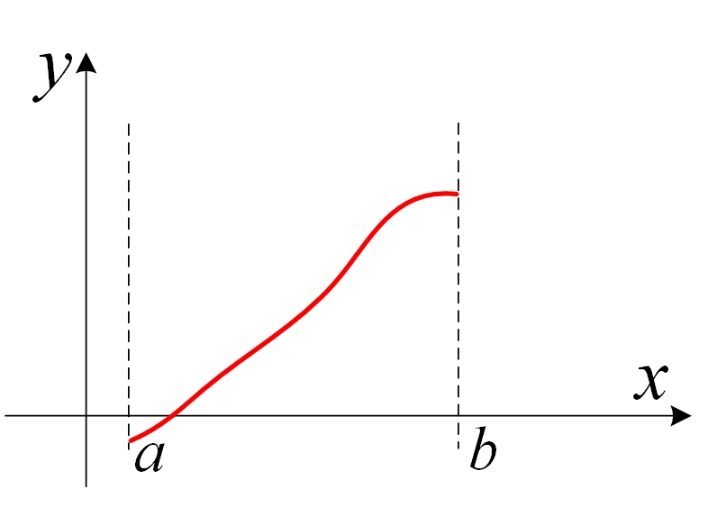
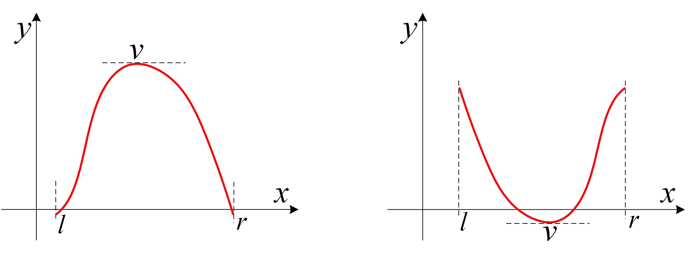
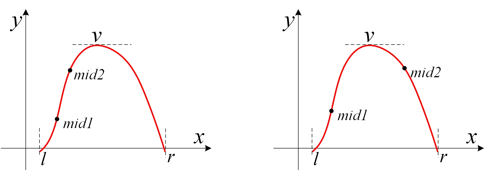
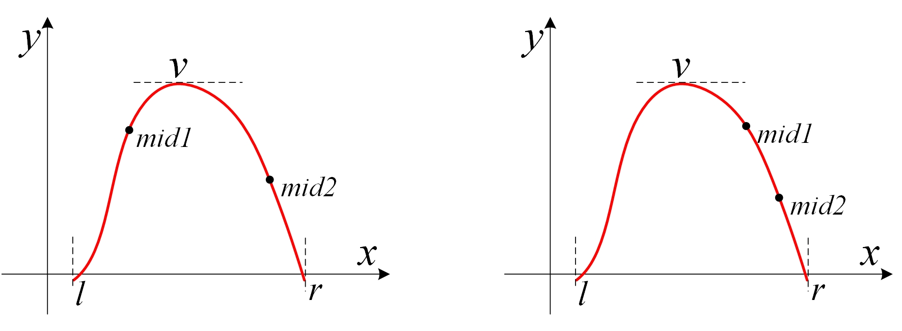

本页面将简要介绍二分查找，由二分法衍生的三分法以及二分答案。

## 二分法

### 定义

二分查找（英语：binary search），也称折半搜索（英语：half-interval search）、对数搜索（英语：logarithmic search），是用来在一个有序数组中查找某一元素的算法。

### 理论背景

在《计算方法》教材中，关于非线性方程的求根问题，有一种是二分法。

方程求根是常见的数学问题，满足方程：
 f(x)=0

的数x′称为方程的根。

所谓非线性方程，是指f(x)中含有三角函数、指数函数或其他超越函数。这种方程，很难或者无法求得精确解。不过，在实际应用中，只要得到满足一定精度要求的近似解就可以了，此时，需要考虑2个问题：

1. 根的存在性。用这个定理判定：设函数在闭区间[a,b]上连续，且f(a)∙f(b)<0，则f(x)=0存在根。
2. 求根。一般有两种方法：搜索法、二分法。

搜索法：把区间[a,b]分成n等份，每个子区间长度是∆x，计算点xk=a+kΔx, (k=0,1,2,3,4,...,n)的函数值f(xk)，若f(xk)=0，则是一个实根，若相邻两点满足f(xk)∙f(xk+1)<0，则在(xk,xk+1)内至少有一个实根，可以取(xk+xk+1)/2为近似根。

二分法：如果确定f(x)在区间[a,b]内连续，且f(a)∙f(b)<0，则至少有一个实根。二分法的操作，就是把[a,b]逐次分半，检查每次分半后区间两端点函数值符号的变化，确定有根的区间。

什么情况下用二分？两个条件：**上下界[a,b]确定、函数在[a,b]内单调。**



### 过程

以在一个升序数组中查找一个数为例。

它每次考察数组当前部分的中间元素，如果中间元素刚好是要找的，就结束搜索过程；如果中间元素小于所查找的值，那么左侧的只会更小，不会有所查找的元素，只需到右侧查找；如果中间元素大于所查找的值同理，只需到左侧查找。

二分非常高效。所以，如果问题是单调性的，且求解精确解的难度很高，可以考虑用二分法。

在算法竞赛题目中，有两种题型：整数二分、实数二分。整数域上的二分，注意终止边界、左右区间的开闭情况，避免漏掉答案或者死循环。实数域上的二分，需要注意精度问题。

### 性质

#### 时间复杂度

二分查找的最优时间复杂度为 $O(1)$。

二分查找的平均时间复杂度和最坏时间复杂度均为 $O(\log n)$。因为在二分搜索过程中，算法每次都把查询的区间减半，所以对于一个长度为 $n$ 的数组，至多会进行 $O(\log n)$ 次查找。

#### 空间复杂度

迭代版本的二分查找的空间复杂度为 $O(1)$。

递归（无尾调用消除）版本的二分查找的空间复杂度为 $O(\log n)$。

## 整数二分模板

先看一个简单问题：在有序数列a[]中查找某个数x；如果有x，找第一个x的位置；如果没有x，找比x大的第一个数的位置。通过这个问题，给出二分法的基本代码。

示例：a[] = {-12,-6,-4,3,5,5,8,9}，其中有n = 8个数，存储在a[0]～a[7]。
1. 查找x = -5，返回位置2，指向a[2] = -4；
2. 查找x = 7，返回位置6，指向a[6] = 8；
3. 特别地，如果x 大于最大的a[7] = 9，例如x = 12，返回位置8。由于不存在a[8]，所以此时是越界的。

下面是模板代码。
```cpp
int bin_search(int *a, int n, int x){
	//a[0]～a[n-1]是单调递增的 
	int left = 0, right = n; //注意：不是 n-1 
	while (left < right) { 
		int mid = left + (right-left)/2; //int mid = (left + right) >> 1; 
		if (a[mid] >= x) right = mid; 
		else left = mid + 1; 
	} //终止于left = right 
	return left; //特殊情况：a[n-1] < x时，返回n 
}
```

下面对上述代码进行补充说明：
1. 代码执行完毕后，left==right，两者相等，即答案所处的位置。
2. 复杂度：每次把搜索的范围缩小一半，总次数是log(n)。
3. 中间值写成mid = left + (right-left)/2，不能写成 mid = (left + right)/2; 有可能溢出，在有负数的情况下，会出错。

### STL 的二分查找

C++ 标准库中实现了查找首个不小于给定值的元素的函数 [`std::lower_bound`](https://zh.cppreference.com/w/cpp/algorithm/lower_bound) 和查找首个大于给定值的元素的函数 [`std::upper_bound`](https://zh.cppreference.com/w/cpp/algorithm/upper_bound)，二者均定义于头文件 `<algorithm>` 中。

二者均采用二分实现，所以调用前必须保证元素有序。

如果只是简单地找x或x附近的数，就用STL的lower_bound()和upper_bound()函数。有以下情况：
1. 查找第一个大于x的元素的位置：upper_bound()。代码例如：
pos = upper_bound(a, a+n, test) - a;
2. 查找第一个等于或者大于x的元素：lower_bound()。
3. 查找第一个与x相等的元素：lower_bound()且 = x。
4. 查找最后一个与x相等的元素：upper_bound()的前一个且 = x。
5. 查找最后一个等于或者小于x的元素：upper_bound()的前一个。
6. 查找最后一个小于x的元素：lower_bound()的前一个。
7. 单调序列中数x的个数：upper_bound() - lower_bound()。

### 例题

???+note "Two Sum"
  输入n ( n≤100,000)个整数，找出其中的两个数，它们之和等于整数m(假定肯定有解)。题中所有整数都能用int 表示。

???+note "解题思路"
  下面给出三种方法：
  1. 暴力搜，用两重循环，枚举所有的取数方法，复杂度O(n2)。超时。
  2. 二分法。首先对数组从小到大排序，复杂度O(nlogn)；然后，从头到尾处理数组中的每个元素a[i]，在a[i]后面的数中二分查找是否存在一个等于 m - a[i]的数，复杂度也是O(nlogn)。两部分相加，总复杂度仍然是O(nlogn)。
  3. 尺取法/双指针/two pointers。对于这个特定问题，更好的、标准的算法是：首先对数组从小到大排序；然后，设置两个变量L和R，分别指向头和尾，L初值是0，R初值是n-1，检查a[L]+a[R]，如果大于m，就让R减1，如果小于m，就让L加1，直至a[L]+a[R]=m。排序复杂度O(nlogn)，检查的复杂度O(n)，总复杂度O(nlogn)。检查的代码这样写：
  ```cpp
  void find_sum(int a[], int n, int m){ 
      sort(a, a + n - 1);      //先排序
      int L = 0, R = n - 1;    //L指向头，R指向尾
      while (L < R){
                int sum = a[L] + a[R];
                if (sum > m)   R--;
                if (sum < m)   L++;
                if (sum == m){     
                cout << a[L] << "    " << a[R] << endl;  //打印一种情况
                L++;   //可能有多种情况，继续
                }
      }
  }
  ```

???+note
    对于 $n$ 是有符号数的情况，当你可以保证 $n\ge 0$ 时，`n >> 1` 比 `n / 2` 指令数更少。

## 二分法的典型应用有：最小化最大值、最大化最小值。

### 最小化最大值

注意，这里的有序是广义的有序，如果一个数组中的左侧或者右侧都满足某一种条件，而另一侧都不满足这种条件，也可以看作是一种有序（如果把满足条件看做 $1$，不满足看做 $0$，至少对于这个条件的这一维度是有序的）。换言之，二分搜索法可以用来查找满足某种条件的最大（最小）的值。

要求满足某种条件的最大值的最小可能情况（最大值最小化），首先的想法是从小到大枚举这个作为答案的「最大值」，然后去判断是否合法。若答案单调，就可以使用二分搜索法来更快地找到答案。因此，要想使用二分搜索法来解这种「最大值最小化」的题目，需要满足以下三个条件：

1. 答案在一个固定区间内；
2. 可能查找一个符合条件的值不是很容易，但是要求能比较容易地判断某个值是否是符合条件的；
3. 可行解对于区间满足一定的单调性。换言之，如果 $x$ 是符合条件的，那么有 $x + 1$ 或者 $x - 1$ 也符合条件。（这样下来就满足了上面提到的单调性）

???+note "序列划分问题"
  例如，有一个序列{2,2,3,4,5,1}，将其划分成3个连续的子序列S(1)、S(2)、S(3)，每个子序列最少有一个元素，要求使得每个子序列的和的最大值最小。

  下面举例2个分法：
  
  分法1：S(1)、S(2)、S(3)分别是(2,2,3)、(4,5)、(1),子序列和分别是7、9、1，最大值是9；
  
  分法2：(2,2,3)、(4)、(5,1),子序列和是7、4、6，最大值是7。
  
  分法2更好。

???+note "解题思路"
  在一次划分中，考虑一个x，使x满足：对任意的S(i)，都有S(i)<=x，也就是说，x是所有S(i)中的最大值。题目需要求的就是找到这个最小的x。这就是最大值最小化。
  
  如何找到这个x？从小到大一个个地试，就能找到那个最小的x。
  
  简单的办法是：枚举每一个x，用贪心法每次从左向右尽量多划分元素，S(i)不能超过x，划分的子序列个数不超过m个。这个方法虽然可行，但是枚举所有的x太浪费时间了。
  
  改进的办法是：用二分法在[max, sum]中间查找满足条件的x，其中max是序列中最大元素，sum是所有元素的和。

???+note "[通往奥格瑞玛的道路](https://www.luogu.org/problem/P1462)"
  给定无向图，n个点，m条双向边，每个点有点权fi（这个点的过路费），有边权ci（这条路的血量）。求起点1到终点N的所有可能路径中，在总边权（总血量）不超过给定的b的前提下，所经过的路径中最大点权（这条路径上过路费最大的那个点）的最小值是多少。

  题目数据：n≤10000，m≤50000，fi，ci，B≤1e9。

???+note "解题思路"
  对点权fi进行二分，用dijkstra求最短路，检验总边权是否小于b。二分法是最小化最大值问题。
这一题是二分法和最短路算法的简单结合。
  1. 对点权（过路费）二分。题目的要求是：从1到N有很多路径，其中的一个可行路径Pi，它有一个点的过路费最大，记为Fi；在所有可行路径中，找到那个有最小F的路径，输出F。解题方案是：先对所有点的fi排序，然后用二分法，找符合要求的最小的fi。二分次数log(fi)=log(1e9) < 30。
  2. 在检查某个fi时，删除所有大于fi的点，在剩下的点中，求1到N的最短路，看总边权是否小于b，如果满足，这个fi是合适的（如果最短路的边权都大于b，那么其他路径的总边权就更大，肯定不符合要求）。一次Dijkstra求最短路，复杂度是O(mlogn)。
  总复杂度满足要求。

### 最大化最小值
当然，最小值最大化是同理的。

???+note "[进击的奶牛](https://www.luogu.org/problem/P1824)"
  在一条很长的直线上，指定n个坐标点（x1, ..., xn）。有c头牛，安排每头牛站在其中一个点（牛棚）上。这些牛喜欢打架，所以尽量距离远一些。问最近的两头牛之间距离的最大值可以是多少。
  
  这个题目里，所有的牛棚两两之间的距离有个最小值，题目要求使得这个最小值最大化。

???+note "解题思路"
  1. 暴力法。从小到大枚举最小距离的值dis，然后检查，如果发现有一次不行，那么上次枚举的就是最大值。如何检查呢？用贪心法：第一头牛放在x1，第二头牛放在xj≥x1+dis的点xi,第三头牛放在xk≥xj+dis的点xk，等等，如果在当前最小距离下，不能放c条牛，那么这个dis就不可取。复杂度O(nc)。
  2. 二分。分析从小到大检查dis的过程，发现可以用二分的方法找这个dis。这个dis符合二分法：它有上下边界、它是单调递增的。复杂度O(nlogn)。

???+note "参考代码"
  ```cpp
  #include<bits/stdc++.h>
  using namespace std;
  int n,c,x[100005];//牛棚数量，牛数量，牛棚坐标
  bool check(int dis){     //当牛之间距离最小为dis时，检查牛棚够不够
      int cnt=1, place=0;  //第1头牛，放在第1个牛棚
      for (int i = 1; i < n; ++i)     //检查后面每个牛棚
          if (x[i] - x[place] >= dis){ //如果距离dis的位置有牛棚
              cnt++;      //又放了一头牛
              place = i;  //更新上一头牛的位置
          }
      if (cnt >= c) return true;   //牛棚够
      else          return false;  //牛棚不够
  }
  int main(){
      scanf("%d%d",&n, &c);
      for(int i=0;i<n;i++)    scanf("%d",&x[i]);
      sort(x,x+n);             //对牛棚的坐标排序
      int left=0, right=x[n-1]-x[0];  //R=1000000也行，因为是log(n)的，很快
                        //优化：把二分上限设置为1e9/c
      int ans = 0;
      while(left < right){
          int mid = left + (right - left)/2;     //二分
          if(check(mid)){       //当牛之间距离最小为mid时，牛棚够不够?
              ans = mid;        //牛棚够，先记录mid
              left = mid + 1;   //扩大距离
            }
          else
              right = mid;      //牛棚不够，缩小距离
      }
      cout << ans;              //打印答案
      return 0;
  }
  ```

### 二分答案

解题的时候往往会考虑枚举答案然后检验枚举的值是否正确。若满足单调性，则满足使用二分法的条件。把这里的枚举换成二分，就变成了「二分答案」。

???+note "[Luogu P1873 砍树](https://www.luogu.com.cn/problem/P1873)"
    伐木工人米尔科需要砍倒 $M$ 米长的木材。这是一个对米尔科来说很容易的工作，因为他有一个漂亮的新伐木机，可以像野火一样砍倒森林。不过，米尔科只被允许砍倒单行树木。
    
    米尔科的伐木机工作过程如下：米尔科设置一个高度参数 $H$（米），伐木机升起一个巨大的锯片到高度 $H$，并锯掉所有的树比 $H$ 高的部分（当然，树木不高于 $H$ 米的部分保持不变）。米尔科就得到树木被锯下的部分。
    
    例如，如果一行树的高度分别为 $20,~15,~10,~17$，米尔科把锯片升到 $15$ 米的高度，切割后树木剩下的高度将是 $15,~15,~10,~15$，而米尔科将从第 $1$ 棵树得到 $5$ 米木材，从第 $4$ 棵树得到 $2$ 米木材，共 $7$ 米木材。
    
    米尔科非常关注生态保护，所以他不会砍掉过多的木材。这正是他尽可能高地设定伐木机锯片的原因。你的任务是帮助米尔科找到伐木机锯片的最大的整数高度 $H$，使得他能得到木材至少为 $M$ 米。即，如果再升高 $1$ 米锯片，则他将得不到 $M$ 米木材。

??? note "解题思路"
    我们可以在 $1$ 到 $10^9$ 中枚举答案，但是这种朴素写法肯定拿不到满分，因为从 $1$ 枚举到 $10^9$ 太耗时间。我们可以在 $[1,~10^9]$ 的区间上进行二分作为答案，然后检查各个答案的可行性（一般使用贪心法）。**这就是二分答案。**

??? note "参考代码"
    ```cpp
    int a[1000005];
    int n, m;
    
    bool check(int k) {  // 检查可行性，k 为锯片高度
      long long sum = 0;
      for (int i = 1; i <= n; i++)       // 检查每一棵树
        if (a[i] > k)                    // 如果树高于锯片高度
          sum += (long long)(a[i] - k);  // 累加树木长度
      return sum >= m;                   // 如果满足最少长度代表可行
    }
    
    int find() {
      int l = 1, r = 1e9 + 1;   // 因为是左闭右开的，所以 10^9 要加 1
      while (l + 1 < r) {       // 如果两点不相邻
        int mid = (l + r) / 2;  // 取中间值
        if (check(mid))         // 如果可行
          l = mid;              // 升高锯片高度
        else
          r = mid;  // 否则降低锯片高度
      }
      return l;  // 返回左边值
    }
    
    int main() {
      cin >> n >> m;
      for (int i = 1; i <= n; i++) cin >> a[i];
      cout << find();
      return 0;
    }
    ```
    
    看完了上面的代码，你肯定会有两个疑问：
    
    1.  为何搜索区间是左闭右开的？
    
        因为搜到最后，会这样（以合法的最大值为例）：
    
        
    
        然后会
    
        
    
        合法的最小值恰恰相反。
    
    2.  为何返回左边值？
    
        同上。

## 实数二分
实数域上的二分，比整数二分简单。

实数二分的基本形式
```cpp
const double eps =1e-7;        //精度。如果下面用for，可以不要eps
while(right - left > eps){     //for(int i = 0; i<100; i++){
      double mid = left+(right-left)/2;
      if (check(mid)) right = mid;           //判定，然后继续二分
      else            left  = mid;
}
```
其中，循环用2种方法都可以：
```cpp
while(right - left > eps)  { ... }
```
或者：
```cpp
for(int i = 0; i < 100; i++) { ... }
```
如果用for循环，由于循环内用了二分，执行100次，相当于实现了1/2^100的精度，一般比eps更精确。

for循环的100次，比while的循环次数要多。如果时间要求不是太苛刻，用for循环更简便

### 例题

???+note "[Pie](http://poj.org/problem?id=3122)"
  主人过生日，m个人来庆生，有n块半径不同的圆形蛋糕，由m+1个人（加上主人）分，每人的蛋糕必须一样重，而且是一整块（不能是几个蛋糕碎块，也就是说，每个人的蛋糕都是从一块圆蛋糕中切下来的完整一块）。问每个人能分到的最大蛋糕是多大。

  最小值最大化问题。设每人能分到的蛋糕大小是x，用二分法枚举x。

???+note "参考代码"
  ```cpp
  #include<stdio.h>
  #include<math.h>
  double PI = acos(-1.0);    //3.141592653589793;
  #define eps 1e-5
  double area[10010];
  int n,m;
  bool check(double mid){ 
      int sum = 0;
      for(int i=0;i<n;i++)        //把每个圆蛋糕都按大小mid分开。统计总数
          sum += (int)(area[i] / mid);
      if(sum >= m) return true;   //最后看总数够不够m个
      else         return false;
  }
  int main(){
      int T; scanf("%d",&T);
      while(T--){
          scanf("%d%d",&n,&m); m++;
          double maxx = 0;
          for(int i=0;i<n;i++){
              int r; scanf("%d",&r);
              area[i] = PI*r*r;
              if(maxx < area[i]) maxx = area[i]; //最大的一块蛋糕
          }
          double left = 0, right = maxx;  
          for(int i = 0; i<100; i++){  
          //while((right-left) > eps)   {      //for或者while都行
              double mid = left+(right-left)/2;
              if(check(mid))   left  = mid;   //每人能分到mid大小的蛋糕
              else             right = mid;   //不够分到mid大小的蛋糕
          }
          printf("%.4f\n",left);    // 打印right也对
      }
      return 0;
  }
  ```

## 三分法

### 引入
三分法求单峰（或者单谷）的极值，是二分法的一个简单扩展。

单峰函数和单谷函数如下图，函数f(x)在区间[l, r]内，只有一个极值v，在极值点两边，函数是单调变化的。以单峰函数为例，在v的左边，函数是严格单调递增的，在v右边是严格单调递减的。

(1)单峰函数　　　　　　 (2)单谷函数

???+warning "注意"
    只要函数是单峰函数，三分法既可以求出其最大值，也可以求出其最小值。为行文方便，除特殊说明外，下文中均以求单峰函数的最小值为例。

如何求单峰函数最大值的近似值？虽然不能直接用二分法，不过，只要稍微变形一下，就能用了。
在[l, r]上任取2个点，mid1和mid2，把函数分成三段。有以下情况：
1. 若f(mid1) < f(mid2)，极值点v一定在mid1的右侧。此时，mid1和mid2要么都在v的左侧，要么分别在v的两侧。如下图所示。

情况（1）：极值点v在mid1右侧
下一步，令l = mid1，区间从[l, r]缩小为[mid1, r]，然后再继续把它分成三段。
2. 同理，若f(mid1) > f(mid2)，极值点v一定在mid2的左侧。如下图所示。下一步，令 r = mid2，区间从[l, r]缩小为[l, mid2]。

情况（2）：极值点v在mid1右侧
不断缩小区间，就能使得区间[l, r]不断逼近v，从而得到近似值。

如何取mid1和mid2？有2种基本方法：
1. 三等分：mid1和mid2为[l, r]的三等分点。那么区间每次可以减少三分之一。
2. 近似三等分：计算[l, r]中间点mid = (l + r) / 2，然让mid1和mid2非常接近mid，例如mid1 = mid - eps，mid2 = mid + eps，其中eps是一个很小的值。那么区间每次可以减少接近一半。

方法（2）比方法（1）要稍微快一点。

(有网友说不要用方法（2）：“因为在有些情况下这个 eps 过小可能导致这两个算出来的相等，如果相等就有可能会判断错方向，所以其实不建议这么写，log3 和 log2 本质上是一样的。”)

注意：单峰函数的左右两边要严格单调，否则，可能在一边有f(mid1) == f(mid2)，导致无法判断如何缩小区间。

??? note "为什么不通过求导函数的零点来求极值点？"
    客观上，求出导数后，通过二分法求出导数的零点（由于函数是单峰函数，其导数在同一范围内的零点是唯一的）得到单峰函数的极值点是可行的。
    
    但首先，对于一些函数，求导的过程和结果比较复杂。
    
    其次，某些题中需要求极值点的单峰函数并非一个单独的函数，而是多个函数进行特殊运算得到的函数（如求多个单调性不完全相同的一次函数的最小值的最大值）。此时函数的导函数可能是分段函数，且在函数某些点上可能不可导。

### 另一种解释

三分法与二分法的基本思想类似，但每次操作需在当前区间 $[l,r]$（下图中除去虚线范围内的部分）内任取两点 $lmid,rmid(lmid < rmid)$（下图中的两蓝点）。如下图，如果 $f(lmid)<f(rmid)$，则在 $[rmid,r]$（下图中的红色部分）中函数必然单调递增，最小值所在点（下图中的绿点）必然不在这一区间内，可舍去这一区间。反之亦然。


???+ warning "注意"
    在计算 $lmid$ 和 $rmid$ 时，需要防止数据溢出的现象出现。

三分法每次操作会舍去两侧区间中的其中一个。为减少三分法的操作次数，应使两侧区间尽可能大。因此，每一次操作时的 $lmid$ 和 $rmid$ 分别取 $mid-\varepsilon$ 和 $mid+\varepsilon$ 是一个不错的选择。

### 实现

#### 伪代码

$$
\begin{array}{ll}
1 & \textbf{Input. } \text{A range } [l,r] \text{ meaning that the domain of } f(x) \text{.} \\
2 & \textbf{Output. } \text{The maximum value of } f(x) \text{ and the value of } x \text{ at that time } \text{.} \\
3 & \textbf{Method. } \\
4 & \textbf{while } r - l > \varepsilon\\
5 & \qquad mid\gets \frac{lmid+rmid}{2}\\
6 & \qquad lmid\gets mid - \varepsilon \\
7 & \qquad rmid\gets mid + \varepsilon \\
8 & \qquad \textbf{if } f(lmid) < f(rmid) \\
9 & \qquad \qquad r\gets mid \\
10 & \qquad \textbf{else } \\
11 & \qquad \qquad l\gets mid
\end{array}
$$

#### C++

```cpp
while (r - l > eps) {
  mid = (lmid + rmid) / 2;
  lmid = mid - eps;
  rmid = mid + eps;
  if (f(lmid) < f(rmid))
    r = mid;
  else
    l = mid;
}
```

### 例题

???+note "[洛谷 P3382 - 【模板】三分法](https://www.luogu.com.cn/problem/P3382)"
    给定一个 $N$ 次函数和范围 $[l, r]$，求出使函数在 $[l, x]$ 上单调递增且在 $[x, r]$ 上单调递减的唯一的 $x$ 的值。

??? note "解题思路"
    本题要求求 $N$ 次函数在 $[l, r]$ 取最大值时自变量的值，显然可以使用三分法。

??? note "参考代码"
  === "三等分"

    ```cpp
    #include<bits/stdc++.h>
    using namespace std;
    const double eps = 1e-6;
    int n;
    double a[15];
    double f(double x){       //计算函数值
        double s=0;
        for(int i=n;i>=0;i--) //注意函数求值的写法
            s = s*x + a[i];
        return s;
    }
    int main(){
        double L,R;
        scanf("%d%lf%lf",&n,&L,&R);
        for(int i=n;i>=0;i--) scanf("%lf",&a[i]);
        while(R-L > eps){  // for(int i = 0; i<100; i++){   //用for也行
            double k =(R-L)/3.0;
            double mid1 = L+k, mid2 = R-k;
            if(f(mid1) > f(mid2)) 
                  R = mid2;
            else   L = mid1;
        }
        printf("%.5f\n",L);
        return 0;
    }
    ```
  === "近似三等分"

    ```cpp
    #include<bits/stdc++.h>
    using namespace std;
    const double eps = 1e-6;
    int n; double a[15];
    double f(double x){
        double s=0;
        for(int i=n;i>=0;i--) s=s*x+a[i];
        return s;
    }
    int main(){
        double L,R;
        scanf("%d%lf%lf",&n,&L,&R);
        for(int i=n;i>=0;i--) scanf("%lf",&a[i]);
        while(R-L > eps){   // for(int i = 0; i<100; i++){   //用for也行
            double mid = L+(R-L)/2; 
            if(f(mid - eps) > f(mid))
                R = mid;
            else L = mid;
        }
        printf("%.5f\n",L);
        return 0;
    }
    ```
  === "OIWiki版本"
    ```cpp
    --8<-- "docs/basic/code/binary/binary_1.cpp"
    ```

### 习题

- [Uva 1476 - Error Curves](https://onlinejudge.org/index.php?option=com_onlinejudge&Itemid=8&category=447&page=show_problem&problem=4222)
- [Uva 10385 - Duathlon](https://uva.onlinejudge.org/index.php?option=com_onlinejudge&Itemid=8&category=15&page=show_problem&problem=1326)
- [UOJ 162 -【清华集训 2015】灯泡测试](https://uoj.ac/problem/162)
- [洛谷 P7579 -「RdOI R2」称重（weigh）](https://www.luogu.com.cn/problem/P7579)
- [饥饿的奶牛](https://www.luogu.org/problem/P1868)
- [寻找段落](https://www.luogu.org/problem/P1419)
- [小车问题](https://www.luogu.org/problem/P1258)
- [借教室](https://www.luogu.org/problem/P1083)
- [跳石头](https://www.luogu.org/problem/P2678)
- [聪明的质监员](https://www.luogu.org/problem/P1314)
- [分梨子](https://www.luogu.org/problem/P1493)
- [第k大](http://acm.hdu.edu.cn/showproblem.php?pid=6231)
- [三分求极值](http://hihocoder.com/problemset/problem/1142)
- [Line belt](http://acm.hdu.edu.cn/showproblem.php?pid=3400)

## 分数规划

参见：[分数规划](../misc/frac-programming.md)

分数规划通常描述为下列问题：每个物品有两个属性 $c_i$，$d_i$，要求通过某种方式选出若干个，使得 $\frac{\sum{c_i}}{\sum{d_i}}$ 最大或最小。

经典的例子有最优比率环、最优比率生成树等等。

分数规划可以用二分法来解决。
