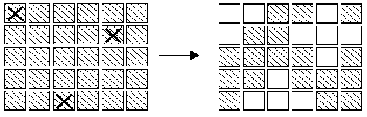

author: Early0v0, frank-xjh, Great-designer, ksyx, qiqistyle, Tiphereth-A , Saisyc, shuzhouliu, Xeonacid, xyf007

本页面将简要介绍枚举算法。

## 简介

枚举（英语：Enumerate）是基于已有知识来猜测答案的一种问题求解策略。

枚举的思想是不断地猜测，从可能的集合中一一尝试，然后再判断题目的条件是否成立。

## 要点

### 给出解空间

建立简洁的数学模型。

枚举的时候要想清楚：可能的情况是什么？要枚举哪些要素？

### 减少枚举的空间

枚举的范围是什么？是所有的内容都需要枚举吗？

在用枚举法解决问题的时候，一定要想清楚这两件事，否则会带来不必要的时间开销。

### 选择合适的枚举顺序

根据题目判断。比如例题中要求的是最大的符合条件的素数，那自然是从大到小枚举比较合适。

## 例题

以下是一个使用枚举解题与优化枚举范围的例子。

??? 例题
    一个数组中的数互不相同，求其中和为 $0$ 的数对的个数。

??? note "解题思路"
    枚举两个数的代码很容易就可以写出来。
    
    === "C++"
    
        ```cpp
        for (int i = 0; i < n; ++i)
            for (int j = 0; j < n; ++j)
                if (a[i] + a[j] == 0) ++ans;
        ```
    
    === "Python"
    
        ```python
        for i in range(n):
            for j in range(n):
                if a[i] + a[j] == 0:
                    ans += 1
        ```
    
    来看看枚举的范围如何优化。由于题中没要求数对是有序的，答案就是有序的情况的两倍（考虑如果 `(a, b)` 是答案，那么 `(b, a)` 也是答案）。对于这种情况，只需统计人为要求有顺序之后的答案，最后再乘上 $2$ 就好了。
    
    不妨要求第一个数要出现在靠前的位置。代码如下：
    
    === "C++"
    
        ```cpp
        for (int i = 0; i < n; ++i)
            for (int j = 0; j < i; ++j)
                if (a[i] + a[j] == 0) ++ans;
        ```
    
    === "Python"
    
        ```python
        for i in range(n):
            for j in range(i):
                if a[i] + a[j] == 0:
                    ans += 1
        ```
    
    不难发现这里已经减少了 $j$ 的枚举范围，减少了这段代码的时间开销。
    
    我们可以在此之上进一步优化。
    
    两个数是否都一定要枚举出来呢？枚举其中一个数之后，题目的条件已经确定了其他的要素（另一个数）的条件，如果能找到一种方法直接判断题目要求的那个数是否存在，就可以省掉枚举后一个数的时间了。较为进阶地，在数据范围允许的情况下，我们可以使用桶[^1]记录遍历过的数。
    
    === "C++"
    
        ```cpp
        bool met[MAXN * 2];
        memset(met, 0, sizeof(met));
        for (int i = 0; i < n; ++i) {
            if (met[MAXN - a[i]]) ++ans;
            met[MAXN + a[i]] = true;
        }
        ```
    
    === "Python"
    
        ```python
        met = [False] * MAXN * 2
        for i in range(n):
            if met[MAXN - a[i]]:
                ans += 1
            met[a[i] + MAXN] = True
        ```
???+note "[Face The Right Way](http://poj.org/problem?id=3276)"
    

???+note "解题思路"
    
    

???+note "[Fliptile](http://poj.org/problem?id=3279)"
    

???+note "解题思路"
    
    
    
    
    
    

### 复杂度分析

-   时间复杂度分析：对 $a$ 数组遍历了一遍就能完成题目要求，当 $n$ 足够大的时候时间复杂度为 $O(n)$。
-   空间复杂度分析：$O(n+\max\{|x|:x\in a\})$。

## 习题

<<<<<<< HEAD
??? note "[2811: 熄灯问题 - OpenJudge](http://bailian.openjudge.cn/practice/2811/)"
    有一个由按钮组成的矩阵，其中每行有6个按钮，共5行。每个按钮的位置上有一盏灯。当按下一个按钮后，该按钮以及周围位置(上边、下边、左边、右边)的灯都会改变一次。即，如果灯原来是点亮的，就会被熄灭；如果灯原来是熄灭的，则会被点亮。在矩阵角上的按钮改变3盏灯的状态；在矩阵边上的按钮改变4盏灯的状态；其他的按钮改变5盏灯的状态。

    

    在上图中，左边矩阵中用X标记的按钮表示被按下，右边的矩阵表示灯状态的改变。对矩阵中的每盏灯设置一个初始状态。请你按按钮，直至每一盏等都熄灭。与一盏灯毗邻的多个按钮被按下时，一个操作会抵消另一次操作的结果。在下图中，第2行第3、5列的按钮都被按下，因此第2行、第4列的灯的状态就不改变。

    

    在上图中，左边矩阵中用X标记的按钮表示被按下，右边的矩阵表示灯状态的改变。对矩阵中的每盏灯设置一个初始状态。请你按按钮，直至每一盏等都熄灭。与一盏灯毗邻的多个按钮被按下时，一个操作会抵消另一次操作的结果。在下图中，第2行第3、5列的按钮都被按下，因此第2行、第4列的灯的状态就不改变。

    **输入**
    
    5行组成，每一行包括6个数字（0或1）。相邻两个数字之间用单个空格隔开。0表示灯的初始状态是熄灭的，1表示灯的初始状态是点亮的。
    
    **输出**
    
    5行组成，每一行包括6个数字（0或1）。相邻两个数字之间用单个空格隔开。其中的1表示需要把对应的按钮按下，0则表示不需要按对应的按钮。
    
    样例输入
    
    0 1 1 0 1 0
    
    1 0 0 1 1 1
    
    0 0 1 0 0 1
    
    1 0 0 1 0 1
    
    0 1 1 1 0 0
    
    样例输出
    
    1 0 1 0 0 1
    
    1 1 0 1 0 1
    
    0 0 1 0 1 1
    
    1 0 0 1 0 0
    
    0 1 0 0 0 0

    ??? tip

        每个按钮最多只需要按下一次(由于两次按同一盏灯，带来的影响会被抵消)；
        
        各个按钮被按下的顺序对最终的结果没有影响；
        
        可以从第一行开始， 对第1行中每盏点亮的灯，按下第2行对应的按钮，就可以熄灭第1行的全部灯，如此重复下去，可以熄灭第1、2、3、4行的全部灯。只要在对第4行的每盏点亮的灯，按下第5行对应的按钮，熄灭第4行的全部灯后，检查第5行的灯是否全部熄灭了即可判断方案是否可行。复杂度降到了 $2^6 = 64$ 个状态，因为只需要枚举第一行的状态。

        这是很重要的枚举优化的技巧。

        如果存在某个局部，一旦这个局部的状态被确定，那么其他剩余部分的状态只能是确定的一种或不多的n种，那么只需枚举这个局部的状态即可。

        本题的这个局部就是第一行：

        因为第1行的各开关状态确定的情况下，其中的一些开关作用过后，将导致第1行某些灯是亮的，某些灯是灭的；
        要熄灭第1行某个亮着的灯(假设位于第i列)，那么唯一的办法就是按下第2行第i列的开关(因为第1行的开关已经用过了, 而第3行及其后的开关不会影响到第1行)
        为了使第1行的灯全部熄灭, 第2行的合理开关状态就是唯一的；
        第2行的开关起作用后，为了熄灭第2行的灯， 第3行的合理开关状态就也是唯一的；
        以此类推，最后一行的开关状态也是唯一的。
        只要第1行的状态定下来，记作A，那么剩余行的情况就是确定唯一的了。

        推算出最后一行的开关状态，然后看看最后一行的开关起作用后，最后一行的所有灯是否都熄灭： 如果是， 那么A就是一个解的状态；如果不是，那么A不是解的状态，第1行换个状态重新试试。

        照这样说，……，第一列不也是一个局部状态吗？对，而且只用枚举第一列，状态个数为$2^5=32$ ！

        所以，枚举第一列比枚举第一行更好。

        由于矩阵数据要么是0，要么是1，每一行只有6个字符，因此可以用一个char[5]存储整个矩阵。每一个char存储一行的数据。这不仅节约了一点空间，而且有时候很容易对整行进行操作，如设置整行和比较，提高了效率。唯一麻烦的就是要进行位操作。

    ??? note "参考代码"

        ```cpp
        #include <cstring>
        #include <iostream>
        using namespace std;
        int GetBit(char c, int i) { //得到矩阵某行的i列数 
            return (c >> i) & 1;	//取c的i位 0/1 
        }
        void SetBit(char &c, int i, int v) {
            if (v) c |= (1 << i); //置i位为1
            else c &= ~(1 << i);  //置i位为0 
        }
        void Flip(char &c, int i) { 
            c ^= (1 << i); //将c的i位取反 
        }
        void outputResult(char result[]) {
            for (int i = 0; i < 5; ++i) {
                for (int j = 0; j < 6; ++j) {
                    cout << GetBit(result[i], j);
                    if (j < 5) cout << " ";
                }
                cout << endl;
            }
        }

        int main() {
            char oriLights[5]; //最初的灯矩阵, 一个比特表示一盏灯
            char lights[5]; //中间结果
            char result[5]; //决策矩阵 
            char switchs; //某一行的开关状态 
            memset(oriLights, 0, sizeof(oriLights));
            
            for (int i = 0; i < 5; ++i) {
                for (int j = 0; j < 6; ++j) {
                    int t;
                    cin >> t;
                    SetBit(oriLights[i], j, t);
                }
            }
            
            for (int n = 0; n < 64; ++n) { //遍历首行开关的64种状态
                memcpy(lights, oriLights, sizeof(oriLights));
                switchs = n; //第i行的开关状态
                for (int i = 0; i < 5; ++i) {
                    result[i] = switchs; //第i行的开关方案, 先是第0行
                    for (int j = 0; j < 6; ++j) {
                        if (GetBit(switchs, j)) {
                            if (j > 0)
                                Flip(lights[i], j - 1); //改左灯
                            Flip(lights[i], j); //改开关位置的灯
                            if (j < 5)
                                Flip(lights[i], j + 1); //改右灯
                        }
                    }
                    if (i < 4) //不是最后一行 
                        lights[i + 1] ^= switchs; //改下一行的灯
                    switchs = lights[i]; //第i+1行开关方案和第i行灯相同 
                }
                if (lights[4] == 0) {
                    outputResult(result);
                    break;
                }
            }
            return 0;	 
        }
        ```

??? note "[Smallest Difference](http://poj.org/problem?id=2718)"
    有一列数，对其任意分成两组，每组按一定顺序可以组成一个数。除非构造的数恰好为0，否则不能以0打头。问得到的两个数的差最小是多少。

    举例来说，给定数字0，1，2，4，6与7，你可以写出10和2467。当然写法多样：210和764，204和176，等等。最后一对数差的绝对值为28，实际上没有其他对拥有更小的差。
    
    **Input**

    输入第一行的数表示随后测试用例的数量。
    
    对于每组测试用例，有一行至少两个不超过10的十进制数字。（十进制数字为0，1，…，9）每行输入中均无重复的数字。数字为升序给出，相隔恰好一个空格。
    
    **Output**

    对于每组测试用例，输出一个以上述规则可获得的最小的差的绝对值在一行。
    
    Sample Input 

    1
    
    0 1 2 4 6 7
    
    Sample Output 

    28

    ??? tip
        要想两个数的差最小，就是对半分，暴力比较求最小值。

        关键就是用next_permutation()函数求这列数的全排列，排除前导零的情况。
    
    ??? note "参考代码"

        ```cpp
        #include<cstring>
        #include<iostream>
        #include<algorithm>
        #include<cmath>
        using namespace std;
        const int INF=100000000;
        int a[15],cnt;//用cnt记录长度,mak[]记录差值 
        int ans1,ans2;
        int exchange(int i,int j){ 
            int x=0;
            for(int k=i;k<=j;k++) {
                x*=10;
                x+=a[k];
            }
            return x;
        }
        void solve(){
            int s=cnt/2,ans=INF;
            do{
                if(a[0]==0||a[s]==0)
                    continue; 
                ans1=exchange(0,s-1);
                ans2=exchange(s,cnt-1);
                //此处需要注意的是，ans初始化为0，因此结果也为0，故有ans=INF; 
                ans=min(ans,abs(ans1-ans2));
            }
            while(next_permutation(a,a+cnt));
            if(cnt==2)
                ans=abs(a[0]-a[1]);
            cout<<ans<<endl;
        }
        int main(){
            int t;
            cin>>t;
            getchar();
            while(t--){
                memset(a,0,sizeof(a));
                cnt=0;
                char ch;
                while(1){
                    scanf("%c",&ch);
                    if(ch!=' '&&ch!='\n')
                        a[cnt++]=ch-'0';
                    if(ch=='\n')
                        break;
                }
                solve();
            }
        }
        ```

??? note "[Backward Digit Sums](http://poj.org/problem?id=3187)"
    输入n,sum，求1~n的数，如何排列之后，相邻两列相加，直到得出最后的结果等于sum，输出1~n的排列(杨辉三角)

    如对于n=4，sum=16，输出序列3 1 2 4（为满足的序列中字典序最小的数列）

    ??? tip
        先用数学计算第一行的每个数对结果的贡献，然后直接枚举1-n的全排列，判断之和是不是sum。

    ??? note "参考代码"

        ```cpp
        #include <iostream>
        #include <string>
        #include <algorithm>
        using namespace std;
        
        int c(int n, int k)
        {
            int result = 1;
            for (int i = 0; i < k; ++i)
            {
                result = result * (n - i) / (i + 1);
            }
        
            return result;
        }
        int main(int argc, char *argv[])
        {
            int N, Sum;
            cin >> N >> Sum;
            int line[16];
            int i = 0;
            for (; i < N; ++i)
            {
                line[i] = i + 1;
            }
            do 
            {
                int result = 0;
                for (i = 0; i < N; ++i)
                {
                    result += c(N - 1, i) * line[i];
                }
                if (result == Sum)
                {
                    break;
                }
            } while (next_permutation(line, line + N));
            copy(line, line + N, ostream_iterator<int>(cout, " "));
            return 0;
        }
        ```

??? note "[Hopscotch](http://poj.org/problem?id=3050)"
    在5*5的格子里，填充着各种个位数，现在可以从任意点出发，上下左右移动，可以重复走过的点，每次只能走5步。问经过的格子中组成的6位数（允许有前导零的存在）有多少种？
    
    **Input**
    
    输入一个5*5的网格，每格1个1位整数。
    
    **Output**
    
    输出只有一行，为可以构造的6位数的数目。
    
    Sample Input
    
    1 1 1 1 1
    
    1 1 1 1 1
    
    1 1 1 1 1
    
    1 1 1 2 1
    
    1 1 1 1 1
    
    Sample Output
    
    15

    ??? tip
        遍历网格中的所有点，以遍历到的点为起点进行深度优先搜索，深度优先搜索递归6次后返回
        
        用set来存储所得到的数，以达到去重的目的

    ??? note "参考代码"

        ```cpp
        #include<iostream>
        #include<cstdio>
        #include<set>
        #include<iostream>
        using namespace std;
        set<int> hs;
        int maze[6][6];
        int m[4][2]={-1,0,1,0,0,-1,0,1};
        void dfs(int x,int y,int s,int num)
        {
            if(s==5)
            {
                hs.insert(num);
                return;
            }
            for(int i=0;i<4;i++)
            {
                int nx=x+m[i][0];
                int ny=y+m[i][1];
                if(nx>=0&&ny>=0&&nx<=4&&ny<=4)
                    dfs(nx,ny,s+1,num*10+maze[nx][ny]);	
            }
        }
        void solve()
        {
            for(int i=0;i<5;i++)
                for(int j=0;j<5;j++)
                    dfs(i,j,0,maze[i][j]);
            cout<<hs.size()<<endl;
        }
        int main()
        {
            for(int i=0;i<5;i++)
                for(int j=0;j<5;j++)
                    scanf("%d",&maze[i][j]);
            solve();
            return 0;
        }
        ```

??? note "[天平](https://vjudge.net/problem/UVA-1354)"
    给出房间宽度r(0 < r < 10.0)和挂坠数s(0 < s < 6)，以及s个挂坠的重量(< 1000)。现在有若干长度为1的木棒，木棒的每一端要么挂着一个木棒，要么挂着一个挂坠。用它们来设计一个尽量宽的天平（宽度不能超过房间宽度），求它的宽度（无解输出-1）.

    ??? tip
        可以把挂坠和横放的木棍都看成结点，则整个天平就是一个二叉树，且每个结点要么是叶子结点要么是有2个孩子的内部结点。

        而且不同的天平之间可以重叠。同时，对于一棵确定的二叉树，可以计算出每个天平的确切位置，进而计算出整个天平的宽度。所以，本题的核心是：如何枚举出所有需要的二叉树。下面介绍两种方法：

        **自底向上枚举**

        因为二叉树有s个叶子结点，每个内部结点2个孩子，所以一共有s-1个内部结点，即总共2s-1个结点。所以我们可以：

        将初始的s个挂坠看成s个子树
        
        每次选择两个挂坠形成新的子树加入，然后递归s-1次，则一共形成了2s-1个结点
        
        注意每次形成新子树的时候，都需要判断一下宽度是否溢出，若是则剪枝
        
        例如以4个挂坠{1,1,2,3}为例，下面画出解答树的一部分：（每个结点所能形成的所有子树并未完全画出）

        

        ```cpp
        #include<cstdio>
        #include<cstring>
        #include<cmath>
        #include<iostream>
        #include<algorithm>

        using namespace std;
        // 自下而上的递归
        const int maxs = 6; // 最多的挂坠数
        const double EPS = 1E-9; // 最大误差精度
        struct node {
            double w; // 重量
            double left, right; // 左右子树的最大宽度
            node() :left(0.0), right(0.0), w(0) {}
        }Node[2 * maxs]; // s个叶子结点和s-1个内部结点，一共2s-1个结点
        int vis[2 * maxs];
        double r;
        int s; // 宽度和挂坠数目
        double maxr; // 求得的最大宽度

        int isRight(node n) {
            // 检验宽度是否合格
            double width = n.left + n.right;
            if (width <= r + EPS) return 1;
            else return 0;
        }
        void init() {
            maxr = -1;
            memset(vis, 0, sizeof(vis));
            cin >> r >> s;
            for (int i = 0; i < s; i++) {
                cin >> Node[i].w;
                Node[i].left = Node[i].right = 0;
            }
        }

        void dfs(int index) {
            // 构造第index个结点 0-2s-2
            if (index == 2 * s - 1) {
                // 已经构造了 2s - 1 个结点
                if (Node[index - 1].left + Node[index - 1].right > maxr)
                    maxr = Node[index - 1].left + Node[index - 1].right;
                return;
            }
            // 否则从 0 到 index - 1 中找节点
            for (int i = 0; i < index; i++) {
                if (vis[i]) continue;
                vis[i] = 1;
                for (int j = 0; j < index; j++) {
                    if (vis[j]) continue;
                    vis[j] = 1;
                    Node[index].w = Node[i].w + Node[j].w;
                    // i 做左子树，j做右子树
                    double left = Node[j].w / Node[index].w;
                    double right = Node[i].w / Node[index].w;

                    Node[index].left = max(left + Node[i].left, Node[j].left - right);
                    Node[index].right = max(Node[i].right - left, right + Node[j].right);

                    if (isRight(Node[index])) dfs(index + 1);
                    vis[j] = 0; // 恢复原状
                }// for
                vis[i] = 0; // 恢复原状
            }// for
        }
        int main() {
            int t;
            cin >> t;
            while (t--) {
                init();
                if (s == 1)
                    printf("%.10lf\n", 0.0); // 特例
                else {
                    dfs(s);
                    if (maxr == -1) printf("-1\n");
                    else printf("%.16lf\n", maxr);
                }
            }
            return 0;
        }
        ```

        **自顶向下枚举（记忆化搜索）**

        上述的枚举方法有一定的优化空间，例如有些树结点被枚举了多次（上图种画黑框的部分）。所以，我们可以使用**自顶向下**的方式构造，每次枚举左右子树需要用到的子集。

        这里我们使用的是二进制表示法，使用一个二进制数来表示子集的状态，即例如有s个元素，则我们用s个二进制数来表示一个子集，当第k位为1时表示第k个元素包含在子集中；
    
        这样我们同时还能用一个数组vis[1 << s]来表示该子集是否被枚举过了

        下面我们讨论如何枚举当前子集的所可能生成的二叉树的所有情况：

        显然，二叉树的终止状态应该是该子集只包含一个元素，也就是该二进制数只包含一个1
        
        假设该二进制数包含不止一个1，则我们可以继续拆分该子集
        
        例如如果一个子集表示为1101，即其包含了{1,3,4}三个位置的元素，其可以继续拆分，例如左子树含有第{1,3}个元素，即0101，则右子树就含有第4个元素，即1000，而且这样的操作可以用异或来表示，即1101 = 0101 ^ 1000。则拆分1101有以下这几种情况：（标红表示是叶子结点）

        

        而且我们还注意到，一个子集的子集的二进制数肯定比它本身的二进制数要小，因为包含的1的个数要小，则划分子树的操作可以这样进行：

        ```cpp
        void split(int subset) {
            // 划分子集
            for (int left = (subset - 1) & subset; left; left = (left - 1)&subset) {
                // & 表示清除掉原来集合中不为1的位置
                // 例如 1101 集合下 1001 和 1011 实际上是一样的（因为第2个位置不可能是1），
                // 即 & 的结果应该一样
                int right = left ^ subset; // 异或，表示右子树的子集
            }
        }
        ```

        同时对于每个结点（表示一个子集的状态），我们需要存储其能枚举的所有二叉树，用一个数组。

        ```cpp
        #include<cstdio>
        #include<cmath>
        #include<vector>
        #include<cstring>
        #include<iostream>
        #include<algorithm>

        using namespace std;
        const int maxr = 6;

        struct node{
            double l,r; // 左右子树的最远距离
            node():l(0),r(0) {}
        };
        int vis[1 << maxr]; // 用来表示当前子集是否枚举过了
        double sum[1 << maxr]; // 用来计算子集包含挂坠的重量
        double w[maxr]; // 存储初始挂坠的重量
        vector<node> Tree[1 << maxr]; // 来存储该子集可能的二叉树
        double r; int s;

        void init() {
            cin >> r >> s;
            for (int i = 0; i < s; i++) cin >> w[i];
            // 计算子集的重量,当然也可以在dfs的时候计算
            for (int i = 0; i < (1 << s); i++) {
                vis[i] = 0;
                sum[i] = 0;
                Tree[i].clear();
                for (int j = 0; j < s; j++) {
                    if (i & (1 << j)) sum[i] += w[j]; // 该子集包含j这个元素
                }
            }
        }

        void dfs(int subset) {
            // 遍历subset这个子集，枚举其可能的二叉树
            if (vis[subset]) return;
            vis[subset] = 1;
            bool hasechild = false; // 是否是叶子结点
            for (int left = (subset - 1) & subset; left; left = (left - 1)&subset) {
                hasechild = true;
                int right = left ^ subset; // 异或，表示右子树的子集

                double d1 = sum[right] / sum[subset]; // 左子树长度
                double d2 = sum[left] / sum[subset]; // 右子树长度

                dfs(left); dfs(right);
                // 从叶子结点回溯返回
                for (int i = 0; i < Tree[left].size(); i++) {
                    for (int j = 0; j < Tree[right].size(); j++) {
                        // 遍历所有左右子树的孩子情况,可以重叠
                        node t;
                        t.l = max(Tree[left][i].l + d1, Tree[right][j].l - d2);
                        t.r  = max(Tree[right][j].r + d2, Tree[left][i].r - d1);
                        if (t.l + t.r <= r) Tree[subset].push_back(t);
                    }
                }
            }// for
            // 如果是叶子结点，则只包含一个1，没有孩子
            if (!hasechild) 
                Tree[subset].push_back(node()); 
        }
        int main() {
            int t; cin >> t;
            while (t--) {
                init();
                if (s == 1) 
                    printf("%.16lf\n", 0.0);
                else {
                    int root = (1 << s) - 1; //根结点
                    dfs(root);
                    double ans = -1;
                    for (int i = 0; i < Tree[root].size(); i++) {
                        if (Tree[root][i].l + Tree[root][i].r > ans)
                            ans = Tree[root][i].l + Tree[root][i].r;
                    }// for
                    printf("%.16lf\n", ans);
                }
            }
            return 0;
        }
        ```
=======
-   [2811: 熄灯问题 - OpenJudge](http://bailian.openjudge.cn/practice/2811/)
>>>>>>> upstream/master

## 脚注

[^1]: [桶排序](../basic/bucket-sort.md) 以及 [主元素问题](../misc/main-element.md#桶计数做法) 以及 [Stack Overflow 上对桶数据结构的讲解](https://stackoverflow.com/questions/42399355/what-is-a-bucket-or-double-bucket-data-structure)（英文）
