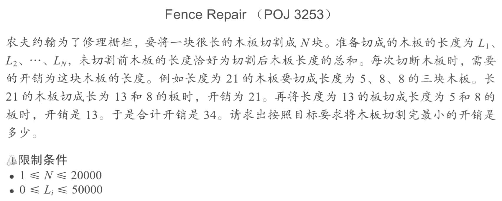
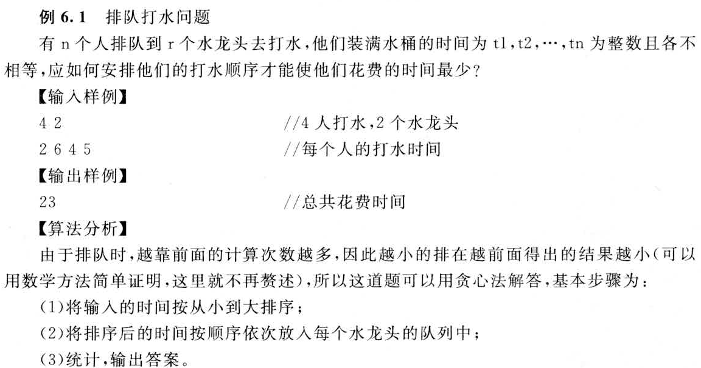

本页面将简要介绍贪心算法。

## 引入

贪心算法（英语：greedy algorithm），是用计算机来模拟一个「贪心」的人做出决策的过程。这个人十分贪婪，每一步行动总是按某种指标选取最优的操作。而且他目光短浅，总是只看眼前，并不考虑以后可能造成的影响。

可想而知，并不是所有的时候贪心法都能获得最优解，所以一般使用贪心法的时候，都要确保自己能证明其正确性。

## 解释

### 适用范围

贪心算法在有最优子结构的问题中尤为有效。最优子结构的意思是问题能够分解成子问题来解决，子问题的最优解能递推到最终问题的最优解。[^ref1]

### 证明

贪心算法有两种证明方法：反证法和归纳法。一般情况下，一道题只会用到其中的一种方法来证明。

1.  反证法：如果交换方案中任意两个元素/相邻的两个元素后，答案不会变得更好，那么可以推定目前的解已经是最优解了。
2.  归纳法：先算得出边界情况（例如 $n = 1$）的最优解 $F_1$，然后再证明：对于每个 $n$，$F_{n+1}$ 都可以由 $F_{n}$ 推导出结果。

## 要点

### 常见题型

在提高组难度以下的题目中，最常见的贪心有两种。

-   「我们将 XXX 按照某某顺序排序，然后按某种顺序（例如从小到大）选择。」。
-   「我们每次都取 XXX 中最大/小的东西，并更新 XXX。」（有时「XXX 中最大/小的东西」可以优化，比如用优先队列维护）

二者的区别在于一种是离线的，先处理后选择；一种是在线的，边处理边选择。

### 排序解法

用排序法常见的情况是输入一个包含几个（一般一到两个）权值的数组，通过排序然后遍历模拟计算的方法求出最优值。

### 后悔解法

思路是无论当前的选项是否最优都接受，然后进行比较，如果选择之后不是最优了，则反悔，舍弃掉这个选项；否则，正式接受。如此往复。

## 区别

### 与动态规划的区别

贪心算法与动态规划的不同在于它对每个子问题的解决方案都做出选择，不能回退。动态规划则会保存以前的运算结果，并根据以前的结果对当前进行选择，有回退功能。

## 例题详解

### 邻项交换法的例题

???+ note "[NOIP 2012 国王游戏](https://vijos.org/p/1779)"
    恰逢 H 国国庆，国王邀请 n 位大臣来玩一个有奖游戏。首先，他让每个大臣在左、右手上面分别写下一个整数，国王自己也在左、右手上各写一个整数。然后，让这 n 位大臣排成一排，国王站在队伍的最前面。排好队后，所有的大臣都会获得国王奖赏的若干金币，每位大臣获得的金币数分别是：排在该大臣前面的所有人的左手上的数的乘积除以他自己右手上的数，然后向下取整得到的结果。
    
    国王不希望某一个大臣获得特别多的奖赏，所以他想请你帮他重新安排一下队伍的顺序，使得获得奖赏最多的大臣，所获奖赏尽可能的少。注意，国王的位置始终在队伍的最前面。

??? note "解题思路"
    设排序后第 $i$ 个大臣左右手上的数分别为 $a_i, b_i$。考虑通过邻项交换法推导贪心策略。
    
    用 $s$ 表示第 $i$ 个大臣前面所有人的 $a_i$ 的乘积，那么第 $i$ 个大臣得到的奖赏就是 $\dfrac{s} {b_i}$，第 $i + 1$ 个大臣得到的奖赏就是 $\dfrac{s \cdot a_i} {b_{i+1}}$。
    
    如果我们交换第 $i$ 个大臣与第 $i + 1$ 个大臣，那么此时的第 $i$ 个大臣得到的奖赏就是 $\dfrac{s} {b_{i+1}}$，第 $i + 1$ 个大臣得到的奖赏就是 $\dfrac{s \cdot a_{i+1}} {b_i}$。
    
    如果交换前更优当且仅当
    
    $$
    \max \left(\dfrac{s} {b_i}, \dfrac{s \cdot a_i} {b_{i+1}}\right)  < \max \left(\dfrac{s} {b_{i+1}}, \dfrac{s \cdot a_{i+1}} {b_i}\right)
    $$
    
    提取出相同的 $s$ 并约分得到
    
    $$
    \max \left(\dfrac{1} {b_i}, \dfrac{a_i} {b_{i+1}}\right)  < \max \left(\dfrac{1} {b_{i+1}}, \dfrac{a_{i+1}} {b_i}\right)
    $$
    
    然后分式化成整式得到
    
    $$
    \max (b_{i+1}, a_i\cdot b_i)  < \max (b_i, a_{i+1}\cdot b_{i+1})
    $$
    
    实现的时候我们将输入的两个数用一个结构体来保存并重载运算符：
    
    ```cpp
    struct uv {
      int a, b;
    
      bool operator<(const uv &x) const {
        return max(x.b, a * b) < max(b, x.a * x.b);
      }
    };
    ```

### 后悔法的例题

???+ note "[「USACO09OPEN」工作调度 Work Scheduling](https://www.luogu.com.cn/problem/P2949)"
    约翰的工作日从 $0$ 时刻开始，有 $10^9$ 个单位时间。在任一单位时间，他都可以选择编号 $1$ 到 $N$ 的 $N(1 \leq N \leq 10^5)$ 项工作中的任意一项工作来完成。工作 $i$ 的截止时间是 $D_i(1 \leq D_i \leq 10^9)$，完成后获利是 $P_i( 1\leq P_i\leq 10^9 )$。在给定的工作利润和截止时间下，求约翰能够获得的利润最大为多少。

??? note "解题思路"
    1.  先假设每一项工作都做，将各项工作按截止时间排序后入队；
    2.  在判断第 `i` 项工作做与不做时，若其截至时间符合条件，则将其与队中报酬最小的元素比较，若第 `i` 项工作报酬较高（后悔），则 `ans += a[i].p - q.top()`。  
        用优先队列（小根堆）来维护队首元素最小。
    3.  当 `a[i].d<=q.size()` 可以这么理解从 0 开始到 `a[i].d` 这个时间段只能做 `a[i].d` 个任务，而若 `q.size()>=a[i].d` 说明完成 `q.size()` 个任务时间大于等于 `a[i].d` 的时间，所以当第 `i` 个任务获利比较大的时候应该把最小的任务从优先级队列中换出。

??? note "参考代码"
    === "C++"
    
        ```cpp
        --8<-- "docs/basic/code/greedy/greedy_1.cpp"
        ```
    
    === "Python"
    
        ```python
        --8<-- "docs/basic/code/greedy/greedy_1.py"
        ```

##### 复杂度分析

-   空间复杂度：当输入 $n$ 个任务时使用 $n$ 个 $a$ 数组元素，优先队列中最差情况下会储存 $n$ 个元素，则空间复杂度为 $O(n)$。

-   时间复杂度：`std::sort` 的时间复杂度为 $O(n\log n)$，维护优先队列的时间复杂度为 $O(n\log n)$，综上所述，时间复杂度为 $O(n\log n)$。


### 更多例题

???+note "区间调度"
    

    

    题解：在可选的工作中，选择结束时间最早的工作
    
    类似题：
    
    [Non-overlapping Intervals](https://leetcode.com/problems/non-overlapping-intervals/)

    [Minimum Number of Arrows to Burst Balloons](https://leetcode.com/problems/minimum-number-of-arrows-to-burst-balloons/)


???+note "[酒庄](https://vjudge.net/problem/UVA-11054)"
    


???+note "[Best Cow Line](http://poj.org/problem?id=3617)"
    

    

???+note "[Saruman's Army](http://poj.org/problem?id=3069)"
    

    

???+note "[Fence Repair](http://poj.org/problem?id=3253)"
    

    

    

???+note "[鱼塘钓鱼](http://poj.org/problem?id=1042)"
    

    

???+note "[排队打水]"
    

???+note "[删数问题]"
    

    

???+note "[导弹拦截]"
    

    

    解法2:结果等于LIS的长度

## 习题

- [Expedition](http://poj.org/problem?id=2431)
- [P1209\[USACO1.3\]修理牛棚 Barn Repair - 洛谷](https://www.luogu.com.cn/problem/P1209)
- [Cleaning Shifts](http://poj.org/problem?id=2376)
- [Radar Installation](http://poj.org/problem?id=1328)
- [Stall Reservations](http://poj.org/problem?id=3190)
- [Yogurt factory](http://poj.org/problem?id=2393)
- [Packets](http://poj.org/problem?id=1017)
- [Allowance](http://poj.org/problem?id=3040)
- [Stripies](http://poj.org/problem?id=1862)
- [Protecting the Flowers](http://poj.org/problem?id=3262)
- [P2123 皇后游戏 - 洛谷](https://www.luogu.com.cn/problem/P2123)
- [LeetCode 上标签为贪心算法的题目](https://leetcode-cn.com/tag/greedy/)

??? note "[Cow Acrobats](http://poj.org/problem?id=3045)"
    农夫的N只牛(1<=n<=50,000)决定练习特技表演。 特技表演如下:站在对方的头顶上，形成一个垂直的高度。 每头牛都有重量(1 <= W_i <= 10,000)和力量(1 <= S_i <= 1,000,000,000)。奶牛崩溃的风险等同于她身上所有的奶牛的重量(当然不包括她自己)减去她的力量。你的任务是确定奶牛的顺序，从而使得所有牛的风险中最大的一个尽量小。
    农夫的N只牛(1<=n<=50,000)决定练习特技表演。 特技表演如下:站在对方的头顶上，形成一个垂直的高度。 每头牛都有重量(1 <= W_i <= 10,000)和力量(1 <= S_i <= 1,000,000,000)。奶牛崩溃的风险等同于她身上所有的奶牛的重量(当然不包括她自己)减去她的力量。你的任务是确定奶牛的顺序，从而使得所有牛的风险中最大的一个尽量小。
    
    ??? tip
        将每头牛按照 w+s 从小到大排序，这样就得到正确的答案啦哈哈哈哈哈哈。

        **证明：**
        
        设最优解为 real_ans，自己方案的解为 ans。

        要证：ans=real_ans
    
        只需证：

        $ans\leq real\_ans$
    
        $ans\ge real\_ans$

        证明如下：

        1、由题意可知，必然有 $real\_ans\leq ans$ 。

        2、假设最优解不是按我们的算法来做的，则至少有一对牛是交换了位置的。已知第 k 头牛的特征为 $(w_k,s_k)$，第 k+1 头牛的特征为 $(w_{k+1},s_{k+1})$，且她们的风险分别为，$ris_k,ris_{k+1}$，则：

        位置 k 交换前 $ris_k=\sum_{i=1}^{k-1}w_i-s_k$ 交换后 $ris_k=\sum_{i=1}^{k-1}w_i+w_{k+1}-s_k$
​
        位置 k+1 交换前 $ris_{k+1}=\sum_{i=1}^kw_i-s_{k+1}$ 交换后 $ris_{k+1}=\sum_{i=1}^{k-1}w_i-s_{k+1}$
 
        同时减去 $\sum_{i=1}^{k-1}w_i$

        可得：

        位置 k 交换前 $-s_k$ 交换后 $w_{k+1}-s_k$
        
        位置 k+1 交换前 $w_k-s_{k+1}$ 交换后 $-s_{k+1}$

        由于 $s,w\ge1$ ，所以有：
        
        $w_{k+1}-s_k>-s_k$ $w_{k}-s_{k+1}>-s_{k+1}$

        所以，我们只要比较 $w_{k+1}-s_k$ 与 $w_k-s_{k+1}$ 的大小关系即可。
    
        两边同时加上 $s_k+s_{k+1}$ 得：
        
        $w_{k+1}+s_{k+1}$ 与 $w_k+s_k$ 。
        
        因为我们的贪心算法是按照 w+s 从小到大排序的。
        
        所以， $w_{k+1}+s_{k+1}\ge w_k+s_k$ 。
        
        所以，交换前的解要小于交换后的解，即 $ans\leq real\_ans$ 。

        证毕。

    ??? note "参考代码"

        ```cpp
        #include <bits/stdc++.h>
        #define sc scanf
        #define pf printf
        using namespace std;
        const int N = 5e4 + 10;
        const int INF = 0x3f3f3f3f;

        struct Node
        {
            int w, s;
            bool operator<(const Node &x) const
            {
                return w + s < x.w + x.s;
            }
        }cow[N];

        int main()
        {
            int n;
            sc("%d", &n);
            for(int i = 0; i < n; i++) {
                int w, s;
                sc("%d %d", &w, &s);
                cow[i] = {w, s};
            }
            sort(cow, cow + n);
            
            int ans = -INF, sum = 0;
            for(int i = 0; i < n; i++) {
                ans = max(ans, sum - cow[i].s);
                sum += cow[i].w;
            }
            pf("%d\n", ans);
            
            return 0;
        }
        ```

## 参考资料与注释

[^ref1]: [贪心算法 - 维基百科，自由的百科全书](https://zh.wikipedia.org/wiki/%E8%B4%AA%E5%BF%83%E7%AE%97%E6%B3%95)
