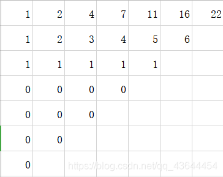
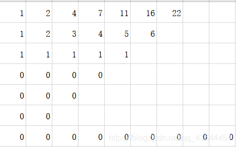
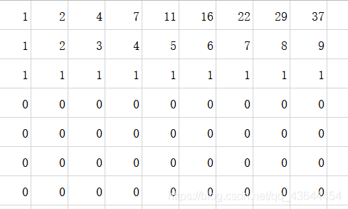

## 前缀和

### 定义

前缀和可以简单理解为「数列的前 $n$ 项的和」，是一种重要的预处理方式，能大大降低查询的时间复杂度。[^note1]

C++ 标准库中实现了前缀和函数 [`std::partial_sum`](https://zh.cppreference.com/w/cpp/algorithm/partial_sum)，定义于头文件 `<numeric>` 中。

### 例题

!!! 例题
    有 $N$ 个的正整数放到数组 $A$ 里，现在要求一个新的数组 $B$，新数组的第 $i$ 个数 $B[i]$ 是原数组 $A$ 第 $0$ 到第 $i$ 个数的和。
    
    输入：
    
    ```text
    5
    1 2 3 4 5
    ```
    
    输出：
    
    ```text
    1 3 6 10 15
    ```

??? note "解题思路"
    递推：`B[0] = A[0]`，对于 $i \ge 1$ 则 `B[i] = B[i-1] + A[i]`。

??? note "参考代码"
    ```cpp
    --8<-- "docs/basic/code/prefix-sum/prefix-sum_1.cpp"
    ```

### 二维/多维前缀和

多维前缀和的普通求解方法几乎都是基于容斥原理。

???+note "示例：一维前缀和扩展到二维前缀和"
    比如我们有这样一个矩阵 $a$，可以视为二维数组：
    
    ```text
    1 2 4 3
    5 1 2 4
    6 3 5 9
    ```
    
    我们定义一个矩阵 $\textit{sum}$ 使得 $\textit{sum}_{x,y} = \sum\limits_{i=1}^x \sum\limits_{j=1}^y a_{i,j}$，  
    那么这个矩阵长这样：
    
    ```text
    1  3  7  10
    6  9  15 22
    12 18 29 45
    ```
    
    第一个问题就是递推求 $\textit{sum}$ 的过程，$\textit{sum}_{i,j} = \textit{sum}_{i - 1,j} + \textit{sum}_{i,j - 1} - \textit{sum}_{i - 1,j - 1} + a_{i,j}$。
    
    因为同时加了 $\textit{sum}_{i - 1,j}$ 和 $\textit{sum}_{i,j - 1}$，故重复了 $\textit{sum}_{i - 1,j - 1}$，减去。
    
    第二个问题就是如何应用，譬如求 $(x_1,y_1) - (x_2,y_2)$ 子矩阵的和。
    
    那么，根据类似的思考过程，易得答案为 $\textit{sum}_{x_2,y_2} - \textit{sum}_{x_1 - 1,y_2} - sum_{x_2,y_1 - 1} + sum_{x_1 - 1,y_1 - 1}$。

#### 例题

???+note "[洛谷 P1387 最大正方形](https://www.luogu.com.cn/problem/P1387)"
    在一个 $n\times m$ 的只包含 $0$ 和 $1$ 的矩阵里找出一个不包含 $0$ 的最大正方形，输出边长。

??? tip
    解法1：动态规划
    
    $f[i][j]$表示以节点i,j为右下角，可构成的最大正方形的边长。
    
    $if (a[i][j]==1) f[i][j]=min(min(f[i][j-1],f[i-1][j]),f[i-1][j-1])+1;$

    解法2：前缀和+二分
    
    先枚举正方形左上角（i，j），然后枚举边长l，判断正方形内的元素和是否为正方形面积（元素不是0就是1嘛），如果是则ans=max（l，ans）。得到一个$O(nml^3)$;

    考虑优化：

    求矩阵内元素和当然可以使用二维前缀和啦。 也就是：sum为前缀和数组，a为矩阵元素。预处理：$sum[i][j]=sum[i][j-1]+sum[i-1][j]-sum[i-1][j-1]+a[i][j];$ 按i，j顺着推一遍就行了。求（lx,ly）到（rx,ry)这一矩阵中的元素和：$sum[rx][ry]-sum[rx][ly-1]-sum[lx-1][ry]+sum[lx-1][ly-1];$ 然后就可以把$O(nml^3)$ 优化到 $O(nml)$。然后就可以过啦

    注意到若一个正方形中元素和不为正方形面积的话，那么再枚举边长（当然是按边长从小到大枚举啦）显然没有意义，所以可以直接break。（注意到正方形面积与边长成函数关系，即$S(l)=l^2$，S(l)具有严格单调性，那么我们可以二分l啦，复杂度可以达到$O(nm \log (\min(n,m)))$ 。

    边长按从小到大枚举遇到不合法情况直接break（当然是在枚举时才能用啦）。

??? note "参考代码"
    === "动态规划"

        ```cpp
        #include <iostream>
        #include <cstdio>
        using namespace std;
        int a[101][101],n,m,f[101][101],ans;
        int main()
        {
            scanf("%d%d",&n,&m);//读入
            for (int i=1;i<=n;++i)
                for (int j=1;j<=m;++j)
                {
                    scanf("%d",&a[i][j]);
                    //因为只需用到i，j上方，左方，左上方的信息，读入同步处理
                    if (a[i][j]==1) f[i][j]=min(min(f[i][j-1],f[i-1][j]),f[i-1][j-1])+1;
                    ans=max(ans,f[i][j]);//同步更新答案
                }
            printf("%d",ans);
        }
        ```

    === "前缀和+二分"

        ```cpp
        #include <bits/stdc++.h>
        using namespace std;
        int n, m, ans = 0, x, f[205][205];
        int main() {
            scanf("%d%d", &n, &m);
            for (int i=0; i<n; ++i)
                for (int j=0; j<m; ++j) {
                    scanf("%d", &x);
                    f[i][j]= f[i-1][j]+f[i][j-1]-f[i-1][j-1]+x;
                }
            for (int i=0; i<n; ++i)
                for (int j=0; j<m; ++j) {
                    int l = 0, r = min(n,m);
                    while (l<=r) {
                        int mid = (l+r)>>1;
                        if (i+mid>n || j+mid>m || f[i+mid][j+mid]-f[i+mid][j]-f[i][j+mid]+f[i][j] < mid*mid) r = mid-1;
                            else l = mid+1;
                    }
                    if (f[i+r][j+r]-f[i+r][j]-f[i][j+r]+f[i][j] == r*r) ans = max(ans, r);
                }
            cout << ans;
            return 0;
        }
        ```

    === "OI-Wiki"

        ```cpp
        --8<-- "docs/basic/code/prefix-sum/prefix-sum_2.cpp"
        ```

### 基于 DP 计算高维前缀和

基于容斥原理来计算高维前缀和的方法，其优点在于形式较为简单，无需特别记忆，但当维数升高时，其复杂度较高。这里介绍一种基于 [DP](../dp/basic.md) 计算高维前缀和的方法。该方法即通常语境中所称的 **高维前缀和**。

设高维空间 $U$ 共有 $D$ 维，需要对 $f[\cdot]$ 求高维前缀和 $\text{sum}[\cdot]$。令 $\text{sum}[i][\text{state}]$ 表示同 $\text{state}$ 后 $D - i$ 维相同的所有点对于 $\text{state}$ 点高维前缀和的贡献。由定义可知 $\text{sum}[0][\text{state}] = f[\text{state}]$，以及 $\text{sum}[\text{state}] = \text{sum}[D][\text{state}]$。

其递推关系为 $\text{sum}[i][\text{state}] = \text{sum}[i - 1][\text{state}] + \text{sum}[i][\text{state}']$，其中 $\text{state}'$ 为第 $i$ 维恰好比 $\text{state}$ 少 $1$ 的点。该方法的复杂度为 $O(D \times |U|)$，其中 $|U|$ 为高维空间 $U$ 的大小。

一种实现的伪代码如下：

    for state
      sum[state] = f[state];
    for(i = 0;i <= D;i += 1)
      for 以字典序从小到大枚举 state
        sum[state] += sum[state'];

### 树上前缀和

设 $\textit{sum}_i$ 表示结点 $i$ 到根节点的权值总和。  
然后：

- 若是点权，$x,y$ 路径上的和为 $\textit{sum}_x + \textit{sum}_y - \textit{sum}_\textit{lca} - \textit{sum}_{\textit{fa}_\textit{lca}}$。
-   若是边权，$x,y$ 路径上的和为 $\textit{sum}_x + \textit{sum}_y - 2\cdot\textit{sum}_{lca}$。

    LCA 的求法参见 [最近公共祖先](../graph/lca.md)。

## 差分

### 解释

差分是一种和前缀和相对的策略，可以当做是求和的逆运算。

这种策略的定义是令 $b_i=\begin{cases}a_i-a_{i-1}\,&i \in[2,n] \\ a_1\,&i=1\end{cases}$

差分是一种处理数据的巧妙而简单的方法，它应用于区间的修改和询问问题。把给定的数据元素集A分成很多区间，对这些区间做很多次操作，每次操作是对某个区间内的所有元素做相同的加减操作，若一个个地修改这个区间内的每个元素，非常耗时。引入“差分数组”D，当修改某个区间时，只需要修改这个区间的“端点”，就能记录整个区间的修改，而对端点的修改非常容易，是𝑂(1)复杂度的。当所有的修改操作结束后，再利用差分数组，计算出新的A。

数据A可以是一维的线性数组𝑎\[\]、二维矩阵𝑎\[\]\[\]、三维立体𝑎\[\]\[\]\[\]。相应地，定义差分数组𝐷\[\]、𝐷\[\]\[\]、𝐷\[\]\[\]\[\]。一维差分很容易理解，二维和三维需要一点想象力。

- $a_i$ 的值是 $b_i$ 的前缀和，即 $a_n=\sum\limits_{i=1}^nb_i$
- 计算 $a_i$ 的前缀和 $sum=\sum\limits_{i=1}^na_i=\sum\limits_{i=1}^n\sum\limits_{j=1}^{i}b_j=\sum\limits_{i}^n(n-i+1)b_i$

它可以维护多次对序列的一个区间加上一个数，并在最后询问某一位的数或是多次询问某一位的数。注意修改操作一定要在查询操作之前。

### 一维差分

讨论这样一个场景：

1. 给定一个长度为n的一维数组𝑎\[\]，数组内每个元素有初始值。
2. 修改操作：做m次区间修改，每次修改对区间内所有元素做相同的加减操作。例如第𝑖次修改，把区间\[𝐿𝑖,𝑅𝑖\]内所有元素加上𝑑𝑖。
3. 询问操作：询问一个元素的新值是多少。

如果简单地用暴力法编码，那么每次修改的复杂度是𝑂(𝑛)的，m次修改共𝑂(𝑚𝑛)，总复杂度𝑂(𝑚𝑛)，效率很差。利用差分法，可以把复杂度减少到𝑂(𝑚+𝑛)。

在差分法中，用到了两个数组：原数组𝑎\[\]、差分数组𝐷\[\]。

差分数组D\[\]的定义是𝐷\[𝑘\]=𝑎\[𝑘\]−𝑎\[𝑘−1\]，即原数组𝑎\[\]的相邻元素的差。从定义可以推出𝑎\[𝑘\]=𝐷\[1\]+𝐷\[2\]+...+𝐷\[𝑘\]，也就是说，𝑎\[\]是𝐷\[\]的前缀和。这个公式揭示了𝑎\[\]和𝐷\[\]的关系，“差分是前缀和的逆运算”，它把求𝑎\[𝑘\]转化为求D的前缀和。为加深对前缀和的理解，可以把每个𝐷\[\]看成一条直线上的小线段，它的两端是相邻的𝑎\[\]；这些小线段相加，就得到了从起点开始的长线段𝑎\[\]。

注意，𝑎\[\]和𝐷\[\]的值都可能为负，下面图中所有的𝐷\[\]都是长度为正的线段，只是为了方便图示。


图: 把每个D\[\]看成小线段，把每个a\[\]看成从a\[1\]开始的小线段的和

如何用差分数组记录区间修改？为什么利用差分数组能提升修改的效率呢？

把区间\[𝐿,𝑅\]内每个元素加上𝑑，对应的𝐷\[\]做以下操作：

（1）把𝐷\[𝐿\]加上𝑑：

     D[L] += d

（2）把𝐷\[𝑅+1\]减去𝑑：

     D[R+1] -= d

每次操作只需要修改区间\[𝐿,𝑅\]的两个端点的𝐷\[\]值，复杂度是𝑂(1)的。经过这种操作后，原来直接在𝑎\[\]上做的复杂度为𝑂(𝑛)的区间修改操作，就变成了在𝐷\[\]上做的复杂度为𝑂(1)的端点操作。

利用𝐷\[\]，能精确地实现只修改区间内元素的目的，而不会修改区间外的𝑎\[\]值。因为前缀和𝑎\[𝑥\]=𝐷\[1\]+𝐷\[2\]+...+𝐷\[𝑥\]，有：

1. 1≤𝑥<𝐿，前缀和𝑎\[𝑥\]不变；
2. 𝐿≤𝑥≤𝑅，前缀和𝑎\[𝑥\]增加了𝑑；
3. 𝑅<𝑥≤𝑁，前缀和𝑎\[𝑥\]不变，因为被𝐷\[𝑅+1\]中减去的𝑑抵消了。

完成区间修改并得到𝐷\[\]后，最后用𝐷\[\]计算𝑎\[\]，复杂度是𝑂(𝑛)的。m次区间修改和1次查询，总复杂度为𝑂(𝑚+𝑛)，比暴力法的𝑂(𝑚𝑛)好多了。

???+note "示例"
    譬如使 $[l,r]$ 中的每个数加上一个 $k$，即
    
    $$
    b_l \leftarrow b_l + k,b_{r + 1} \leftarrow b_{r + 1} - k
    $$
    
    其中 $b_l+k=a_l+k-a_{l-1}$，$b_{r+1}-k=a_{r+1}-(a_r+k)$
    
    最后做一遍前缀和就好了。

C++ 标准库中实现了差分函数 [`std::adjacent_difference`](https://zh.cppreference.com/w/cpp/algorithm/adjacent_difference)，定义于头文件 `<numeric>` 中。


???+note "[Color the ball](http://acm.hdu.edu.cn/showproblem.php?pid=1556)"
    **问题描述：** N个气球排成一排，从左到右依次编号为1, 2, 3 .... N。每次给定2个整数L, R(L<= R)，lele从气球L开始到气球R依次给每个气球涂一次颜色。但是N次以后lele已经忘记了第I个气球已经涂过几次颜色了，你能帮他算出每个气球被涂过几次颜色吗？
    
    **输入：** 每个测试实例第一行为一个整数N，(N <= 100000)。接下来的N行，每行包括2个整数L, R(1 <= L<= R<= N)。当N = 0，输入结束。
    
    **输出：**每个测试实例输出一行，包括N个整数，第I个数代表第I个气球总共被涂色的次数。

???+note "解题思路"
    这个例题是简单差分法的直接应用，下面给出代码。代码第13、14行是区间修改，第17行的a\[i\]=a\[i−1\]+D\[i\]，即利用D\[\]求得了最后的a\[\]。这个式子就是a\[i\]−a\[i−1\]=D\[i\]，它是差分数组的定义。
    
    注意a\[\]的计算方法。a\[i\]=a\[i−1\]+D\[i\]是一个递推公式，通过它能在一个i循环中求得所有的a\[\]。如果不用递推，而是直接用前缀和a\[k\]=D\[1\]+D\[2\]+...+D\[k\] 来求所有的a\[\]，就需要用两个循环i、k。

???+note "参考代码"

    ```cpp
    #include<bits/stdc++.h>
    using namespace std;
    const int Maxn = 100010;
    int a[Maxn],D[Maxn];               //a是气球，D是差分数组
    int main(){
        int n;
        while(~scanf("%d",&n)) { 
            memset(a,0,sizeof(a)); memset(D,0,sizeof(D));
            for(int i=1;i<=n;i++){
                int L,R; scanf("%d%d",&L,&R);
                D[L]++;                 //区间修改，这里d=1
                D[R+1]--;
            }
    //小技巧：17行到20行，把a[]改成D[]也行
            for(int i=1;i<=n;i++){              //求原数组
                a[i] = a[i-1] + D[i];           //差分。求前缀和a[]，a[i]就是气球i的值
                if(i!=n)  printf("%d ", a[i]);  //逐个打印结果
                else      printf("%d\n",a[i]);
            }        
        }
        return 0;
    }
    ```

    上面的代码用了一个小技巧，可以省掉𝑎\[\]，从而节省空间。在17行后求原数组𝑎\[\]的时候，在推导式子𝑎\[𝑖\]=𝑎\[𝑖−1\]+𝐷\[𝑖\]时，把已经使用过的较小的𝐷\[\]直接当成𝑎\[\]即可。把第17~20行的𝑎\[\]改为𝐷\[\]，也能通过。这个技巧在后面的二维差分、三维差分中也能用，节省一倍的空间。

读者已经注意到，利用差分数组𝐷\[\]可以把𝑂(𝑛)的区间修改，变成𝑂(1)的端点修改，从而提高了修改操作的效率。

但是，一次查询操作，即查询某个𝑎\[𝑖\]，需要用𝐷\[\]计算整个原数组𝑎\[\]，计算量是𝑂(𝑛)的，即一次查询的复杂度是𝑂(𝑛)的。在上面的例题中，如果查询不是发生了一次，而是这样：有m次修改，有k次查询，且修改和查询的顺序是随机的。此时总复杂度是：m次修改复杂度𝑂(𝑚)，k次查询复杂度𝑂(𝑘𝑛)，总复杂度𝑂(𝑚+𝑘𝑛)。还不如直接用暴力法，总复杂度𝑂(𝑚𝑛+𝑘)。

这种题型是“区间修改+单点查询”，用差分数组往往不够用。因为差分数组对“区间修改”很高效，但是对“单点查询”并不高效。此时需要用树状数组和线段树来求解，在树状数组专题中，重新讲解了hdu 1556这道例题。

树状数组常常结合差分数组来解决更复杂的问题，差分数组也常用于“树上差分”，

### 二维差分

从一维差分容易扩展到二维差分。一维是线性数组，一个区间\[L,R\]有两个端点；二维是矩阵，一个区间由四个端点围成。

???+note "[地毯](https://www.luogu.com.cn/problem/P3397)"
    **问题描述：** 在 n×n 的格子上有m个地毯。给出这些地毯的信息，问每个点被多少个地毯覆盖。
    
    **输入：** 第一行是两个正整数n，m。接下来m行，每行2个坐标(x1, y1)和(x2, y2)，代表一块地毯，左上角是(x1, y1)，右下角是(x2, y2)。
    
    **输出：** 输出n行，每行n个正整数。第i行第j列的正整数表示(i, j)这个格式被多少地毯覆盖。

???+note "解题思路"
    这一题是hdu 1556的二维扩展，其修改操作和查询操作完全一样。
    
    存储矩阵需要很大的空间。如果题目有空间限制，例如100M，那么二维差分能处理多大的n？定义两个二维矩阵𝑎\[\]\[\]和𝐷\[\]\[\]，设矩阵的每个元素是2字节的𝑖𝑛𝑡型，可以计算出最大的n = 5000。不过，也可以不定义𝑎\[\]\[\]，而是像一维情况下一样，直接用𝐷\[\]\[\]来表示𝑎\[\]\[\]，这样能剩下一半的空间。
    
    在用差分之前，先考虑能不能用暴力法。每次修改复杂度是𝑂(𝑛^2 )，共m次，总复杂度𝑂(𝑚×𝑛^2 )，超时。
    
    二维差分的复杂度是多少？一维差分的一次修改是𝑂(1)的，二维差分的修改估计也是𝑂(1)的；一维差分的一次查询是𝑂(𝑛)的，二维差分是𝑂(𝑛^2 ))的，所以二维差分的总复杂度是𝑂(𝑚+𝑛^2 )。由于计算一次二维矩阵的值需要𝑂(𝑛^2 )次计算，所以二维差分已经达到了最好的复杂度。
    
    下面从一维差分推广到二维差分。
    
    （1）前缀和。
    
    在一维差分中，原数组𝑎\[\]是从第1个𝐷\[1\]开始的差分数组𝐷\[\]的前缀和：𝑎\[𝑘\]=𝐷\[1\]+𝐷\[2\]+...+𝐷\[𝑘\]。
    
    在二维差分中，𝑎\[\]\[\]是差分数组𝐷\[\]\[\]的前缀和，即由原点坐标(1,1)和坐标(i,j)围成的矩阵中，所有的𝐷\[\]\[\]相加等于𝑎\[𝑖\]\[𝑗\]。为加深对前缀和的理解，可以把每个𝐷\[\]\[\]看成一个小格；在坐标(1,1)和(𝑖,𝑗)所围成的范围内，所有小格子加起来的总面积，等于𝑎\[𝑖\]\[𝑗\]。下面的图中，每个格子的面积是一个𝐷\[\]\[\]，例如阴影格子是𝐷\[𝑖\]\[𝑗\]，它由4个坐标点定义：(𝑖−1,𝑗)、(𝑖,𝑗)、(𝑖−1,𝑗−1)、(𝑖,𝑗−1)。坐标点(i,j)的值是𝑎\[𝑖\]\[𝑗\]，它等于坐标(1,1)和(𝑖,𝑗)所围成的所有格子的总面积。图中故意把小格子画得长宽不同，是为了体现它们的面积不同。

    

    把每个a\[\]\[\]看成总面积，把每个D\[\]\[\]看成小格子的面积 

    注意在一些题目中，𝐷\[\]\[\]可以为负。图中把𝐷\[\]\[\]用“面积”来演示，而面积都是正的，这个图示只是为了加深对前缀和的理解。
    
    （2）差分的定义。在一维情况下，𝐷\[𝑖\]=𝑎\[𝑖\]−𝑎\[𝑖−1\]。在二维情况下，差分变成了相邻的𝑎\[\]\[\]的“面积差”，计算公式是：𝐷\[𝑖\]\[𝑗\]=𝑎\[𝑖\]\[𝑗\]–𝑎\[𝑖−1\]\[𝑗\]–𝑎\[𝑖\]\[𝑗−1\]+𝑎\[𝑖−1\]\[𝑗−1\]。这个公式可以通过上面的图来观察。阴影方格表示𝐷\[𝑖\]\[𝑗\]的值，它的面积这样求：大面积𝑎\[𝑖\]\[𝑗\]减去两个小面积𝑎\[𝑖−1\]\[𝑗\]、𝑎\[𝑖\]\[𝑗−1\]，由于两个小面积的公共面积𝑎\[𝑖−1\]\[𝑗−1\]被减了2次，所以需要加回来1次。
    
    （3）区间修改。在一维情况下，做区间修改只需要修改区间的两个端点的𝐷\[\]值。在二维情况下，一个区间是一个小矩阵，有4个端点，只需要修改这4个端点的𝐷\[\]\[\]值。例如坐标点(𝑥1,𝑦1) ~ (𝑥2,𝑦2)定义的区间，对应4个端点的𝐷\[\]\[\]：

    ```cpp
    D[x1][y1]     += d;     //二维区间的起点
    D[x1][y2+1]   -= d;     //把x看成常数，y从y1到y2+1
    D[x2+1][y1]   -= d;     //把y看成常数，x从x1到x2+1
    D[x2+1][y2+1] += d;     //由于前两式把d减了2次，多减了1次，这里加1次回来
    ```
    
    下图是区间修改的图示。2个黑色点围成的矩形是题目给出的区间修改范围。只需要改变4个𝐷\[\]\[\]值，即改变图中的4个阴影块的面积。读者可以用这个图，观察每个坐标点的𝑎\[\]\[\]值的变化情况。例如符号“∆”标记的坐标(𝑥2+1,𝑦2)，它在修改的区间之外；𝑎\[𝑥2+1\]\[𝑦2\]的值是从(1,1)到(𝑥2+1,𝑦2)的总面积，在这个范围内，𝐷\[𝑥1\]\[𝑦1\]+𝑑，𝐷\[𝑥2+1\]\[𝑦1\]−𝑑，两个𝑑抵消，𝑎\[𝑥2+1\]\[𝑦2\]保持不变。

    
    
    二维差分的区间修改 

???+note "参考代码"
    下面给出洛谷P3397的两种实现。
    
    1）用差分数组的递推公式求前缀和
    
    前缀和𝑎\[\]\[\]的计算用到了递推公式：
    
    𝑎\[𝑖\]\[𝑗\]=𝐷\[𝑖\]\[𝑗\]+𝑎\[𝑖−1\]\[𝑗\]+𝑎\[𝑖\]\[𝑗−1\]−𝑎\[𝑖−1\]\[𝑗−1\];
    
    16行到23行用𝐷\[\]\[\]推出𝑎\[\]\[\]并打印出来。
    
    为了节约空间，可以不定义𝑎\[\]\[\]，而是把用过的𝐷\[\]\[\]看成𝑎\[\]\[\]。这个小技巧在一维差分中介绍过。

    ```cpp
    #include<bits/stdc++.h>
    using namespace std;
    int D[5000][5000];     //差分数组
    //int a[5000][5000];   //原数组，不定义也行
    int main(){
        int n,m;
        scanf("%d%d",&n,&m);
        while(m--){
            int x1,y1,x2,y2;
            scanf("%d%d%d%d",&x1,&y1,&x2,&y2);
            D[x1][y1]     += 1;        //计算差分数组
            D[x2+1][y1]   -= 1;
            D[x1][y2+1]   -= 1;
            D[x2+1][y2+1] += 1;
        }
        for(int i=1;i<=n;++i){   //根据差分数组计算原矩阵的值（想象成求小格子的面积和）
            for(int j=1;j<=n;++j){      //把用过的D[][]看成a[][]，就不用再定义a[][]了
                //a[i][j] = D[i][j] + a[i-1][j] + a[i][j-1] - a[i-1][j-1];
                //printf("%d ",a[i][j]);  //这两行和下面两行的效果一样
                D[i][j] += D[i-1][j]+D[i][j-1]-D[i-1][j-1];
                printf("%d ",D[i][j]);
            }
            printf("\n");//换行
        }
        return 0;
    }
    ```

    2)直接计算前缀和
    
    其实不用递推公式，而是直接求前缀和也行。根据图2，前缀和是总面积，分别从x方向和y方向，用两次循环计算，并直接用D\[\]\[\]记录结果，最后算出的D\[\]\[\]就是a\[\]\[\]。

    

    在D\[\]\[\]上计算前缀和 
    
    以阴影处的𝐷\[2\]\[2\]为例，它最后的值代表𝑎\[2\]\[2\]，是4个小格子的总面积：
    
    𝐷\[1\]\[1\]+𝐷\[1\]\[2\]+𝐷\[2\]\[1\]+𝐷\[2\]\[2\]
    
    计算过程是：
    
    （1）先累加计算𝑦方向，得：
    
    𝐷\[1\]\[2\]=𝐷\[1\]\[1\]+𝐷\[1\]\[2\]、𝐷\[2\]\[2\]=𝐷\[2\]\[1\]+𝐷\[2\]\[2\]
    
    （2）再累加计算𝑥方向，得：
    
    𝐷\[2\]\[1\]=𝐷\[1\]\[1\]+𝐷\[2\]\[1\]、𝐷\[2\]\[2\]=𝐷\[1\]\[2\]+𝐷\[2\]\[2\]=𝐷\[1\]\[1\]+𝐷\[1\]\[2\]+𝐷\[2\]\[1\]+𝐷\[2\]\[2\]
    
    实际上，在这个计算过程中，𝐷\[1\]\[1\]、𝐷\[1\]\[2\]、𝐷\[2\]\[1\]、𝐷\[2\]\[2\]都更新了，计算结果代表了𝑎\[1\]\[1\]、𝑎\[1\]\[2\]、𝑎\[2\]\[1\]、𝑎\[2\]\[2\]。
    
    把方法1代码的16-24行替换为下面的代码，最后得到的𝐷\[\]\[\]就是所有的前缀和，即最新的𝑎\[\]\[\]。请对照图2理解代码。

    ```cpp
    for(int i=1; i<=n; ++i)           
        for(int j=1; j<n; ++j)        //注意这里是j<n
            D[i][j+1] += D[i][j];     //把i看成定值，先累加计算j方向
    for(int j=1; j<=n; ++j)
        for(int i=1; i<n; ++i)        //注意这里是i<n
            D[i+1][j] += D[i][j];     //把j看成定值，再累加计算i方向
    for(int i=1; i<=n; ++i) {         //打印
        for(int j=1; j<=n; ++j)
             printf("%d ",D[i][j]);
        printf("\n");                 //换行
    }
    ```

    对比这两种代码：
    
    1. 这两种代码的复杂度是一样的。从计算量上看，没有优劣之分。
    2. 代码2不如代码1清晰简洁，所以代码2这种写法一般也用不着。
    3. 代码2也有优点，它不需要用到递推公式，而是直接求前缀和。
    
    这里给出代码2这种方法，是为了在下一小节的三维差分中使用它。由于在三维情况下，差分数组的𝐷\[\]\[\]\[\]和原数组𝑎\[\]\[\]\[\]的递推公式很难写出来，所以用代码2这种方法更容易编码。
    
### 三维差分

三维差分的模板代码比较少见。

三维差分比较复杂，请结合本节中的几何图进行理解。

与一维差分、二维差分的思路类似，下面给出三维差分的有关特性。

（1）元素的值用三维数组𝑎\[\]\[\]\[\]来定义，差分数组𝐷\[\]\[\]\[\]也是三维的。把三维差分想象成在立体空间上的操作。一维的区间是一个线段，二维是矩形，那么三维就是立体块。一个小立体块有8个顶点，所以三维的区间修改，需要修改8个𝐷\[\]\[\]\[\]值。

（2）前缀和。

在二维差分中，𝑎\[\]\[\]是差分数组𝐷\[\]\[\]的前缀和，即由原点坐标(1,1)和坐标(i,j)围成的矩阵中，所有的𝐷\[\]\[\]（看成小格子）相加等于𝑎\[𝑖\]\[𝑗\]（看成总面积）。

在三维差分中，𝑎\[\]\[\]\[\]是差分数组𝐷\[\]\[\]\[\]的前缀和。即由原点坐标(1,1,1)和坐标(𝑖,𝑗,𝑘)所标记的范围中，所有的𝐷\[\]\[\]\[\]相加等于𝑎\[𝑖\]\[𝑗\]\[𝑘\]。把每个𝐷\[\]\[\]\[\]看成一个小立方体；在坐标(1,1,1)和(𝑖,𝑗,𝑘)所围成的空间中，所有小立体块加起来的总体积，等于𝑎\[𝑖\]\[𝑗\]\[𝑘\]。每个小立方体由8个坐标点定义，见下面图中的坐标点。坐标点(𝑖,𝑗,𝑘)的值是𝑎\[𝑖\]\[𝑗\]\[𝑘\]；𝐷\[𝑖\]\[𝑗\]\[𝑘\]的值是图中小立方体的体积。


立体的坐标 

（3）差分的定义。在三维情况下，差分变成了相邻的𝑎\[\]\[\]\[\]的“体积差”。如何写出差分的递推计算公式？

一维差分和二维差分的递推计算公式很好写。

三维差分，𝐷\[𝑖\]\[𝑗\]\[𝑘\]的几何意义是图中小立方体的体积，它可以通过这个小立方体的8个顶点的值推出来。思路与二维情况下类似，二维的𝐷\[\]\[\]是通过小矩形的四个顶点的𝑎\[\]\[\]值来计算的。不过，三维情况下，递推计算公式很难写，8个顶点有8个𝑎\[\]\[\]\[\]，把脑袋绕晕了也不容易写对。

上一小节的二维差分中，曾用过另一种方法，直接对D数组求前缀和。在三维情况下也可以用这种方法求前缀和，得到所有的𝑎\[\]\[\]\[\]的最新值。

（4）区间修改。在三维情况下，一个区间是一个立方体，有8个顶点，只需要修改这8个顶点的𝐷\[\]\[\]\[\]值。例如坐标点(𝑥1,𝑦1,𝑧1) ~(𝑥2,𝑦2,𝑧2)定义的区间，对应8个𝐷\[\]\[\]\[\]，请对照上面的图来想象它们的位置。

```cpp
D[x1][y1][z1]       += d;   //前面：左下顶点，即区间的起始点
D[x2+1][y1][z1]     -= d;   //前面：右下顶点的右边一个点
D[x1][y1][z2+1]     -= d;   //前面：左上顶点的上面一个点
D[x2+1][y1][z2+1]   += d;   //前面：右上顶点的斜右上方一个点
D[x1][y2+1][z1]     -= d;   //后面：左下顶点的后面一个点
D[x2+1][y2+1][z1]   += d;   //后面：右下顶点的斜右后方一个点
D[x1][y2+1][z2+1]   += d;   //后面：左上顶点的斜后上方一个点
D[x2+1][y2+1][z2+1] -= d;   //后面：右上顶点的斜右上后方一个点，即区间终点的后一个点
```

下面给出一个三维差分的例题。

???+note "[三体攻击](https://www.lanqiao.cn/problems/180/learning/)"
    **问题描述：** 三体人将对地球发起攻击。为了抵御攻击，地球人派出了n = A × B × C 艘战舰，在太空中排成一个 A 层 B 行 C 列的立方体。其中，第 i 层第 j 行第 k 列的战舰(记为战舰 (i, j, k))的生命值为 s(i, j, k)。
    
    三体人将会对地球发起 m 轮“立方体攻击”，每次攻击会对一个小立方体中的所有战舰都造成相同的伤害。具体地，第 t 轮攻击用 7 个参数 x1, x2, y1, y2, z1, z2, d 描述；
    
    所有满足$i∈[x1, x2], j∈[y1, y2], k∈[z1, z2]$ 的战舰 (i, j, k) 会受到 d 的伤害。如果一个战舰累计受到的总伤害超过其防御力，那么这个战舰会爆炸。
    
    地球指挥官希望你能告诉他，第一艘爆炸的战舰是在哪一轮攻击后爆炸的。
    
    **输入：** 第一行包括 4 个正整数 A, B, C, m；
    
    第二行包含 A × B × C 个整数，其中第 ((i − 1)×B + (j − 1)) × C + (k − 1)+1 个数为 s(i, j, k)；
    
    第 3 到第 m + 2 行中，第 (t − 2) 行包含 7 个正整数 x1, x2, y1, y2, z1, z2, d。
    
    A × B × C ≤ 10^6 , m ≤ 10^6 , 0 ≤ s(i, j, k), d ≤ 10^9 。
    
    **输出：** 输出第一个爆炸的战舰是在哪一轮攻击后爆炸的。保证一定存在这样的战舰。

???+note "解题思路"
    首先看数据规模，有𝑛=10^6 个点， 𝑚=10^6 次攻击，如果用暴力法，统计每次攻击后每个点的生命值，那么复杂度是𝑂(𝑚𝑛)的，超时。
    
    本题适合用三维差分，每次攻击只修改差分数组𝐷\[\]\[\]\[\]，一次修改的复杂度是𝑂(1)，𝑚次修改的总复杂度只有𝑂(𝑚)。
    
    但是光用差分数组并不能解决问题。因为在差分数组上查询区间内的每个元素是否小于0，需要用差分数组来计算区间内每个元素的值，复杂度是𝑂(𝑛)的。合起来的总复杂度还是O(mn)的，跟暴力法的复杂度一样。
    
    本题需要结合第二个算法：二分法。从第1次修改到第m次修改，肯定有一次修改是临界点。在临界点前，没有负值(战舰爆炸)；在临界点后，出现了负值，且后面一直有负值。那么对m进行二分，就能在𝑂(𝑙𝑜𝑔𝑚)次内找到这个临界点，这就是答案。总复杂度𝑂(𝑛𝑙𝑜𝑔𝑚)。
    
    下面给出代码。其中check()函数包含了三维差分的全部内容。代码有几个关键点：

    （1）没有定义𝑎\[\]\[\]\[\]，而是用𝐷\[\]\[\]\[\]来代替。
    
    （2）压维。直接定义三维差分数组𝐷\[\]\[\]\[\]不太方便。虽然坐标点总数量𝑛=𝐴×𝐵×𝐶=10^6 比较小，但是每一维都需要定义到10^6 ，那么总空间就是10^18 。为避免这一问题，可以把三维坐标压维成一维数组𝐷\[\]，总长度仍然是10^6 的。这个技巧很有用。实现函数是num()，它把三维坐标(𝑥,𝑦,𝑧)变换为一维坐标ℎ=(𝑥−1)∗𝐵∗𝐶+(𝑦−1)∗𝐶+(𝑧−1)+1，当𝑥、𝑦、𝑧的取值范围分别是1 ~ A、1 ~ B、1 ~ C时，ℎ的范围是1 ~ A × B × C。
    
    如果希望按C语言的习惯从0开始，𝑥、𝑦、𝑧的取值范围分别是0 ~ A-1、0 ~ B-1、0 ~ C-1，h范围是0 ~ A × B × C-1，就把式子改为：ℎ=𝑥∗𝐵∗𝐶+𝑦∗𝐶+𝑧。
    
    同理，二维坐标(𝑥,𝑦)也可以压维成一维ℎ=(𝑥−1)∗𝐵+(𝑦−1)+1h=(x−1)∗B+(y−1)+1，当𝑥、𝑦的取值范围分别是1 ~ A、1 ~ B时，ℎ的范围是1 ~ A × B。
    
    （3）check()中19-26行，在𝐷\[\]上记录区间修改。
    
    （4）check()中29-40行的3个for循环计算前缀和，原理见二维差分的代码2。它分别从x、y、z三个方向累加小立方体的体积，计算出所有的前缀和。

???+note "参考代码"

    ```cpp
    #include<stdio.h>
    int A,B,C,n,m;
    const int Maxn = 1000005;
    int s[Maxn];   //存储舰队生命值
    int D[Maxn];   //三维差分数组（压维）；同时也用来计算每个点的攻击值
    int x2[Maxn], y2[Maxn], z2[Maxn]; //存储区间修改的范围，即攻击的范围
    int x1[Maxn], y1[Maxn], z1[Maxn]; 
    int d[Maxn];                    //记录伤害，就是区间修改
    int num(int x,int y,int z) {  
    //小技巧：压维，把三维坐标[(x,y,z)转为一维的((x-1)*B+(y-1))*C+(z-1)+1
        if (x>A || y>B || z>C) return 0;
        return ((x-1)*B+(y-1))*C+(z-1)+1;
    }
    bool check(int x){              //做x次区间修改。即检查经过x次攻击后是否有战舰爆炸
        for (int i=1; i<=n; i++)  D[i]=0;  //差分数组的初值，本题是0
        for (int i=1; i<=x; i++) {         //用三维差分数组记录区间修改：有8个区间端点
            D[num(x1[i],  y1[i],  z1[i])]   += d[i];
            D[num(x2[i]+1,y1[i],  z1[i])]   -= d[i];
            D[num(x1[i],  y1[i],  z2[i]+1)] -= d[i];
            D[num(x2[i]+1,y1[i],  z2[i]+1)] += d[i];
            D[num(x1[i],  y2[i]+1,z1[i])]   -= d[i];
            D[num(x2[i]+1,y2[i]+1,z1[i])]   += d[i];
            D[num(x1[i],  y2[i]+1,z2[i]+1)] += d[i];
            D[num(x2[i]+1,y2[i]+1,z2[i]+1)] -= d[i];
        }
        //下面从x、y、z三个方向计算前缀和
        for (int i=1; i<=A; i++)
            for (int j=1; j<=B; j++)
                for (int k=1; k<C; k++)        //把x、y看成定值，累加z方向
                    D[num(i,j,k+1)] += D[num(i,j,k)];
        for (int i=1; i<=A; i++)
            for (int k=1; k<=C; k++)
                for (int j=1; j<B; j++)        //把x、z看成定值，累加y方向
                    D[num(i,j+1,k)] += D[num(i,j,k)];
        for (int j=1; j<=B; j++)
            for (int k=1; k<=C; k++)
                for (int i=1; i<A; i++)        //把y、z看成定值，累加x方向
                    D[num(i+1,j,k)] += D[num(i,j,k)];
        for (int i=1; i<=n; i++)    //最后判断是否攻击值大于生命值
            if (D[i]>s[i])
                return true;
        return false;
    }
    int main() {
        scanf("%d%d%d%d", &A, &B, &C, &m);
        n = A*B*C;
        for (int i=1; i<=n; i++) scanf("%d", &s[i]);  //读生命值
        for (int i=1; i<=m; i++)                      //读每次攻击的范围，用坐标表示
            scanf("%d%d%d%d%d%d%d",&x1[i],&x2[i],&y1[i],&y2[i],&z1[i],&z2[i],&d[i]);
    int L = 1,R = m;      //经典的二分写法
        while (L<R) {     //对m进行二分，找到临界值。总共只循环了log(m)次
            int mid = (L+R)>>1;
            if (check(mid)) R = mid;
            else L = mid+1;
        }
        printf("%d\n", R);  //打印临界值
        return 0;
    }
    ```
### 树上差分

树上差分可以理解为对树上的某一段路径进行差分操作，这里的路径可以类比一维数组的区间进行理解。例如在对树上的一些路径进行频繁操作，并且询问某条边或者某个点在经过操作后的值的时候，就可以运用树上差分思想了。

树上差分通常会结合 [树基础](../graph/tree-basic.md) 和 [最近公共祖先](../graph/lca.md) 来进行考察。树上差分又分为 **点差分** 与 **边差分**，在实现上会稍有不同。

#### 点差分

举例：对树上的一些路径 $\delta(s_1,t_1), \delta(s_2,t_2), \delta(s_3,t_3)\dots$ 进行访问，问一条路径 $\delta(s,t)$ 上的点被访问的次数。

对于一次 $\delta(s,t)$ 的访问，需要找到 $s$ 与 $t$ 的公共祖先，然后对这条路径上的点进行访问（点的权值加一），若采用 DFS 算法对每个点进行访问，由于有太多的路径需要访问，时间上承受不了。这里进行差分操作：

$$
\begin{aligned}
&d_s\leftarrow d_s+1\\
&d_{lca}\leftarrow d_{\textit{lca}}-1\\
&d_t\leftarrow d_t+1\\
&d_{f(\textit{lca})}\leftarrow d_{f(\textit{lca})}-1\\
\end{aligned}
$$

其中 $f(x)$ 表示 $x$ 的父亲节点，$d_i$ 为点权 $a_i$ 的差分数组。


可以认为公式中的前两条是对蓝色方框内的路径进行操作，后两条是对红色方框内的路径进行操作。不妨令 $\textit{lca}$ 左侧的直系子节点为 $\textit{left}$。那么有 $d_{\textit{lca}}-1=a_{\textit{lca}}-(a_{\textit{left}}+1)$，$d_{f(\textit{lca})}-1=a_{f(\textit{lca})}-(a_{\textit{lca}}+1)$。可以发现实际上点差分的操作和上文一维数组的差分操作是类似的。

#### 边差分

若是对路径中的边进行访问，就需要采用边差分策略了，使用以下公式：

$$
\begin{aligned}
&d_s\leftarrow d_s+1\\
&d_t\leftarrow d_t+1\\
&d_{\textit{lca}}\leftarrow d_{\textit{lca}}-2\\
\end{aligned}
$$


由于在边上直接进行差分比较困难，所以将本来应当累加到红色边上的值向下移动到附近的点里，那么操作起来也就方便了。对于公式，有了点差分的理解基础后也不难推导，同样是对两段区间进行差分。

### 例题

???+note "[洛谷 3128 最大流](https://www.luogu.com.cn/problem/P3128)"
    FJ 给他的牛棚的 $N(2 \le N \le 50,000)$ 个隔间之间安装了 $N-1$ 根管道，隔间编号从 $1$ 到 $N$。所有隔间都被管道连通了。
    
    FJ 有 $K(1 \le K \le 100,000)$ 条运输牛奶的路线，第 $i$ 条路线从隔间 $s_i$ 运输到隔间 $t_i$。一条运输路线会给它的两个端点处的隔间以及中间途径的所有隔间带来一个单位的运输压力，你需要计算压力最大的隔间的压力是多少。

??? note "解题思路"
    需要统计每个点经过了多少次，那么就用树上差分将每一次的路径上的点加一，可以很快得到每个点经过的次数。这里采用倍增法计算 LCA，最后对 DFS 遍历整棵树，在回溯时对差分数组求和就能求得答案了。

??? note "参考代码"
    ```cpp
    --8<-- "docs/basic/code/prefix-sum/prefix-sum_3.cpp"
    ```

## 习题

前缀和：

??? note "[洛谷 B3612【深进 1. 例 1】求区间和](https://www.luogu.com.cn/problem/B3612)"
    给定 $n$ 个正整数组成的数列 $a_1, a_2, \cdots, a_n$ 和 $m$ 个区间 $[l_i,r_i]$，分别求这 $m$ 个区间的区间和。

    ??? tip
        前缀和差分模板题。

        我们定义一个数列 {$a_n$} 的前缀和为 $S_n = \sum_{i=1}^n a_i = a_1 + a_2 + \dots +a_n$ 。

        有了前缀和之后，我们可以使用差分来进行静态的区间求和。具体而言，对于一个区间 $[l, r]$，区间的和 = $S_r - S_{l-1}$

    ??? note "参考代码"

        ```cpp
        #include <iostream>
        #include <cstdio>
        #include <cstring>
        #include <algorithm>
        #include <cmath>
        #include <cctype>
        #include <queue>
        #include <vector>

        using namespace std;

        inline int read()
        {
            int x=0,f=1;char ch=getchar();
            while (!isdigit(ch)){if (ch=='-') f=-1;ch=getchar();}
            while (isdigit(ch)){x=x*10+ch-48;ch=getchar();}
            return x*f;
        }

        int n,m,a[100050],s[100050];

        int main()
        {
            n=read();
            for (int i=1;i<=n;i++)
                s[i]=s[i-1]+(a[i]=read());
            m=read();
            for (int i=1;i<=m;i++)
            {
                int l=read(),r=read();
                cout << s[r]-s[l-1] << endl;
            }
            return 0;
        }
        ```

??? note "[洛谷 U69096 前缀和的逆](https://www.luogu.com.cn/problem/U69096)"
    有 N 个正整数放到数组 B 里，它是数组 A 的前缀和数组，求 A 数组。

    ??? tip
    A 就是 B 的差分数组。

??? note "[AT2412 最大の和](https://vjudge.net/problem/AtCoder-joi2007ho_a#author=wuyudi)"
    读入 n 个整数的数列 a1，a2，…，an 和正整数 k（1<=k<=n），请输出连续排列的 k 个整数的和的最大值

??? note "[「USACO16JAN」子共七 Subsequences Summing to Sevens](https://www.luogu.com.cn/problem/P3131)"
    给你n个数，分别是$a[1],a[2],...,a[n]$。求一个最长的区间$[x,y]$，使得区间中的数($a[x],a[x+1],a[x+2],...,a[y-1],a[y]$)的和能被7整除。输出区间长度。若没有符合要求的区间，输出0。

    ??? tip
        前缀和， $s[i]$ 表示 $[1,i]$ 的和，当 $s[r]$ 和 $s[l−1]$ 模7相同时，区间就能被7整除，求出前缀和每个余数对应的最小的 l−1 和最大的 r 从而算出最长区间长度，可以边读入边记录。端点模 7 为 0 到 6 的最长区间长度的最大值就是答案，注意判断区间是否存在 用滚动数组，时间 O(n)。
    
    ??? note "参考代码"

        ```cpp
        #include<cstdio>
        #include<algorithm>
        using namespace std;
        int n,a,s,l[]={0,-1,-1,-1,-1,-1,-1},r[7],ans; //s是前缀和，l[i]存%7为i的最小l-1,r[i]存%7为i的最大r,-1代表没有%7为i的前缀和,当有任意前缀和s[x]%7等于0时,最长区间长度就是x
        int main(){
            scanf("%d",&n);
            for(int i=1;i<=n;++i){
                scanf("%d",&a);
                s=(s+a)%7;
                if(l[s]==-1)l[s]=i;
                r[s]=i;
            }
            for(int i=0;i<7;++i)if(l[i]!=-1)ans=max(ans,r[i]-l[i]);
            printf("%d",ans);
        }
        ```

??? note "[「USACO05JAN」Moo Volume S](https://www.luogu.com.cn/problem/P6067)"
    Farmer John 的农场上有 $N$ 头奶牛（$1 \leq N \leq 10^5$），第 $i$ 头奶牛的位置为 $x_i$（$0 \leq x_i \leq 10^9$）。

    奶牛很健谈，每头奶牛都和其他 $N-1$ 头奶牛聊天。第 $i$ 头奶牛和第 $j$ 头奶牛聊天时，音量为 $|x_i-x_j|$。

    请您求出所有奶牛聊天音量的总和。

    ??? tip
        首先，我们可以把题简化一下，第 i 头牛和 j 头牛音量只需要 $∣x_i − x_j∣$，因为有绝对值，$∣x_i − x_j∣$ = $∣x_j − x_i∣$，所以最后只需乘 2 即可。

        于是，我们枚举第 i 头奶牛，算出它与第 1∽i−1 头奶牛谈话的总音量。

        咱们再看看这个算第 i 头奶牛总音量的式子。

        $(a_i − a_{i−1})+(a_i − a_{i−2} )+...+(a_i − a_1)$

        我们把括号拆开，把这个式子简化。

        $a_i \times (i−1) − a_{i−1} − a_{i−2} − ... − a_1$
        ​
        ​用前缀和存，这样时间复杂度并不会爆。

        注意：这种方法必须有序，否则不能变成我们简化后的式子。
    
    ??? note "参考代码"

        ```cpp
        #include<iostream>
        #include<cmath>
        #include<algorithm>
        using namespace std;
        long long ans,a[1000005],n,sum[1000005];
        int main(){
            cin>>n;
            for(int i=1;i<=n;i++)
                cin>>a[i];
            sort(a+1,a+1+n);
            for(int i=1;i<=n;i++){
                sum[i]=sum[i-1]+a[i];//前缀和 
            }
            for(int i=n;i>=1;i--){
                ans=ans+labs(sum[i-1]-a[i]*(i-1));//简化后的式子 
            }
            cout<<ans*2;//把少计算的补回来 
            return 0;
        } 
        ```
* * *

二维/多维前缀和：

??? note "[HDU 6514 Monitor](https://vjudge.net/problem/HDU-6514)"
    给出一个n*m的矩阵，开始全部初始化为0，然后给出一系列的小矩阵的范围，小矩阵中的格子全部变为1，最后再给出一些查询，查询矩阵范围内是否所有的格子都是1，是的话输出yes，否则输出no

    ??? tip
        二维差分+二维前缀和

    ??? note "参考代码"

        ```cpp
        #include<cstdio>
        #include<iostream>
        using namespace std;
        inline void read(int &x){
            x=0;char c=getchar();
            while(!isdigit(c)){c=getchar();}
            while(isdigit(c)){x=(x<<3)+(x<<1)+(c-48);c=getchar();}
        }
        const int N = 2E7+10;
        
        int s[N];  //因为 n*m<=1E7,可以开vector二维，这里选择开一维模拟
        int n,m,p,q;
        
        int id(int x,int y){return m*x+y;}
        
        void add(int x,int y,int op){s[id(x,y)]+=op;}
        
        int sum(int x1,int y1,int x2,int y2){
            return s[id(x2,y2)]-s[id(x2,y1-1)]-s[id(x1-1,y2)]+s[id(x1-1,y1-1)];
            //二维前缀和查询
        }
        int main()
        {
            while(~scanf("%d%d",&n,&m)){
                for(int i=0;i<=(n+1)*(m+1);i++) s[i]=0;
                read(p);
                while(p--){
                    int x1,y1,x2,y2;
                    read(x1),read(y1),read(x2),read(y2);
                    
                    //这四句是二维差分基本语句，就不解释了
                    add(x1,y1,1);
                    add(x1,y2+1,-1);
                    add(x2+1,y1,-1);
                    add(x2+1,y2+1,1);
                }
                for(int i=1;i<=n;i++){
                    for(int j=1;j<=m;j++){
                        s[id(i,j)]+=s[id(i-1,j)]+s[id(i,j-1)]-s[id(i-1,j-1)];
                        //第一遍前缀和是根据差分的性质求出每个点被几个摄像头监视到；
                    }
                }
                for(int i=1;i<=n;i++){
                    for(int j=1;j<=m;j++){
                        if(s[id(i,j)]>1) s[id(i,j)]=1;
                        //只要被监视到，置 1 ；
                    }
                }
                for(int i=1;i<=n;i++){
                    for(int j=1;j<=m;j++){
                        s[id(i,j)]+=s[id(i-1,j)]+s[id(i,j-1)]-s[id(i-1,j-1)];
                        //第二遍前缀和是这个点以及之前所有的点被监视的单位的数量，也是上一步置1的原因；
                    }
                }
                read(q);
                while(q--){
                    int x1,y1,x2,y2;
                    read(x1),read(y1),read(x2),read(y2);
                    if(sum(x1,y1,x2,y2)==(y2-y1+1)*(x2-x1+1)) puts("YES");
                    else puts("NO");
                }
            }
        }
        ```

??? note "[「HNOI2003」激光炸弹](https://www.luogu.com.cn/problem/P2280)"

    一种新型的激光炸弹，可以摧毁一个边长为 $m$ 的正方形内的所有目标。现在地图上有 $n$ 个目标，用整数 $x_i$ , $y_i$ 表示目标在地图上的位置，每个目标都有一个价值 $v_i$ .激光炸弹的投放是通过卫星定位的，但其有一个缺点，就是其爆破范围，即那个边长为 $m$ 的边必须与 $x$ 轴, $y$ 轴平行。若目标位于爆破正方形的边上，该目标不会被摧毁。

    现在你的任务是计算一颗炸弹最多能炸掉地图上总价值为多少的目标。

    ??? tip
        二维前缀和
    
    ??? note "参考代码"

        ```cpp
        #include <iostream>
        #include <algorithm>
        using namespace std;

        int n, m, s[5010][5010];
        // 因为空间较为紧张，这里只用了一个数组，计算出前缀和后原数组直接被覆盖

        int main() {
            cin >> n >> m;
            for (int i = 1; i <= n; i ++) {
                int x, y, v;
                cin >> x >> y >> v;
                s[x + 1][y + 1] += v;	// 将横纵坐标都加一，坐标范围变成 [1, 5001]，避免越界
            }
            
            int N = 5001; // N 为坐标范围
            for (int i = 1; i <= N; i ++)
                for (int j = 1; j <= N; j ++)
                    s[i][j] = s[i - 1][j] + s[i][j - 1] - s[i - 1][j - 1] + s[i][j];
            
            int ans = 0;
            for (int i = m; i <= N; i ++)
                for (int j = m; j <= N; j ++) {
                    int num = s[i][j] - s[i - m][j] - s[i][j - m] + s[i - m][j - m];
                    // num 为以 (i, j) 为右下角的边长为 m 的正方形区域中的目标价值之和
                    ans = max(ans, num);
                    // 用 num 更新答案
                }
            
            cout << ans << endl;
            
            return 0;
        }
        ```

* * *

基于 DP 计算高维前缀和：

- [CF 165E Compatible Numbers](https://codeforces.com/contest/165/problem/E)
- [CF 383E Vowels](https://codeforces.com/problemset/problem/383/E)
- [ARC 100C Or Plus Max](https://atcoder.jp/contests/arc100/tasks/arc100_c)

* * *

树上前缀和：

- [LOJ 10134.Dis](https://loj.ac/problem/10134)
- [LOJ 2491. 求和](https://loj.ac/problem/2491)

* * *

差分：

??? note "[Master of GCD](https://vjudge.net/problem/HDU-6273#author=Alanaxixi)"
    学姐有n个数字在一行，最开始它们都等于1，另外学姐对质数很有兴趣，每次学姐会选择一个连续的序列$[L,R]$和一个质数X，她将会把L到R区间的数都乘上X。为了简化这个问题，X只会是2或者3。经过m次操作后，学姐想要知道这个序列的最大公约数。

    ??? tip
        解法1：线段树的区间更新，找到区间中最少的2和最少的3，所有乘积即为答案。

        解法2：差分数组，因为这数列的最大公约数就是这个数列2的最少次数的幂，乘以3的最少次数的幂，将2和3分开讨论，然后分别记录这个区间内最少出现了几次2或3；再利用矩阵快速幂进行计算，最后把两个结果相乘。

    ??? note "参考代码"

        === "线段树"

            ```cpp
            #include<stdio.h>
            #include<iostream>
            #include<memory.h>
            using namespace std;
            struct Node{
                int l,r;
                long long int num2,num3;
                long long int lazy2,lazy3;
            };
            struct Node nodes[100005<<2];
            void build(int l,int r,int n)
            {
                nodes[n].l=l;
                nodes[n].r=r;
                nodes[n].lazy2=0;
                nodes[n].lazy3=0;
                nodes[n].num2=0;
                nodes[n].num3=0;
                if(l==r) 
                    return;
                int mid=(l+r)>>1;
                build(l,mid,n<<1);
                build(mid+1,r,n<<1|1);
            }
            void pushdown(int n)
            {
                if(nodes[n].lazy2)
                {
                    nodes[n<<1].lazy2+=nodes[n].lazy2;
                    nodes[n<<1|1].lazy2+=nodes[n].lazy2;
                    nodes[n<<1].num2+=nodes[n].lazy2;
                    nodes[n<<1|1].num2+=nodes[n].lazy2;
                    nodes[n].lazy2=0;
                }
                if(nodes[n].lazy3)
                {
                    nodes[n<<1].lazy3+=nodes[n].lazy3;
                    nodes[n<<1|1].lazy3+=nodes[n].lazy3;
                    nodes[n<<1].num3+=nodes[n].lazy3;
                    nodes[n<<1|1].num3+=nodes[n].lazy3;
                    nodes[n].lazy3=0;
                }
            }
            void update(int l,int r,int x,int n)
            {
                if(l<=nodes[n].l&&r>=nodes[n].r)
                {
                    if(x==2)
                    {
                        nodes[n].lazy2++;
                        nodes[n].num2++;
                    }
                    if(x==3)
                    {
                        nodes[n].lazy3++;
                        nodes[n].num3++;
                    }
                    return;
                }
                pushdown(n);
                int mid=(nodes[n].l+nodes[n].r)>>1;
                if(l<=mid) update(l,r,x,n<<1);
                if(r>mid) update(l,r,x,n<<1|1);
                nodes[n].num2=min(nodes[n<<1].num2,nodes[n<<1|1].num2);
                nodes[n].num3=min(nodes[n<<1].num3,nodes[n<<1|1].num3);	
            }
            int main()
            {
                int t;
                scanf("%d",&t);
                while(t--)
                {
                    int n,m;
                    scanf("%d%d",&n,&m);
                    build(1,n,1);
                    for(int i=0;i<m;i++)
                    {
                        int l,r,x;
                        scanf("%d%d%d",&l,&r,&x);
                        update(l,r,x,1);
                    }	
                    long long int ans=1;
                    for(long long int i=0;i<nodes[1].num2;i++)
                        ans=ans*2%998244353;
                    for(long long int i=0;i<nodes[1].num3;i++)
                        ans=ans*3%998244353;
                    printf("%lld\n",ans);
                }	
                return 0;
            }
            ```

        === "差分"

            ```cpp
            #include<iostream>
            #include<algorithm>

            using namespace std;
            #define ll long long
            const int maxn=1e5+10;
            const int mod=998244353;
            ll a[maxn],b[maxn],c[maxn];
            //矩阵快速幂 
            ll poww(ll x,ll y)
            {
                ll da=1;
                while(y)
                {
                    if(y&1) da=(da*x)%mod;
                    x=x*x%mod;
                    y>>=1;
                }
                return da;
            }

            int main()
            {
                ios::sync_with_stdio(false);
                int t,m,n;
                ll x,y,z;
                cin>>t;
                while(t--)
                {
                    cin>>n>>m;
                    for(int i=0;i<=n;i++) b[i]=c[i]=0;
                    // 数组 b[]记录 2；的情况
                    // 数组 c[]记录3；的情况 
                    while(m--)
                    {
                        cin>>x>>y>>z;
                        // 差分的关键代码			
                        if(z==2)
                        {
                            b[x]++,b[y+1]--;
                        }
                        else c[x]++,c[y+1]--;
                    }
                    ll sum=0;
                    ll ans,ans2;
                    ans2=ans=10000000;
                    // 记录这个数组内最少出现了多少 2  
                    for(int i=1;i<=n;i++)
                    {
                        sum+=b[i];
                        ans=ans<sum?ans:sum;
                    }
                    // 记录这个数组内最少出现了多少 3 	
                    sum=0;
                    for(int i=1;i<=n;i++)
                    {
                        sum+=c[i];
                        ans2=ans2<sum?ans2:sum;
                    }
                    //分别求 2 和 3 的幂然后相乘		
                    sum=poww(2,ans);
                    ans=sum%mod*(poww(3,ans2))%mod;
                    cout<<ans<<"\n";
                }
                return 0;
            }
            ```

??? note "[Complete the Sequence](https://vjudge.net/problem/HDU-1121)"
    给你一个序列，让你找出规律并给出接下来得c项。

    ??? tip
        使用差分，也就是不断地求相邻两项之间的差，一直到其所有的差值都相同为止，这个时候在返回去就会得到原序列。

        原数列：1 2 4 7 11 16 22

        一阶差分：1 2 3 4  5  6

        二阶差分：1 1 1 1  1

        所以计算出的二维差分数组是这个样子的：

        

        然后把n-1阶差分补充完整，输出多少就补到多少，

        

        然后逆推上去，$a[i][j]=a[i+1][j-1]+a[i][j-1];$

        
    
    ??? note "参考代码"

        ```cpp
        #include<stdio.h>
        #include<algorithm>
        using namespace std;
        const int maxn=110;
        int a[maxn][maxn];
        int main()
        {
            int t;
            scanf("%d",&t);
            while(t--)
            {
                int n,m;
                scanf("%d %d",&n,&m);
                for(int i=0; i<n; i++)
                    scanf("%d",&a[0][i]);
                for(int i=1; i<n; i++)
                    for(int j=0; j<n-i; j++)
                        a[i][j]=a[i-1][j+1]-a[i-1][j];
                for(int i=1; i<m+n; i++)
                    a[n-1][i]=a[n-1][0];
                for(int i=n-2; i>=0; i--)
                {
                    for(int j=n-i; j<n+m; j++)
                    {
                        a[i][j]=a[i+1][j-1]+a[i][j-1];
                    }
                }
                for(int i=n;i<n+m;i++)
                    printf("%d ",a[0][i]);
                printf("\n");
            }
        }
        ```

??? note "[海底高铁](https://www.luogu.com.cn/problem/P3406)"
    该铁路经过 $N$ 个城市，每个城市都有一个站。不过，由于各个城市之间不能协调好，于是乘车每经过两个相邻的城市之间（方向不限），必须单独购买这一小段的车票。第 $i$ 段铁路连接了城市 $i$ 和城市 $i+1(1\leq i<N)$。如果搭乘的比较远，需要购买多张车票。第 $i$ 段铁路购买纸质单程票需要 $A_i$ 博艾元。

    虽然一些事情没有协调好，各段铁路公司也为了方便乘客，推出了 IC 卡。对于第 $i$ 段铁路，需要花 $C_i$ 博艾元的工本费购买一张 IC 卡，然后乘坐这段铁路一次就只要扣 $B_i(B_i<A_i)$ 元。IC 卡可以提前购买，有钱就可以从网上买得到，而不需要亲自去对应的城市购买。工本费不能退，也不能购买车票。每张卡都可以充值任意数额。对于第 $i$ 段铁路的 IC 卡，无法乘坐别的铁路的车。

    Uim 现在需要出差，要去 $M$ 个城市，从城市 $P_1$ 出发分别按照 $P_1,P_2,P_3,\cdots,P_M$ 的顺序访问各个城市，可能会多次访问一个城市，且相邻访问的城市位置不一定相邻，而且不会是同一个城市。

    现在他希望知道，出差结束后，至少会花掉多少的钱，包括购买纸质车票、买卡和充值的总费用。

    ??? tip
        对于其中一小段，我们要么全部买纸票，要么全部刷卡。所以我们只需要统计每一小段经过的总次数。使用差分数组来计算每段经过的次数。
    
    ??? note "参考代码"

        ```cpp
        #include<iostream>
        #include<cstdio>
        #include<cmath>
        #include<cstring>
        #define LL unsigned long long
        using namespace std;
        int n,m;
        LL ans=0,x,y;
        long long  a,b,c,p[100001],val[100001];
        inline long long read(){
            long long x=0,f=1;
            char ch;
            ch=getchar();
            while (ch<'0'||ch>'9'){
                if (ch='-')f=-1;
                ch=getchar();
            }
            while (ch>='0'&&ch<='9'){
                x=x*10+ch-'0';
                ch=getchar();
            }
            return x*f;
        }
        inline LL Min(LL x,LL y){
            if (x<y)return x;
            else return y;
        }
        inline LL Max(LL x,LL y){
            if (x>y)return x;
            else return y;
        }
        int main(){
            n=read();
            m=read();
            for (register int i=1;i<=m;++i)p[i]=read();
            memset(val,0,sizeof(val));
            for (register int i=1;i<m;++i){
                x=Max(p[i],p[i+1]);
                y=Min(p[i],p[i+1]);
                val[y]++;
                val[x]--;
            }
            for (register int i=1;i<=n;++i)val[i]+=val[i-1];
            for (register int i=1;i<n;++i){
                a=read();b=read();c=read();
                ans+=Min(a*val[i],b*val[i]+c);
            }
            cout<<ans;
        }
        ```

??? note "[IncDec Sequence](https://www.luogu.com.cn/problem/P4552)"
    给定一个长度为 $n$ 的数列 ${a_1,a_2,\cdots,a_n}$，每次可以选择一个区间$[l,r]$，使这个区间内的数都加 $1$ 或者都减 $1$。 
    
    请问至少需要多少次操作才能使数列中的所有数都一样，并求出在保证最少次数的前提下，最终得到的数列有多少种。

    ??? tip
        本质是如何操作差分数组除第一项外使其全部成0。
        
        由于题目要求最少的步骤，我们可以考虑，如果差分序列里有一个正数和一个负数（出现的顺序无所谓），那么我们优先对这个正数和负数进行操作，为什么呢？因为我们有以下两个公式

        如果$a[l,r]+1$，则$b[l]+1，b[r+1]-1$

        如果$a[l,r]-1$，则$b[l]-1，b[r+1]+1$

        正数-1，负数+1，这样相当于一步里作用了两步，比让正数一个个-1和让负数一个个+1快多了

        那么我们可以进行多少种这样的操作呢？

        我们可以令差分序列里正数绝对值的总和为p，负数绝对值总和为q

        可以进行这样一步顶两步的操作就是min（p，q），因为这种操作正数负数是一一配对的，当少的那个先用完了，剩下的没有可以配对的了，只能一步步减或一步步加。

        所以我们总共要进行的操作就为min（p，q）+ abs（p-q），也就是max（p，q）

        保证最少次数的前提下，最终得到的数列有多少种？

        得到的数列有多少种，其实就是问的b[1]可以有多少种

        我们上述所有操作是与b[1]无关的，因为我们的目标是让除了b[1]以外的项变0，所

        以我们上述的操作没有考虑到b[1]，b[1]怎么变，与我们求出的最小步骤无关

        那么，我们怎么知道b[1]有几种呢？很简单，其实就是看看有几种一步步减或一步步加的操作数，因为我们一步步加的时候（假设我们现在的操作对象下标为i），可以这样操作，b[1]-1,b[i]+1，一步步减的时候可以这样操作，b[1]+1,b[i]-1

        （注意，一个差分序列里一步步操作的时候只可能一步步加或一步步减，不可能一步步加和一步步减同时存在）

        所以说，有几步一步步的操作就有几种情况+1，为什么+1呢，因为这个b[1]本身就有一个值啊！就算你不对他进行任何操作，它自己也有一种情况。

        一加一减（也就是我们所说的一步顶两步的操作）操作数为min（p，q）

        那么一步步的操作数就为max（p，q）-min（p，q）= abs（p，q）

    ??? note "参考代码"

        ```cpp
        #include<iostream>
        #include<cstdio>
        #include<algorithm>
        using namespace std;
        typedef long long LL;
        LL n,c,p,q,a[100010];
        int main()
        {
            cin>>n;
            for(int i=1;i<=n;i++)
            {
                scanf("%lld",&a[i]);
            }
            for(int i=2;i<=n;i++)
            {
                c=a[i]-a[i-1];
                if(c>0)
                {
                    p+=c;
                }
                else 
                q-=c;
            }
            LL ans1=max(p,q);
            LL ans2=abs(p-q)+1;
            cout<<ans1<<endl<<ans2;
            return 0;
        }
        ```

??? note "[Tallest Cow](http://poj.org/problem?id=3263)"
    有n头牛，它们按顺序排成一列。 只知道其中最高的奶牛的序号及它的高度，其他奶牛的高度都是未知的。手上有R条信息，每条信息上有两头奶牛的序号（a和b），其中b奶牛的高度一定大于等于a奶牛的高度，且a，b之间的所有奶牛的高度都比a小。想让你根据这些信息求出每一头奶牛的可能的最大的高度。（数据保证有解）

    ??? tip
        读入每一组数据a,b我们就将差分序列$x[a+1]-1$,将$x[b]+1$,这样做的话我们相当于让原序列中的a+1到b-1都减去1，因为我们题目要求的是每一头牛最大的高度，对于两头牛能互相看到，中间的牛高度至少要比这两头牛的高度小1，而我们刚好要求的就是最大的高度，所以我们就假设每一头中间的牛高度比两头的高度少1。

    ??? note "参考代码"

        ```cpp
        #include<iostream>
        #include<cstdio>
        #include<map>
        #include<utility>
        using namespace std;

        const int maxn = 10005;
        int n, I, h, r;
        int c[maxn], d[maxn];
        map<pair<int, int>, bool>existed;

        int main()
        {
            cin >> n >> I >> h >> r;
            for (int i = 0; i < r; i++)
            {
                int a, b;
                scanf("%d%d", &a, &b);
                if (a > b)  swap(a, b);
                if (existed[make_pair(a, b)])   continue;
                //map判断一下是否曾经操作过了
                d[a + 1]--, d[b]++;
                existed[make_pair(a, b)] = true;
            }

            for (int i = 1; i <= n; i++)
            {
                c[i] = c[i - 1] + d[i];
                printf("%d\n", h + c[i]);
            }
            return 0;
        }
        ```

??? note "[P3397 地毯](https://www.luogu.com.cn/problem/P3397)"
    在 $n\times n$ 的格子上有 $m$ 个地毯。给出这些地毯的信息，问每个点被多少个地毯覆盖。

    ??? tip
        二维差分前缀和
        
        设$b[i][j]=a[i][j]-a[i-1][j]-a[i][j-1]+a[i-1][j-1]$

        这样每次修改$b[i][j]$相当于对任意 $i \leq x, j \leq y$对 $a[x][y]$ 做同样的修改

        然后每次修改就直接$++b[x1][y1],--b[x2+1][y1],--b[x1][y2+1],++b[x2+1][y2+1]$即可。

        最后再直接$a[i][j]=a[i-1][j]+a[i][j-1]-a[i-1][j-1]+b[i][j]$还原出原序列即可。
    
    ??? note "参考代码"

        ```cpp
        #include<bits/stdc++.h>
        using namespace std;

        int a[1024][1024];
        int main(){
            int n,m,xa,ya,xb,yb;
            scanf("%d%d",&n,&m);
            for(int i=1;i<=m;++i){
                scanf("%d%d%d%d",&xa,&ya,&xb,&yb);
                ++a[xa][ya];
                --a[xb+1][ya];
                --a[xa][yb+1];
                ++a[xb+1][yb+1];
            }
            for(int i=1;i<=n;++i)for(int j=1;j<=n;++j)printf("%d%c",a[i][j]+=a[i-1][j]+a[i][j-1]-a[i-1][j-1],j==n?'\n':' ');
            return 0;
        }
        ```

- [树状数组 3：区间修改，区间查询](https://loj.ac/problem/132)

* * *

树上差分：

- [洛谷 3128 最大流](https://www.luogu.com.cn/problem/P3128)
- [JLOI2014 松鼠的新家](https://loj.ac/problem/2236)
- [NOIP2015 运输计划](http://uoj.ac/problem/150)
- [NOIP2016 天天爱跑步](http://uoj.ac/problem/261)

* * *

## 参考资料与注释

[^note1]: 南海区青少年信息学奥林匹克内部训练教材
