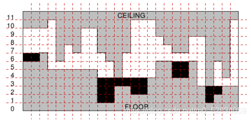
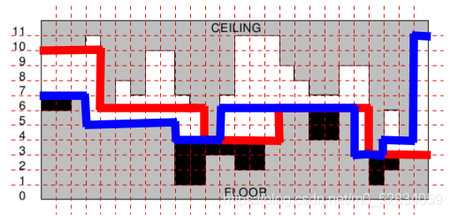

本页面将简要介绍双指针。

## 引入

尺取法（又称为：双指针、two pointers）是一种简单而又灵活的技巧和思想，单独使用可以轻松解决一些特定问题，和其他算法结合也能发挥多样的用处。

双指针顾名思义，就是同时使用两个指针，在序列、链表结构上指向的是位置，在树、图结构中指向的是节点，通过或同向移动，或相向移动来维护、统计信息。

如果区间是单调的，也常常用二分法来求解，所以很多问题用尺取法和二分法都行。

另外，尺取法的的操作过程和分治算法的步骤很相似，有时候也用在分治中。

## 理论
为什么尺取法能优化呢？考虑下面的应用背景：

1. 给定一个序列。有时候需要它是有序的，先排序。
2. 问题和序列的区间有关，且需要操作2个变量，可以用两个下标（指针）i、j扫描区间。

对于上面的应用，一般的做法，是用i、j分别扫描区间，有两重循环，复杂度O(n^2)。以反向扫描（即i、j方向相反，后文有解释）为例，代码是：

```cpp
for(int i = 0; i < n; i++)           //i从头扫到尾
	for(int j = n-1; j >= 0; j--){   //j从尾扫到头
        ......
    }
```

下面用尺取法来优化上面的算法。

实际上，尺取法就是把两重循环变成了一个循环，在这个循环中一起处理i和j。复杂度也就从O(n^2)变成了O(n)。仍以上面的反向扫描为例，代码是：

```cpp
//用while实现：
int i = 0, j = n - 1;
while (i < j) {      //i和j在中间相遇。这样做还能防止i、j越界
        ......       //满足题意的操作
        i++;         //i从头扫到尾
        j--;         //j从尾扫到头
}
//用for实现：
for (int i = 0, j = n - 1; i < j; i++, j--) {
    ......
}
```

在尺取法中，这两个指针i、j，有两种扫描方向：

1. 反向扫描。i、j方向相反，i从头到尾，j从尾到头，在中间相会。
2. 同向扫描。i、j方向相同，都从头到尾，可以让j跑在i前面。

在leetcode的一篇文章中 常用的双指针技巧 https://leetcode-cn.com/circle/article/GMopsy/，把同向扫描的i、j指针称为“快慢指针”，把反向扫描的i、j指针称为“左右指针”，更加形象。快慢指针在序列上产生了一个大小可变的“滑动窗口”，有灵活的应用，例如3.1的“寻找区间和”问题。

## 反向扫描

???+note "找指定和的整数对"
    输入n ( n≤100,000)个整数，放在数组a[]中。找出其中的两个数，它们之和等于整数m(假定肯定有解)。题中所有整数都是int型。
    
    样例输入：
    
    21 4 5 6 13 65 32 9 23
    
    28
    
    样例输出：
    
    5 23
    
    说明：样例输入的第一行是数组a[]，第2行是m = 28。样例输出5和23，相加得28。

???+note "解题思路"
    为了说明尺取法的优势，下面给出四种方法：

    1. 用两重循环暴力搜，枚举所有的取数方法，复杂度O(n^2)，超时。暴力法不需要排序。
    2. 二分法。首先对数组从小到大排序，复杂度O(nlogn)；然后，从头到尾处理数组中的每个元素a[i]，在大于a[i]的数中二分查找是否存在一个等于 m - a[i]的数，复杂度也是O(nlogn)。两部分相加，总复杂度仍然是O(nlogn)。
    3. Hash。分配一个hash空间s，把n个数放进去。逐个检查a[]中的n个数，例如a[i]，检查m - a[i]在s中是否有值，如果有，那么存在一个答案。复杂度是O(n)。hash方法很快，但是需要一个额外的、可能很大的hash空间。
    4. 尺取法。这是标准解法。首先对数组从小到大排序；然后，设置两个变量i和j，分别指向头和尾，i初值是0，j初值是n-1，然后让i和j逐渐向中间移动，检查a[i]+a[j]，如果大于m，就让j减1，如果小于m，就让i加1，直至a[i]+a[j] = m。排序复杂度O(nlogn)，检查的复杂度O(n)，合起来总复杂度O(nlogn)。
    
    尺取法代码如下，注意可能有多个答案：

    ```cpp
    void find_sum(int a[], int n, int m){ 
        sort(a, a + n - 1);      //先排序，复杂度O(nlogn)
        int i = 0, j = n - 1;    //i指向头，j指向尾
        while (i < j){           //复杂度O(n)
                int sum = a[i] + a[j];
                if (sum > m)   j--;
                if (sum < m)   i++;
                if (sum == m){     
                    cout << a[i] << " " << a[j] << endl;  //打印一种情况
                    i++;          //可能有多个答案，继续
                }
        }
    }
    ```

    在这个题目中，尺取法不仅效率高，而且不需要额外的空间。
    
    把题目的条件改变一下，可以变化为类似的问题，例如：判断一个数是否为两个数的平方和。
    
    这个题目，其实也能用同向扫描来做。请读者思考。

???+note "[判断回文串](http://acm.hdu.edu.cn/showproblem.php?pid=2029)"
    “回文串”是一个正读和反读都一样的字符串，比如“level”或者“noon”就是回文串。写一个程序判断读入的字符串是否是“回文”。如果是，输出“yes”，否则输出“no”。

???+note "参考代码"

    ```cpp
    #include <bits/stdc++.h>
    using namespace std;
    int main(){
        int n;
        cin >> n;                         //n是测试用例个数
        while(n--){
            string s;  cin >> s;          //读一个字符串
            bool ans = true;
            int i = 0, j = s.size() - 1;  //双指针
            while(i < j){ 
                if(s[i] != s[j]){
                    ans = false;
                    break;
                }
                i++;   j--;               //移动双指针
            }
            if(ans)   cout << "yes" << endl;
            else      cout << "no"  << endl;
        }
        return 0;
    }
    ```

    稍微改变一下，类似的题目有：

    1. 不区分大小写，忽略非英文字母，判断是否回文串。http://www.lintcode.com/problem/valid-palindrome/
    2. 允许删除（或插入，本题只考虑删除）最多1个字符，判断是否能构成回文字符串。http://www.lintcode.com/problem/valid-palindrome-ii/
    
    设反向扫描双指针为i、j。如果 s[i]和s[j]相同，i++、j--；如果s[i]和s[j]不同，那么，或者删除s[i]，或者删除s[j]，看剩下的字符串是否是回文串即可。

## 同向扫描

???+note "寻找区间和"
    给定一个长度为n的数组a[]和一个数s，在这个数组中找一个区间，使得这个区间之和等于s。输出区间的起点和终点位置。
    
    样例输入：
    
    15
    
    6 1 2 3 4 6 4 2 8 9 10 11 12 13 14
    
    6
    
    样例输出：
    
    0 0
    
    1 3
    
    5 5
    
    6 7
    
    说明：样例输入的第1行是n=15，第2行是数组a[]，第3行是区间和s=6。样例输出，共有4个情况。

???+note "解题思路"
    指针i和j，i<=j，都从头向尾扫描，判断区间[i,j]的和是否等于s。
    
    如何寻找区间和等于s的区间？如果简单地对i和j做二重循环，复杂度是O(n2)。用尺取法，复杂度O(n)，操作步骤是：

    1. 初始值i=0、j=0，即开始都指向第一个元素a[0]。定义sum是区间[i, j]的和，初始值sum = a[0]。
    2. 如果sum等于s，输出一个解。继续，把sum减掉元素a[i]，并把i往后移动一位。
    3. 如果sum大于s，让sum减掉元素a[i]，并把i往后移动一位。
    4. 如果sum小于s，把j往后挪一位，并把sum的值加上这个新元素。

    在上面的步骤中，有2个关键技巧：
    
    1. 滑动窗口的实现。窗口就是区间[i,j]，随着i和j从头到尾移动，窗口就“滑动”扫描了整个序列，检索了所有的数据。i和j并不是同步增加的，窗口像一只蚯蚓伸缩前进，它的长度是变化的，这个变化，正对应了对区间和的计算。
    2. sum的使用。如何计算区间和？暴力的方法是从a[i]到a[j]累加，但是，这个累加的复杂度是O(n)的，会超时。如果利用sum，每次移动i或j的时候，只需要把sum加或减一次，就得到了区间和，复杂度是O(1)。这是“前缀和”递推思想的应用。

    “滑动窗口”的例子还有：

    1. 给定一个序列，以及一个整数M；在序列中找M个连续递增的元素，使它们的区间和最大。
    2. 给定一个序列，以及一个整数K；求一个最短的连续子序列，其中包含至少K个不同的元素。

???+note "参考代码"

    ```cpp
    void findsum(int *a, int n, int s){
        int i = 0, j = 0;
        int sum = a[0];
        while(j < n){   //下面代码中保证 i<=j
            if(sum >= s){
                if(sum == s) printf("%d %d\n", i, j);
                sum -= a[i];
                i++;
                if(i>j) {sum = a[i]; j++;}  //防止i超过j
            }
            if(sum < s){
                j++;
                sum += a[j];
            }
        }
    }
    ```

???+note "数组去重"
    给定数组a[]，长度为n，把数组中重复的数去掉。

???+note "解题思路"
    下面给出两种解法：hash和尺取法。
    
    hash。hash函数的特点是有冲突，利用这个特点去重。把所有的数插到 hash表里，用冲突过滤重复的数，就能得到不同的数。缺点是会耗费额外的空间。
    
    尺取法。步骤是：

    1. 将数组排序，这样那些重复的整数就会挤在一起。
    2. 定义双指针i、j，初始值都指向a[0]。i和j都从头到尾扫描数组a[]。i指针走得快，逐个遍历整个数组；j指针走得慢，它始终指向当前不重复部分的最后一个数。也就是说，j用于获得不重复的数。
    3. 扫描数组。快指针i++，如果此时a[i]不等于慢指针j指向的a[j]，就把j++，并且把a[i]复制到慢指针j的当前位置a[j]。
    4. i扫描结束后，a[0]到a[j]就是不重复数组。

## 维护区间信息

如果不和其他数据结构结合使用，双指针维护区间信息的最简单模式就是维护具有一定单调性，新增和删去一个元素都很方便处理的信息，就比如正数的和、正整数的积等等。

### 例题 1

???+ note "例题 1 [leetcode 713. 乘积小于 K 的子数组](https://leetcode-cn.com/problems/subarray-product-less-than-k/)"
    给定一个长度为 $n$ 的正整数数组 $\mathit{nums}$ 和整数 $k$, 找出该数组内乘积小于 $k$ 的连续子数组的个数。$1 \leq n \leq 3 \times 10^4, 1 \leq nums[i] \leq 1000, 0 \leq k \leq 10^6$

#### 过程

设两个指针分别为 $l,r$, 另外设置一个变量 $\mathit{tmp}$ 记录 $[l,r]$ 内所有数的乘积。最开始 $l,r$ 都在最左面，先向右移动 $r$，直到第一次发现 $\mathit{tmp}\geq k$,  这时就固定 $r$，右移 $l$，直到 $\mathit{tmp}\lt k$。那么对于每个 $r$，$l$ 是它能延展到的左边界，由于正整数乘积的单调性，此时以 $r$ 为右端点的满足题目条件的区间个数为 $r-l+1$ 个。

#### 实现

```cpp
int numSubarrayProductLessThanK(vector<int>& nums, int k) {
  long long ji = 1ll, ans = 0;
  int l = 0;
  for (int i = 0; i < nums.size(); ++i) {
    ji *= nums[i];
    while (l <= i && ji >= k) ji /= nums[l++];
    ans += i - l + 1;
  }
  return ans;
}
```

使用双指针维护区间信息也可以与其他数据结构比如差分、单调队列、线段树、主席树等等结合使用。另外将双指针技巧融入算法的还有莫队，莫队中将询问离线排序后，一般也都是用两个指针记录当前要处理的区间，随着指针一步步移动逐渐更新区间信息。

### 例题 2

接下来看一道在树上使用双指针并结合树上差分的例题：

???+ note "例题 2 [luogu P3066 Running Away From the Barn G](https://www.luogu.com.cn/problem/P3066)"
    给定一颗 $n$ 个点的有根树，边有边权，节点从 1 至 $n$ 编号，1 号节点是这棵树的根。再给出一个参数 $t$，对于树上的每个节点 $u$，请求出 $u$ 的子树中有多少节点满足该节点到 $u$ 的距离不大于 $t$。数据范围：$1\leq n \leq 2\times 10^5,1 \leq t \leq 10^{18},1 \leq p_i \lt i,1 \leq w_i \leq 10^{12}$

#### 过程

从根开始用 dfs 遍历整棵树，使用一个栈来记录根到当前节点的树链，设一个指针 $u$ 指向当前节点，另一个指针 $p$ 指向与 $u$ 距离不大于 $t$ 的节点中深度最小的节点。记录到根的距离，每次二分查找确定 $p$。此时 $u$ 对 $p$ 到 $u$ 路径上的所有节点都有一个贡献，可以用树上差分来记录。  
注意不能直接暴力移动 $p$，否则时间复杂度可能会退化至 $O(n^2)$。

## 子序列匹配

???+ note "例题 3 [leetcode 524. 通过删除字母匹配到字典里最长单词](https://leetcode-cn.com/problems/longest-word-in-dictionary-through-deleting/)"
    给定一个字符串 $s$ 和一个字符串数组 $\mathit{dictionary}$ 作为字典，找出并返回字典中最长的字符串，该字符串可以通过删除 $s$ 中的某些字符得到。

### 过程

此类问题需要将字符串 $s$ 与 $t$ 进行匹配，判断 $t$ 是否为 $s$ 的子序列。解决这种问题只需先将两个指针一个 $i$ 放在 $s$ 开始位置，一个 $j$ 放在 $t$ 开始位置，如果 $s[i]=t[j]$ 说明 $t$ 的第 $j$ 位已经在 $s$ 中找到了第一个对应，可以进而检测后面的部分了，那么 $i$ 和 $j$ 同时加一。如果上述等式不成立，则 $t$ 的第 $j$ 位仍然没有被匹配上，所以只给 $i$ 加一，在 $s$ 的后面部分再继续寻找。最后，如果 $j$ 已经移到了超尾位置，说明整个字符串都可以被匹配上，也就是 $t$ 是 $s$ 的一个子序列，否则不是。

### 实现

```cpp
string findLongestWord(string s, vector<string>& dictionary) {
  sort(dictionary.begin(), dictionary.end());
  int mx = 0, r = 0;
  string ans = "";
  for (int i = dictionary.size() - 1; i >= 0; i--) {
    r = 0;
    for (int j = 0; j < s.length(); ++j) {
      if (s[j] == dictionary[i][r]) r++;
    }
    if (r == dictionary[i].length()) {
      if (r >= mx) {
        mx = r;
        ans = dictionary[i];
      }
    }
  }
  return ans;
}
```

这种两个指针指向不同对象然后逐步进行比对的方法还可以用在一些 dp 中。

## 利用序列有序性

很多时候在序列上使用双指针之所以能够正确地达到目的，是因为序列的某些性质，最常见的就是利用序列的有序性。

???+ note "例题 4 [leetcode 167. 两数之和 II - 输入有序数组](https://leetcode-cn.com/problems/two-sum-ii-input-array-is-sorted/)"
    给定一个已按照 **升序排列** 的整数数组 `numbers`，请你从数组中找出两个数满足相加之和等于目标数 `target`。

### 过程

这种问题也是双指针的经典应用了，虽然二分也很方便，但时间复杂度上多一个 $\log{n}$，而且代码不够简洁。

接下来介绍双指针做法：既然要找到两个数，且这两个数不能在同一位置，那其位置一定是一左一右。由于两数之和固定，那么两数之中的小数越大，大数越小。考虑到这些性质，那我们不妨从两边接近它们。

首先假定答案就是 1 和 n，如果发现 $num[1]+num[n]\gt \mathit{target}$，说明我们需要将其中的一个元素变小，而 $\mathit{num}[1]$ 已经不能再变小了，所以我们把指向 $n$ 的指针减一，让大数变小。

同理如果发现 $num[1]+num[n]\lt \mathit{target}$，说明我们要将其中的一个元素变大，但 $\mathit{num}[n]$ 已经不能再变大了，所以将指向 1 的指针加一，让小数变大。

推广到一般情形，如果此时我们两个指针分别指在 $l,r$ 上，且 $l\lt r$, 如果 $num[l]+num[r]\gt \mathit{target}$，就将 $r$ 减一，如果 $num[l]+num[r]\lt \mathit{target}$，就将 $l$ 加一。这样 $l$ 不断右移，$r$ 不断左移，最后两者各逼近到一个答案。

### 实现

```cpp
vector<int> twoSum(vector<int>& numbers, int target) {
  int r = numbers.size() - 1, l = 0;
  vector<int> ans;
  ans.clear();
  while (l < r) {
    if (numbers[l] + numbers[r] > target)
      r--;
    else if (numbers[l] + numbers[r] == target) {
      ans.push_back(l + 1), ans.push_back(r + 1);
      return ans;
    } else
      l++;
  }
  return ans;
}
```

在归并排序中，在 $O(n+m)$ 时间内合并两个有序数组，也是保证数组的有序性条件下使用的双指针法。

## 在单向链表中找环

### 过程

在单向链表中找环也是有多种办法，不过快慢双指针方法是其中最为简洁的方法之一，接下来介绍这种方法。

首先两个指针都指向链表的头部，令一个指针一次走一步，另一个指针一次走两步，如果它们相遇了，证明有环，否则无环，时间复杂度 $O(n)$。

如果有环的话，怎么找到环的起点呢？

我们列出式子来观察一下，设相遇时，慢指针一共走了 $k$ 步，在环上走了 $l$ 步（快慢指针在环上相遇时，慢指针一定没走完一圈）。快指针走了 $2k$ 步，设环长为 $C$，则有

$$
\begin{align}
& \ 2 k=n \times C+l+(k-l) \\
& \ k=n \times C \\
\end{align}
$$

第一次相遇时 $n$ 取最小正整数 1。也就是说 $k=C$。那么利用这个等式，可以在两个指针相遇后，将其中一个指针移到表头，让两者都一步一步走，再度相遇的位置即为环的起点。

### 习题

??? note "[leetcode 15. 三数之和](https://leetcode-cn.com/problems/3sum/)"
    给你一个整数数组 nums ，判断是否存在三元组 $[nums[i], nums[j], nums[k]]$ 满足 i != j、i != k 且 j != k ，同时还满足 $nums[i] + nums[j] + nums[k] == 0$ 。请你返回所有和为 0 且不重复的三元组。

    ??? tip
        特判，对于数组长度 n，如果数组为 null 或者数组长度小于 3，返回 []。
        
        对数组进行排序。
        
        遍历排序后数组：
        1. 若 $nums[i]>0$ ：因为已经排序好，所以后面不可能有三个数加和等于0，直接返回结果。
        2. 对于重复元素：跳过，避免出现重复解
        3. 令左指针 L=i+1，右指针 R=n−1，当 L < R 时，执行循环：
            - 当 $nums[i]+nums[L]+nums[R]==0$，执行循环，判断左界和右界是否和下一位置重复，去除重复解。并同时将 L,R 移到下一位置，寻找新的解
            - 若和大于 0，说明 $nums[R]$ 太大，R 左移
            - 若和小于 0，说明 $nums[L]$ 太小，L 右移

    ??? note "参考代码"

        ```cpp
        vector<vector<int>> threeSum(vector<int>& nums) {
            vector<vector<int>> ans;
            if(nums.size()<3) return ans;
            sort(nums.begin(), nums.end());
            if(nums[0]>0) return ans;
            int i = 0;
            while(i<nums.size()){
                if(nums[i]>0) break;        // 1楼网友指正，将这个if语句放这里提前终止循环
                int left = i+1, right = nums.size()-1;
                while(left< right){
                
                    // 转换为long long避免加法过程中溢出
                    long long y = static_cast<long long>(nums[i]);
                    long long x = static_cast<long long>(nums[left]);
                    long long z = static_cast<long long>(nums[right]);
                    if(x + y >0-z)
                        right--;
                    else if(x + y <0-z)
                        left++;
                    else{
                        ans.push_back({nums[i], nums[left], nums[right]});
                        // 相同的left和right不应该再次出现，因此跳过
                        while(left<right&&nums[left]==nums[left+1])
                            left++;
                        while(left<right&&nums[right] == nums[right-1])
                            right--;
                        left++;
                        right--;
                    }
                }
                // 避免nums[i]作为第一个数重复出现
                while(i+1<nums.size()&&nums[i] == nums[i+1])
                    i++;
                i++;
            }
            return ans;
        }
        ```

??? note "[leetcode 1438. 绝对差不超过限制的最长连续子数组](https://leetcode-cn.com/problems/longest-continuous-subarray-with-absolute-diff-less-than-or-equal-to-limit/)"
    给你一个整数数组 nums ，和一个表示限制的整数 limit，请你返回最长连续子数组的长度，该子数组中的任意两个元素之间的绝对差必须小于或者等于 limit 

    ??? tip
        我们可以枚举每一个位置作为右端点，找到其对应的最靠左的左端点，满足区间中最大值与最小值的差不超过 limit。

        注意到随着右端点向右移动，左端点也将向右移动，于是我们可以使用滑动窗口解决本题。

        为了方便统计当前窗口内的最大值与最小值，我们也可以分别使用两个单调队列解决本题。

        在实际代码中，我们使用一个单调递增的队列 queMin 维护最小值，一个单调递减的队列 queMax 维护最大值。这样我们只需要计算两个队列的队首的差值，即可知道当前窗口是否满足条件。

    ??? note "参考代码"

        ```cpp
        int longestSubarray(vector<int>& nums, int limit) {
            deque<int> queMax, queMin;
            int n = nums.size();
            int left = 0, right = 0;
            int ret = 0;
            while (right < n) {
                while (!queMax.empty() && queMax.back() < nums[right]) {
                    queMax.pop_back();
                }
                while (!queMin.empty() && queMin.back() > nums[right]) {
                    queMin.pop_back();
                }
                queMax.push_back(nums[right]);
                queMin.push_back(nums[right]);
                while (!queMax.empty() && !queMin.empty() && queMax.front() - queMin.front() > limit) {
                    if (nums[left] == queMin.front()) {
                        queMin.pop_front();
                    }
                    if (nums[left] == queMax.front()) {
                        queMax.pop_front();
                    }
                    left++;
                }
                ret = max(ret, right - left + 1);
                right++;
            }
            return ret;
        }
        ```

??? note "[Subsequence](http://poj.org/problem?id=3061)"
    给出了N个正整数序列(10 < N < 100,000)，每个正整数小于或等于10000，一个正整数S (S < 100 000 000)。编写一个程序，求序列中连续元素的子序列的最小长度，其和大于或等于S。

    ??? tip
        在这道题中，序列都是正数，如果一个区间其和大于等于S，那么不需要在向后推进右端点了，因为其和也肯定大于等于S但长度更长。
    
        所以，当区间和小于S时右端点向右移动，和大于等于S时，左端点向右移动以进一步找到最短的区间。
        
        如果右端点移动到区间末尾其和还不大于等于S，结束区间的枚举。

    ??? note "参考代码"

        ```cpp
        #include<bits/stdc++.h>
        using namespace std;
        const int maxn=1e5+100;
        int t,n,s;
        int a[maxn];
        int main()
        {
            ios::sync_with_stdio(false);  //加速流
            cin>>t;
            while(t--)
            {
                cin>>n>>s;
                for(int i=0; i<n; i++)
                    cin>>a[i];
                int l=0,r=0,ans=n+1;   //l，r:左右端点  ans初始值设为n+1
                int sum=0;
                while(true)
                {
                    while(r<n&&sum<s)
                        sum+=a[r++];
                    if(sum<s)         //如果所有数的和都小于s，直接跳出循环
                        break;
                    ans=min(ans,r-l); //此时r一定小于n(可以思考一下)
                    sum-=a[l++];      //去掉最左端点，继续前进
                }
                if(ans==n+1)
                    cout<<0<<endl;
                else
                    cout<<ans<<endl;
            }
        }
        ```

??? note "[Jessica's Reading Problem](http://poj.org/problem?id=3320)"
    每个数代表一个知识点，然后按顺序给出知识点的序列，求涵盖了所有知识点的最短连续子序列。

    ??? tip
        尺取法的经典例题，set用来求出所有不重复知识点的个数，map用来计算是否有新出现的的知识点。

        1. 左端点s，右端点t，目前复习的知识点num初始化为0；
        2. 只要有t < P，num < n，且出现新的知识点 $counts[a[t++]]++==0，num++；$
        3. 如果num < n，则无法解决该题。否则更新答案，min(res,t-s);
        4. 从s开始缩小范围，若某一知识点的次数为零，则num–；回归2.

    ??? note "参考代码"

        ```cpp
        #include <cstdio>
        #include <cstring>
        #include <algorithm>
        #include <set>
        #include <map>
        #include <iostream>
        using namespace std;
        const int maxn = 1000000+10;
        int P;
        int a[maxn];
        int main()
        {
            while(~scanf("%d",&P)){
                set<int> all;
                for(int i=0;i<P;i++){
                    scanf("%d",&a[i]);
                    all.insert(a[i]);
                    //去重，升序排序,支持集合的交(set_intersection),差(set_difference) 并(set_union)，对称差(set_symmetric_difference)
                }
                int n = all.size();
                int s = 0,t = 0,num = 0;
                map<int ,int > counts;
                int res = P;
                for(;;){
                    while(t<P && num<n){
                        if(counts[a[t++]]++ == 0){
                            num++;
                        }
                    }
                    if(num<n) break;
                    res = min(res,t-s);
                    if(--counts[a[s++]] == 0){
                        num--;
                    }
                }
                printf("%d\n",res);
            }
            return 0;
        }
        ```
    
??? note "[Bound Found](http://poj.org/problem?id=2566)"
    从数列中找出连续序列，使得和的绝对值与目标数之差最小

    ??? tip
        因为这道题目给的数字可能是负数，如果还按照老的方法去算，可能会出现 r 向回收缩，l 向左延伸的现象，所以为了避免这种情况，我们可以引入前缀和，然后排序一下，这样不就可以保证 R 在向右的过程中 整个区间和是一直在增大的，L 收缩的过程中整个区间和是一直在减小的 ，成功实现尺取法

    ??? note "参考代码"

        ```cpp
        #include <iostream>
        #include <stdio.h>
        #include <algorithm>
        #include <math.h>
        #include <cstring>
        #include <vector>
        #include <queue>
        using namespace std;
        const int N = 1e5 + 10;
        const int INF = 0x7fffffff;
        int n, k;
        int a[N];
        struct node {
                int sum, id;
        }pre[N];
        bool cmp(node a, node b)
        {
                return a.sum < b.sum;
        }
        int main()
        {
                while (scanf("%d%d", &n, &k) != EOF)
                {
                    if (n == 0 && k == 0) break;
                    pre[0].id = 0, pre[0].sum = 0;
                    for (int i = 1; i <= n; i++)
                    {
                            scanf("%d", &a[i]);
                            pre[i].id = i;
                            pre[i].sum = pre[i - 1].sum + a[i];
                    }
                    sort(pre, pre + n + 1, cmp);
                    for (int i = 0; i < k; i++)
                    {
                            int t;
                            scanf("%d", &t);
                            int Min = INF;
                            int l = 0, r = 1;
                            int ans, ansl, ansr;
                            while (r <=n)
                            {
                                    int sub = pre[r].sum - pre[l].sum;
                                    while (abs(sub - t) < Min)
                                    {
                                            Min = abs(sub - t);
                                            ansl= min(pre[l].id, pre[r].id) + 1;
                                            ansr = max(pre[l].id, pre[r].id);
                                            ans = sub;
                                    }
                                    if (sub < t)
                                            r++;
                                    else if (sub > t) l++;
                                    else break;
                                    if (l == r) r++;
                            }
                            printf("%d %d %d\n", ans, ansl, ansr);
                    }
                }
                return 0;
        }
        ```
    
??? note "[First One](https://vjudge.net/problem/HDU-5358)"
    数列 a 中 $S[i, j]$ 表示 $\sum_{i}^{j}a_i$，求出下面式子的值：

    $\sum_{i=1}^{n}\sum_{j=1}^{n}(((\log_2 S(i, j))+1) * (i+j))$, 其中的$((\log _2 S(i, j))+1)$是向下取整；

    ??? tip
         $((\log _2 S(i, j))+1)$表示 S(i,j) 转换为2进制的长度，然后我们经过分析 $((\log _2 S(i, j))+1)$ 的值域为 $[1,34]$ 然后我们枚举 $((\log _2 S(i, j))+1)$ 的值，例如我们枚举其值为k，对于一个k我们找到所有满足条件的区间(i,j)，这个条件的代数表达为 $2^{k-1} \leq S(i,j) \leq 2^k - 1$;

        因此我们需要再枚举一个区间的左端点，对于一个给定的左端点，因为S(i,j)在给定i的情况下单调，

        我们可以用尺举发求得一个区间$[l,r]$，使得区间内的$j (l<=j<=r)$都满足 sum(i,j)+1=k;

        然后区间(i+j)的和可以表示为 $i*(r-l+1) + (r+l)*(r-l+1)/2$ ;

    ??? note "参考代码"

        ```cpp
        #include <iostream>
        #include <cstring>
        #include <algorithm>
        #include <cstdio>
        using namespace std;
        
        const int maxn = 1e5+10;
        
        typedef long long LL;
        
        LL sum[maxn];
        
        int main()
        {
            int t,n;
            scanf("%d",&t);
            while(t--){
                scanf("%d",&n);
                sum[0]=0;
                for(int i=1;i<=n;i++){
                    LL x;
                    scanf("%I64d",&x);
                    sum[i]=sum[i-1]+x;
                }
                LL ans = 0;
                for(LL k = 1;k<=34;k++){
                    LL l=1,r=0;
                    LL lmax = 1LL<<(k-1),rmax=(1LL<<k)-1;
                    if(k==1) lmax = 0;
                    for(LL i=1;i<=n;i++){
                        l=max((LL)i,l);
                        while(l<=n&&sum[l]-sum[i-1]<lmax) l++;
                        r=max(l-1,r);
                        while(r+1<=n&&sum[r+1]-sum[i-1]<=rmax&&sum[r+1]-sum[i-1]>=lmax)r++;
                        if(l>r) continue;
                        ans=ans+(i*(r-l+1)+(r+l)*(r-l+1)/2)*k;
                    }
                }
                printf("%I64d\n",ans);
            }
            return 0;
        }
        ```
    
??? note "[P1102 A-B 数对](https://www.luogu.com.cn/problem/P1102)"
    给出一串正整数数列以及一个正整数 $C$，要求计算出所有满足 $A - B = C$ 的数对的个数（不同位置的数字一样的数对算不同的数对）。

    ??? tip
        我们考虑题目要求求出所有A-B=C的数对，我们可以先将原数组排序，然后就会发现每个数A，对应的数B一定是一段连续的区间。

        然后我们再考虑如何去找到这个区间。我们显然是要找到这个连续区间的左端点和右端点。

        考虑到排序之后序列的有序性，我们枚举每个数，他们的左端点和右端点都是单调不降的，因此我们可以用双指针来维护这个东西。

        具体的实现就是，我们维护两个右端点r1 , r2，每次r1右移到 $a[r1] - a[l] <= c$ 的最后位置的下一位，r2右移到满足 $a[r2] - a[l] < c$ 最后一位.

        也就是说， 此时如果 $a[r2] - a[l] == c && a[r1 - 1] - a[l] == c$，中间的那一段一定都是满足条件的，我们让ans += r1 - r2即可。
    
    ??? note "参考代码"

        ```cpp
        #include <bits/stdc++.h>
        #define ll long long

        using namespace std;

        const int N = 2e5 + 10;
        int n , c;
        int a[N];

        int main () 
        {
            cin >> n >> c;
            for(int i = 1 ; i <= n ; i ++) cin >> a[i];
            sort(a + 1 , a + 1 + n);
            int l = 1, r1 = 1 , r2 = 1;
            ll ans = 0;
            for(l = 1 ; l <= n ; l ++) {
                while(r1 <= n && a[r1] - a[l] <= c) r1 ++;
                while(r2 <= n && a[r2] - a[l] < c ) r2 ++;
                if(a[r2] - a[l] == c && a[r1 - 1] - a[l] == c && r1 - 1 >= 1) 	
                    ans += r1 - r2;
            }
            cout << ans;
            return 0;
        }
        ```

??? note "[Cave](https://vjudge.net/problem/UVA-1442)"
    有一个山洞用于存放石油，给出山洞的长度n，以及每个位置的底高度以及顶高度，要求存放石油不能没过顶，求最大的放油量。

    

    ??? tip
        设level=s[0],判断[i,i+1]处的高度（其实level也就是i的高度，i则是i+1的高度，i和i+1进行比较）从左至右扫描，如果p[i]>level,说明水被阻隔了，需要把level提升至p[i].如果s[i]<level,说明水位太高，需要把level降低至s[i].从右向左扫描同理，

        红线是从左到右扫描的结果，蓝线试从右到左扫描的结果。两次扫描完以后，蓝色的线和红色的线谁低谁就减去$p[i]$，也就是黑色覆盖的范围，就是最终答案.

        

    ??? note "参考代码"

        ```cpp
        #include<bits/stdc++.h>
        using namespace std;
        const int maxn = 1000000 + 5;
        int p[maxn],s[maxn],h[maxn];
        int main()
        {
            int i, n, j, t, sum,l, r;
            cin >> t;
            while (t--)
            {
                sum = 0;
                cin >> n;
                for (i = 0; i < n; i++)
                    cin >> p[i];
                for (i = 0; i < n; i++)
                    cin >> s[i];
                l = s[0];
                for (i = 0; i < n ; i++)//从左到右扫描
                {
                    if (p[i] > l)l = p[i];
                    if (s[i] < l)l = s[i];
                    h[i] = l;//将level的值储存进h[i],也就是例子中的红线部分
                }
                l = s[n - 1];
                for (i = n - 1; i >= 0; i--)//从右到左扫描
                {
                    if (p[i] > l)l = p[i];
                    if (s[i] < l)l = s[i];
                    sum += min(h[i], l) - p[i];//扫描的同时可以直接求出答案.min(h[i],l)也就是红线和蓝线比较后最低的位置
                }
                cout << sum << endl;
            }
            return 0;
        }
        ```