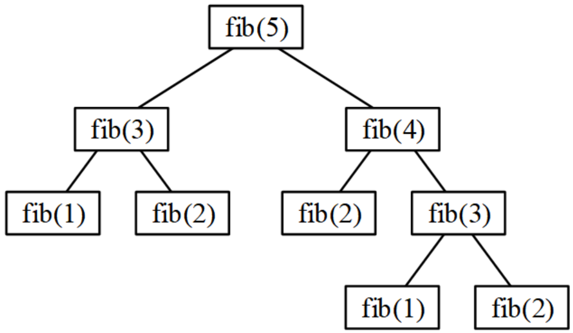
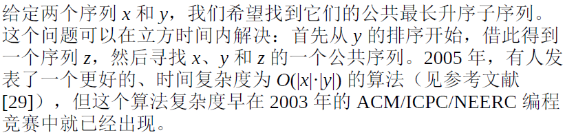

author: Ir1d, CBW2007, ChungZH, xhn16729, Xeonacid, tptpp, hsfzLZH1, ouuan, Marcythm, HeRaNO, greyqz, Chrogeek, partychicken, zhb2000, xyf007, Persdre

本页面主要介绍了动态规划的基本思想，以及动态规划中状态及状态转移方程的设计思路，帮助各位初学者对动态规划有一个初步的了解。

本部分的其他页面，将介绍各种类型问题中动态规划模型的建立方法，以及一些动态规划的优化技巧。

## 引入

???+note "[[IOI1994]数字三角形](https://www.luogu.com.cn/problem/P1216)"
    给定一个 $r$ 行的数字三角形（$r \leq 1000$），需要找到一条从最高点到底部任意处结束的路径，使路径经过数字的和最大。每一步可以走到当前点左下方的点或右下方的点。
    
    ```plain
            7 
          3   8 
        8   1   0 
      2   7   4   4 
    4   5   2   6   5 
    ```
    
    在上面这个例子中，最优路径是 $7 \to 3 \to 8 \to 7 \to 5$。

最简单粗暴的思路是尝试所有的路径。因为路径条数是 $O(2^r)$ 级别的，这样的做法无法接受。

注意到这样一个事实，一条最优的路径，它的每一步决策都是最优的。

以例题里提到的最优路径为例，只考虑前四步 $7 \to 3 \to 8 \to 7$，不存在一条从最顶端到 $4$ 行第 $2$ 个数的权值更大的路径。

而对于每一个点，它的下一步决策只有两种：往左下角或者往右下角（如果存在）。因此只需要记录当前点的最大权值，用这个最大权值执行下一步决策，来更新后续点的最大权值。

这样做还有一个好处：我们成功缩小了问题的规模，将一个问题分成了多个规模更小的问题。要想得到从顶端到第 $r$ 行的最优方案，只需要知道从顶端到第 $r-1$ 行的最优方案的信息就可以了。

这时候还存在一个问题：子问题间重叠的部分会有很多，同一个子问题可能会被重复访问多次，效率还是不高。解决这个问题的方法是把每个子问题的解存储下来，通过记忆化的方式限制访问顺序，确保每个子问题只被访问一次。

上面就是动态规划的一些基本思路。下面将会更系统地介绍动态规划的思想。

## 动态规划原理

动态规划（DP）是一种算法技术，它将大问题分解为更简单的子问题，对整体问题的最优解决方案取决于子问题的最优解决方案。

能用动态规划解决的问题，需要满足三个条件：最优子结构，无后效性和子问题重叠。

### 最优子结构

最优子结构的意思是：首先，大问题的最优解包含小问题的最优解；其次，可以通过小问题的最优解推导出大问题的最优解。在斐波那契问题中，把数列的计算构造成fib(n)=fib(n−1)+fib(n−2)，即把原来为n的大问题，减小为n−1和n−2的小问题，这是斐波那契数的最优子结构。

具有最优子结构也可能是适合用贪心的方法求解。

注意要确保我们考察了最优解中用到的所有子问题。

1. 证明问题最优解的第一个组成部分是做出一个选择；
2. 对于一个给定问题，在其可能的第一步选择中，假定你已经知道哪种选择才会得到最优解。你现在并不关心这种选择具体是如何得到的，只是假定已经知道了这种选择；
3. 给定可获得的最优解的选择后，确定这次选择会产生哪些子问题，以及如何最好地刻画子问题空间；
4. 证明作为构成原问题最优解的组成部分，每个子问题的解就是它本身的最优解。方法是反证法，考虑加入某个子问题的解不是其自身的最优解，那么就可以从原问题的解中用该子问题的最优解替换掉当前的非最优解，从而得到原问题的一个更优的解，从而与原问题最优解的假设矛盾。

要保持子问题空间尽量简单，只在必要时扩展。

最优子结构的不同体现在两个方面：

1. 原问题的最优解中涉及多少个子问题；
2. 确定最优解使用哪些子问题时，需要考察多少种选择。

子问题图中每个定点对应一个子问题，而需要考察的选择对应关联至子问题顶点的边。

### 无后效性

已经求解的子问题，不会再受到后续决策的影响。

在DP的概念中，还常常提到“无后效性”，即一个状态只取决于推导它的前面的状态，和后续的状态无关。从最优子结构的概念可以看出，它是满足无后效性的；所以，可以把无后效性看成最优子结构的另外一种解释。

### 子问题重叠

首先，子问题是原大问题的小版本，计算步骤完全一样；其次，计算大问题的时候，需要多次重复计算小问题。这就是“重叠子问题”。以斐波那契数为例，用递归计算fib(5)，分解为以下子问题：



计算斐波那契数

其中fib(3)计算了2次，其实只算1次就够了。

一个子问题的多次计算，耗费了大量时间。用DP处理重叠子问题，每个子问题只需要计算一次，从而避免了重复计算，这就是DP效率高的原因。具体的做法是：首先分析得到最优子结构，然后用递推或者记忆化递归进行编程，从而实现了高效的计算。

需要注意的是，DP在获得时间高效率的同时，可能耗费更多的空间，即“时间效率高，空间耗费大”。滚动数组是优化空间效率的一个办法。

如果有大量的重叠子问题，我们可以用空间将这些子问题的解存储下来，避免重复求解相同的子问题，从而提升效率。

### 基本思路

处理DP中的大问题和小问题，有两种思路：自顶向下（先大问题再小问题）、自下而上（先小问题再大问题）。

编码实现DP时，自顶向下用带记忆化的递归，自下而上用递推。两种方法的复杂度是一样的，每个子问题都计算一遍，而且只计算一遍。

（1）自顶向下与记忆化递归

先考虑大问题，再缩小到小问题，递归很直接地体现了这种思路。为避免递归时重复计算子问题，可以在子问题得到解决时，就保存结果，再次需要这个结果时，直接返回保存的结果就行了。这种存储已经解决的子问题的结果的技术称为“记忆化（Memoization）”。
以斐波那契数为例，记忆化代码如下：

```cpp
int memoize[maxn];                  //保存结果
int fib (int n){
    if (n == 1 || n == 2)  
        return 1;
    if(memoize[n] != 0)             //直接返回保存的结果，不再递归
        return memoize[n];    
    memoize[n]= fib (n - 1) + fib (n - 2);     //递归计算结果，并记忆
    return memoize[n];
}
```

（2）自下而上与制表递推

这种方法与递归的自顶向下相反，避免了递归的编程方法。这种“自下而上”的方法，先解决子问题，再递推到大问题。通常通过填写多维表格来完成。根据表中的结果，逐步计算出大问题的解决方案。

用制表法计算斐波那契数，维护一个一维表dp[]，记录自下而上的计算结果，更大的数是前面两个数的和。代码如下：

```cpp
const int maxn = 255;
int dp[maxn];
int fib (int n){
    dp[1] = dp[2] =1;
    for (int i = 3;i<=n;i++)
        dp[i] = dp[i-1] +dp[i-2];
    return dp[n];
}
```

在DP编程时，大多使用制表递推的编程方法。超过4维（dp[][][][]）的表格也是常见的。

对于一个能用动态规划解决的问题，一般采用如下思路解决：

1. 将原问题划分为若干 **阶段**，每个阶段对应若干个子问题，提取这些子问题的特征（称之为 **状态**）；
2. 寻找每一个状态的可能 **决策**，或者说是各状态间的相互转移方式（用数学的语言描述就是 **状态转移方程**）。
3. 按顺序求解每一个阶段的问题。

如果用图论的思想理解，我们建立一个 [有向无环图](../graph/dag.md)，每个状态对应图上一个节点，决策对应节点间的连边。这样问题就转变为了一个在 DAG 上寻找最长（短）路的问题。

## 最长公共子序列

???+note "最长公共子序列问题"
    给定一个长度为 $n$ 的序列 $A$ 和一个 长度为 $m$ 的序列 $B$（$n,m \leq 5000$），求出一个最长的序列，使得该序列既是 $A$ 的子序列，也是 $B$ 的子序列。

子序列的定义可以参考 [子序列](../string/basic.md)。一个简要的例子：字符串 `abcde` 与字符串 `acde` 的公共子序列有 `a`、`c`、`d`、`e`、`ac`、`ad`、`ae`、`cd`、`ce`、`de`、`ade`、`ace`、`cde`、`acde`，最长公共子序列的长度是 4。

设 $f(i,j)$ 表示只考虑 $A$ 的前 $i$ 个元素，$B$ 的前 $j$ 个元素时的最长公共子序列的长度，求这时的最长公共子序列的长度就是 **子问题**。$f(i,j)$ 就是我们所说的 **状态**，则 $f(n,m)$ 是最终要达到的状态，即为所求结果。

对于每个 $f(i,j)$，存在三种决策：如果 $A_i=B_j$，则可以将它接到公共子序列的末尾；另外两种决策分别是跳过 $A_i$ 或者 $B_j$。状态转移方程如下：

$$
f(i,j)=\begin{cases}f(i-1,j-1)+1&A_i=B_j\\\max(f(i-1,j),f(i,j-1))&A_i\ne B_j\end{cases}
$$

可参考 [SourceForge 的 LCS 交互网页](http://lcs-demo.sourceforge.net/) 来更好地理解 LCS 的实现过程。

该做法的时间复杂度为 $O(nm)$。

另外，本题存在 $O\left(\dfrac{nm}{w}\right)$ 的算法[^ref1]。有兴趣的同学可以自行探索。

```cpp
int a[MAXN], b[MAXM], f[MAXN][MAXM];

int dp() {
  for (int i = 1; i <= n; i++)
    for (int j = 1; j <= m; j++)
      if (a[i] == b[j])
        f[i][j] = f[i - 1][j - 1] + 1;
      else
        f[i][j] = std::max(f[i - 1][j], f[i][j - 1]);
  return f[n][m];
}
```

## 最长不下降子序列

???+note "最长不下降子序列问题"
    给定一个长度为 $n$ 的序列 $A$（$n \leq 5000$），求出一个最长的 $A$ 的子序列，满足该子序列的后一个元素不小于前一个元素。

### 算法一

设 $f(i)$ 表示以 $A_i$ 为结尾的最长不下降子序列的长度，则所求为 $\max_{1 \leq i \leq n} f(i)$。

计算 $f(i)$ 时，尝试将 $A_i$ 接到其他的最长不下降子序列后面，以更新答案。于是可以写出这样的状态转移方程：$f(i)=\max_{1 \leq j < i, A_j \leq A_i} (f(j)+1)$。

容易发现该算法的时间复杂度为 $O(n^2)$。

=== "C++"

    ```cpp
    int a[MAXN], d[MAXN];

    int dp() {
      d[1] = 1;
      int ans = 1;
      for (int i = 2; i <= n; i++) {
        d[i] = 1;
        for (int j = 1; j < i; j++)
          if (a[j] <= a[i]) {
            d[i] = max(d[i], d[j] + 1);
            ans = max(ans, d[i]);
          }
      }
      return ans;
    }
    ```

=== "Python"

    ```python
    a = [0] * MAXN
    d = [0] * MAXN
    def dp():
        d[1] = 1
        ans = 1
        for i in range(2, n + 1):
            for j in range(1, i):
                if a[j] <= a[i]:
                    d[i] = max(d[i], d[j] + 1)
                    ans = max(ans, d[i])
        return ans
    ```

### 算法二[^ref2]

当 $n$ 的范围扩大到 $n \leq 10^5$ 时，第一种做法就不够快了，下面给出了一个 $O(n \log n)$ 的做法。

首先，定义 $a_1 \dots a_n$ 为原始序列，$d$ 为当前的不下降子序列，$len$ 为子序列的长度，那么 $d_{len}$ 就是长度为 $len$ 的不下降子序列末尾元素。

初始化：$d_1=a_1,len=1$。

现在我们已知最长的不下降子序列长度为 1，那么我们让 $i$ 从 2 到 $n$ 循环，依次求出前 $i$ 个元素的最长不下降子序列的长度，循环的时候我们只需要维护好 $d$ 这个数组还有 $len$ 就可以了。**关键在于如何维护。**

考虑进来一个元素 $a_i$：

1. 元素大于等于 $d_{len}$，直接将该元素插入到 $d$ 序列的末尾。
2. 元素小于 $d_{len}$，找到 **第一个** 大于它的元素，插入进去，丢弃在它之后的全部元素。

参考代码如下：

=== "C++"

    ```cpp
    for (int i = 0; i < n; ++i) scanf("%d", a + i);
    memset(dp, 0x1f, sizeof dp);
    mx = dp[0];
    for (int i = 0; i < n; ++i) {
      *std::upper_bound(dp, dp + n, a[i]) = a[i];
    }
    ans = 0;
    while (dp[ans] != mx) ++ans;
    ```

=== "Python"

    ```python
    dp = [0x1f1f1f1f] * MAXN
    mx = dp[0]
    for i in range(0, n):
        bisect.insort_left(dp, a[i], 0, len(dp))
    ans = 0
    while dp[ans] != mx:
        ans += 1
    ```

### 变种：公共最长升序子序列



## 习题

- [Cow Bowling](http://poj.org/problem?id=3176)
- [Sumsets](http://poj.org/problem?id=2229)

- [最少拦截系统](http://acm.hdu.edu.cn/showproblem.php?pid=1257)

    Dilworth定理：对于任意一个序列，单调不增子序列最少划分 等于 最长递增子序列的长度。
    
    例如对于原序列：\[1, 5, 7, 4, 5, 6, 6\]，现在需要把它划分成 n 个序列，并且保证每个序列都单调不增，那么 n 至少为 4。可以分成如下 4 个序列：`[1]、[5, 4]、[7, 5]、[6, 6]`，不能再少了，而这正好是原序列最长递增子序列的长度。
    
    证明：证明过程采用反证法，如下：

    1. 首先，令原序列的最长递增子序列的长度为 l；
    2. 并且，我们假设可以将原序列划分成 k 个序列，并且每个序列中的元素都是单调不增的；
    3. 然后，假设 l > k，根据鸽巢原理，每个序列最多可以放一个 "最长递增子序列" 上的元素，所以剩下的 l-k 个元素势必又要开辟单独的 l-k 个单调不增的序列，和 2）的假设矛盾，所以容易得到 l <= k ；
    4. 最后，求的是划分的最小值，也就是 k 的最小值，基于 3） 的证明，这个最小值就是 l；

- [编辑距离](https://leetcode-cn.com/problems/edit-distance/)
- [最小划分](https://www.lintcode.com/problem/minimum-partition/description)
- [Apple Catching](http://poj.org/problem?id=2385)
- [Milking Time](http://poj.org/problem?id=3616)
- [划分回文串](https://vjudge.net/problem/UVA-11584)
- [颜色的长度](https://vjudge.net/problem/UVA-1625)

## 参考资料与注释

[^ref1]: [位运算求最长公共子序列 - -Wallace- - 博客园](https://www.cnblogs.com/-Wallace-/p/bit-lcs.html)

[^ref2]: [最长不下降子序列 nlogn 算法详解 - lvmememe - 博客园](https://www.cnblogs.com/itlqs/p/5743114.html)
