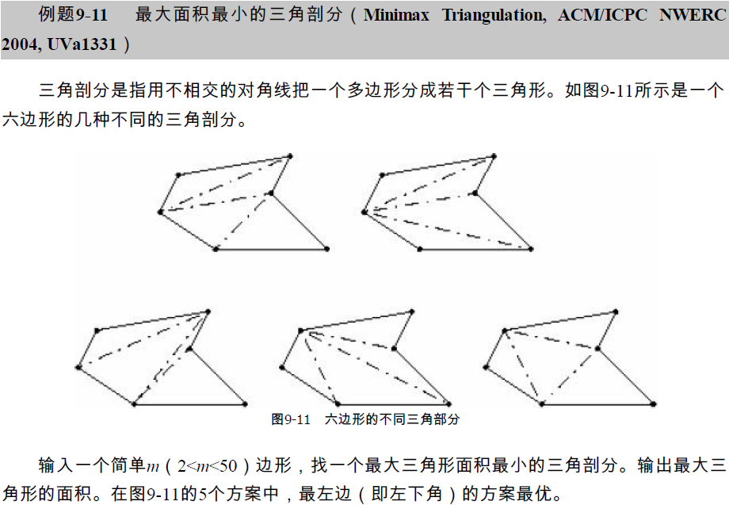
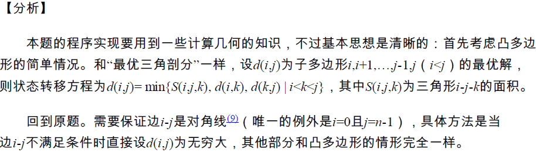

## 定义

区间类动态规划是线性动态规划的扩展，它在分阶段地划分问题时，与阶段中元素出现的顺序和由前一阶段的哪些元素合并而来有很大的关系。

令状态 $f(i,j)$ 表示将下标位置 $i$ 到 $j$ 的所有元素合并能获得的价值的最大值，那么 $f(i,j)=\max\{f(i,k)+f(k+1,j)+cost\}$，$cost$ 为将这两组元素合并起来的代价。

## 性质

区间 DP 有以下特点：

**合并**：即将两个或多个部分进行整合，当然也可以反过来；

**特征**：能将问题分解为能两两合并的形式；

**求解**：对整个问题设最优值，枚举合并点，将问题分解为左右两个部分，最后合并两个部分的最优值得到原问题的最优值。

## 解释

### 例题

???+note "[「NOI1995」石子合并](https://loj.ac/problem/10147)"
    题目大意：在一个环上有 $n$ 个数 $a_1,a_2,\dots,a_n$，进行 $n-1$ 次合并操作，每次操作将相邻的两堆合并成一堆，能获得新的一堆中的石子数量的和的得分。你需要最大化你的得分。

???+note "解题思路"
    需要考虑不在环上，而在一条链上的情况。

    令 $f(i,j)$ 表示将区间 $[i,j]$ 内的所有石子合并到一起的最大得分。

    写出 **状态转移方程**：$f(i,j)=\max\{f(i,k)+f(k+1,j)+\sum_{t=i}^{j} a_t \}~(i\le k<j)$

    令 $sum_i$ 表示 $a$ 数组的前缀和，状态转移方程变形为 $f(i,j)=\max\{f(i,k)+f(k+1,j)+sum_j-sum_{i-1} \}$。

    **怎样进行状态转移**

    由于计算 $f(i,j)$ 的值时需要知道所有 $f(i,k)$ 和 $f(k+1,j)$ 的值，而这两个中包含的元素的数量都小于 $f(i,j)$，所以我们以 $len=j-i+1$ 作为 DP 的阶段。首先从小到大枚举 $len$，然后枚举 $i$ 的值，根据 $len$ 和 $i$ 用公式计算出 $j$ 的值，然后枚举 $k$，时间复杂度为 $O(n^3)$

    **怎样处理环**

    题目中石子围成一个环，而不是一条链，怎么办呢？

    **方法一**：由于石子围成一个环，我们可以枚举分开的位置，将这个环转化成一个链，由于要枚举 $n$ 次，最终的时间复杂度为 $O(n^4)$。

    **方法二**：我们将这条链延长两倍，变成 $2\times n$ 堆，其中第 $i$ 堆与第 $n+i$ 堆相同，用动态规划求解后，取 $f(1,n),f(2,n+1),\dots,f(n-1,2n-2)$ 中的最优值，即为最后的答案。时间复杂度 $O(n^3)$。

???+note "参考代码"

    === "C++"

        ```cpp
        for (len = 1; len <= n; len++)
        for (i = 1; i <= 2 * n - 1; i++) {
            int j = len + i - 1;
            for (k = i; k < j && k <= 2 * n - 1; k++)
            f[i][j] = max(f[i][j], f[i][k] + f[k + 1][j] + sum[j] - sum[i - 1]);
        }
        ```

    === "Python"

        ```python
        for len in range(1, n + 1):
            for i in range(1, 2 * n):
                j = len + i - 1
                while k < j and k <= 2 * n - 1:
                    f[i][j] = max(f[i][j], f[i][k] + f[k + 1][j] + sum[j] - sum[i - 1])
                    k += 1
        ```

???+note "最优游戏策略"
    **问题描述：** 有n堆硬币排成一行，它们的价值分别是v1,v2,...,vn，n为偶数；两人交替拿硬币，每次只能在剩下的硬币中，拿走第一堆或最后一堆硬币。如果你是先手，你能拿到的最大价值是多少？
    
    例如：{8, 15, 3, 7}，先手这样拿可以获胜：（1）先手拿7；（2）对手拿8；（3）先手拿15；（4）对手拿3，结束。先手拿到的最大价值是7 + 15 = 22。

???+note "解题思路"
    这一题不能用贪心法。比如在样例中，如果先手第一次拿8，那么对手接下来肯定拿15，先手失败。
    
    定义二维dp，dp\[i\]\[j\]表示从第i堆到j堆硬币区间内，先手能拿到的最大值。

    在硬币区间\[i,j\]，先手有两个选择：
    
    1）拿i。接着对手也有2个选择，拿i+1或j：拿i+1，剩下\[i+2,j\]；拿j,剩下\[i+1,j−1\]。在这2个选择中，对手必然选那个对先手不利的。
    
    2）拿j。接着对手也有2个选择，拿i或j−1拿i，剩下\[i+1,j−1\]；拿j−1,剩下\[i,j−2\]。
    
    得到dp转移方程：
    
    `dp[i][j]=Max(V[i]+min(dp[i+2][j],dp[i+1][j−1]),V[j]+min(dp[i+1][j−1],dp[i][j−2]))`
    
    `dp[i][j]=V[i] if j==i`
    
    `dp[i][j]=max(V[i],V[j]) if j==i+1`

???+note "[矩阵链乘法](http://poj.org/problem?id=1651)"
    给定一个数组P\[\]，其中p\[i−1\]×p\[i\]表示矩阵，输出最少的乘法次数，并输出此时的括号方案。
    
    例如p\[\] = {40, 20, 30, 10, 30}，它表示4个矩阵：40×20，20×30，30×10，10×30。4个矩阵相乘，当括号方案是(A(BC))D时，有最少乘法次数26000。

???+note "解题思路"
    这是一个典型的区间DP问题。设链乘的矩阵是AiAi+1…Aj，即区间\[i,j\]，那么按结合率，可以把它分成2个子区间\[i,k\]、\[k+1,j\]，分别链乘，有：
    
    AiAi+1…Aj=(Ai...Ak)(Ak+1...Aj)
    
    必定有一个k，使得乘法次数最少，记这个k为ki,j。并且记Ai,j为此时AiAi+1…Aj通过加括号后得到的一个最优方案，它被ki,j分开。
    
    那么子链AiAi+1…Ak的方案Ai,k、子链Ak+1Ak+2…Aj的方案Ak+1,j也都是最优括号子方案。
    
    这样就形成了递推关系：
    Ai,j=min{Ai,k+Ak+1,j+pi−1pkpj}
    
    用二维矩阵dp\[i\]\[j\]来表示Ai,j，得到转移方程为：
    
    `dp[i][j]={0,i=j mindp[i][k]+dp[k+1][j]+p[i−1]p[k]p[j], i ≤ k < j}`
    
    dp\[1\]\[n\]就是答案，即最少乘法次数。
    
    dp\[i\]\[j\]的编码实现，可以套用区间DP模板，遍历i、j、k，复杂度是O(n^3^)。
    
    区间DP常常可以用四边形不等式优化，但是这一题不行，因为它不符合四边形不等式优化所需要的单调性条件。

???+note "[String painter](http://acm.hdu.edu.cn/showproblem.php?pid=2476)"
    **题目描述：** 给定两个长度相等的字符串A、B，由小写字母组成。一次操作，允许把A中的一个连续子串（区间）都转换为某个字符（就像用刷子刷成一样的字符）。要把A转换为B，问最低操作数是多少?
    
    **输入：** 第一行是字符串A，第二行是字符串B。两个字符串的长度不大于100。
    
    **输出：** 一个表示答案的整数。
    
    输入样例：
    
    zzzzzfzzzzz
    
    abcdefedcba
    
    输出样例：
    
    6
    
    提示：第1次把zzzzzfzzzzz转换为aaaaaaaaaaa，第2次转为abbbbbbbbba，第3次转为abccccccccba...

???+note "解题思路"
    这道经典题，能帮助读者深入理解区间DP是如何构造和编码的。
    
    （1）从空白串转换到B
    先考虑简单一点的问题：从空白串转换到B。为方便阅读代码，把字符串存储为B\[1\]~B\[n\]，不从0开始，编码的时候这样输入：scanf("%s%s", A+1, B+1)。
    
    如何定义DP状态？可以定义dp\[i\]，表示在区间\[1,i\]内转换为B的最少步数。或者更进一步，定义dp\[i\]\[j\]，表示在区间\[i,j\]内从空白串转换到B时的最少步数。重点是区间\[i,j\]两端的字符B\[i\] 和B\[j\]，分析以下两种情况。
    
    1）若B\[i\] = B\[j\]。第一次刷用B\[i\]把区间\[i,j\]刷一遍，这个刷法肯定是最优的。如果分别去掉两个端点，得到2个区间\[i+1,j\]、\[i,j−1\]，这2个区间的最小步数相等，也等于原区间\[i,j\]的最小步数。例如B\[i,j\]="abbba"，先用"a"全部刷一遍，再刷1次"bbb"，共刷2次。如果去掉第一个"a"，剩下的"bbba"，也是刷2次。
    
    2）若B\[i\] ≠ B\[j\]。因为两端点不等，至少要各刷1次。用标准的区间操作，把区间分成\[i,k\]和\[k+1,j\]两部分，枚举最小步数。
    
    （2）从A转换到B
    
    如何求dp\[1\]\[j\]？观察A和B相同位置的字符，分析以下两种情况.
    
    1）若A\[j\] = B\[j\]。这个字符不用转换，有dp\[1\]\[j\] = dp\[1\]\[j−1\]。
    
    2）若A\[j\] ≠ B\[j\]。仍然用标准的区间DP，把区间分成\[1,k\]和\[k+1,j\]两部分，枚举最小步数。这里利用了上一步从空白转换到B的结果，当区间\[k+1,j\]内A和B的字符不同时，从A转到B，与从空白串转换到B是等价的。

???+note "参考代码"

    ```cpp
    #include <bits/stdc++.h>
    using namespace std;
    char A[105],B[105];
    int dp[105][105];
    const int INF = 0x3f3f3f3f;
    int main() {
        while(~scanf("%s%s", A+1, B+1)){             //输入A, B
            int n = strlen(A+1);
                for(int i=1;i<=n;i++)  
                dp[i][i]=1;                          //初始化
                        //先从空白串转换到B
                for(int len=2; len<=n; len++)
                    for(int i=1; i<=n-len+1; i++){
                    int j = i + len-1;
                    dp[i][j] = INF;
                                        if(B[i] == B[j])//区间[i, j]两端的字符相同B[i] = B[j]
                        dp[i][j] = dp[i+1][j];  //或者 = dp[i][j-1])
                                        else    //区间[i, j]两端的字符不同B[i] ≠ B[j]
                                for(int k=i; k<j; k++)
                                    dp[i][j] = min(dp[i][j], dp[i][k] + dp[k+1][j]);                
                    }
                        //下面从A转换到B
            for(int j=1; j<=n; ++j){
                if(A[j] == B[j])  
                        dp[1][j] = dp[1][j-1];            //字符相同不用转
                else 
                    for(int k=1; k<j; ++k)
                    dp[1][j] = min(dp[1][j], dp[1][k] + dp[k+1][j]);
            }
            printf("%d\n",dp[1][n]);
        }
        return 0;
    }
    ```

???+note "[You Are the One](http://acm.hdu.edu.cn/showproblem.php?pid=4283)"
    **题目描述：** n个男孩去相亲，排成一队上场。大家都不想等，排队越靠后越愤怒。每人的耐心不同，用D表示火气，设男孩i的火气是Di，他排在第k个时，愤怒值是(k−1)\∗Di。
    
    导演不想看到会场气氛紧张。他安排了一个黑屋，可以调整这排男孩上场的顺序，屋子很狭长，先进去的男孩最后出来（黑屋就是一个堆栈）。例如，当男孩A排到时，如果他后面的男孩B火气更大，就把A送进黑屋，让B先上场。一般情况下，那些火气小的男孩要多等等，让火气大的占便宜。不过，零脾气的你也不一定吃亏，如果你原本排在倒数第二个，而最后一个男孩脾气最坏，导演为了让这个刺头第一个上场，把其他人全赶进了黑屋，结果你就排在了黑屋的第1名，第二个上场相亲了。
    
    注意，每个男孩都要进出黑屋。
    
    对所有男孩的愤怒值求和，求所有可能情况的最小和。
    
    **输入：** 第一行包含一个整数T，即测试用例的数量。对于每种情况，第一行是n（0 < n <= 100），后面n行，整数D1-Dn表示男孩的火气值（0 <= Di <= 100）。
    
    **输出：** 对每个用例，输出最小愤怒值之和。

???+note "解题思路"
    读者可以试试用栈来模拟，非常困难。这是一道区间DP，巧妙地利用了栈的特性。
    
    定义dp\[i\]\[j\]，表示从第i个人到第j个人，即区间\[i,j\]的最小愤怒值之和。
    
    由于栈的存在，这一题的区间\[i,j\]的分割点k比较特殊。分割时，总是用区间\[i,j\]的第一个元素i把区间分成两部分，让i第k个从黑屋出来上场相亲，即第k个出栈。根据栈的特性：若第一个元素i第k个出栈，则第二到k−1个元素肯定在第一个元素之前出栈，第k+1到最后一个元素肯定在第k个之后出栈。
    
    例如，5个人排队序号是1、2、3、4、5。如果要第1（i=1）个人第3（k=3）个出场，那么栈的操作是这样：1进栈、2进栈、3进栈、3出栈、2出栈，1出栈。2号、3号在1号之前出栈，1号第3个出栈，4号5号在1号后面出栈。
    
    分割点k（1 ≤ k ≤ j-i+1）把区间划分成了两段，即dp\[i+1\]\[i+k−1\]和dp\[i+k\]\[j\]。dp\[i\]\[j\]的计算分为三部分：
    
    （1）dp\[i+1\]\[i+k−1\]。原来i后面的k−1个人，现在排到i前面了。
    
    （2）第i个人往后挪了k−1个位置，愤怒值加上D\[i\]\*(k−1)。
    
    （3）dp\[i+k\]\[j\] + k∗(sum\[j\]−sum\[i+k−1\])。第k个位置后面的人，即区间\[i+k,j\]的人，由于都在前k个人之后，相当于从区间的第1个位置往后挪了k个位置，所以整体愤怒值要加上k∗(sum\[j\]−sum\[i+k−1\])。其中sum\[j\]=∑ji=1Di，是1~j所有人D值的和，sum\[j\]−sum\[i+k−1\]是区间\[i+k,j\]内这些人的D值和。

???+note "参考代码"
    代码完全套用“石子合并”的模板。其中DP方程给出了两种写法，对照看更清晰。

    ```cpp
    for(int len=2; len<=n; len++)
        for(i=1;i<=n-len+1;i++) {
            j = len + i - 1;
            dp[i][j] = INF; 
            for(int k=1;k<=j-i+1;k++)       //k：i往后挪了k位。这样写容易理解
                dp[i][j] = min(dp[i][j], dp[i+1][i+k-1] + D[i]*(k-1)
                                    + dp[i+k][j] + k*(sum[j]-sum[i+k-1]));   //DP方程
        //for(int k=i;k<=j;k++)           //或者这样写。k是整个队伍的绝对位置
        //    dp[i][j] = min(dp[i][j], dp[i+1][k] + D[i]*(k-i)
                                    + dp[k+1][j] + (k-i+1)*(sum[j]-sum[k]));
    }
    ```

## 二维区间DP

前面的例子的区间\[i,j\]可以看成在一条直线上移动，即一维DP。这里给出一个二维区间DP的例题，它的区间同时在两个方向移动。

???+note "[Rectangle Painting](https://vjudge.net/problem/CodeForces-1199F)"
    **题目描述：**  有一个n×n大小的方格图，某些方格初始是黑色，其余为白色。一次操作，可以选定一个h×w的矩形，把其中所有方格涂成白色，代价是max(h, w)。要求用最小的代价把所有方格变成白色。
    
    **输入：** 第1行是整数n，表示方格的大小。后面有n行，每行长度为n的串，包含符号'.'和'#'，'.'表示白色，'#'表示黑色。第i行的第j个字符是(i, j)。n ≤ 50。
    
    **输出：** 打印一个整数，表示把所有方格涂成白色的最小代价。
    
    输入样例：
    
    5
    
    #...#
    
    .#.#.
    
    .....
    
    .#...
    
    #....
    
    输出样例：
    
    5

???+note "解题思路"
    设矩形区域从左下角坐标(x1,y1)到右上角坐标(x2,y2)。定义状态dp\[x1\]\[y1\]\[x2\]\[y2\]，表示把这个区域内染成白色的最小代价。
    
    这个区域可以分别按x轴或者按y轴分割成两个矩形，遍历所有可能的分割，求最小代价。那么从x方向看，就是一个区间DP；从y方向看，也是区间DP。
    
    代码可以完全套用前面一维DP的模板，分别在两个方向操作。
    
    （1）x方向，区间分为\[x1,k\]和\[k+1,x2\]。状态转移方程是：
    
    `dp[x1][][x2][] = min(dp[x1][][x2][], dp[x1][][k][] + dp[k+1][][x2][])`
    
    （2）y方向，区间分为\[y1,k\]和\[k+1,y2\]。状态转移方程是：
    
    `dp[][y1][][y2] = min(dp[][y1][][y2], dp[][y1][][k] + dp[][k+1][][y2])`

???+note "参考代码"
    下面的代码有5层循环，时间复杂度O(n^5^)。对比一维区间DP，有3层循环，复杂度是O(n^3^)。

    ```cpp
    #include<bits/stdc++.h>
    using namespace std;
    #define N 55
    int dp[N][N][N][N];
    char mp[N][N];       //方格图
    int main(){
        int n;  cin>>n;
        for(int i=1;i<=n;i++)
            for(int j=1;j<=n;j++)
                cin>>mp[i][j];
        for(int i=1;i<=n;i++)
            for(int j=1;j<=n;j++)
                if(mp[i][j]=='.')  dp[i][j][i][j]=0;  //白格不用涂
                else dp[i][j][i][j]=1;                //黑格(i,j)涂成白色需1次
            
        for(int lenx=1;lenx<=n;lenx++)        //len从1开始，不是2。因为有x和y两个方向
            for(int leny=1;leny<=n;leny++)    
                for(int x1=1;x1<=n-lenx+1;x1++)
                    for(int y1=1;y1<=n-leny+1;y1++){					
                        int x2 = x1+lenx-1;             //x1：x轴起点；x2：x轴终点
                        int y2 = y1+leny-1;             //y1：y轴起点；y2：y轴终点
                        if(x1==x2 && y1==y2) continue;  //lenx=1且leny=1的情况
                        
                        dp[x1][y1][x2][y2] = max(abs(x1-x2),abs(y1-y2)) + 1;  //初始值 
                        
                        for(int k=x1;k<x2;k++)   //枚举x方向，y不变。区间[x1,k]+[k+1,x2]
                            dp[x1][y1][x2][y2] = min(dp[x1][y1][x2][y2],
                                                    dp[x1][y1][k][y2]+dp[k+1][y1][x2][y2]);
                            
                        for(int k=y1;k<y2;k++)   //枚举y方向，x不变。区间[y1,k]+[k+1,y2]
                            dp[x1][y1][x2][y2] = min(dp[x1][y1][x2][y2],
                                                    dp[x1][y1][x2][k]+dp[x1][k+1][x2][y2]);
                    
                    }
        
        cout << dp[1][1][n][n];
    }
    ```

## 几道练习题

??? note "[Cheapest Palindrome](http://poj.org/problem?id=3280)"
    给定一个字符串，要将其变成回文串，删除一个字母和添加一个字母都有不同的花费，问最小花费是多少。

    ??? tip
        本题求解将一个字符串转化为回文的最小成本，属于区间DP问题。可以将长度作为阶段，将序列的开始和结束下标作为状态的维度，对不同的情况执行不同的决策。
        
        $dp[i][j]$表示将$[i,j]$区间的字符串变成回文串的最小花费，然后有如下转移：

        如果$s[i] == s[j]$  那么 $dp[i][j] = dp[i + 1][j - 1]$

        否则 $dp[i][j] = min(dp[i + 1][j] + cost[i], dp[i][j - 1] + cost[j]).$

        $cost[i]$ 代表将i位置上的字符添加或删除的花费中的较小值。

        为什么取较小值呢，因为就本题来说，添加和删除是无差别的，假设$s[i, j]$是回文串，现在$s[i - 1]$位置上有一个字符，那么将其去掉和在$s[j + 1]$位置上添加一个同样的字符得到的都是回文串，而且并不会对将$s[i, j]$变成回文串所需的花费造成影响。

    ??? note "参考代码"

        ```cpp
        #include <bits/stdc++.h>
        using namespace std;
        typedef long long ll;
        const int INF = 0x3f3f3f3f;
        int n, m;
        int w[30];
        int dp[3000][3000];
        string s;
        int main(void)
        {
            int x, y;
            char ch;
            while (cin >> n >> m) {
                cin >> s;
                for (int i = 1; i <= n; ++i) {
                    cin >> ch >> x >> y;
                    w[ch - 'a'] = min(x, y);
                }
                for (int i = m - 1; i >= 0; --i) {
                    for (int j = i+1; j < m; ++j) {
                        if (s[i] == s[j])dp[i][j] = dp[i + 1][j - 1];
                        else dp[i][j] = min(dp[i + 1][j] + w[s[i]-'a'], dp[i][j - 1] + w[s[j] - 'a']);
                    }
                }
                cout << dp[0][m-1] << endl;
            }

            return 0;
        }
        ```

??? note "[棋盘分割](http://poj.org/problem?id=1191)"
    将一个8*8的棋盘进行如下分割: 将原棋盘割下一块矩形棋盘并使剩下部分也是矩形, 再将剩下的部分继续如此分割, 这样割了(n-1)次后, 连同最后剩下的矩形棋盘共有n块矩形棋盘. (每次切割都只能沿着棋盘格子的边进行)

    注意“再将剩下的部分继续切割”，也就是说，被割出去的那一块是不允许再被切割的。

    原棋盘上每一格有一个分值, 一块矩形棋盘的总分为其所含各格分值之和。现在需要把棋盘按上述规则分割成 n 块矩形棋盘, 并使各矩形棋盘总分的均方差最小
    
    ??? tip
        棋盘分割一块之后，剩余的棋盘的分割和原问题类似，只是规模变小了。棋盘分割问题可以采用动态规划方法解决。

        对方差公式进行化解，得到$\sigma ^2 = \sum_{i=1}^n  (x_i - \tilde{x})^2 / n $

        可知，要使方差最小，只需使$\sum_{i=1}^n x_i^2$ 最小即可，即各块分值平方和最小。平均值 x是个固定的数，跟分割的方式没有关系，

        首先定义状态：$dp[k][x1][y1][x2][y2]$，表示左上角坐标(x1,y1)到右下角坐标(x2,y2)区域的棋盘经过k次分割后，各块分值平方和的最小值。则状态转移方程为：

        $dp[k][x1][y1][x2][y2] = \min ($

        $dp[0][x1][y1][t][y2]+dp[k-1][t+1][y1][x2][y2], (x1 <= t < x2)$

        $dp[k-1][x1][y1][t][y2]+dp[0][t+1][y1][x2][y2], (x1 <= t < x2)$  //竖切

        $dp[0][x1][y1][x2][t]+dp[k-1][x1][t+1][x2][y2], (y1 <= t < y2)$

        $dp[k-1][x1][y1][x2][t]+dp[0][x1][t+1][x2][y2] (y1 <= t < y2)$ //横切

        $)$

        $dp[0][x1][y1][x2][y2]$表示左上角坐标$(x1,y1)$到右下角坐标$(x2,y2)$区域的棋盘的分值和平方

    ??? note "参考代码"

        ```cpp
        #include <iostream>
        #include <cstdio>
        #include <cmath>
        #include <iomanip>
        
        using namespace std;
        
        int data[9][9];
        int sum[9][9];
        double dp[14][9][9][9][9];
        
        //返回左上角坐标(x1,y1)到右下角坐标(x2,y2)区域的棋盘的分值和平方 
        double count(int x1, int y1, int x2, int y2)
        {
            double ans = (double)(sum[x2][y2]-sum[x1-1][y2]-sum[x2][y1-1]+sum[x1-1][y1-1]);
            
            return ans*ans;
        }
        
        int main()
        {
            int n, total=0;
            //输入数据 
            cin>>n;
            for(int i=1; i<=8; ++i)
            for(int j=1; j<=8; ++j)
            {
                    cin>>data[i][j];
                    //sum[i][j]表示棋盘(1,1)到(i,j)区域的累计分值 
                    sum[i][j] = sum[i][j-1] + sum[i-1][j] - sum[i-1][j-1] + data[i][j];
                    //total表示整个棋盘的分值之和 
                    total += data[i][j];
                }
        
            //初始化dp数组 
            for(int x1=1; x1<=8; ++x1)
            for(int y1=1; y1<=8; ++y1)
            for(int x2=x1; x2<=8; ++x2)
                for(int y2=y1; y2<=8; ++y2)
                    dp[0][x1][y1][x2][y2] = count(x1,y1,x2,y2);
                
            //自底向上计算dp数据 
            for(int k=1; k<n; ++k)
            for(int x1=1; x1<=8; ++x1)
            for(int y1=1; y1<=8; ++y1)
            for(int x2=x1; x2<=8; ++x2)
                for(int y2=y1; y2<=8; ++y2)
                {
                        int t;
                        dp[k][x1][y1][x2][y2] = (double)(1<<30);
                        for(t=x1; t<x2; ++t)
                        {
                            dp[k][x1][y1][x2][y2] = min(dp[k][x1][y1][x2][y2], dp[0][x1][y1][t][y2]+dp[k-1][t+1][y1][x2][y2]);
                            dp[k][x1][y1][x2][y2] = min(dp[k][x1][y1][x2][y2], dp[k-1][x1][y1][t][y2]+dp[0][t+1][y1][x2][y2]);
                        }
                        
                        for(t=y1; t<y2; ++t)
                        {
                            dp[k][x1][y1][x2][y2] = min(dp[k][x1][y1][x2][y2], dp[0][x1][y1][x2][t]+dp[k-1][x1][t+1][x2][y2]);
                            dp[k][x1][y1][x2][y2] = min(dp[k][x1][y1][x2][y2], dp[k-1][x1][y1][x2][t]+dp[0][x1][t+1][x2][y2]);
                        }
                    }
            
            //计算方差平方 
            double ans = dp[n-1][1][1][8][8]*1.0/n - ((double)total*1.0/n)*((double)total*1.0/n); 
            
            //输出方差,精确到小数点后三位 
            cout<<setprecision(3)<<fixed<<sqrt(ans)<<endl;
        
            return 0;
        }
        ```

??? note "[NOIP 2006 能量项链](https://www.luogu.com.cn/problem/P1063)"
    在 Mars 星球上，每个 Mars 人都随身佩带着一串能量项链。在项链上有 $N$ 颗能量珠。能量珠是一颗有头标记与尾标记的珠子，这些标记对应着某个正整数。并且，对于相邻的两颗珠子，前一颗珠子的尾标记一定等于后一颗珠子的头标记。因为只有这样，通过吸盘（吸盘是 Mars 人吸收能量的一种器官）的作用，这两颗珠子才能聚合成一颗珠子，同时释放出可以被吸盘吸收的能量。如果前一颗能量珠的头标记为 $m$，尾标记为 $r$，后一颗能量珠的头标记为 $r$，尾标记为 $n$，则聚合后释放的能量为 $m \times r \times n$（Mars 单位），新产生的珠子的头标记为 $m$，尾标记为 $n$。

    需要时，Mars 人就用吸盘夹住相邻的两颗珠子，通过聚合得到能量，直到项链上只剩下一颗珠子为止。显然，不同的聚合顺序得到的总能量是不同的，请你设计一个聚合顺序，使一串项链释放出的总能量最大。

    例如：设 $N=4$，$4$ 颗珠子的头标记与尾标记依次为 $(2,3)(3,5)(5,10)(10,2)$。我们用记号 $\oplus$ 表示两颗珠子的聚合操作，$(j \oplus k)$ 表示第 $j,k$ 两颗珠子聚合后所释放的能量。则第 $4$ 、 $1$ 两颗珠子聚合后释放的能量为：

    $(4 \oplus 1)=10 \times 2 \times 3=60$。

    这一串项链可以得到最优值的一个聚合顺序所释放的总能量为：

    $((4 \oplus 1) \oplus 2) \oplus 3)=10 \times 2 \times 3+10 \times 3 \times 5+10 \times 5 \times 10=710$。

    ??? tip
        类似于矩阵相乘次数DP，区间DP一般就是三层循环，第一层表示区间长度（本题即n），第二层枚举起点并根据第一层区间长度算出区间终点，第三层便在当前区间内枚举决策（即哪两个合并）

        本题由于是环，还需破环为列，可以开两倍大的数组，即$a[i]=a[i+n]$，便可在第n颗珠子时求到第1颗珠子的头标记（也即第n颗珠子的尾标记）

        合并珠子即合并左珠$dp[i][k]$和右珠$dp[k+1][j]$，释放能量$a[i]∗a[k+1]∗a[j+1]$（注意$a[i]$存放的是第i颗珠子的头标记，所以$a[k+1]$才是第k个珠子的尾标记）

    ??? note "参考代码"

        ```cpp
        #include <iostream> 
        #define MAXN 202
        #define MAX(a,b) ((a)>(b)?(a):(b))
        using namespace std;
        int n,a[MAXN],dp[MAXN][MAXN],ans;
        int main(){
            cin>>n;
            for(int i=1;i<=n;i++)
                cin>>a[i],a[i+n]=a[i];
            for(int len=2;len<=n;len++)//枚举区间长度
                for(int i=1;i+len-1<n*2;i++){//枚举区间起点
                    int j=i+len-1;//区间终点
                    for(int k=i;k<j;k++)//枚举决策
                        dp[i][j]=MAX(dp[i][j], dp[i][k]+dp[k+1][j]+a[i]*a[k+1]*a[j+1]);
                }
            for(int i=1;i<=n;i++)//枚举可能的答案
                ans=MAX(dp[i][i+n-1],ans);
            cout<<ans;
            return 0;
        }
        ```

??? note "[NOIP 2007 矩阵取数游戏](https://www.luogu.com.cn/problem/P1005)"
    帅帅经常跟同学玩一个矩阵取数游戏：对于一个给定的 $n \times m$ 的矩阵，矩阵中的每个元素 $a_{i,j}$ 均为非负整数。游戏规则如下：

    1. 每次取数时须从每行各取走一个元素，共 $n$ 个。经过 $m$ 次后取完矩阵内所有元素；
    2. 每次取走的各个元素只能是该元素所在行的行首或行尾；
    3. 每次取数都有一个得分值，为每行取数的得分之和，每行取数的得分 = 被取走的元素值 $\times 2^i$，其中 $i$ 表示第 $i$ 次取数（从 $1$ 开始编号）；
    4. 游戏结束总得分为 $m$ 次取数得分之和。

    帅帅想请你帮忙写一个程序，对于任意矩阵，可以求出取数后的最大得分。

    ??? tip
        求n行最大得分和，每一行取数又不会影响到其他行，那么只要确保每一行得分最大，管好自家孩子就行了。（这个在动规中叫最优子结构）

        每次取数是在边缘取，那么每次取数完剩下来的元素一定是在一个完整的一个区间中，又是求最优解，区间DP应运而生

        我们用$f_{i,j}$ 表示区间变为$[i,j]$时，获得的最大分数。

        $$f_{i,j}=\max(f_{i-1,j}+A_{i-1,j} \cdot 2^{m-j+i-1},f_{i,j+1}+A_{i,j+1} \cdot 2^{m-j+i-1})$$

    ??? note "参考代码"

        ```cpp
        #include <iostream>
        #include <cstdio>
        #include <algorithm>
        #include <cstring>
        #include <cmath>

        using namespace std;

        const int MAXN = 85, Mod = 10000; //高精四位压缩大法好 
        int n, m;
        int ar[MAXN];

        struct HP {
            int p[505], len;
            HP() {
                memset(p, 0, sizeof p);
                len = 0;
            } //这是构造函数，用于直接创建一个高精度变量 
            void print() {
                printf("%d", p[len]);  
                for (int i = len - 1; i > 0; i--) {  
                    if (p[i] == 0) {
                        printf("0000"); 
                        continue;
                    }
                    for (int k = 10; k * p[i] < Mod; k *= 10) 
                        printf("0");
                    printf("%d", p[i]);
                }
            } //四位压缩的输出 
        } f[MAXN][MAXN], base[MAXN], ans;

        HP operator + (const HP &a, const HP &b) {
            HP c; c.len = max(a.len, b.len); int x = 0;
            for (int i = 1; i <= c.len; i++) {
                c.p[i] = a.p[i] + b.p[i] + x;
                x = c.p[i] / Mod;
                c.p[i] %= Mod;
            }
            if (x > 0)
                c.p[++c.len] = x;
            return c;
        } //高精+高精 

        HP operator * (const HP &a, const int &b) {
            HP c; c.len = a.len; int x = 0;
            for (int i = 1; i <= c.len; i++) {
                c.p[i] = a.p[i] * b + x;
                x = c.p[i] / Mod;
                c.p[i] %= Mod;
            }
            while (x > 0)
                c.p[++c.len] = x % Mod, x /= Mod;
            return c;
        } //高精*单精 

        HP max(const HP &a, const HP &b) {
            if (a.len > b.len)
                return a;
            else if (a.len < b.len)
                return b;
            for (int i = a.len; i > 0; i--)
                if (a.p[i] > b.p[i])
                    return a;
                else if (a.p[i] < b.p[i])
                    return b;
            return a;
        } //比较取最大值 

        void BaseTwo() {
            base[0].p[1] = 1, base[0].len = 1;
            for (int i = 1; i <= m + 2; i++){ //这里是m! m! m! 我TM写成n调了n年... 
                base[i] = base[i - 1] * 2;
            }
        } //预处理出2的幂 

        int main(void) {
            scanf("%d%d", &n, &m);
            BaseTwo();
            while (n--) {
                memset(f, 0, sizeof f);
                for (int i = 1; i <= m; i++)
                    scanf("%d", &ar[i]);
                for (int i = 1; i <= m; i++)
                    for (int j = m; j >= i; j--) { //因为终值是小区间，DP自然就从大区间开始 
                        f[i][j] = max(f[i][j], f[i - 1][j] + base[m - j + i - 1] * ar[i - 1]); 
                        f[i][j] = max(f[i][j], f[i][j + 1] + base[m - j + i - 1] * ar[j + 1]);
                    } //用结构体重载运算符写起来比较自然 
                HP Max;
                for (int i = 1; i <= m; i++)
                    Max = max(Max, f[i][i] + base[m] * ar[i]);
                ans = ans + Max; //记录到总答案中 
            }
            ans.print(); //输出 
            return 0;
        }
        ```

??? note "[切木棍](https://vjudge.net/problem/UVA-10003)"
    有一根长l的木棍，有n个切割点要把这根木棍切成n+1段，知道n个切割点的位置。切割一段长度为d的木棍需要的花费为d，如一段长度为10的木棍，有3个切割点：2，5，7，如果按切割点位置从左到右进行切割，所需花费为10+8+5。找出合理的切割顺序使得花费最小。

    ??? tip
        一道区间dp变形，设d(i, j)代表切割i ~ j 的最优费用，则 $d(i, j) = min(d(i,k) + d(k,j) | i < k < j) + a[j] - a[i]$,其中$a[j] - a[i]$代表第一刀的费用

        相当于把每一刀的位置离散化处理，将木棒视为1-n每一个点都可以切割，且最终答案为$dp[0][n+1]$，巧妙地转化成了区间dp，并且是“倒着解决问题”，将第一刀（cost = len）变成了最后一刀，或者说随着状态变化而变化，反正这一刀迟早都要切

        如果仅仅是区间DP，状态量为$O(n^2)$，每个状态的决策有$O(n)$个，则总的时间复杂度为$O(n^3)$。

        如果通过四边形不等式优化状态的决策，可以将时间复杂度降低为$O(n^2)$。

        使用四边形不等式的前提：

        - $d(i,j)+d(i+1,j+1)<=d(i,j+1)+d(i+1,j)$,其中$d(i,j)$表示状态量。
            也等价于，令$f(i,x)=d(i,x)-d(i+1,x)$，$f(i,x)$关于自变量x递增；
            也等价于，令$f(x,j)=d(x,j+1)-d(x,j)$，$f(x,j)$关于自变量x递减;
        - 状态转移方程有类似形式：$dp(i,j)=min(d(i,k)+d(k,j)+w(i,j,k))$

        四边形不等式结论：$s(i,j-1)<=s(i,j)<=s(i+1,j)$,其中$s(i,j)$表示$d(i,j)$的最佳决策点。

    ??? note "参考代码"

        ```cpp
        #include<algorithm>
        #include<cstdio>
        #include<cstring>

        using namespace std;

        int l, n, c[55], dp[55][55];

        int recurse(int left, int right) {
            if(dp[left][right] != -1) return dp[left][right];
            // if we can't cut the smallest possible segment, we return 0
            if(left + 1 == right) return dp[left][right] = 0;
            int best = 1000000;
            for(int i = left + 1; i < right; i++) {
                best = min(best, recurse(left, i) + recurse(i, right) + c[right] - c[left]);
            }
            return dp[left][right] = best;
        }

        int main() {
            for(;;) {
                scanf("%d", &l);
                if(l == 0) break;
                scanf("%d", &n);
                for(int i = 1; i <= n; i++) scanf("%d", &c[i]);
                c[0] = 0; c[n + 1] = l;

                memset(dp, -1, sizeof dp);

                printf("The minimum cutting is %d.\n", recurse(0, n + 1));
            }
        }
        ```

??? note "[括号序列](https://vjudge.net/problem/UVA-1626)"
    定义如下正规括号序列：

    - 空序列是正规括号序列
    - 如果S是正规括号序列，那么$[S]$和$(S)$也是正规括号序列
    - 如果A和B都是正规括号序列，那么AB也是正规括号序列

    现在给出一个括号序列，问最少向里面添加多少字符可以变成正规括号序列。

    ??? tip
        设$dp[i][j]$为串$S[i]~S[j]$至少需要增加的括号数目。括号序列有两种转换方式

        1. 若 $dp[i][j]$中 $S[i] = S[j]$ 那么 $dp[i] [j]=min(dp[i][j], dp[i+1][j-1])$
        2. 若$dp[i][j]$至少有两个字符，那么$dp[i][j] = min(dp[i][j], dp[i][k]+dp[k+1][j]) i<k<=j$

        初始状态：$dp[i][i] =1$

    ??? note "参考代码"

        ```cpp
        #include<stdio.h>
        #include<cstring>
        #include<set>
        #define maxn 105
        #define INF 1<<30
        #define min(a,b) (a>b)? b:a
        #define max(a,b) (a>b)? a:b
        using namespace std;

        char S[maxn];
        int dp[maxn][maxn];

        bool match(int i,int j)
        {
            if(S[i] == '(' && S[j] == ')') return true;
            if(S[i] == '[' && S[j] == ']') return true;
            return false;
        }

        void print(int i,int j)
        {
            if(i>j) return;
            if(i==j)
            {
                if(S[i] == '(' || S[i]==')') printf("()");
                else printf("[]");
            }
            if(match(i,j) && dp[i][j]==dp[i+1][j-1])
            {
                printf("%c",S[i]);
                print(i+1,j-1);
                printf("%c",S[j]);
                return;
            }
            for(int k = i; k<j; k++)
            {
                if(dp[i][j] == (dp[i][k] + dp[k+1][j]))
                {
                    print(i,k);
                    print(k+1,j);
                    return;
                }
            }
        }

        int main ()
        {
            int N;
            scanf("%d",&N);
            getchar();
            while(N--)
            {
                getchar();
                for(int i = 1;; i++)
                {
                    S[i] = getchar();
                    if(S[i] == '\n')
                    {
                        S[i]='\0';
                        break;
                    }
                }
                int len = strlen(S+1);

                for(int i = 1; i<=len; i++) dp[i][i] = 1,dp[i][i+1] = 0;

                for(int i = len-1; i>=1; i--)
                {
                    for(int j = i+1; j<=len; j++)
                    {
                        dp[i][j] = INF;
                        if(match(i,j)) dp[i][j] = min(dp[i][j],dp[i+1][j-1]);
                        int tmp = INF;
                        for(int k = i; k < j; k++)
                        {
                            tmp = min(tmp,dp[i][k]+dp[k+1][j]);
                        }
                        dp[i][j] = min(dp[i][j],tmp);
                    }
                }

                print(1,len);
                printf("\n");
                if(N!=0) printf("\n");
            }
        }
        ```

??? note "[最大面积最小的三角划分](https://vjudge.net/problem/UVA-1331)"
    

    ??? tip
        
    
    ??? note "参考代码"

        ```cpp
        #include <cstdio>
        #include <cmath>
        #include <algorithm>
        using namespace std;

        const int UP = 50 + 5;
        int n, x[UP], y[UP];
        double d[UP][UP]; // d[L][R]为子多边形L,L+1,…,R-1,R（L<R）的最优解

        inline double area(int a, int b, int c){ // 知道三角形的三个点，用行列式求其面积
            return 0.5*fabs(x[a]*(y[b]-y[c]) + x[b]*(y[c]-y[a]) + x[c]*(y[a]-y[b]));
        }

        bool judge(int a, int b, int c){ // 判断三角形abc的内部是否有其他的点
            for(int i = 0; i < n; i++){
                if(i == a || i == b || i == c) continue;
                double s = area(a,b,i) + area(a,c,i) + area(b,c,i) - area(a,b,c);
                if(fabs(s) < 0.01) return false;
            }
            return true;
        }

        int main(){
            int T;
            scanf("%d", &T);
            while(T--){
                scanf("%d", &n);
                for(int i = 0; i < n; i++) scanf("%d%d", &x[i], &y[i]);

                for(int L = n - 2; L >= 0; L--){
                    d[L][L+1] = 0;
                    for(int R = L + 2; R < n; R++){
                        double& v = d[L][R];  v = 1e99;
                        for(int M = L + 1; M < R; M++) if(judge(L, M, R))
                            v = min(v, max(area(L,M,R), max(d[L][M], d[M][R])));
                    }
                }
                printf("%.1f\n", d[0][n-1]);
            }
            return 0;
        }
        ```

??? note "[「IOI2000」邮局](https://www.luogu.com.cn/problem/P4767)"
    高速公路旁边有一些村庄。高速公路表示为整数轴，每个村庄的位置用单个整数坐标标识。没有两个在同样地方的村庄。两个位置之间的距离是其整数坐标差的绝对值。

    邮局将建在一些，但不一定是所有的村庄中。为了建立邮局，应选择他们建造的位置，使每个村庄与其最近的邮局之间的距离总和最小。

    你要编写一个程序，已知村庄的位置和邮局的数量，计算每个村庄和最近的邮局之间所有距离的最小可能的总和。
    
    ??? tip
        首先将坐标排个序。定义$dp[i][j]$表示前i个村庄放j个邮局的前i个村庄的最小距离总和，$w(i,j)$表示村庄区间$[i,j]内放一个村庄时该区间的最小距离总和。

        易得$dp[i][j]=min(dp[k][j−1]+w(k+1,i)),k∈[0,i)$

        那么关键就在于$w(k+1,i)$的处理了。

        基本的数学知识，若村庄数为奇数，放中位数处距离和最小。若村庄为偶数，放中间两个村庄之间任意一处均可。于是便可得一个$O(PV^3)$的算法。

        再想想，可以提前预处理出w，其实这个w是可以$O(V^2)$递推出来的，根据放置一个邮局，邮局位置总是在中位数处，便可推得$w[l][r]=w[l][r−1]+X[r]−X[⌊ \frac{l+r}{2} ⌋]$

        于是又可以得到一个$O(PV^2)$的算法。

        其实w是满足四边形不等式的。

        因此w满足四边形不等式，且明显，对于$a≤b≤c≤d$，$w[a][d]≥w[b][c]$，故dp满足四边形不等式。

        所以对于$dp[i][j]$的最优决策$d[i][j]，d[i][j−1]≤d[i][j]≤d[i+1][j]$

        于是状态转移$dp[i][j]时$，从$[d[i][j−1],d[i+1][j]]$中找最优决策。

        由于要用到$dp[i+1][j]$，所以倒序求解。 时间复杂度$O(PV)$。

    ??? note "参考代码"

        ```cpp
        #include<bits/stdc++.h>
        #define MAXN 3010
        #define N 310
        #define INF 0x3f3f3f3f

        using namespace std;

        int V,P,X[MAXN],dp[MAXN][N],w[MAXN][MAXN],d[MAXN][N];

        void init() {
            for(int l=1;l<=V;l++) {
                w[l][l]=0;
                for(int r=l+1;r<=V;r++) {
                    w[l][r]=w[l][r-1]+X[r]-X[l+r>>1];
                }
            }
        }

        int main() {
            cin>>V>>P;
            for(int i=1;i<=V;i++) cin>>X[i];
            
            init();
            sort(X+1,X+V+1);
            memset(dp,0x3f,sizeof(dp));
            dp[0][0]=0;
            for(int j=1;j<=P;j++) {
                d[V+1][j]=V;
                for(int i=V;i>=1;i--) {
                    int minn=INF,minid;
                    for(int k=d[i][j-1];k<=d[i+1][j];k++) {
                        if(dp[k][j-1]+w[k+1][i]<minn) {
                            minn=dp[k][j-1]+w[k+1][i];
                            minid=k;
                        }
                    }
                    dp[i][j]=minn;
                    d[i][j]=minid;
                }
            }

            cout<<dp[V][P]<<endl;
            
            return 0;
        }
        ```

- [Leetcode](https://leetcode-cn.com/circle/article/NfHhXD/)
- [Vjudge练习](https://vjudge.net/contest/77874#overview)
