author: hydingsy, Link-cute, Ir1d, greyqz, LuoshuiTianyi, Odeinjul, xyf007, GoodCoder666, paigeman

前置知识：[动态规划部分简介](./index.md)。

## 引入

在具体讲何为「背包 dp」前，先来看如下的例题：

???+ note "[「USACO07 DEC」Charm Bracelet](https://www.luogu.com.cn/problem/P2871)"
    题意概要：有 $n$ 个物品和一个容量为 $W$ 的背包，每个物品有重量 $w_{i}$ 和价值 $v_{i}$ 两种属性，要求选若干物品放入背包使背包中物品的总价值最大且背包中物品的总重量不超过背包的容量。

在上述例题中，由于每个物体只有两种可能的状态（取与不取），对应二进制中的 $0$ 和 $1$，这类问题便被称为「0-1 背包问题」。

## 0-1 背包

### 解释

例题中已知条件有第 $i$ 个物品的重量 $w_{i}$，价值 $v_{i}$，以及背包的总容量 $W$。

设 DP 状态 $f_{i,j}$ 为在只能放前 $i$ 个物品的情况下，容量为 $j$ 的背包所能达到的最大总价值。

考虑转移。假设当前已经处理好了前 $i-1$ 个物品的所有状态，那么对于第 $i$ 个物品，当其不放入背包时，背包的剩余容量不变，背包中物品的总价值也不变，故这种情况的最大价值为 $f_{i-1,j}$；当其放入背包时，背包的剩余容量会减小 $w_{i}$，背包中物品的总价值会增大 $v_{i}$，故这种情况的最大价值为 $f_{i-1,j-w_{i}}+v_{i}$。

由此可以得出状态转移方程：

$$
f_{i,j}=\max(f_{i-1,j},f_{i-1,j-w_{i}}+v_{i})
$$

这里如果直接采用二维数组对状态进行记录，会出现 MLE。可以考虑改用滚动数组的形式来优化。

由于对 $f_i$ 有影响的只有 $f_{i-1}$，可以去掉第一维，直接用 $f_{i}$ 来表示处理到当前物品时背包容量为 $i$ 的最大价值，得出以下方程：

$$
f_j=\max \left(f_j,f_{j-w_i}+v_i\right)
$$

**务必牢记并理解这个转移方程，因为大部分背包问题的转移方程都是在此基础上推导出来的。**

### 实现

还有一点需要注意的是，很容易写出这样的 **错误核心代码**：

=== "C++"

    ```cpp
    for (int i = 1; i <= n; i++)
      for (int l = 0; l <= W - w[i]; l++)
        f[l + w[i]] = max(f[l] + v[i], f[l + w[i]]);
    // 由 f[i][l + w[i]] = max(max(f[i - 1][l + w[i]], f[i - 1][l] + w[i]), f[i][l +
    // w[i]]); 简化而来
    ```

=== "Python"

    ```python
    for i in range(1, n + 1):
        for l in range(0, W - w[i] + 1):
            f[l + w[i]] = max(f[l] + v[i], f[l + w[i]])
    # 由 f[i][l + w[i]] = max(max(f[i - 1][l + w[i]], f[i - 1][l] + w[i]), f[i][l +
    # w[i]]) 简化而来
    ```

这段代码哪里错了呢？枚举顺序错了。

仔细观察代码可以发现：对于当前处理的物品 $i$ 和当前状态 $f_{i,j}$，在 $j\geqslant w_{i}$ 时，$f_{i,j}$ 是会被 $f_{i,j-w_{i}}$ 所影响的。这就相当于物品 $i$ 可以多次被放入背包，与题意不符。（事实上，这正是完全背包问题的解法）

为了避免这种情况发生，我们可以改变枚举的顺序，从 $W$ 枚举到 $w_{i}$，这样就不会出现上述的错误，因为 $f_{i,j}$ 总是在 $f_{i,j-w_{i}}$ 前被更新。

因此实际核心代码为

=== "C++"

    ```cpp
    for (int i = 1; i <= n; i++)
      for (int l = W; l >= w[i]; l--)
        f[l] = max(f[l], f[l - w[i]] + v[i]);
    ```

=== "Python"

    ```python
    for i in range(1, n + 1):
        for l in range(W, w[i] - 1, -1):
            f[l] = max(f[l], f[l - w[i]] + v[i])
    ```

??? 例题代码
    ```cpp
    --8<-- "docs/dp/code/knapsack/knapsack_1.cpp"
    ```

### 实例演示
初学者可能对上面的描述仍不太清楚，下面用一个例子详细说明：有4个物品，其体积分别是{2, 3, 6, 5}，价值分别为{6, 3, 5, 4}，背包的容量为9。

dp\[i\]\[j\]表示把前i个物品（从第1个到第i个）装入容量为j的背包中获得的最大价值。

填dp表的过程，按照只装第1个物品、只放前2个、只放前3个......的顺序，一直到装完，这就是从小问题扩展到大问题的过程。

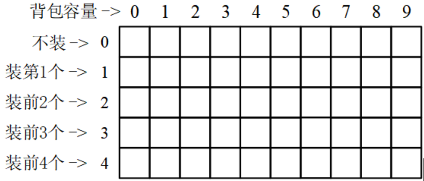

dp矩阵

步骤1：只装第1个物品。

由于物品1的体积是2，所以背包容量小于2的，都放不进去，得dp\[1\]\[0\]=dp\[1\]\[1\]=0；

物品1的体积等于背包容量，能装进去，背包价值等于物品1的价值，dp\[1\]\[2\]=6；

容量大于2的背包，多余的容量用不到，所以价值和容量2的背包一样。

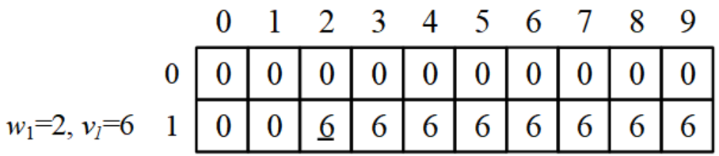

装第1个物品

步骤2：只装前2个物品。

如果物品2体积比背包容量大，那么不能装物品2，情况和只装第1个一样。见下图中的dp\[2\]\[0\]=dp\[2\]\[1\]=0，dp\[2\]\[2\]=6。

下面填dp\[2\]\[3\]。物品2体积等于背包容量，那么可以装物品2，也可以不装：

（a）如果装物品2（体积是3），那么可以变成一个更小的问题，即只把物品1装到（容量 - 3）的背包中。

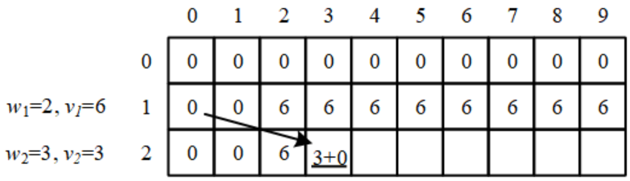

装第2个物品

（b）如果不装物品2，那么相当于只把物品1装到背包中。

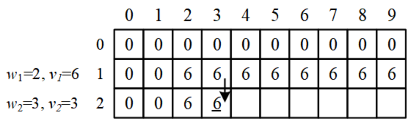

不装第2个物品

取（a）和（b）的最大值，得dp\[2\]\[3\]=max{3,6}=6。

后续步骤：继续以上过程，最后得到下图（图中的箭头是几个例子）：

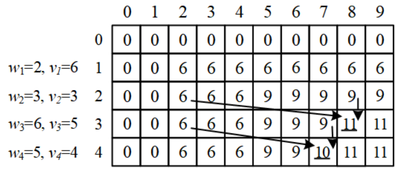

完成dp矩阵

最后的答案是dp\[4\]\[9\]：把4个物品装到容量为9的背包，最大价值是11。

（4）输出背包方案

现在回头看具体装了哪些物品。需要倒过来观察：

dp\[4\]\[9\]=maxdp\[3\]\[4\]+4,dp\[3\]\[9\]=dp\[3\]\[9\]，说明没有装物品4，用x4=0表示；

dp\[3\]\[9\]=maxdp\[2\]\[3\]+5,dp\[2\]\[9\]=dp\[2\]\[3\]+5=11，说明装了物品3，x3=1；

dp\[2\]\[3\]=maxdp\[1\]\[0\]+3,dp\[1\]\[3\]=dp\[1\]\[3\]，说明没有装物品2，x2=0；

dp\[1\]\[3\]=maxdp\[0\]\[1\]+6,dp\[0\]\[3\]=dp\[0\]\[1\]+6=6，说明装了物品1，x1=1。

图中的实线箭头指出了方案的路径。

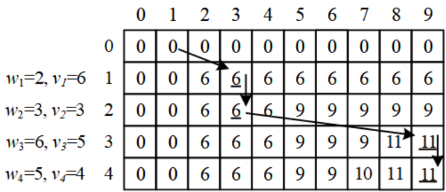

背包方案

（5）记忆化代码和递推代码

下面的代码分别用自下而上的递推和自上而下的记忆化递归实现。

1）递推代码。

```cpp
#include<bits/stdc++.h>
using namespace std;
struct BONE{
	int value, volum;
}bone[1011];
int dp[1011][1011];
int solve(int n, int c){
    for(int i=1; i<=n; i++)
        for(int j=0; j<=c; j++){
     	  if(bone[i].volum > j)        //第i个物品比背包还大，装不了
              dp[i][j] = dp[i-1][j];
           else                        //第i个物品可以装
	          dp[i][j] = max(dp[i-1][j], dp[i-1][j-bone[i].volum]+bone[i].value);
    }
    return dp[n][c];
}
int main(){    
	int T; cin>>T;
	while(T--){
		int N,C; cin >> N >> C;
		for(int i=1;i<=N;i++)	cin>>bone[i].value;
		for(int i=1;i<=N;i++)	cin>>bone[i].volum;
        memset(dp,0,sizeof(dp));
		cout << solve(N, C) << endl;
	}
	return 0;
}
```

2）记忆化代码。只改动了上面代码中的solve()。

```cpp
int solve(int i, int j){        //前i个物品，放进容量j的背包
    if (dp[i][j] != 0)           //记忆化
        return dp[i][j];    
	if(i == 0) return 0;	
	int res;
	if(bone[i].volum > j)            //第i个物品比背包还大，装不了
        res =  solve(i-1,j);    
	else                           //第i个物品可以装
        res =  max(solve(i-1,j), solve(i-1,j-bone[i].volum)+bone[i].value);    
    return dp[i][j] = res;
}
```

（6）滚动数组

上述代码使用了二维矩阵dp\[\]\[\]，有可能超过题目许可的空间限制。此时可以用滚动数组减少空间，也就是把dp\[\]\[\]替换成一维的dp\[\]。观察二维表dp\[\]\[\]，可以发现，每一行是从上面一行算出来的，只跟上面一行有关系，跟更前面的行没有关系，那么用新的一行覆盖原来的一行（滚动）就好了。

```cpp
int dp[1011];                                    //替换 int dp[1011][1011];
int solve(int n, int c){
    for(int i=1; i<=n; i++)
        for(int j=c; j>=bone[i].volum; j--)  //反过来循环
            dp[j] = max(dp[j],dp[j-bone[i].volum]+bone[i].value);
    return dp[c];
}
```

注意j应该反过来循环，即从后面往前面覆盖。请读者思考原因。

经过滚动数组的优化，空间复杂度从O(N×C)减少为O(C)。

滚动数组也有缺点。它覆盖了中间转移状态，只留下了最后的状态，所以损失了很多信息，导致无法输出背包的方案。

二维以上的dp数组也常常能优化。比如求dp\[t\]\[\]\[\]，如果它只和dp\[t−1\]\[\]\[\]有关，不需dp\[t−2\]\[\]\[\]、dp\[t−3\]\[\]\[\]等，那么可以把数组缩小为dp\[2\]\[\]\[\]。后面的很多问题都可以用滚动数组优化。

## 完全背包

### 解释

完全背包模型与 0-1 背包类似，与 0-1 背包的区别仅在于一个物品可以选取无限次，而非仅能选取一次。

我们可以借鉴 0-1 背包的思路，进行状态定义：设 $f_{i,j}$ 为只能选前 $i$ 个物品时，容量为 $j$ 的背包可以达到的最大价值。

需要注意的是，虽然定义与 0-1 背包类似，但是其状态转移方程与 0-1 背包并不相同。

### 过程

可以考虑一个朴素的做法：对于第 $i$ 件物品，枚举其选了多少个来转移。这样做的时间复杂度是 $O(n^3)$ 的。

状态转移方程如下：

$$
f_{i,j}=\max_{k=0}^{+\infty}(f_{i-1,j-k\times w_i}+v_i\times k)
$$

考虑做一个简单的优化。可以发现，对于 $f_{i,j}$，只要通过 $f_{i,j-w_i}$ 转移就可以了。因此状态转移方程为：

$$
f_{i,j}=\max(f_{i-1,j},f_{i,j-w_i}+v_i)
$$

理由是当我们这样转移时，$f_{i,j-w_i}$ 已经由 $f_{i,j-2\times w_i}$ 更新过，那么 $f_{i,j-w_i}$ 就是充分考虑了第 $i$ 件物品所选次数后得到的最优结果。换言之，我们通过局部最优子结构的性质重复使用了之前的枚举过程，优化了枚举的复杂度。

与 0-1 背包相同，我们可以将第一维去掉来优化空间复杂度。如果理解了 0-1 背包的优化方式，就不难明白压缩后的循环是正向的（也就是上文中提到的错误优化）。

??? note "[「Luogu P1616」疯狂的采药](https://www.luogu.com.cn/problem/P1616)"
    题意概要：有 $n$ 种物品和一个容量为 $W$ 的背包，每种物品有重量 $w_{i}$ 和价值 $v_{i}$ 两种属性，要求选若干个物品放入背包使背包中物品的总价值最大且背包中物品的总重量不超过背包的容量。

??? 例题代码
    ```cpp
    --8<-- "docs/dp/code/knapsack/knapsack_2.cpp"
    ```

## 多重背包

多重背包也是 0-1 背包的一个变式。与 0-1 背包的区别在于每种物品有 $k_i$ 个，而非一个。

一个很朴素的想法就是：把「每种物品选 $k_i$ 次」等价转换为「有 $k_i$ 个相同的物品，每个物品选一次」。这样就转换成了一个 0-1 背包模型，套用上文所述的方法就可已解决。状态转移方程如下：

$$
f_{i,j}=\max_{k=0}^{k_i}(f_{i-1,j-k\times w_i}+v_i\times k)
$$

时间复杂度 $O(W\sum_{i=1}^nk_i)$。

### 二进制分组优化

考虑优化。我们仍考虑把多重背包转化成 0-1 背包模型来求解。

### 解释

显然，复杂度中的 $O(nW)$ 部分无法再优化了，我们只能从 $O(\sum k_i)$ 处入手。为了表述方便，我们用 $A_{i,j}$ 代表第 $i$ 种物品拆分出的第 $j$ 个物品。

在朴素的做法中，$\forall j\le k_i$，$A_{i,j}$ 均表示相同物品。那么我们效率低的原因主要在于我们进行了大量重复性的工作。举例来说，我们考虑了「同时选 $A_{i,1},A_{i,2}$」与「同时选 $A_{i,2},A_{i,3}$」这两个完全等效的情况。这样的重复性工作我们进行了许多次。那么优化拆分方式就成为了解决问题的突破口。

### 过程

我们可以通过「二进制分组」的方式使拆分方式更加优美。

具体地说就是令 $A_{i,j}\left(j\in\left[0,\lfloor \log_2(k_i+1)\rfloor-1\right]\right)$ 分别表示由 $2^{j}$ 个单个物品「捆绑」而成的大物品。特殊地，若 $k_i+1$ 不是 $2$ 的整数次幂，则需要在最后添加一个由 $k_i-2^{\lfloor \log_2(k_i+1)\rfloor-1}$ 个单个物品「捆绑」而成的大物品用于补足。

举几个例子：

-   $6=1+2+3$
-   $8=1+2+4+1$
-   $18=1+2+4+8+3$
-   $31=1+2+4+8+16$

显然，通过上述拆分方式，可以表示任意 $\le k_i$ 个物品的等效选择方式。将每种物品按照上述方式拆分后，使用 0-1 背包的方法解决即可。

时间复杂度 $O(W\sum_{i=1}^n\log_2k_i)$

### 实现

??? 二进制分组代码
    === "C++"
    
        ```cpp
        index = 0;
        for (int i = 1; i <= m; i++) {
          int c = 1, p, h, k;
          cin >> p >> h >> k;
          while (k > c) {
            k -= c;
            list[++index].w = c * p;
            list[index].v = c * h;
            c *= 2;
          }
          list[++index].w = p * k;
          list[index].v = h * k;
        }
        ```
    
    === "Python"
    
        ```python
        index = 0
        for i in range(1, m + 1):
            c = 1
            p, h, k = map(int, input().split())
            while k > c:
                k -= c
                list[index].w = c * p
                index += 1
                list[index].v = c * h
                c *= 2
            list[index].w = p * k
            index += 1
            list[index].v = h * k
        ```

### 单调队列优化

见 [单调队列/单调栈优化](./opt/monotonous-queue-stack.md)。

习题：[「Luogu P1776」宝物筛选\_NOI 导刊 2010 提高（02）](https://www.luogu.com.cn/problem/P1776)

## 混合背包

混合背包就是将前面三种的背包问题混合起来，有的只能取一次，有的能取无限次，有的只能取 $k$ 次。

这种题目看起来很吓人，可是只要领悟了前面几种背包的中心思想，并将其合并在一起就可以了。下面给出伪代码：

### 过程

```plain
for (循环物品种类) {
  if (是 0 - 1 背包)
    套用 0 - 1 背包代码;
  else if (是完全背包)
    套用完全背包代码;
  else if (是多重背包)
    套用多重背包代码;
}
```

??? note "[「Luogu P1833」樱花](https://www.luogu.com.cn/problem/P1833)"
    题意概要：有 $n$ 种樱花树和长度为 $T$ 的时间，有的樱花树只能看一遍，有的樱花树最多看 $A_{i}$ 遍，有的樱花树可以看无数遍。每棵樱花树都有一个美学值 $C_{i}$，求在 $T$ 的时间内看哪些樱花树能使美学值最高。

## 二维费用背包

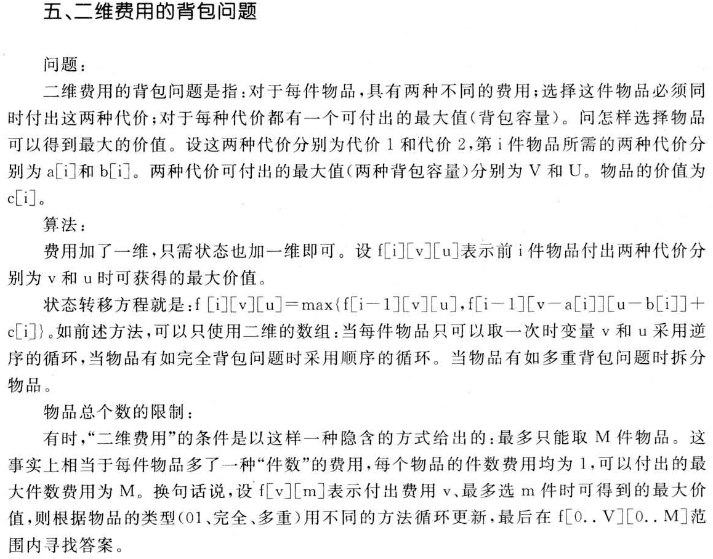

???+ note "[「Luogu P1855」榨取 kkksc03](https://www.luogu.com.cn/problem/P1855)"
    有 $n$ 个任务需要完成，完成第 $i$ 个任务需要花费 $t_i$ 分钟，产生 $c_i$ 元的开支。
    
    现在有 $T$ 分钟时间，$W$ 元钱来处理这些任务，求最多能完成多少任务。

这道题是很明显的 0-1 背包问题，可是不同的是选一个物品会消耗两种价值（经费、时间），只需在状态中增加一维存放第二种价值即可。

这时候就要注意，再开一维存放物品编号就不合适了，因为容易 MLE。

### 实现

=== "C++"

    ```cpp
    for (int k = 1; k <= n; k++)
      for (int i = m; i >= mi; i--)    // 对经费进行一层枚举
        for (int j = t; j >= ti; j--)  // 对时间进行一层枚举
          dp[i][j] = max(dp[i][j], dp[i - mi][j - ti] + 1);
    ```

=== "Python"

    ```python
    for k in range(1, n + 1):
        for i in range(m, mi - 1, -1): # 对经费进行一层枚举
            for j in range(t, ti - 1, -1): # 对时间进行一层枚举
                dp[i][j] = max(dp[i][j], dp[i - mi][j - ti] + 1)
    ```

## 分组背包

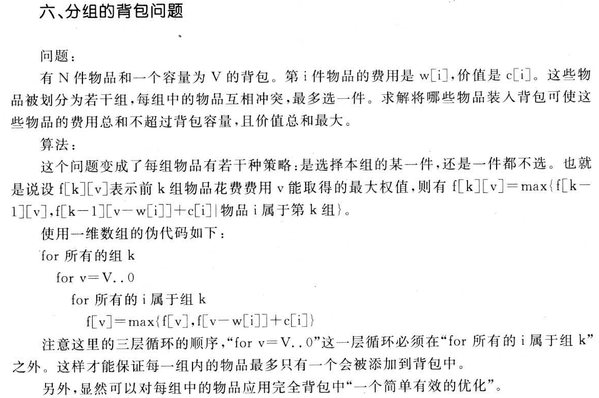

???+ note "[「Luogu P1757」通天之分组背包](https://www.luogu.com.cn/problem/P1757)"
    有 $n$ 件物品和一个大小为 $m$ 的背包，第 $i$ 个物品的价值为 $w_i$，体积为 $v_i$。同时，每个物品属于一个组，同组内最多只能选择一个物品。求背包能装载物品的最大总价值。

这种题怎么想呢？其实是从「在所有物品中选择一件」变成了「从当前组中选择一件」，于是就对每一组进行一次 0-1 背包就可以了。

再说一说如何进行存储。我们可以将 $t_{k,i}$ 表示第 $k$ 组的第 $i$ 件物品的编号是多少，再用 $\mathit{cnt}_k$ 表示第 $k$ 组物品有多少个。

### 实现

=== "C++"

    ```cpp
    for (int k = 1; k <= ts; k++)           // 循环每一组
      for (int i = m; i >= 0; i--) // 循环背包容量
        for (int j = 1; j <= cnt[k]; j++)   // 循环该组的每一个物品
          if (i >= w[t[k][j]])  // 背包容量充足
            dp[i] = max(dp[i], dp[i - w[t[k][j]]] + c[t[k][j]]);  // 像0-1背包一样状态转移
    ```

=== "Python"

    ```python
    for k in range(1, ts + 1): # 循环每一组
        for i in range(m, -1, -1): # 循环背包容量
            for j in range(1, cnt[k] + 1):     # 循环该组的每一个物品
                if i >= w[t[k][j]]: #背包容量充足
                    dp[i] = max(dp[i], dp[i - w[t[k][j]]] + c[t[k][j]]) # 像0-1背包一样状态转移
    ```

这里要注意：**一定不能搞错循环顺序**，这样才能保证正确性。

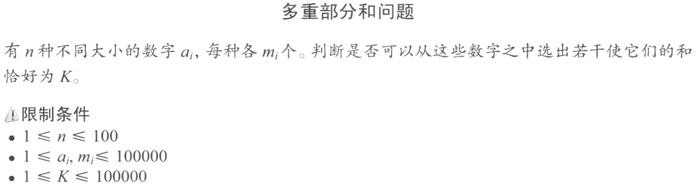

Slow Solution

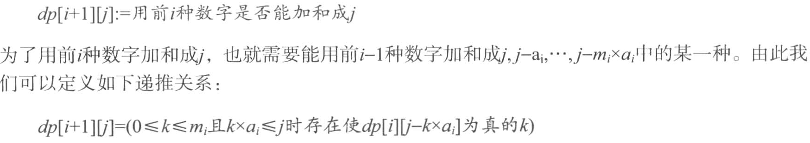

Fast Solution

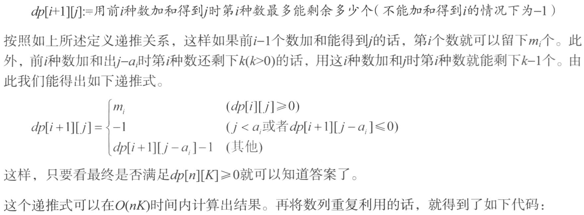

## 有依赖的背包

???+ note "[「Luogu P1064」金明的预算方案](https://www.luogu.com.cn/problem/P1064)"
    金明有 $n$ 元钱，想要买 $m$ 个物品，第 $i$ 件物品的价格为 $v_i$，重要度为 $p_i$。有些物品是从属于某个主件物品的附件，要买这个物品，必须购买它的主件。
    
    目标是让所有购买的物品的 $v_i \times p_i$ 之和最大。

考虑分类讨论。对于一个主件和它的若干附件，有以下几种可能：只买主件，买主件 + 某些附件。因为这几种可能性只能选一种，所以可以将这看成分组背包。

如果是多叉树的集合，则要先算子节点的集合，最后算父节点的集合。

## 泛化物品的背包

这种背包，没有固定的费用和价值，它的价值是随着分配给它的费用而定。在背包容量为 $V$ 的背包问题中，当分配给它的费用为 $v_i$ 时，能得到的价值就是 $h\left(v_i\right)$。这时，将固定的价值换成函数的引用即可。

## 杂项

### 小优化

根据贪心原理，当费用相同时，只需保留价值最高的；当价值一定时，只需保留费用最低的；当有两件物品 $i,j$ 且 $i$ 的价值大于 $j$ 的价值并且 $i$ 的费用小于 $j$ 的费用时，只需保留 $i$。

### 背包问题变种

#### 实现

输出方案其实就是记录下来背包中的某一个状态是怎么推出来的。我们可以用 $g_{i,v}$ 表示第 $i$ 件物品占用空间为 $v$ 的时候是否选择了此物品。然后在转移时记录是选用了哪一种策略（选或不选）。输出时的伪代码：

```cpp
int v = V;  // 记录当前的存储空间

// 因为最后一件物品存储的是最终状态，所以从最后一件物品进行循环
for (从最后一件循环至第一件) {
  if (g[i][v]) {
    选了第 i 项物品;
    v -= 第 i 项物品的重量;
  } else {
    未选第 i 项物品;
  }
}
```

#### 求方案数

对于给定的一个背包容量、物品费用、其他关系等的问题，求装到一定容量的方案总数。

这种问题就是把求最大值换成求和即可。

例如 0-1 背包问题的转移方程就变成了：

$$
\mathit{dp}_i=\sum(\mathit{dp}_i,\mathit{dp}_{i-c_i})
$$

初始条件：$\mathit{dp}_0=1$

因为当容量为 $0$ 时也有一个方案，即什么都不装。

#### 求最优方案总数

要求最优方案总数，我们要对 0-1 背包里的 $\mathit{dp}$ 数组的定义稍作修改，DP 状态 $f_{i,j}$ 为在只能放前 $i$ 个物品的情况下，容量为 $j$ 的背包「正好装满」所能达到的最大总价值。

这样修改之后，每一种 DP 状态都可以用一个 $g_{i,j}$ 来表示方案数。

$f_{i,j}$ 表示只考虑前 $i$ 个物品时背包体积「正好」是 $j$ 时的最大价值。

$g_{i,j}$ 表示只考虑前 $i$ 个物品时背包体积「正好」是 $j$ 时的方案数。

转移方程：

如果 $f_{i,j} = f_{i-1,j}$ 且 $f_{i,j} \neq f_{i-1,j-v}+w$ 说明我们此时不选择把物品放入背包更优，方案数由 $g_{i-1,j}$ 转移过来，

如果 $f_{i,j} \neq f_{i-1,j}$ 且 $f_{i,j} = f_{i-1,j-v}+w$ 说明我们此时选择把物品放入背包更优，方案数由 $g_{i-1,j-v}$ 转移过来，

如果 $f_{i,j} = f_{i-1,j}$ 且 $f_{i,j} = f_{i-1,j-v}+w$ 说明放入或不放入都能取得最优解，方案数由 $g_{i-1,j}$ 和 $g_{i-1,j-v}$ 转移过来。

初始条件：

```cpp
memset(f, 0x3f3f, sizeof(f));  // 避免没有装满而进行了转移
f[0] = 0;
g[0] = 1;  // 什么都不装是一种方案
```

因为背包体积最大值有可能装不满，所以最优解不一定是 $f_{m}$。

最后我们通过找到最优解的价值，把 $g_{j}$ 数组里取到最优解的所有方案数相加即可。

???+ note "实现"
    ```cpp
    for (int i = 0; i < N; i++) {
      for (int j = V; j >= v[i]; j--) {
        int tmp = std::max(dp[j], dp[j - v[i]] + w[i]);
        int c = 0;
        if (tmp == dp[j]) c += cnt[j];                       // 如果从dp[j]转移
        if (tmp == dp[j - v[i]] + w[i]) c += cnt[j - v[i]];  // 如果从dp[j-v[i]]转移
        dp[j] = tmp;
        cnt[j] = c;
      }
    }
    int max = 0;  // 寻找最优解
    for (int i = 0; i <= V; i++) {
      max = std::max(max, dp[i]);
    }
    int res = 0;
    for (int i = 0; i <= V; i++) {
      if (dp[i] == max) {
        res += cnt[i];  // 求和最优解方案数
      }
    }
    ```

#### 背包的第 k 优解

普通的 0-1 背包是要求最优解，在普通的背包 DP 方法上稍作改动，增加一维用于记录当前状态下的前 k 优解，即可得到求 0-1 背包第 $k$ 优解的算法。
具体来讲：$\mathit{dp_{i,j,k}}$ 记录了前 $i$ 个物品中，选择的物品总体积为 $j$ 时，能够得到的第 $k$ 大的价值和。这个状态可以理解为将普通 0-1 背包只用记录一个数据的 $\mathit{dp_{i,j}}$ 扩展为记录一个有序的优解序列。转移时，普通背包最优解的求法是 $\mathit{dp_{i,j}}=\max(\mathit{dp_{i-1,j}},\mathit{dp_{i-1,j-v_{i}}}+w_{i})$，现在我们则是要合并 $\mathit{dp_{i-1,j}}$，$\mathit{dp_{i-1,j-v_{i}}}+w_{i}$ 这两个大小为 $k$ 的递减序列，并保留合并后前 $k$ 大的价值记在 $\mathit{dp_{i,j}}$ 里，这一步利用双指针法，复杂度是 $O(k)$ 的，整体时间复杂度为 $O(nmk)$。空间上，此方法与普通背包一样可以压缩掉第一维，复杂度是 $O(mk)$ 的。

??? note "[例题 hdu 2639 Bone Collector II](https://vjudge.net/problem/HDU-2639)"
    求 0-1 背包的严格第 $k$ 优解。$n \leq 100,v \leq 1000,k \leq 30$

??? note "实现"
    ```cpp
    memset(dp, 0, sizeof(dp));
    int i, j, p, x, y, z;
    scanf("%d%d%d", &n, &m, &K);
    for (i = 0; i < n; i++) scanf("%d", &w[i]);
    for (i = 0; i < n; i++) scanf("%d", &c[i]);
    for (i = 0; i < n; i++) {
      for (j = m; j >= c[i]; j--) {
        for (p = 1; p <= K; p++) {
          a[p] = dp[j - c[i]][p] + w[i];
          b[p] = dp[j][p];
        }
        a[p] = b[p] = -1;
        x = y = z = 1;
        while (z <= K && (a[x] != -1 || b[y] != -1)) {
          if (a[x] > b[y])
            dp[j][z] = a[x++];
          else
            dp[j][z] = b[y++];
          if (dp[j][z] != dp[j][z - 1]) z++;
        }
      }
    }
    printf("%d\n", dp[m][K]);
    ```

## 习题

??? note "[Coins](http://poj.org/problem?id=1742)"
    有n种不同面值的硬币 A1,A2,...,An， 分别有C1,C2,...,Cn 枚。求这些硬币所能组成的小于等于m的不同的面值种类数。

    ??? tip
        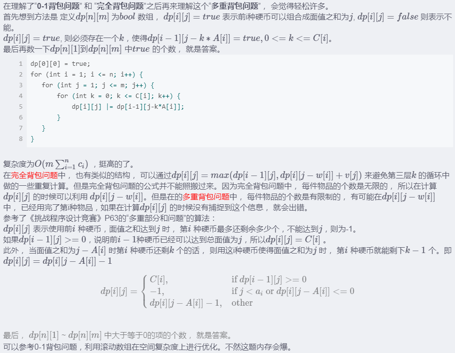

    ??? note "参考代码"

        ```cpp
        #include <cstdio>
        #include <cstring>
        using namespace std;
        const int M = 1e5 + 5, N = 105;
        int a[N], c[N], f[M], g[M], n, m;
        int main() {
            while (scanf("%d%d", &n, &m), n) {
                memset(f, 0, sizeof(f));
                for (int i = 1; i <= n; i++) scanf("%d", a + i);
                for (int i = 1; i <= n; i++) scanf("%d", c + i);
                f[0] = 1;
                for (int i = 1; i <= n; i++) {
                    memset(g, 0, sizeof(g));
                    for (int j = a[i]; j <= m; j++) {
                        if (!f[j] && f[j - a[i]] && g[j - a[i]] < c[i]) {
                            f[j] = 1;
                            g[j] = g[j - a[i]] + 1; 
                        }
                    } 
                }
                int ans = 0;
                for (int i = 1; i <= m; i++) ans += f[i];
                printf("%d\n", ans); 
            }
            return 0;
        }
        ```

??? note "[Ant Counting](http://poj.org/problem?id=3046)"
    蚂蚁有T个家族，每个家族里的蚂蚁没有区别，总共有A只蚂蚁，现在问：给出每个家族的蚂蚁数量，最多能组合成多少个不同的集合个数为S~B的集合？就是给你T个集合，每个集合$num[i]$个数，这些数排列组合能有多少个，个数为S~B的集合。

    ??? tip
        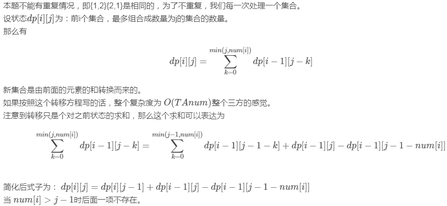

    ??? note "参考代码"

        ```cpp
        #include<cstdio>
        #include<iostream>
        using namespace std;
        
        const int MAXN = 1E5+10;
        const int  MOD = 1E6;
        int f[2][MAXN];
        int ant[1000+10];
        int T,A,S,B; 
        
        int main()
        {
            scanf("%d%d%d%d",&T,&A,&S,&B);
            for(int i=0;i<A;i++)
            {
                int v; scanf("%d",&v); ant[v]++;
            }
            f[0][0]=f[1][0]=1;  //滚动数组优化空间
            for(int i=1;i<=T;i++)
            {
                for(int j=1;j<=B;j++)
                {
                    if(j-ant[i]-1>=0)
                        f[i&1][j]=f[i&1][j-1]+f[(i-1)&1][j]-f[(i-1)&1][j-ant[i]-1];
                    else
                        f[i&1][j]=f[i&1][j-1]+f[(i-1)&1][j];
                    f[i&1][j]=(f[i&1][j]+MOD)%MOD;
                }
            }
            long long sum=0;
            for(int i=S;i<=B;i++) sum+=f[T&1][i],sum%=MOD;
            printf("%lld",sum);
        } 
        ```

## 参考资料与注释

-   [背包问题九讲 - 崔添翼](https://github.com/tianyicui/pack)。
