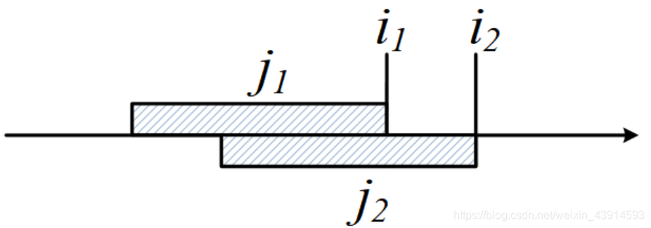
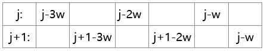
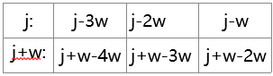

author: Marcythm, hsfzLZH1, Ir1d, greyqz, Anguei, billchenchina, Chrogeek, ChungZH

## 介绍

前置知识：[单调队列](../../ds/monotonous-queue.md)、[单调栈](../../ds/monotonous-stack.md)。

单调队列是很常见的DP优化技术，本节讲解基本的思路和方法。在[斜率优化](./slope.md)中，单调队列也有关键的应用。

### 单调队列优化的原理
先回顾单调队列的概念，它有以下特征：
1. 单调队列的实现。用双端队列实现，队头和队尾都能插入和弹出。手写双端队列很简单。
2. 单调队列的单调性。队列内的元素具有单调性，从小到大，或者从大到小。
3. 单调队列的维护。每个新元素都能进入队列，它从队尾进入队列时，为维护队列的单调性，应该与队尾比较，把破坏单调性的队尾弹出。例如一个从小到大的单调队列，如果要进队的新元素a比原队尾v小，那么把v弹走，然后a继续与新的队尾比较，直到a比队尾大为止，最后a进队尾。

单调队列在DP优化中的基本应用，是对这样一类DP方程进行优化：
`dp[i]=min{dp[j]+a[i]+b[j]}  L(i)≤j≤R(i)` --方程(1)

公式中的min也可以是max。方程的特点是其中关于i的项a\[i\]和关于j的项b\[j\]是独立的。j被限制在窗口\[L(i),R(i)\]内，常见的例如给定一个窗口值k，i−k ≤ j ≤ i。这个DP方程的编程实现，如果简单地对i做外层循环，对j做内层循环，复杂度O(n^2^)。如果用单调队列优化，复杂度可提高到O(n)。

为什么单调队列能优化这个DP方程？

概况地说，**单调队列优化算法能把内外i、j两层循环，精简到一层循环**。其本质原因是“**外层i变化时，不同的i所对应的内层j的窗口有重叠**”。如下图所示，i=i1时，对应的j1的移动窗口（窗口内处理DP决策）范围是上面的阴影部分；i=i2时，对应的j2处理的移动窗口范围是下面的阴影；两部分有重叠。当i从i1增加到i2时，这些重叠的部分被重复计算，如果减少这些重复，就得到了优化。



外层i和内层j的循环

在窗口内处理的这些决策，有两种情况：

1. 被排除的不合格决策。内层循环j排除的不合格决策，在外层循环i增大时，需要重复排除。
2. 未被排除的决策。内层j未排除的决策，在外层i增大时，仍然能按原来的顺序被用到。

那么可以用单调队列统一处理这些决策，从而精简到只用一个循环，得到优化。下面详细介绍单调队列的操作。

（1）求一个dp\[i\]。i是外层循环，j是内层循环，在做j的内层循环时，可以把外层的i看成一个定值。此时a\[i\]可以看成常量，把j看成窗口\[L(i), R(i)\]内的变量，DP方程(1)等价于：

`dp[i]=min{dp[j]+b[j]}+a[i]`

问题转化为求窗口\[L(i),R(i)\]内的最优值`min{dp[j]+b[j]}`。记`ds[j]=dp[j]+b[j]`,在窗口内，用单调队列处理ds\[j\]，排除掉不合格的决策，最后求得区间内的最优值，最优值即队首。得到窗口内的最优值后，就可以求得dp\[i\]。另外，队列中留下的决策，在i变化后仍然有用。

请注意，队列处理的决策ds\[j\]只和j有关，和i无关，这是本优化方法的关键。如果既和i有关，又和j有关，它就不能在下一步“（2）求所有的dp\[i\]”时得到应用。具体来说是这样的：1）如果ds\[j\]只和j有关，那么一个较小的i1操作的某个策略ds\[j\]，和一个较大的i2所操作的某个策略ds\[j\]是相等的，从而产生了重复性，可以优化；2）如果ds[]和i、j都有关，那么就没有重复性，无法优化。请结合后面的例题深入理解。
（2）求所有的dp\[i\]。考虑外层循环i变化时的优化方法。一个较小的i1所排除的ds\[j\]，在处理一个较大的i2时，也会被排除，重复排除其实没有必要；一个较小的i1所得到的决策，仍能用于一个较大的i2。统一用一个单调队列处理所有的i，每个ds\[j\]（提示：此时j不再局限于窗口\[L(i),R(i)\]，而是整个区间1 ≤ j ≤ n，那么ds\[j\]实际上就是ds\[i\]了)都进入队列一次，并且只进入队列一次，总复杂度O(n)。此时内外层循环i、j精简为一个循环i。

下面的例题是以上原理的模板题。

### 例题

???+note "[Mowing the Lawn](https://www.luogu.com.cn/problem/P2627)"
    有一个包括n个正整数的序列，第i个整数是Ei，给定一个整数k，找这样的子序列，子序列中的数在原序列连续的不能超过k个。对子序列求和，问所有子序列中最大的和是多少。1 ≤ n ≤ 100,000，0 ≤ Ei ≤ 1,000,000,000，1 ≤ k ≤ n。
    
    例如n = 5，{7, 2, 3, 4, 5}，k = 2，子序列{7, 2, 4, 5}有最大和18，其中的连续部分是{7,2}、{4,5}，长度都不超过k = 2。

由于n较大，算法的复杂度应该小于O(n^2^)，否则会超时。

用DP解题，定义 dp\[i\]为前i头奶牛的最大子序列和，状态转移方程是：

`dp[i]=max{dp[j−1]+sum[i]−sum[j]} i−k≤j≤i`

其中sum\[i\]是前缀和，即从E1 加到Ei。

方程符合单调队列优化的标准方程：`dp[i]=min{dp[j]+b[j]}+a[i]`。下面用这个例子详细讲解单调优化队列的操作过程。

把i看成定值，上述方程等价于下面的方程：

`dp[i]=max{dp[j−1]−sum[j]}+sum[i] i−k≤j≤i`

求dp\[i\]，就是找到一个决策j，i−k ≤ j ≤ i，使得dp\[j−1\]−sum\[j\]最大。

对这个方程编程求解，如果简单地做i、j的循环，复杂度是O(nk)的，约等于O(n^2^)。

如何优化？回顾单调队列优化的实质：“**外层i变化时，不同的i所对应的内层j的窗口有重叠**”。

内层j所处理的决策dp\[j−1\]−sum\[j\]，在i变化时，确实发生了重叠。下面推理如何使用单调队列。

首先，对一个固定的i，用一个递减的单调队列求最大的dp\[j−1\]−sum\[j\]。记ds\[j\]=dp\[j−1\]−sum\[j\]，并记这个i对应的最大值为dsmax\[i\]=max{ds\[j\]}。用单调队列求dsmax\[i\]的步骤见下面的说明。

1. 设从j=1开始，首先让ds\[1\]进队列。此时窗口内的最大值dsmax\[i\]=ds\[1\]。
2. j=2，ds\[2\]进队列，讨论两种情况：
    
    1）若ds\[2\]≥ds\[1\], 说明ds\[2\]更优，弹走ds\[1\]，ds\[2\]进队成为新队头，更新dsmax\[i\]=ds\[2\]。这一步排除了不好的决策，留下更好的决策。
    
    2）若`ds[2]<ds[1]`, ds\[2\]进队列。队头仍然是ds\[1\]，保持dsmax\[i\]=ds\[1\]。
    这2种情况下ds\[2\]都进队，是因为ds\[2\]比ds\[1\]更晚于离开窗口范围k，即存活时间更长。

3. 继续以上操作，让窗口内的每个j，i−k≤j≤i，都有机会进队，并保持队列是从大到小的单调队列。

经过以上步骤，求得了固定一个i时的最大值dsmax\[i\]。

当i变化时，统一用一个单调队列处理，因为一个较小的i1所排除的ds\[j\]，在处理后面较大的i2时，也会被排除，没有必要再重新排除一次；而且较小的i1所得到的队列，后面较大的i2也仍然有用。这样，每个ds\[j\]（1 ≤ j ≤ n)都有机会进入队列一次，并且只进入队列一次，总复杂度O(n)。

如果对上述解释仍有疑问，请仔细分析洛谷P2627的代码。注意一个小技巧：虽然理论上在队列中处理的决策是dp\[j−1\]−sum\[j\]，但是在编码时不用这么麻烦，队列只需要记录j，然后在判断的时候用dp\[j−1\]−sum\[j\]进行计算即可。

代码中去头和去尾的2个while语句是单调队列的常用写法，可以看作单调队列的特征。

```cpp
#include <bits/stdc++.h>
using namespace std;
const int maxn=100005;
long long n,k,e[maxn],sum[maxn],dp[maxn];
long long ds[maxn];          //ds[j] = dp[j-1]-sum[j]
int q[maxn],head=0,tail=1;   //递减的单调队列，队头最大
long long que_max(int j){
    ds[j] = dp[j-1]-sum[j];
    while(head<=tail && ds[q[tail]]<ds[j]) //去掉不合格的队尾
        tail--;
    q[++tail]=j;                           //j进队尾
    while(head<=tail && q[head]<j-k)       //去掉超过窗口k的队头
        head++;
    return ds[q[head]];                    //返回队头，即最大的dp[j-1]-sum[j]
}
int main(){
    cin >> n >> k;   sum[0] = 0;
    for(int i=1;i<=n;i++){
        cin >> e[i];
        sum[i] = sum[i-1] + e[i];          //计算前缀和
    }
    for(int i=1;i<=n;i++)
        dp[i] = que_max(i) + sum[i];       //状态转移方程
    cout << dp[n];
}
```

???+note " 例题 [CF372C Watching Fireworks is Fun](http://codeforces.com/problemset/problem/372/C)"
    题目大意：城镇中有 $n$ 个位置，有 $m$ 个烟花要放。第 $i$ 个烟花放出的时间记为 $t_i$，放出的位置记为 $a_i$。如果烟花放出的时候，你处在位置 $x$，那么你将收获 $b_i-|a_i-x|$ 点快乐值。
    
    初始你可在任意位置，你每个单位时间可以移动不大于 $d$ 个单位距离。现在你需要最大化你能获得的快乐值。

设 $f_{i,j}$ 表示在放第 $i$ 个烟花时，你的位置在 $j$ 所能获得的最大快乐值。

写出 **状态转移方程**：$f_{i,j}=\max\{f_{i-1,k}+b_i-|a_i-j|\}$

这里的 $k$ 是有范围的，$j-(t_{i}-t_{i-1})\times d\le k\le j+(t_{i}-t_{i-1})\times d$。

我们尝试将状态转移方程进行变形：

由于 $\max$ 里出现了一个确定的常量 $b_i$，我们可以将它提到外面去。

$f_{i,j}=\max\{f_{i-1,k}+b_i-|a_i-j|\}=\max\{f_{i-1,k}-|a_i-j|\}+b_i$

如果确定了 $i$ 和 $j$ 的值，那么 $|a_i-j|$ 的值也是确定的，也可以将这一部分提到外面去。

最后，式子变成了这个样子：$f_{i,j}=\max\{f_{i-1,k}-|a_i-j|\}+b_i=\max\{f_{i-1,k}\}-|a_i-j|+b_i$

看到这一熟悉的形式，我们想到了什么？**单调队列优化**。由于最终式子中的 $\max$ 只和上一状态中连续的一段的最大值有关，所以我们在计算一个新的 $i$ 的状态值时候只需将原来的 $f_{i-1}$ 构造成一个单调队列，并维护单调队列，使得其能在均摊 $O(1)$ 的时间复杂度内计算出 $\max\{f_{i-1,k}\}$ 的值，从而根据公式计算出 $f_{i,j}$ 的值。

总的时间复杂度为 $O(nm)$。

??? note "参考代码"
    ```cpp
    --8<-- "docs/dp/code/opt/monotonous-queue-stack/monotonous-queue-stack_1.cpp"
    ```

讲完了，让我们归纳一下单调队列优化动态规划问题的基本形态：当前状态的所有值可以从上一个状态的某个连续的段的值得到，要对这个连续的段进行 RMQ 操作，相邻状态的段的左右区间满足非降的关系。

## 单调队列优化多重背包

例题“多重背包”是一个较难的例子，通过它能更透彻地理解单调队列优化的实质。

???+note "[宝物筛选](https://www.luogu.com.cn/problem/P1776)"
    你有 $n$ 个物品，每个物品重量为 $w_i$，价值为 $v_i$，数量为 $k_i$。你有一个承重上限为 $m$ 的背包，现在要求你在不超过重量上限的情况下选取价值和尽可能大的物品放入背包。求最大价值。

不了解背包 DP 的请先阅读 [背包 DP](../knapsack.md)。设 $f_{i,j}$ 表示前 $i$ 个物品装入承重为 $j$ 的背包的最大价值，朴素的转移方程为

$$
f_{i,j}=\max_{k=0}^{k_i}(f_{i-1,j-k\times w_i}+v_i\times k)
$$

时间复杂度 $O(W\sum k_i)$。

考虑优化 $f_i$ 的转移。为方便表述，设 $g_{x,y}=f_{i,x\times w_i+y},g'_{x,y}=f_{i-1,x\times w_i+y}$，则转移方程可以表示为：

$$
g_{x,y}=\max_{k=0}^{k_i}(g'_{x-k,y}+v_i\times k)
$$

设 $G_{x,y}=g'_{x,y}-v_i\times x$。则方程可以表示为：

$$
g_{x,y}=\max_{k=0}^{k_i}(G_{x-k,y})+v_i\times x
$$

这样就转化为一个经典的单调队列优化形式了。$G_{x,y}$ 可以 $O(1)$ 计算，因此对于固定的 $y$，我们可以在 $O\left( \left\lfloor \dfrac{W}{w_i} \right\rfloor \right)$ 的时间内计算出 $g_{x,y}$。因此求出所有 $g_{x,y}$ 的复杂度为 $O\left( \left\lfloor \dfrac{W}{w_i} \right\rfloor \right)\times O(w_i)=O(W)$。这样转移的总复杂度就降为 $O(nW)$。


【罗勇军版本】下面给出多重背包的3种解法：朴素方法、二进制拆分优化、单调队列优化。

**多重背包问题：** 给定n种物品和一个背包，第i种物品的体积是wi，价值为vi，并且有mi个，背包的总容量为W。如何选择装入背包的物品，使得装入背包中的物品的总价值最大?

解法(1): 朴素方法

给出两种思路。

第一种思路，转换为0/1背包问题。把相同的mi个第i种物品看成独立的mi个，总共 $\sum_{i=1}^n m_i$ 个物品，然后按0/1背包求解，复杂度是 $O(W × \sum_{i=1}^n m_i)$ 。

第二种思路，直接求解。定义状态dp\[i\]\[j\]：表示把前i个物品装进容量j的背包，能装进背包的最大价值。第i个物品分为装或不装两种情况，得到多重背包的状态转移方程：

`dp[i][j]=max{dp[i−1][j],dp[i−1][j−k∗w[i]]+k∗v[i]} 1≤k≤min{m[i],j/w[i]}`

直接写i、j、k三重循环，复杂度和第一种思路的复杂度一样。下面用滚动数组编码，提交判题后会超时。

洛谷 P1776：滚动数组版本的多重背包（超时TLE）

```cpp
#include <bits/stdc++.h>
using namespace std;
const int MAXX=100010;
int n,W,dp[MAXX];
int v[MAXX],w[MAXX],m[MAXX];  //物品i的价值、体积、数量
int main(){
    cin >> n >> W;  //物品数量，背包容量
    for(int i=1;i<=n;i++) cin>>v[i]>>w[i]>>m[i];
//以下是滚动数组版本的多重背包
	for(int i=1;i<=n;i++)              //枚举物品
		for(int j=W;j>=w[i];j--)       //枚举背包容量
			for(int k=1; k<=m[i] && k*w[i]<=j; k++)   
 				dp[j] = max(dp[j],dp[j-k*w[i]]+k*v[i]);
cout << dp[W] << endl;
    return 0;
}
```

解法(2): “二进制拆分”优化

这是一种简单而有效的技巧，请读者掌握。在解法（1）的基础上加上这个优化，能显著改善复杂度。原理很简单，例如第i种物品有mi=25个，这25个物品放进背包的组合，有0~25的26种情况。不过要组合成26种情况，其实并不需要25个物品。根据二进制的计算原理，任何一个十进制整数X，都可以用1、2、4、8...这些2的倍数相加得到，例如21 = 16 + 4 + 1，这些2的倍数只有$log_2 X$个。题目中第i种物品有mi个，用$log_2 m_i$个数就能组合出0~mi种情况。总复杂度从 $O(W × \sum_{i=1}^n m_i)$ 优化到了 $O(W × \sum_{i=1}^n log_2 m_i)$ ，已经足够好了。

注意具体拆分的方法，先按2的倍数从小到大拆，最后加上一个小于最大倍数的余数。例如一个物品数量是21个，把它拆成1、2、4、8、6这5个“新物品”，最后的余数是6，6 < 16 = 2^4^，读者可以验证用这5个数能组合成1~21内的所有数字。再例如30，拆成1、2、4、8、15，余数15 < 16 = 2^4^。

洛谷 P1776：二进制拆分+滚动数组

```cpp
#include <bits/stdc++.h>
using namespace std;
const int MAXX=100010;
int n,W,dp[MAXX];
int v[MAXX],w[MAXX],m[MAXX]; 
int new_n;                               //二进制拆分后的新物品总数量
int new_v[MAXX],new_w[MAXX],new_m[MAXX]; //二进制拆分后新物品
int main(){
    cin >> n >>W;  
    for(int i=1;i<=n;i++)  cin>>v[i]>>w[i]>>m[i];
//以下是二进制拆分
	int new_n = 0;
	for(int i=1;i<=n;i++){
		for(int j=1;j<=m[i];j<<=1) {   //二进制枚举：1,2,4...
			m[i]-=j;                   //减去已拆分的
			new_w[++new_n] = j*w[i];   //新物品
			new_v[new_n]   = j*v[i];       
		}
		if(m[i]){                      //最后一个是余数
			new_w[++new_n] = m[i]*w[i];
			new_v[new_n]   = m[i]*v[i]; 
		}
	}
//以下是滚动数组版本的0/1背包
	for(int i=1;i<=new_n;i++)              //枚举物品
		for(int j=W;j>=new_w[i];j--)       //枚举背包容量
			dp[j]=max(dp[j],dp[j-new_w[i]]+new_v[i]);
    cout << dp[W] << endl;
    return 0;
}
```

解法(3): 单调队列优化

用单调队列优化求解多重背包，复杂度是O(nW)，是最优的算法。

回顾解法(1)用滚动数组实现的多重背包程序：

```cpp
for(int i=1;i<=n;i++)              //枚举每个物品
	for(int j=W;j>=w[i];j--)       //枚举背包容量
		for(int k=1; k<=m[i] && k*w[i]<=j; k++)   
			dp[j] = max(dp[j],dp[j-k*w[i]]+k*v[i]);
```

状态转移方程是：`dp[j]=max{dp[j−k*wi]+k*vi}  1≤k≤min{mi,j/wi}`

程序是i、j、k的三重循环。其中循环i、j互相独立，没有关系，不能优化。循环j、k是相关的，k在j上有滑动窗口，所以目标是优化j、k这两层循环，此时可以把与i有关的部分看成定值。

对比单调队列的模板方程：`dp[i]=max{dp[j]+a[i]+b[j]}`

相差太大，似乎并不能应用单调队列。

回顾单调队列优化的实质，“外层i变化时，不同的i所对应的内层j的窗口有重叠”。状态方程`dp[j]=max{dp[j−k*wi]+k*vi}`的外层是j，内层是k，k的滑动窗口是否重叠？下面观察j−k\*wi的变化情况。首先对比外层j和j+1, 让k从1递增，它们的j−k\*wi等于：



没有发生重叠。但是如果对比j和j+wi：



发生了重叠。

可以推理出当j等于j、j+wi、j+2wi、...时有重叠，进一步推理出：当j除以wi的余数相等时，这些j对应的内层k发生重叠。那么，如果把外层j的循环，改成按j除以wi的余数相等的值进行循环，就能利用单调队列优化了。

下面把原状态方程变换为可以应用单调队列的模板方程。

原方程是：
`dp[j]=max{dp[j−k*wi]+k*vi} 1≤k≤min{mi,j/wi}` --方程(2)

令j=b+y\*wi，其中b=j%wi，b为j除以wi得到的余数；y=j/wi，y是j整除wi的结果。

把j代入方程(2)，得：

`dp[b+y*wi]=max{dp[b+(y−k)*wi]+k*vi} 1≤k≤min{mi,y}`

令x=y−k，代入上式得：

`dp[b+y*wi]=max{dp[b+x*wi]−x*vi+y*vi} y−min(mi,y)≤x≤y`

与模板方程`dp[i]=min{dp[j]+a[i]+b[j]}` 对比，几乎一样。

用单调队列处理`dp[b+x*wi]−x*vi`，下面给出代码，上述推理过程，详见代码中的注释。

洛谷 P1776：单调队列优化多重背包

```cpp
#include<bits/stdc++.h>
using namespace std;
const int MAXX=100010;
int n,W;
int dp[MAXX],q[MAXX],num[MAXX];
int w,v,m;                   //物品的价值v、体积w、数量m
int main(){
    cin >> n >> W;            //物品数量n，背包容量W
    memset(dp,0,sizeof(dp));
        
    for(int i=1;i<=n;i++){
        cin>>v>>w>>m;            //物品i的价值v、体积w、数量m
        if(m>W/w) m = W/w;       //计算 min{m, j/w}
        for(int b=0;b<w;b++){    //按余数b进行循环
            int head=1, tail=1;
            for(int y=0;y<=(W-b)/w;y++){      //y = j/w
                int tmp = dp[b+y*w]-y*v;      //用队列处理tmp = dp[b + xw] - xv
                while(head<tail && q[tail-1]<=tmp) tail--;
                q[tail] = tmp;
                num[tail++] = y;
                while(head<tail && y-num[head]>m) head++; // 约束条件 y-min(mi,y)≤x≤y
                dp[b+y*w] = max(dp[b+y*w],q[head]+y*v);   // 计算新的dp[]
            }
        }
    }
    cout << dp[W] << endl;
    return 0;
}
```

算法的复杂度：外层i循环n次，内层的b和y循环总次数是w×(W−b)/w≈W，且每次只进出队列一次，所以总复杂度是O(nW)。

## 习题

- [琪露诺](https://www.luogu.com.cn/problem/P1725)
- [跳房子](https://www.luogu.com.cn/problem/P3957)
- [Fence](http://poj.org/problem?id=1821)
- [Dividing the Path](http://poj.org/problem?id=2373)
- [Cut the Sequence](http://poj.org/problem?id=3017)
- [Parade](http://poj.org/problem?id=3926)
- [Trade](https://vjudge.net/problem/HDU-3401)
- [Queen’s Case](https://vjudge.net/problem/HDU-3514)
- [Fxx and game](https://vjudge.net/problem/HDU-5945)
- [「Luogu P1886」滑动窗口](https://loj.ac/problem/10175)
- [「NOI2005」瑰丽华尔兹](https://www.luogu.com.cn/problem/P2254)
- [「SCOI2010」股票交易](https://loj.ac/problem/10183)
