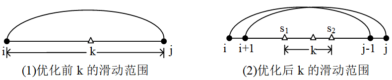
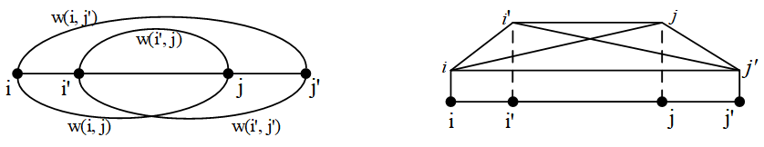
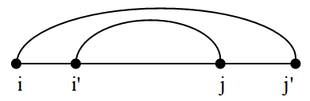
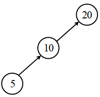

author: Marcythm, zyf0726, hsfzLZH1, MingqiHuang, Ir1d, greyqz, billchenchina, Chrogeek, StudyingFather, NFLSCode, c-forrest

## (罗勇军版本)

### 应用场合

有一些常见的DP问题，通常是区间DP问题，它的状态转移方程是：

`dp[i][j]=min(dp[i][k]+dp[k+1][j]+w[i][j])`

其中 i <= k < j，初始值dp\[i\]\[i\]已知。min()也可以是max()。

方程的含义是：

1. dp\[i\]\[j\]表示从i状态到j状态的最小花费。题目一般是求dp\[1\]\[n\]，即从起始点1到终点n的最小花费。
2. `dp[i][k]+dp[k+1][j]`体现了递推关系。k在i和j之间滑动，k有一个最优值，使得dp\[i\]\[j\]最小。
3. w\[i\]\[j\]的性质非常重要。w\[i\]\[j\]是和题目有关的费用，如果它满足四边形不等式和单调性，那么用DP计算dp的时候，就能进行四边形不等式优化。

这类问题的经典的例子是“石子合并”，它的转移矩阵就是上面的dp\[i\]\[j\]，w\[i\]\[j\]是从第i堆石子到第j堆石子的总数量。

???+note "[石子合并](https://www.luogu.com.cn/problem/P1880)"
    **题目描述：** 有n堆石子排成一排，每堆石子有一定的数量。将n堆石子并成为一堆。每次只能合并相邻的两堆石子，合并的花费为这两堆石子的总数。经过n-1次合并后成为一堆，求总的最小花费。
    
    **输入：** 测试数据第一行是整数n，表示有n堆石子。接下来的一行有n个数，分别表示这n堆石子的数目。
    
    **输出：** 总的最小花费。
    
    输入样例：
    
    3
    
    2 4 5
    
    输出样例：
    
    17
    
    提示：样例的计算过程是：第一次合并2+4=6；第二次合并6+5=11；总花费6+11=17。

在阅读后面的讲解时，读者可以对照“石子合并”这个例子来理解。注意，石子合并有多种情况和解法，详情见本文的例题“洛谷P1880石子合并”。

dp\[i\]\[j\]是一个转移矩阵，如何编码填写这个矩阵？复杂度是多少？如果直接写i、j、k的3层循环，复杂度O(n^3^)。

注意3层循环的写法。dp\[i\]\[j\]是大区间，它从小区间dp\[i\]\[k\]和dp\[k+1\]\[j\]转移而来，所以应该先计算小区间，再逐步扩展到大区间。

```cpp
for(int i=1; i<=n; i++)
    dp[i][i] = 0;                       //初始值
for(int len = 2; len <= n; len++)       //len：从小区间扩展到大区间
	for(int i = 1; i <= n-len+1; i++){  // 区间起点i
   		int j = i + len - 1;            // 区间终点j
   		for(int k = i; k < j; k++) //大区间[i,j]从小区间[i,k]和[k+1,j]转移而来
   			dp[i][j] = min(dp[i][j], dp[i][k] + dp[k + 1][j] + w[i][j]);
	}
```

### 四边形不等式优化

只需一个简单的优化操作，就能把上面代码的复杂度变为O(n^2^)。这个操作就是把循环i ≤ k < j改为：

`s[i][j−1]≤k≤s[i+1][j]`

其中s\[i\]\[j\]记录从i到j的最优分割点。在计算dp\[i\]\[j\]的最小值时得到区间\[i,j\]的分割点k，记录在s\[i\]\[j\]中，用于下一次循环。

这个优化被称为四边形不等式优化。下面给出优化后的代码，优化见注释的几行代码。

```cpp
for(i = 1;i <= n;i++){
    dp[i][i] = 0;                        
    s[i][i] = i;                        //s[][]的初始值
}
for(int len = 2; len <= n; len++)       
	for(int i = 1; i <= n-len+1; i++){   
   		int j = i + len - 1;            
   		for(k = s[i][j - 1]; k <= s[i + 1][j]; k++){   //缩小循环范围
            if(dp[i][j] > dp[i][k] + dp[k + 1][j] + w[i][j]){  //是否更优
   			      			      dp[i][j] = dp[i][k] + dp[k + 1][j] + w[i][j];
               s[i][j] = k;                 //更新最佳分割点
            }
   		}
	}
```

???+warning "最大值"
    这一题除了求最小值，还求最大值。虽然最大值也用DP求解，但是它不满足反四边形不等式的单调性要求，不能优化。而且也没有必要优化，可以用简单的推理得到：区间\[i,j\]的最大值，等于区间\[i,j−1\]和\[i+1,j\]中的最大值加上w(i,j)。

代码的复杂度是多少？

代码中i和k这2个循环，优化前是O(n^2^)的。优化后，每个i内部的k的循环次数是`s[i+1][j]−s[i][j−1]`，其中j=i+len−1。那么：

i=1时，k循环`s[2][len]−s[1][len−1]`次。

i=2时，k循环`s[3][len+1]−s[2][len]`次。

…

i=n−len+1时，k循环`s[n−len+2][n]−s[n−len+1][n+1]`次。

上述次数相加，总次数：
 `s[2][len]−s[1,len−1]+s[3][len+1]−s[2,len]+…+s[n+1,n]−s[n][n]`

=`s[n−len+2][n]−s[1][len−1]` < n

i和k循环的时间复杂度优化到了O(n)。总复杂度从O(n3)优化到了O(n^2^)。

下图给出了四边形不等式优化的效果，s1是区间\[i,j−1\]的最优分割点，s2是区间\[i+1,j\]的最优分割点。



四边形不等式优化效果

读者对代码可能有2个疑问：

（1）为什么能够把i <= k < j缩小到 `s[i][j−1]≤k≤s[i+1][j]`？

（2）`s[i][j−1]≤s[i+1][j]`成立吗？

下面几节给出四边形不等式优化的正确性和复杂度的严谨证明，解答了这2个问题。

### 四边形不等式定义和单调性定义

在四边形不等式DP优化中，对于w，有2个关键内容：四边形不等式定义、单调性。

（1）四边形不等式定义1：设w是定义在整数集合上的二元函数，对于任意整数i ≤ i′ ≤ j ≤ j′，如果有 w(i,j)+w(i′,j′) ≤ w(i,j′)+w(i′,j)，则称w满足四边形不等式。

四边形不等式可以概况为：两个交错区间的w和，小于等于小区间与大区间的w和。

为什么被称为“四边形”？把它变成一个几何图，画成平行四边形，见下面图中的四边形i′ijj′。图中对角线长度和ij+i′j′大于平行线长度和ij′+i′j，这与四边形的性质是相反的，所以可以理解成“反四边形不等式”。请读者注意，这个“四边形”只是一个帮助理解的示意图，并没有严谨的意义。也有其他的四边形画法，下面这种四边形是储枫论文中的画法。当中间两个点i′=j时，四边形变成了一个三角形。



四边形不等式 w(i, j) + w(i', j') ≤ w(i, j') + w(i', j)

定义1的特例是定义2。

（2）四边形不等式定义2：对于整数i < i+1 ≤ j < j+1，如果有 w(i,j)+w(i+1,j+1) ≤ w(i,j+1)+w(i+1,j)，称w满足四边形不等式。

定义1和定义2实际上是等价的，它们可以互相推导。

（3）单调性：设w是定义在整数集合上的二元函数，如果对任意整数i ≤ i′ ≤ j ≤ j′，有w(i,j′) ≥ w(i′,j)，称w具有单调性。

单调性可以形象地理解为，如果大区间包含于小区间，那么大区间的w值超过小区间的w值。



w的单调性w(i, j') ≥ w(i', j)

在石子合并问题中，令w\[i\]\[j\]等于从第i堆石子加到第j堆石子的石子总数。它满足四边形不等式的定义、单调性：

`w[i][j′]≥w[i′][j]`，满足单调性；

`w[i][j]+w[i′][j′]=w[i][j′]+w[i′][j]`，满足四边形不等式定义。

利用w的四边形不等式、单调性的性质，可以推导出四边形不等式定理，用于DP优化。

### 四边形不等式定理（Knuth-Yao DP Speedup Theorem）

在储枫的论文中，提出并证明了四边形不等式定理。

四边形不等式定理：如果w(i,j)满足四边形不等式和单调性，则用DP计算dp\[\]\[\]的时间复杂度是O(n^2^)的。

这个定理是通过下面2个更详细的引理来证明的。

引理1：状态转移方程 `dp[i][j]=min(dp[i][k]+dp[k+1][j]+w[i][j])`，如果w\[i\]\[j\]满足四边形不等式和单调性，那么dp\[i\]\[j\]也满足四边形不等式。

引理2：记s\[i\]\[j\]=k是dp\[i\]\[j\]取得最优值时的k，如果dp满足四边形不等式，那么有`s[i][j−1]≤s[i][j]≤s[i+1][j]`，即`s[i][j−1]≤k≤s[i+1][j]`。

定理2直接用于DP优化，复杂度O(n^2^)。

### 例题

最优二叉搜索树是Knuth（高纳德）解决的经典问题，是四边形不等式优化的起源。
???+note "[Optimal Binary Search Tree](https://vjudge.net/problem/UVA-10304)"
    **题目描述：** 给定n个不同元素的集合S=(e1,e2,...,en)，有e1 < e2 < ... < en，把S的元素建一棵二叉搜索树，希望查询频率越高的元素离根越近。
    
    访问树中元素ei的成本cost(ei)等于从根到该元素结点的路径边数。给定元素的查询频率f(e1)，f(e2)，...，f(en)，定义一棵树的总成本是：
    
    f(e1)∗cost(e1)+f(e2)∗cost(e2)+...+f(en)∗cost(en)
    
    总成本最低的树就是最优二叉搜索树。
    
    **输入：** 输入包含多个实例，每行一个。每行以1 ≤ n ≤ 250开头，表示S的大小。在n之后，在同一行中，有n个非负整数，它们表示元素的查询频率，0 ≤ f(ei) ≤ 100。
    
    **输出：** 对于输入的每个实例，输出一行，打印最优二叉搜索树的总成本。
    
    样例输入：
    
    1 5
    
    3 10 10 10
    
    3 5 10 20
    
    样例输出：
    
    0
    
    20
    
    20

二叉搜索树（BST）的特点是每个结点的值，比它的左子树上所有结点的值大，比右子树上所有值小。二叉搜索树的中序遍历，是从小到大的排列。第3个样例的最优二叉搜索树的形状见下图，它的总成本是5∗2+10∗1=20。



二叉搜索树

题目给的元素已经按照从小到大排列，可以方便地组成一棵BST。

设dp\[i\]\[j\]是区间\[i,j\]的元素组成的BST的最小值。把区间\[i,j\]分成两部分\[i,k−1\]和\[k+1,j\]，k在i和j之间滑动。用区间\[i,j\]建立的二叉树，k是根结点。这是典型的区间DP，状态转移方程：

`dp[i][j]=min{dp[i][k−1]+dp[k+1][j]+w(i,j)−e[k]}`

w(i,j)是区间和， $w(i,j)=f_i + f_{i+1} + ... + f_j$ 。当把两棵左右子树连在根结点上时，本身的深度增加1，所以每个元素都多计算一次，这样就解决了cost(ei)的计算。最后，因为根节点k的层数是0，所以减去根节点的值e\[k\]。
w(i, j)符合四边形不等式优化的条件，所以dp[i][j]可以用四边形不等式优化。

### 习题

- [Tree Construction](http://acm.hdu.edu.cn/showproblem.php?pid=3516)
- [Lawrence](http://acm.hdu.edu.cn/showproblem.php?pid=2829)
- [Monkey Party](http://acm.hdu.edu.cn/showproblem.php?pid=3506)
- [诗人小G](https://www.luogu.com.cn/problem/P1912)
- [邮局](https://www.luogu.com.cn/problem/P4767)
- [Division](http://acm.hdu.edu.cn/showproblem.php?pid=3480)

## (OIWiki版本) 区间类（2D1D）动态规划中的应用
四边形不等式优化利用的是状态转移方程中的决策单调性。

## 基础知识

考虑最简单的情形，我们要解决如下一系列最优化问题。

$$
f(i) = \min_{1 \leq j \leq i} w(j,i) \qquad \left(1 \leq i \leq n\right) \tag{1}
$$

这里假定成本函数 $w(j,i)$ 可以在 $O(1)$ 时间内计算。

???+ note "约定"
    动态规划的状态转移方程经常可以写作一系列最优化问题的形式。以（1）式为例，这些问题含有参数 $i$，问题的目标函数和可行域都可以依赖于 $i$。每一个问题都是在给定参数 $i$ 时，选取某个可行解 $j$ 来最小化目标函数的取值。为表述方便，下文将参数为 $i$ 的最优化问题简称为「问题 $i$」，该最优化问题的可行解 $j$ 称为「决策 $j$」，目标函数在最优解处取得的值则称为「状态 $f(i)$」。同时，记问题 $i$ 对应的最小最优决策点为 $\mathop{\mathrm{opt}}(i)$。

在一般的情形下，这些问题总时间复杂度为 $O(n^2)$。这是由于对于问题 $i$，我们需要考虑所有可能的决策 $j$。而在满足决策单调性时，可以有效缩小决策空间，优化总复杂度。

-   **决策单调性**：对于任意 $i_1 < i_2$，必然成立 $\mathop{\mathrm{opt}}(i_1) \leq \mathop{\mathrm{opt}}(i_2)$。

??? note "附注"
    对于问题 $i$，最优决策集合未必是一个区间。决策单调性实际可以定义在最优决策集合上。对于集合 $A$ 和 $B$，可以定义 $A \leq B$ 当且仅当对于任意 $a\in A$ 和 $b\in B$，成立 $\min\{a,b\}\in A$ 和 $\max\{a,b\}\in B$。这蕴含最小（最大）最优决策点的单调性，即此处采取的定义。本文关于最小最优决策点叙述的结论，同样适用于最大最优决策点。但是，存在情形，某更大问题的最小最优决策严格小于另一更小问题的最大最优决策，亦即可能对某些 $i_1 < i_2$ 成立 $\mathop{\mathrm{optmax}}(i_1) > \mathop{\mathrm{optmin}}(i_2)$，所以在书写代码时，应保证总是求得最小或最大的最优决策点。
    
    另一方面，拥有相同最小最优决策的问题构成一个区间。这一区间，作为最小最优决策的函数，应严格递增。亦即，给定 $j_1 = \mathop{\mathrm{opt}}(i_1)$，$j_2 = \mathop{\mathrm{opt}}(i_2)$，如果 $j_1 < j_2$，那么必然有 $i_1 < i_2$。换言之，如果决策 $j_1 < j_2$ 能够成为最小最优决策的问题区间分别是 $[l_{j_1},r_{j_1}]$ 和 $[l_{j_2},r_{j_2}]$，那么必然有 $r_{j_1} < l_{j_2}$。

最常见的判断决策单调性的方法是通过四边形不等式（quadrangle inequality）。

-   **四边形不等式**：如果对于任意 $a\leq b\leq c\leq d$ 均成立

$$
w(a,c)+w(b,d) \leq w(a,d)+w(b,c),
$$

则称函数 $w$ 满足四边形不等式（简记为「交叉小于包含」）。若等号永远成立，则称函数 $w$ 满足 **四边形恒等式**。

如果没有特别说明，以下都会保证 $a\leq b\leq c\leq d$。四边形不等式给出了一个决策单调性的充分不必要条件。

???+ note "定理 1"
    若 $w$ 满足四边形不等式，则问题 (1) 满足决策单调性。

??? note "证明"
    要证明这一点，可采用反证法。假设对某些 $c < d$，成立 $a = \mathop{\mathrm{opt}}(d) < \mathop{\mathrm{opt}}(c) = b$。此时有 $a < b \leq c < d$。根据最优化条件，$w(a,d) \leq w(b,d)$ 且 $w(b,c) < w(a,c)$，于是，$w(a,d) - w(b,d) \leq 0 < w(a,c) - w(b,c)$，这与四边形不等式矛盾。

四边形不等式可以理解在合理的定义域内，$w$ 的二阶混合差分 $\Delta_i\Delta_jw(j,i)$ 非正。

利用决策单调性，有两种常见算法可以将算法复杂度优化到 $O(n\log n)$。

### 分治

要求解所有状态，只需要求解所有最优决策点。为了对所有 $1 \leq i \leq n$ 求解 $\mathop{\mathrm{opt}}(i)$，首先计算 $\mathop{\mathrm{opt}}(n/2)$，而后分别计算 $1 \leq i < n/2$ 和 $n/2 < i \leq n$ 上的 $\mathop{\mathrm{opt}}(i)$，注意此时已知前半段的 $\mathop{\mathrm{opt}}(i)$ 必然位于 $1$ 和 $\mathop{\mathrm{opt}}(n/2)$ 之间（含端点），而后半段的 $\mathop{\mathrm{opt}}(i)$ 必然位于 $\mathop{\mathrm{opt}}(n/2)$ 和 $\mathop{\mathrm{opt}}(n)$ 之间（含端点）。对于两个子区间，也类似处理，直至计算出每个问题的最优决策。在分治的过程中记录搜索的上下边界，就可以保证算法复杂度控制在 $O(n\log n)$。递归树层数为 $O(\log n)$，而每层中，单个决策点至多计算两次，所以总的计算次数是 $O(n\log n)$。

???+ example "核心代码"
    === "C++"
        ```cpp
        int w(int j, int i);
        
        void DP(int l, int r, int k_l, int k_r) {
          int mid = (l + r) / 2, k = k_l;
          // 求状态f[mid]的最优决策点
          for (int j = k_l; j <= min(k_r, mid - 1); ++j)
            if (w(j, mid) < w(k, mid)) k = j;
          f[mid] = w(k, mid);
          // 根据决策单调性得出左右两部分的决策区间，递归处理
          if (l < mid) DP(l, mid - 1, k_l, k);
          if (r > mid) DP(mid + 1, r, k, k_r);
        }
        ```
    
    === "Python"
        ```python
        def DP(l, r, k_l, k_r):
            mid = int((l + r) / 2)
            k = k_l         # 求状态f[mid]的最优决策点
            for i in range(k_l, min(k_r, mid - 1)):
                if w(i, mid) < w(k, mid):
                    k = i
            f[mid] = w(k, mid)         # 根据决策单调性得出左右两部分的决策区间，递归处理
            if l < mid:
                DP(l, mid - 1, k_l, k)
            if r > mid:
                DP(mid + 1, r, k, k_r)
        ```

### 二分队列

注意到对于每个决策点 $j$，能使其成为最小最优决策点的问题 $i$ 必然构成一个区间。可以通过单调队列记录到目前为止每个决策点可以解决的问题的区间，这样，问题的最优解自然可以通过队列中记录的决策点计算得到。算法大致如下。

???+ example "核心代码"
    === "C++"
        ```cpp
        int val(int j, int i);
        int lt[N], rt[N], f[N];
        deque<int> dq;
        // 初始化队列
        dq.emplace_back(1);
        lt[1] = 1;
        rt[n] = n;
        // 顺次考虑所有问题和决策
        for (int j = 1; j <= n; ++j) {
          // 出队
          while (!dq.empty() && rt[dq.front()] < j) {
            dq.pop_front();
          }
          // 计算
          f[j] = val(dq.front(), j);
          // 入队
          while (!dq.empty() && val(j, lt[dq.back()]) < val(dq.back(), lt[dq.back()])) {
            dq.pop_back();
          }
          if (dq.empty()) {
            dq.emplace_back(j);
            lt[j] = j + 1;
            rt[j] = n;
          } else if (val(j, rt[dq.back()]) < val(dq.back(), rt[dq.back()])) {
            if (rt[dq.back()] < n) {
              dq.emplace_back(j);
              lt[j] = rt[dq.back()] + 1;
              rt[j] = n;
            }
          } else {
            int ll = lt[dq.back()];
            int rr = rt[dq.back()];
            int i;
            // 二分
            while (ll <= rr) {
              int mm = (ll + rr) / 2;
              if (val(j, mm) < val(dq.back(), mm)) {
                i = mm;
                rr = mm - 1;
              } else {
                ll = mm + 1;
              }
            }
            rt[dq.back()] = i - 1;
            dq.emplace_back(j);
            lt[j] = i;
            rt[j] = n;
          }
        }
        ```

掌握这一算法，需要理解如下要点：

-   队列需要记录到目前为止每个可行的决策点 $j$ 和能够解决的问题区间左右端点 $l_j$ 和 $r_j$ 构成的 **三元组**。对于给定区间 $[l_j,r_j]$ 内的问题，$j$ 应该是到目前为止考虑过的决策点中最小最优的（以下简称最优决策）。每时每刻，队列中存储的决策未必是连续的，但是尚未解决的问题应该是队列中存储的问题区间的不交并。
-   **初始化**：将首个决策放于队列中，并记录它对于所有问题都是最优的。
-   类似于单调队列，每次考虑下一个决策 $j$ 的时候，都需要进行出队和入队操作。
-   **出队**：当所有决策 $j \leq i$ 都考虑结束后，问题 $i$ 的解就是队列中首个满足 $l_j \leq i \leq r_j$ 的决策点 $j$。此时可以弹出所有满足 $r_j < i$ 的队首。由于决策单调性，弹出的决策也不会是后续问题的最优决策。
-   **入队**：要对决策 $j$ 进行入队时，首先比较它和队尾的决策 $j'$。
    -   如果对于问题 $l_{j'}$，将入队的决策 $j$ 比已有的决策 $j'$ 更优，即 $w(j,l_{j'}) < w(j',l_{j'})$ 时，则弹出队尾的决策 $j'$。此操作持续到队尾的决策 $j'$ 比起 $j$ 对于问题 $l_{j'}$ 更优时为止。
    -   如果队列已空，入队 $(j,j+1,n)$，即认为决策 $j$ 是尚未解决的所有问题的最优解。
    -   如果队尾决策 $j'$ 对于问题 $r_{j'}$ 同样优于将入队的决策 $j$，那么当 $r_{j'} < n$ 时，入队 $(j,r_{j'}+1,n)$，表示 $j$ 是对于问题 $[r_{j'}+1,n]$ 的最优解，否则，不需要入队 $j$，因为它并不比已有的决策更优。
    -   最后的情形是，队尾决策 $j'$ 比起要入队的决策 $j$ 对于问题 $l_{j'}$ 更优，而对于问题 $r_{j'}$ 更劣，那么，需要通过 **二分** 找到最小的 $i\in[l_{j'},r_{j'}]$ 使得 $w(j,i) < w(j',i)$，将队尾的区间右端点修改为 $i-1$，并入队 $(j,i,n)$。

类似于单调队列，每个决策点至多入队一次，出队一次。这里，出队是 $O(1)$ 的，而入队是 $O(\log n)$ 的（可能需要二分），所以总的时间复杂度是 $O(n\log n)$。

???+ note " 例题 1：[「POI2011」Lightning Conductor](https://loj.ac/problem/2157)"
    给定一个长度为 $n$ 的序列 $a_1,a_2,\cdots,a_n$，要求对于每一个 $1 \leq i \leq n$，找到最小的非负整数 $f_i$ 满足
    
    $$
    \forall j\in\left[1,n\right]:a_j \leq a_i + f_i - \sqrt{|i-j|}.
    $$

??? note "参考思路"
    显然，经过不等式变形，我们可以得到待求整数 $f_i = \max_{j}\{a_j+\sqrt{|i-j|}-a_i\}$。不妨先考虑 $j \leq i$ 的情况（另外一种情况类似），此时我们可以得到状态转移方程：
    
    $$
    f_i = \min_{j\le i}\{-a_j-\sqrt{i-j}+a_i\}.
    $$
    
    根据 $-\sqrt{x}$ 的凸性，我们很容易得出（后文将详细描述）函数 $w(l, r) = -a_l - \sqrt{r-l} + a_r$ 满足四边形不等式，因此套用上述的算法便可在 $O(n\log n)$ 的时间内解决此题了。

## 区间分拆问题

考虑将某个区间拆分成若干个子区间的问题。形式化地说，将给定区间 $[1,n]$ 拆分成 $[a_1,b_1],\cdots,[a_k,b_k]$，其中，$b_1=1$，$a_k=n$，以及 $b_{i}+1=a_{i+1}$ 对任意 $i < k$ 都成立。对于给定拆分，成本为 $\sum_{i=1}^kw(a_i,b_i)$。问题要求最小化这一成本。可以列出如下的 1D1D 状态转移方程。

$$
f(i) = \min_{1\leq j\leq i} f(j-1)+w(j,i) \qquad (1\leq i\leq n)
$$

这里，$f(0)=0$。注意到，只要 $w(j,i)$ 满足四边形不等式，$f(j-1)+w(j,i)$ 必然满足四边形不等式，因为第一项并不包括 $j$ 和 $i$ 的交叉项，在混合差分时会消去。但是由于成本函数依赖于前面的子问题，这一转移只能够顺序计算，所以通常只适合应用二分队列算法。算法复杂度为 $O(n\log n)$。

???+ note " 例题 2：[「HNOI2008」玩具装箱 toy](https://loj.ac/problem/10188)"
    有 $n$ 个玩具需要装箱，要求每个箱子中的玩具编号必须是连续的。每个玩具有一个长度 $C_i$，如果一个箱子中有多个玩具，那么每两个玩具之间要加入一个单位长度的分隔物。形式化地说，如果将编号在 $[j,i]$ 间的玩具装在一个箱子里，那么这个箱子的长度为 $i-j+\sum_{k=j}^i C_k$。现在需要制定一个装箱方案，使得所有容器的长度与 $K$ 差值的平方之和最小。

??? note "参考思路"
    设 $f_i$ 表示将前 $i$ 个玩具装箱的最小代价，则枚举第 $i$ 个玩具与哪些玩具放在一个箱子中，可以得到状态转移方程为
    
    $$
    f_{i} = \min_{j=1}^{i}f_{j-1} + \left(i-j+\sum_{k=j}^i C_k\right)^2.
    $$
    
    记 $s(i) = i+\sum_{k=1}^i C_k$，则有 $w(j, i) = \left(s(i) - s(j - 1) - 1 - K\right)^2$。显然 $s(i)$ 单调增加，因此根据下文的性质 1 和性质 2 可知 $s(i) - s(j - 1) - 1 - K$ 满足区间包含单调性和四边形不等式。再根据 $x^2$ 的单调性和凸性以及性质 3 可知，$w(j, i)$ 也满足四边形不等式，此时使用二分队列优化即可。

### 限制区间个数的情形

上述问题可以加强为限制区间个数的情形，即问题指定将区间拆分成 $m$ 个子区间。此时需要将拆分后的区间个数作为转移状态的一维。相应地，有 2D1D 状态转移方程如下。

$$
f(k,i) = \min_{1\leq j\leq i} f(k-1,j-1)+w(j,i) \qquad (1\leq k\leq m,\ 1\leq i\leq n) \tag{2}
$$

这里，$f(0,0)=0$，$f(0,i)=f(k,0)=\infty$ 对任意 $1\leq k\leq m$ 和 $1\leq i\leq n$ 都成立。和上文同样的道理，这里的 $f(k-1,j-1)+w(j,i)$ 必然满足四边形不等式。此时对于第 $i$ 层的计算，并不再依赖于该层的结果，所以对于每一层，都可以通过分治或者二分队列的方法进行计算，此时算法复杂度为 $O(mn\log n)$。

对于这一问题，利用决策单调性，实际上还存在其他的优化算法。第二种优化思路依赖于如下结果。这种优化算法和下文详细描述的 Knuth 优化算法十分相似。

???+ note "定理 2"
    若 $w$ 满足四边形不等式，则对于问题 (2) 成立 $\mathop{\mathrm{opt}}(k-1,i) \leq \mathop{\mathrm{opt}}(k,i) \leq \mathop{\mathrm{opt}}(k,i+1)$。

??? note "证明"
    第二个不等式只是第 $k$ 层的决策单调性。关键在于第一个不等式。
    
    下证 $\mathop{\mathrm{opt}}(k,i) \leq \mathop{\mathrm{opt}}(k+1,i)$。假设有如下两个区间 $[1,i]$ 的分划（逆序标号）：$[a_{k},d_{k}],\cdots,[a_1,d_1]$ 和 $[b_{k+1},c_{k+1}],\cdots,[b_1,c_1]$。这里，每个区间的左端点都是其右端点处对应问题的最小最优决策；同样地，从右向左考虑可能的分划，应该有右端点也是左端点对应问题的最小最优决策。例如，$d_j$ 和 $c_j$ 分别是将 $[a_j,i]$ 和 $[b_j,i]$ 分成 $j$ 段左起第一个区间右端点的最小最优决策。根据决策单调性，如果 $a_{j-1} > b_{j-1}$，亦即 $d_j > c_j$，那么必然有 $a_j > c_j$。由此，如果所证不成立，则有 $a_1 > b_1$。进而可以归纳地证明 $a_{k} > b_{k}$。这显然与所设矛盾。由此得证。
    
    第一个不等式可以另证如下。同样考虑上面证明中的两个分划。如果所证命题不成立，则有 $a_1 > b_1$，但是由于有 $a_{k} < b_{k}$，我们可以找到最小的 $j>1$ 使得 $a_j \leq b_j$。进而，此时有 $a_{j-1} > b_{j-1}$，故 $d_j>c_j$。我们找到了一组区间满足 $a_j \leq b_j \leq c_j < d_j$。考虑将这两个分拆重新组合的结果。考虑分拆 $[b_{k+1},c_{k+1}],\cdots,[b_{j+1},c_{j+1}],[b_j,d_j],[a_{j-1},d_{j-1}],\cdots,[a_1,d_1]$，共 $(k+1)$ 段，于是由前设的最优性可推知，
    
    $$
    \begin{aligned}
    &w(b_{k+1},c_{k+1})+\cdots+w(b_{j+1},c_{j+1})+w(b_j,c_j)+w(b_{j-1},c_{j-1})+\cdots+w(b_1,c_1) \\
    &\qquad \leq w(b_{k+1},c_{k+1})+\cdots+w(b_{j+1},c_{j+1})+w(b_j,d_j)+w(a_{j-1},d_{j-1})+\cdots+w(a_1,d_1).
    \end{aligned}
    $$
    
    同样地，考虑分拆 $[a_{k},d_{k}],\cdots,[a_{j+1},d_{j+1}],[a_j,c_j],[b_{j-1},c_{j-1}],\cdots,[b_1,c_1]$，共 $k$ 段，则有
    
    $$
    \begin{aligned}
    &w(a_{k},d_{k})+\cdots+w(a_{j+1},d_{j+1})+w(a_j,d_j)+w(a_{j-1},d_{j-1})+\cdots+w(a_1,d_1) \\
    &\qquad < w(a_{k},d_{k})+\cdots+w(a_{j+1},d_{j+1})+w(a_j,c_j)+w(b_{j-1},c_{j-1})+\cdots+w(b_1,c_1).
    \end{aligned}
    $$
    
    此时，不等号是严格的，因为 $a_1 > b_1$，但是按假设，$a_1$ 是所有 $k$ 段分拆最末一段的左端点中最小最优的。两个不等式条件相加，得到 $w(b_j,c_j) + w(a_j,d_j) < w(b_j,d_j) + w(a_j,c_j)$，这有悖于四边形不等式。故而原结论得证。

利用这一结果，我们可以限制决策 $j$ 的搜索范围。算法实现时，对 $k$ 正向遍历，对 $i$ 逆向遍历，在之前已确定的上下界范围内暴力搜索 $j$ 就可以保证 $O(n(n+m))$ 的算法复杂度。

??? warning "注意"
    这里算法复杂度不是 $O(nm)$ 的。正确的复杂度计算需要考虑 $n\times m$ 维状态矩阵。因为对于问题 $(i,k)$ 只需要考虑 $\mathop{\mathrm{opt}}(k-1,i) \leq j \leq \mathop{\mathrm{opt}}(k,i+1)$ 中的决策，所以每条次对角线上（即 $i-k$ 为一定值）的问题所需遍历的决策总数为 $O(n)$ 的。这样的对角线共计 $(n+m)$ 条，故而总的时间复杂度为 $O(n(n+m))$。

最后一种优化方法来源于如下的观察。

???+ note "定理 3"
    若 $w$ 满足四边形不等式，则问题 (2) 的最优解 $g(k):=f(n,k)$ 是关于 $k$ 的凸函数。

??? note "证明"
    下证 $g(k-1) + g(k+1) \ge 2g(k)$。为此，考虑长度为 $(k-1)$ 段和 $(k+1)$ 段的最优分划，分别是 $[a_1,d_1],\cdots,[a_{k-1},d_{k-1}]$ 和 $[b_1,c_1],\cdots,[b_{k+1},c_{k+1}]$。取最小的 $1 \leq j \leq k-1$ 使得 $c_{j+1} \leq d_j$，其存在性可由 $c_{k} < n = d_{k-1}$ 推知。根据其最小性得知，$b_{j+1} > a_j$。所以，$a_j < b_{j+1} \leq c_{j+1} \leq d_j$。与上文类似，交换两个现有分拆的后半段，可以得到如下两个区间分拆：
    
    $$
    \begin{aligned}
    & [a_1,d_1],\cdots,[a_{j-1},d_{j-1}],[a_j,c_{j+1}],[b_{j+2},c_{j+2}],\cdots,[b_{k+1},c_{k+1}], \\
    & [b_1,c_1],\cdots,[b_j,c_j],[b_{j+1},d_j],[a_{j+1},d_{j+1}],\cdots,[a_{k-1},d_{k-1}].
    \end{aligned}
    $$
    
    两个所得区间都是 $k$ 段的，所以由最优性条件可知
    
    $$
    \begin{aligned}
    2g(k) &\le w(a_1,d_1) + \cdots + w(a_{j-1},d_{j-1}) + w(a_j,c_{j+1}) + w(b_{j+2},c_{j+2}) + \cdots + w(b_{k+1},c_{k+1}) \\
    &\quad + w(b_1,c_1) + \cdots + w(b_j,c_j) + w(b_{j+1},d_j) + w(a_{j+1},d_{j+1}) + \cdots + w(a_{k-1},d_{k-1}) \\
    &\le w(a_1,d_1) + \cdots + w(a_{j-1},d_{j-1}) + w(a_j,d_j) + w(a_{j+1},d_{j+1}) + \cdots + w(a_{k-1},d_{k-1}) \\
    &\quad + w(b_1,c_1) + \cdots + w(b_j,c_j) + w(b_{j+1},c_{j+1}) + w(b_{j+2},c_{j+2}) + \cdots + w(b_{k+1},c_{k+1}) \\
    &= g(k-1) + g(k+1).
    \end{aligned}
    $$
    
    这里第二个不等式正是四边形不等式。所求凸性由此得证。

这一结论保证了可以通过 wqs 二分（国外称 Alien's trick）的方法解决此问题。具体来说，考虑带参的成本函数 $w_c(j,i):=w(j,i)+c$，解决不限制区间个数的问题，求得其最优解为 $f_c(n)$。随着实数 $c$ 递增，相应的最优区间的数目单调递减，故而可以通过二分的方法找到恰使得最优区间个数等于 $m$ 的参数 $c$，则原题最优解为 $f(n,m) = f_c(n)-cm$。这里的实数 $c$ 可以看作区间个数限制的 Lagrange 乘子。该算法的实现有很多细节，可以参考 [专门介绍 wqs 二分的文章](https://blog.csdn.net/Emm_Titan/article/details/124035796)。这一算法的时间复杂度为 $O(n\log n\log C)$，这里 $C$ 为某一常数。

对于限制区间个数的区间分拆问题的三种算法，在不同的数据范围时表现各有优劣，需要结合具体的题目选择合适的算法。

## 区间合并问题

另一类可以通过四边形不等式优化的动态规划问题是区间合并问题，即要将 $n$ 个长度为一的区间 $[i,i]$ 两两合并起来，直到得到区间 $[1,n]$。每次合并 $[j,k]$ 和 $[k+1,i]$ 时都需要支付成本 $w(j,i)$。问题要求找到成本最低的合并方式。对于此类问题，有如下 2D1D 状态转移方程。

$$
f(j,i) = \min_{j \leq k < i} f(j,k) + f(k+1,i) + w(j,i) \qquad (1\le j< i\le n) \tag{3}
$$

这里给定任意初始成本 $f(i,i)=w(i,i)$。暴力算法的总复杂度为 $O(n^3)$，而当存在决策单调性时，可以优化至 $O(n^2)$ 的算法复杂度。这一算法最早由 Knuth 在解决最优二叉搜索树问题时提出，并由姚储枫进一步研究总结，在国外称为 Knuth's optimization 或 Knuth-Yao speedup。

除了四边形不等式以外，区间合并问题的决策单调性还要求成本函数满足区间包含单调性。

-   **区间包含单调性**：如果对于任意 $a \leq b \leq c \leq d$ 均成立

$$
w(b,c) \leq w(a,d),
$$

则称函数 $w$ 对于区间包含关系具有单调性。

这实质是成本函数的一阶条件，即 $w(j,i)$ 关于 $j$ 递减，关于 $i$ 递增。

???+ note "引理 1"
    若 $w$ 满足区间包含单调性和四边形不等式，则状态 $f(j,i)$ 满足四边形不等式。

??? note "证明"
    不妨设 $a \leq b \leq c \leq d$。下证 $f(a,d) + f(b,c) \geq f(a,d) + f(b,c)$。考虑依 $d-a$ 归纳。当 $a=b$ 或 $c=d$ 时，所求即一等式。对于一般的情形，根据 $d'=\mathop{\mathrm{opt}}(a,d)$ 的位置分类讨论。
    
    第一种情况，$c \leq d'$ 或 $d' < b$，即 $[b,c]$ 包含于 $[a,d']$ 或 $[d'+1,d]$ 之中。
    
    不妨假设 $c \leq d'$，另一种情形同理。此时有
    
    $$
    \begin{aligned}
    f(a,d) + f(b,c)
    & = f(a,d') + f(d'+1,d) + w(a,d) + f(b,c) \\
    & \geq f(a,c) + f(b,d') + f(d'+1,d) + w(a,d) \\
    & \geq f(a,c) + f(b,d') + f(d'+1,d) + w(b,d) \\
    & \geq f(a,c) + f(b,d).
    \end{aligned}
    $$
    
    这里，第一个不等式来自于归纳假设 $f(a,c) + f(b,d') \leq f(a,d') + f(b,c)$，第二个不等式来自于区间包含单调性 $w(b,d) \leq w(a,d)$，第三个不等式来自于最优性条件 $f(b,d) \leq f(b,d') + f(d'+1,d) + w(b,d)$。
    
    第二种情况，$b \leq d' < c$，即 $d'$ 位于 $[b,c]$ 之中。此时，考虑 $c'=\mathop{\mathrm{opt}}(b,c)$ 的位置。
    
    不妨假设 $c' \leq d'$，即 $[b,c']$ 包含于 $[a,d']$ 之中，另一种情形同理。此时有
    
    $$
    \begin{aligned}
    f(a,d) + f(b,c)
    & = f(a,d') + f(d'+1,d) + w(a,d) + f(b,c') + f(c'+1,c) + w(b,c) \\
    & \geq f(a,c') + f(c'+1,c) + w(b,c) + f(b,d') + f(d'+1,d) + w(a,d) \\
    & \geq f(a,c') + f(c'+1,c) + w(a,c) + f(b,d') + f(d'+1,d) + w(b,d) \\
    & \geq f(a,c) + f(b,d).
    \end{aligned}
    $$
    
    这里，第一个不等式来自于归纳假设 $f(a,c') + f(b,d') \leq f(a,d') + f(b,c')$，第二个不等式来自于四边形不等式 $w(a,c) + w(b,d) \leq w(a,d) + w(b,c)$，第三个不等式来自于 $f(a,c)$ 和 $f(b,d)$ 的最优性条件。

???+ note "定理 4"
    若 $w$ 满足区间包含单调性和四边形不等式，则问题 (3) 中最小最优决策 $\mathop{\mathrm{opt}}(j,i)$ 满足
    
    $$
    \mathop{\mathrm{opt}}(j,i-1) \leq \mathop{\mathrm{opt}}(j,i) \leq \mathop{\mathrm{opt}}(j+1,i). \qquad (j + 1 < i)
    $$

??? note "证明"
    引理 1 已经证得 $f(j,i)$ 满足四边形不等式，所以目标函数 $f(j,k) + f(k+1,i) + w(j,i)$ 对于给定 $j$ 作为 $(k,i)$ 的函数满足四边形不等式，所以由定理 1 有，$\mathop{\mathrm{opt}}(j,i-1) \leq \mathop{\mathrm{opt}}(j,i)$。注意，不同时含有 $(k,i)$ 的项并不影响四边形不等式成立。类似地，它对于给定 $i$ 作为 $(k,j)$ 的函数也满足四边形不等式，所以 $\mathop{\mathrm{opt}}(j,i) \leq \mathop{\mathrm{opt}}(j+1,i)$。即得所证。

利用这一结论，同样可以限制决策点 $k$ 的搜索范围。在这里，正序遍历区间长度 $i-j+1$，再遍历具有同样长度的所有区间 $[j,i]$，暴力搜索 $\mathop{\mathrm{opt}}(j,i-1)$ 和 $\mathop{\mathrm{opt}}(j+1,i)$ 之间的所有 $k$ 求得最优解 $f(j,i)$ 并记录最小最优决策 $\mathop{\mathrm{opt}}(j,i)$。对于同样长度的所有区间，此算法中决策空间总长度是 $O(n)$ 的，而可能的区间长度的数目同样是 $O(n)$ 的，故而总的算法复杂度为 $O(n^2)$ 的。

???+ example "核心代码"
    === "C++"
        ```cpp
        for (int len = 2; len <= n; ++len)  // 枚举区间长度
          for (int j = 1, i = len; i <= n; ++j, ++i) {
            // 枚举长度为len的所有区间
            f[j][i] = INF;
            for (int k = opt[j][i - 1]; k <= opt[j + 1][i]; ++k)
              if (f[j][i] > f[j][k] + f[k + 1][i] + w(j, i)) {
                f[j][i] = f[j][k] + f[k + 1][i] + w(j, i);  // 更新状态值
                opt[j][i] = k;  // 更新（最小）最优决策点
              }
          }
        ```
    
    === "Python"
        ```python
        for len in range(2, n + 1): # 枚举区间长度
            for i in range(len, n + 1):
                # 枚举长度为len的所有区间
                j = i - len + 1
                f[j][i] = INF
                for k in range(opt[j][i - 1], opt[j + 1][i] + 1):
                    if f[j][i] > f[j][k] + f[k + 1][i] + w(j, i):
                        f[j][i] = f[j][k] + f[k + 1][i] + w(j, i) # 更新状态值
                        opt[j][i] = k # 更新（最小）最优决策点
        ```

## 满足四边形不等式的函数类

为了更方便地证明一个函数满足四边形不等式，我们有以下几条性质：

**性质 1**：若函数 $w_1(j,i)$ 和 $w_2(j,i)$ 均满足四边形不等式（或区间包含单调性），则对于任意 $c_1,c_2\geq 0$，函数 $c_1w_1+c_2w_2$ 也满足四边形不等式（或区间包含单调性）。

**性质 2**：若存在函数 $f(x)$ 和 $g(x)$ 使得 $w(j,i) = f(j)-g(i)$，则函数 $w$ 满足四边形恒等式。当函数 $f$ 和 $g$ 单调增加时，函数 $w$ 还满足区间包含单调性。

**性质 3**：设 $h(x)$ 是一个单调增加的凸函数，若函数 $w(j,i)$ 满足四边形不等式并且对区间包含关系具有单调性，则复合函数 $h(w(j,i))$ 也满足四边形不等式和区间包含单调性。

**性质 4**：设 $h(x)$ 是一个凸函数，若函数 $w(j,i)$ 满足四边形恒等式并且对区间包含关系具有单调性，则复合函数 $h(w(j,i))$ 也满足四边形不等式。

首先需要澄清一点，凸函数（Convex Function）的定义在国内教材中有分歧，此处的凸函数指的是下凸函数，即（可微时）一阶导数单调增加的函数。

??? note "证明"
    前两条性质根据定义很容易证明，下面证明第三条性质，性质四的证明过程类似。由于 $h(x)$ 单调，$h(w(j,i))$ 自然保持对区间包含的单调性。关键在于四边形不等式的证明。
    
    为此，下面考虑 $a \leq j \leq b \leq c \leq i \leq d$ 上的二阶混合差分。
    
    $$
    \begin{aligned}
    \Delta_i\Delta_j h\left(w(j,i)\right)
    &= h\left(w(b,d)\right) - h\left(w(a,c) + \Delta_jw(j,c) + \Delta_iw(a,i)\right) \\
    &\quad + h\left(w(a,c) + \Delta_jw(j,c) + \Delta_iw(a,i)\right) - h\left(w(a,c) + \Delta_jw(j,c)\right) \\
    &\quad - h\left(w(a,c) + \Delta_iw(a,i)\right) + h\left(w(a,c)\right).
    \end{aligned}
    $$
    
    这里，根据区间单调性，$\Delta_iw(a,i) := w(a,d) - w(a,c) \geq 0$ 和 $\Delta_jw(j,c) := w(b,c) - w(a,c) \leq 0$。由于 $h(x)$ 具有凸性，对于 $t_1,t_2\geq 0$ 成立 $h(x + t_1 - t_2) - h(x + t_1) \leq h(x - t_2) - h(x)$，所以后两行必然非正。同时，由于四边形不等式，$w(b,d) \leq w(a,c) + \Delta_jw(j,c) + \Delta_iw(a,i) = w(b,c) + w(a,d) - w(a,c)$，故而，第一行的差在 $h(x)$ 单调增加的情况下必然也非正。所以，总的二阶混合差分非正。此即四边形不等式。
    
    这一证明实际是如下导数证明的离散版本。
    
    $$
    \frac{\partial^2}{\partial x\partial y}h(w(x,y)) = h''(w(x,y))\frac{\partial }{\partial x}w(x,y)\frac{\partial}{\partial y}w(x,y) + h'(w(x,y))\frac{\partial^2}{\partial x\partial y}w(x,y) \leq 0.
    $$
    
    这在 $h' \geq 0$，$h'' \geq 0$，$w_x \leq 0$，$w_y \geq 0$ 以及 $w_{xy} \leq 0$ 的条件下显然成立。其中，区间包含单调性给出了 $w$ 的一阶条件，而四边形不等式给出了其二阶条件。

## 习题

-   [「IOI2000」邮局](https://www.luogu.com.cn/problem/P4767)
-   [Codeforces - Ciel and Gondolas](https://codeforces.com/contest/321/problem/E)(Be careful with I/O!)
-   [SPOJ - LARMY](https://www.spoj.com/problems/LARMY/)
-   [Codechef - CHEFAOR](https://www.codechef.com/problems/CHEFAOR)
-   [Hackerrank - Guardians of the Lunatics](https://www.hackerrank.com/contests/ioi-2014-practice-contest-2/challenges/guardians-lunatics-ioi14)
-   [ACM ICPC World Finals 2017 - Money](https://open.kattis.com/problems/money)

## 参考资料

-   [noiau 的 CSDN 博客](https://blog.csdn.net/noiau/article/details/72514812)
-   [Quora Answer by Michael Levin](https://www.quora.com/What-is-divide-and-conquer-optimization-in-dynamic-programming)
-   [Video Tutorial by "Sothe" the Algorithm Wolf](https://www.youtube.com/watch?v=wLXEWuDWnzI)
-   [Divide and Conquer DP](https://cp-algorithms.com/dynamic_programming/divide-and-conquer-dp.html)
-   [Knuth's Optimization](https://cp-algorithms.com/dynamic_programming/knuth-optimization.html)
-   [Quadrangle Inequality Properties](https://codeforces.com/blog/entry/86306)
-   [王钦石《浅析一类二分方法》](https://www.doc88.com/p-949564862405.html)
