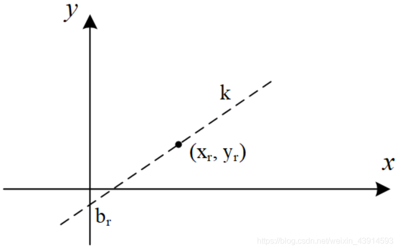
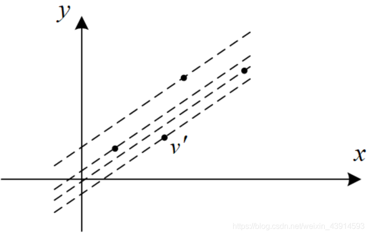
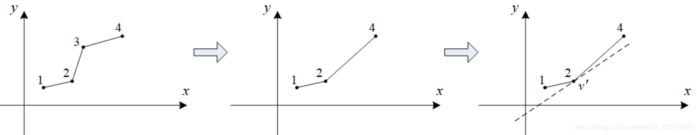
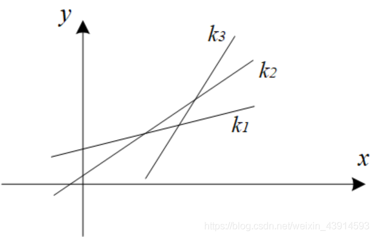
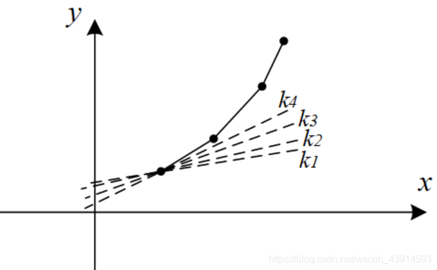

author: Marcythm, hsfzLZH1, abc1763613206, greyqz, Ir1d, billchenchina, Chrogeek, Enter-tainer, StudyingFather, MrFoodinChina, luoguyuntianming, sshwy, wood3

## 引入

有一类DP状态方程，例如：

`dp[i]=min{dp[j]−a[i]∗d[j]} 0≤j<i，d[j]≤d[j+1],a[i]≤a[i+1]`

它的特征是存在一个既有i又有j的项a\[i\]∗d\[j\]。

编程时，如果简单地对i和j循环，复杂度是O(n^2^)的。

通过斜率优化（英文convex hull trick，凸壳优化），把时间复杂度优化到O(n)。

斜率优化的核心技术是斜率（凸壳）模型和单调队列。

### 把状态方程变换为平面的斜率问题

方程对某个固定的i，求j变化时dp\[i\]的最优值，所以可以把关于i的部分看成固定值，把关于j的部分看成变量。把min去掉，方程转化为：

`dp[j]=a[i]∗d[j]+dp[i]`

为方便观察，令：y=dp\[j\]，x=d\[j\]，k=a\[i\]，b=dp\[i\]，方程变为：

y=kx+b

斜率优化的数学模型，就是把状态转移方程转换为平面坐标系直线的形式：y=kx+b。其中：

（1）变量x、y和j有关，并且只有y中包含dp\[j\]。点(x,y)是题目中可能的决策。
（2）斜率k、截距b与i有关，并且只有b中包含dp\[i\]。最小的b包含最小的dp\[i\]，也就是状态方程的解。

注意应用斜率优化的2个条件：x和k是单调增加的，即x随着j递增而递增，k随着i递增而递增。

### 求一个dp\[i\]

先考虑固定i的情况下求dp\[i\]。由于i是定值，那么斜率k=a\[i\]可以看成常数。当j在0 ≤ j < i内变化时，对某个jr，产生一个点vr=(xr,yr)，这个点在一条直线y=kx+br上，br是截距。如图。



经过点(x, y)的直线

对于0 ≤ j < i中所有的j，把它们对应的点都画在平面上，这些点对应的直线的斜率k=a\[i\]都相同，只有截距b不同。在所有这些点中，有一个点v′所在的直线有最小截距b′，算出b′，由于b′中包含dp\[i\]，那么就算出了最优的dp\[i\]。如图2。



经过最优点v'的直线

如何找最优点v′？利用“下凸壳”。

前面提到，x是单调增加的，即x随着j递增而递增。图3(1)中给出了了4个点，它们的x坐标是递增的。



(1)原图       （2）去掉点3       （3找到最优的v'点

用下凸壳找最优点

图(1)中的1、2、3构成了“下凸壳”，“下凸壳”的特征是线段12的斜率小于线段23的斜率。2、3、4构成了“上凸壳”。经过上凸壳中间点3的直线，其截距b肯定小于经过2或4的有相同斜率的直线的截距，所以点3肯定不是最优点，去掉它。

去掉“上凸壳”后，得到图(2)，留下的点都满足“下凸壳”关系。最优点就在“下凸壳”上。例如在图3(3)中，用斜率为k的直线来切这些点，设线段12的斜率小于k，24的斜率大于k，那么点2就是“下凸壳”的最优点。

以上操作用单调队列编程很方便。

（1）进队操作，在队列内维护一个“下凸壳”，即每2个连续点组成的直线，其斜率是单调上升的。新的点进队列时，确保它能与队列中的点一起仍然能够组成“下凸壳”。例如队列尾部的2个点是v1、v2，准备加入队列的新的点是v3。比较v1、v2、v3，看线段v1v2和v2v3的斜率是否递增，如果是，那么v1、v2、v3形成了“下凸壳”；如果斜率不递增，说明v2不对，从队尾弹走它；然后继续比较队列尾部的2个点和v3；重复以上操作，直到v3能进队为止。经过以上操作，队列内的点组成了一个大的“下凸壳”，每2个点组成的直线，斜率递增，队列保持为单调队列。

（2）出队列，找到最优点。设队头的2个点是v1、v2，如果线段v1v2的斜率比k小，说明v1不是最优点，弹走它，继续比较队头新的2个点，一直到斜率大于k为止，此时队头的点就是最优点v′。

### 求所有的dp\[i\]

以上求得了一个dp\[i\]，复杂度O(n)。如果对所有的i，每一个都这样求dp\[i\]，总复杂度仍然是O(n^2^)的，并没有改变计算的复杂度。有优化的方法吗？

一个较小的i1，它对应的点是{v0,v1,...,vi1}；一个较大的i2，对应了更多的点{v0,v1,...,vi1,...,vi2}，其中包含了i1的所有点。当寻找i1的最优点时，需要检查{v0,v1,...,vi1}；寻找i2的最优点时，需要检查{v0,v1,...,vi1,...,vi2}。这里做了重复的检查，并且这些重复是可以避免的。这就是能优化的地方，仍然用“下凸壳”进行优化。

（1）每一个i所对应的斜率ki=a\[i\]是不同的，根据约束条件a\[i\]≤a\[i+1\]，当i增大时，斜率递增。



多个i对应的直线

（2）前面已经提到，对一个i1找它的最优点的时候，可以去掉一些点，即那些斜率比ki1小的点。这些被去掉的点，在后面更大的i2时，由于斜率ki2也更大，肯定也要被去掉。

根据（1）和（2）的讨论，优化方法是：对所有的i，统一用一个单调队列处理所有的点；被较小的i1去掉的点，被单调队列弹走，后面更大的i2不再处理它们。

因为每个点只进入一次单调队列，总复杂度O(n)。

下面的代码演示了以上操作。
```cpp
//q[]是单调队列，head指向队首，tail指向队尾，slope()计算2个点组成的直线的斜率
for(int i=1;i<=n;i++){ 
    while(head<tail && slope(q[head],q[head+1])<k)  //队头的2个点斜率小于k 
        head++;                                     //不合格，从队头弹出
    int j = q[head];   //队头是最优点
    dp[i] = ...;       //计算dp[i]
    while(head<tail && slope(i,q[tail-1])<slope(q[tail-1],q[tail]))   //进队操作
        tail--;        //弹走队尾不合格的点
    q[++tail] = i;     //新的点进队列
}
```

为加深对上述代码的理解，考虑一个特例：进入队列的点都符合“下凸壳”特征，且这些点组成的直线的斜率大于所有的斜率ki，那么结果是：队头不会被弹出，进队的点也不会被弹出，队头被重复使用n次。



一个特例

## 例题引入

???+note "[Print Article](http://acm.hdu.edu.cn/showproblem.php?pid=3507)"
    **题目描述：** 打印一篇包含N个单词的文章，第i个单词的打印成本为Ci。在一行中打印k个单词的花费是 ，M是一个常数。如何安排文章，才能最小化费用？
    
    **输入：** 有很多测试用例。对于每个测试用例，第一行中都有两个数字N和M（0 ≤ n ≤ 500000，0 ≤ M ≤ 1000）。然后，在接下来的2到N + 1行中有N个数字。输入用EOF终止。
    
    **输出：** 一个数字，表示打印文章的最低费用。
    
    样例输入：
    
    5 5
    
    5
    
    9
    
    5
    
    7
    
    5
    
    样例输出：
    
    230

题目的意思是：有N个数和一个常数M，把这N个数分成若干部分，每一部分的计算值为这部分数的和的平方加上M，总计算值为各部分计算值之和，求最小的总计算值。由于N很大，O(N^2^)的算法超时。

设dp\[i\]表示输出前i个单词的最小费用，DP转移方程：

`dp[i]=min{dp[j]+(sum[i]−sum[j])2+M} 0<j<i`

其中sum\[i\]表示前i个数字和。

下面把DP方程改写为y=kx+b的形式。首先展开方程：

`dp[i]=dp[j]+sum[i]∗sum[i]+sum[j]∗sum[j]−2∗sum[i]∗sum[j]+M`

移项得：

`dp[j]+sum[j]∗sum[j]=2∗sum[i]∗sum[j]+dp[i]−sum[i]∗sum[i]−M`

对照y=kx+b，有：

`y=dp[j]+sum[j]∗sum[j]`，y只和j有关。

x=2\*sum\[j\]，x只和j有关，且随着j递增而递增。

k=sum\[i\]，k只和j有关，且随着i递增而递增。

`b=dp[i]−sum[i]∗sum[i]−M`，b只和i有关，且包含dp\[i\]。

下面给出代码。

```cpp
#include <bits/stdc++.h>
using namespace std;
const int MAXN = 500010;
int dp[MAXN];   
int q[MAXN];      //单调队列
int sum[MAXN];
int X(int x){ return 2*sum[x]; }
int Y(int x){ return dp[x]+sum[x]*sum[x]; }
//double slope(int a,int b){return (Y(a)-Y(b))/(X(a)-X(b));} //除法不好，改成下面的乘法
int slope_up  (int a,int b) { return Y(a)-Y(b);}   //斜率的分子部分
int slope_down(int a,int b) { return X(a)-X(b);}   //斜率的分母部分
int main(){
    int n,m;
    while(~scanf("%d%d",&n,&m)){
        for(int i=1;i<=n;i++)  scanf("%d",&sum[i]);
        sum[0] = dp[0] = 0;
        for(int i=1;i<=n;i++)  sum[i]+=sum[i-1];
        int head=1,tail=1;      //队头队尾
        q[tail]=0;
        for(int i=1;i<=n;i++){
            while(head<tail &&
                  slope_up(q[head+1],q[head])<=sum[i]*slope_down(q[head+1],q[head])) 
                head++;           //斜率小于k，从队头弹走
            int j = q[head];     //队头是最优点
            dp[i] = dp[j]+m+(sum[i]-sum[j])*(sum[i]-sum[j]);    //计算dp[i]
            while(head<tail && 
                  slope_up(i,q[tail])*slope_down(q[tail],q[tail-1])
                  <= slope_up(q[tail],q[tail-1])*slope_down(i,q[tail]))
                tail--;          //弹走队尾不合格的点
            q[++tail] = i;       //新的点进队尾
        }
        printf("%d\n",dp[n]);
    }
    return 0;
}
```

???+note "[「HNOI2008」玩具装箱](https://loj.ac/problem/10188)"
    有 $n$ 个玩具，第 $i$ 个玩具价值为 $c_i$。要求将这 $n$ 个玩具排成一排，分成若干段。对于一段 $[l,r]$，它的代价为 $(r-l+\sum_{i=l}^r c_i-L)^2$。其中 $L$ 是一个常量，求分段的最小代价。
    
    $1\le n\le 5\times 10^4, 1\le L, c_i\le 10^7$。

### 朴素的 DP 做法

令 $f_i$ 表示前 $i$ 个物品，分若干段的最小代价。

状态转移方程：$f_i=\min_{j<i}\{f_j+(i-(j+1)+pre_i-pre_j-L)^2\}=\min_{j<i}\{f_j+(pre_i-pre_j+i-j-1-L)^2\}$。

其中 $pre_i$ 表示前 $i$ 个数的和，即 $\sum_{j=1}^i c_j$。

该做法的时间复杂度为 $O(n^2)$，无法解决本题。

### 优化

考虑简化上面的状态转移方程式：令 $s_i=pre_i+i,L'=L+1$，则 $f_i=\min_{j<i}\{f_j+(s_i-s_j-L')^2\}$。

将与 $j$ 无关的移到外面，我们得到

$$
f_i - (s_i-L')^2=\min_{j<i}\{f_j+s_j^2 + 2s_j(L'-s_i) \} 
$$

考虑一次函数的斜截式 $y=kx+b$，将其移项得到 $b=y-kx$。我们将与 $j$ 有关的信息表示为 $y$ 的形式，把同时与 $i,j$ 有关的信息表示为 $kx$，把要最小化的信息（与 $i$ 有关的信息）表示为 $b$，也就是截距。具体地，设

$$
\begin{aligned}
x_j&=s_j\\
y_j&=f_j+s_j^2\\
k_i&=-2(L'-s_i)\\
b_i&=f_i-(s_i-L')^2\\
\end{aligned}
$$

则转移方程就写作 $b_i = \min_{j<i}\{ y_j-k_ix_j \}$。我们把 $(x_j,y_j)$ 看作二维平面上的点，则 $k_i$ 表示直线斜率，$b_i$ 表示一条过 $(x_j,y_j)$ 的斜率为 $k_i$ 的直线的截距。问题转化为了，选择合适的 $j$（$1\le j<i$），最小化直线的截距。


如图，我们将这个斜率为 $k_i$ 的直线从下往上平移，直到有一个点 $(x_p,y_p)$ 在这条直线上，则有 $b_i=y_p-k_ix_p$，这时 $b_i$ 取到最小值。算完 $f_i$，我们就把 $(x_i,y_i)$ 这个点加入点集中，以做为新的 DP 决策。那么，我们该如何维护点集？

容易发现，可能让 $b_i$ 取到最小值的点一定在下凸壳上。因此在寻找 $p$ 的时候我们不需要枚举所有 $i-1$ 个点，只需要考虑凸包上的点。而在本题中 $k_i$ 随 $i$ 的增加而递增，因此我们可以单调队列维护凸包。

具体地，设 $K(a,b)$ 表示过 $(x_a,y_a)$ 和 $(x_b,y_b)$ 的直线的斜率。考虑队列 $q_l,q_{l+1},\ldots,q_r$，维护的是下凸壳上的点。也就是说，对于 $l<i<r$，始终有 $K(q_{i-1},q_i) < K(q_i,q_{i+1})$ 成立。

我们维护一个指针 $e$ 来计算 $b_i$ 最小值。我们需要找到一个 $K(q_{e-1},q_e)\le k_i< K(q_e,q_{e+1})$ 的 $e$（特别地，当 $e=l$ 或者 $e=r$ 时要特别判断），这时就有 $p=q_e$，即 $q_e$ 是 $i$ 的最优决策点。由于 $k_i$ 是单调递减的，因此 $e$ 的移动次数是均摊 $O(1)$ 的。

在插入一个点 $(x_i,y_i)$ 时，我们要判断是否 $K(q_{r-1},q_r)<K(q_r,i)$，如果不等式不成立就将 $q_r$ 弹出，直到等式满足。然后将 $i$ 插入到 $q$ 队尾。

这样我们就将 DP 的复杂度优化到了 $O(n)$。

概括一下上述斜率优化模板题的算法：

1.  将初始状态入队。
2.  每次使用一条和 $i$ 相关的直线 $f(i)$ 去切维护的凸包，找到最优决策，更新 $dp_i$。
3.  加入状态 $dp_i$。如果一个状态（即凸包上的一个点）在 $dp_i$ 加入后不再是凸包上的点，需要在 $dp_i$ 加入前将其剔除。

接下来我们介绍斜率优化的进阶应用，将斜率优化与二分/分治/数据结构等结合，来维护性质不那么好（缺少一些单调性性质）的 DP 方程。

## 二分/CDQ/平衡树优化 DP

当我们在 $i$ 这个点寻找最优决策时，会使用一个和 $i$ 相关的直线 $f(i)$ 去切我们维护的凸包。切到的点即为最优决策。

在上述例题中，直线的斜率随 $i$ 单调变化，但是对于有些问题，斜率并不是单调的。这时我们需要维护凸包上的每一个节点，然后每次用当前的直线去切这个凸包。这个过程可以使用二分解决，因为凸包上相邻两个点的斜率是有单调性的。

???+ note "玩具装箱 改"
    有 $n$ 个玩具，第 $i$ 个玩具价值为 $c_i$。要求将这 $n$ 个玩具排成一排，分成若干段。对于一段 $[l,r]$，它的代价为 $(r-l+\sum_{i=l}^r c_i-L)^2$。其中 $L$ 是一个常量，求分段的最小代价。
    
    $1\le n\le 5\times 10^4,1\le L\le 10^7,-10^7\le c_i\le 10^7$。

本题与「玩具装箱」问题唯一的区别是，玩具的价值可以为负。延续之前的思路，令 $f_i$ 表示前 $i$ 个物品，分若干段的最小代价。

状态转移方程：$f_i=\min_{j<i}\{f_j+(pre_i-pre_j+i-j-1-L)^2\}$。

其中 $pre_i = \sum_{j=1}^i c_j$。

将方程做相同的变换

$$
f_i - (s_i-L')^2=\min_{j<i}\{f_j+s_j^2 + 2s_j(L'-s_i) \} 
$$

然而这时有两个条件不成立了：

1.  直线的斜率不再单调；
2.  每次加入的决策点的横坐标不再单调。

仍然考虑凸壳的维护。

在寻找最优决策点，也就是用直线切凸壳的时候，我们将单调队列找队首改为：凸壳上二分。我们二分出斜率最接近直线斜率的那条凸壳边，就可以找到最优决策。

在加入决策点，也就是凸壳上加一个点的时候，我们有两种方法维护。

第一种方法是直接用平衡树维护凸壳。那么寻找决策点的二分操作就转化为在平衡树上二分，插入决策点就转化为在平衡树上插入一个结点，并删除若干个被踢出凸壳的点。此方法思路简洁但实现繁琐。

下面介绍一种基于 [CDQ 分治](../../misc/cdq-divide.md) 的做法。

设 $\text{CDQ}(l,r)$ 代表计算 $f_i,i\in [l,r]$。考虑 $\text{CDQ}(1,n)$：

-   我们先调用 $\text{CDQ}(1,mid)$ 算出 $f_i,i\in[1,mid]$。然后我们对 $[1,mid]$ 这个区间内的决策点建凸壳，然后使用这个凸壳去更新 $f_i,i\in [mid+1,n]$。这时我们决策点集是固定的，不像之前那样边计算 DP 值边加入决策点，那么我们就可以把 $i \in [mid+1,n]$ 的 $f_i$ 先按照直线的斜率 $k_i$ 排序，然后就可以使用单调队列来计算 DP 值了。当然，也可以在静态凸壳上二分计算 DP 值。

-   对于 $[mid+1,n]$ 中的每个点，如果它的最优决策的位置是在 $[1,mid]$ 这个区间，在这一步操作中他就会被更新成最优答案。当执行完这一步操作时，我们发现 $[1,mid]$ 中的所有点已经发挥了全部的作用，凸壳中他们存不存在已经不影响之后的答案更新。因此我们可以直接舍弃这个区间的决策点，并使用 $\text{CDQ}(mid+1,n)$ 解决右区间剩下的问题。

时间复杂度 $O(n\log^2 n)$。

对比「玩具装箱」和「玩具装箱 改」，可以总结出以下两点：

-   二分/CDQ/平衡树等能够优化 DP 方程的计算，于一定程度上降低复杂度，但不能改变这个方程本身。
-   DP 方程的性质会取决于数据的特征，但 DP 方程本身取决于题目中的数学模型。

## 小结

斜率优化 DP 需要灵活运用，其宗旨是将最优化问题转化为二维平面上与凸包有关的截距最值问题。遇到性质不太好的方程，有时需要辅以数据结构来加以解决，届时还请就题而论。

## 习题

-   [「SDOI2016」征途](https://loj.ac/problem/2035)
-   [「ZJOI2007」仓库建设](https://loj.ac/problem/10189)
-   [「APIO2010」特别行动队](https://loj.ac/problem/10190)
-   [「JSOI2011」柠檬](https://www.luogu.com.cn/problem/P5504)
-   [「Codeforces 311B」Cats Transport](http://codeforces.com/problemset/problem/311/B)
-   [「NOI2007」货币兑换](https://loj.ac/problem/2353)
-   [「NOI2019」回家路线](https://loj.ac/problem/3156)
-   [「NOI2016」国王饮水记](https://uoj.ac/problem/223)
-   [「NOI2014」购票](https://uoj.ac/problem/7)
