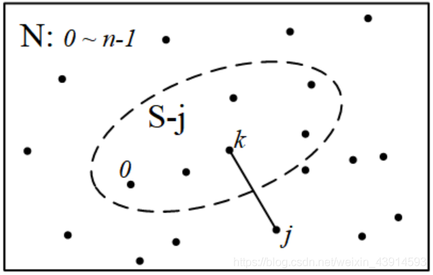
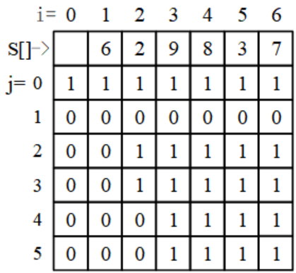
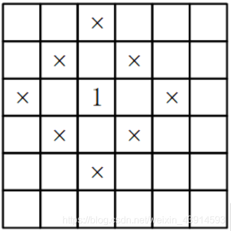
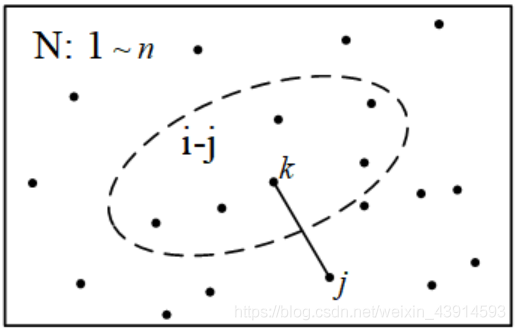

## 定义

状压 DP 是动态规划的一种，通过将状态压缩为整数来达到优化转移的目的。

## 引子

提到状态压缩DP时，常常用Hamilton问题作为引子。

???+note "[最短Hamilton路径](https://www.acwing.com/problem/content/description/93/)"
    **题目描述：** 给定一个有权无向图，包括n个点，标记为0 ~ n-1，以及连接n个点的边，求从起点0到终点n-1的最短路径。要求必须经过所有点，而且只经过一次。1 ≤ n ≤ 20。
    
    **输入格式：** 第一行输入整数n。接下来n行每行n个整数，其中第i行第j个整数表示点i到j的距离（记为a[i, j]）。0 ≤ a\[i, j\] ≤ 10^7^
    
    对于任意的x, y, z，数据保证 a\[x, x\]=0，a\[x, y\]=a\[y, x\] 并且 a\[x, y\]+a\[y, z\] >= a\[x, z\]。
    
    **输出格式：** 输出一个整数，表示最短Hamilton路径的长度。

暴力解法：枚举n个点的全排列，共n!个全排列。一个全排列就是一条路径，计算这个全排列的路径长度，需要做n次加法。在所有路径中找最短的路径，总复杂度是O(n×n!)。

Hamilton问题是NP问题，没有多项式复杂度的解法。不过，用状态压缩DP求解，能把复杂度降低到O(n^2^×2^n^)。当n = 20时，O(n^2^×2^n^) ≈ 4亿，比暴力法好很多。

首先定义DP。设S是图的一个子集，用dp\[S\]\[j\]表示“集合S内的最短Hamilton路径”，即从起点0出发经过S中所有点，到达终点j时的最短路径；集合S中包括j点。根据DP的思路，让S从最小的子集逐步扩展到整个图，最后得到的dp\[N\]\[n−1\]就是答案，N表示包含图上所有点的集合。

如何求dp\[S\]\[j\]？可以从小问题S−j递推到大问题S。其中S−j表示从集合S中去掉j，即不包含j点的集合。

如何从S−j递推到S？设k是S−j中一个点，把从0到jj的路径分为两部分：(0→...→k)+(k→j)。以k为变量枚举S−j中所有的点，找出最短的路径，状态转移方程是：

`dp[S][j]=min{dp[S−j][k]+dist(j,k)}`

其中k属于集合S−j。

集合S的初始情况只包含起点0，然后逐步将图中的点包含进来，直到最后包含所有的点。这个过程用状态转移方程实现。

上述原理见下面的图解。通过这个图，读者可以体会为什么用DP遍历路径比用暴力法遍历路径更有效率。



枚举集合S - j中所有的点

以上是DP的设计，现在关键问题是如何操作集合S？这就是状态压缩DP的技巧：用一个二进制数表示集合S，即把S“压缩”到一个二进制数中。S的每一位表示图上的1个点，等于0表示S不包含这个点，等于1表示包含。例如S = 0000 0101，其中有两个1，表示集合中包含点2、0。本题最多有20个点，那么就定义一个20位的二进制数，表示集合S。

后面给出了代码，第一个for循环有2^n^次，加上后面2个各n次的for循环，总复杂度O(n^2^×2^n^)。

第一个for循环，实现了从最小的集合扩展到整个集合。最小的集合是S = 1，它的二进制数只有最后1位是1，即包含起点0；最大的集合是`S=(1<<n)−1`，它的二进制数中有n个1，包含了所有的点。

算法最关键的部分“枚举集合S−j中所有的点”，是通过代码中的两个if语句实现的：
`if((S>>j) & 1)`，判断当前的集合S中是否有j点；

`if((S^(1<<j)) >> k & 1)`，其中`S^(1<<j)`的作用是从集合中去掉j点，得到集合S−j，然后“>> k & 1”表示用k遍历集合中的1，这些1就是S−j中的点，这样就实现了“枚举集合S−j中所有的点”。注意，`S^(1<<j)`也可以这样写：`S - (1<<j)`。

这两个语句可以写在一起：`if( ((S>>j) & 1) && ((S^(1<<j)) >> k & 1) )`，不过分开写效率更高。

```cpp
#include <bits/stdc++.h>
using namespace std;
int n, dp[1<<20][21];
int dist[21][21];
int main(){
    memset(dp,0x3f,sizeof(dp));    //初始化最大值
    cin>>n;
    for(int i=0; i<n; i++)         //输入图 
        for(int j=0; j<n; j++)
            cin >> dist[i][j];     //输入点之间的距离
    dp[1][0]=0;                    //开始：集合中只有点0，起点和终点都是0
    for(int S=1; S<(1<<n); S++)    //从小集合扩展到大集合，集合用S的二进制表示
        for(int j=0; j<n; j++)     //枚举点j
            if((S>>j) & 1)         //(1): 这个判断与下面的(2)一起起作用
                for(int k=0; k<n; k++)        //枚举到达j的点k，k属于集合S-j
                    if((S^(1<<j)) >> k & 1)   //(2): k属于集合S-j。S-j用(1)保证
                    //把(1)和(2)写在一起，像下面这样，更容易理解，但是效率低一点：
                    //if( ((S>>j) & 1) && ((S^(1<<j)) >> k & 1) )
                         dp[S][j] = min(dp[S][j],dp[S^(1<<j)][k] + dist[k][j]);
    cout << dp[(1<<n)-1][n-1];         //输出：路径包含了所有的点，终点是n-1
    return 0;
}
```

## 原理

从上面的“引子”可知，状态压缩DP的应用背景是以集合为状态，且集合一般用二进制来表示，用二进制的位运算来处理。

集合问题一般是指数复杂度的（NP问题），例如：（1）子集问题，设元素无先后关系，那么共有2^n个子集；（2）排列问题，对所有元素进行全排列，共有n!个全排列。

可以这样概况状态压缩DP的思想：集合的状态（子集或排列），如果用二进制表示状态，并用二进制的位运算来遍历和操作，又简单又快。当然，由于集合问题是NP问题，所以状态压缩DP的复杂度仍然是指数的，只能用于小规模问题的求解。

注意，一个问题用状态压缩DP求解，时间复杂度主要取决于DP算法，和是否使用状态压缩关系不大。状态压缩只是DP处理集合的工具，也可以用其他工具处理集合，只是不太方便，时间复杂度也差一点。

c语言的位运算有 "&"，"|"，"^"，"<<"，">>"等，下面是例子。虽然数字是用十进制表示的，但位运算是按二进制处理的。

```cpp
#include<bits/stdc++.h>
int main(){
    int a = 213, b = 21;            //a = 1101 0101 , b= 0001 1001
    printf("a & b = %d\n",a & b);   // AND  =  17, 二进制0001 0001
    printf("a | b = %d\n",a | b);   // OR   = 221, 二进制1101 1101
    printf("a ^ b = %d\n",a ^ b);   // XOR  = 204, 二进制1100 1100
    printf("a << 2 = %d\n",a << 2); // a*4  = 852, 二进制0011 0101 0100
    printf("a >> 2 = %d\n",a >> 2); // a/4  =  53, 二进制0011 0101
    int i = 5;                      //(1)a的第i位是否为1
    if((1 << (i-1)) & a)  printf("a[%d]=%d\n",i,1);  //a的第i位是1 
    else                  printf("a[%d]=%d\n",i,0);  //a的第i位是0
    a = 43, i = 5;                  //(2)把a的第i位改成1。a = 0010 1011
    printf("a=%d\n",a | (1<<(i-1))); //a=59, 二进制0011 1011
    
    a = 242;                        //(3)把a最后的1去掉。  a = 1111 0010
    printf("a=%d\n", a & (a-1));     //去掉最后的1。   =240, 二进制1111 0000
    return 0;    
}
```

用位运算可以简便地对集合进行操作，下表给出了几个例子，并在上面的代码中给出了示例。

(1)判断a的第i位（从最低位开始数）是否等于1:

1 << ( i - 1 )  & a

(2)把a的第i位改成1:

a | ( 1 << (i-1) )

(3)把a的第i位改成0
`a & (~(1<<i) )`

(4)把a的最后一个1去掉:

a & (a-1)

## 例题

???+note "子集和问题"
    **问题描述：** 给定一个非负整数的集合S，一个值M，问S中是否有一个子集，子集和等于M。
    
    例如：S\[\] = {6, 2, 9, 8, 3, 7}, M = 5，存在一个子集{2, 3}，子集和等于5。

### 解释    

用暴力法求解，即检查所有的子集。子集共有有2^n^个，为什么？用二进制帮忙理解：一个元素被选中，标记为1；没有选中，标记为0；空集是n个0，所有元素都被选中是n个1，从n个0到n个1，共有2^n^个。

用DP求解，定义二维数组 dp。当dp\[i\]\[j\]等于1时，表示S的前i个元素存在一个子集和等于j。题目的答案就是dp\[n\]\[M\]。

用S\[1\]～S\[n\]记录集合S的n个元素。

状态转移方程，分析如下：

（1）若S\[i\] > j，则S\[i\]不能放在子集中，有dp\[i\]\[j\]=dp\[i−1\]\[j\]；

（2）若S\[i\] <= j, 有两种选择：

不把S\[i\]放在子集中，则dp\[i\]\[j\]=dp\[i−1\]\[j\]；

把S\[i\]放在子集中，则dp\[i\]\[j\]=dp\[i−1\]\[j−S\[i\]\]。

这2种选择，只要其中一个为1，那么dp\[i\]\[j\]就为1。

读者可以用下面的图例进行验证。



子集和问题的dp矩阵

如果已经确定问题有解，即dp\[n\]\[M\]=1，如何输出子集内的元素？按推导转移方程的思路，从dp\[n\]\[M\]开始，沿着dp矩阵倒推回去即可。

???+note "[「SCOI2005」互不侵犯](https://loj.ac/problem/2153)"
    在 $N\times N$ 的棋盘里面放 $K$ 个国王（$1 \leq N \leq 9, 1 \leq K \leq N \times N$），使他们互不攻击，共有多少种摆放方案。
    
    国王能攻击到它上下左右，以及左上左下右上右下八个方向上附近的各一个格子，共 $8$ 个格子。

### 解释

设 $f(i,j,l)$ 表示前 $i$ 行，第 $i$ 行的状态为 $j$，且棋盘上已经放置 $l$ 个国王时的合法方案数。

对于编号为 $j$ 的状态，我们用二进制整数 $sit(j)$ 表示国王的放置情况，$sit(j)$ 的某个二进制位为 $0$ 表示对应位置不放国王，为 $1$ 表示在对应位置上放置国王；用 $sta(j)$ 表示该状态的国王个数，即二进制数 $sit(j)$ 中 $1$ 的个数。例如，如下图所示的状态可用二进制数 $100101$ 来表示（棋盘左边对应二进制低位），则有 $sit(j)=100101_{(2)}=37, sta(j)=3$。


设当前行的状态为 $j$，上一行的状态为 $x$，可以得到下面的状态转移方程：$f(i,j,l) = \sum f(i-1,x,l-sta(j))$。

设上一行的状态编号为 $x$，在保证当前行和上一行不冲突的前提下，枚举所有可能的 $x$ 进行转移，转移方程：

$$
f(i,j,l) = \sum f(i-1,x,l-sta(j))
$$

### 实现

??? "参考代码"
    ```cpp
    --8<-- "docs/dp/code/state/state_1.cpp"
    ```

???+note "[排兵布阵](https://vjudge.net/problem/HDU-4539)"
    **题目描述：** 团长带兵来到n×m的平原作战。每个士兵可以攻击到并且只能攻击到与之曼哈顿距离为2的位置以及士兵本身所在的位置。当然，一个士兵不能站在另外一个士兵所能攻击到的位置，同时因为地形的原因平原上也不是每一个位置都可以安排士兵。
    
    现在，已知n, m(n <= 100, m <= 10 )以及平原阵地的具体地形，请你帮助团长计算该阵地最多能安排多少个士兵。
    
    **输入格式：** 包含多组测试数据。每组数据的第一行包括两个整数n和m，接下来的n行，每行m个数，表示n*m的矩形阵地，其中1表示该位置可以安排士兵，0表示该地形不允许安排士兵。
    
    **输出格式：** 对每组测试数据，输出最多能安排的士兵数量。
    
    输入样例：
    
    6 6
    
    0 0 0 0 0 0
    
    0 0 0 0 0 0
    
    0 0 1 1 0 0
    
    0 0 0 0 0 0
    
    0 0 0 0 0 0
    
    0 0 0 0 0 0
    
    **输出样例：**
    
    2

### 解释
合法的安排见下图的例子，图中的'1'是一个站立的士兵，'×'是曼哈顿距离为2的攻击点，不能安排其他士兵。



士兵和他的攻击点

这一题的思路比较容易。

首先考虑暴力法。对一个站立安排，如果图上的任意2个士兵都没有站在曼哈顿距离为2的位置上，就是一个合法的安排。但是一共有2n×m种站立安排，显然不能用暴力法一个个地判断。

下面考虑DP的思路。从第一行开始，一行一行地放士兵，在每一行都判断合法性，直到最后一行。假设递推到了第i行，只需要看它和第i-1行和第i-2行的情况即可：

1. 判断第i行自身的合法性。这一行站立的士兵，不能站在间隔2的位置上。例如m = 6时，合法的士兵站立情况有000010、000011、0000110、100011、110011等。
2. 判断第i行和第i-1行的合法性。第i行任何一个士兵，和第i-1行的士兵的间隔距离不能是2。
3. 判断第i行和第i-2行的合法性。
4. 判断第i-1行和第i-2行的合法性。

状态定义。定义d\[i\]\[j\]\[k\]：表示递推到第i行时的最多士兵安排数量，此时第i行的士兵站立情况是j，第i-1行的士兵站立情况是k。在j、k的二进制表示中，0表示有士兵，1表示无士兵。
状态转移方程。从第ii-1行递推到第ii行：

`dp[i][j][k] = max(dp[i-1][k][p]) + count_line(i, sta[j])`

方程中的count_line(i, sta\[j\])计算第i行在合法的j状态下的士兵数量。用p遍历第i-2行的合法情况。

下面是代码。代码中有4个for循环，复杂度是O(nM3)。M是预计算出的一行的合法情况数量，当m=10时，M = 169。用函数init_line()预计算一行的合法情况。

### 实现

```cpp
#include <bits/stdc++.h>
using namespace std;
int mp[105][12];                 //地图
int dp[105][200][200]; 
int n,m;
int sta[200];                    //预计算一行的合法情况。m = 10时，只有169种合法情况
int init_line(int n){            //预计算出一行的合法情况
    int M = 0;
    for(int i = 0; i < n; i ++)
        if( (i&(i>>2)) == 0 && (i&(i<<2)) == 0 )//左右间隔2的位置没人，就是合法的
           sta[M++] = i;
    return M;                    //返回合法情况有多少种
}
int count_line(int i, int x){    //计算第i行的士兵数量
    int sum = 0;
    for(int j=m-1; j>=0; j--) {    //x是预计算过的合法安排
        if(x&1) sum += mp[i][j];   //把x与地形匹配
        x >>= 1;
    }
    return sum;
}
int main(){
    while(~scanf("%d%d",&n,&m)) {
        int M = init_line(1<<m);            //预计算一行的合法情况，有M种
        for(int i = 0; i < n; i ++)
            for(int j = 0; j < m; j ++)
                scanf("%d",&mp[i][j]);      //输入地图
        int ans = 0;
        memset(dp, 0, sizeof(dp));
        for(int i = 0; i < n; i ++)             //第i行
            for(int j = 0; j < M; j ++)         //枚举第i行的合法安排 
                for(int k = 0; k < M; k ++) {   //枚举第i-1行的合法安排   
                    if(i == 0) {                //计算第1行
                        dp[i][j][k] = count_line(i, sta[j]);
                        ans = max(ans, dp[i][j][k]);
                        continue;
                    }
                    if((sta[j]&(sta[k]>>1)) || (sta[j]&(sta[k]<<1)))
                                                  //第i行和第i-1行冲突
                        continue; 
                    int tmp = 0;
                    for(int p = 0; p < M; p ++){   //枚举第i-2行合法状态
                        if((sta[p]&(sta[k]>>1)) || (sta[p]&(sta[k]<<1))) continue;  
                                                       //第i-1行和第i-2行冲突
                        if(sta[j]&sta[p]) continue;    //第i行和第i-2行冲突
                        tmp = max(tmp, dp[i-1][k][p]);  //从i-1递推到i
                    }
                    dp[i][j][k] = tmp + count_line(i, sta[j]); //加上第i行的士兵数量
                    ans = max(ans, dp[i][j][k]);
                } 
        printf("%d\n",ans);
    }
    return 0;
}
```

???+note "[三进制状态压缩](https://vjudge.net/problem/HDU-3001)"
    **题目描述：** Acmer先生决定访问n座城市。他可以空降到任意城市，然后开始访问，要求访问到所有城市，任何一个城市访问的次数不少于1次，不多于2次。n座城市间有m条道路，每条道路都有路费。求Acmer先生完成旅行需要花费的最小费用。
    
    **输入：** 第一行是n，m，1 ≤ n ≤ 10。后面有m行，有3个整数a、b、c，表示城市a和b之间的路费是c。
    
    **输出：** 最少花费，如果不能完成旅行，则输出-1。

### 解释
本题n = 10，数据很小，但是由于每个城市可以走2遍，可能的路线就变成了(2n)!，所以不能用暴力法。

本题是旅行商问题的变形，编码方法和“1 引子”的Hamilton路径问题非常相似。阅读下面的题解时，请与“引子”的解释对照。

在普通路径问题中，一个城市只有两种情况：访问和不访问，用1和0表示，可以用二进制做状态压缩。但是这一题有三种情况：不访问、访问1次、访问2次，所以用三进制进行状态压缩，每个城市有0、1、2三种情况。

当n = 10时，路径有有3^10^种，对每种路径，用三进制表示。例如第14个路径，十进制14的三进制是1123，它的意思是：第3个城市走1次，第2个城市走1次，第1个城市走2次。

用tri\[i\]\[j\]定义路径，它表示第i个路径上的城市j的状态。在上面的例子中，`tri[14][3] = 1，tri[14][2] = 1，tri[14][1] = 2`。函数make_trb()完成初始化计算，它把十进制14分解为三进制1123，并赋值给tri\[i\]\[j\]。

状态定义。定义dp\[j\]\[i\]：表示从城市j出发，按路径i访问i中所有的城市的最小费用。
状态转移方程。和“引子”中的图“枚举集合S - j中所有的点”类似，本题可以这样画图：



枚举路径i - j中所有的点

图中"i−j"的意思是从路径i中，去掉点j。从城市j开始访问路径i，等于先走完路径"i−j"，再走到城市j。用k遍历"i−j"中的所有城市，找到最少费用，得到状态转移方程：

`dp[j][i] = min(dp[j][i], dp[k][l] + graph[k][j]);`

其中l=i−bit\[j\]，它涉及到本题的关键操作：如何从路径i中去掉城市j？

回顾“引子”的二进制状态压缩，是这样从集合S中去掉点jj的：`S^(1<<j)`，也可以这样写：`S - (1<<j)`。

类似地，在三进制中，从i中去掉j的代码这样写：i−bit\[j\]，其中bit\[j\]是三进制第j位的权值。

下面是代码。有3个for循环，第一个3^n^次，后两个分别n次，算法总复杂度是O(3^n^n^2^)，当n = 10时，正好通过OJ测试。

### 实现

```cpp
#include<bits/stdc++.h>
const int INF = 0x3f3f3f3f;
using namespace std;
int n,m;
int bit[12]={0,1,3,9,27,81,243,729,2187,6561,19683,59049};
                          //三进制每一位的权值，与二进制的0, 1, 2, 4, 8...对照
int tri[60000][11];
int dp[11][60000];    
int graph[11][11];                  //存图
void make_trb(){                    //初始化，求所有可能的路径
    for(int i=0;i<59050;++i){       //共3^10=59050种路径状态
       int t=i;
       for(int j=1; j<=10; ++j){
           tri[i][j]=t%3; 
           t/=3;
       }
   }
}
int comp_dp(){   
        int ans = INF;
        memset(dp, INF, sizeof(dp));
        for(int j=0;j<=n;j++)
            dp[j][bit[j]]=0;               //初始化：从第j个城市出发，只访问j，费用为0
        for(int i=0;i<bit[n+1];i++){       //遍历所有路径，每个i是一个路径
            int flag=1;                    //所有的城市都遍历过1次以上
            for(int j=1;j<=n;j++){         //遍历城市，以j为起点
                if(tri[i][j] == 0){        //是否有一个城市访问次数是0
                    flag=0;                //还没有经过所有点
                    continue;
                }
                for(int k=1; k<=n; k++){   //遍历路径i-j的所有城市
                    int l=i-bit[j];        //l:从路径i中去掉第j个城市
                    dp[j][i]=min(dp[j][i],dp[k][l]+graph[k][j]);                                          
                }
            }
            if(flag)                        //找最小费用
               for(int j=1; j<=n; j++)
                   ans = min(ans,dp[j][i]);  //路径i上，最小的总费用
        }
        return ans;
}
int main(){
    make_trb();
    while(cin>>n>>m){
        memset(graph,INF,sizeof(graph));
        while(m--){
            int a,b,c;
            cin>>a>>b>>c;
            if(c<graph[a][b])  graph[a][b]=graph[b][a]=c;
        }
        int ans = comp_dp();
        if(ans==INF) cout<<"-1"<<endl;
        else         cout<<ans<<endl;
    }
    return 0;
}
```

## 习题

- [Arrange the Bulls](http://poj.org/problem?id=2441)
- [Corn Fields](http://poj.org/problem?id=3254)
- [Rectangular Covering](http://poj.org/problem?id=2836)
- [DNA Laboratory](http://poj.org/problem?id=1795)
- [Paid Roads](http://poj.org/problem?id=3411)
- [Tour](https://vjudge.net/problem/UVA-1347)
- [「NOI2001」炮兵阵地](https://loj.ac/problem/10173)
- [「USACO06NOV」玉米田 Corn Fields](https://www.luogu.com.cn/problem/P1879)
- [「AHOI2009」中国象棋](https://www.luogu.com.cn/problem/P2051)
- [「九省联考 2018」一双木棋](https://loj.ac/problem/2471)
- [校长的烦恼](https://vjudge.net/problem/UVA-10817)
- [20个问题](https://vjudge.net/problem/UVA-1252)
- [基金管理](https://vjudge.net/problem/UVA-1412)
