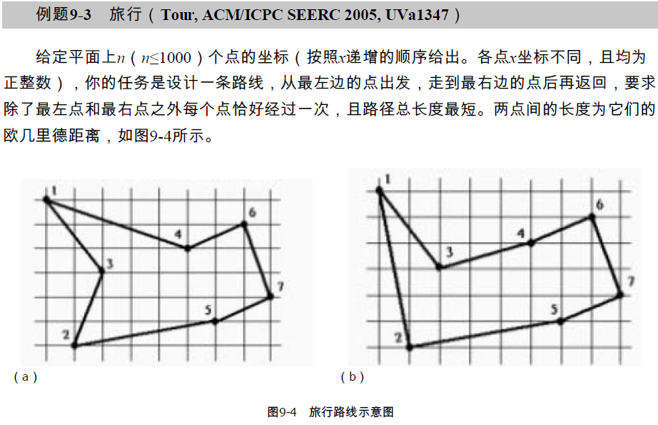
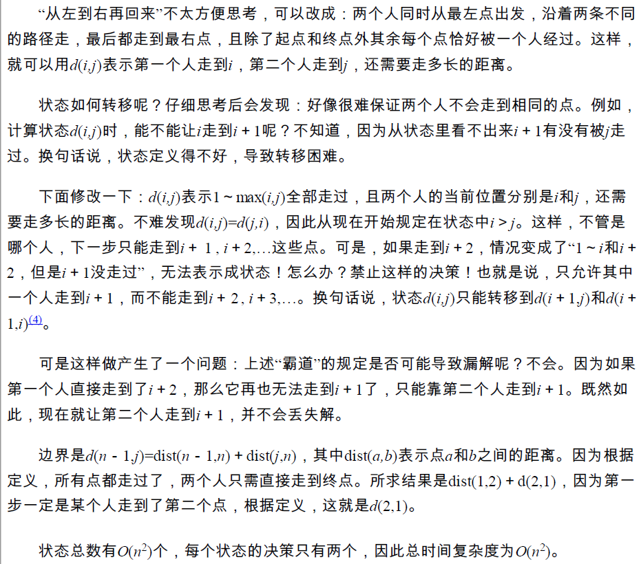
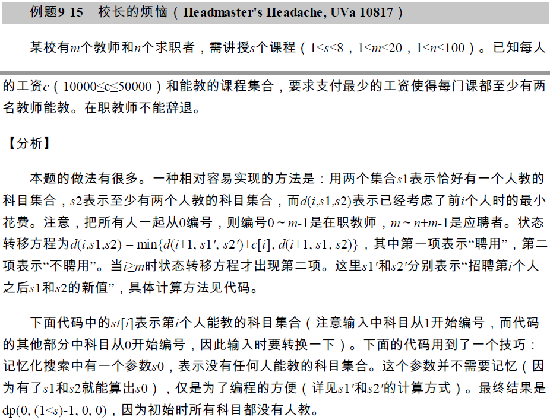
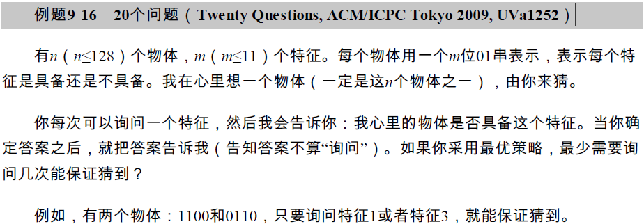
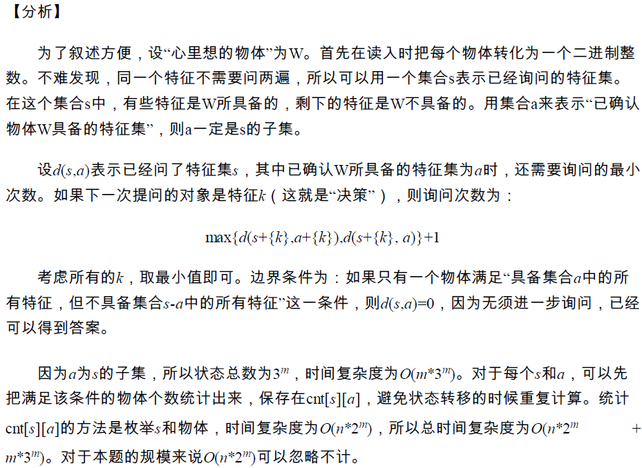
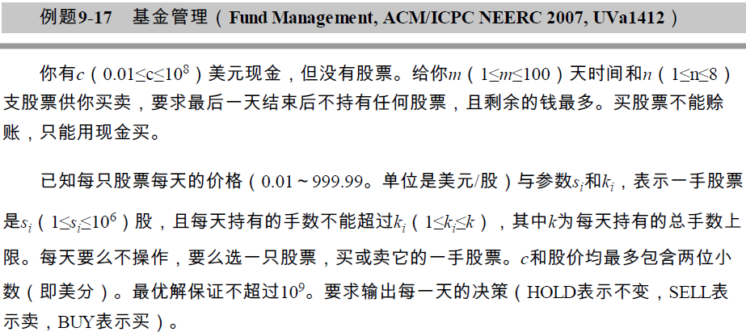
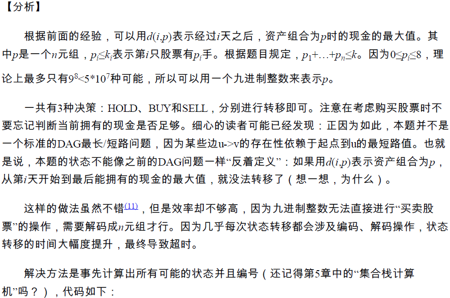

## 定义

状压 DP 是动态规划的一种，通过将状态压缩为整数来达到优化转移的目的。

## 引子

提到状态压缩DP时，常常用Hamilton问题作为引子。

???+note "[最短Hamilton路径](https://www.acwing.com/problem/content/description/93/)"
    **题目描述：** 给定一个有权无向图，包括n个点，标记为0 ~ n-1，以及连接n个点的边，求从起点0到终点n-1的最短路径。要求必须经过所有点，而且只经过一次。1 ≤ n ≤ 20。
    
    **输入格式：** 第一行输入整数n。接下来n行每行n个整数，其中第i行第j个整数表示点i到j的距离（记为a[i, j]）。0 ≤ a\[i, j\] ≤ 10^7^
    
    对于任意的x, y, z，数据保证 a\[x, x\]=0，a\[x, y\]=a\[y, x\] 并且 a\[x, y\]+a\[y, z\] >= a\[x, z\]。
    
    **输出格式：** 输出一个整数，表示最短Hamilton路径的长度。

暴力解法：枚举n个点的全排列，共n!个全排列。一个全排列就是一条路径，计算这个全排列的路径长度，需要做n次加法。在所有路径中找最短的路径，总复杂度是O(n×n!)。

Hamilton问题是NP问题，没有多项式复杂度的解法。不过，用状态压缩DP求解，能把复杂度降低到O(n^2^×2^n^)。当n = 20时，O(n^2^×2^n^) ≈ 4亿，比暴力法好很多。

首先定义DP。设S是图的一个子集，用dp\[S\]\[j\]表示“集合S内的最短Hamilton路径”，即从起点0出发经过S中所有点，到达终点j时的最短路径；集合S中包括j点。根据DP的思路，让S从最小的子集逐步扩展到整个图，最后得到的dp\[N\]\[n−1\]就是答案，N表示包含图上所有点的集合。

如何求dp\[S\]\[j\]？可以从小问题S−j递推到大问题S。其中S−j表示从集合S中去掉j，即不包含j点的集合。

如何从S−j递推到S？设k是S−j中一个点，把从0到jj的路径分为两部分：(0→...→k)+(k→j)。以k为变量枚举S−j中所有的点，找出最短的路径，状态转移方程是：

`dp[S][j]=min{dp[S−j][k]+dist(j,k)}`

其中k属于集合S−j。

集合S的初始情况只包含起点0，然后逐步将图中的点包含进来，直到最后包含所有的点。这个过程用状态转移方程实现。

上述原理见下面的图解。通过这个图，读者可以体会为什么用DP遍历路径比用暴力法遍历路径更有效率。


枚举集合S - j中所有的点

以上是DP的设计，现在关键问题是如何操作集合S？这就是状态压缩DP的技巧：用一个二进制数表示集合S，即把S“压缩”到一个二进制数中。S的每一位表示图上的1个点，等于0表示S不包含这个点，等于1表示包含。例如S = 0000 0101，其中有两个1，表示集合中包含点2、0。本题最多有20个点，那么就定义一个20位的二进制数，表示集合S。

后面给出了代码，第一个for循环有2^n^次，加上后面2个各n次的for循环，总复杂度O(n^2^×2^n^)。

第一个for循环，实现了从最小的集合扩展到整个集合。最小的集合是S = 1，它的二进制数只有最后1位是1，即包含起点0；最大的集合是`S=(1<<n)−1`，它的二进制数中有n个1，包含了所有的点。

算法最关键的部分“枚举集合S−j中所有的点”，是通过代码中的两个if语句实现的：
`if((S>>j) & 1)`，判断当前的集合S中是否有j点；

`if((S^(1<<j)) >> k & 1)`，其中`S^(1<<j)`的作用是从集合中去掉j点，得到集合S−j，然后“>> k & 1”表示用k遍历集合中的1，这些1就是S−j中的点，这样就实现了“枚举集合S−j中所有的点”。注意，`S^(1<<j)`也可以这样写：`S - (1<<j)`。

这两个语句可以写在一起：`if( ((S>>j) & 1) && ((S^(1<<j)) >> k & 1) )`，不过分开写效率更高。

```cpp
#include <bits/stdc++.h>
using namespace std;
int n, dp[1<<20][21];
int dist[21][21];
int main(){
    memset(dp,0x3f,sizeof(dp));    //初始化最大值
    cin>>n;
    for(int i=0; i<n; i++)         //输入图 
        for(int j=0; j<n; j++)
            cin >> dist[i][j];     //输入点之间的距离
    dp[1][0]=0;                    //开始：集合中只有点0，起点和终点都是0
    for(int S=1; S<(1<<n); S++)    //从小集合扩展到大集合，集合用S的二进制表示
        for(int j=0; j<n; j++)     //枚举点j
            if((S>>j) & 1)         //(1): 这个判断与下面的(2)一起起作用
                for(int k=0; k<n; k++)        //枚举到达j的点k，k属于集合S-j
                    if((S^(1<<j)) >> k & 1)   //(2): k属于集合S-j。S-j用(1)保证
                    //把(1)和(2)写在一起，像下面这样，更容易理解，但是效率低一点：
                    //if( ((S>>j) & 1) && ((S^(1<<j)) >> k & 1) )
                         dp[S][j] = min(dp[S][j],dp[S^(1<<j)][k] + dist[k][j]);
    cout << dp[(1<<n)-1][n-1];         //输出：路径包含了所有的点，终点是n-1
    return 0;
}
```

## 原理

从上面的“引子”可知，状态压缩DP的应用背景是以集合为状态，且集合一般用二进制来表示，用二进制的位运算来处理。

集合问题一般是指数复杂度的（NP问题），例如：（1）子集问题，设元素无先后关系，那么共有2^n个子集；（2）排列问题，对所有元素进行全排列，共有n!个全排列。

可以这样概况状态压缩DP的思想：集合的状态（子集或排列），如果用二进制表示状态，并用二进制的位运算来遍历和操作，又简单又快。当然，由于集合问题是NP问题，所以状态压缩DP的复杂度仍然是指数的，只能用于小规模问题的求解。

注意，一个问题用状态压缩DP求解，时间复杂度主要取决于DP算法，和是否使用状态压缩关系不大。状态压缩只是DP处理集合的工具，也可以用其他工具处理集合，只是不太方便，时间复杂度也差一点。

c语言的位运算有 "&"，"|"，"^"，"<<"，">>"等，下面是例子。虽然数字是用十进制表示的，但位运算是按二进制处理的。

```cpp
#include<bits/stdc++.h>
int main(){
    int a = 213, b = 21;            //a = 1101 0101 , b= 0001 1001
    printf("a & b = %d\n",a & b);   // AND  =  17, 二进制0001 0001
    printf("a | b = %d\n",a | b);   // OR   = 221, 二进制1101 1101
    printf("a ^ b = %d\n",a ^ b);   // XOR  = 204, 二进制1100 1100
    printf("a << 2 = %d\n",a << 2); // a*4  = 852, 二进制0011 0101 0100
    printf("a >> 2 = %d\n",a >> 2); // a/4  =  53, 二进制0011 0101
    int i = 5;                      //(1)a的第i位是否为1
    if((1 << (i-1)) & a)  printf("a[%d]=%d\n",i,1);  //a的第i位是1 
    else                  printf("a[%d]=%d\n",i,0);  //a的第i位是0
    a = 43, i = 5;                  //(2)把a的第i位改成1。a = 0010 1011
    printf("a=%d\n",a | (1<<(i-1))); //a=59, 二进制0011 1011
    
    a = 242;                        //(3)把a最后的1去掉。  a = 1111 0010
    printf("a=%d\n", a & (a-1));     //去掉最后的1。   =240, 二进制1111 0000
    return 0;    
}
```

用位运算可以简便地对集合进行操作，下表给出了几个例子，并在上面的代码中给出了示例。

(1)判断a的第i位（从最低位开始数）是否等于1:

1 << ( i - 1 )  & a

(2)把a的第i位改成1:

a | ( 1 << (i-1) )

(3)把a的第i位改成0
`a & (~(1<<i) )`

(4)把a的最后一个1去掉:

a & (a-1)

## 例题 1

???+note "子集和问题"
    **问题描述：** 给定一个非负整数的集合S，一个值M，问S中是否有一个子集，子集和等于M。
    
    例如：S\[\] = {6, 2, 9, 8, 3, 7}, M = 5，存在一个子集{2, 3}，子集和等于5。

### 解释    

用暴力法求解，即检查所有的子集。子集共有有2^n^个，为什么？用二进制帮忙理解：一个元素被选中，标记为1；没有选中，标记为0；空集是n个0，所有元素都被选中是n个1，从n个0到n个1，共有2^n^个。

用DP求解，定义二维数组 dp。当dp\[i\]\[j\]等于1时，表示S的前i个元素存在一个子集和等于j。题目的答案就是dp\[n\]\[M\]。

用S\[1\]～S\[n\]记录集合S的n个元素。

状态转移方程，分析如下：

（1）若S\[i\] > j，则S\[i\]不能放在子集中，有dp\[i\]\[j\]=dp\[i−1\]\[j\]；

（2）若S\[i\] <= j, 有两种选择：

不把S\[i\]放在子集中，则dp\[i\]\[j\]=dp\[i−1\]\[j\]；

把S\[i\]放在子集中，则dp\[i\]\[j\]=dp\[i−1\]\[j−S\[i\]\]。

这2种选择，只要其中一个为1，那么dp\[i\]\[j\]就为1。

读者可以用下面的图例进行验证。


子集和问题的dp矩阵

如果已经确定问题有解，即dp\[n\]\[M\]=1，如何输出子集内的元素？按推导转移方程的思路，从dp\[n\]\[M\]开始，沿着dp矩阵倒推回去即可。

???+ note "[「SCOI2005」互不侵犯](https://loj.ac/problem/2153)"
    在 $N\times N$ 的棋盘里面放 $K$ 个国王（$1 \leq N \leq 9, 1 \leq K \leq N \times N$），使他们互不攻击，共有多少种摆放方案。
    
    国王能攻击到它上下左右，以及左上左下右上右下八个方向上附近的各一个格子，共 $8$ 个格子。

### 解释

设 $f(i,j,l)$ 表示前 $i$ 行，第 $i$ 行的状态为 $j$，且棋盘上已经放置 $l$ 个国王时的合法方案数。

对于编号为 $j$ 的状态，我们用二进制整数 $sit(j)$ 表示国王的放置情况，$sit(j)$ 的某个二进制位为 $0$ 表示对应位置不放国王，为 $1$ 表示在对应位置上放置国王；用 $sta(j)$ 表示该状态的国王个数，即二进制数 $sit(j)$ 中 $1$ 的个数。例如，如下图所示的状态可用二进制数 $100101$ 来表示（棋盘左边对应二进制低位），则有 $sit(j)=100101_{(2)}=37, sta(j)=3$。


设当前行的状态为 $j$，上一行的状态为 $x$，可以得到下面的状态转移方程：$f(i,j,l) = \sum f(i-1,x,l-sta(j))$。

设上一行的状态编号为 $x$，在保证当前行和上一行不冲突的前提下，枚举所有可能的 $x$ 进行转移，转移方程：

$$
f(i,j,l) = \sum f(i-1,x,l-sta(j))
$$

### 实现

??? "参考代码"
    ```cpp
    --8<-- "docs/dp/code/state/state_1.cpp"
    ```

???+note "[排兵布阵](https://vjudge.net/problem/HDU-4539)"
    **题目描述：** 团长带兵来到n×m的平原作战。每个士兵可以攻击到并且只能攻击到与之曼哈顿距离为2的位置以及士兵本身所在的位置。当然，一个士兵不能站在另外一个士兵所能攻击到的位置，同时因为地形的原因平原上也不是每一个位置都可以安排士兵。
    
    现在，已知n, m(n <= 100, m <= 10 )以及平原阵地的具体地形，请你帮助团长计算该阵地最多能安排多少个士兵。
    
    **输入格式：** 包含多组测试数据。每组数据的第一行包括两个整数n和m，接下来的n行，每行m个数，表示n*m的矩形阵地，其中1表示该位置可以安排士兵，0表示该地形不允许安排士兵。
    
    **输出格式：** 对每组测试数据，输出最多能安排的士兵数量。
    
    输入样例：
    
    6 6
    
    0 0 0 0 0 0
    
    0 0 0 0 0 0
    
    0 0 1 1 0 0
    
    0 0 0 0 0 0
    
    0 0 0 0 0 0
    
    0 0 0 0 0 0
    
    **输出样例：**
    
    2

### 解释
合法的安排见下图的例子，图中的'1'是一个站立的士兵，'×'是曼哈顿距离为2的攻击点，不能安排其他士兵。


士兵和他的攻击点

这一题的思路比较容易。

首先考虑暴力法。对一个站立安排，如果图上的任意2个士兵都没有站在曼哈顿距离为2的位置上，就是一个合法的安排。但是一共有2n×m种站立安排，显然不能用暴力法一个个地判断。

下面考虑DP的思路。从第一行开始，一行一行地放士兵，在每一行都判断合法性，直到最后一行。假设递推到了第i行，只需要看它和第i-1行和第i-2行的情况即可：

1. 判断第i行自身的合法性。这一行站立的士兵，不能站在间隔2的位置上。例如m = 6时，合法的士兵站立情况有000010、000011、0000110、100011、110011等。
2. 判断第i行和第i-1行的合法性。第i行任何一个士兵，和第i-1行的士兵的间隔距离不能是2。
3. 判断第i行和第i-2行的合法性。
4. 判断第i-1行和第i-2行的合法性。

状态定义。定义d\[i\]\[j\]\[k\]：表示递推到第i行时的最多士兵安排数量，此时第i行的士兵站立情况是j，第i-1行的士兵站立情况是k。在j、k的二进制表示中，0表示有士兵，1表示无士兵。
状态转移方程。从第ii-1行递推到第ii行：

`dp[i][j][k] = max(dp[i-1][k][p]) + count_line(i, sta[j])`

方程中的count_line(i, sta\[j\])计算第i行在合法的j状态下的士兵数量。用p遍历第i-2行的合法情况。

下面是代码。代码中有4个for循环，复杂度是O(nM3)。M是预计算出的一行的合法情况数量，当m=10时，M = 169。用函数init_line()预计算一行的合法情况。

### 实现

```cpp
#include <bits/stdc++.h>
using namespace std;
int mp[105][12];                 //地图
int dp[105][200][200]; 
int n,m;
int sta[200];                    //预计算一行的合法情况。m = 10时，只有169种合法情况
int init_line(int n){            //预计算出一行的合法情况
    int M = 0;
    for(int i = 0; i < n; i ++)
        if( (i&(i>>2)) == 0 && (i&(i<<2)) == 0 )//左右间隔2的位置没人，就是合法的
           sta[M++] = i;
    return M;                    //返回合法情况有多少种
}
int count_line(int i, int x){    //计算第i行的士兵数量
    int sum = 0;
    for(int j=m-1; j>=0; j--) {    //x是预计算过的合法安排
        if(x&1) sum += mp[i][j];   //把x与地形匹配
        x >>= 1;
    }
    return sum;
}
int main(){
    while(~scanf("%d%d",&n,&m)) {
        int M = init_line(1<<m);            //预计算一行的合法情况，有M种
        for(int i = 0; i < n; i ++)
            for(int j = 0; j < m; j ++)
                scanf("%d",&mp[i][j]);      //输入地图
        int ans = 0;
        memset(dp, 0, sizeof(dp));
        for(int i = 0; i < n; i ++)             //第i行
            for(int j = 0; j < M; j ++)         //枚举第i行的合法安排 
                for(int k = 0; k < M; k ++) {   //枚举第i-1行的合法安排   
                    if(i == 0) {                //计算第1行
                        dp[i][j][k] = count_line(i, sta[j]);
                        ans = max(ans, dp[i][j][k]);
                        continue;
                    }
                    if((sta[j]&(sta[k]>>1)) || (sta[j]&(sta[k]<<1)))
                                                  //第i行和第i-1行冲突
                        continue; 
                    int tmp = 0;
                    for(int p = 0; p < M; p ++){   //枚举第i-2行合法状态
                        if((sta[p]&(sta[k]>>1)) || (sta[p]&(sta[k]<<1))) continue;  
                                                       //第i-1行和第i-2行冲突
                        if(sta[j]&sta[p]) continue;    //第i行和第i-2行冲突
                        tmp = max(tmp, dp[i-1][k][p]);  //从i-1递推到i
                    }
                    dp[i][j][k] = tmp + count_line(i, sta[j]); //加上第i行的士兵数量
                    ans = max(ans, dp[i][j][k]);
                } 
        printf("%d\n",ans);
    }
    return 0;
}
```

???+note "[三进制状态压缩](https://vjudge.net/problem/HDU-3001)"
    **题目描述：** Acmer先生决定访问n座城市。他可以空降到任意城市，然后开始访问，要求访问到所有城市，任何一个城市访问的次数不少于1次，不多于2次。n座城市间有m条道路，每条道路都有路费。求Acmer先生完成旅行需要花费的最小费用。
    
    **输入：** 第一行是n，m，1 ≤ n ≤ 10。后面有m行，有3个整数a、b、c，表示城市a和b之间的路费是c。
    
    **输出：** 最少花费，如果不能完成旅行，则输出-1。

### 解释
本题n = 10，数据很小，但是由于每个城市可以走2遍，可能的路线就变成了(2n)!，所以不能用暴力法。

本题是旅行商问题的变形，编码方法和“1 引子”的Hamilton路径问题非常相似。阅读下面的题解时，请与“引子”的解释对照。

在普通路径问题中，一个城市只有两种情况：访问和不访问，用1和0表示，可以用二进制做状态压缩。但是这一题有三种情况：不访问、访问1次、访问2次，所以用三进制进行状态压缩，每个城市有0、1、2三种情况。

当n = 10时，路径有有3^10^种，对每种路径，用三进制表示。例如第14个路径，十进制14的三进制是1123，它的意思是：第3个城市走1次，第2个城市走1次，第1个城市走2次。

用tri\[i\]\[j\]定义路径，它表示第i个路径上的城市j的状态。在上面的例子中，`tri[14][3] = 1，tri[14][2] = 1，tri[14][1] = 2`。函数make_trb()完成初始化计算，它把十进制14分解为三进制1123，并赋值给tri\[i\]\[j\]。

状态定义。定义dp\[j\]\[i\]：表示从城市j出发，按路径i访问i中所有的城市的最小费用。
状态转移方程。和“引子”中的图“枚举集合S - j中所有的点”类似，本题可以这样画图：


枚举路径i - j中所有的点

图中"i−j"的意思是从路径i中，去掉点j。从城市j开始访问路径i，等于先走完路径"i−j"，再走到城市j。用k遍历"i−j"中的所有城市，找到最少费用，得到状态转移方程：

`dp[j][i] = min(dp[j][i], dp[k][l] + graph[k][j]);`

其中l=i−bit\[j\]，它涉及到本题的关键操作：如何从路径i中去掉城市j？

回顾“引子”的二进制状态压缩，是这样从集合S中去掉点jj的：`S^(1<<j)`，也可以这样写：`S - (1<<j)`。

类似地，在三进制中，从i中去掉j的代码这样写：i−bit\[j\]，其中bit\[j\]是三进制第j位的权值。

下面是代码。有3个for循环，第一个3^n^次，后两个分别n次，算法总复杂度是O(3^n^n^2^)，当n = 10时，正好通过OJ测试。

### 实现

```cpp
#include<bits/stdc++.h>
const int INF = 0x3f3f3f3f;
using namespace std;
int n,m;
int bit[12]={0,1,3,9,27,81,243,729,2187,6561,19683,59049};
                          //三进制每一位的权值，与二进制的0, 1, 2, 4, 8...对照
int tri[60000][11];
int dp[11][60000];    
int graph[11][11];                  //存图
void make_trb(){                    //初始化，求所有可能的路径
    for(int i=0;i<59050;++i){       //共3^10=59050种路径状态
       int t=i;
       for(int j=1; j<=10; ++j){
           tri[i][j]=t%3; 
           t/=3;
       }
   }
}
int comp_dp(){   
        int ans = INF;
        memset(dp, INF, sizeof(dp));
        for(int j=0;j<=n;j++)
            dp[j][bit[j]]=0;               //初始化：从第j个城市出发，只访问j，费用为0
        for(int i=0;i<bit[n+1];i++){       //遍历所有路径，每个i是一个路径
            int flag=1;                    //所有的城市都遍历过1次以上
            for(int j=1;j<=n;j++){         //遍历城市，以j为起点
                if(tri[i][j] == 0){        //是否有一个城市访问次数是0
                    flag=0;                //还没有经过所有点
                    continue;
                }
                for(int k=1; k<=n; k++){   //遍历路径i-j的所有城市
                    int l=i-bit[j];        //l:从路径i中去掉第j个城市
                    dp[j][i]=min(dp[j][i],dp[k][l]+graph[k][j]);                                          
                }
            }
            if(flag)                        //找最小费用
               for(int j=1; j<=n; j++)
                   ans = min(ans,dp[j][i]);  //路径i上，最小的总费用
        }
        return ans;
}
int main(){
    make_trb();
    while(cin>>n>>m){
        memset(graph,INF,sizeof(graph));
        while(m--){
            int a,b,c;
            cin>>a>>b>>c;
            if(c<graph[a][b])  graph[a][b]=graph[b][a]=c;
        }
        int ans = comp_dp();
        if(ans==INF) cout<<"-1"<<endl;
        else         cout<<ans<<endl;
    }
    return 0;
}
```
## 例题 2

???+ note "[\[POI2004\] PRZ](https://www.luogu.com.cn/problem/P5911)"
    有 $n$ 个人需要过桥，第 $i$ 的人的重量为 $w_i$，过桥用时为 $t_i$. 这些人过桥时会分成若干组，只有在某一组的所有人全部过桥后，其余的组才能过桥。桥最大承重为 $W$，问这些人全部过桥的最短时间。
    
    $100\le W \le 400$，$1\le n\le 16$，$1\le t_i\le 50$，$10\le w_i\le 100$.

### 解释

我们用 $S$ 表示所有人构成集合的一个子集，设 $t(S)$ 表示 $S$ 中人的最长过桥时间，$w(S)$ 表示 $S$ 中所有人的总重量，$f(S)$ 表示 $S$ 中所有人全部过桥的最短时间，则：

$$
\begin{cases}
    f(\varnothing)=0,\\
    f(S)=\min\limits_{T\subseteq S;~w(T)\leq W}\left\{t(T)+f(S\setminus T)\right\}.
\end{cases}
$$

需要注意的是这里不能直接枚举集合再判断是否为子集，而应使用 [子集枚举](../math/binary-set.md#遍历所有掩码的子掩码)，从而使时间复杂度为 $O(3^n)$.

### 实现

??? "参考代码"
    ```cpp
    --8<-- "docs/dp/code/state/state_2.cpp"
    ```

## 习题

??? note "[Arrange the Bulls](http://poj.org/problem?id=2441)"
    有n头牛， m个仓库，每头牛有它喜欢的仓库，每个仓库最多只能安排一头牛，问有多少种安排方法。

    ??? tip
        1. 设计状态：$dp[i , j]$表示前i头牛形成状态集合j的方法数。
        2. 状态转移：$dp[i , j] = \sum (dp[i-1 , j-(1<<k)])$，其中k表示第i头牛可以放在仓库k，则前i-1头牛形成了状态集合$j-(1<<k)$。

        时间复杂度：$(n*m*2^m)$，状态数：$(n*2^m)$。
        
        这道题可以在空间上优化，类似于01背包的优化，从后向前推，具体见代码。
    
    ??? note "参考代码"

        ```cpp
        #include <iostream>
        #include <bitset>
        using namespace std;
        #define MAX_N 20
        #define MAX_M 20
        
        int dp[1 << MAX_M];	        // dp[S]表示已分配场地构成的集合S时的情况种数
        bool like[MAX_N][MAX_M];	// like[i][j]表示球队i喜欢场地j
        
        int main(int argc, char *argv[])
        {
            int N, M;
            cin >> N >> M;
            for (int i = 0; i < N; ++i)
            {
                int P; cin >> P;
                for (int j = 0; j < P; ++j)
                {
                    int b;
                    cin >> b; --b;
                    like[i][b] = true;
                }
            }
            for (int i = 0; i < M; ++i)
            {
                if (like[0][i])
                {
                    dp[1 << i] = 1;	// 将i场地分配给0号球队
                }
            }
            for (int i = 1; i < N; ++i)
            {
                for (int comb = (1 << i) - 1, x, y; comb < (1 << M); x = comb & -comb, y = comb + x, comb = ((comb & ~y) / x >> 1) | y)
                {
                    // comb表示集合{0, 1, ... , M - 1}的大小为i的子集，也就是分配了i个场地，满足了i个球队
                    if (dp[comb])
                    {
                        for (int j = 0; j < M; ++j)
                        {
                            if (like[i][j] && !((comb >> j) & 1))
                            {
                                // i需要j并且j没有被分配，此时将j分配掉
                                dp[comb | (1 << j)] += dp[comb];
                            }
                        }
                    }
                }
            }
        
            int result = 0;
            for (int bit = 0; bit < (1 << M); ++bit)
            {
                if (bitset<32>(bit).count() == N)
                {
                    result += dp[bit];
                }
            }
            cout << result << endl;
            return 0;
        }
        ```

??? note "[Corn Fields](http://poj.org/problem?id=3254)"

    约翰购买了由$m \times n (1 \leq m ，n \leq 12)$的方格组成的矩形牧场，想在一些方格上种玉米。遗憾的是，有些方格土壤贫瘠，无法种植。约翰在选择种植哪些方格时，会避免选择相邻的方格，没有两个选定的方格共享一条边。约翰考虑了所有可能的选择，他认为没有选择方格也是一种有效的选择！帮助他选择种植方格的方案数。
    
    ??? tip
        本题要求只能选择肥沃的方格种植，且任何两个选择的方格都不能相邻。在第i 行选择方格时，只需考虑与第i -1行的状态是否冲突。对每一行的状态都用一个m 位的二进制数表示，0表示不选择种植，1表示选择种植。

        状态表示： $dp[i][j]$表示第i 行是第j 个状态时，前i 行得到的方案数。当前行的状态可由前一行的状态转移而来。若当前行的状态符合种植要求，且与上一行不冲突，则将当前行的方案数累加上一行的方案数。

        状态转移方程： $dp[i][j]=(dp[i][j]+dp[i -1][k])$，k 表示第k 个合法状态。第i 行的第j 个状态必须满足合法性（横向检测，横向有没有相邻的种植方格）、匹配性（种植状态与土地状态匹配），而且与上一行不冲突（竖向检测，竖向有没有相邻的种植方格）。

        边界条件： 若第j 个状态与土地状态匹配，则$dp[1][j]=1$。

    ??? note "参考代码"

        ```cpp
        #include <iostream>
        #include <cstdio>
        #include <cstring>
        #include <algorithm>
        using namespace std;
        const int MOD = 100000000, MAX = 13;
        const int maxStateNumber = 600;//表示最大合法状态的个数
        int M,N,top = 0;//top记录行合法状态的数目，即数组state的长度
        int dp[MAX][maxStateNumber];//dp[i][j]表示到第i行时状态为state[j]时的方案数
        int state[maxStateNumber],cur[MAX];/*用state数组存储合法的行状态的二进制，即行内没有相邻的1；用cur数组存储田是否允许放牧的二进制状态，1表示不可以放牧，0表示可以放牧*/
        inline bool ok(int i){
            return i&(i<<1)?false:true;
        }
        void init(){
            top = 0;
            int total =( 1 << N);
            for(int i = 0; i < total; i++ ){
                if(ok(i))state[top++] = i;
            }
        }
        inline bool fit(int state,int line){//判断该状态是否可以用于第line行。
            if(state & cur[line])return false;//state中的二进制数每一位与cur中的二进制每一位按位与，cur为0的位值为0，cur为1的位值与state值相同。如果最后的值为不为0，则表示在不能放牧的格子上放了牛，所以返回false。
            return true;
        }
        int main(){
            while(~scanf("%d %d",&M,&N)){
                memset(dp,0,sizeof(dp));
                init();
                for(int i = 1; i <= M; i++){
                    cur[i] = 0;
                    int num;
                    for(int j = 1; j <= N; j++){
                        scanf("%d",&num);
                        if(num == 0)
                            cur[i] += (1 << (N - j));/*将不可放牧点二进制的该位置为1；cur[i]的值的二进制数则表示第i行的每个格子的是否可以放牧的状态，该位为1表示不可以放牧.*/
                    }
                }
                for(int i = 0; i < top; i++){
                    if(fit(state[i],1)){//state[i]这个状态是否可以填充到第一行
                        dp[1][i] = 1;//如果可以填充，则记录dp[1][i]，表示第一行的状态为state[i]时的方案数为1。如果不能填充，依然为默认值0
                    }
                }
                for(int i = 2; i <= M; i++){
                    for(int j = 0; j < top; j++){
                        if(fit(state[j],i) == false)continue;
                        for(int k = 0; k < top; k++){
                            if(fit(state[k],i-1) == false)continue;
                            if(state[j] & state[k])continue;//过滤掉上下行之间有相邻的格子的状态，即判断同一位置上的数是不是同时为1
                            dp[i][j] = (dp[i][j] + dp[i-1][k]) % MOD;
                        }
                    }
                }
                int ans = 0;
                for(int i = 0; i < top; i++){
                    ans  = (ans + dp[M][i]) %MOD;
                }
                printf("%d\n",ans);
            }
        }
        ```

??? note "[Rectangular Covering](http://poj.org/problem?id=2836)"
    平面上有n个点，要求用矩形去覆盖所有的点，每一个矩形至少覆盖两个点，每一个点可以被重复覆盖，求最小的能覆盖所有点的矩形的面积。

    ??? tip
        枚举两个点，一个矩形覆盖这两个点的最小面积是以这两个点为对角线，所以我们可以得到n*(n-1)/2个矩形，求出这些矩形的面积和覆盖的点，接下来就是状压DP了

        $dp[i | rec[j].S] =min(dp[i | rec[j].S],dp[i] + rec[j].area);$ // rec[j].S用bitmask表示覆盖了什么点，area是矩形的面积
    
    ??? note "参考代码"

        ```cpp
        #include<cstdio>
        #include<cstring>
        #include<iostream>
        #include<algorithm>
        #include<vector>
        #include<math.h>
        #include<map>
        #include<queue>
        using namespace std;
        struct node
        {
            int x,y;
        }p[25];
        int main()
        {
            int n;
            while(cin>>n && n)
            {
                int state[120],dp[1<<15],area[120];
                int cnt=0;
                for(int i=0;i<n;i++)
                cin>>p[i].x>>p[i].y;
                for(int i=0;i<n;i++)
                {
                    for(int j=i+1;j<n;j++)
                    {
                        state[cnt]=(1<<i|1<<j);
                        for(int k=0;k<n;k++)
                        {
                            if((p[i].x-p[k].x)*(p[k].x-p[j].x)>=0 && (p[i].y-p[k].y)*(p[k].y-p[j].y)>=0)//当一个点在这个矩形中时，把这个矩形的包含点的状态更新
                            state[cnt]|=1<<k;
                        }
                        if(p[i].x==p[j].x)//特判
                        area[cnt]=abs(p[i].y-p[j].y);
                        else if(p[i].y==p[j].y)
                        area[cnt]=abs(p[i].x-p[j].x);
                        else
                        {
                            area[cnt]=abs(p[i].y-p[j].y)*abs(p[i].x-p[j].x);
                        }
                        cnt++;
                    }
                }
                for(int i=0;i<(1<<n);i++)
                dp[i]=0xfffffff;
                dp[0]=0;
                for(int i=0;i<(1<<n);i++)//好好想想为什么后枚举矩形？
                {
                    for(int j=0;j<cnt;j++)
                    {
                        dp[i|state[j]]=min(dp[i|state[j]],dp[i]+area[j]);
                    }
                }
                cout<<dp[(1<<n)-1]<<endl;
            }
            return 0;
        }
        ```

??? note "[DNA Laboratory](http://poj.org/problem?id=1795)"
    给定n(1≤n≤15)(1≤n≤15)个字符串，只会由'A' 'C' 'G' 'T' 四种字符构成，求一个最短的字符串S，使得给定的n个字符串均为S的字串，如果有多解，输出字典序最小的S。

    ??? tip
        把给定的字符串拿来拼凑，相邻的字符串去掉重复部分，拼一个最短，字典序最小的字符串。TGCACA和CAT去掉重复的CA就得到了TGCACAT。

        首先我们可以把那些被包含在其它字符串的子串全部去掉，然和用剩下的来拼凑。

        数据规模很小，考虑状态压缩DP。

        用状态ｓ表示当前已经选择了哪些字符串来拼凑。因为转移状态时，添加一个新的字符串来拼凑，我们需要知道当前拼凑结果中，最前面的字符，这样才能计算新添加的字符串与当前已拼凑有多少重合。用i来表示最前面的是哪个字符串。

        $dp[s][i]$表示选择状态为s，最前面为第i个的字符串能拼凑出的最短字符串长度。

        为了最后构造出这个最短字符串，我们还需要一个数组：

        $second[s][i]$表示选择状态为s，最前面为第i个字符串拼凑出最短字符串时，前面第二个字符串为哪一个。

        状态转移方程：（刷表法，从$dp[s][i]$转移到后面）
        $dp[new][j]=min(dp[new][j],dp[s][i]+length[j]-rep[j][i]);$
        （$length[j]$表示字符串j的长度）

        （$rep[j][i]$表示j在前，i在后时，它们能重复的长度，如TGCACA与CAT的rep值为2，这个数组可以预处理出来）

        初始时$dp[(1<<(i-1)][i]=length[i]$（只选一个字符串），其余全部无限大。

        转移时，要判断字符串大小，以达到second数组一定是按字典序最小的方案存储的。

        最后$dp[(1<<n)-1][1 \dots n]$为目标状态，枚举出最小值，利用second倒推回去，构造出字符串S。

    ??? note "参考代码"

        ```cpp
        #include <stdio.h>
        #include <string.h>
        #include <string>
        #include <algorithm>
        #include <iostream>
        using namespace std;
        const int INF = 0x3f3f3f3f;
        string s[20],ans;
        int n,cost[20][20];//第i个字符串接到第j个字符串前的花费
        int dp[20][1 << 15];//第i个字符串在最前面，S状态下的最小花费
        int init()
        {
            int i,j,m,len,k;
            for(i = 0; i < n; i++) {
                for(j = 0; j < n; j++) {
                    if(s[i].find(s[j]) != -1)
                        s[j] = s[i];
                }
            }
            sort(s,s + n);
            m = unique(s,s + n) - s;
            memset(cost,0,sizeof(cost));
            for(i = 0; i < m; i++) {
                for(j = 0; j < m; j++) {
                    if(i == j) continue;
                    len = min( s[i].size(),s[j].size() );
                    cost[i][j] = s[i].size();
                    for(k = 1; k <= len; k++) {
                        if(s[i].substr(s[i].size() - k,k) == s[j].substr(0,k))
                            cost[i][j] = s[i].size() - k;
                    }
                }
            }
            return m;
        }
        void dfs(int id,int cur,int n)
        {
            int i;
            if(cur == 0)
                return;
            int nxt = -1;
            string temp = "zzzz";
            for(i = 0; i < n; i++) {
                if( i != id && (cur & (1 << i)) && (dp[id][cur] == dp[i][cur & ~(1 << id)] + cost[id][i]) ) {
                    if(s[i].substr(s[id].size() - cost[id][i]) < temp) {
                        temp = s[i].substr(s[id].size() - cost[id][i]);
                        nxt = i;
                    }
                }
            }
            if(nxt != -1)
                ans += temp;
            dfs(nxt,cur & ~(1 << id),n);
        }
        int main(void)
        {
            int T,id,i,j,k,Case;
            scanf("%d",&T);
            Case = 0;
            while(T--) {
                Case++;
                scanf("%d",&n);
                for(i = 0; i < n; i++)
                    cin >> s[i];
                n = init();
                memset(dp,INF,sizeof(dp));
                for(i = 0; i < n; i++)
                    dp[i][1 << i] = s[i].size();
                for(k = 0; k < (1 << n); k++) {
                    for(j = 0; j < n; j++) {
                        if( (k & (1 << j)) && dp[j][k] != INF ) {
                            for(i = 0; i < n; i++) {
                                dp[i][k | (1 << i)] = min(dp[i][k | (1 << i)],dp[j][k] + cost[i][j]);
                            }
                        }
                    }
                }
                id = 0;
                for(i = 0; i < n; i++) {
                    if(dp[id][(1 << n) - 1] > dp[i][(1 << n) - 1])
                        id = i;
                }
                ans = s[id];
                dfs(id,(1 << n) - 1,n);
                printf("Scenario #%d:\n",Case);
                cout << ans << endl << endl;
            }
            return 0;
        }
        ```

??? note "[Paid Roads](http://poj.org/problem?id=3411)"
    给定N个城市和m条边，让你求出从1到N城市最少花费为多少。如果从1城市无法到达N城市，就输出impossible.

    给出的数据要求:
    
    a b c C[0] C[1]
    
    a到b城市的花费前提: 如果在从a到b城市之前经历过c城市的话，花费为C[0],反之为C[1].

    ??? tip
        $dp[i][S]$ 经过在集合s中的点到达i的最短花费

        - 当S中没有c时

        $dp[b][s∪b]=min(dp[i][s],dp[a][s]+P(a,b));$

        - 当S中有c时；

        $dp[b][s∪b]=min(dp[i][s],dp[a][s]+R(a,b),dp[a][s]+P(a,b));$

        先将路径按起点城市的序号升序排序；

        首先如果一条路径缩短，在最短花费的路上肯定不会经过终点；

        在第一次遍历中，可以求出城市号升序经过的最小花费路径；

        每一次外层循环其实都是因为有回路缩短了最小距离，因为回路就会产生中间节点c，就可以使用第一种付费方案

        每一次循环的最短回路只会被更新一次，比如n1到n2到n1是一条回路，缩短了n1到n3的值，因为是正序遍历，所以n3到n1的回路值后跟新，但是下次外循环时不会再缩短n1到n2到n1到n3这条回路而是缩短n1到n3到n1到ni>3的回路，所以最多需要N-1次外层循环！

    ??? note "参考代码"

        ```cpp
        #include<cstdio>
        #include<cstring>
        #include<algorithm>
        using namespace std;
        #define INF 0x3f3f3f3f
        int dp[15][1<<11];  //到i点时经过了集合s 
        struct edge
        {
            int a,b,c,p,r;
            bool operator<(const edge B)const
            {
                if(a==B.a&&b==B.b)
                    return c<B.c;
                if(a==B.a)
                    return b<B.b;
                return a<B.a;
            }
        }arr[15];

        int N,m;
        int main()
        {
            while(scanf("%d%d",&N,&m)!=EOF)
            {
                int i,s;
                for(i=1;i<=m;i++)
                    scanf("%d%d%d%d%d",&arr[i].a,&arr[i].b,&arr[i].c,&arr[i].p,&arr[i].r);
                memset(dp,INF,sizeof(dp));
                dp[1][1]=0;
                sort(arr+1,arr+m+1);   
                for(int j=1;j<N;j++)  //！！！
                for(i=1;i<=m;i++)
                {
                    for(s=1;s<(1<<N);s++)
                    {
                        if(!(s&(1<<(arr[i].a-1)))||dp[arr[i].a][s]==INF)continue;
                        dp[arr[i].b][s|(1<<(arr[i].b-1))]=min(dp[arr[i].b][s|(1<<(arr[i].b-1))],dp[arr[i].a][s]+arr[i].r);
                        if(s&(1<<(arr[i].c-1)))
                        dp[arr[i].b][s|(1<<(arr[i].b-1))]=min(dp[arr[i].b][s|(1<<(arr[i].b-1))],dp[arr[i].a][s]+arr[i].p);
                    }
                }
                int ans=INF;
                for(s=1;s<(1<<N);s++)
                    ans=min(ans,dp[N][s]);
                if(ans==INF)
                    printf("impossible\n");
                else
                    printf("%d\n",ans);
            }
            return 0;
        } 
        ```

??? note "[Tour](https://vjudge.net/problem/UVA-1347)"
    

    ??? tip
        

    ??? note "参考代码"

        ```cpp
        #include <iostream>
        #include <cstring>
        #include <algorithm>
        #include <cmath>
        #include <iomanip>
        using namespace std;
        #define MAXN 1000 + 10
        int x[MAXN], y[MAXN];
        double dp[MAXN][MAXN], dist[MAXN][MAXN];
        int N;
        double di(int a, int b)
        {
            return hypot(x[a]-x[b], y[a] - y[b]);
        }
        double recur(int a, int b)
        {
            if (dp[a][b]!=-1.0) return dp[a][b];
            if (a==N-1)
            {
                return dp[a][b] = dp[b][a] = dist[b][N-1];
            }
            return dp[a][b] = dp[b][a] = min(recur(a+1,b) + dist[a][a+1] , recur(a+1, a) + dist[b][a+1]);
        }
        int main()
        {
            cout<<fixed<<setprecision(2);
            while(cin>>N)
            {
                for (int i = 0 ; i < N; i++)
                    for (int j = 0 ; j < N; j++)
                        dp[i][j] = -1.0;
                for (int i = 0,a,b ; i < N; i++)
                    cin>>x[i]>>y[i];
                for (int i = 0; i < N-1; i++)
                    for (int j = i + 1; j < N; j++)
                        dist[i][j] = dist[j][i] = di(i,j);
                cout<<recur(0,0)<<endl;
            }
        }
        ```

??? note "[「NOI2001」炮兵阵地](https://www.luogu.com.cn/problem/P2704)"
    一个 N×M 的地图由 M 列组成，地图的每一格可能是山地（用 H 表示），也可能是平原（用 P 表示），在每一格平原地形上最多可以布置一支炮兵部队。

    一支炮兵部队，可以攻击横向左右各两格，纵向上下各两格。问最多能部署多少炮兵。

    ??? tip
        因为每一个炮兵都会影响到之后的两行的放置，所以用状压去压两行，按行处理每一行的情况即可。每一行放置的时候也很简单，只需考虑这个位置前两行有没有放置炮兵以及这个位置是不是山丘即可。

        那么首先，dp 方程可以很快推出来，$dp[L][S][i]$表示当前状态是 S，上一行的状态是 L，当前考虑到了第 i 行：

        $dp[L][S][i]=max(dp[L][S][i],dp[FL][L][i-1]+Sum[S]);$ 这里 FL 表示上上行的状态，$Sum[S]$ 表示当前状态 S 里面包含几个 1。

        那么有了这个 dp 方程后，就可以愉快的递推了，不过这道题有几个细节需要注意一下：

        - 判断每个位置是不是山丘

        这个很好解决，只要把每一行的输入都转成一个二进制数(平原是 0，山丘是1)，然后直接跟待判断的状态做一次位运算即可，就是 S& $a[i]$，如果位运算结果不是零，说明有些位置放在了山丘上，也就是说当前状态不合法。

        - 判断每个状态有没有两个炮兵左右距离在两格之内

        这个需要动脑想一下，我们发现一个神奇的结论，如果把表示当前状态的二进制数位运算左移一位，那么用这个结果与原状态做一次位运算与操作，如果结果不是 0，那么就一定存在两个炮兵左右距离在一格之内。同理，左移两位就可以判断左右距离在两格之内。这个过程也就是 S&$(S<<1)$，S&$(S<<2)$。

        - 判断每一列之前两行有没有炮兵

        这个就直接用当前状态分别与之前的两行即可，就是 S&L，S&FL，如果与操作结果不为零，说明有若干列前两行有炮兵，也就是说当前状态不合法。

        最后说一句，一定要用滚动数组(因为只用到每一行和前两行，所以只用滚动三行)，否则会 MLE

    ??? note "参考代码"

        ```cpp
        #include<iostream>
        using namespace std;
        int n,m,ans,dp[(1<<10)][(1<<10)][3]/*滚动数组*/,a[105],Sum[(1<<10)];
        char x;
        int getsum(int S)	//当前状态 S 里面包含几个 1
        {
            int tot=0;
            while(S) {if(S&1) tot++; S>>=1;}
            return tot;
        }
        int main()
        {
            cin>>n>>m;
            for(int i=0;i<n;i++)
                for(int j=0;j<m;j++)
                    cin>>x,a[i]<<=1,a[i]+=(x=='H'?1:0);	//转成二进制数
            for(int i=0;i<(1<<m);i++)
                Sum[i]=getsum(i);	//初始化 Sum 数组
            for(int S=0;S<(1<<m);S++)
                if(!(S&a[0] || (S&(S<<1)) || (S&(S<<2))))
                    dp[0][S][0]=Sum[S];	//初始化
            for(int L=0;L<(1<<m);L++)
                for(int S=0;S<(1<<m);S++)
                    if(!(L&S || L&a[0] || S&a[1] || (L&(L<<1)) || (L&(L<<2)) || (S&(S<<1)) || (S&(S<<2))))	//谜之一长串特判
                        dp[L][S][1]=Sum[S]+Sum[L];
            for(int i=2;i<n;i++)
                for(int L=0;L<(1<<m);L++)
                {
                    if(L&a[i-1] || (L&(L<<1)) || (L&(L<<2))) continue;	//特判
                    for(int S=0;S<(1<<m);S++)
                    {
                        if(S&a[i] || L&S || (S&(S<<1)) || (S&(S<<2))) continue;
                        for(int FL=0;FL<(1<<m);FL++)
                        {
                            if(FL&L || FL&S || FL&a[i-2] || (FL&(FL<<1)) || (FL&(FL<<2)))	continue;
                            dp[L][S][i%3]=max(dp[L][S][i%3],dp[FL][L][(i-1)%3]+Sum[S]);		//滚动数组的实现方法
                        }
                    }
                }
            for(int L=0;L<(1<<m);L++)
                for(int S=0;S<(1<<m);S++)
                    ans=max(ans,dp[L][S][(n-1)%3]);	//结束状态可以是最后一行的任何状态
            cout<<ans;
            return 0;
        }
        ```

??? note "[「AHOI2009」中国象棋](https://www.luogu.com.cn/problem/P2051)"
    这次小可可想解决的难题和中国象棋有关，在一个 n 行 m 列的棋盘上，让你放若干个炮（可以是 0 个），使得没有一个炮可以攻击到另一个炮，请问有多少种放置方法。大家肯定很清楚，在中国象棋中炮的行走方式是：一个炮攻击到另一个炮，当且仅当它们在同一行或同一列中，且它们之间恰好 有一个棋子。你也来和小可可一起锻炼一下思维吧！

    ??? tip
        [Luogu题解](https://www.luogu.com.cn/problem/solution/P2051)

        $f[i][j][k]$代表放了前i行,有j列是有一个棋子,有k列是有2个棋子的合法方案数.

    ??? note "参考代码"

        ```cpp
        #include<cstdio>
        #include<cstring>
        #include<cmath>
        #include<cctype>
        #include<cstring>
        #define mod 9999973
        #define int long long
        #define R register
        using namespace std;
        inline  void in(int &x)
        {
            int f=1;x=0;char s=getchar();
            while(!isdigit(s)){if(s=='-')f=-1;s=getchar();}
            while(isdigit(s)){x=x*10+s-'0';s=getchar();}
            x*=f;
        }
        int n,m,ans;
        int f[108][108][108];
        inline int C(int x)
        {
            return ((x*(x-1))/2)%mod;
        }
        signed main()
        {
            in(n),in(m);
            f[0][0][0]=1;
            for(R int i=1;i<=n;i++)
            {
                for(R int j=0;j<=m;j++)
                {
                    for(R int k=0;k<=m-j;k++)
                    {
                        f[i][j][k]=f[i-1][j][k];
                        if(k>=1)(f[i][j][k]+=f[i-1][j+1][k-1]*(j+1));
                        if(j>=1)(f[i][j][k]+=f[i-1][j-1][k]*(m-j-k+1));
                        if(k>=2)(f[i][j][k]+=f[i-1][j+2][k-2]*(((j+2)*(j+1))/2));
                        if(k>=1)(f[i][j][k]+=f[i-1][j][k-1]*j*(m-j-k+1));
                        if(j>=2)(f[i][j][k]+=f[i-1][j-2][k]*C(m-j-k+2));
                        f[i][j][k]%=mod;
                    }
                }
            }
            for(R int i=0;i<=m;i++)
                for(R int j=0;j<=m;j++)
                    (ans+=f[n][i][j])%=mod;
            printf("%lld",(ans+mod)%mod);
        }
        ```

- "[「九省联考 2018」一双木棋](https://www.luogu.com.cn/problem/P4363)"

??? note "[校长的烦恼](https://vjudge.net/problem/UVA-10817)"
    

    ??? note "参考代码"

        ```cpp
        #include<cstdio>
        #include<cstring>
        #include<iostream>
        #include<sstream>
        using namespace std;

        const int maxn = 100 + 20 + 5;
        const int maxs = 8;
        const int INF = 1000000000;
        int m, n, s, c[maxn], st[maxn], d[maxn][1<<maxs][1<<maxs];

        // s1是一个人教的科目集合，s2是两个人教的科目集合
        int dp(int i, int s0, int s1, int s2) {
        if(i == m+n) return s2 == (1<<s) - 1 ? 0 : INF;
        int& ans = d[i][s1][s2];
        if(ans >= 0) return ans;

        ans = INF;
        if(i >= m) ans = dp(i+1, s0, s1, s2); // 不选

        // 选
        int m0 = st[i] & s0, m1 = st[i] & s1;
        s0 ^= m0;
        s1 = (s1 ^ m1) | m0;
        s2 |= m1;
        ans = min(ans, c[i] + dp(i+1, s0, s1, s2));
        return ans;
        }

        int main() {
        int x;
        string line;
        while(getline(cin, line)) {
            stringstream ss(line);
            ss >> s >> m >> n;
            if(s == 0) break;

            for(int i = 0; i < m+n; i++) {
            getline(cin, line);
            stringstream ss(line);
            ss >> c[i];
            st[i] = 0;
            while(ss >> x) st[i] |= (1 << (x-1));
            }
            memset(d, -1, sizeof(d));
            cout << dp(0, (1<<s)-1, 0, 0) << "\n";
        }
        return 0;
        }
        ```

??? note "[20个问题](https://vjudge.net/problem/UVA-1252)"
    

    ??? tip
        

    ??? note "参考代码"

        ```cpp
        #include <iostream>
        #include <string>
        #include <cstring>
        #include <algorithm>
        using namespace std;

        int M, N;
        int F[128];
        int dp[1 << 11][1 << 11];

        // Q: bitmask of questions.
        // A: bitmask of answers.
        int search(int Q, int A)
        {
            if (dp[Q][A] != -1)
                return dp[Q][A];

            // If the number of remained objects are less than 2, then there is no
            // need to ask any other questions.
            int nObjects = 0;
            for (int i = 0; i < N; ++i)
                if ((F[i] & Q) == A)
                    ++nObjects;

            if (nObjects <= 1)
                return dp[Q][A] = 0;

            // Try to ask each question and check its maximum number of required 
            // questions to identify the remained objects. Pick the minimum of them.
            int nQuestions = M + 1;
            for (int i = 0; i < M; ++i)
                if ((Q & (1 << i)) == 0)
                    nQuestions = min(nQuestions, 1 + max(search(Q | (1 << i), A),
                                                        search(Q | (1 << i), A | (1 << i))));

            return dp[Q][A] = nQuestions;
        }

        int solve()
        {
            memset(dp, -1, sizeof(dp));
            return search(0, 0);
        }

        int main()
        {
            while (cin >> M >> N, !(M == 0 && N == 0))
            {
                for (int i = 0; i < N; ++i)
                {
                    string s;
                    cin >> s;
                    
                    int feature = 0;
                    for (int j = 0; j < M; ++j)
                        feature |= (s[j] - '0') << j;
                    
                    F[i] = feature;
                }
                cout << solve() << endl;
            }
            return 0;
        } 
        ```

??? note "[基金管理](https://vjudge.net/problem/UVA-1412)"
    

    ??? tip
        

    ??? note "参考代码"

        ```cpp
        #include<cstdio>
        #include<cstring>
        #include<vector>
        #include<map>
        using namespace std;

        const double INF = 1e30;
        const int maxn = 8;
        const int maxm = 100 + 5;
        const int maxstate = 15000;

        int m, n, s[maxn], k[maxn], kk;
        double c, price[maxn][maxm];
        char name[maxn][10];

        double d[maxm][maxstate];
        int opt[maxm][maxstate], pprev[maxm][maxstate];

        int buy_next[maxstate][maxn], sell_next[maxstate][maxn];
        vector<vector<int> > states;
        map<vector<int>, int> ID;

        void dfs(int stock, vector<int>& lots, int totlot) {
        if(stock == n) {
            ID[lots] = states.size();
            states.push_back(lots);
        }
        else for(int i = 0; i <= k[stock] && totlot + i <= kk; i++) {
            lots[stock] = i;
            dfs(stock+1, lots, totlot + i);
        }
        }

        void init() {
        vector<int> lots(n);
        states.clear();
        ID.clear();
        dfs(0, lots, 0);
        for(int s = 0; s < states.size(); s++) {
            int totlot = 0;
            for(int i = 0; i < n; i++) totlot += states[s][i];
            for(int i = 0; i < n; i++) {
            buy_next[s][i] = sell_next[s][i] = -1;
            if(states[s][i] < k[i] && totlot < kk) {
                vector<int> newstate = states[s];
                newstate[i]++;
                buy_next[s][i] = ID[newstate];
            }
            if(states[s][i] > 0) {
                vector<int> newstate = states[s];
                newstate[i]--;
                sell_next[s][i] = ID[newstate];
            }
            }
        }
        }

        void update(int day, int s, int s2, double v, int o) {
        if(v > d[day+1][s2]) {
            d[day+1][s2] = v;
            opt[day+1][s2] = o;
            pprev[day+1][s2] = s;
        }
        }

        double dp() {
        for(int day = 0; day <= m; day++)
            for(int s = 0; s < states.size(); s++) d[day][s] = -INF;

        d[0][0] = c;
        for(int day = 0; day < m; day++)
            for(int s = 0; s < states.size(); s++) {
            double v = d[day][s];
            if(v < -1) continue;

            update(day, s, s, v, 0); // HOLD
            for(int i = 0; i < n; i++) {
                if(buy_next[s][i] >= 0 && v >= price[i][day] - 1e-3)
                update(day, s, buy_next[s][i], v - price[i][day], i+1); // BUY
                if(sell_next[s][i] >= 0)
                update(day, s, sell_next[s][i], v + price[i][day], -i-1); // SELL
            }
            }
        return d[m][0];
        }

        void print_ans(int day, int s) {
        if(day == 0) return;
        print_ans(day-1, pprev[day][s]);
        if(opt[day][s] == 0) printf("HOLD\n");
        else if(opt[day][s] > 0) printf("BUY %s\n", name[opt[day][s]-1]);
        else printf("SELL %s\n", name[-opt[day][s]-1]);
        }

        int main() {
        int kase = 0;
        while(scanf("%lf%d%d%d", &c, &m, &n, &kk) == 4) {
            if(kase++ > 0) printf("\n");

            for(int i = 0; i < n; i++) {
            scanf("%s%d%d", name[i], &s[i], &k[i]);
            for(int j = 0; j < m; j++) { scanf("%lf", &price[i][j]); price[i][j] *= s[i]; }
            }
            init();

            double ans = dp();
            printf("%.2lf\n", ans);
            print_ans(m, 0);
        }
        return 0;
        }
        ```
-   [「NOI2001」炮兵阵地](https://loj.ac/problem/10173)
-   [「USACO06NOV」玉米田 Corn Fields](https://www.luogu.com.cn/problem/P1879)
-   [「九省联考 2018」一双木棋](https://loj.ac/problem/2471)
