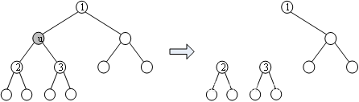

在树这种数据结构上做DP是常见的题型：给出一棵树，要求实现最少的代价（或最大收益）。

在树上做动态规划显得非常自然，因为树本身有“子结构”性质（树和子树），具有递归性，符合本书“DP的两种编程方法”这一节中所提到的“记忆化递归”的思路，因此树形DP一般就这样编程。

基于树的解题步骤一般是：先把树转为有根树（如果是几个互不连通的树，就加一个虚拟根，它连接所有孤立的树），然后在树上做DFS，递归到最底层的叶子节点，再一层层返回信息更新至根结点。显然，树上的DP所操作的就是这一层层返回的信息。不同的题目需要灵活设计不同的DP状态和转移方程。

树形 DP，即在树上进行的 DP。由于树固有的递归性质，树形 DP 一般都是递归进行的。

## 基础

先看一个简单的入门题。通过这一题，了解树的存储，以及如何在树上设计DP和进行状态转移。请读者特别注意DP设计时的两种处理方法：二叉树、多叉树。

???+note "[二叉苹果树](https://www.luogu.com.cn/problem/P2015)"
    **题目描述：** 有一棵苹果树，如果树枝有分叉，一定是分2叉。这棵树共有n个结点，编号为1~n，树根编号是1。用一根树枝两端连接的结点的编号来描述一根树枝的位置，下面是一棵有4个树枝的树：
    
    2 5
    
    \ /
    
    3 4
    
    \ /
    
    1
    
    这棵树的枝条太多了，需要剪枝。但是一些树枝上长有苹果，最好别剪。给定需要保留的树枝数量，求出最多能留住多少苹果。
    
    **输入格式：** 第1行2个数，n和q(1 ≤ Q ≤N, 1 < N ≤ 100)。n表示树的结点数，q表示要保留的树枝数量。接下来n - 1行描述树枝的信息。每行3个整数，前两个是它连接的结点的编号。第3个数是这根树枝上苹果的数量。每根树枝上的苹果不超过30000个。
    
    **输出格式：** 一个数，最多能留住的苹果的数量。
    
    输入样例：
    
    5 2
    
    1 3 1
    
    1 4 10

    2 3 20
    
    3 5 20
    
    输出样例：
    
    21

首先是树的存储，在计算之前需要先存储这棵树。树是图的一种特殊情况，树的存储和图的存储差不多：一种方法是邻接表，用vector实现又简单又快；另一种方法是链式前向星，对空间要求很高时可以使用，编码也不算复杂。本题给出的代码用vector存树，后面的例题poj 3107用链式前向星存树。

这一题的求解可以从根开始自顶向下，是典型的DP思路。

定义状态dp\[u\]\[j\]，它表示以结点u为根的子树上留j条边时的最多苹果数量。dp\[1\]\[q\]就是答案。

状态转移方程如何设计？下面给出2种思路，二叉树方法、多叉树（一般性）方法。

（1）二叉树

本题是一棵二叉树，根据二叉树的特征，考虑u的左右子树，如果左儿子lson留k条边，右儿子rson就留j - k条边，用k在\[0, j\]内遍历不同的分割。读者可以尝试用这种思路写出“记忆化搜索”的代码，其主要步骤参考下面的伪代码：

```cpp
int dfs(int u, int j){      //以u为根的子树，保留j个树枝时的最多苹果
    if(dp[u]][j] >=0)       //记忆化，如果已计算过，就返回
       return dp[u][j];
    for(int k=0; k<j; k++)   //用k遍历
       dp[u][j] = max(dp[u][j], dfs(u.lson,k) + dfs(u.rson, j-k)); //左右儿子合起来
    return dp[u][j];
}
```

二叉树的DP设计非常简洁易懂。如果题目是多叉树，可以先转为二叉树，然后再设计DP；不过一般没有必要这样做。

（2）多叉树

本节不准备用上面的方法，因为它局限于二叉树这种结构。下面用多叉树实现，这是一般性的方法。把状态转移方程写成以下的形式：

```cpp
for(int j = sum[u]; j >= 0; j--)           //sum[u]是u为根的子树上的总边数
	for(int k = 0; k <= j - 1; k++)        //用k遍历不同的分割
        dp[u][j] = max(dp[u][j], dp[u][j-k-1] + dp[v][k] + w); //状态转移方程
```

其中v是u的一个子结点。dp\[u\]\[j\]的计算分为2部分：

1）dp\[v\]\[k\]：在v上留k个边；
2）dp\[u\]\[j-k-1\]：除了v上的k个边，以及边\[u,v\]，那么以u为根的这棵树上还有j-k-1个边，它们在u的其他子结点上。

```cpp
#include<bits/stdc++.h>
using namespace std;
const int MAXN = 200;
struct node{
 	int v, w;                   //v是子结点，w是边[u,v]的值
 	node(int v = 0, int w = 0) : v(v), w(w) {}
};
vector<node> edge[MAXN];
int dp[MAXN][MAXN], sum[MAXN];  //sum[i]记录以点i为根的子树的总边数
int n, q;
void dfs(int u, int father){
	for(int i = 0; i < edge[u].size(); i++) {  //用i遍历u的所有子节点
        int v = edge[u][i].v, w =  edge[u][i].w;
        if(v == father) continue;              //不回头搜父亲，避免循环
        dfs(v, u);                             //递归到最深的叶子结点，然后返回
        sum[u] += sum[v] + 1;                  //子树上的总边数
      //for(int j = sum[u]; j >= 0; j--)         
      //    for(int k = 0; k <= j - 1; k++)    //两个for优化为下面的代码。不优化也行
        for(int j = min(q, sum[u]); j >= 0; j--)   
        	for(int k = 0; k <= min(sum[v], j - 1); k++)
                dp[u][j] = max(dp[u][j], dp[u][j-k-1] + dp[v][k] + w);
    }
}
int main(){
    scanf("%d%d", &n, &q);            //n个点，留q条树枝
	for(int i = 1; i < n; i++){
        int u, v, w;  scanf("%d%d%d", &u, &v, &w);
        edge[u].push_back(node(v,w)); //把边[u,v]存到u的邻接表中
        edge[v].push_back(node(u,w)); //无向边
    }    
    dfs(1, 0);                        //从根结点开始做记忆化搜索
    printf("%d\n", dp[1][q]);    
    return 0;
}
```

**二叉树和多叉树的讨论。** 本题是二叉树，但是上面的代码是按多叉树处理的。代码中用v遍历了u的所有子树，并未限定是二叉树。状态方程计算dp\[u\]\[j\]时包含两部分dp\[u\]\[j-k-1\]和dp\[v\]\[k\]，其中dp\[v\]\[k\]是u的一个子树v，dp\[u\]\[j-k-1\]是u的其他所有子树。

上面代码中最关键的是dfs()函数中j的循环方向，它应该从sum\[u\]开始递减，而不是从0开始递增。例如计算dp\[u\]\[5\]，它用到了dp\[u\]\[4\]、dp\[u\]\[3\]等等，它们可能是有值的，原值等于以前用u的另一个子树计算得到的结果，也就是排除当前的v这个子树时计算的结果。

1）让j递减循环，是正确的。例如先计算j = 5，dp\[u\]\[5\]用到了dp\[u\]\[4\]、dp\[u\]\[3\]等，它们都是正确的原值；下一步计算j = 4时，新的dp\[u\]\[4\]会覆盖原值，但是不会影响到对dp\[u\]\[5\]的计算。

2）让j递增循环，是错误的。例如先计算j = 4，得到新的dp\[u\]\[4\]；再计算dp\[u\]\[5\]，这时候需要用到dp\[u\]\[4\]，而此时的dp\[u\]\[4\]已经不再是正确的原值了。

读者可以联想“滚动数组”这一节的“自我滚动”的编码，它的循环也是从大到小递减的。两者的原理一样，即新值覆盖原值的问题。

k的循环顺序则无所谓，它是\[0, j - 1\]区间的分割，从0开始递增或从j - 1开始递减都行。
两个for循环还可以做一些小优化，详情见代码。

复杂度：dfs()递归到每个结点，每个结点有2个for循环，总复杂度小于O(n^3^)。

以下面这道题为例，介绍一下树形 DP 的一般过程。

???+note " 例题 [洛谷 P1352 没有上司的舞会](https://www.luogu.com.cn/problem/P1352)"
    某大学有 $n$ 个职员，编号为 $1 \sim N$。他们之间有从属关系，也就是说他们的关系就像一棵以校长为根的树，父结点就是子结点的直接上司。现在有个周年庆宴会，宴会每邀请来一个职员都会增加一定的快乐指数 $a_i$，但是呢，如果某个职员的直接上司来参加舞会了，那么这个职员就无论如何也不肯来参加舞会了。所以，请你编程计算，邀请哪些职员可以使快乐指数最大，求最大的快乐指数。

我们设 $f(i,0/1)$ 代表以 $i$ 为根的子树的最优解（第二维的值为 0 代表 $i$ 不参加舞会的情况，1 代表 $i$ 参加舞会的情况）。

对于每个状态，都存在两种决策（其中下面的 $x$ 都是 $i$ 的儿子）：

- 上司不参加舞会时，下属可以参加，也可以不参加，此时有 $f(i,0) = \sum\max \{f(x,1),f(x,0)\}$；
- 上司参加舞会时，下属都不会参加，此时有 $f(i,1) = \sum{f(x,0)} + a_i$。

我们可以通过 DFS，在返回上一层时更新当前结点的最优解。

```cpp
--8<-- "docs/dp/code/tree/tree_1.cpp"
```

### 习题

- [Anniversary party](https://vjudge.net/problem/HDU-1520)
- [HDU 2196 Computer](https://vjudge.net/problem/HDU-2196)
- [POJ 1463 Strategic game](http://poj.org/problem?id=1463)
- [\[POI2014\]FAR-FarmCraft](https://www.luogu.com.cn/problem/P3574)

## 树上背包

有一些树形DP问题，可以抽象为背包问题，被称为“树形依赖的背包问题”。例如上面的题目“二叉苹果树”，可以建模为“分组背包”（注意与普通分组背包的区别是，这里的每个组可以选多个物品，而不是一个）：

1. 分组。根结点u的每个子树是一个分组。
2. 背包的容量。把u为根的整棵树上的树枝数，看成背包容量。
3. 物品。把每个树枝看成一个物品，体积为1，树枝上的苹果数量看成物品的价值。
4. 背包目标。求能放到背包的物品的总价值最大，就是求留下树枝的苹果数最多。

如果读者做个对比，会发现分组背包的代码和“二叉苹果树”的代码很像，下面贴出2个代码帮助理解。

（1）分组背包的代码。参考分组背包例题hdu 1712。

```cpp
for(int i = 1; i <= n; i++)                 //遍历每个组
    for(int j = C; j>=0; j--)               //背包总容量C
        for(int k = 1; k <= m; k++)         //用k遍历第i组的所有物品
            if(j >= c[i][k])                //第k个物品能装进容量j的背包
               dp[j] = max(dp[j], dp[j-c[i][k]] + w[i][k]);    //第i组第k个
```

（2）树形dp代码。下面是洛谷P2015部分代码。

```cpp
for(int i = 0; i < edge[u].size(); i++) {    //把u的每个子树看成一个组
    ......
    for(int j = sum[u]; j >= 0; j--)         //把u的枝条总数看成背包容量
        for(int k = 0; k <= j - 1; k++)      //用k遍历每个子树的每个枝条
            dp[u][j] = max(dp[u][j], dp[u][j-k-1] + dp[v][k] + w);
```

需要注意的是，代码（1）和代码（2）的j循环都是从大到小，具体原因已经在对应的章节中详细解释。

树形背包问题的状态定义，一般用dp\[u\]\[j\]表示以点u为根的子树中，选择j个点（或j个边）的最优情况。

下面给出一个经典题，请读者自己分析和编码。

???+note "[有线电视网](https://www.luogu.com.cn/problem/P1273)"
    **题目描述：** 某收费有线电视网计划转播一场足球比赛。他们的转播网和用户终端构成一棵树状结构，这棵树的根结点位于足球比赛的现场，树叶为各个用户终端，其他中转站为该树的内部节点。
    
    从转播站到转播站以及从转播站到所有用户终端的信号传输费用都是已知的，一场转播的总费用等于传输信号的费用总和。
    
    现在每个用户都准备了一笔费用想观看这场精彩的足球比赛，有线电视网有权决定给哪些用户提供信号而不给哪些用户提供信号。
    
    写一个程序找出一个方案使得有线电视网在不亏本的情况下使观看转播的用户尽可能多。
    
    **输入格式：** 输入文件的第一行包含两个用空格隔开的整数N和M，其中2 ≤ N ≤ 3000，1 ≤ M ≤ N-1，N为整个有线电视网的结点总数，M为用户终端的数量。
    
    第一个转播站即树的根结点编号为1，其他的转播站编号为2到N-M，用户终端编号为N-M+1到N。
    
    接下来的N-M行每行表示—个转播站的数据，第i+1行表示第i个转播站的数据，其格式如下：
    K A1 C1 A2 C2 … Ak Ck
    
    K表示该转播站下接K个结点(转播站或用户)，每个结点对应一对整数A与C，A表示结点编号，C表示从当前转播站传输信号到结点A的费用。最后一行依次表示所有用户为观看比赛而准备支付的钱数。
    
    **输出格式：** 输出文件仅一行，包含一个整数，表示上述问题所要求的最大用户数。
    
    输入样例：
    
    5 3
    
    2 2 2 5 3
    
    2 3 2 4 3
    
    3 4 2
    
    输出样例：
    
    2

此题和“洛谷P2015”类似。
定义dp\[u\]\[j\]：以u为根的子树上有j个用户时的最小费用。计算结束后，使dp\[1\]\[j\] ≤ 0的最大j就是答案。
状态转移方程：`dp[u][j] = max(dp[u][j], dp[u][j-k] + dp[v][k] + w)`，与“洛谷P2015”的状态转移方程几乎一样。

树上的背包问题，简单来说就是背包问题与树形 DP 的结合。

???+note "例题 [洛谷 P2014 CTSC1997 选课](https://www.luogu.com.cn/problem/P2014)"
    现在有 $n$ 门课程，第 $i$ 门课程的学分为 $a_i$，每门课程有零门或一门先修课，有先修课的课程需要先学完其先修课，才能学习该课程。
    
    一位学生要学习 $m$ 门课程，求其能获得的最多学分数。
    
    $n,m \leq 300$

每门课最多只有一门先修课的特点，与有根树中一个点最多只有一个父亲结点的特点类似。

因此可以想到根据这一性质建树，从而所有课程组成了一个森林的结构。为了方便起见，我们可以新增一门 $0$ 学分的课程（设这个课程的编号为 $0$），作为所有无先修课课程的先修课，这样我们就将森林变成了一棵以 $0$ 号课程为根的树。

我们设 $f(u,i,j)$ 表示以 $u$ 号点为根的子树中，已经遍历了 $u$ 号点的前 $i$ 棵子树，选了 $j$ 门课程的最大学分。

转移的过程结合了树形 DP 和 [背包 DP](./knapsack.md) 的特点，我们枚举 $u$ 点的每个子结点 $v$，同时枚举以 $v$ 为根的子树选了几门课程，将子树的结果合并到 $u$ 上。

记点 $x$ 的儿子个数为 $s_x$，以 $x$ 为根的子树大小为 $\textit{siz_x}$，可以写出下面的状态转移方程：

$$
f(u,i,j)=\max_{v,k \leq j,k \leq \textit{siz_v}} f(u,i-1,j-k)+f(v,s_v,k)
$$

注意上面状态转移方程中的几个限制条件，这些限制条件确保了一些无意义的状态不会被访问到。

$f$ 的第二维可以很轻松地用滚动数组的方式省略掉，注意这时需要倒序枚举 $j$ 的值。

可以证明，该做法的时间复杂度为 $O(nm)$[^note1]。

??? note "参考代码"
    ```cpp
    --8<-- "docs/dp/code/tree/tree_2.cpp"
    ```

### 习题

- [Rebuilding Roads](http://poj.org/problem?id=1947)
- [Apple Tree](http://poj.org/problem?id=2486)
- [Starship Troopers](https://vjudge.net/problem/HDU-1011)
- [The more, The Better](https://vjudge.net/problem/HDU-1561)
- [Find Metal Mineral](https://vjudge.net/problem/HDU-4003)
- [「CTSC1997」选课](https://www.luogu.com.cn/problem/P2014)
- [「JSOI2018」潜入行动](https://loj.ac/problem/2546)
- [「SDOI2017」苹果树](https://loj.ac/problem/2268)

## 树的重心

树的最大独立集、重心、最长点对是常见的问题。下面给出树的重心的一个例题。本题的代码，用链式前向星来存树。

???+note "[Godfather](http://poj.org/problem?id=3107)"
    **题目描述：**  城里有一个黑手党组织。把黑手党的人员关系用一棵树来描述，教父是树的根，每个结点是一个黑手党徒。为了保密，每人只和他的父结点和他的子结点联系。警察知道哪些人互相来往，但是不知他们的关系。警察想找出谁是教父。
    
    警察假设教父是一个聪明人：教父懂得制衡手下的权力，所以他直属的的几个小头目，每个小头目属下的人数差不多。也就是说，删除根之后，剩下的几个互不连通的子树（连通块），其中最大的连通块应该尽可能小。帮助警察找到哪些人可能是教父。
    
    **输入格式：** 第一行是n，表示黑手党的人数，2 ≤ n ≤ 50 000。黑手党徒的编号是1到n。下面有n-1行，每行有2个整数，即有联系的2个人的编号。
    
    **输出格式：** 输出疑为教父的结点编号，从小到大输出。
    
    输入样例：
    
    6
    
    1 2
    
    2 3
    
    2 5
    
    3 4
    
    3 6
    
    输出样例：
    
    2 3

树的重心u是这样一个结点：计算树上所有结点的子树的结点数，如果结点u的最大的子树的结点数最少，那么u就是树的重心。本题中的教父就是树的重心。

首先考虑一个基本问题：如何计算以结点i为根的树的结点数量？对i做DFS即可，从i出发，递归到最底层后返回，每返回一个结点，结点数加1，直到所有结点都返回，就得到了树上结点总数。因为每个结点只返回1次，所有这个方法是对的。

回到本题，先考虑暴力法。删除树上的一个结点u，得到几个孤立的连通块，可以对每个连通块做一次DFS，分别计算结点数量。对整棵树逐一删除每个结点，重复上述计算过程，就得到了每个结点的最大连通块。

暴力法过于笨拙，其实并不需要真的一个个去删除每个结点，更不需要对每个连通块分别做DFS。只需要一次DFS，就能得到每个结点的最大连通块。用下面的图解释这个过程。



删除结点u得到三个连通块

观察结点u。删除u后，得到三个连通块：（1）包含1的连通块；（2）包含2 的连通块，（3）包含3的连通块。这三个连通块的数量如何计算？

对左图做DFS。可以从任意一个点开始DFS，假设从1开始，1是u的父结点。DFS到结点u后，从u开始继续DFS，得到它的子树2和3的结点数量（2）和（3），设u为根的子树的数量是d\[u\]，则d\[u\] = (2) + (3) + 1。那么（1）的数量等于n - d\[u\]，n是结点总数。记录（1）、（2）、（3）的最大值，就得到了u的最大连通块。

这样通过一次DFS，每个结点的最大连通块都得到了计算。

本题的n很大，用链式前向星存树能有效节省空间。

poj 3107的代码（链式前向星存树）

```cpp
#include<cstdio>
#include<algorithm>
using namespace std;
const int N = 50005;          //最大结点数
struct Edge{
    int to, next;
}edge[N<<1];                  //两倍：u-v, v-u
int head[N], cnt = 0;
void init(){                  //链式前向星：初始化
    for(int i=0; i<N; ++i){
        edge[i].next = -1;
        head[i] = -1;
    }
    cnt = 0;
}
void addedge(int u,int v){    //链式前向星：加边u-v
    edge[cnt].to = v;
    edge[cnt].next = head[u];
    head[u] = cnt++;
}
int n;
int d[N], ans[N], num=0, maxnum=1e9;       //d[u]: 以u为根的子树的结点数量
void dfs(int u,int fa){                        
    d[u] = 1;                              //递归到最底层时，结点数加1
    int tmp = 0;
    for(int i=head[u]; ~i; i=edge[i].next){ //遍历u的子结点。~i 也可以写成 i != -1
        int v = edge[i].to;                //v是一个子结点
        if(v == fa) continue;              //不递归父亲
        dfs(v,u);                          //递归子节点，计算v这个子树的结点数量
        d[u] += d[v];                      //计算以u为根的结点数量
        tmp = max(tmp,d[v]);               //记录u的最大子树的结点数量
    }
    tmp = max(tmp, n-d[u]);                //tmp = u的最大连通块的结点数
    //以上计算出了u的最大连通块
    //下面统计疑似教父。一个结点的最大连通块比其他结点都小，是疑似教父
    if(tmp < maxnum){                      //一个疑似教父
        maxnum = tmp;                      //更新“最小的”最大连通块 
        num = 0;
        ans[++num] = u;                    //把教父记录在第1个位置
    }
    else if(tmp == maxnum)                 //疑似教父有多个，记录在后面
        ans[++num] = u;    
}
int main(){
    scanf("%d",&n);
    init();
    for(int i=1; i<n; i++){
        int u, v;      scanf("%d %d", &u, &v);
        addedge(u,v);  addedge(v,u);
    }
    dfs(1,0);
    sort(ans+1, ans+1+num);
    for(int i=1;i<=num;i++)   printf("%d ",ans[i]);
}
```

### 习题

- [Another Crisis](https://vjudge.net/problem/UVA-12186)
- [Party at Hali-Bula](https://vjudge.net/problem/UVA-1220)
- [Perfect Service](https://vjudge.net/problem/UVA-1218)

## 换根 DP

树形 DP 中的换根 DP 问题又被称为二次扫描，通常不会指定根结点，并且根结点的变化会对一些值，例如子结点深度和、点权和等产生影响。

通常需要两次 DFS，第一次 DFS 预处理诸如深度，点权和之类的信息，在第二次 DFS 开始运行换根动态规划。

接下来以一些例题来带大家熟悉这个内容。

???+note "例题 [[POI2008]STA-Station](https://www.luogu.com.cn/problem/P3478)"
    给定一个 $n$ 个点的树，请求出一个结点，使得以这个结点为根时，所有结点的深度之和最大。

不妨令 $u$ 为当前结点，$v$ 为当前结点的子结点。首先需要用 $s_i$ 来表示以 $i$ 为根的子树中的结点个数，并且有 $s_u=1+\sum s_v$。显然需要一次 DFS 来计算所有的 $s_i$，这次的 DFS 就是预处理，我们得到了以某个结点为根时其子树中的结点总数。

考虑状态转移，这里就是体现＂换根＂的地方了。令 $f_u$ 为以 $u$ 为根时，所有结点的深度之和。

$f_v\leftarrow f_u$ 可以体现换根，即以 $u$ 为根转移到以 $v$ 为根。显然在换根的转移过程中，以 $v$ 为根或以 $u$ 为根会导致其子树中的结点的深度产生改变。具体表现为：

- 所有在 $v$ 的子树上的结点深度都减少了一，那么总深度和就减少了 $s_v$；

- 所有不在 $v$ 的子树上的结点深度都增加了一，那么总深度和就增加了 $n-s_v$；

根据这两个条件就可以推出状态转移方程 $f_v = f_u - s_v + n - s_v=f_u + n - 2 \times s_v$。

于是在第二次 DFS 遍历整棵树并状态转移 $f_v=f_u + n - 2 \times s_v$，那么就能求出以每个结点为根时的深度和了。最后只需要遍历一次所有根结点深度和就可以求出答案。

??? note "参考代码"
    ```cpp
    --8<-- "docs/dp/code/tree/tree_3.cpp"
    ```

### 习题

- [POJ 3585 Accumulation Degree](http://poj.org/problem?id=3585)
- [\[POI2008\]STA-Station](https://www.luogu.com.cn/problem/P3478)
- [\[USACO10MAR\]Great Cow Gathering G](https://www.luogu.com.cn/problem/P2986)
- [CodeForce 708C Centroids](http://codeforces.com/problemset/problem/708/C)

-[Information Disturbing](https://vjudge.net/problem/HDU-3586)
-[Tree Cutting](http://poj.org/problem?id=2378)
-[Contestants Division](http://poj.org/problem?id=3140)
-[Fire](http://poj.org/problem?id=2152)
-[Walking Race](http://poj.org/problem?id=3162)

## 参考资料与注释

[^note1]: [子树合并背包类型的 dp 的复杂度证明 - LYD729 的 CSDN 博客](https://blog.csdn.net/lyd_7_29/article/details/79854245)
