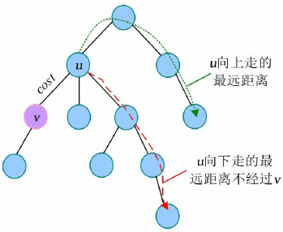

在树这种数据结构上做DP是常见的题型：给出一棵树，要求实现最少的代价（或最大收益）。

在树上做动态规划显得非常自然，因为树本身有“子结构”性质（树和子树），具有递归性，符合本书“DP的两种编程方法”这一节中所提到的“记忆化递归”的思路，因此树形DP一般就这样编程。

基于树的解题步骤一般是：先把树转为有根树（如果是几个互不连通的树，就加一个虚拟根，它连接所有孤立的树），然后在树上做DFS，递归到最底层的叶子节点，再一层层返回信息更新至根结点。显然，树上的DP所操作的就是这一层层返回的信息。不同的题目需要灵活设计不同的DP状态和转移方程。

树形 DP，即在树上进行的 DP。由于树固有的递归性质，树形 DP 一般都是递归进行的。

## 基础

先看一个简单的入门题。通过这一题，了解树的存储，以及如何在树上设计DP和进行状态转移。请读者特别注意DP设计时的两种处理方法：二叉树、多叉树。

???+note "[二叉苹果树](https://www.luogu.com.cn/problem/P2015)"
    **题目描述：** 有一棵苹果树，如果树枝有分叉，一定是分2叉。这棵树共有n个结点，编号为1~n，树根编号是1。用一根树枝两端连接的结点的编号来描述一根树枝的位置，下面是一棵有4个树枝的树：
    
    2 5
    
    \\ /
    
    3 4
    
    \\ /
    
    1
    
    这棵树的枝条太多了，需要剪枝。但是一些树枝上长有苹果，最好别剪。给定需要保留的树枝数量，求出最多能留住多少苹果。
    
    **输入格式：** 第1行2个数，n和q(1 ≤ Q ≤N, 1 < N ≤ 100)。n表示树的结点数，q表示要保留的树枝数量。接下来n - 1行描述树枝的信息。每行3个整数，前两个是它连接的结点的编号。第3个数是这根树枝上苹果的数量。每根树枝上的苹果不超过30000个。
    
    **输出格式：** 一个数，最多能留住的苹果的数量。
    
    输入样例：
    
    5 2
    
    1 3 1
    
    1 4 10

    2 3 20
    
    3 5 20
    
    输出样例：
    
    21

首先是树的存储，在计算之前需要先存储这棵树。树是图的一种特殊情况，树的存储和图的存储差不多：一种方法是邻接表，用vector实现又简单又快；另一种方法是链式前向星，对空间要求很高时可以使用，编码也不算复杂。本题给出的代码用vector存树，后面的例题poj 3107用链式前向星存树。

这一题的求解可以从根开始自顶向下，是典型的DP思路。

定义状态dp\[u\]\[j\]，它表示以结点u为根的子树上留j条边时的最多苹果数量。dp\[1\]\[q\]就是答案。

状态转移方程如何设计？下面给出2种思路，二叉树方法、多叉树（一般性）方法。

（1）二叉树

本题是一棵二叉树，根据二叉树的特征，考虑u的左右子树，如果左儿子lson留k条边，右儿子rson就留j - k条边，用k在\[0, j\]内遍历不同的分割。读者可以尝试用这种思路写出“记忆化搜索”的代码，其主要步骤参考下面的伪代码：

```cpp
int dfs(int u, int j){      //以u为根的子树，保留j个树枝时的最多苹果
    if(dp[u]][j] >=0)       //记忆化，如果已计算过，就返回
       return dp[u][j];
    for(int k=0; k<j; k++)   //用k遍历
       dp[u][j] = max(dp[u][j], dfs(u.lson,k) + dfs(u.rson, j-k)); //左右儿子合起来
    return dp[u][j];
}
```

二叉树的DP设计非常简洁易懂。如果题目是多叉树，可以先转为二叉树，然后再设计DP；不过一般没有必要这样做。

（2）多叉树

本节不准备用上面的方法，因为它局限于二叉树这种结构。下面用多叉树实现，这是一般性的方法。把状态转移方程写成以下的形式：

```cpp
for(int j = sum[u]; j >= 0; j--)           //sum[u]是u为根的子树上的总边数
	for(int k = 0; k <= j - 1; k++)        //用k遍历不同的分割
        dp[u][j] = max(dp[u][j], dp[u][j-k-1] + dp[v][k] + w); //状态转移方程
```

其中v是u的一个子结点。dp\[u\]\[j\]的计算分为2部分：

1）dp\[v\]\[k\]：在v上留k个边；
2）dp\[u\]\[j-k-1\]：除了v上的k个边，以及边\[u,v\]，那么以u为根的这棵树上还有j-k-1个边，它们在u的其他子结点上。

```cpp
#include<bits/stdc++.h>
using namespace std;
const int MAXN = 200;
struct node{
 	int v, w;                   //v是子结点，w是边[u,v]的值
 	node(int v = 0, int w = 0) : v(v), w(w) {}
};
vector<node> edge[MAXN];
int dp[MAXN][MAXN], sum[MAXN];  //sum[i]记录以点i为根的子树的总边数
int n, q;
void dfs(int u, int father){
	for(int i = 0; i < edge[u].size(); i++) {  //用i遍历u的所有子节点
        int v = edge[u][i].v, w =  edge[u][i].w;
        if(v == father) continue;              //不回头搜父亲，避免循环
        dfs(v, u);                             //递归到最深的叶子结点，然后返回
        sum[u] += sum[v] + 1;                  //子树上的总边数
      //for(int j = sum[u]; j >= 0; j--)         
      //    for(int k = 0; k <= j - 1; k++)    //两个for优化为下面的代码。不优化也行
        for(int j = min(q, sum[u]); j >= 0; j--)   
        	for(int k = 0; k <= min(sum[v], j - 1); k++)
                dp[u][j] = max(dp[u][j], dp[u][j-k-1] + dp[v][k] + w);
    }
}
int main(){
    scanf("%d%d", &n, &q);            //n个点，留q条树枝
	for(int i = 1; i < n; i++){
        int u, v, w;  scanf("%d%d%d", &u, &v, &w);
        edge[u].push_back(node(v,w)); //把边[u,v]存到u的邻接表中
        edge[v].push_back(node(u,w)); //无向边
    }    
    dfs(1, 0);                        //从根结点开始做记忆化搜索
    printf("%d\n", dp[1][q]);    
    return 0;
}
```

**二叉树和多叉树的讨论。** 本题是二叉树，但是上面的代码是按多叉树处理的。代码中用v遍历了u的所有子树，并未限定是二叉树。状态方程计算dp\[u\]\[j\]时包含两部分dp\[u\]\[j-k-1\]和dp\[v\]\[k\]，其中dp\[v\]\[k\]是u的一个子树v，dp\[u\]\[j-k-1\]是u的其他所有子树。

上面代码中最关键的是dfs()函数中j的循环方向，它应该从sum\[u\]开始递减，而不是从0开始递增。例如计算dp\[u\]\[5\]，它用到了dp\[u\]\[4\]、dp\[u\]\[3\]等等，它们可能是有值的，原值等于以前用u的另一个子树计算得到的结果，也就是排除当前的v这个子树时计算的结果。

1）让j递减循环，是正确的。例如先计算j = 5，dp\[u\]\[5\]用到了dp\[u\]\[4\]、dp\[u\]\[3\]等，它们都是正确的原值；下一步计算j = 4时，新的dp\[u\]\[4\]会覆盖原值，但是不会影响到对dp\[u\]\[5\]的计算。

2）让j递增循环，是错误的。例如先计算j = 4，得到新的dp\[u\]\[4\]；再计算dp\[u\]\[5\]，这时候需要用到dp\[u\]\[4\]，而此时的dp\[u\]\[4\]已经不再是正确的原值了。

读者可以联想“滚动数组”这一节的“自我滚动”的编码，它的循环也是从大到小递减的。两者的原理一样，即新值覆盖原值的问题。

k的循环顺序则无所谓，它是\[0, j - 1\]区间的分割，从0开始递增或从j - 1开始递减都行。
两个for循环还可以做一些小优化，详情见代码。

复杂度：dfs()递归到每个结点，每个结点有2个for循环，总复杂度小于O(n^3^)。

以下面这道题为例，介绍一下树形 DP 的一般过程。

???+note " 例题 [洛谷 P1352 没有上司的舞会](https://www.luogu.com.cn/problem/P1352)"
    某大学有 $n$ 个职员，编号为 $1 \sim N$。他们之间有从属关系，也就是说他们的关系就像一棵以校长为根的树，父结点就是子结点的直接上司。现在有个周年庆宴会，宴会每邀请来一个职员都会增加一定的快乐指数 $a_i$，但是呢，如果某个职员的直接上司来参加舞会了，那么这个职员就无论如何也不肯来参加舞会了。所以，请你编程计算，邀请哪些职员可以使快乐指数最大，求最大的快乐指数。

我们设 $f(i,0/1)$ 代表以 $i$ 为根的子树的最优解（第二维的值为 0 代表 $i$ 不参加舞会的情况，1 代表 $i$ 参加舞会的情况）。

对于每个状态，都存在两种决策（其中下面的 $x$ 都是 $i$ 的儿子）：

- 上司不参加舞会时，下属可以参加，也可以不参加，此时有 $f(i,0) = \sum\max \{f(x,1),f(x,0)\}$；
- 上司参加舞会时，下属都不会参加，此时有 $f(i,1) = \sum{f(x,0)} + a_i$。

我们可以通过 DFS，在返回上一层时更新当前结点的最优解。

```cpp
--8<-- "docs/dp/code/tree/tree_1.cpp"
```

### 习题

??? note "[HDU 2196 Computer](https://vjudge.net/problem/HDU-2196)"
    学校不久前买了第1台计算机（编号为1）。近年来，学校又买了N -1台新计算机。每台新计算机都被连接到先前安装的一台计算机上。学校管理者担心网络运行缓慢，想知道第i台计算机发送信号的最大距离si （即电缆到最远的计算机的长度）。

    ??? tip
        本题为树中任意节点的最远距离问题。对树中的任意一个节点求其最远距离时，都可以从该节点出发，做一次广度优先搜索，时间复杂度为$O(n)$，n 个节点总的时间复杂度为$O(n^2)$。本题时间限制为1秒，$n \leq 10000$，时间复杂度为$O(n^2)$的算法会超时。可以考虑采用树形DP算法。

        对树中任意一个节点v ，其最远距离都可以分为两部分：节点v 向下走的最远距离及节点v 向上走的最远距离，两者取最大值即可。对节点v 向下走的最远距离只需进行一次深度优先搜索即可得到，问题的关键在于怎么求解节点v 向上走的最远距离。    

        

        若节点u 为节点v 的父节点，则u -v 的权值为cost。v 向上走的最远距离可以分为以下两种情况。

        （1）u 向下走的最远距离经过节点v ，如下图所示。v 向上走的最远距离=max{u 向下走的次远距离，u 向上走的最远距离}+cost

        

        （2）u 向下走的最远距离不经过v ，如下图所示。v 向上走的最远距离=max{u 向下走的最远距离，u 向上走的最远距离}+cost

        

        状态表示：

        - $dp[u][0]$表示节点u 向下走的最远距离（以u 为根的子树中的节点与u 的最远距离）；
        - $dp[u][1]$表示节点u 向下走的次远距离；
        - $dp[u][2]$表示节点u 向上走的最远距离。

        状态转移方程： $dp[u][0]$和$dp[u][1]$可以通过一遍深度优先搜索得到，$dp[u][2]$需要再执行一遍深度优先搜索得到。两次深度优先搜索的算法时间复杂度均为$O(n)$。

        若节点u 为节点v 的父节点，则两节点之间的权值为cost。$dp[v][2]$分以下两种情况。

        - u 向下走的最远距离经过v ：$dp[v][2]=max(dp[u][1], dp[u][2])+cost$。
        - u 向下走的最远距离不经过v ：$dp[v][2]=max(dp[u][0],dp[u][2])+cost$。

        边界条件： $dp[u][0]=dp[u][1]=dp[u][2]=0$。

        求解目标： 节点u 的最远距离为$max(dp[u][0], dp[u][2])$。

        本题可以采用二次扫描和换根法求解。

        算法步骤：

        1. 第1次深度优先搜索，自底向上求解每个节点向下的最远距离$dp[u][0]$和次远距离$dp[u][1]$；
        2. 第2次深度优先搜索，自顶向下求解每个节点向上的最远距离$dp[u][2]$；
        3. 对每个节点u 都输出$max(dp[u][0], dp[u][2])$。

    ??? note "参考代码"

        ```cpp
        #include <iostream>
        #include <cstdio>
        #include <vector>
        #include <cstring>
        using namespace std;
        const int maxn = 1e4 + 5;
        vector<int> p[maxn], val[maxn];
        int dp[3][maxn], id[maxn];
        void dfs1(int x, int f)  //第一个dfs更新子树的最大跟次大和
        {
            for(int i = 0; i < p[x].size(); i++)
            {
                int to = p[x][i];
                if(to == f) continue;
                dfs1(to, x);
                if(dp[0][x] < dp[0][to] + val[x][i]) //这里是更新最大和，记住经过哪个儿子最大
                {
                    dp[0][x] = dp[0][to] + val[x][i];
                    id[x] = to;
                }
            }
            for(int i = 0; i < p[x].size(); i++)
            {
                int to = p[x][i];
                if(to == f) continue;
                if(id[x] == to) continue;  //跳过这个儿子，再剩下点里面找一个最大的，就是这个点次大的
                dp[1][x] = max(dp[1][x], dp[0][to]+val[x][i]);
            }
        }
        void dfs2(int x, int f)  //这个是更新先往父亲节点走一步的最大和
        {
            for(int i = 0; i < p[x].size(); i++)
            {
                int to = p[x][i];
                if(to == f) continue;
                if(to == id[x])  //难点，每个父亲都有两种方式，一个是再往父亲走一步，一个是走父亲的子树，max(dp[2][x], dp[1][x])，这个就体现出这两部了，注意经不经过这个点直接走子树最大和的那个点
                {
                    dp[2][to] = max(dp[2][x], dp[1][x]) + val[x][i];  //这个是针对儿子，所以是dp[2][to] = ，体现了先走一步父亲，经过就走次大的，再走最大的就重复了一段
                }
                else
                {
                    dp[2][to] = max(dp[2][x], dp[0][x])+val[x][i];
                }
                dfs2(to, x);  //因为dfs1更新了所有子树的特点，子树的信息可以直接用了，父节点的信息从一步步dfs下去都已经更新好了，上面的也是可以直接用，每一步都看看是不是走父亲的父亲更好，一直更新最优
            }
        }
        int main()
        {
            int n;
            while(~scanf("%d", &n))
            {
                int a, b;
                memset(dp, 0, sizeof(dp));
                for(int i = 1; i <= n; i++)
                {
                    p[i].clear();
                    val[i].clear();
                }
                for(int i = 2; i <= n; i++)
                {
                    scanf("%d%d", &a, &b);
                    p[i].push_back(a);
                    val[i].push_back(b);
                    p[a].push_back(i);
                    val[a].push_back(b);
                }
                dfs1(1, -1);
                dfs2(1, -1);
                for(int i = 1; i <= n; i++)
                    printf("%d\n", max(dp[0][i], dp[2][i]));
            }
            return 0;
        }
        ```

??? note "[POJ 1463 Strategic game](http://poj.org/problem?id=1463)"
    鲍勃喜欢玩战略游戏，但他有时找不到足够快的解决方案。现在他必须保卫一座中世纪城市，城市的道路形成一棵树。他必须把最小数量的士兵放在节点上，这样才可以观察到所有道路。请帮助鲍勃找到放置的最小士兵数。

    ??? tip
        TreeDP，状态表示：

        - $dp[u][0]$表示不在节点u 放置士兵时，以节点u 为根的子树放置的最少士兵数；
        - $dp[u][1]$表示在节点u 放置士兵时，以节点u 为根的子树放置的最少士兵数。

        状态转移方程如下。

        - 若节点u 不放置士兵，则它的所有子节点v 都需要放置士兵，$dp[u][0]+= dp[v][1]$。
        - 若节点u 放置士兵，则它的所有子节点v 既可以放置士兵，也可以不放置士兵，取两种情况的最小值，$dp[u][1]+=min(dp[v][0],dp[v][1])$。

        边界条件： $dp[u][0]=0, dp[u][1]=1$。

        求解目标： $min(dp[root][0], dp[root][1])$，root为树根。

    ??? note "参考代码"

        ```cpp
        #include <iostream>
        #include <cstring>
        #include <cstdio>
        #include <cmath>
        #define maxn 1508
        
        using namespace std;
        
        int childcnt[maxn], pre[maxn], dp[maxn][2], n;
        //dp过程
        void DP(int root) {
            int i, d1 = 0, d0 = 0;
            if(childcnt[root] == 0) {
                dp[root][0] = 0;
                dp[root][1] = 1;
                return;
            }
            for(i = 0; i < n; i++)
                if(pre[i] == root) {
                    DP(i);
                    d1 += min(dp[i][0], dp[i][1]);
                    d0 += dp[i][1];
                }
            dp[root][1] = d1+1;
            dp[root][0] = d0;
        }
        
        int main() {
            int i, dad, child, m;
            while(~scanf("%d", &n)) {
                memset(childcnt, -1, sizeof(childcnt));
                memset(pre, -1, sizeof(pre));
                int root = -1;
                for(i = 0; i < n; i++) {
                    scanf("%d:(%d)", &dad, &m);
                    childcnt[dad] = m;//记录dad儿子的个数
                    if(root == -1)
                        root = dad;
                    while(m--) {
                        scanf("%d", &child);
                        pre[child] = dad;//记录child的父亲结点
                    }
                    if(pre[root] == dad)
                        root = dad;     //找到根结点
                }
                DP(root);
                cout<<min(dp[root][0], dp[root][1])<<endl;
            }
            return 0;
        }
        ```

??? note "[\[POI2014\]FAR-FarmCraft](https://www.luogu.com.cn/problem/P3574)"
    边权为1，使遍历树时到每个节点的时间加上点权的最大值最小，求这个最小的最大值。

    ??? tip
        $f[x]$表示x子树内的最大值, $size[x]$表示走完x的子树后回到x的总时间

        $f[x]=max(f[x],f[y]+size[x]+1)$ ($size[x]$存的是走完y之前的子树后回到x的时间)(
        +1是从x到y的花费)

        但是这样f的取值和遍历子树的顺序有关,于是考虑贪心

        对于两个相邻(遍历时)的子树y和z, y前, z后

        不交换:

        $f[x]=max(f[x],size[x]+max(f[y],f[z]+size[y]+2)+1)$

        交换:

        $f[x]=max(f[x],size[x]+max(f[z],f[y]+size[z]+2)+1)$

        如果交换比不交换优:

        $max(f[z],f[y]+size[z]+2)<max(f[y],f[z]+size[y]+2)$

        由于 $f[z]<f[z]+size[y]+2,f[y]<f[y]+size[z]+2$

        转化一下即为: $size[z]−f[z]<size[y]−f[y]$

        排序即可

        注意最后和 $size[1]+val[1]$ 取max

    ??? note "参考代码"

        ```cpp
        #include<bits/stdc++.h>
        using namespace std;
        const int maxn=5000010;
        int n,cnt;
        int val[maxn],head[maxn],f[maxn],size[maxn],tmp[maxn];
        struct edge
        {
            int to,nxt;
        }e[maxn<<1];
        inline bool cmp(int x,int y){return size[x]-f[x]<size[y]-f[y];}
        inline void add(int u,int v)
        {
            e[++cnt].nxt=head[u];
            head[u]=cnt;
            e[cnt].to=v;
        }
        void dfs(int x,int fa)
        {
            if(x!=1)f[x]=val[x];
            for(int i=head[x];i;i=e[i].nxt)if(e[i].to!=fa)dfs(e[i].to,x); 
            int tot=0;
            for(int i=head[x];i;i=e[i].nxt)if(e[i].to!=fa)tmp[++tot]=e[i].to;
            sort(tmp+1,tmp+tot+1,cmp);
            for(int i=1;i<=tot;i++)f[x]=max(f[x],f[tmp[i]]+size[x]+1),size[x]+=size[tmp[i]]+2;
        }
        int main()
        {
            scanf("%d",&n);
            for(int i=1;i<=n;i++)scanf("%d",&val[i]);
            for(int i=1;i<n;i++)
            {
                int u,v;scanf("%d%d",&u,&v);
                add(u,v);add(v,u);
            }
            dfs(1,0);
            printf("%d",max(f[1],size[1]+val[1]));
            return 0;
        }
        ```
## 树上背包

有一些树形DP问题，可以抽象为背包问题，被称为“树形依赖的背包问题”。例如上面的题目“二叉苹果树”，可以建模为“分组背包”（注意与普通分组背包的区别是，这里的每个组可以选多个物品，而不是一个）：

1. 分组。根结点u的每个子树是一个分组。
2. 背包的容量。把u为根的整棵树上的树枝数，看成背包容量。
3. 物品。把每个树枝看成一个物品，体积为1，树枝上的苹果数量看成物品的价值。
4. 背包目标。求能放到背包的物品的总价值最大，就是求留下树枝的苹果数最多。

如果读者做个对比，会发现分组背包的代码和“二叉苹果树”的代码很像，下面贴出2个代码帮助理解。

（1）分组背包的代码。参考分组背包例题hdu 1712。

```cpp
for(int i = 1; i <= n; i++)                 //遍历每个组
    for(int j = C; j>=0; j--)               //背包总容量C
        for(int k = 1; k <= m; k++)         //用k遍历第i组的所有物品
            if(j >= c[i][k])                //第k个物品能装进容量j的背包
               dp[j] = max(dp[j], dp[j-c[i][k]] + w[i][k]);    //第i组第k个
```

（2）树形dp代码。下面是洛谷P2015部分代码。

```cpp
for(int i = 0; i < edge[u].size(); i++) {    //把u的每个子树看成一个组
    ......
    for(int j = sum[u]; j >= 0; j--)         //把u的枝条总数看成背包容量
        for(int k = 0; k <= j - 1; k++)      //用k遍历每个子树的每个枝条
            dp[u][j] = max(dp[u][j], dp[u][j-k-1] + dp[v][k] + w);
```

需要注意的是，代码（1）和代码（2）的j循环都是从大到小，具体原因已经在对应的章节中详细解释。

树形背包问题的状态定义，一般用dp\[u\]\[j\]表示以点u为根的子树中，选择j个点（或j个边）的最优情况。

下面给出一个经典题，请读者自己分析和编码。

???+note "[有线电视网](https://www.luogu.com.cn/problem/P1273)"
    **题目描述：** 某收费有线电视网计划转播一场足球比赛。他们的转播网和用户终端构成一棵树状结构，这棵树的根结点位于足球比赛的现场，树叶为各个用户终端，其他中转站为该树的内部节点。
    
    从转播站到转播站以及从转播站到所有用户终端的信号传输费用都是已知的，一场转播的总费用等于传输信号的费用总和。
    
    现在每个用户都准备了一笔费用想观看这场精彩的足球比赛，有线电视网有权决定给哪些用户提供信号而不给哪些用户提供信号。
    
    写一个程序找出一个方案使得有线电视网在不亏本的情况下使观看转播的用户尽可能多。
    
    **输入格式：** 输入文件的第一行包含两个用空格隔开的整数N和M，其中2 ≤ N ≤ 3000，1 ≤ M ≤ N-1，N为整个有线电视网的结点总数，M为用户终端的数量。
    
    第一个转播站即树的根结点编号为1，其他的转播站编号为2到N-M，用户终端编号为N-M+1到N。
    
    接下来的N-M行每行表示—个转播站的数据，第i+1行表示第i个转播站的数据，其格式如下：
    K A1 C1 A2 C2 … Ak Ck
    
    K表示该转播站下接K个结点(转播站或用户)，每个结点对应一对整数A与C，A表示结点编号，C表示从当前转播站传输信号到结点A的费用。最后一行依次表示所有用户为观看比赛而准备支付的钱数。
    
    **输出格式：** 输出文件仅一行，包含一个整数，表示上述问题所要求的最大用户数。
    
    输入样例：
    
    5 3
    
    2 2 2 5 3
    
    2 3 2 4 3
    
    3 4 2
    
    输出样例：
    
    2

此题和“洛谷P2015”类似。
定义dp\[u\]\[j\]：以u为根的子树上有j个用户时的最小费用。计算结束后，使dp\[1\]\[j\] ≤ 0的最大j就是答案。
状态转移方程：`dp[u][j] = max(dp[u][j], dp[u][j-k] + dp[v][k] + w)`，与“洛谷P2015”的状态转移方程几乎一样。

树上的背包问题，简单来说就是背包问题与树形 DP 的结合。

???+note "例题 [洛谷 P2014 CTSC1997 选课](https://www.luogu.com.cn/problem/P2014)"
    现在有 $n$ 门课程，第 $i$ 门课程的学分为 $a_i$，每门课程有零门或一门先修课，有先修课的课程需要先学完其先修课，才能学习该课程。
    
    一位学生要学习 $m$ 门课程，求其能获得的最多学分数。
    
    $n,m \leq 300$

每门课最多只有一门先修课的特点，与有根树中一个点最多只有一个父亲结点的特点类似。

因此可以想到根据这一性质建树，从而所有课程组成了一个森林的结构。为了方便起见，我们可以新增一门 $0$ 学分的课程（设这个课程的编号为 $0$），作为所有无先修课课程的先修课，这样我们就将森林变成了一棵以 $0$ 号课程为根的树。

我们设 $f(u,i,j)$ 表示以 $u$ 号点为根的子树中，已经遍历了 $u$ 号点的前 $i$ 棵子树，选了 $j$ 门课程的最大学分。

转移的过程结合了树形 DP 和 [背包 DP](./knapsack.md) 的特点，我们枚举 $u$ 点的每个子结点 $v$，同时枚举以 $v$ 为根的子树选了几门课程，将子树的结果合并到 $u$ 上。

记点 $x$ 的儿子个数为 $s_x$，以 $x$ 为根的子树大小为 $\textit{siz_x}$，可以写出下面的状态转移方程：

$$
f(u,i,j)=\max_{v,k \leq j,k \leq \textit{siz_v}} f(u,i-1,j-k)+f(v,s_v,k)
$$

注意上面状态转移方程中的几个限制条件，这些限制条件确保了一些无意义的状态不会被访问到。

$f$ 的第二维可以很轻松地用滚动数组的方式省略掉，注意这时需要倒序枚举 $j$ 的值。

可以证明，该做法的时间复杂度为 $O(nm)$[^note1]。

??? note "参考代码"
    ```cpp
    --8<-- "docs/dp/code/tree/tree_2.cpp"
    ```

### 习题

??? note "[Rebuilding Roads](http://poj.org/problem?id=1947)"
    给出一棵树，问现在要得到一颗有 p 个节点的子树，至少需要切除几条边？

    ??? tip
        设$dp[i][j]$为以i为根（注意是当前点为根，不再考虑其父亲，这题是要在原来的树里面切出一个树），留下j个点截去的最少的边。

        首先$dp[i][1]=子结点数量$，即只留下根，要把所有与子节点的边给截掉。

        对于$dp[i][2~m]$：如果取子结点，则$dp[i][j]=min(dp[i][j],dp[i][j-k]+dp[t][k]-1)$

        这里的-1比较巧妙，用的是逆向思维。如果硬要把子树接上去的话，则就被截取边就得少一条，则-1。

        至于为什么是$dp[i][j-k]+dp[t][k]$，这里理解成根与儿子共同分一个j，所以取和。

        最后的DP的结果比较难想：

        $ans=min(dp[1][m],dp[2~n][m]+1)$

        即如果以1为总根，则dp[1][m]就是结果。

        否则对于其它点，要使其为总根，则必须切断其与父亲的边，所以结果+1。

    ??? note "参考代码"

        ```cpp
        #include "cstdio"
        #include "iostream"
        #include "cstring"
        using namespace std;
        #define maxn 155
        #define inf 0x3f3f3f3f
        int n,m,u,v,head[maxn],son[maxn],tol;
        int dp[maxn][maxn];
        struct Edge
        {
            int next,to;
        }e[maxn];
        void addedge(int u,int v)
        {
            e[tol].to=v;
            e[tol].next=head[u];
            head[u]=tol++;
        }
        int dfs(int root)
        {
            dp[root][1]=son[root];
            int i=root;
            for(int a=head[root];a!=-1;a=e[a].next)
            {
                int t=e[a].to;
                dfs(t);
                for(int j=m;j>=1;j--)
                    for(int k=1;k<=j-1;k++)
                        dp[i][j]=min(dp[i][j],dp[i][j-k]+dp[t][k]-1);
            }
        }
        int main()
        {
            scanf("%d%d",&n,&m);
            memset(dp,0x3f,sizeof(dp));
            memset(head,-1,sizeof(head));
            for(int i=1;i<n;i++)
            {
                scanf("%d%d",&u,&v);
                son[u]++;
                addedge(u,v);
            }
            dfs(1);
            int ans=inf;
            for(int i=1;i<=n;i++)
            {
                if(i==1) ans=min(ans,dp[i][m]);
                else ans=min(dp[i][m]+1,ans);
            }
            printf("%d\n",ans);
        }
        ```

??? note "[Apple Tree](http://poj.org/problem?id=2486)"
    一棵虚拟的苹果树有n 个节点，每个节点都有一定数量的苹果。从节点1出发，可以吃掉到达节点的所有苹果。当从一个节点转到另一个相邻节点时，需要走一步。计算经过k 步最多吃多少个苹果。

    ??? tip
        TreeDP

        从节点u 出发有两种情况：回到u 和不回到u 。将节点编号作为第1维，将走的步数作为第2维，将是否回到u 作为第3维（0表示没有回到u ，1表示回到u ）。状态表示：

        - $dp[u][j][1]$表示从节点u 出发，走j 步，再回到u ，吃到的最大苹果数量；
        - $dp[u][j][0]$表示从节点u 出发，走j 步，不回到u ，吃到的最大苹果数量。

        （1）回到u 。从节点u 出发，到其中一棵子树吃苹果，然后返回u，再到另一棵子树吃苹果，总步数为j 。

        这个过程可分为两部分：①从节点u 到达其子节点v ，再从v 遍历v 的子树并回到v ，从v 回到u， 除去u →v 、v →u 来回的两步，在以v 为根的子树中走了t -2步；②用剩余的步数（j -t ）遍历节点u的其余子树，再回到节点u。

        

        状态转移方程： $dp[u][j][1]=max(dp[u][j][1], dp[u][j -t][1]+dp[v][t -2][1])$。

        （2）不回到u 。若不回到节点u ，则最后的位置会是哪里呢？可以把以子节点v 为根节点的子树和节点u 的其余子树分开考虑。最后的位置分为以下两种情况。

        情况一，最后的位置在以子节点v 为根的子树上。此时分为两部分：①从节点u 遍历其余子树，最终回到u ；②节点再从u 遍历以v 为根节点的子树，最终在v 的子树上。

        

        状态转移方程： $dp[u][j][0]=max(dp[u][j][0], dp[u][j -t][1]+dp[v][t -1][0])$。

        情况二，最后的位置在节点u 的其他子树上。此时分为两部分：①从节点u 到达其子节点v ，再从v 遍历v 的子树并回到v ，从v 回到u， 除去u →v 、v →u 来回的两步，在以v 为根的子树中走了t -2步；②用剩余的步数（j -t ）遍历节点u 的其余子树，最终在u 的其他子树上。

        

        状态转移方程： $dp[u][j][0]=max(dp[u][j][0], dp[u][j -t][0]+dp[v][t -2][1])$。

        边界条件： $dp[u][j][0]=dp[u][j][1]=val[u]$。

        求解目标： $max(dp[1][k][0], dp[1][k][1])$。

    ??? note "参考代码"

        ```cpp
        #include <iostream>
        #include <iomanip>
        #include <cstdio>
        #include <cstring>
        #include <string>
        #include <vector>
        #include <map>
        #include <algorithm>
        #include <queue>
        #include <stack>
        #include <cmath>
        #define inf 0x3f3f3f3f
        #define ll long long
        using namespace std;
        const int  maxn=1e5+10;
        int dp[210][410][2],n,m,sum[210];
        vector<int>E[110];
        void dfs(int u,int fa)
        {
            for(int i=0;i<=m;i++)dp[u][i][0]=dp[u][i][1]=sum[u];
            for(int i=0;i<E[u].size();i++)
            {
                int v=E[u][i];
                if(v==fa)continue;
                dfs(v,u);
                for(int j=m;j>=1;j--)
                for(int k=1;k<=j;k++)
                {
                    if(k-1>=0)dp[u][j][0]=max(dp[u][j][0],dp[u][j-k][1]+dp[v][k-1][0]);
                    if(k-2>=0)dp[u][j][0]=max(dp[u][j][0],dp[u][j-k][0]+dp[v][k-2][1]);
                    if(k-2>=0)dp[u][j][1]=max(dp[u][j][1],dp[u][j-k][1]+dp[v][k-2][1]);
                }
            }
        }
        int main()
        {
            while(scanf("%d%d",&n,&m)!=EOF)
            {
                memset(dp,0,sizeof(dp));
                for(int i=1;i<=n;i++)scanf("%d",&sum[i]),E[i].clear();
                for(int i=1;i<n;i++)
                {
                    int a,b;
                    scanf("%d%d",&a,&b);
                    E[a].push_back(b);
                    E[b].push_back(a);
                }
                dfs(1,0);
                printf("%d\n",max(dp[1][m][0],dp[1][m][1]));
            }
            return 0;	
        }
        ```

??? note "[Starship Troopers](https://vjudge.net/problem/HDU-1011)"
    有一颗树，树的节点编号为1-n，1为根节点，每个节点上会有x个敌人，y个宝藏，现在你从1号节点出发，率领m个友方单位，只有攻占了父节点才能继续攻占子节点，如果你在一个节点的兵力*20>=敌人数，你就可以得到这个节点中的宝藏，并且这些士兵就永久驻扎在这个节点了，并且所有士兵不能走回头路（注意这个条件非常重要，这个条件就意味着，就算每个节点的敌人数量都是0，也至少需要一个士兵才能获得宝藏，并且这个士兵只能选择树上的一条链走到底）

    ??? tip
        主要是题目条件比较坑，其他的就是裸的树形背包，在树上进行背包，思想很简单$dp[i][j]$代表以i节点为根的子树派出兵力j所能得到最多的宝藏数  

        递推式$dp[u][j]=max(dp[u][j],dp[u][j-k]+dp[v][k])$

        其中u为父节点 j为给以u为根的子树分配的兵力数 v为子节点 k为分配给以v为根节点的子树的兵力  
        其中只有攻占了父节点才能继续攻占子节点这个条件，只要在对每个点进行背包的时候强制留下$w[u]$个士兵即可($w[u]$为攻占u节点所需要的士兵数)

    ??? note "参考代码"

        ```cpp
        #include<iostream>
        #include<cstdio>
        #include<cstring>
        #include<cmath>
        #include<algorithm>
        #include<string>
        #include<cstdlib>
        #include<queue>
        #include<set>
        #include<map>
        #include<stack>
        #include<ctime>
        #include<vector>
        #define INF 0x3f3f3f3f
        #define PI acos(-1.0)
        #define N 101
        #define MOD 16007
        #define E 1e-6
        #define LL long long
        using namespace std;
        struct Edge{
            int to;
            int next;
        }edge[N*2];
        int n,m;
        int bug[N],power[N];
        int head[N],vis[N];
        int dp[N][N];
        int cnt;
        void addEdge(int x,int y){
            edge[cnt].to=y;
            edge[cnt].next=head[x];
            head[x]=cnt;
            cnt++;
        }
        void treeDP(int x){
            vis[x]=1;
            int cost=(bug[x]+19)/20;//不足20的部分
            for(int i=cost;i<=m;i++)
                dp[x][i]=power[x];
            for(int i=head[x];i!=-1;i=edge[i].next){
                int y=edge[i].to;
                if(!vis[y]){
                    treeDP(y);
                    for(int j=m;j>=cost;j--)
                        for(int k=1;j+k<=m;k++)
                            if(dp[y][k])
                                dp[x][j+k]=max(dp[x][j+k],dp[x][j]+dp[y][k]);
                }
            }
        }
        int main()
        {
            while(scanf("%d%d",&n,&m)!=EOF&&n+m>0){
                cnt=0;
                memset(vis,0,sizeof(vis));
                memset(dp,0,sizeof(dp));
                memset(head,-1,sizeof(head));
                for(int i=1;i<=n;i++)
                    scanf("%d%d",&bug[i],&power[i]);
                for(int i=1;i<n;i++){
                    int x,y;
                    scanf("%d%d",&x,&y);
                    addEdge(x,y);
                    addEdge(y,x);
                }
        
                if(m==0){
                    printf("0\n");
                    continue;
                }
        
                treeDP(1);
                printf("%d\n",dp[1][m]);
            }
        
            return 0;
        }
        ```
??? note "[The more, The Better](https://vjudge.net/problem/HDU-1561)"
    在一个地图上，有N座城堡，每座城堡都有一定的宝物，在每次游戏中ACboy允许攻克M个城堡并获得里面的宝物。但由于地理位置原因，有些城堡不能直接攻克，要攻克这些城堡必须先攻克其他某一个特定的城堡。你能帮ACboy算出要获得尽量多的宝物应该攻克哪M个城堡吗？

    ??? tip
        本题要求在N 座城堡中选择M 座城堡的宝物，城堡之间有拓扑关系，求解如何选择城堡获得的宝物数量最多。本题类似于背包问题，在城堡数量有限制的情况下获得的宝物数量最多，只是加了拓扑限制，属于背包类树形DP问题。

        根据输入样例1、2，关系树如下图所示。

        

        第1个样例，因为3个节点都没有直接前驱，所以可以直接从3个节点中选择宝物数量最多的两个城堡（M =2），最大和值为5。

        第2个样例，2、3号节点没有直接前驱，2、7、6号节点有拓扑关系，可以选择宝物数量之和最多的4个城堡（M =4）：2、7、6、3，最大和值为13。

        算法设计

        本题的数据结构为森林，可以添加一个0号节点作为超根，转化为一棵树。将节点编号作为状态的第1维，将选择的节点数作为状态的第2维。

        状态表示： $dp[u][j]$表示在以节点u 为根的子树中选择j 个节点获得的最大和值。
        状态转移方程如下。

        $dp[u][j]=max(dp[u][j], dp[v][k]+dp[u][j-k])，1≤j≤M，k<j $，v 为u 的子节点。

        对节点u 的每一个子节点v ，若在以v 为根的子树中选择k 个节点获得的最大和值为$dp[v][k]$，则在以节点u 为根的其余部分获得的最大和值为$dp[u][j-k]$，两部分求和之后取最大值。

        

        边界条件： $dp[u][1]=val[u]$。

        求解目标： $dp[0][M]$。

        本题为典型的背包类树形DP问题，在深度优先搜索过程中对节点u 的所有子节点都采用分组背包的处理方式进行更新。 

    ??? note "参考代码"

        ```cpp
        #include <iostream>
        #include <cstdio>
        #include <cstring>
        #include <algorithm>
        #include <vector>
        using namespace std;
        const int maxn = 205;
        vector<int> p[maxn];
        int dp[maxn][maxn], val[maxn], n, m;
        void dfs(int x, int w)
        {
            dp[x][1] = val[x]; //选一个肯定选自己，注意区别一般的依赖背包，这里的dp[x][]还没有回溯到，正在根据子节点提供的信息算dp[x][],所以不能直接一个for，dp[x][] = dp[i-1][j-c[i]]
            for(int i = 0; i < p[x].size(); i++) //这一块就是分组背包了，这里是一共i组
            {
                int to = p[x][i];
                dfs(to, w-1);  //每用掉一个节点，后面“代价总和”就要少一个节点，否则后面可能选出来x个点，但是它最多就能w歌点，这样就不对了。。要不断更新最大值，因为有依赖关系
                for(int v = w; v > 1; v--)  //这里是>1，因为要扣掉父亲节点。 这里是枚举v
                {
                    for(int k = 0; k < v; k++) //每个儿子的“代价”是1  这里是美剧每一组的所有k，这种顺序是因为每组只能选一种情况，这样保证了这个条件，每个k对应的价值都已经回溯出来了
                    {
                        dp[x][v] = max(dp[x][v], dp[x][v-k]+dp[to][k]);
                    }
                }
            }
        }
        int main()
        {
            while(~scanf("%d%d", &n, &m),m+n)
            {
                int a, b;
                memset(dp, 0, sizeof(dp));
                memset(val, 0, sizeof(val));
                for(int i = 0; i <= maxn; i++) p[i].clear();
                for(int i = 1;i <= n; i++)
                {
                    scanf("%d%d", &a, &b);
                    p[a].push_back(i);
                    val[i] = b;
                }
                m++;
                dfs(0,m);
                printf("%d\n", dp[0][m]);
            }
            return 0;
        }
        ```

??? note "[Find Metal Mineral](https://vjudge.net/problem/HDU-4003)"
    有K个机器人，走完树上的全部路径，每条路径有个消费。对于一个点，机器人可以出去再回来，开销2倍。也可以不回来，一直停在某个点（如果你的机器人数量足够多的话）。问最小开销。

    ??? tip
        树形背包。

        用$dp[i][j]$表示在i点，有j个不回来的机器人走过的最小开销。

        比如$dp[i][0]$就表示，i点及其子点全部靠其它点的不回来的机器人探索。所以机器人是一来一回开销2倍。

        ```cpp
        for(K...j...0) //j可以为0

        dp[i][j]+=dp[t][0]+2*e[a].w;    //表示子点t全靠其它点的机器人探索

        for(1..k....j)  //k要从1开始了，且k最大可以为j，也就是说父亲点可以是0个机器人，子点的机器人下去之后又回到子点，又去探索新的子点的子点。这样必然有父亲点0的情况。

            dp[i][j]=min(dp[i][j],dp[i][j-k]+dp[t][k]+k*e.w); //权在边的计算模板
        ```

    ??? note "参考代码"

        ```cpp
        #include "cstdio"
        #include "vector"
        #include "iostream"
        #include "cstring"
        using namespace std;
        #define maxn 10005
        struct Edge
        {
            int to,next,w;
        }e[maxn*2];
        int dp[maxn][15],head[maxn],tol;
        int n,s,K,u,v,w;
        void addedge(int u,int v,int w)
        {
            e[tol].to=v;
            e[tol].next=head[u];
            e[tol].w=w;
            head[u]=tol++;
        }
        void dfs(int root,int pre)
        {
            int i=root;
            for(int a=head[root];a!=-1;a=e[a].next)
            {
                int t=e[a].to;
                if(t==pre) continue;
                dfs(t,root);
                for(int j=K;j>=0;j--)
                {
                    dp[i][j]+=dp[t][0]+2*e[a].w;
                    for(int k=1;k<=j;k++)
                        dp[i][j]=min(dp[i][j],dp[i][j-k]+dp[t][k]+k*e[a].w);
                }
            }
        }
        int main()
        {
            while(~scanf("%d%d%d",&n,&s,&K))
            {
                memset(dp,0,sizeof(dp));
                memset(head,-1,sizeof(head));
                tol=0;
                for(int i=1;i<n;i++)
                {
                    scanf("%d%d%d",&u,&v,&w);
                    addedge(u,v,w);
                    addedge(v,u,w);
                }
                dfs(s,s);
                printf("%d\n",dp[s][K]);
            }
        }
        ```
        
??? note "[「CTSC1997」选课](https://www.luogu.com.cn/problem/P2014)"
    一堆树构成的森林，共N个点。每个点有一个权值$S_i$。一个点可以被选择，当且仅当它到根节点的路径上的所有点都被选择。

    共选择M个点，求被选择的点的权值和的最大值

    ??? tip
        我们发现，如果0算一个节点的话，整张图就是一棵树了。因为根节点0是必选的，所以要让M增加1就好了

        用$dp[u][i][j]$表示节点u的前i个子节点，限重为j能得到的最大权值和（价值和）

        像01背包一样压缩空间，得到：

        $dp[u][j]$表示节点u，限重j的最大权值和（价值和）

        ```cpp
        for(int i=head[u]; i; i=e[i].next)//遍历所有子节点
            for(int j=m, v=e[i].to; j>0; --j)//这里和01背包一样，总重从大到小循环
                for(int k=0; k<j; ++k)//这里是不同之处，子节点的重量需要规定
                    chk_max(dp[u][j], dp[u][j-k]+dp[v][k]);//此函数是将前一个参数设为二者的最大值
        ```

    ??? note "参考代码"

        ```cpp
        #include<cstdio>
        const int MAXN = 300 + 5;
        const int MAXM = 300 + 5;

        inline void chk_max(int &a,int b){ if(a<b) a=b;}

        //前向星存图
        struct Edge
        {
            int next,to;
        }e[MAXN];
        int head[MAXN],ecnt=0;
        inline void add(int u,int v)
        {
            ++ecnt;
            e[ecnt].next=head[u];
            e[ecnt].to=v;
            head[u]=ecnt;
        }

        int m;
        int dp[MAXN][MAXM];

        void solve(int u)
        {
            for(int i=head[u]; i; i=e[i].next)
                solve(e[i].to);//先处理子节点
            
            //背包部分
            for(int i=head[u]; i; i=e[i].next)
                for(int j=m, v=e[i].to; j>0; --j)
                    for(int k=0; k<j; ++k)
                        chk_max(dp[u][j], dp[u][j-k]+dp[v][k]);
        }

        int main(void)
        {
            
            int n;
            scanf("%d%d",&n,&m);
            ++m;//上文提到了
            for(int i=1; i<=n; ++i)
            {
                int fa;
                scanf("%d%d",&fa,&dp[i][1]);//思考：为什么直接用dp[i][1]？
                add(fa,i);
            }
            
            solve(0);
            printf("%d",dp[0][m]);
            return 0;
        }
        ```
        
??? note "[「JSOI2018」潜入行动](https://www.luogu.com.cn/problem/P4516)"
    有一棵n个节点的树和k个摄像头。在某个节点放置摄像头可以观测到所有和这个点有边相连的点，但不包括它自己，且每个点最多放置一个摄像头。问有多少种放置方案使得所有点都被观测到。

    ??? tip
        设 $f[u][i][0/1][0/1]$ 表示当前节点为 u ，子树中已经遍历的所有节点上放置 i 个监听装备的方案数，而且所有儿子节点均被监听，其中第三维状态表示 u 节点是否放下监听设备，第四维状态表示 u 节点是否被 儿子节点 监听。

        分情况讨论。以下均设 1 号节点为根节点， now 为当前节点，u 为儿子节点，i 是 now 子树中已经遍历的所有节点上放置的监听装备数，j 是 u 子树上放置的监听装备数，V 为所有 u 构成的集合。这里采用刷表法转移，目标为 $f[now][i+j][0/1][0/1]$。

        - $f[now][i+j][0][0]$

        这个时候需要保证 u 被监听，但是 u 上面不能放监听装备，有转移方程：

        $$f[now][i+j][0][0]=f[now][i][0][0] \times \sum_{u \in V}f[u][j][0][1]$$

        - $f[now][i+j][0][1]$

        此时 now 被监听了，但是需要考虑是谁监听的：

        可以是 u 来监听，此时 now 之前不能被监听，然而 u 要被监听，于是这一部分贡献：

        $$f[now][i][0][0] \times \sum_{u \in V}f[u][j][1][1]$$

        可以是别的节点来监听，此时 u 放不放无所谓，然而 u 要被监听，于是这一部分贡献：

        $$f[now][i][0][1] \times \sum_{u \in V}(f[u][j][0][1]+f[u][j][1][1])$$

        综上，有转移方程：

        $f[now][i+j][0][1] = f[now][i][0][0] \times \sum_{u \in V}f[u][j][1][1] + f[now][i][0][1] \times \sum_{u \in V}(f[u][j][0][1]+f[u][j][1][1])$

        - $f[now][i+j][1][0]$
        此时 u 是否被监听无所谓，但是不能放装置，有转移方程：

        $f[now][i+j][1][0]=f[now][i][1][0] \times \sum_{u \in V}(f[u][j][0][0] + f[u][j][0][1])$

        - $f[now][i+j][1][1]$

        此时仍然要根据 now 是否被监听来分类讨论：

        由 u 来监听，但是因为 now 放了装置，所以 u 是否被监听无所谓，这一部分贡献为：

        $$f[now][i][1][0] \times \sum_{u \in V}(f[u][j][1][0] + f[u][j][1][1])$$

        不由 u 来监听，此时 u 放不放无所谓，是否被监听也无所谓，这一部分贡献为：

        $$f[now][i][1][1] \times \sum_{u \in V}(f[u][j][0][0] + f[u][j][0][1] + f[u][j][1][0] + f[u][j][1][1])$$

        综上，有转移方程：

        $$f[now][i+j][1][1]=f[now][i][1][0] \times \sum_{u \in V}(f[u][j][1][0] + f[u][j][1][1])+f[now][i][1][1] \times \sum_{u \in V}(f[u][j][0][0] + f[u][j][0][1] + f[u][j][1][0] + f[u][j][1][1])$$

        那么综合一下上面的四个方程：

        $$f[now][i+j][0][0]=f[now][i][0][0] \times \sum_{u \in V}f[u][j][0][1]$$

        $$f[now][i+j][0][1] = f[now][i][0][0] \times \sum_{u \in V}f[u][j][1][1] + f[now][i][0][1] \times \sum_{u \in V}(f[u][j][0][1]+f[u][j][1][1])$$

        $$f[now][i+j][1][0]=f[now][i][1][0] \times \sum_{u \in V}(f[u][j][0][0] + f[u][j][0][1])$$

        $$f[now][i+j][1][1]=f[now][i][1][0] \times \sum_{u \in V}(f[u][j][1][0] + f[u][j][1][1])+f[now][i][1][1] \times \sum_{u \in V}(f[u][j][0][0] + f[u][j][0][1] + f[u][j][1][0] + f[u][j][1][1])$$

        初始状态为对于任意点 now，$f[now][0][0][0]=f[now][1][1][0]f[now][0][0][0]=f[now][1][1][0]$。

        最后答案是 $f[1][k][0][1]+f[1][k][1][1]$。

        所有过程注意随时取模。

        转移的时候需要注意对于当前节点 n o w nownow，我们需要临时数组 $tmp[i][0/1][0/1]$ 来存下当前节点的状态，防止因为修改而导致的 WA。具体可以参考代码。

        记得记录子树的大小，因为可能存在 $size_{now}<k$ 的情况，此时我们至多只能放 $size_{now}个。

        关于卡空间，这道题很毒瘤，我一开始开 long long 被卡空间了，最后看的题解才知道为什么会 MLE。

        这道题需要注意：

        所有变量全部开 int 类型，尤其是 f 和 tmp 数组。运算的时候需要强制转换类型，同时取模。

    ??? note "参考代码"

        ```cpp
        #include <bits/stdc++.h>
        #define Min(a, b) ((a < b) ? a : b)
        using namespace std;

        typedef long long LL;
        const int MAXN = 1e5 + 10, P = 1e9 + 7, MAXK = 100 + 10;
        int n, k, f[MAXN][MAXK][2][2], tmp[MAXK][2][2], size[MAXN];
        vector <int> Next[MAXN];

        int read()
        {
            int sum = 0, fh = 1; char ch = getchar();
            for (; ch < '0' || ch > '9'; ch = getchar()) fh -= (ch == '-') << 1;
            for (; ch >= '0' && ch <= '9'; ch = getchar()) sum = (sum << 3) + (sum << 1) + (ch ^ 48);
            return (fh == 1) ? sum : -sum;
        }

        void dfs(int now, int fa)
        {
            size[now] = f[now][0][0][0] = f[now][1][1][0] = 1;
            for (int v = 0; v < Next[now].size(); ++v)
            {
                int u = Next[now][v];
                if (u == fa) continue;
                dfs(u, now);
                for (int i = 0; i <= k; ++i)
                {
                    tmp[i][0][0] = f[now][i][0][0]; f[now][i][0][0] = 0;
                    tmp[i][0][1] = f[now][i][0][1]; f[now][i][0][1] = 0;
                    tmp[i][1][0] = f[now][i][1][0]; f[now][i][1][0] = 0;
                    tmp[i][1][1] = f[now][i][1][1]; f[now][i][1][1] = 0;
                }
                for (int i = 0; i <= Min(size[now], k); ++i)
                    for (int j = 0; j <= Min(size[u], k - i); ++j)
                    {
                        f[now][i + j][0][0] = ((LL)f[now][i + j][0][0] + (LL)tmp[i][0][0] * f[u][j][0][1]) % P;
                        f[now][i + j][0][1] = ((LL)f[now][i + j][0][1] + (LL)tmp[i][0][0] * f[u][j][1][1] % P + (LL)tmp[i][0][1] * ((LL)f[u][j][0][1] + f[u][j][1][1]) % P) % P;
                        f[now][i + j][1][0] = ((LL)f[now][i + j][1][0] + (LL)tmp[i][1][0] * ((LL)f[u][j][0][1] + f[u][j][0][0]) % P) % P;
                        f[now][i + j][1][1] = ((LL)f[now][i + j][1][1] + (LL)tmp[i][1][0] * ((LL)f[u][j][1][0] + f[u][j][1][1]) % P + (LL)tmp[i][1][1] * ((LL)f[u][j][0][0] + f[u][j][0][1] + f[u][j][1][0] + f[u][j][1][1]) % P) % P;
                    }
                size[now] += size[u];
            }
        }

        int main()
        {
            n = read(), k = read();
            for (int i = 1; i < n; ++i)
            {
                int x = read(), y = read();
                Next[x].push_back(y); Next[y].push_back(x);
            }
            dfs(1, 1);
            printf("%d\n", ((LL)f[1][k][0][1] + f[1][k][1][1]) % P);
            return 0;
        }
        ```
        
??? note "[「SDOI2017」苹果树](https://www.luogu.com.cn/problem/P3780)"
    这株苹果树是一个有着$n$个结点的有根树，其中结点被依次编号为$1$至$n$。$1$号结点为根，其余每一个结点的父结点一定是某个编号较小的结点。每一个结点上都有一些苹果，第$i$个结点上有$a_i (a_i > 0)$个苹果，每取走其中一个苹果就可以得到$v_i (v_i > 0)$的幸福度（若在这个结点取走$k \leq a_i$个苹果，则可以收获$kv_i$的幸福度）。如果在一个结点取走了至少一个苹果，则必须要在其父结点处取走至少一个苹果。


    现在，给定正整数$k$，请从树上取走若干苹果。如果总计取走了$t$个苹果，且所有取了至少一个苹果的那些结点的最大深度为$h$（这里规定根结点的深度为$1$），则要求$t-h \leq k$。问最大可以收获多少的幸福度？（这些幸福度全都归属于恋爱中的小Q。）

    ??? tip
        [洛谷题解](https://www.luogu.com.cn/problem/solution/P3780)

    ??? note "参考代码"

        ```cpp
        #include<cstdio>
        #include<algorithm>
        #include<vector>
        using namespace std;
        const int N=4*1e4+10;const int K=5*1e5+10;const int NK=6*1e7+10;
        inline void clear(vector <int>& ve){vector <int> emp;swap(emp,ve);}//高速清空函数 
        vector <int> v[N];int w[N];int a[N];int n;int res;int ctt;int k;
        int dfn1[N];int dfn2[N];int df1;int df2;int siz[N];int line[N];
        int dp1[NK];int dp2[NK];bool lf[N];int nfd1[N];int nfd2[N];int T;
        int h;int fa[N];int q1[2*K];int q2[2*K];int hed=1;int til=0;
        inline void dypr(int* dfn,int* dp)//dp的函数 
        {
            for(int i=1;i<=ctt;i++)
            {
                int v=dfn[i];hed=1;til=1;q1[til]=q2[til]=0;//手动inline了全部的deque操作，凑合着看吧 
                for(int j=1;j<=k;j++)
                {
                    hed+=(q1[hed]<j-a[v])?1:0;int val=dp[(i-1)*(k+1)+j]-j*w[v];
                    dp[i*(k+1)+j]=max(q2[hed]+j*w[v],dp[(i-siz[v])*(k+1)+j]);//单调队列优化转移 
                    while(hed<=til&&q2[til]<=val){til--;}q1[++til]=j;q2[til]=val;
                }
            }
        }
        inline void clear_all()//清空函数 
        {
            for(int i=0;i<=ctt;i++){clear(v[i]);lf[i]=line[i]=siz[i]=0;}
            for(int i=0;i<=(ctt+1)*(k+1);i++){dp1[i]=dp2[i]=0;}
            df1=df2=res=ctt=0;h=0;
        }
        void dfs1(int x)//正着dfs，原谅我毒瘤压行 
        {
            siz[x]=1;
            for(int i=0;i<v[x].size();i++)
            {dfs1(v[x][i]);siz[x]+=siz[v[x][i]];}dfn1[++df1]=x;nfd1[x]=df1;
        }
        void dfs2(int x)//reverse后dfs 
        {
            for(int i=v[x].size()-1;i>=0;i--)
            {line[v[x][i]]=line[x]+w[v[x][i]];dfs2(v[x][i]);}
            dfn2[++df2]=x;nfd2[x]=df2;
        }
        inline void solve()
        {
            scanf("%d%d",&n,&k);ctt=n;
            for(int i=1;i<=n;i++){scanf("%d%d%d",&fa[i],&a[i],&w[i]);lf[fa[i]]=true;}
            for(int i=1;i<=n;i++)//加边和拆点 
            {
                v[fa[i]].push_back(i);
                if(a[i]>1){a[++ctt]=a[i]-1;a[i]=1;w[ctt]=w[i];v[i].push_back(ctt);}
            }line[1]=w[1];dfs1(1);dfs2(1);dypr(dfn1,dp1);dypr(dfn2,dp2);//dfs和dp 
            for(int i=1;i<=n;i++)//枚举叶子更新答案 
            {
                if(lf[i])continue;
                for(int j=0;j<=k;j++)
                {res=max(res,dp1[(nfd1[i]-1)*(k+1)+j]+line[i]+dp2[(nfd2[i]-siz[i])*(k+1)+(k-j)]);}
            }printf("%d\n",res);//然后靠信仰卡常吧 
        }
        int main()
        {scanf("%d",&T);for(int z=1;z<=T;z++){solve();clear_all();}return 0;}
        ```
        
## 树的重心

树的最大独立集、重心、最长点对是常见的问题。下面给出树的重心的一个例题。本题的代码，用链式前向星来存树。

???+note "[Godfather](http://poj.org/problem?id=3107)"
    **题目描述：**  城里有一个黑手党组织。把黑手党的人员关系用一棵树来描述，教父是树的根，每个结点是一个黑手党徒。为了保密，每人只和他的父结点和他的子结点联系。警察知道哪些人互相来往，但是不知他们的关系。警察想找出谁是教父。
    
    警察假设教父是一个聪明人：教父懂得制衡手下的权力，所以他直属的的几个小头目，每个小头目属下的人数差不多。也就是说，删除根之后，剩下的几个互不连通的子树（连通块），其中最大的连通块应该尽可能小。帮助警察找到哪些人可能是教父。
    
    **输入格式：** 第一行是n，表示黑手党的人数，2 ≤ n ≤ 50 000。黑手党徒的编号是1到n。下面有n-1行，每行有2个整数，即有联系的2个人的编号。
    
    **输出格式：** 输出疑为教父的结点编号，从小到大输出。
    
    输入样例：
    
    6
    
    1 2
    
    2 3
    
    2 5
    
    3 4
    
    3 6
    
    输出样例：
    
    2 3

树的重心u是这样一个结点：计算树上所有结点的子树的结点数，如果结点u的最大的子树的结点数最少，那么u就是树的重心。本题中的教父就是树的重心。

首先考虑一个基本问题：如何计算以结点i为根的树的结点数量？对i做DFS即可，从i出发，递归到最底层后返回，每返回一个结点，结点数加1，直到所有结点都返回，就得到了树上结点总数。因为每个结点只返回1次，所有这个方法是对的。

回到本题，先考虑暴力法。删除树上的一个结点u，得到几个孤立的连通块，可以对每个连通块做一次DFS，分别计算结点数量。对整棵树逐一删除每个结点，重复上述计算过程，就得到了每个结点的最大连通块。

暴力法过于笨拙，其实并不需要真的一个个去删除每个结点，更不需要对每个连通块分别做DFS。只需要一次DFS，就能得到每个结点的最大连通块。用下面的图解释这个过程。


删除结点u得到三个连通块

观察结点u。删除u后，得到三个连通块：（1）包含1的连通块；（2）包含2 的连通块，（3）包含3的连通块。这三个连通块的数量如何计算？

对左图做DFS。可以从任意一个点开始DFS，假设从1开始，1是u的父结点。DFS到结点u后，从u开始继续DFS，得到它的子树2和3的结点数量（2）和（3），设u为根的子树的数量是d\[u\]，则d\[u\] = (2) + (3) + 1。那么（1）的数量等于n - d\[u\]，n是结点总数。记录（1）、（2）、（3）的最大值，就得到了u的最大连通块。

这样通过一次DFS，每个结点的最大连通块都得到了计算。

本题的n很大，用链式前向星存树能有效节省空间。

poj 3107的代码（链式前向星存树）

```cpp
#include<cstdio>
#include<algorithm>
using namespace std;
const int N = 50005;          //最大结点数
struct Edge{
    int to, next;
}edge[N<<1];                  //两倍：u-v, v-u
int head[N], cnt = 0;
void init(){                  //链式前向星：初始化
    for(int i=0; i<N; ++i){
        edge[i].next = -1;
        head[i] = -1;
    }
    cnt = 0;
}
void addedge(int u,int v){    //链式前向星：加边u-v
    edge[cnt].to = v;
    edge[cnt].next = head[u];
    head[u] = cnt++;
}
int n;
int d[N], ans[N], num=0, maxnum=1e9;       //d[u]: 以u为根的子树的结点数量
void dfs(int u,int fa){                        
    d[u] = 1;                              //递归到最底层时，结点数加1
    int tmp = 0;
    for(int i=head[u]; ~i; i=edge[i].next){ //遍历u的子结点。~i 也可以写成 i != -1
        int v = edge[i].to;                //v是一个子结点
        if(v == fa) continue;              //不递归父亲
        dfs(v,u);                          //递归子节点，计算v这个子树的结点数量
        d[u] += d[v];                      //计算以u为根的结点数量
        tmp = max(tmp,d[v]);               //记录u的最大子树的结点数量
    }
    tmp = max(tmp, n-d[u]);                //tmp = u的最大连通块的结点数
    //以上计算出了u的最大连通块
    //下面统计疑似教父。一个结点的最大连通块比其他结点都小，是疑似教父
    if(tmp < maxnum){                      //一个疑似教父
        maxnum = tmp;                      //更新“最小的”最大连通块 
        num = 0;
        ans[++num] = u;                    //把教父记录在第1个位置
    }
    else if(tmp == maxnum)                 //疑似教父有多个，记录在后面
        ans[++num] = u;    
}
int main(){
    scanf("%d",&n);
    init();
    for(int i=1; i<n; i++){
        int u, v;      scanf("%d %d", &u, &v);
        addedge(u,v);  addedge(v,u);
    }
    dfs(1,0);
    sort(ans+1, ans+1+num);
    for(int i=1;i<=num;i++)   printf("%d ",ans[i]);
}
```

### 习题

??? note "[Another Crisis](https://vjudge.net/problem/UVA-12186)"
    在公司里面，有一个大boss，有员工，和领导，除了大boss一个人只有一个直接的领导 ，员工不是任何人的领导。现在要求老板加薪，当大boss的直接手下超过T%的人都反映加工资的时候，大boss才会同意，同理，每个领导也是一样的；问，如果要让领导同意加工资的话，至少需要多少员工反映加薪问题。

    ??? tip
        更像一个贪心。对于每一个节点我们可以计算出它应该有多少个结点上报。假设是T个，那么就在它的子节点中找前T个最小的子节点，加起来作为这个节点的贡献，再将这个贡献返回给父节点。

    ??? note "参考代码"

        ```cpp
        #include<bits/stdc++.h>
        #define ll long long
        using namespace std;

        const int maxx=1e5+100;
        struct edge{
            int to,next;
        }e[maxx<<1];
        int head[maxx<<1],dp[maxx];
        int n,T,tot;

        inline void init()
        {
            memset(head,-1,sizeof(head));
            for(int i=0;i<=n+1;i++) dp[i]=0;
            tot=0;
        }
        inline void add(int u,int v)
        {
            e[tot].next=head[u],e[tot].to=v,head[u]=tot++;
        }
        inline int dfs(int u,int f)
        {
            priority_queue<int,vector<int>,greater<int> >q;
            int sum=0;
            int flag=0;
            for(int i=head[u];i!=-1;i=e[i].next)
            {
                int to=e[i].to;
                if(to==f) continue;
                sum++;
                q.push(dfs(to,u));
                flag=1;
            }
            if(!flag) return 1;
            int num=((sum*T)%100==0?(sum*T)/100:(sum*T)/100+1);
            int ans=0;
            while(num)
            {
                ans+=q.top();
                q.pop();
                num--;
            }
            return ans;
        }
        int main()
        {
            while(scanf("%d%d",&n,&T),n||T)
            {
                init();
                int x;
                for(int i=1;i<=n;i++)
                {
                    scanf("%d",&x);
                    add(i,x);
                    add(x,i);
                }
                int ans=dfs(0,-1);
                printf("%d\n",ans);
            }
            return 0;
        }
        ```

??? note "[Party at Hali-Bula](https://vjudge.net/problem/UVA-1220)"
    公司有 n 个人形成一个树形结构，除了老板都有唯一的一个直系上司，要求选尽量多的人，但不能同时选一人上和他的直系上司，问最多能选多少人，并且是不是唯一的方案。

    ??? tip
        设$d(u,0),f(u,0)$是以u为根的子树中不选u点时能够得到的最大人数和表示方案唯一，$f(u,0)$表示方案唯一，$f(u,1)$表示方案不唯一，$d(u,1),f(u,1)$表示选u点时能够得到的最大人数和表示方案唯一。

        转移方程也有两种，一种是$d(u,1)$的计算，因为选了u点，所以u的直接子节点都不能选，因此 $d(u,1)=sum(d(v,0)|v是u的直接子节点不能选)$，当且仅当所有的$f(v,0)=1$时$f(u,1)$才是1【方案唯一】。

        另一种是$d(u,0)$的计算，因为u点没有被选择所以u的直接子节点可选或不选，即$d(u,0)=sum(max( d(v,0),d(v,1) ) )$ 当$d(v,0)=d(v,1)$ 即选和不选子节点的情况一样则方案不唯一，当$d(v,0)>d(v,1)$且$f(v,0)=0$时方案不唯一，$d(v,1)>d(v,0)$且$f(v,1)=0$时方案也不唯一。

    ??? note "参考代码"

        ```cpp
        #include<bits/stdc++.h>
        using namespace std;
        const int maxn = 200 + 5;
        int cnt;
        vector<int> sons[maxn];
        int n, d[maxn][2], f[maxn][2];
        
        map<string, int> dict;
        int ID(const string& s)
        {
            if(!dict.count(s)) dict[s] = cnt++;
            return dict[s];
        }
        
        int dp(int u, int k)
        {
            f[u][k] = 1;
            d[u][k] = k;
            for(int i = 0; i < sons[u].size(); i++)
            {
                int v = sons[u][i];
                if(k == 1)///选u节点
                {
                    d[u][1] += dp(v, 0);
                    if(!f[v][0]) f[u][1] = 0;///不选v节点的选法不唯一 父节点u选法也不唯一
                }
                else///不选u节点
                {
                    d[u][0] += max(dp(v, 0), dp(v, 1));
                    if(d[v][0] == d[v][1]) f[u][k] = 0;///当前节点的子节点选或者不选都一样就不唯一
                    else if(d[v][0] > d[v][1] && !f[v][0]) f[u][k] = 0;///不选当前节点的子节点(v)的结果比选了要大，并且不选v节点的方案不唯一
                    else if(d[v][1] > d[v][0] && !f[v][1]) f[u][k] = 0;///选当前节点的子节点(v)的结果比不选要大，并且选v节点的方案不唯一
                    ///大的（要选中的）选法不唯一
                }
            }
            return d[u][k];
        }
        
        int main()
        {
            string s, s2;
            while(cin >> n >> s)
            {
                cnt = 0;
                dict.clear();
                for(int i = 0; i < n; i++) sons[i].clear();
                ID(s);
                for(int i = 0; i < n-1; i++)
                {
                    cin >> s >> s2;
                    sons[ID(s2)].push_back(ID(s));
                }
                printf("%d ", max(dp(0, 0), dp(0, 1)));///根节点选或者不选
                bool unique = false;
                if(d[0][0] > d[0][1] && f[0][0]) unique = true;
                if(d[0][1] > d[0][0] && f[0][1]) unique = true;
                if(unique) printf("Yes\n");
                else printf("No\n");
            }
            return 0;
        }
        ```
        
??? note "[Perfect Service](https://vjudge.net/problem/UVA-1218)"
    有n台电脑，互相以无根树的方式连接，现要将其中一部分电脑作为服务器，且要求每台电脑必须连接且只能连接一台服务器(不包括作为服务器的电脑)，求最少需要多少台电脑作为服务器。

    ??? tip
        一共有三种状态：

        - $d[u][0]$：u是服务器，每个子结点可以是也可以不是。
        - $d[u][1]$：u不是服务器，但u的父亲是，u的子结点都不是服务器。
        - $d[u][2]$: u和u的父亲都不是服务器，u的子结点恰有一个是服务器。

        三种状态的转移：

        $d[u][0]=\sum min(d[v][0],d[v][1])+1$

        $d[u][1]=\sum d[v][2]$

        $d[u][2]=min(d[u][1]−d[v][2]+d[v][0])$

    ??? note "参考代码"

        ```cpp
        #include<cstdio>
        #include<algorithm>
        #include<vector>
        #include<queue>
        #include<cstring>
        using namespace std;
        const int maxn=10010;
        vector<int> g[maxn];
        int d[maxn][3];
        int vis[maxn];
        int dp(int u){
            vis[u]=1;
            d[u][0]=1,d[u][1]=0,d[u][2]=maxn;
            queue<int> q;
            for(int i=0;i<g[u].size();++i)
                if(!vis[g[u][i]]){
                    dp(g[u][i]);
                    q.push(g[u][i]);
                    d[u][0]+=min(d[g[u][i]][0],d[g[u][i]][1]);
                    d[u][1]+=d[g[u][i]][2];
                }
            while(!q.empty()){
                d[u][2]=min(d[u][2],d[u][1]-d[q.front()][2]+d[q.front()][0]);
                q.pop();
            }
            return 0;
        }

        int main(){
            int n;
            while(~scanf("%d",&n)&&n!=-1){
                if(!n) continue;
                for(int i=1;i<=n;++i) g[i].clear();
                memset(vis,0,sizeof(vis));
                for(int i=1;i<n;++i){
                    int u,v;scanf("%d%d",&u,&v);
                    g[u].push_back(v);
                    g[v].push_back(u);
                }
                dp(1);
                printf("%d\n",min(d[1][0],d[1][2]));
            }
            return 0;
        }
        ```
        
## 换根 DP

树形 DP 中的换根 DP 问题又被称为二次扫描，通常不会指定根结点，并且根结点的变化会对一些值，例如子结点深度和、点权和等产生影响。

通常需要两次 DFS，第一次 DFS 预处理诸如深度，点权和之类的信息，在第二次 DFS 开始运行换根动态规划。

接下来以一些例题来带大家熟悉这个内容。

???+note "例题 [[POI2008]STA-Station](https://www.luogu.com.cn/problem/P3478)"
    给定一个 $n$ 个点的树，请求出一个结点，使得以这个结点为根时，所有结点的深度之和最大。

不妨令 $u$ 为当前结点，$v$ 为当前结点的子结点。首先需要用 $s_i$ 来表示以 $i$ 为根的子树中的结点个数，并且有 $s_u=1+\sum s_v$。显然需要一次 DFS 来计算所有的 $s_i$，这次的 DFS 就是预处理，我们得到了以某个结点为根时其子树中的结点总数。

考虑状态转移，这里就是体现＂换根＂的地方了。令 $f_u$ 为以 $u$ 为根时，所有结点的深度之和。

$f_v\leftarrow f_u$ 可以体现换根，即以 $u$ 为根转移到以 $v$ 为根。显然在换根的转移过程中，以 $v$ 为根或以 $u$ 为根会导致其子树中的结点的深度产生改变。具体表现为：

- 所有在 $v$ 的子树上的结点深度都减少了一，那么总深度和就减少了 $s_v$；

- 所有不在 $v$ 的子树上的结点深度都增加了一，那么总深度和就增加了 $n-s_v$；

根据这两个条件就可以推出状态转移方程 $f_v = f_u - s_v + n - s_v=f_u + n - 2 \times s_v$。

于是在第二次 DFS 遍历整棵树并状态转移 $f_v=f_u + n - 2 \times s_v$，那么就能求出以每个结点为根时的深度和了。最后只需要遍历一次所有根结点深度和就可以求出答案。

??? note "参考代码"
    ```cpp
    --8<-- "docs/dp/code/tree/tree_3.cpp"
    ```

### 习题

??? note "[POJ 3585 Accumulation Degree](http://poj.org/problem?id=3585)"
    a (x )表示树中节点x 的累积度，定义如下：①树的每个边都有一个正容量；②树中度为1的节点叫作终端；③每条边的流量都不可以超过其容量；④a (x )是节点x 可以流向其他终端节点的最大流量。树的累积度是树中节点的最大累积度。

    ??? tip
        节点的累积度$a(x)$是节点x 可以流向其他终端节点的最大流量，相当于以x 为源点流向树中其他终端节点的最大流量。本题需要计算所有节点的累积度，然后以最大值作为树的累积度。若以每个节点为根都计算一次，则时间复杂度太高。本题属于“不定根”树形动态规划问题，对此类问题可以采用二次扫描与换根法解决。

        二次扫描与换根： 在一棵无根树上需要以多个节点为根求解答案，可以运用二次扫描与换根法。具体操作是通过实现一次自底向上的深度优先搜索和一次自顶向下的深度优先搜索来计算“换根”后的解。

        （1）第1次扫描：任选一个节点为根出发，执行一次深度优先搜索，在递归回溯时自底向上进行状态转移，用子节点的状态更新父节点的状态。

        （2）第2次扫描：从刚才选出的根出发，再进行一次深度优先搜索，在每次递归前都自顶向下进行状态转移，用父节点的状态更新子节点的状态，计算出“换根”后的结果。

        状态表示： $d[u]$表示在以u 为根的子树中从u 出发流向该子树的最大流量。

        状态转移方程：
        对于节点u 的子节点v ，分为两种情况：①若v 的度为1，则说明v是一个终端，没有子节点，$d[u]=sum(c (u , v ))$。其中，$c(u , v)$表示u 和v 之间的容量；②若v 的度大于1，则$d[u]=sum(min(d[v ],c (u , v )))$。

        

        若从节点u 出发求解，则得到的结果$d[u]$就是以u 为源点的最大流量，怎么求从其他节点出发的最大流量呢？最笨的方法是以其他每个节点为源点再求解一遍。其实这完全没有必要。

        状态表示： $dp[u]$表示以节点u 为源点，从u 出发流向其他所有终端的最大流量。

        注意：$dp[u]$的定义与$d[u]$不同，$d[u]$表示从节点u 出发向下流向其子树的最大流量，$dp[u]$表示从节点u 出发流向其他所有终端的最大流量，包括向上和向下的最大流量。

        假设已经求出$dp[u]$，则对节点u 的每一个子节点v 来说，从v 出发流向整个终端的最大流量都包括两部分：①v 向下流向其子树的流量$d[v]$；②v 向上流向其父节点u 的流量，这部分流量会经过u 流向其他分支。

        求从v 出发流向整个终端的最大流量时既考虑向上流量，又考虑向下流量，相当于把v 换作根求解，这就是换根的含义。

        第1部分流量$d[v]$在第1次深度优先搜索时已经求出。第2部分v 向上流向其父节点u 的流量分为以下两种情况。

        - u 的度为1。即u 除了与v 相连，没有其他子节点，所以这部分流量是c (u , v )。状态转移方程： $dp[v ]=d[v ]+c (u , v )$。

        

        - u 的度大于1。v 向上流向父节点u 的流量等于$min(t , c(u , v))$，t 为u 流向除v 外的其他部分的流量。t 等于u 的最大流量$dp[u]$减去流向v 的流量$min(d[v ], c (u , v ))$，即$t =dp[u ]-min(d[v ],c (u , v ))$。状态转移方程： $dp[v ]=d[v ]+min(dp[u ]-min(d[v ], c (u , v)), c (u , v ))$。

        

    ??? note "参考代码"

        ```cpp
        #include<iostream>
        #include<cstring>
        using namespace std;
        const int N=2e5+5;
        const int M=4e5+5;
        int n;
        int cnt,to[M],val[M],nxt[M],head[N],deg[N];
        int dp[N],f[N];
        bool st[N];
        void init() {
            cnt=0;
            memset(head,0,sizeof head);
            memset(deg,0,sizeof deg);
            memset(st,false,sizeof st);
            memset(dp,0,sizeof dp);
        }
        void addedge(int u,int v,int w) {
            ++cnt;
            to[cnt]=v;
            val[cnt]=w;
            nxt[cnt]=head[u];
            head[u]=cnt;
            deg[u]++;
        }
        void dfs1(int u) {
            st[u]=true;
            for(int i=head[u];i;i=nxt[i]) {
                int v=to[i],w=val[i];
                if(st[v]) continue;
                dfs1(v);
                if(deg[v]==1) dp[u]+=w;
                else dp[u]+=min(dp[v],w);
            }
        }
        void dfs2(int u) {
            st[u]=true;
            for(int i=head[u];i;i=nxt[i]) {
                int v=to[i],w=val[i];
                if(st[v]) continue;
                if(deg[u]==1) f[v]=dp[v]+w;
                else if(deg[v]==1) f[v]=min(w,f[u]-w);
                else f[v]=dp[v]+min(w,f[u]-min(w,dp[v]));
                dfs2(v);
            }
        }
        int main() {
            ios::sync_with_stdio(false);
            cin.tie(0);
            int T;cin>>T;
            while(T--) {
                init();
                cin>>n;
                for(int i=1;i<n;i++) {
                    int u,v,w;
                    cin>>u>>v>>w;
                    addedge(u,v,w);
                    addedge(v,u,w);
                }
                dfs1(1);
                memset(st,false,sizeof st);
                f[1]=dp[1];
                dfs2(1);
                int res=0;
                for(int i=1;i<=n;i++) res=max(res,f[i]);
                cout<<res<<endl;
            } 
            return 0;
        }
        ```

??? note "[\[POI2008\]STA-Station](https://www.luogu.com.cn/problem/P3478)"
    给定一个 n 个点的树，请求出一个结点，使得以这个结点为根时，所有结点的深度之和最大。

    ??? tip
        我们定义$f[i]$表示以i为根的树的深度和

        首先以1为根DFS一遍求出以每个点为根的子树的结点数，用$size[i]$表示以i为根的子树中结点个数。

        再dfs遍历整棵树，这里用u表示当前结点，用v表示每个儿子结点，

        则有 $f[v] = f[u] + n - 2 * size[v]$

        本来是以u为根的树，变成以儿子v为根的树，

        那么v的所有结点的深度都会减1，深度和就会减少$size[v]$，

        同样地，所有不在v的子树上的结点的深度都会+1，深度和就会加上$n - size[v]$，

    ??? note "参考代码"

        ```cpp
        #include<bits/stdc++.h>
        using namespace std;
        const int maxn=1000010;
        struct edge
        {
            int to,nxt;
        }e[maxn<<1];
        int n,cnt,id;
        int head[maxn];
        long long ans;
        long long f[maxn],dep[maxn],size[maxn];
        inline void add(int u,int v)
        {
            e[++cnt].nxt=head[u];
            head[u]=cnt;
            e[cnt].to=v;
        }
        void dfs1(int x,int fa)
        {
            size[x]=1;dep[x]=dep[fa]+1;
            for(int i=head[x];i;i=e[i].nxt)
            {
                int y=e[i].to;
                if(y==fa) continue;
                dfs1(y,x);
                size[x]+=size[y];
            }
        }
        void dfs2(int x,int fa)
        {
            for(int i=head[x];i;i=e[i].nxt)
            {
                int y=e[i].to;
                if(y==fa) continue;
                f[y]=f[x]+n-2*size[y];
                dfs2(y,x);
            }
        }
        int main()
        {
            scanf("%d",&n);
            for(int i=1;i<n;i++)
            {
                int u,v;scanf("%d%d",&u,&v);
                add(u,v),add(v,u);
            }
            dfs1(1,0);
            for(int i=1;i<=n;i++) f[1]+=dep[i];
            dfs2(1,0);
            for(int i=1;i<=n;i++) if(ans<f[i]) ans=f[i],id=i;
            printf("%d",id);
            return 0;
        }
        ```

??? note "[\[USACO10MAR\]Great Cow Gathering G](https://www.luogu.com.cn/problem/P2986)"
    每个奶牛居住在 $N$ 个农场中的一个，这些农场由 $N-1$ 条道路连接，并且从任意一个农场都能够到达另外一个农场。道路 $i$ 连接农场 $A_i$ 和 $B_i$，长度为 $L_i$。集会可以在 $N$ 个农场中的任意一个举行。另外，每个牛棚中居住着 $C_i$ 只奶牛。

    在选择集会的地点的时候，Bessie 希望最大化方便的程度（也就是最小化不方便程度）。比如选择第 $X$ 个农场作为集会地点，它的不方便程度是其它牛棚中每只奶牛去参加集会所走的路程之和（比如，农场 $i$ 到达农场 $X$ 的距离是 $20$，那么总路程就是 $C_i\times 20$）。帮助 Bessie 找出最方便的地点来举行大集会。

    ??? tip
        观察如果已经知道1号节点所需的时间

        那么，我们可以做如下假设：

        ① 所有的牛首先到达了1号节点

        ② 3号节点以及他子树上的节点都需要退回1->3的路径的长度

        ③ 除了3号节点以及他子树上的节点都需要前进1->3的路径的长度

        通过上面的三条东西，我们就可以从任意一个父节点推出子节点的时间

        所以，又是一遍O(n)的计算就可以推出最终的答案

    ??? note "参考代码"

        ```cpp
        #include<iostream>
        #include<cstdio>
        #include<cstdlib>
        #include<cstring>
        #include<cmath>
        #include<algorithm>
        using namespace std;
        #define MAX 200100
        #define ll long long
        inline ll read()
        {
            register ll x=0,t=1;
            register char ch=getchar();
            while((ch<'0'||ch>'9')&&ch!='-')ch=getchar();
            if(ch=='-'){t=-1;ch=getchar();}
            while(ch<='9'&&ch>='0'){x=x*10+ch-48;ch=getchar();}
            return x*t;
        }

        ll dis[MAX],C[MAX],Q[MAX],f[MAX],Sum,Ans=1000000000000000000;

        struct Line
        {
            ll v,next,w;
        }e[MAX];

        ll h[MAX],cnt=1,N;

        inline void Add(ll u,ll v,ll w)
        {
            e[cnt]=(Line){v,h[u],w};
            h[u]=cnt++;
        }
        //使用两遍DFS
        //第一遍以任意点为根节点计算一遍
        //dis[i]表示以i为根的子树到根的距离之和 
        ll DFS(ll u,ll ff)
        {
            ll tot=0;
            for(ll i=h[u];i;i=e[i].next)
            {
                    ll v=e[i].v;
                    if(v!=ff)
                    {
                            ll s=DFS(v,u);//子树上牛的数量 
                            dis[u]+=dis[v]+e[i].w*s;//统计 
                        tot+=s;//牛的个数
                    }
            }
            return Q[u]=tot+C[u];
        }
        //第二遍计算偏移后的值
        //先可以假设走到当前节点的父节点
        //再让当前自己点所有牛退回来，父节点的所有牛走过去即可 
        void DFS2(ll u,ll ff)
        {
            for(ll i=h[u];i;i=e[i].next)
            {
                        ll v=e[i].v;
                        if(v!=ff)
                        {
                                ll ss=e[i].w;
                                f[v]=f[u]-Q[v]*ss+(Sum-Q[v])*ss;
                                DFS2(v,u);
                        }
            }
        }

        int main()
        {
            N=read();
            for(ll i=1;i<=N;++i)
                C[i]=read();
            for(ll i=1;i<=N;++i)
                Sum+=C[i];//统计牛的总数 
            for(ll i=1;i<N;++i)
            {
                        ll u=read(),v=read(),w=read();
                        Add(u,v,w);
                        Add(v,u,w);
            }
            
            DFS(1,1);//求出以1为聚集处的结果 
            
            DFS2(1,1);//求出其他的偏移值
            
            for(ll i=1;i<=N;++i)
                    Ans=min(Ans,f[i]);
            
                cout<<Ans+dis[1]<<endl;
                
                return 0;
        }
        ```

??? note "[CodeForce 708C Centroids](http://codeforces.com/problemset/problem/708/C)"
    给定一棵有 n 个结点的树，问对于每个点 u，是否有可能通过移动至多一条边使得原图仍为一棵树并且 u 为树的重心。$(n \leq 4 × 10^5)$

    ??? tip
        显然我们可以通过一次dfs先得到哪些点不用改造就可以成为重心。然后就是处理那些需要改造的点。

        这棵树如果我们以1为根，那么对于一个节点u,若它在第一次dfs时没有被标记，无非两种情况。

        1. 以u为根的子树有一个节点v,$size[v]>n/2$
        2. $n-size[u]>n/2$

        我们先来考虑第一种情况。这种情况如果可以改造，那么肯定是断掉v子树里一个边，然后把一个连通块拿过来与u相连。我们仔细思考一下就发现连通块是越大越好（因为可以保证去掉后v子树尽可能小），但是还需要满足这个连通块大小也要$<=\frac{n}{2}$ ，然后我们在第一次dfs的时候可以顺便处理出这个量，定义为$dp[u]$。

        第二种情况，说明我们要断掉一个非u子树的边了。这时我们还是用得到这个dp值，我们沿着一个路径dfs下去的时候，肯定要用到别的路径上的dp值，所以我们需要传下去，同时还要跟v同层的子树的dp值取一次max保证断一条边得到连通块最大。

        以上两种情况都可以通过最大连通块大小去比较来更正每个点能否经过改造

    ??? note "参考代码"

        ```cpp
        #include <bits/stdc++.h>
        using namespace std;
        typedef long long ll;
        inline ll rd(){
            ll x=0;char o,f=1;
            while(o=getchar(),o<48)if(o==45)f=-f;
            do x=(x<<3)+(x<<1)+(o^48);
            while(o=getchar(),o>47);
            return x*f;
        }
        const int maxn=4e5+5;
        const ll mod=998244353;
        int head[maxn],tot;
        struct nn{int v,nxt;}g[maxn<<1];
        void add_edge(int u,int v){g[++tot]={v,head[u]};head[u]=tot;}
        ll ksm(ll a,ll b){ll ans=1;a%=mod;while(b){if(b&1)ans=(ans*a)%mod;a=(a*a)%mod;b>>=1;}return ans;}
        ll gcd(ll a, ll b){ll t;while(b){t=b;b=a%b;a=t;}return a;}
        int n,dp[maxn],book[maxn],sz[maxn];
        void init(int u,int fa){
            sz[u]=1;
            int mx=0;
            for (int i=head[u];i;i=g[i].nxt){
                int v=g[i].v;
                if (v==fa)continue;
                init(v,u);sz[u]+=sz[v];mx=max(mx,sz[v]);
                if (dp[v]<=n/2)dp[u]=max(dp[u],dp[v]);
            }
            if (sz[u]<=n/2)dp[u]=sz[u];
            if (mx<=n/2&&(n-sz[u])<=n/2)book[u]=1;
            else book[u]=0;
        }
        void dfs(int u,int fa,int now){
            int mx1=0,mx2=0;
            for (int i=head[u];i;i=g[i].nxt){
                int v=g[i].v;
                if (v==fa)continue;
                if (dp[v]>dp[mx1]){mx2=mx1;mx1=v;}
                else if (dp[v]==dp[mx1])mx2=v;
                else{
                    if (dp[v]>dp[mx2])mx2=v;
                }
            }
            for (int i=head[u];i;i=g[i].nxt){
                int v=g[i].v;
                if (v==fa)continue;
                if (mx1!=v){
                    int mx=0;
                    if (mx<dp[mx1]&&dp[mx1]<=n/2)mx=dp[mx1];
                    if (mx<dp[mx2]&&dp[mx2]<=n/2)mx=dp[mx2];
                    if (mx<now&&now<=n/2)mx=now;
                    if (mx<n-sz[v]&&n-sz[v]<=n/2)mx=n-sz[v];
                    dfs(v,u,mx);
                    if ((n-sz[v])>n/2&&n-sz[v]-mx<=n/2)book[v]=1;
                }
                else{
                    int mx=0;
                    if (mx<dp[mx2]&&dp[mx2]<=n/2)mx=dp[mx2];
                    if (mx<now&&now<=n/2)mx=now;
                    if (mx<n-sz[v]&&n-sz[v]<=n/2)mx=n-sz [v];
                    dfs(v,u,mx);
                    if ((n-sz[v])>n/2&&n-sz[v]-mx<=n/2)book[v]=1;
                }
                if (sz[v]>n/2&&sz[v]-dp[v]<=n/2)book[u]=1;
            }
        }
        int main() {
            n=rd();
            for (int i=1,u,v;i<n;i++){
                u=rd();v=rd();
                add_edge(u,v);
                add_edge(v,u);
            }
            init(1,0);
            dfs(1,0,0);
            for (int i=1;i<=n;i++)printf("%d%c",book[i],i==n?'\n':' ');
            return 0;
        }
        ```

??? note "[Information Disturbing](https://vjudge.net/problem/HDU-3586)"
    给定一个带权无向树，要切断所有叶子节点和1号节点（总根）的联系，每次切断边的费用不能超过上限limit，问在保证总费用<=m下的最小的limit。

    ??? tip
        如果我们把每个节点视为根节点的话，要切断它和叶子节点的关系无非有两种联系，切断它和它下一级的节点的联系，或者它下一级的节点切断和它所有节点的联系。我们用dp[i]来表示i节点切断它和它所有叶子节点的总花费最小值就有:

        $dp[u]=dp[u] + min(dp[v], len_{uv})$ u为当前节点，v是子节点，$len_{uv}$是边uv的权值

        但现在问题是要找到的是一个最大花费的最小值，如果我们直接树形dp跑一遍的话就只能找到一个方案，并且其中的最大值不一定就是最小的，所以我们需要二分一个答案，然后用这个答案作为一个限制去跑树形dp看该方案可不可行？那么怎么实现这个限制呢？我想到的是如果一条边的权值已经大于限制值了，那就让它等于m+1，这样的话如果没有其他能代替它的更小的边，最终总花费肯定是大于m的，也就是方案不可行。

    ??? note "参考代码"

        ```cpp
        #include<cstdio>
        #include<cstring>
        #include<algorithm>
        using namespace std;
        const int N=1108;
        struct Side{
            int v,ne,w;
        }S[2*N];
        int sn,n,m,head[N],dp[N];
        void add(int u,int v,int c)
        {
            S[sn].v=v;
            S[sn].w=c;
            S[sn].ne=head[u];
            head[u]=sn++;
        }
        int dfs(int u,int f,int lim)
        {
            dp[u]=0;
            for(int i=head[u];i!=-1;i=S[i].ne)
            {
                int v=S[i].v;
                if(v!=f)
                {
                    dfs(v,u,lim);
                    int cost=(S[i].w>lim ? m+1 : S[i].w);//如果权值超过限制，设为m+1 
                    dp[u]+=min(dp[v],cost);//子节点的花费以及相连的边权值中取个最小值 
                    //当前节点加上所有子节点需要切断和叶子节点的花费 
                }
            }
            if(dp[u]==0)//这个是用来判断它是不是叶子节点的
                dp[u]=0x3f3f3f3f;//叶子节点的dp设个最大值，它的父节点只能切断和它相连的边 
            return dp[u]; 
        }
        int main()
        {
            int a,b,w;
            while(scanf("%d%d",&n,&m)&&(n||m))
            {
                for(int i=0;i<=n;i++)
                    head[i]=-1;
                int l=1001,r=0;//l所有边中的最小值，r所有边中的最大值 
                sn=0;
                for(int i=1;i<n;i++)
                {
                    scanf("%d%d%d",&a,&b,&w);
                    add(a,b,w);
                    add(b,a,w);
                    l=min(l,w);
                    r=max(r,w);
                }
                int ans=-1;
                while(l<=r)
                {
                    int mid=(l+r)>>1;
                    if(dfs(1,0,mid)<=m)//判断这个答案是否可行 
                        ans=mid,r=mid-1;//可行的话，继续调小 
                    else
                        l=mid+1;
                }
                printf("%d\n",ans);
            }
            return 0;
        }
        ```

??? note "[Tree Cutting](http://poj.org/problem?id=2378)"
    给一颗n个结点的树，节点编号为1~n，把删除一个节点之后，剩下的分支中节点数量最多的数量不大于总数量一半的编号全部按顺序输出。

    ??? tip
        就是求树的重心，树形dp
        
        - $d[i][0]$ 表示 以i为根节点的子树的总结点数（i不算)
        - $d[i][1]$ 表示以i为根节点的树的最大的子树的结点数
        - $d[i][2]$ 表示整个树除了子树i外的结点数
        
        重心求的就是要$max(d[i][1],d[i][2])$尽可能的小
        
        本题求的就是要$max(d[i][1],d[i][2]) \leq n/2$的所有点

    ??? note "参考代码"

        ```cpp
        #include<iostream>
        #include<algorithm>
        #include<cstring>
        #include<vector>
        using namespace std;
        const int maxn = 1e4 + 10;

        int n;
        int sz[maxn];
        int dp[maxn];
        vector<int> out;

        int cnt, head[maxn];
        struct edge { 
            int v, next;
            edge () {}
            edge (int v, int next) : v(v), next(next) {}
        } e[maxn << 1];

        void add (int u, int v) {
            e[++cnt] = edge(v, head[u]); head[u] = cnt;
            e[++cnt] = edge(u, head[v]); head[v] = cnt;
        }

        void DFS (int u, int fa) {
            sz[u] = 1;
            for (int i = head[u]; i; i = e[i].next) {
                int v = e[i].v;
                if (v == fa) continue;
                DFS(v, u);
                sz[u] += sz[v];
                dp[u] = max(dp[u], sz[v]);
            }
            dp[u] = max(dp[u], n - sz[u]);
            if (dp[u] * 2 <= n) out.push_back(u);
        }

        void run () {
            cnt = 0; out.clear();
            memset(sz, 0, sizeof sz);
            memset(dp, 0, sizeof dp);
            memset(head, 0, sizeof head);
            for (int i = 1, u, v; i < n; ++i) {
                scanf("%d%d", &u, &v);
                add(u, v);
            }
            DFS(1, 0);
            if (out.empty()) printf("NONE\n");
            else {
                sort(out.begin(), out.end());
                for (int i = 0; i < out.size(); ++i) printf("%d\n", out[i]);
            }
        }

        int main () {
            while (~scanf("%d", &n)) run();	
            return 0;
        }
        ```

??? note "[Contestants Division](http://poj.org/problem?id=3140)"
    给定一棵n棵节点的树，求删去某条边后两个分支的最小差异值。

    ??? tip
        $node_val[u]$ 表示以u点为根节点的子树的总人数，那么不在该子树的人数和为 $sum-node_val[u]$。dfs遍历一遍即可。其实就是个树重心变形

    ??? note "参考代码"

        ```cpp
        #include<cstdio>
        #include<iostream>
        #include<cstring>
        #include<string>
        #include<algorithm>
        #include<vector>
        using namespace std;
        #define maxn 100005
        #define Rabs(a)  ((a)<0?-(a):(a))
        #define min(a,b) (a)<(b)?(a):(b)
        int n,m;
        int head[maxn];
        struct node
        {
            int v,nxt;
        }e[maxn*2];
        int cnt;
        long long val[maxn],dp1[maxn],dp2[maxn];
        void add(int u,int v)
        {
            e[cnt].v=v;
            e[cnt].nxt=head[u];
            head[u]=cnt++;
        }
        void dfs1(int u,int pre)
        {
            dp1[u]=val[u];
        
            for(int i=head[u];i!=-1;i=e[i].nxt)
            {
                int v=e[i].v;
                if(v==pre)continue;
                dfs1(v,u);
                dp1[u]+=dp1[v];
            }
        
        }
        void dfs2(int u,int pre)
        {
            for(int i=head[u];i!=-1;i=e[i].nxt)
            {
                int v=e[i].v;
                if(v==pre)continue;
                dp2[v]+=dp2[u];
                dp2[v]+=dp1[u]-dp1[v];
                dfs2(v,u);
            }
        }
        int main()
        {
            int cas=1;
        while(~scanf("%d%d",&n,&m))
        {
            if(n==0&&m==0)break;
            memset(head,-1,sizeof head);
            cnt=0;
            for(int i=1;i<=n;i++)scanf("%lld",&val[i]);
            for(int i=1;i<=m;i++)
            {
                int u,v;
                scanf("%d%d",&u,&v);
                add(u,v);
                add(v,u);
            }
                memset(dp1,0,sizeof dp1);
                memset(dp2,0,sizeof dp2);
                dfs1(1,-1);
                dfs2(1,-1);
                long long  minc = 1e15;
                for(int i=1;i<=n;i++)
                    minc = min(minc, Rabs(dp1[i] - dp2[i]));
                printf("Case %d: %lld\n",cas++,minc);
        }
            return 0;
        }
        ```

??? note "[Fire](http://poj.org/problem?id=2152)"
    给你一颗树，边上权值表示距离，一个点上可以建消防站，花费为$val[i]$，一个节点要么建消防站，要么周围$d[i]$距离内必须有一个消防站，求最小花费。
    
    ??? tip
        首先分析，是否具有最优子结构性质，发现任意一颗子树的最小值，都满足最优子结构。考虑动态规划的做法。

        这个题的难点在于可以选一个点来覆盖其他点，所以我们的一个想法必然是枚举这个被选取的点。

        设$dp[u][j]$表示以u为根节点的子树，依赖于j节点（其中u节点一定依赖j节点，其他节点可以依赖别的），的最小值。

        $ans[u]$表示覆盖这颗子树的最小值。

        这两个状态之间的区别和联系是什么？其实$dp[u][j]$是为了维护当前子树与它的父亲及以上节点的关系，而$ans[u]$则是我们的普通动态规划设计的状态。

        所以这题的关键在于将dp合理的向ans转化。

        $dp[u][j]=sum(dp[v][j]-w[j],ans[v])$  ,意思是，u点已经确定要选j点了，下面考虑它的子节点是否也选j点就行。

        最后右$dp[u][j]$来更新$ans[u]$即可。

        总结：这题和以前做的树形dp有很大不同，以前做的题目都是一次设计出状态方程就行，但这个因为它同时和子节点，父节点，以及和它相距不超过d的节点都有关系，所以，需要先设出$dp[u][j]$来解决相距不超过d的问题，再以此来解决$ans[u]$的问题。

    ??? note "参考代码"

        ```cpp
        #include <iostream>
        #include <stdio.h>
        #include <math.h>
        #include <string.h>
        using namespace std;
        const int maxn=1e3+7;
        const int inf=0x3f3f3f3f;
        int n;
        int dp[maxn][maxn],ans[maxn];
        int w[maxn],D[maxn];
        int head[maxn];
        int num;
        int d[maxn][maxn];
        struct Point
        {
            int u,v,w,next;
        }edge[maxn<<1];
        void addEdge(int u,int v,int w)
        {
            edge[num].v=v;
            edge[num].u=u;
            edge[num].w=w;
            edge[num].next=head[u];
            head[u]=num++;
        }
        void init()
        {
            memset(head,-1,sizeof(head));
            memset(d,0,sizeof(d));
            memset(dp,inf,sizeof(dp));
            memset(ans,inf,sizeof(ans));
            num=0;
        }
        
        void dfs(int root,int u,int pre)
        {
            for(int i=head[u];i!=-1;i=edge[i].next)
            {
                int v=edge[i].v, w=edge[i].w;
                if(v==pre) continue;
                d[root][v]=d[v][root]=d[root][u]+w;
                dfs(root,v,u);
            }
        }
        void solve(int u,int pre)
        {
            for(int i=head[u];i!=-1;i=edge[i].next)
            {
                int v=edge[i].v;
                if(v==pre) continue;
                solve(v,u);
            }
            for(int i=1;i<=n;i++)
            {
                if(d[u][i]>D[u]) 
                {
                    dp[u][i]=inf;
                    continue;
                }
                dp[u][i]=w[i];
                for(int j=head[u];j!=-1;j=edge[j].next)
                {
                    int v=edge[j].v,W=edge[j].w;
                    if(v==pre) continue;
                    dp[u][i]+=min(dp[v][i]-w[i],ans[v]);
                }
                ans[u]=min(ans[u],dp[u][i]);
            }
        }
        int main()
        {
            int T;
            cin>>T;
            while(T--)
            {
                init();
                scanf("%d",&n);
                for(int i=1;i<=n;i++)
                {
                    scanf("%d",&w[i]);
                }
                for(int i=1;i<=n;i++)
                {
                    scanf("%d",&D[i]);
                }
                for(int i=1;i<n;i++)
                {
                    int u,v,w;
                    scanf("%d%d%d",&u,&v,&w);
                    addEdge(u,v,w);
                    addEdge(v,u,w);
                }
                for(int i=1;i<=n;i++)
                {
                    dfs(i,i,-1);
                }
                solve(1,-1);
                printf("%d\n",ans[1]);
            }
            return 0;
        }
        ```

??? note "[Walking Race](http://poj.org/problem?id=3162)"
    给一棵树，求每个结点的树上最远距离，记为$a[i]$，然后求最大区间$[l,r]$满足区间内的$max(a[i])-min(a[i])<=M$

    ??? tip
        对于每个点i的最长距离，用树形dp求出。

        然后不断遍历一段区间$[L,R]$求出求出这个区间内的最大与最小值，而且满足最大与最小值之差小于m，这个过程用线段树或者单调队列来维护。
    
    ??? note "参考代码"

        === "线段树"

            ```cpp
            #include <iostream>
            #include <cstdio>
            #include <cstring>
            #include <vector>
            #include <algorithm>
            #include <cmath>
            using namespace std;
            typedef long long ll;
            const int maxn = 1e6+10;
            const int INF = 1e9+10;
            int n,head[maxn],tot,id[maxn] = {0};
            ll dp[3][maxn],m;
            struct Node
            {
                int v,nxt,w;
            } cur[maxn<<2];
            void Init()
            {
                memset(head,-1,sizeof(head));
                tot = 0;
            }
            void Add(int x,int y,int z)
            {
                cur[tot].v = y;
                cur[tot].nxt = head[x];
                cur[tot].w = z;
                head[x] = tot++;
            }
            void dfs1(int rt,int fa)
            {
                for(int i=head[rt];i!=-1;i=cur[i].nxt)
                {
                    int v = cur[i].v,w = cur[i].w;
                    if(fa==v) continue;
                    dfs1(v,rt);
                    if(dp[0][rt]<dp[0][v]+w){
                        dp[1][rt] = dp[0][rt];
                        dp[0][rt] = dp[0][v] + w;
                        id[rt] = v;
                    }
                    else if(dp[1][rt]<dp[0][v]+w)
                    {
                        dp[1][rt] = dp[0][v] + w;
                    }
                }
            }
            void dfs2(int rt,int fa)
            {
                for(int i=head[rt];i!=-1;i=cur[i].nxt)
                {
                    int v = cur[i].v,w = cur[i].w;
                    if(fa==v) continue;
                    if(id[rt]==v)
                    {
                        dp[2][v] = max(dp[1][rt],dp[2][rt]) + w;
                    }
                    else{
                        dp[2][v] = max(dp[0][rt],dp[2][rt]) + w;
                    }
                    dfs2(v,rt);
                }
            }
            
            int tmin[maxn<<2],tmax[maxn<<2];
            void build(int rt,int l,int r)
            {
                if(l==r)
                {
                    tmin[rt] = tmax[rt] = max(dp[0][l],dp[2][l]);
                    return ;
                }
                int mid = (l+r)>>1;
                build(rt<<1,l,mid);
                build(rt<<1|1,mid+1,r);
                tmin[rt] = min(tmin[rt<<1],tmin[rt<<1|1]);
                tmax[rt] = max(tmax[rt<<1],tmax[rt<<1|1]);
            }
            int mx,mi;
            void query(int rt,int l,int r,int L,int R)
            {
                if(L<=l&&r<=R)
                {
                    mx = max(mx,tmax[rt]);
                    mi = min(mi,tmin[rt]);
                    return ;
                }
                int mid = (l+r)>>1;
                if(L<=mid)
                    query(rt<<1,l,mid,L,R);
                if(R>mid)
                    query(rt<<1|1,mid+1,r,L,R);
            }
            int main(void)
            {
                while(~scanf("%d%d",&n,&m))
                {
                    Init();
                    dp[0][1] = dp[1][1] = dp[2][1] = 0;
                    id[1] = -1;
                    for(int i=2; i<=n; i++)
                    {
                        int y,z;
                        scanf("%d%d",&y,&z);
                        Add(i,y,z);
                        Add(y,i,z);
                        dp[0][i] = dp[1][i] = dp[2][i] = 0;
                        id[i] = -1;
                    }
                    dfs1(1,-1);
                    dfs2(1,-1);
                    build(1,1,n);
                    int l = 1,r = 1,ans = 0;
                    while(r<=n)
                    {
                        mi = INF;
                        mx = 0;
                        query(1,1,n,l,r);
                        if(mx-mi<=m)
                        {
                            ans = max(ans,(r-l+1));
                            r++;
                        }
                        while(mx-mi>m)
                        {
                            l++;
                            mi = INF;
                            mx = 0;
                            query(1,1,n,l,r);
                        }
                    }
                    printf("%d\n",ans);
                }
            
                return 0;
            }
            ```

        === "单调队列"

            ```cpp
            #include <iostream>
            #include <cstdio>
            #include <cstring>
            #include <vector>
            #include <algorithm>
            
            using namespace std;
            const int maxn = 1e6+10;
            int dp[3][maxn],n,head[maxn],tot,m,id[maxn];
            int que1[maxn],que2[maxn],top1,rear1,top2,rear2;
            struct Node
            {
                int v,nxt,w;
            }cur[maxn<<2];
            void Init()
            {
                memset(head,-1,sizeof(head));
                tot = 0;
            }
            void Add(int x,int y,int z)
            {
                cur[tot].v = y;
                cur[tot].nxt = head[x];
                cur[tot].w = z;
                head[x] = tot++;
            }
            void dfs1(int rt,int fa)
            {
                for(int i=head[rt];i!=-1;i=cur[i].nxt)
                {
                    int v = cur[i].v;
                    if(fa==v) continue;
                    dfs1(v,rt);
                    if(dp[0][rt]<dp[0][v]+cur[i].w)
                    {
                        dp[1][rt] = dp[0][rt];
                        dp[0][rt] = dp[0][v] + cur[i].w;
                        id[rt] = v;
                    }
                    else if(dp[1][rt]<dp[0][v] + cur[i].w)
                    {
                        dp[1][rt] = dp[0][v] + cur[i].w;
                    }
                }
            }
            void dfs2(int rt,int fa)
            {
                for(int i=head[rt];i!=-1;i=cur[i].nxt)
                {
                    int v = cur[i].v;
                    if(fa==v) continue;
                    if(id[rt]==v)
                    {
                        dp[2][v] = max(dp[2][rt],dp[1][rt]) + cur[i].w;
                    }
                    else
                    {
                        dp[2][v] = max(dp[2][rt],dp[0][rt]) + cur[i].w;
                    }
                    dfs2(v,rt);
                }
            }
            int main(void)
            {
                while(~scanf("%d%d",&n,&m))
                {
                    Init();
                    dp[0][1] = dp[1][1] = dp[2][1] = 0;
                    id[1] = 0;
                    for(int i=2;i<=n;i++)
                    {
                        int x,y;
                        scanf("%d%d",&x,&y);
                        Add(x,i,y);
                        Add(i,x,y);
                        dp[0][i] = dp[1][i] = dp[2][i] = 0;
                        id[i] = 0;
                    }
                    dfs1(1,0);
                    dfs2(1,0);
                    top1 = rear1 = 1;
                    top2 = rear2 = 1;
                    int ans = -1;
                    for(int i=1,j=1;i<=n;i++)
                    {
                        dp[0][i] = max(dp[0][i],dp[2][i]);
            //注意底下的入队操作。
                        while(top1<rear1&&dp[0][ que1[rear1-1] ]<dp[0][i]) rear1--; //mx，保持队列内第一个最大
                        que1[rear1++] = i;
                        while(top2<rear2&&dp[0][ que2[rear2-1] ]>dp[0][i]) rear2--; //mi，保持队列内第一个最小
                        que2[rear2++] = i;
                        while(top1<rear1&&top2<rear2&&( dp[0][ que1[top1] ] - dp[0][ que2[top2] ] > m)){
                            if(que2[top2] < que1[top1]) j=que2[top2]+1,top2++;
                            else j=que1[top1]+1,top1++;
                        }
                        ans = max(ans,(i-j+1));
                    }
                    printf("%d\n",ans);
                }
                return 0;
            }
            ```
## 参考资料与注释

[^note1]: [子树合并背包类型的 dp 的复杂度证明 - LYD729 的 CSDN 博客](https://blog.csdn.net/lyd_7_29/article/details/79854245)
