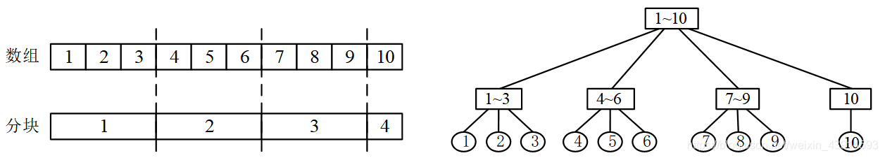

author: Ir1d, HeRaNO, Xeonacid

## 简介

其实，分块是一种思想，而不是一种数据结构。

从 NOIP 到 NOI 到 IOI，各种难度的分块思想都有出现。

回顾“区间”问题，前面给出了暴力法、树状数组、线段树等算法。给定一个保存n个数据的数列，做m次“区间修改”和“区间查询”，每次操作只涉及到部分区间。暴力法只是简单地从整体上做修改和查询，复杂度O(mn)，很低效。树状数组和线段树都用到了二分的思想，以O(logn)的复杂度组织数据结构，每次只处理涉及到的区间，从而实现了O(mlogn)的高效的复杂度。

虽然暴力法只能解决小规模的问题，但是它的代码非常简单。

有一种代码比树状数组、线段树简单，效率比暴力法高的算法，称为“分块”，它能以𝑂(𝑚√𝑛)的复杂度解决“区间修改+区间查询”问题。简单地说，分块是用线段树的“分区”思想改良的暴力法；它把数列分成很多“块”，对涉及到的块做整体性的维护操作（类似于线段树的lazy-tag），而不是像普通暴力法那样处理整个数列，从而提高了效率。

用一个长度为n的数组来存储n个数据，把它分为t块，每块长度为n/t。下图是一个有10个元素的数组，共分成4块，前3块每块3个元素，最后一块1个元素。



(1)分块          (2)与线段树的结构对比

对比块状数组与线段树，线段树是一棵高度为logn的树，块状数组可以看成一棵高度为3的树。从图可知，在线段树上做一次操作是O(logn)的，因为它有logn层；分块是O(n/t)的，因为它把数据分成了t块，处理一块的时间是n/t的。下面介绍分块算法，并详细说明复杂度。

分块的基本思想是，通过对原数据的适当划分，并在划分后的每一个块上预处理部分信息，从而较一般的暴力算法取得更优的时间复杂度。

分块的时间复杂度主要取决于分块的块长，一般可以通过均值不等式求出某个问题下的最优块长，以及相应的时间复杂度。

分块是一种很灵活的思想，相较于树状数组和线段树，分块的优点是通用性更好，可以维护很多树状数组和线段树无法维护的信息。

当然，分块的缺点是渐进意义的复杂度，相较于线段树和树状数组不够好。

不过在大多数问题上，分块仍然是解决这些问题的一个不错选择。

## 分块算法

块操作的基本要素有：

1. 块的大小。用block表示。
2. 块的数量。用t表示。
3. 块的左右边界。定义数组st\[\]、ed\[\]，用st\[i\]、ed\[i\]表示块i的第一个和最后一个元素的位置。st\[1\] = 1，ed\[1\] = block；st\[2\] = block+1，ed\[2\] = 2×block；...；st\[i\] = (i-1)\*block+1，ed\[i\] = i\*block；...
4. 每个元素所属的块。定义pos\[\]，pos\[i\]表示第i个元素所在的块，pos\[i\]=(i-1)/block + 1。

具体内容见下面的代码。其中每块的大小block的值等于𝑛√n取整，后面的“复杂度分析”会说明原因。如果𝑛√n的结果不是整数，那么最后要加上一小块，代码中重要的内容是处理这个问题。

```cpp
int block = sqrt(n);          //块的大小：每块有block个元素。
int t = n/block;              //块的数量：共分为t块
if(n % block) t++;            //sqrt(n)的结果不是整数，最后加一小块
for(int i=1; i<=t; i++){      //遍历块
    st[i] = (i-1)*block+1;
    ed[i] = i*block;
}
ed[t] = n;                    //sqrt(n)的结果不是整数，最后一块较小
for(int i=1; i<=n; i++)       //遍历所有元素的位置
    pos[i]=(i-1)/block + 1;
```

用分块解决区间问题很方便，下面以“区间修改+区间查询”（洛谷P3372）为例。

首先定义区间有关的辅助数组：
（1）定义数组a\[\]存储数据，共n个元素，读取初值，存储在`a[1]、a[2]、...、a[n]`中。
（2）定义sum\[\]，sum\[i\]为第i块的区间和，并预处理出初值。

```cpp
for(int i=1; i<=t; i++)                 //遍历所有的块
    for(int j=st[i]; j<=ed[i];j++)      //遍历块i内的所有元素
        sum[i] += a[j];
```

（3）定义add\[\]，add\[i\]为第i块的增量标记，初始值为0。

然后对数列a\[\]做“区间修改+区间查询”操作：

（1）区间修改：将区间\[L, R\]内每个数加上d。

情况1，\[L, R\]在某个i块之内，即\[L, R\]是一个“碎片”。把`a[L]、a[L+1]、...、a[R]`逐个加上d，更新sum\[i\] = sum\[i\] + d\*(R - L + 1)。计算次数约为n/t。

情况2，\[L, R\]跨越了多个块。在被\[L, R\]完全包含的那些整块内（设有k个块），更新add\[i\] = add\[i\] + d。对于不能完全包含的那些碎片（它们在k个整块的两头），按情况1处理。情况2的计算次数约为n/t + k，1 ≤ k ≤ t。

总结两种情况，处理碎块时，只更新sum\[i\]，不更新add\[i\]；处理整块时，只更新add\[i\]，不更新sum\[i\]。

```cpp
void change(int L,int R,int d){
    int p = pos[L], q = pos[R];
    if(p==q){                      //情况1，计算次数是n/t
       for(int i=L;i<=R;i++)  a[i]+=d;
       sum[p]+=d*(R-L+1);
    }
    else{                          //情况2
       for(int i=p+1;i<=q-1;i++)    add[i]+=d; //整块，有m=(q-1)-(p+1)+1个。计算m次
       for(int i=L;i<=ed[p];i++)    a[i]+=d;   //整块前面的碎片。计算n/t次
       sum[p]+=d*(ed[p]-L+1);
       for( int i=st[q];i<=R;i++)   a[i]+=d;   //整块后面的碎片。计算n/t次
       sum[q]+=d*(R-st[q]+1);
    }
}
```

（2）区间查询：输出区间\[L, R\]内每个数的和。

情况1，\[L, R\]在某个i块之内。暴力加每个数，最后加上add\[i\]，答案是`ans = a[L] + a[L+1] + ... + a[R] + (R - L + 1)*add[i]`。计算次数约为n/t。

情况2，\[L, R\]跨越了多个块。在被\[L, R\]完全包含的那些块内（设有k个块），`ans += sum[i] + add[i]len[i]`，其中len\[i\]是第i段的长度，等于n/t。对于不能完全包含的那些碎片，按情况1处理，然后与ans累加。计算次数约为n/t + k，1 ≤ k ≤ t。

```cpp
long long ask(int L,int R) {
    int p=pos[L],q=pos[R];
    long long ans=0;
    if(p==q){                    //情况1
       for(int i=L;i<=R;i++)     ans += a[i];
       ans+=add[p]*(R-L+1);
    }
    else{//情况2
       for(int i=p+1;i<=q-1;i++)  ans+=sum[i]+add[i]*(ed[i]-st[i]+1);//整块
       for(int i=L;i<=ed[p];i++)  ans += a[i];   //整块前面的碎片
       ans += add[p]*(ed[p]-L+1);
       for(int i=st[q];i<=R;i++)  ans += a[i];   //整块后面的碎片
       ans += add[q]*(R-st[q]+1);
    }
    return ans;
}
```

分块算法的实现简单粗暴，没有复杂数据结构和复杂逻辑，很容易编码。

分块算法的思想，可以概况为“整块打包维护，碎片逐个枚举。

## 复杂度分析

把数列分为t块，t取何值时有最佳效果？

观察一次操作的计算次数n/t和n/t + k，其中1 ≤ k ≤ t；当t = sqrt(n)时，有较好的时间复杂度O(sqrt(n))。m次操作的复杂度是𝑂(𝑚√𝑛)。

空间复杂度：需要分配长度为 的数组st\[\]、ed\[\]、sum\[\]、add\[\]和长度为n的pos\[\]、a\[\]，约3\*MAXN，比线段树的9\*MAXN好得多。不过，分块只能解决m = n = 10^5^规模的问题，而线段树是10^6^规模的，应用场景不同，直接对比空间无意义。

## 例题

???+note "[教主的魔法](https://www.luogu.com.cn/problem/P2801)"
    **题目描述：** 有N个数，有两种操作，区间修改（加）、区间询问。
    
    **输入：** 第1行有两个整数n、m。第2行有n个正整数。第3行到第m + 2行，每行是一个操作，有两种操作：
    
    （1）第一个字母是“M”，后面三个数字L、R、W，表示对闭区间[L, R]内每个数加上W。
    
    （2）第一个字幕是A，后面三个数字L、R、C，询问闭区间[L, R]内有多少数字大于等于C。
    
    **输出：** 对每个“A”询问输出一行，包含一个整数，表示大于等于C的数有多少个。
    数据范围：n ≤ 1,000,000，m ≤ 3000，1 ≤ W≤ 1000，1 ≤ C ≤1,000,000,000

???+note "解题思路"
    如果用复杂度O(mn)的算法，不能通过测试。
    
    询问区间\[L, R\]有多少数字大于等于C，等同于问C是区间第几大，即“区间第k大”问题，标准解法是主席树，m次操作的复杂度是O(mlogn)。
    
    本题的n较小，用“分块 + 二分”算法，复杂度满足要求，而且代码很容易写。容易想到以下分块操作方法：
    
    （1）首先读取数列a\[\]，把它分为√n块。
    
    （2）区间修改。每个块维护一个add标记，用于记录块内的增量W；更新时，区间内的整块更新add，不完整的碎片，暴力更新其中的每个数。
    
    （3）区间查询。大于等于C的数有多少？如果直接暴力搜每个块，复杂度为O(n)，不能满足要求。如果块中的数是有序的，那么用二分来找大于C的数，复杂度为O(logn)。但是块内的数是无序的，需要先排序再用二分（可以直接用lower_bound()函数），复杂度O(nlogn + logn)，还不如直接暴力搜。如果能“一次排序，多次使用”，就高效了。
    
    下面是改进后的算法。
    
    （1）在区间操作前，对每个块的初始值排序，复杂度O(nlogn)。不过，排序会改变原来元素的位置，所以定义一个辅助数组b\[\]，它的初值是数列a\[\]的复制，排序操作在b\[\]上进行。也就是说，b[]的每个块内部都是有序的，对b[]的某个块统计前k个数，就是对a[]的对应块统计前k个数。
    
    （2）区间修改。如果是整块，维护add标记，不用在b\[\]上对整块再排序，因为它仍然保持有序；如果是碎片，暴力修改a\[\]上对应位置的数，然后把碎片所在的整块复制到b\[\]上，对这个块重新排序。复杂度 = 整块维护 + 碎片排序 = O(√𝑛+√𝑛𝑙𝑜𝑔(√𝑛)。
    
    （3）区间查询。对整块，因为已经是有序的，直接在b\[\]的对应整块上二分查询；对碎块，暴力搜a\[\]上的碎块。复杂度 = 整块查询 + 碎片查询 = O(√𝑛𝑙𝑜𝑔(√𝑛)+√𝑛)。
    
    做m次区间操作，以上三者相加，总复杂度是𝑂(𝑛𝑙𝑜𝑔𝑛)+𝑂(𝑚(√𝑛+√𝑛𝑙𝑜𝑔(√𝑛))≈𝑂(𝑚√𝑛𝑙𝑜𝑔(√𝑛))。勉强通过测试。

???+note "[Argestes and Sequence](https://vjudge.net/problem/HDU-5057)"
    **题目描述：** 给定一个序列，有n个非负整数`a[1], a[2],..., a[n]`。做“单点修改 + 区间查询”操作。
    
    **输入：** 第一行是整数T，表示测试用例数量。对每个测试，第一行包含两个数字n、m。第二行是n个非负整数，用空格分割，后面有m行，每行表示一个操作，有两种操作：
    
    S X Y: 修改操作，把a\[x\]的值置为y，即a\[x\] = y；
    
    Q L R D P: 查询操作，询问区间\[L, R\]内有多少个数的第D位是P。
    
    **输出：** 对每个Q询问，输出一行答案。
    数据范围：1 ≤ T ≤ 50，1 ≤ n, m ≤ 100000，0 ≤ a[i] ≤ 231231-1，1 ≤ X ≤ n，0 ≤ Y ≤ 2^31^-1，1 ≤ L ≤ R ≤ n，1 ≤ D ≤ 10，0 ≤ P ≤ 9

???+note "解题思路"
    首先试试分块，看复杂度是否符合要求。
    
    用分块编码非常容易。把数组分为√n块，然后定义block\[i\]\[D\]\[P\]，表示第i块第D位是P 的总个数。
    
    （1）初始化。读取数组a\[\]的初值，根据a\[\]计算出block\[\]\[\]\[\]的初值。复杂度O(n)。
    
    （2）修改操作。单点修改a\[x\]，根据a\[x\]更新block\[\]\[\]\[\]。复杂度O(1)。
    
    （3）查询操作。在碎片上，暴力计算\[L, R\]内的每个a\[\]。在整块上，累加所有整块的block\[\]\[\]\[\]即可。复杂度 = 整块的计算 + 碎片的计算 = O(√n) + O(√n) = O(√n)。
    
    总复杂度 = 初始化 + m个操作 = O(n) + O(m√n)，勉强通过测试。
    
    此题也可以用树状数组，并且这是一道练习树状数组的好题。树状数组的基础功能是“单点修改 + 区间查询”，符合本题的要求。
    
    一个数据最多有D = 10位，每位有P = 0~9这10个数，所以询问共有D\*P = 10\*10 = 100种情况。
    
    如果所有的操作只涉及一种情况，用树状数组很容易编程。例如所有的a\[i\]都只有1位，这1位要么是0，要么是1，然后询问区间\[L, R\]内有多少个1。这是最基本的树状数组。
    
    但是，如果100种情况都用树状数组来处理，需要定义的树状数组是`int tree[10][10][100000]`，需要40M空间，超内存。所以必须把tree减少一维，即`int tree[10][100000]`，此时需要用离线操作的技巧。
    
    （1）先读取并保存所有的修改和查询操作。 
    
    （2）“用时间换空间”，分10次处理所有的操作，第1次处理第1位，第2次处理第2位，...等等。每次处理用`int tree[10][100000]`，分别处理0~9这10个数；这相当于使用了10个树状数组`tree[10][100000]`。记录查询操作的结果。
    
    （3）按顺序输出查询的结果。
    
    计算复杂度是多少？上面的步骤，等于做了10次O(mlogn)的树状数组，注意不是做了100次，请思考原因。树状数组的效率比分块高很多，不过编码的难度要高很多倍。

???+note "[弹飞绵羊](https://www.luogu.com.cn/problem/P3203)"
    **题目描述：** 一条直线上摆着n个弹簧，每个弹簧有弹力系数ki，当绵羊到第i个弹簧时，它会被弹到第i+ki个位置，若不存在第i+ki个弹簧，则绵羊被弹飞。
    
    绵羊想知道当它从第i个弹簧起步时，被弹几次后会被弹飞。为了使游戏有趣，允许修改某个弹簧的弹力。弹力系数始终为正。
    
    **输入：** 第一行包含一个整数n，表示地上有n个装置，编号0~n-1。接下来有n个正整数，依次为n个弹簧的初始弹力系数。第三行有一个正整数m，表示操作次数。接下来m行每行至少有两个数i，j。
    
    若i=1，你要输出从j出发被弹几次后弹飞。
    
    若i=2，则再输入一个正整数k，表示第j个弹簧的弹力系数被改成k。
    
    **输出：** 对每个i=1的操作，输出一行一个整数表示答案。
    数据范围：1 ≤ n ≤ 2×10^5^，1 ≤ m ≤ 10^5^。

???+note "解题思路"
    本题是“单点修改+单点查询”，如果用暴力法，每次查询是O(n)的，m次操作，总复杂度O(mn)，超时。本题的标准解法是动态树LCT，复杂度O(mlogn)。下面用分块求解，编码很简单，复杂度O(m√n)，勉强通过测试。
    
    把整个序列分成√n块，对于每个点i，维护两个值：step\[i\]表示绵羊从第i个点弹出它所在的块所需要的次数、to\[i\]表示从第i个点所在的块弹出后落到其他块的点。先预处理初始值，复杂度O(n)。
    
    单点查询。从起点出发，根据to\[\]找到下一个点（这个点在其他块里），累加这个过程中所有的step[]即得到总次数，大于n的时候跳出。最多经过√n个块，每块计算一次，复杂度O(√n)。
    
    单点修改。step\[i\]和to\[i\]只与i所在的块有关，与其他块无关，所以单点修改只需要维护一个块，复杂度O(√n)。

## (以下为OIWiki 版本)区间和

??? " 例题 [LibreOJ 6280 数列分块入门 4](https://loj.ac/problem/6280)"
    给定一个长度为 $n$ 的序列 $\{a_i\}$，需要执行 $n$ 次操作。操作分为两种：
    
    1.  给 $a_l \sim a_r$ 之间的所有数加上 $x$；
    2.  求 $\sum_{i=l}^r a_i$。
    
        $1 \leq n \leq 5 \times 10^4$

我们将序列按每 $s$ 个元素一块进行分块，并记录每块的区间和 $b_i$。

$$
\underbrace{a_1, a_2, \ldots, a_s}_{b_1}, \underbrace{a_{s+1}, \ldots, a_{2s}}_{b_2}, \dots, \underbrace{a_{(s-1) \times s+1}, \dots, a_n}_{b_{\frac{n}{s}}}
$$

最后一个块可能是不完整的（因为 $n$ 很可能不是 $s$ 的倍数），但是这对于我们的讨论来说并没有太大影响。

首先看查询操作：

-   若 $l$ 和 $r$ 在同一个块内，直接暴力求和即可，因为块长为 $s$，因此最坏复杂度为 $O(s)$。
-   若 $l$ 和 $r$ 不在同一个块内，则答案由三部分组成：以 $l$ 开头的不完整块，中间几个完整块，以 $r$ 结尾的不完整块。对于不完整的块，仍然采用上面暴力计算的方法，对于完整块，则直接利用已经求出的 $b_i$ 求和即可。这种情况下，最坏复杂度为 $O(\dfrac{n}{s}+s)$。

接下来是修改操作：

-   若 $l$ 和 $r$ 在同一个块内，直接暴力修改即可，因为块长为 $s$，因此最坏复杂度为 $O(s)$。
-   若 $l$ 和 $r$ 不在同一个块内，则需要修改三部分：以 $l$ 开头的不完整块，中间几个完整块，以 $r$ 结尾的不完整块。对于不完整的块，仍然是暴力修改每个元素的值（别忘了更新区间和 $b_i$），对于完整块，则直接修改 $b_i$ 即可。这种情况下，最坏复杂度和仍然为 $O(\dfrac{n}{s}+s)$。

利用均值不等式可知，当 $\dfrac{n}{s}=s$，即 $s=\sqrt n$ 时，单次操作的时间复杂度最优，为 $O(\sqrt n)$。

??? note "参考代码"
    ```cpp
    --8<-- "docs/ds/code/decompose/decompose_1.cpp"
    ```

## 区间和 2

上一个做法的复杂度是 $\Omega(1) , O(\sqrt{n})$。

我们在这里介绍一种 $O(\sqrt{n}) - O(1)$ 的算法。

为了 $O(1)$ 询问，我们可以维护各种前缀和。

然而在有修改的情况下，不方便维护，只能维护单个块内的前缀和。

以及整块作为一个单位的前缀和。

每次修改 $O(T+\frac{n}{T})$。

询问：涉及三部分，每部分都可以直接通过前缀和得到，时间复杂度 $O(1)$。

## 对询问分块

同样的问题，现在序列长度为 $n$，有 $m$ 个操作。

如果操作数量比较少，我们可以把操作记下来，在询问的时候加上这些操作的影响。

假设最多记录 $T$ 个操作，则修改 $O(1)$，询问 $O(T)$。

$T$ 个操作之后，重新计算前缀和，$O(n)$。

总复杂度：$O(mT+n\frac{m}{T})$。

$T=\sqrt{n}$ 时，总复杂度 $O(m \sqrt{n})$。

### 其他问题

分块思想也可以应用于其他整数相关问题：寻找零元素的数量、寻找第一个非零元素、计算满足某个性质的元素个数等等。

还有一些问题可以通过分块来解决，例如维护一组允许添加或删除数字的集合，检查一个数是否属于这个集合，以及查找第 $k$ 大的数。要解决这个问题，必须将数字按递增顺序存储，并分割成多个块，每个块中包含 $\sqrt{n}$ 个数字。每次添加或删除一个数字时，必须通过在相邻块的边界移动数字来重新分块。

一种很有名的离线算法 [莫队算法](../misc/mo-algo.md)，也是基于分块思想实现的。

## 练习题

-   [UVA - 12003 - Array Transformer](https://uva.onlinejudge.org/index.php?option=com_onlinejudge&Itemid=8&page=show_problem&problem=3154)
-   [UVA - 11990 Dynamic Inversion](https://uva.onlinejudge.org/index.php?option=com_onlinejudge&Itemid=8&page=show_problem&problem=3141)
-   [SPOJ - Give Away](http://www.spoj.com/problems/GIVEAWAY/)
-   [Codeforces - Till I Collapse](http://codeforces.com/contest/786/problem/C)
-   [Codeforces - Destiny](http://codeforces.com/contest/840/problem/D)
-   [Codeforces - Holes](http://codeforces.com/contest/13/problem/E)
-   [Codeforces - XOR and Favorite Number](https://codeforces.com/problemset/problem/617/E)
-   [Codeforces - Powerful array](http://codeforces.com/problemset/problem/86/D)
-   [SPOJ - DQUERY](https://www.spoj.com/problems/DQUERY)

    **本页面主要译自博文 [Sqrt-декомпозиция](http://e-maxx.ru/algo/sqrt_decomposition) 与其英文翻译版 [Sqrt Decomposition](https://cp-algorithms.com/data_structures/sqrt_decomposition.html)。其中俄文版版权协议为 Public Domain + Leave a Link；英文版版权协议为 CC-BY-SA 4.0。**
