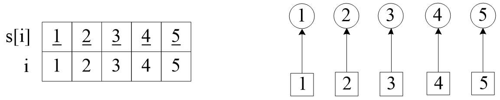
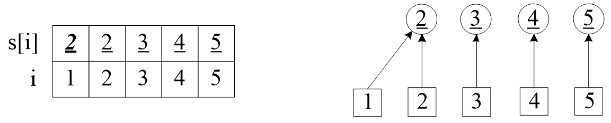
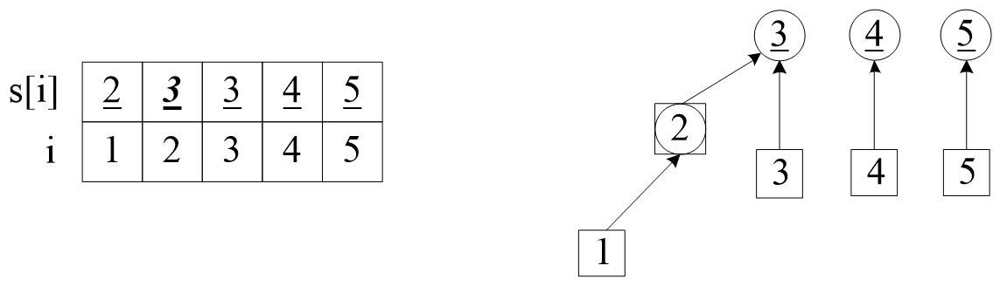
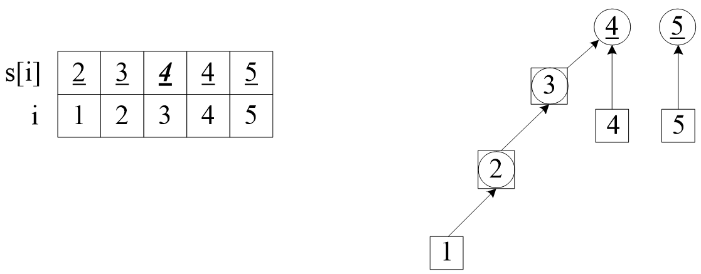
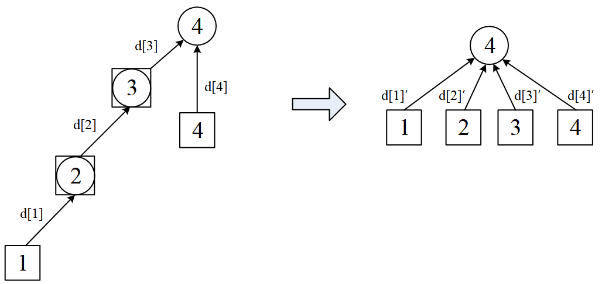

author: HeRaNO, JuicyMio, Xeonacid, sailordiary, ouuan


## 引入

并查集（Disjoint Set）是一种非常精巧而实用的数据结构。并查集是一种用于管理元素所属集合的数据结构，实现为一个森林，其中每棵树表示一个集合，树中的节点表示对应集合中的元素。它主要用于处理一些不相交集合的合并问题。经典的应用有：连通子图、最小生成树Kruskal算法和最近公共祖先（Least Common Ancestors, LCA）等。

并查集在算法竞赛中极为常见。

-   合并（Union）：合并两个元素所属集合（合并对应的树）
-   查询（Find）：查询某个元素所属集合（查询对应的树的根节点），这可以用于判断两个元素是否属于同一集合

通常用“帮派”的例子来说明并查集的应用背景。一个城市中有n个人，他们分成不同的帮派；给出一些人的关系，例如1号、2号是朋友，1号、3号也是朋友，那么他们都属于一个帮派；在分析完所有的朋友关系之后，问有多少帮派，每人属于哪个帮派。给出的n可能是106的。

读者可以先思考暴力的方法，以及复杂度。如果用并查集实现，不仅代码很简单，而且复杂度可以达到O(logn)。

并查集：将编号分别为1~n的n个对象划分为不相交集合，在每个集合中，选择其中某个元素代表所在集合。在这个集合中，并查集的操作有：初始化、合并、查找。

本文比较全面地介绍了并查集：

1. 并查集的基本操作。顾名思义，并查集支持两种操作：
    - 合并（Union）：合并两个元素所属集合（合并对应的树）
    - 查询（Find）：查询某个元素所属集合（查询对应的树的根节点），这可以用于判断两个元素是否属于同一集合
    - 并查集在经过修改后可以支持单个元素的删除、移动；使用动态开点线段树还可以实现可持久化并查集。
2. 并查集的优化：合并和路径压缩。
3. 带权并查集。

??? warning
    并查集无法以较低复杂度实现集合的分离。

## 并查集的基本操作

1) 初始化。定义数组int s[]是以结点i为元素的并查集。初始时，每个元素都位于一个单独的集合，表示为一棵只有根节点的树。方便起见，我们将根节点的父亲设为自己。例如元素1的集s[1]=1。

???+ note "实现"
    === "C++"
    
        ```cpp
        struct dsu {
          vector<size_t> pa;
    
          explicit dsu(size_t size) : pa(size) { iota(pa.begin(), pa.end(), 0); }
        };
        ```
    
    === "Python"
    
        ```python
        class Dsu:
            def __init__(self, size):
                self.pa = list(range(size))
        ```

下面是图解，左边给出了元素与集合的值，右边画出了逻辑关系。为了便于讲解，左边区分了结点i和集s：把集的编号加上了下划线；右边用圆圈表示集，方块表示元素。



图1 并查集的初始化

2) 合并，例如加入第一个朋友关系(1, 2)。在并查集s中，把结点1合并到结点2，也就是把结点1的集1改成结点2的集2。



图2 合并(1, 2)

要合并两棵树，我们只需要将一棵树的根节点连到另一棵树的根节点。


???+ note "实现"
    === "C++"
    
        ```cpp
        void dsu::unite(size_t x, size_t y) { pa[find(x)] = find(y); }
        ```
    
    === "Python"
    
        ```python
        def union(self, x, y):
            self.pa[self.find(x)] = self.find(y)
        ```

3) 合并，加入第二个朋友关系(1, 3)。查找结点1的集，是2，再递归查找元素2的集是2，然后把元素2的集2合并到结点3的集3。此时，结点1、2、3都属于一个集。右图中，为简化图示，把元素2和集2画在了一起。



图3 合并(1, 3)

4) 合并，加入第三个朋友关系(2, 4)。结果如下，请读者自己分析。



图4 合并(2, 4)

5) 查找。上面步骤中已经有查找操作。查找元素的集，是一个递归的过程，我们需要沿着树向上移动，直至找到根节点，就找到了根结点的集。从上面的图中可以看到，这棵搜索树的高度，可能很大，复杂度是O(n)的，变成了一个链表，出现了树的“退化”现象。 


???+note "实现"
    === "C++"
    
        ```cpp
        size_t dsu::find(size_t x) { return pa[x] == x ? x : find(pa[x]); }
        ```
    
    === "Python"
    
        ```python
        def find(self, x):
            return x if self.pa[x] == x else self.find(self.pa[x])
        ```

6) 统计有多少个集。如果s[i] = i，这是一个根结点，是它所在的集的代表；统计根结点的数量，就是集的数量。

???+note "[How Many Tables](https://vjudge.net/problem/HDU-1213)"
    有n个人一起吃饭，有些人互相认识。认识的人想坐在一起，而不想跟陌生人坐。例如A认识B，B认识C，那么A、B、C会坐在一张桌子上。
    
    给出认识的人，问需要多少张桌子。

???+note 参考代码
    一张桌子是一个集，合并朋友关系，然后统计集的数量即可。下面的代码是并查集操作的具体实现。

    ```cpp
    #include <bits/stdc++.h>
    using namespace std;
    const int maxn = 1050;
    int s[maxn];
    void init_set(){                 //初始化
    for(int i = 1; i <= maxn; i++)
            s[i] = i;
    }
    int find_set(int x){               //查找
        return x==s[x]? x:find_set(s[x]);
    }
    void merge_set(int x, int y){    //合并
        x = find_set(x);
        y = find_set(y);
        if(x != y) s[x] = s[y];     //把x合并到y上，y的根成为x的根
    }
    int main (){
        int t, n, m, x, y;
        cin >> t;
        while(t--){
            cin >> n >> m;
            init_set();
            for(int i = 1; i <= m; i++){
                cin >> x >> y;
                merge_set(x, y);
            }
            int ans = 0;
            for(int i = 1; i <= n; i++)   //统计有多少个集
                if(s[i] == i)
                    ans++;
            cout << ans <<endl;
        }
        return 0;
    }
    ```

    复杂度：上述程序，查找find_set()、合并merge_set()的搜索深度是树的长度，复杂度都是O(n)，性能比较差。下面介绍合并和查询的优化方法，优化之后，查找和合并的复杂度都小于O(logn)。

### 路径压缩

查询过程中经过的每个元素都属于该集合，我们可以将其直接连到根节点以加快后续查询。

这个方法称为路径压缩，因为整个搜索路径上的元素，在递归过程中，从元素i到根结点的所有元素，它们所属的集都被改为根结点。路径压缩不仅优化了下次查询，而且也优化了合并，因为合并时也用到了查询。


???+note "实现"
    === "递归"
        ```cpp
        int find_set(int x){
            if(x != s[x]) 
            s[x] = find_set(s[x]);   //路径压缩
            return s[x];
        }
        ```
    === "非递归"
        ```cpp
        int find_set(int x){
            int r = x;
            while ( s[r] != r ) r=s[r];  //找到根结点
            int i = x, j;
            while(i != r){         
                j = s[i];     //用临时变量j记录
                s[i]= r ;     //把路径上元素的集改为根结点
                i = j;
            }
            return r;
        }
        ```

???+note "另一种实现"
    === "C++"
    
        ```cpp
        size_t dsu::find(size_t x) { return pa[x] == x ? x : pa[x] = find(pa[x]); }
        ```
    
    === "Python"
    
        ```python
        def find(self, x):
            if self.pa[x] != x:
                self.pa[x] = self.find(self.pa[x])
            return self.pa[x]
        ```

### 合并优化

合并元素x和y时，先搜到它们的根结点，然后再合并这两个根结点，即把一个根结点的集改成另一个根结点。这两个根结点的高度不同，如果把高度较小的集合并到较大的集上，能减少树的高度。下面是优化后的代码，在初始化时用height[i]定义元素i的高度，在合并时更改。

```cpp
int height[maxn];
void init_set(){
   for(int i = 1; i <= maxn; i++){
        s[i] = i;
        height[i]=0;                     //树的高度
   }
}
void merge_set(int x, int y){         //优化合并操作
    x = find_set(x);
    y = find_set(y);
    if (height[x] == height[y]) {
        height[x] = height[x] + 1;      //合并，树的高度加一
        s[y] = x;       
    }
    else{                            //把矮树并到高树上，高树的高度保持不变
        if (height[x] < height[y])  s[x] = y;
        else   s[y] = x;
    }
}
```

### 启发式合并

合并时，选择哪棵树的根节点作为新树的根节点会影响未来操作的复杂度。我们可以将节点较少或深度较小的树连到另一棵，以免发生退化。

??? note "具体复杂度讨论"
    由于需要我们支持的只有集合的合并、查询操作，当我们需要将两个集合合二为一时，无论将哪一个集合连接到另一个集合的下面，都能得到正确的结果。但不同的连接方法存在时间复杂度的差异。具体来说，如果我们将一棵点数与深度都较小的集合树连接到一棵更大的集合树下，显然相比于另一种连接方案，接下来执行查找操作的用时更小（也会带来更优的最坏时间复杂度）。
    
    当然，我们不总能遇到恰好如上所述的集合——点数与深度都更小。鉴于点数与深度这两个特征都很容易维护，我们常常从中择一，作为估价函数。而无论选择哪一个，时间复杂度都为 $O (m\alpha(m,n))$，具体的证明可参见 References 中引用的论文。
    
    在算法竞赛的实际代码中，即便不使用启发式合并，代码也往往能够在规定时间内完成任务。在 Tarjan 的论文 \[1] 中，证明了不使用启发式合并、只使用路径压缩的最坏时间复杂度是 $O (m \log n)$。在姚期智的论文 \[2] 中，证明了不使用启发式合并、只使用路径压缩，在平均情况下，时间复杂度依然是 $O (m\alpha(m,n))$。
    
    如果只使用启发式合并，而不使用路径压缩，时间复杂度为 $O(m\log n)$。由于路径压缩单次合并可能造成大量修改，有时路径压缩并不适合使用。例如，在可持久化并查集、线段树分治 + 并查集中，一般使用只启发式合并的并查集。

按节点数合并的参考实现：

???+ note "实现"
    === "C++"
    
        ```cpp
        struct dsu {
          vector<size_t> pa, size;
    
          explicit dsu(size_t size_) : pa(size_), size(size_, 1) {
            iota(pa.begin(), pa.end(), 0);
          }
    
          void unite(size_t x, size_t y) {
            x = find(x), y = find(y);
            if (x == y) return;
            if (size[x] < size[y]) swap(x, y);
            pa[y] = x;
            size[x] += size[y];
          }
        };
        ```
    
    === "Python"
    
        ```python
        class Dsu:
            def __init__(self, size):
                self.pa = list(range(size))
                self.size = [1] * size
    
            def union(self, x, y):
                x, y = self.find(x), self.find(y)
                if x == y:
                    return
                if self.size[x] < self.size[y]:
                    x, y = y, x
                self.pa[y] = x
                self.size[x] += self.size[y]
        ```

### 删除

要删除一个叶子节点，我们可以将其父亲设为自己。为了保证要删除的元素都是叶子，我们可以预先为每个节点制作副本，并将其副本作为父亲。

???+ note "实现"
    === "C++"
    
        ```cpp
        struct dsu {
          vector<size_t> pa, size;
    
          explicit dsu(size_t size_) : pa(size_ * 2), size(size_ * 2, 1) {
            iota(pa.begin(), pa.begin() + size_, size_);
            iota(pa.begin() + size_, pa.end(), size_);
          }
    
          void erase(size_t x) {
            --size[find(x)];
            pa[x] = x;
          }
        };
        ```
    
    === "Python"
    
        ```python
        class Dsu:
            def __init__(self, size):
                self.pa = list(range(size, size * 2)) * 2
                self.size = [1] * size * 2
    
            def erase(self, x):
                self.size[self.find(x)] -= 1
                self.pa[x] = x
        ```

### 移动

与删除类似，通过以副本作为父亲，保证要移动的元素都是叶子。

???+ note "实现"
    === "C++"
    
        ```cpp
        void dsu::move(size_t x, size_t y) {
          auto fx = find(x), fy = find(y);
          if (fx == fy) return;
          pa[x] = fy;
          --size[fx], ++size[fy];
        }
        ```
    
    === "Python"
    
        ```python
        def move(self, x, y):
            fx, fy = self.find(x), self.find(y)
            if fx == fy:
                return
            self.pa[x] = fy
            self.size[fx] -= 1
            self.size[fy] += 1
        ```

## 复杂度

### 时间复杂度

同时使用路径压缩和启发式合并之后，并查集的每个操作平均时间仅为 $O(\alpha(n))$，其中 $\alpha$ 为阿克曼函数的反函数，其增长极其缓慢，也就是说其单次操作的平均运行时间可以认为是一个很小的常数。

[Ackermann 函数](https://en.wikipedia.org/wiki/Ackermann_function)  $A(m, n)$ 的定义是这样的：

$A(m, n) = \begin{cases}n+1&\text{if }m=0\\A(m-1,1)&\text{if }m>0\text{ and }n=0\\A(m-1,A(m,n-1))&\text{otherwise}\end{cases}$

而反 Ackermann 函数 $\alpha(n)$ 的定义是阿克曼函数的反函数，即为最大的整数 $m$ 使得 $A(m, m) \leqslant n$。

时间复杂度的证明 [在这个页面中](./dsu-complexity.md)。

### 空间复杂度

显然为 $O(n)$。

## 带权并查集

前面讲解了并查集的基本应用：处理集合问题。并查集的高效，主要是利用了合并和查询的优化。在这些基本应用中，点之间只有简单的归属关系，而没有权值。如果在点之间加上权值，并查集的应用会更广泛。

如果读者联想到树这种数据结构，会发现，并查集实际上是在维护若干棵树。并查集的合并和查询优化，实际上是在改变树的形状，把原来“细长”的、操作低效的大量“小树”，变成了“粗短”的、操作高效的少量“大树”。如果在原来的“小树”上，点之间有权值，那么经过并查集的优化之变成“大树”后，这些权值的操作也变得高效了。

我们可以在并查集的边上定义某种权值、以及这种权值在路径压缩时产生的运算，从而解决更多的问题。

### 带权值的路径压缩和合并

定义一个权值数组d[]，结点i到父结点的权值为记为d[i]。

1) 带权值的路径压缩

下面的图，是加上权值之后的路径压缩。原来的权值d[]，经过压缩之后，更新为d[]'，例如d[1]'=d[1]+d[2]+d[3]。

需要注意的是，这个例子中，权值是相加的关系，比较简单；在具体的题目的中，可能有相乘、异或等等符合题意的操作。



图6 带权值的路径压缩

相应地，在这个权值相加的例子中，把路径压缩的代码改为：

```cpp
int find_set(int x){
    if(x != s[x]) {
         int t = s[x];            //记录父结点
         s[x] = find_set(s[x]);   //路径压缩。递归最后返回的是根结点
         d[x] += d[t];            //权值更新为x到根节点的权值
     }
     return s[x];
}
```

注意代码中的细节。原来的d[x]是点x到它的父结点的权值，经过路径压缩后，x直接指向根节点，d[x]也更新为x到根结点的权值。这是通过递归实现的。

代码中，先用t记录x的原父结点；在递归过程中，最后返回的是根节点；最后将当前节点的权值加上原父结点的权值（注意：经过递归，此时父结点也直接指向根节点，父结点的权值也已经更新为父结点直接到根结点的权值了），就得到当前节点到根节点的权值。

2) 带权值的合并
在合并操作中，把点x与到点y合并，就是把x的根结点fx合并到y的根结点fy。在fx和fy之间增加权值，这个权值要符合题目的要求。

### 例题

????+note "[How Many Answers Are Wrong](https://vjudge.net/problem/HDU-3038)"
    给出区间[a, b]，区间之和为v。输入m组数据，每输入一组，判断此组条件是否与前面冲突，最后输出与前面冲突的数据的个数。比如先给出[1, 5]区间和为100，再给出区间[1, 2]的和为200，肯定有冲突。

???+note "参考代码"
    本题是本节讲解的带权值并查集的直接应用。如果能想到可以把序列建模为并查集，就能直接套用模板了。

    ```cpp
    #include <bits/stdc++.h>
    using namespace std;
    const int maxn =200010;
    int s[maxn];       //集合
    int d[maxn];       //权值：记录当前结点到根结点的距离
    int ans;
    void init_set(){                  //初始化
    for(int i = 0; i <= maxn; i++)
    {   s[i] = i; d[i] = 0;  }
    }
    int find_set(int x){              //带权值的路径压缩
        if(x != s[x]) {
            int t = s[x];            //记录父结点
            s[x] = find_set(s[x]);   //路径压缩。递归最后返回的是根结点
            d[x] += d[t];            //权值更新为x到根节点的权值
        }
        return s[x];
    }
    void merge_set(int a, int b,int v){    //合并
        int roota = find_set(a), rootb = find_set(b);
        if(roota == rootb){
        if(d[a] - d[b] != v)
            ans++;
        }
        else{
        s[roota] = rootb;    //合并
        d[roota] = d[b]- d[a] + v;
        }
    }
    int main(){
        int n,m;
        while(scanf("%d%d",&n,&m)!=EOF){
            init_set();
            ans = 0;
            while(m--){
                int a,b,v;
                scanf("%d%d%d",&a,&b,&v);
                a--;
                merge_set(a, b, v);
            }
            printf("%d\n",ans);
        }
        return 0;
    }
    ```

???+note "[食物链](http://poj.org/problem?id=1182)"
    动物王国中有三类动物A、B、C，这三类动物的食物链是：A吃B，B吃C，C吃A。
    
    现有N个动物，以1~N编号。每个动物都是A、B、C中的一种，但是我们并不知道它到底是哪一种。
    
    有人用两种说法对这N个动物所构成的食物链关系进行描述：
    
    第一种说法是"1 X Y"，表示X和Y是同类。
    
    第二种说法是"2 X Y"，表示X吃Y。
    
    此人对N个动物，用上述两种说法，一句接一句地说出K句话，这K句话有的是真的，有的是假的。当一句话满足下列三条之一时，这句话就是假话，否则就是真话。

    1. 当前的话与前面的某些真的话冲突，就是假话；
    2. 当前的话中X或Y比N大，就是假话；
    3. 当前的话表示X吃X，就是假话。
    
    你的任务是根据给定的N（1 <= N <= 50,000）和K句话（0 <= K <= 100,000），输出假话的总数。

???+note "解题思路"
    这一题中的权值比较有趣，它不是上一题中相加的关系。把权值d[]记录为两个动物在食物链上的相对关系。下面用d(A->B)表示A、B的关系，d(A->B) = 0表示同类，d(A->B) = 1表示A吃B，d(A->B) = 2表示A被B吃。
    
    这一题难点在权值的更新。考虑三个问题：

    1) 路径压缩时，如何更新权值。
    
    若d(A->B) =1，d(B->C) = 1，求d(A->c)。因为A吃B，B吃C，那么C应该吃A，得d(A->C)=2；
    
    若d(A->B) =2，d(B->C) =2，求d(A->c)。因为B吃A，C吃B，那么A应该吃C，得d(A->C)=1；
    
    若d(A->B) = 0，d(B->C) =1，求d(A->c)。因为A、B同类，B吃C，那么A应该吃C，得d(A->C)=1；
    
    找规律知：d(A->C) = (d(A->B) + d(B->C) ) % 3，因此关系值的更新是累加再模3。
    
    2) 合并时，如何更新权值。本题的权值更新是取模操作，内容见下面的代码。
    3) 如何判断矛盾。如果已知A与根节点的关系，B与根节点的关系，如何求A、B之间的关系？内容见下面的代码。

???+note "参考代码"

    ```cpp
    #include <iostream>
    #include <stdio.h>
    using namespace std;
    const int maxn = 50005;
    int s[maxn];    //集合
    int d[maxn];    // 0：同类； 1：吃； 2：被吃
    int ans;
    void init_set(){                  //初始化
        for(int i = 0; i <= maxn; i++)
        {   s[i] = i; d[i] = 0;  }
    }
    int find_set(int x){              //带权值的路径压缩
        if(x != s[x]) {
            int t = s[x];            //记录父结点
            s[x] = find_set(s[x]);   //路径压缩。递归最后返回的是根结点
            d[x] = (d[x] + d[t]) % 3;     //权值更新为x到根节点的权值
        }
        return s[x];
    }
    void merge_set(int x, int y, int relation){       //合并
        int rootx = find_set(x);
        int rooty = find_set(y);
        if (rootx == rooty){
            if ((relation - 1) != ((d[x] - d[y] + 3) % 3))  //判断矛盾
                    ans++;
        }
        else {
                s[rootx] = rooty;   //合并
                d[rootx] = (d[y] - d[x] + relation  - 1) % 3;   //更新权值
        }
    }
    int main(){
        int n, k;  cin >> n >> k;
        init_set();
        ans = 0;
        while (k--){
            int relation, x, y;
            scanf("%d%d%d",&relation,&x,&y);
            if ( x > n || y > n || (relation == 2 && x == y ) )
                ans++;
            else
                merge_set(x,y,relation);
        }
        cout << ans;
        return 0;
    }
    ```

???+ note "[UVA11987 Almost Union-Find](https://www.luogu.com.cn/problem/UVA11987)"
    实现类似并查集的数据结构，支持以下操作：
    
    1.  合并两个元素所属集合
    2.  移动单个元素
    3.  查询某个元素所属集合的大小及元素和
    
    ??? note "参考代码"
        === "C++"
        
            ```cpp
            --8<-- "docs/ds/code/dsu/dsu_1.cpp"
            ```
        
        === "Python"
        
            ```python
            --8<-- "docs/ds/code/dsu/dsu_1.py"
            ```

## 习题

- [「NOI2015」程序自动分析](https://uoj.ac/problem/127)
- [「JSOI2008」星球大战](https://www.luogu.com.cn/problem/P1197)
- [「NOI2001」食物链](https://www.luogu.com.cn/problem/P2024)
- [「NOI2002」银河英雄传说](https://www.luogu.com.cn/problem/P1196)
- [poj 2524 Ubiquitous Religions](http://poj.org/problem?id=2524)
- [poj 1611 The Suspects](http://poj.org/problem?id=1611)
- [poj 1703 Find them, Catch them](http://poj.org/problem?id=1703)
- [poj 2236 Wireless Network](http://poj.org/problem?id=2236)
- [poj 2492 A Bug's Life](http://poj.org/problem?id=2492)
- [poj 1988 Cube Stacking](http://poj.org/problem?id=1988)
- [poj 1182食物链](http://poj.org/problem?id=1182)
- [hdu 3635 Dragon Balls](https://vjudge.net/problem/HDU-3635)
- [hdu 1856 More is better](https://vjudge.net/problem/HDU-1856)
- [hdu 1272 小希的迷宫](https://vjudge.net/problem/HDU-1272)
- [hdu 1325 Is It A Tree](https://vjudge.net/problem/HDU-1325)
- [hdu 1198 Farm Irrigation](https://vjudge.net/problem/HDU-1198)
- [hdu 2586 How far away](https://vjudge.net/problem/HDU-2586)
- [hdu 6109 数据分割](https://vjudge.net/problem/HDU-6109)
- [Marked Ancestor](https://judge.u-aizu.ac.jp/onlinejudge/description.jsp?id=2170)

## 其他应用

[最小生成树算法](../graph/mst.md) 中的 Kruskal 和 [最近公共祖先](../graph/lca.md) 中的 Tarjan 算法是基于并查集的算法。

相关专题见 [并查集应用](./dsu-app.md)。

## 参考资料与拓展阅读

-   \[1]Tarjan, R. E., & Van Leeuwen, J. (1984). Worst-case analysis of set union algorithms. Journal of the ACM (JACM), 31(2), 245-281.[ResearchGate PDF](https://www.researchgate.net/profile/Jan_Van_Leeuwen2/publication/220430653_Worst-case_Analysis_of_Set_Union_Algorithms/links/0a85e53cd28bfdf5eb000000/Worst-case-Analysis-of-Set-Union-Algorithms.pdf)
-   \[2]Yao, A. C. (1985). On the expected performance of path compression algorithms.[SIAM Journal on Computing, 14(1), 129-133.](https://epubs.siam.org/doi/abs/10.1137/0214010?journalCode=smjcat)
-   \[3][知乎回答：是否在并查集中真的有二分路径压缩优化？](https://www.zhihu.com/question/28410263/answer/40966441)
-   \[4]Gabow, H. N., & Tarjan, R. E. (1985). A Linear-Time Algorithm for a Special Case of Disjoint Set Union. JOURNAL OF COMPUTER AND SYSTEM SCIENCES, 30, 209-221.[PDF](https://dl.acm.org/doi/pdf/10.1145/800061.808753)
