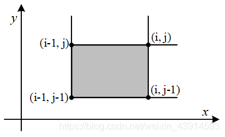
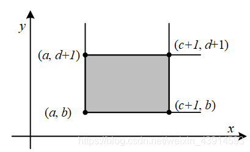

author: HeRaNO, Zhoier, Ir1d, Xeonacid, wangdehu, ouuan, ranwen, ananbaobeichicun, Ycrpro, dbxxx-oi

## 引入

树状数组、线段树这两种数据结构用来解决一个常见的应用问题：高效率地查询和维护前缀和(或者区间和)。

所谓查询前缀和，即给出长度为n的数列𝐴=𝑎1,𝑎2,...,𝑎𝑛和一个查询𝑥≤𝑛，求𝑠𝑢𝑚(𝑥)=𝑎1+...+𝑎𝑥。区间\[i, j\]的和可以通过前缀和求得：𝑎𝑖+...+𝑎𝑗=𝑠𝑢𝑚(𝑗)−𝑠𝑢𝑚(𝑖−1)。

如果数列𝐴是静态不变的，代码很好写，预处理前缀和就好了，一次预处理的复杂度是O(n)的，然后每次查询都是O(1)的。但是，如果序列是动态变化的，例如改变其中一个元素𝑎𝑘的值，那么它后面的前缀和都会改变，需要重新计算，如果每次查询前元素都有变化，那么一次查询的的复杂度就变成了O(n)。

有两种数据结构可以高效地处理这个问题：树状数组、线段树。它们实现的两个功能：查询前缀和、修改元素值，复杂度都是𝑂(𝑙𝑜𝑔𝑛)的。

在学习线段树和树状数组之前，读者可以自己思考如何实现用𝑂(𝑙𝑜𝑔𝑛)的复杂度实现查询和维护前缀和。思路并不难得到，根据二分法或者分治法，把整个数列分为两半，然后每部分再继续分为两半......这样一来，查询和修改都能以𝑂(𝑙𝑜𝑔𝑛)的复杂度得到解决。这就是线段树和树状数组的基本思路，线段树差不多重现了这个思路，而树状数组借助一个神奇的𝑙𝑜𝑤𝑏𝑖𝑡()操作来简洁地实现。线段树的编码要更复杂一些，但是也更通用。

树状数组和线段树具有相似的功能，但他俩毕竟还有一些区别：树状数组能有的操作，线段树一定有；线段树有的操作，树状数组不一定有。树状数组只能处理具有逆运算的运算，例如加、减、异或运算，不能处理类似于求最大值、最小值的运算（实际上使用两个树状数组可以用于处理最大、小值的问题，见 [Efficient Range Minimum Queries using Binary Indexed Trees](http://history.ioinformatics.org/oi/files/volume9.pdf#page=41)）。但是树状数组的代码要比线段树短，思维更清晰，速度也更快，在解决一些单点修改的问题时，树状数组是不二之选。

树状数组是一种支持 **单点修改** 和 **区间查询** 的，代码量小的数据结构。

??? note "什么是「单点修改」和「区间查询」？"
    假设有这样一道题：
    
    已知一个数列 $a$，你需要进行下面两种操作：
    
    -   给定 $x, y$，将 $a[x]$ 自增 $y$。
    -   给定 $l, r$，求解 $a[l \ldots r]$ 的和。
    
    其中第一种操作就是「单点修改」，第二种操作就是「区间查询」。
    
    类似地，还有：「区间修改」、「单点查询」。它们分别的一个例子如下：
    
    -   区间修改：给定 $l, r, x$，将 $a[l \ldots r]$ 中的每个数都分别自增 $x$；
    -   单点查询：给定 $x$，求解 $a[x]$ 的值。
    
    注意到，区间问题一般严格强于单点问题，因为对单点的操作相当于对一个长度为 $1$ 的区间操作。

普通树状数组维护的信息及运算要满足 **结合律** 且 **可差分**，如加法（和）、乘法（积）、异或等。

-   结合律：$(x \circ y) \circ z = x \circ (y \circ z)$，其中 $\circ$ 是一个二元运算符。
-   可差分：具有逆运算的运算，即已知 $x \circ y$ 和 $x$ 可以求出 $y$。

需要注意的是：

-   模意义下的乘法若要可差分，需保证每个数都存在逆元（模数为质数时一定存在）；
-   例如 $\gcd$，$\max$ 这些信息不可差分，所以不能用普通树状数组处理，但是：
    -   使用两个树状数组可以用于处理区间最值，见 [Efficient Range Minimum Queries using Binary Indexed Trees](http://history.ioinformatics.org/oi/files/volume9.pdf#page=41)。
    -   本页面也会介绍一种支持不可差分信息查询的，$\Theta(\log^2n)$ 时间复杂度的拓展树状数组。

事实上，树状数组能解决的问题是线段树能解决的问题的子集：树状数组能做的，线段树一定能做；线段树能做的，树状数组不一定可以。然而，树状数组的代码要远比线段树短，时间效率常数也更小，因此仍有学习价值。

有时，在差分数组和辅助数组的帮助下，树状数组还可解决更强的 **区间加单点值** 和 **区间加区间和** 问题。

本节介绍树状数组的概念和基本代码，然后给出它的经典应用：区间修改+单点查询、区间修改+区间查询、二维区间修改+区间查询、区间最值。

## 树状数组

### 初步感受

先来举个例子：我们想知道 $a[1 \ldots 7]$ 的前缀和，怎么做？

一种做法是：$a_1 + a_2 + a_3 + a_4 + a_5 + a_6 + a_7$，需要求 $7$ 个数的和。

那如果我告诉你三个数 $A$，$B$，$C$，$A = a[1 \ldots 4]$ 的和，$B = a[5 \ldots 6]$ 的总和，$C = a[7 \ldots 7]$ 的总和（其实就是 $a[7]$ 自己）。你会怎么算？你一定会回答：$A + B + C$，只需要求 $3$ 个数的和。

这就是树状数组能快速求解信息的原因：我们总能将一段前缀 $[1, n]$ 拆成 **不多于 $\mathbf{\log n}$ 段区间**，使得这 $\log n$ 段区间的信息是 **已知的**。

于是，我们只需合并这 $\log n$ 段区间的信息，就可以得到答案。相比于原来直接合并 $n$ 个信息，效率有了很大的提高。

不难发现信息必须满足结合律，否则就不能像上面这样合并了。

下面这张图展示了树状数组的工作原理：


最下面的八个方块代表原始数据数组 $a$。上面参差不齐的方块（与最上面的八个方块是同一个数组）代表数组 $a$ 的上级——$c$ 数组。

$c$ 数组就是用来储存原始数组 $a$ 某段区间的和的，也就是说，这些区间的信息是已知的，我们的目标就是把查询前缀拆成这些小区间。

例如，从图中可以看出：

-   $c_2$ 管辖的是 $a[1 \ldots 2]$；
-   $c_4$ 管辖的是 $a[1 \ldots 4]$；
-   $c_6$ 管辖的是 $a[5 \ldots 6]$；
-   $c_8$ 管辖的是 $a[1 \ldots 8]$；
-   剩下的 $c[x]$ 管辖的都是 $a[x]$ 自己（可以看做 $a[x \ldots x]$ 的长度为 $1$ 的小区间）。

不难发现，$c[x]$ 管辖的一定是一段右边界是 $x$ 的区间总信息。我们先不关心左边界，先来感受一下树状数组是如何查询的。

举例：计算 $a[1 \ldots 7]$ 的和。

过程：从 $c_{7}$ 开始往前跳，发现 $c_{7}$ 只管辖 $a_{7}$ 这个元素；然后找 $c_{6}$，发现 $c_{6}$ 管辖的是 $a[5 \ldots 6]$，然后跳到 $c_{4}$，发现 $c_{4}$ 管辖的是 $a[1 \ldots 4]$ 这些元素，然后再试图跳到 $c_0$，但事实上 $c_0$ 不存在，不跳了。

我们刚刚找到的 $c$ 是 $c_7, c_6, c_4$，事实上这就是 $a[1 \ldots 7]$ 拆分出的三个小区间，合并得到答案是 $c_7 + c_6 + c_4$。

举例：计算 $a[4 \ldots 7]$ 的和。

我们还是从 $c_7$ 开始跳，跳到 $c_6$ 再跳到 $c_4$。此时我们发现它管理了 $a[1 \ldots 4]$ 的和，但是我们不想要 $a[1 \ldots 3]$ 这一部分，怎么办呢？很简单，减去 $a[1 \ldots 3]$ 的和就行了。

那不妨考虑最开始，就将查询 $a[4 \ldots 7]$ 的和转化为查询 $a[1 \ldots 7]$ 的和，以及查询 $a[1 \ldots 3]$ 的和，最终将两个结果作差。


### 管辖区间

那么问题来了，$c[x](x \ge 1)$ 管辖的区间到底往左延伸多少？也就是说，区间长度是多少？

树状数组中，规定 $c[x]$ 管辖的区间长度为 $2^{k}$，其中：

-   设二进制最低位为第 $0$ 位，则 $k$ 恰好为 $x$ 二进制表示中，最低位的 `1` 所在的二进制位数；
-   $2^k$（$c[x]$ 的管辖区间长度）恰好为 $x$ 二进制表示中，最低位的 `1` 以及后面所有 `0` 组成的数。

举个例子，$c_{88}$ 管辖的是哪个区间？

因为 $88_{(10)}=01011000_{(2)}$，其二进制最低位的 `1` 以及后面的 `0` 组成的二进制是 `1000`，即 $8$，所以 $c_{88}$ 管辖 $8$ 个 $a$ 数组中的元素。

因此，$c_{88}$ 代表 $a[81 \ldots 88]$ 的区间信息。

我们记 $x$ 二进制最低位 `1` 以及后面的 `0` 组成的数为 $\operatorname{lowbit}(x)$，那么 $c[x]$ 管辖的区间就是 $[x-\operatorname{lowbit}(x)+1, x]$。

**这里注意：$\mathbf{\operatorname{lowbit}}$ 指的不是最低位 `1` 所在的位数 $\mathbf{k}$，而是这个 `1` 和后面所有 `0` 组成的 $\mathbf{2^k}$。**

怎么计算 `lowbit`？根据位运算知识，可以得到 `lowbit(x) = x & -x`。

??? note "lowbit 的原理"
    将 `x` 的二进制所有位全部取反，再加 1，就可以得到 `-x` 的二进制编码。例如，$6$ 的二进制编码是 `110`，全部取反后得到 `001`，加 `1` 得到 `010`。
    
    设原先 `x` 的二进制编码是 `(...)10...00`，全部取反后得到 `[...]01...11`，加 `1` 后得到 `[...]10...00`，也就是 `-x` 的二进制编码了。这里 `x` 二进制表示中第一个 `1` 是 `x` 最低位的 `1`。
    
    `(...)` 和 `[...]` 中省略号的每一位分别相反，所以 `x & -x = (...)10...00 & [...]10...00 = 10...00`，得到的结果就是 `lowbit`。

𝑙𝑜𝑤𝑏𝑖𝑡(𝑥)=𝑥 & −𝑥，功能是找到x的二进制数的最后一个1。其原理是利用了负数的补码表示，补码是原码取反加一。例如𝑥=6=000001102，−𝑥=𝑥补=111110102，那么𝑙𝑜𝑤𝑏𝑖𝑡(𝑥)=𝑥 &−𝑥=102=2。

???+ note "实现"
    === "C++"
    
        ```cpp
        int lowbit(int x) {
          // x 的二进制中，最低位的 1 以及后面所有 0 组成的数。
          // lowbit(0b01011000) == 0b00001000
          //          ~~~~^~~~
          // lowbit(0b01110010) == 0b00000010
          //          ~~~~~~^~
          return x & -x;
        }
        ```
    
    === "Python"
    
        ```python
        def lowbit(x):
            """
            x 的二进制中，最低位的 1 以及后面所有 0 组成的数。
            lowbit(0b01011000) == 0b00001000
                    ~~~~~^~~
            lowbit(0b01110010) == 0b00000010
                    ~~~~~~~^~
            """
            return x & -x
        ```

### 区间查询

接下来我们来看树状数组具体的操作实现，先来看区间查询。

回顾查询 $a[4 \ldots 7]$ 的过程，我们是将它转化为两个子过程：查询 $a[1 \ldots 7]$ 和查询 $a[1 \ldots 3]$ 的和，最终作差。

其实任何一个区间查询都可以这么做：查询 $a[l \ldots r]$ 的和，就是 $a[1 \ldots r]$ 的和减去 $a[1 \ldots l - 1]$ 的和，从而把区间问题转化为前缀问题，更方便处理。

事实上，将有关 $l \ldots r$ 的区间询问转化为 $1 \ldots r$ 和 $1 \ldots l - 1$ 的前缀询问再差分，在竞赛中是一个非常常用的技巧。

那前缀查询怎么做呢？回顾下查询 $a[1 \ldots 7]$ 的过程：

> 从 $c_{7}$ 往前跳，发现 $c_{7}$ 只管辖 $a_{7}$ 这个元素；然后找 $c_{6}$，发现 $c_{6}$ 管辖的是 $a[5 \ldots 6]$，然后跳到 $c_{4}$，发现 $c_{4}$ 管辖的是 $a[1 \ldots 4]$ 这些元素，然后再试图跳到 $c_0$，但事实上 $c_0$ 不存在，不跳了。
>
> 我们刚刚找到的 $c$ 是 $c_7, c_6, c_4$，事实上这就是 $a[1 \ldots 7]$ 拆分出的三个小区间，合并一下，答案是 $c_7 + c_6 + c_4$。

观察上面的过程，每次往前跳，一定是跳到现区间的左端点的左一位，作为新区间的右端点，这样才能将前缀不重不漏地拆分。比如现在 $c_6$ 管的是 $a[5 \ldots 6]$，下一次就跳到 $5 - 1 = 4$，即访问 $c_4$。

我们可以写出查询 $a[1 \ldots x]$ 的过程：

-   从 $c[x]$ 开始往前跳，有 $c[x]$ 管辖 $a[x-\operatorname{lowbit}(x)+1 \ldots x]$；
-   令 $x \gets x - \operatorname{lowbit}(x)$，如果 $x = 0$ 说明已经跳到尽头了，终止循环；否则回到第一步。
-   将跳到的 $c$ 合并。

实现时，我们不一定要先把 $c$ 都跳出来然后一起合并，可以边跳边合并。

比如我们要维护的信息是和，直接令初始 $\mathrm{ans} = 0$，然后每跳到一个 $c[x]$ 就 $\mathrm{ans} \gets \mathrm{ans} + c[x]$，最终 $\mathrm{ans}$ 就是所有合并的结果。

???+ note "实现"
    === "C++"
    
        ```cpp
        int getsum(int x) {  // a[1]..a[x]的和
          int ans = 0;
          while (x > 0) {
            ans = ans + c[x];
            x = x - lowbit(x);
          }
          return ans;
        }
        ```
    
    === "Python"
    
        ```python
        def getsum(x): # a[1]..a[x]的和
            ans = 0
            while x > 0:
                ans = ans + c[x]
                x = x - lowbit(x)
            return ans
        ```

### 树状数组与其树形态的性质

在讲解单点修改之前，先讲解树状数组的一些基本性质，以及其树形态来源，这有助于更好理解树状数组的单点修改。

我们约定：

-   $l(x) = x - \operatorname{lowbit}(x) + 1$。即，$l(x)$ 是 $c[x]$ 管辖范围的左端点。
-   对于任意正整数 $x$，总能将 $x$ 表示成 $s \times 2^{k + 1} + 2^k$ 的形式，其中 $\operatorname{lowbit}(x) = 2^k$。
-   下面「$c[x]$ 和 $c[y]$ 不交」指 $c[x]$ 的管辖范围和 $c[y]$ 的管辖范围不相交，即 $[l(x), x]$ 和 $[l(y), y]$ 不相交。「$c[x]$ 包含于 $c[y]$」等表述同理。

**性质 $\mathbf{1}$：对于 $\mathbf{x \le y}$，要么有 $\mathbf{c[x]}$ 和 $\mathbf{c[y]}$ 不交，要么有 $\mathbf{c[x]}$ 包含于 $\mathbf{c[y]}$。**

??? note "证明"
    证明：假设 $c[x]$ 和 $c[y]$ 相交，即 $[l(x), x]$ 和 $[l(y), y]$ 相交，则一定有 $l(y) \le x \le y$。
    
    将 $y$ 表示为 $s \times 2^{k +1} + 2^k$，则 $l(y) = s \times 2^{k + 1} + 1$。所以，$x$ 可以表示为 $s \times 2^{k +1} + b$，其中 $1 \le b \le 2^k$。
    
    不难发现 $\operatorname{lowbit}(x) = \operatorname{lowbit}(b)$。又因为 $b - \operatorname{lowbit}(b) \ge 0$，
    
    所以 $l(x) = x - \operatorname{lowbit}(x) + 1 = s \times 2^{k +1} + b - \operatorname{lowbit}(b) +1 \ge s \times 2^{k +1} + 1 = l(y)$，即 $l(y) \le l(x) \le x \le y$。
    
    所以，如果 $c[x]$ 和 $c[y]$ 相交，那么 $c[x]$ 的管辖范围一定完全包含于 $c[y]$。

**性质 $\mathbf{2}$：在 $\mathbf{c[x]}$ 真包含于 $\mathbf{c[x + \operatorname{lowbit}(x)]}$。**

??? note "证明"
    证明：设 $y = x + \operatorname{lowbit}(x)$，$x = s \times 2^{k + 1} + 2^k$，则 $y = (s + 1) \times 2^{k +1}$，$l(x) = s \times 2^{k + 1} + 1$。
    
    不难发现 $\operatorname{lowbit}(y) \ge 2^{k + 1}$，所以 $l(y) = (s + 1) \times 2^{k + 1} - \operatorname{lowbit}(y) + 1 \le s \times 2^{k +1} + 1= l(x)$，即 $l(y) \le l(x) \le x < y$。
    
    所以，$c[x]$ 真包含于 $c[x + \operatorname{lowbit}(x)]$。

**性质 $3$：对于任意 $\mathbf{x < y < x + \operatorname{lowbit}(x)}$，有 $\mathbf{c[x]}$ 和 $\mathbf{c[y]}$ 不交。**

??? note "证明"
    证明：设 $x = s \times 2^{k + 1} + 2^k$，则 $y = x + b = s \times 2^{k + 1} + 2^k + b$，其中 $1 \le b < 2^k$。
    
    不难发现 $\operatorname{lowbit}(y) = \operatorname{lowbit}(b)$。又因为 $b - \operatorname{lowbit}(b) \ge 0$，
    
    因此 $l(y) = y - \operatorname{lowbit}(y) + 1 = x + b - \operatorname{lowbit}(b) + 1 > x$，即 $l(x) \le x < l(y) \le y$。
    
    所以，$c[x]$ 和 $c[y]$ 不交。

有了这三条性质的铺垫，我们接下来看树状数组的树形态（请忽略 $a$ 向 $c$ 的连边）。


事实上，树状数组的树形态是 $x$ 向 $x + \operatorname{lowbit}(x)$ 连边得到的图，其中 $x + \operatorname{lowbit}(x)$ 是 $x$ 的父亲。

注意，在考虑树状数组的树形态时，我们不考虑树状数组大小的影响，即我们认为这是一棵无限大的树，方便分析。实际实现时，我们只需用到 $x \le n$ 的 $c[x]$，其中 $n$ 是原数组长度。

这棵树天然满足了很多美好性质，下面列举若干（设 $fa[u]$ 表示 $u$ 的直系父亲）：

-   $u < fa[u]$。
-   $u$ 大于任何一个 $u$ 的后代，小于任何一个 $u$ 的祖先。
-   点 $u$ 的 $\operatorname{lowbit}$ 严格小于 $fa[u]$ 的 $\operatorname{lowbit}$。

??? note "证明"
    设 $y = x + \operatorname{lowbit}(x)$，$x = s \times 2^{k + 1} + 2^k$，则 $y = (s + 1) \times 2^{k +1}$，不难发现 $\operatorname{lowbit}(y) \ge 2^{k + 1} > \operatorname{lowbit}(x)$，证毕。

-   点 $x$ 的高度是 $\log_2\operatorname{lowbit}(x)$，即 $x$ 二进制最低位 `1` 的位数。

??? note "高度的定义"
    点 $x$ 的高度 $h(x)$ 满足：如果 $x \bmod 2 = 1$，则 $h(x) = 0$，否则 $h(x) = \max(h(y)) + 1$，其中 $y$ 代表 $x$ 的所有儿子（此时 $x$ 至少存在一个儿子 $x - 1$）。
    
    也就是说，一个点的高度恰好比它最高的那个儿子再高 $1$。如果一个点没有儿子，它的高度是 $0$。
    
    这里引出高度这一概念，是为后面解释复杂度更方便。

-   $c[u]$ 真包含于 $c[fa[u]]$（性质 $2$）。
-   $c[u]$ 真包含于 $c[v]$，其中 $v$ 是 $u$ 的任一祖先（在上一条性质上归纳）。
-   $c[u]$ 真包含 $c[v]$，其中 $v$ 是 $u$ 的任一后代（上面那条性质 $u$，$v$ 颠倒）。
-   对于任意 $v' > u$，若 $v'$ 不是 $u$ 的祖先，则 $c[u]$ 和 $c[v']$ 不交。

??? note "证明"
    $u$ 和 $u$ 的祖先中，一定存在一个点 $v$ 使得 $v < v' < fa[v]$，根据性质 $3$ 得 $c[v']$ 不相交于 $c[v]$，而 $c[v]$ 包含 $c[u]$，因此 $c[v']$ 不交于 $c[u]$。

-   对于任意 $v < u$，如果 $v$ 不在 $u$ 的子树上，则 $c[u]$ 和 $c[v]$ 不交（上面那条性质 $u$，$v'$ 颠倒）。
-   对于任意 $v > u$，当且仅当 $v$ 是 $u$ 的祖先，$c[u]$ 真包含于 $c[v]$（上面几条性质的总结）。这就是树状数组单点修改的核心原理。
-   设 $u = s \times 2^{k + 1} + 2^k$，则其儿子数量为 $k = \log_2\operatorname{lowbit}(u)$，编号分别为 $u - 2^t(0 \le t < k)$。
    -   举例：假设 $k = 3$，$u$ 的二进制编号为 `...1000`，则 $u$ 有三个儿子，二进制编号分别为 `...0111`、`...0110`、`...0100`。

??? note "证明"
    在一个数 $x$ 的基础上减去 $2^t$，$x$ 二进制第 $t$ 位会反转，而更低的位保持不变。
    
    考虑 $u$ 的儿子 $v$，有 $v + \operatorname{lowbit}(v) = u$，即 $v = u - 2^t$ 且 $\operatorname{lowbit}(v) = 2^t$。设 $u = s \times 2^{k + 1} + 2^k$。
    
    **考虑 $\mathbf{0 \le t < k}$**，$u$ 的第 $t$ 位及后方均为 $0$，所以 $v = u - 2^t$ 的第 $t$ 位变为 $1$，后面仍为 $0$，**满足** $\operatorname{lowbit}(v) = 2^t$。
    
    **考虑 $\mathbf{t = k}$**，则 $v = u - 2^k$，$v$ 的第 $k$ 位变为 $0$，**不满足** $\operatorname{lowbit}(v) = 2^t$。
    
    **考虑 $\mathbf{t > k}$**，则 $v = u - 2^t$，$v$ 的第 $k$ 位是 $1$，所以 $\operatorname{lowbit}(v) = 2^k$，**不满足** $\operatorname{lowbit}(v) = 2^t$。

-   $u$ 的所有儿子对应 $c$ 的管辖区间恰好拼接成 $[l(u), u - 1]$。
    -   举例：假设 $k = 3$，$u$ 的二进制编号为 `...1000`，则 $u$ 有三个儿子，二进制编号分别为 `...0111`、`...0110`、`...0100`。
    -   `c[...0100]` 表示 `a[...0001 ~ ...0100]`。
    -   `c[...0110]` 表示 `a[...0101 ~ ...0110]`。
    -   `c[...0111]` 表示 `a[...0111 ~ ...0111]`。
    -   不难发现上面是三个管辖区间的并集恰好是 `a[...0001 ~ ...0111]`，即 $[l(u), u - 1]$。

??? note "证明"
    $u$ 的儿子总能表示成 $u - 2^t(0 \le t < k)$，不难发现，$t$ 越小，$u - 2^t$ 越大，代表的区间越靠右。我们设 $f(t) = u - 2^t$，则 $f(k - 1), f(k - 2), \ldots, f(0)$ 分别构成 $u$ 从左到右的儿子。
    
    不难发现 $\operatorname{lowbit}(f(t)) = 2^t$，所以 $l(f(t)) = u - 2^t - 2^t + 1 = u - 2^{t + 1} + 1$。
    
    考虑相邻的两个儿子 $f(t + 1)$ 和 $f(t)$。前者管辖区间的右端点是 $f(t + 1) = u - 2^{t + 1}$，后者管辖区间的左端点是 $l(f(t)) = u - 2^{t + 1} + 1$，恰好相接。
    
    考虑最左面的儿子 $f(k - 1)$，其管辖左边界 $l(f(k - 1)) = u - 2^k + 1$ 恰为 $l(u)$。
    
    考虑最右面的儿子 $f(0)$，其管辖右边界就是 $u - 1$。
    
    因此，这些儿子的管辖区间可以恰好拼成 $[l(u), u - 1]$。

### 单点修改

现在来考虑如何单点修改 $a[x]$。

我们的目标是快速正确地维护 $c$ 数组。为保证效率，我们只需遍历并修改管辖了 $a[x]$ 的所有 $c[y]$，因为其他的 $c$ 显然没有发生变化。

管辖 $a[x]$ 的 $c[y]$ 一定包含 $c[x]$（根据性质 $1$），所以 $y$ 在树状数组树形态上是 $x$ 的祖先。因此我们从 $x$ 开始不断跳父亲，直到跳得超过了原数组长度为止。

设 $n$ 表示 $a$ 的大小，不难写出单点修改 $a[x]$ 的过程：

-   初始令 $x' = x$。
-   修改 $c[x']$。
-   令 $x' \gets x' + \operatorname{lowbit}(x')$，如果 $x' > n$ 说明已经跳到尽头了，终止循环；否则回到第二步。

区间信息和单点修改的种类，共同决定 $c[x']$ 的修改方式。下面给几个例子：

-   若 $c[x']$ 维护区间和，修改种类是将 $a[x]$ 加上 $p$，则修改方式则是将所有 $c[x']$ 也加上 $p$。
-   若 $c[x']$ 维护区间积，修改种类是将 $a[x]$ 乘上 $p$，则修改方式则是将所有 $c[x']$ 也乘上 $p$。

然而，单点修改的自由性使得修改的种类和维护的信息不一定是同种运算，比如，若 $c[x']$ 维护区间和，修改种类是将 $a[x]$ 赋值为 $p$，可以考虑转化为将 $a[x]$ 加上 $p - a[x]$。如果是将 $a[x]$ 乘上 $p$，就考虑转化为 $a[x]$ 加上 $a[x] \times p - a[x]$。

下面以维护区间和，单点加为例给出实现。

???+ note "实现"
    === "C++"

        ```cpp
        #define lowbit(x)  ((x) & - (x))   
        int tree[Maxn];
        void update(int x, int d) {   //修改元素ax,  ax = ax + d
            while(x <= Maxn) {
                tree[x] += d;  
                x += lowbit(x); 
            }
        }
        ```
    
    === "Python"
    
        ```python
        def add(x, k):
            while x <= n: # 不能越界
                c[x] = c[x] + k
                x = x + lowbit(x)
        ```

### 建树

也就是根据最开始给出的序列，将树状数组建出来（$c$ 全部预处理好）。

一般可以直接转化为 $n$ 次单点修改，时间复杂度 $\Theta(n \log n)$（复杂度分析在后面）。

比如给定序列 $a = (5, 1, 4)$ 要求建树，直接看作对 $a[1]$ 单点加 $5$，对 $a[2]$ 单点加 $1$，对 $a[3]$ 单点加 $4$ 即可。

也有 $\Theta(n)$ 的建树方法，见本页面 [$\Theta(n)$ 建树](./#thetan-建树) 一节。

### 复杂度分析

空间复杂度显然 $\Theta(n)$。

时间复杂度：

-   对于区间查询操作：整个 $x \gets x - \operatorname{lowbit}(x)$ 的迭代过程，可看做将 $x$ 二进制中的所有 $1$，从低位到高位逐渐改成 $0$ 的过程，拆分出的区间数等于 $x$ 二进制中 $1$ 的数量（即 $\operatorname{popcount}(x)$）。因此，单次查询时间复杂度是 $\Theta(\log n)$；
-   对于单点修改操作：跳父亲时，访问到的高度一直严格增加，且始终有 $x \le n$。由于点 $x$ 的高度是 $\log_2\operatorname{lowbit}(x)$，所以跳到的高度不会超过 $\log_2n$，所以访问到的 $c$ 的数量是 $\log n$ 级别。因此，单次单点修改复杂度是 $\Theta(\log n)$。

* * *

下面介绍树状数组的经典应用，它们都结合了“差分数组”的概念，“差分数组”是用于区间查询的一个技巧。

## 区间修改 + 单点查询

一个序列𝐴=𝑎1,𝑎2,...,𝑎𝑛的更新（修改）有两种：

（1）单点修改。一次改一个数；

（2）区间修改。一次改变一个区间\[𝐿,𝑅\]内所有的数，例如把每个数统一加上𝑑。

树状数组的原始功能是“单点修改 + 区间查询”，是否能扩展为“区间修改”？只需一个简单而巧妙的操作（差分数组），就能把单点修改用来处理区间修改问题，实现高效的“区间修改 + 单点查询”，进一步也能做到“区间修改 + 区间查询”。

???+note "[Color the ball](https://vjudge.net/problem/HDU-1556)"
    **问题描述：** N个气球排成一排，从左到右依次编号为1, 2, 3 .... N。每次给定2个整数L, R`(L<= R)`，lele从气球L开始到气球R依次给每个气球涂一次颜色。但是N次以后lele已经忘记了第i个气球已经涂过几次颜色了，你能帮他算出每个气球被涂过几次颜色吗？
    
    **输入：** 每个测试实例第一行为一个整数N，`(N <= 100000)`。接下来的N行，每行包括2个整数`L, R(1 <= L<= R<= N)`。当N = 0，输入结束。
    
    **输出：** 每个测试实例输出一行，包括N个整数，第I个数代表第I个气球总共被涂色的次数。

???+note "解题思路"
    定义数组𝑎\[𝑖\]为气球𝑖被涂色的次数。
    
    如果用暴力处理N次区间修改，是𝑂(𝑁2)的。用树状数组，如果只是简单把区间\[𝐿,𝑅\]内的每个数𝑎\[𝑥\]用𝑢𝑝𝑑𝑎𝑡𝑒()进行单点修改，复杂度更差，是𝑂(𝑁2𝑙𝑜𝑔𝑁)的。下面把单点修改处理成区间修改，复杂度𝑂(𝑁𝑙𝑜𝑔𝑁)。
    
    如何用树状数组处理区间修改？题目要求把\[𝐿,𝑅\]区间内每个数加上𝑑，但是下面的解法不是对区间内每个数加𝑑，而是操作一个被称为“差分数组”的𝐷，它的定义是：
    
    `𝐷[𝑘]=𝑎[𝑘]−𝑎[𝑘−1]`，即原数组相邻元素的差。
    
    从定义可以推出：
    
    `𝑎[𝑘]=𝐷[1]+𝐷[2]+...+𝐷[𝑘]=∑𝑘𝑖=1𝐷(𝑖)`
    
    这个公式深刻地描述了𝑎和𝐷的关系，“差分是前缀和的逆运算”，它把求𝑎\[𝑘\]转化为求𝐷的前缀和，前缀和正适合用树状数组来处理。
    
    对于区间\[𝐿,𝑅\]的修改问题，对𝐷做以下操作：
    
    1. 把𝐷\[𝐿\]加上𝑑；
    2. 把𝐷\[𝑅+1\]减去𝑑。

    然后用树状数组函数𝑠𝑢𝑚()求前缀和`𝑠𝑢𝑚[𝑥]=𝐷[1]+𝐷[2]+...+𝐷[𝑥]`，有：

    1. `1≤𝑥<𝐿，前缀和𝑠𝑢𝑚[𝑥]`不变；
    2. `𝐿≤𝑥≤𝑅，前缀和𝑠𝑢𝑚[𝑥]`增加了𝑑；
    3. `𝑅<𝑥≤𝑁，前缀和𝑠𝑢𝑚[𝑥]`不变，因为被𝐷\[𝑅+1\]中减去的𝑑抵消了。

    𝑠𝑢𝑚\[𝑥\]的值与直接把\[𝐿,𝑅\]区间内每个数加上𝑑得到的𝑎\[𝑥\]是相等的。这样，就利用树状数组高效地计算出了区间修改后的𝑎\[𝑥\]。

???+note "参考代码"
    === "树状数组"
        ```cpp
        //tree[Maxn]，lowbit(x)，update()，sum()的代码前面已给出
        const int Maxn = 100010;
        int main(){
            int n;
            while(~scanf("%d",&n)) {  
                memset(tree,0,sizeof(tree));          //只需要一个tree[]数组
                for(int i=1;i<=n;i++) {               //区间修改
                    int L, R; 
                    scanf("%d%d",&L,&R);
                    update(L,1);                       //本题的d = 1
                    update(R+1,-1);
                }
                for(int i=1;i<=n;i++){                //单点查询
                    if(i!=n)  printf("%d ",sum(i));   //把sum(i)看成a[i]
                    else      printf("%d\n",sum(i));
                }
            }
            return 0;
        }
        ```

        代码中的第一个𝑓𝑜𝑟循环做了𝑛次区间修改，复杂度𝑂(𝑛𝑙𝑜𝑔𝑛)；第二个𝑓𝑜𝑟循环做了𝑛次单点查询，复杂度𝑂(𝑛𝑙𝑜𝑔𝑛)。加起来总复杂度仍是𝑂(𝑛𝑙𝑜𝑔𝑛)。

    === "差分数组"
        ```cpp
        #include<bits/stdc++.h>
        using namespace std;
        const int Maxn = 100010;
        int a[Maxn],D[Maxn];               //a是气球，D是差分数组
        int main(){
            int n;
            while(~scanf("%d",&n)) { 
                memset(a,0,sizeof(a)); memset(D,0,sizeof(D));
                for(int i=1;i<=n;i++){
                    int L,R; scanf("%d%d",&L,&R);
                    D[L]++;                 //差分，原理和前面树状数组一样
                    D[R+1]--;
                }
                for(int i=1;i<=n;i++){
                    a[i] = a[i-1] + D[i];          //求前缀和a[]，a[i]就是气球i的值
                    if(i!=n)  printf("%d ", a[i]);  //逐个打印结果
                    else      printf("%d\n",a[i]);
                }        
            }
            return 0;
        }
        ```

        不过，遇到“区间修改”这种题型，还是建议用树状数组来求解。原因是差分数组对“区间修改”是很高效的，但是对“单点查询”并不高效。即使只查询一个前缀和，差分数组仍然要计算所有的前缀和，复杂度𝑂(𝑛)；而树状数组做一次前缀和计算是𝑂(𝑙𝑜𝑔𝑛)的。

## 区间修改 + 区间查询

前面的例题完成的是“区间修改 + 单点查询”，下面考虑把单点查询扩展到区间查询，即查询的不是一个单点𝑎\[𝑥\]的值，而是区间\[𝑖,𝑗\]的和。

仅仅用一个树状数组，无法同时高效地完成“区间修改”和“区间查询”，因为这个树状数组的tree\[\]已经用于“区间修改”，它用𝑠𝑢𝑚()计算了单点𝑎\[𝑥\]，不能再用于求`𝑎[𝑖]~𝑎[𝑗]`的区间和。

读者可能想到再加一个树状数组，也许能接着高效地完成区间查询。但是如果这两个树状数组只是简单地一个做“区间修改”，一个做“区间查询”，合起来效率并不高。做一次长度为𝑘的区间修改，计算区间内每个𝑎\[𝑥\]的复杂度是𝑂(𝑙𝑜𝑔𝑛)的；如果继续用一个树状数组处理这𝑘个𝑎\[𝑥\]，复杂度是𝑂(𝑘𝑙𝑜𝑔𝑛)的；做𝑛次修改和询问，总复杂度𝑂(𝑛2𝑙𝑜𝑔𝑛)。

这两个树状数组需要紧密结合才能高效完成“区间修改 + 区间查询”，称为“二阶树状数组”，它也是“差分数组”概念和树状数组的结合。下面给出一个典型例题。

???+note "[【模板】线段树 1](https://www.luogu.com.cn/problem/P3372)"
    **问题描述：** 已知一个数列，进行两种操作：（1）把某区间每个数加上d；（2）求某区间所有数的和。
    
    **输入：** 第一行包含两个整数 n，m，分别表示该数列数字的个数和操作的总个数。第二行包含n个用空格分隔的整数，其中第i个数字表示数列第i项的初始值。接下来m行每行包含3或4个整数，表示一个操作，具体如下：
    
    （1）1 L R d：将区间[L, R]内每个数加上d。
    
    （2）2 L R：输出区间[L, R]内每个数的和。
    
    **输出：** 输出包含若干行整数，即为所有操作（2）的结果。
    
    `1≤𝑛，𝑚≤10^5，元素的值在[−2^63,2^63)内`。

???+note "解题思路"
    操作（1）是区间修改，操作（2）是区间查询。
    
    首先，求区间和`𝑠𝑢𝑚(𝐿,𝑅)=𝑎[𝐿]+𝑎[𝐿+1]+...+𝑎[𝑅]=𝑠𝑢𝑚(1,𝑅)−𝑠𝑢𝑚(1,𝐿−1)`，问题转化为求𝑠𝑢𝑚(1,𝑘)。
    
    定义一个差分数组𝐷，它和原数组a的关系仍然是`𝐷[𝑘]=𝑎[𝑘]−𝑎[𝑘−1]，有𝑎[𝑘]=𝐷[1]+𝐷[2]+...+𝐷[𝑘]`，下面推导区间和，看它和求前缀和有没有关系，如果有关系，就能用树状数组。

    `𝑎1+𝑎2+...+𝑎𝑘
    =𝐷1+(𝐷1+𝐷2)+(𝐷1+𝐷2+𝐷3)+...+(𝐷1+𝐷2+...+𝐷𝑘)
    =𝑘∗𝐷1+(𝑘−1)∗𝐷2+(𝑘−2)∗𝐷3+...+(𝑘−(𝑘−1))𝐷𝑘
    =𝑘(𝐷1+𝐷2+...+𝐷𝑘)−(𝐷2+2𝐷3+...+(𝑘−1)𝐷𝑘)
    =𝑘∑𝑘𝑖=1𝐷𝑖−∑𝑘𝑖=1(𝑖−1)𝐷𝑖`

    这是求两个前缀和，用两个树状数组分别处理，一个实现𝐷𝑖，一个实现(𝑖−1)𝐷𝑖。
    
    下面是“区间修改 + 区间查询”的代码，完全重现了上面推导出的结论。
    
    代码中的𝑢𝑝𝑑𝑎𝑡𝑒1()和𝑢𝑝𝑑𝑎𝑡𝑒2()、𝑠𝑢𝑚1()和𝑠𝑢𝑚2()几乎一样。也可以合起来写成𝑢𝑝𝑑𝑎𝑡𝑒1(𝑙𝑙 𝑥,𝑙𝑙 𝑑,𝑖𝑛𝑡 𝑣)的样子，用𝑣来区分处理𝑡𝑟𝑒𝑒1和𝑡𝑟𝑒𝑒2。不过像下面这样分开写更清晰，编码更快。
    
    代码的复杂度是𝑂(𝑚𝑙𝑜𝑔𝑛)。

???+note "参考代码"
    ```cpp
    #include<bits/stdc++.h>
    using namespace std;
    #define ll long long
    const int Maxn = 100010;
    #define lowbit(x)  ((x) & - (x))   
    ll tree1[Maxn],tree2[Maxn];         //2个树状数组
    void update1(ll x,ll d){
        while(x<=Maxn){
            tree1[x]+=d;  x+=lowbit(x);
        }
    }
    void update2(ll x,ll d){
        while(x<=Maxn){
            tree2[x]+=d;  x+=lowbit(x);
        }
    }
    ll   sum1(ll x){
        ll ans = 0;
        while(x>0) {
            ans+=tree1[x];x-=lowbit(x);
        }
        return ans;
    }
    ll   sum2(ll x){
        ll ans = 0;
        while(x>0) {
            ans+=tree2[x];x-=lowbit(x);
        }
        return ans;
    }
    int main(){
        ll n, m; scanf("%lld%lld",&n,&m);
        ll old = 0, a;
        for (int i=1;i<=n;i++) {        
            scanf("%lld",&a);      //输入每个初始值
            update1(i, a-old);     //差分数组原理，初始化
            update2(i,(i-1)*(a-old));
            old = a;
        }
        while (m--){                     //m个操作
            ll q, L, R, d; 
            scanf("%lld",&q);
            if (q==1){                   //区间修改
                scanf("%lld%lld%lld",&L, &R, &d);
                update1(L,d);            //第1个树状数组
                update1(R+1,-d); 
                update2(L,d*(L-1));      //第2个树状数组
                update2(R+1,-d*R);       //d*R = d*(R+1-1)
            }
            else {                       //区间询问
                scanf("%lld%lld",&L,&R);
                printf("%lld\n",R*sum1(R)-sum2(R) - (L-1)*sum1(L-1)+sum2(L-1));
            } 
        }
        return 0;
    }
    ```

## 二维区间修改 + 区间查询
前面的例题都是一维的，下面给出一个二维求“区间修改+区间查询”的例题。

???+note "[上帝造题的七分钟](https://www.luogu.com.cn/problem/P4514)"
    **输入：** 第一行是X n m，代表矩阵大小为n×m。从第二行开始到文件尾的每一行出现以下两种操作：
    
    L a b c d delta 代表将(a,b),(c,d)为顶点的矩形区域内所有数字加上delta。
    
    k a b c d 代表求(a,b),(c,d)为顶点的矩形区域内所有数字的和。
    
    **输出：** 针对每个k操作，输出答案。
    
    输入样例：
    
    X 4 4
    
    L 1 1 3 3 2
    
    L 2 2 4 4 1
    
    k 2 2 3 3
    
    输出样例：
    
    12
    
    注：`1 ≤ n ≤ 2048, 1 ≤ m ≤ 2048, −500 ≤ delta ≤ 500`, 操作不超过200000个,保证运算过程中及最终结果均不超过32位带符号整数类型的表示范围。

???+note "解题思路"
    本题需要用二维树状数组。二维的“区间修改+区间查询”，就是一维“区间修改+区间查询”的扩展，方法和推导过程类似。 
    
    （1）二维区间修改

    

    如何实现区间修改？需要结合二维的差分数组。定义一个二维的差分数组𝐷\[𝑖\]\[𝑗\]，它和矩阵元素𝑎\[𝑐\]\[𝑑\]的关系是：
    
    `𝐷[𝑖][𝑗]=𝑎[𝑖][𝑗]−𝑎[𝑖−1][𝑗]−𝑎[𝑖][𝑗−1]+𝑎[𝑖−1][𝑗−1]`，对照上图，`𝐷[𝑖][𝑗]`就是阴影的面积。
    
    `𝑎[𝑐][𝑑]=∑𝑐𝑖=1∑𝑑𝑗=1𝐷[𝑖][𝑗]`，看成对以(1,1)、(𝑐,𝑑)为顶点的矩阵内的`𝐷[𝑖][𝑗]`求和。
    
    它们同样满足“差分是前缀和的逆运算”关系。
    
    用二维树状数组实现𝐷\[𝑖\]\[𝑗\]，编码见后面的代码中的𝑢𝑝𝑑𝑎𝑡𝑒()和𝑠𝑢𝑚()。进行区间修改的时候，在𝑢𝑝𝑑𝑎𝑡𝑒()中，每次第𝑖行减少𝑙𝑜𝑤𝑏𝑖𝑡(𝑖)，第𝑗j列减𝑙𝑜𝑤𝑏𝑖𝑡(𝑗)，复杂度𝑂(𝑙𝑜𝑔𝑛𝑙𝑜𝑔𝑚)。
    
    （2）二维区间查询

    

    查询(a, b)、(c, d)为顶点的矩阵区间和，对照上图的阴影部分，有：

    `∑𝑐𝑖=𝑎∑𝑑𝑗=𝑏𝑎[𝑖][𝑗]=∑𝑐𝑖=1∑𝑑𝑗=1𝑎[𝑖][𝑗]−∑𝑐𝑖=1∑𝑏−1𝑗=1𝑎[𝑖][𝑗]−∑𝑎−1𝑖=1∑𝑑𝑗=1𝑎[𝑖][𝑗]+∑𝑎−1𝑖=1∑𝑏−1𝑗=1𝑎[𝑖][𝑗]`
    
    问题转化为计算`∑𝑛𝑖=1∑𝑚𝑗=1𝑎[𝑖][𝑗]`，根据它和差分数组D的关系进行变换\[1:1\]：
    
    `∑𝑛𝑖=1∑𝑚𝑗=1𝑎[𝑖][𝑗]
    =∑𝑛𝑖=1∑𝑚𝑗=1∑𝑖𝑘=1∑𝑗𝑙=1𝐷[𝑘][𝑙]
    =∑𝑛𝑖=1∑𝑚𝑗=1𝐷[𝑖][𝑗]×(𝑛−𝑖+1)×(𝑚−𝑗−1)
    =(𝑛+1)(𝑚+1)∑𝑛𝑖=1∑𝑚𝑗=1𝐷[𝑖][𝑗]−(𝑚+1)∑𝑛𝑖=1∑𝑚𝑗=1𝐷[𝑖][𝑗]×𝑖−(𝑛+1)∑𝑛𝑖=1∑𝑚𝑗=1𝐷[𝑖][𝑗]×𝑗+∑𝑛𝑖=1∑𝑚𝑗=1𝐷[𝑖][𝑗]×𝑖×𝑗`
    
    这是4个二维树状数组。

???+note "参考代码"

    ```cpp
    #include<bits/stdc++.h>
    using namespace std;
    const int N = 2050;
    int t1[N][N],t2[N][N],t3[N][N],t4[N][N];
    #define lowbit(x)  ((x) & - (x))  
    int n,m; 
    void update(int x,int y,int d){
        for(int i=x;i<=n;i+=lowbit(i))
            for(int j=y;j<=m;j+=lowbit(j)){
                t1[i][j] += d;
                t2[i][j] += x*d;
                t3[i][j] += y*d;
                t4[i][j] += x*y*d;
            }
    }
    int sum(int x,int y){
        int ans = 0;
        for(int i=x;i>0;i-=lowbit(i))
            for(int j=y;j>0;j-=lowbit(j))
                ans += (x+1)*(y+1)*t1[i][j] - (y+1)*t2[i][j] - (x+1)*t3[i][j] + t4[i][j];
        return ans;
    }
    int main(){
        char ch[2];	scanf("%s",ch);
        scanf("%d%d",&n,&m);     
    while(scanf("%s",ch)!=EOF){
            int a,b,c,d,delta;
            scanf("%d%d%d%d",&a,&b,&c,&d);
            if(ch[0]=='L'){
                scanf("%d",&delta);
                update(a,  b,   delta);    
                update(c+1,d+1, delta);
                update(a,  d+1,-delta); 
                update(c+1,b,  -delta);
            }
            else printf("%d\n",sum(c,d)+sum(a-1,b-1)-sum(a-1,d)-sum(c,b-1));
        }	
        return 0;
    }
    ```

### 偏序问题（逆序对 + 离散化）

偏序问题：

1. 一维偏序（逆序对）。给定数列a，求满足i < j且ai > aj的二元组(i, j)的数量。
2. 二维偏序。给定n个点的坐标，求出满足xi < xj、yi < yj的二元组(i, j)的数量。
3. 三维偏序。给定n个点的坐标，求满足xi < xj、yi < yj、zi < zj的二元组(i, j)的数量。

逆序对问题有两种解法：归并排序、树状数组。用树状数组解逆序对又简单又巧妙，是树状数组应用的绝佳例子。

???+note "[逆序对](https://www.luogu.com.cn/problem/P1908)"
    **题目描述：** 对于给定的一段正整数序列，逆序对就是序列中ai > aj且i < j的有序对。计算一段正整数序列中逆序对的数目。序列中可能有重复数字。
    
    **输入格式：** 第一行，一个数 n，表示序列中有 n个数。第二行n个数，表示给定的序列。序列中每个数字不超过 109。n <= 5×105。
    
    **输出格式：** 输出序列中逆序对的数目。
    
    输入样例：
    
    6
    
    5 4 2 6 3 1
    
    输出样例：
    
    11

???+note "解题思路"
    直接用两重循环暴力搜，复杂度O(n2)。用树状数组，复杂度O(nlogn)。
    
    用树状数组解逆序对用到一个技巧：把数字看成树状数组的下标。每处理一个数字，树状数组的下标所对应的元素数值加一，统计前缀和，就是逆序对的数量。倒序或正序处理数据都行，下面是例子。
    
    （1）倒序。用树状数组倒序处理数列，当前数字的前一个数的前缀和即为以该数为较大数的逆序对的个数。例如样例的{5, 4, 2, 6, 3, 1}，倒序处理数字：

        1. 数字1。把a\[1\]加一，计算a\[1\]前面的前缀和sum(0)，逆序对数量ans=ans+sum(0)=0；
        2. 数字3。把a\[3\]加一，计算a\[3\]前面的前缀和sum(2)，逆序对数量ans=ans+sum(2)=1；
        3. 数字6。把a\[6\]加一，计算a\[6\]前面的前缀和sum(5)，逆序对数量ans=ans+sum(5)=1+2=3；
        
        等等。
    
    （2）正序。当前已经处理的数字个数减掉当前数字的前缀和即为以该数为较小数的逆序对个数。例如样例的{5, 4, 2, 6, 3, 1}，正序处理数字：

        1. 数字5。把a\[5\]加一，当前处理了1个数，ans=ans+(1-sum(5))=0；
        2. 数字4。把a\[4\]加一，当前处理了2个数，ans=ans+(2-sum(4))=0+1=1；
        3. 数字2。把a\[2\]加一，ans=ans+(3-sum(2))=1+2=3；
        4. 数字6。把a\[6\]加一，ans=ans+(4-sum(6))=3+0=3；
    
    等等。
    
    不过，上面的处理方法“把数字看成树状数组的下标”有个问题，如果数字比较大，例如数字等于10^9^，那么树状数组的空间也要开到10^9^ = 1G，这远远超过了题目限制的空间。用“离散化”这个小技巧能解决这个问题。
    
    所谓离散化，就是把原来的数字，用它们的相对大小来替换原来的数值，而它们的顺序仍然不变，不影响逆序对的计算。例如{1, 20000,10, 300, 890000000}，它们的相对大小是{1, 4, 2, 3, 5}，这两个序列的逆序对数量是一样的。前者需要极大的空间，后者空间很小。有多少个数字，离散化后开的空间就是多大。 
    
    下面是洛谷 1908的代码，注意其中的离散化操作。离散化时计算“相对大小”需要用到排序，请仔细分析。

???+note "参考代码"
    ```cpp
    //lowbit(x)，update()，sum()的代码前面已给出
    const int Maxn = 500010;
    int tree[Maxn],rank[Maxn],n;
    struct point{
    int num,val;
    }a[Maxn];
    bool cmp(point x,point y){
        if(x.val == y.val)   return x.num < y.num;  //注意：相等的情况，先出现标记更小
        return x.val < y.val;
    }
    int main(){
        scanf("%d",&n);
        for(int i=1;i<=n;i++) {
            scanf("%d",&a[i].val);
            a[i].num = i;         //记录顺序，用于离散化
        }
        sort(a+1,a+1+n,cmp);      //排序
        for(int i=1;i<=n;i++)     //离散化，得到新的数字序列rank[]
            rank[a[i].num]=i;     
    long long ans=0; 
        /*for(int i=1;i<=n;i++){    //正序处理
            update(rank[i],1);
            ans += i-sum(rank[i]);
        }*/
        for(int i=n;i > 0;--i){     //倒序处理
            update(rank[i],1);
            ans += sum(rank[i]-1);
        }
        printf("%lld",ans);
        return 0;
    } 
    ```

## 区间最值

树状数组一般用来计算前缀和，不过，也能高效率地求区间最值，此时需要改写树状数组的代码。

???+note "[I hate it](https://vjudge.net/problem/HDU-1754)"
    **题目描述：** 求区间内最大值。
    
    **输入：** 第一行是正整数`N,M ( 0<N<=200000,0<M<5000 )`，代表数字个数和操作数。第二行包含N个整数，接下来M行，每行有一个询问，格式为：
    
    Q A B 代表一个询问，询问从第A到第B个数字中的最大值。
    
    U A B 代表一个更新，把第A个数字改为B。
    
    **输出：** 对每个询问，输出区间最大值。

???+note "解题思路"
    用暴力法，复杂度是O(MN)的。下面用树状数组求解。 

    在标准的前缀和树状数组中，tree\[x\]中储存的是\[x-lowbit(x)+1, x\]中每个数的和。在求最值的树状数组中，tree\[x\]记录\[x-lowbit(x)+1, x\]内所有数的最大值。
    
    （1）单点修改𝑢𝑝𝑑𝑎𝑡𝑒1(𝑥,𝑣𝑎𝑙𝑢𝑒)。用𝑣𝑎𝑙𝑢𝑒更新𝑡𝑟𝑒𝑒\[𝑥\]的最大值，并更新树状数组上被它影响的结点。例如修改𝑥 = 4，步骤是：
    
        1）修改𝑥子树上直连的𝑡𝑟𝑒𝑒\[2\]、𝑡𝑟𝑒𝑒\[3\]；
        
        2）𝑥的父结点𝑡𝑟𝑒𝑒\[8\]，以及𝑡𝑟𝑒𝑒\[8\]的直连子结点𝑡𝑟𝑒𝑒\[6\]、𝑡𝑟𝑒𝑒\[7\]；...等等。
    
    每一步复杂度是𝑂(𝑙𝑜𝑔𝑛)，共𝑂(𝑙𝑜𝑔𝑛)步，总复杂度是𝑂((𝑙𝑜𝑔𝑛)2)。注意一个特殊情况，初始化的时候需要修改所有n个数，复杂度𝑂(𝑛(𝑙𝑜𝑔𝑛)2)，符合要求。

    ```cpp
    void update1(int x,int value){
        while(x <= n){
            tree[x] = value;
            for(int i=1; i<lowbit(x); i<<=1)      //用子结点更新自己
                tree[x] = max(tree[x], tree[x-i]);
            x += lowbit(x);                       //父结点
        }
    }
    ```

    （2）区间最值查询query1()。区间 \[L, R\]的最值，分两种情况讨论。

        1）R - L >= lowbit( R)。对照“树状数组原理图”，即\[L, R\]范围包含了tree\[R\]直连子结点的个数，此时直接使用tree\[R\]的值：query1(L, R) = max(tree\[R\], query1(L, R−lowbit( R)))。

        2）当 R - L < lowbit(R) 时，上述包含关系不成立，先使用a\[R\]的值，然后往前递推：query1(L, R) = max(a\[R\], query1(L, R−1))。

    query1()的复杂度仍然是𝑂((𝑙𝑜𝑔𝑛)2)。

    ```cpp
    int query1(int L,int R){
        int ans = 0;
        while(L<=R)	{
            ans = max(ans,a[R]);
            R--;
            while(R-L>=lowbit(R)){
                ans = max(ans,tree[R]);
                R-=lowbit(R);
            }
        }
        return ans;
    }
    ```

???+note "参考代码"

    ```cpp
    #include<bits/stdc++.h>
    using namespace std;
    const int maxn=2e5+10; 
    int n,m,a[maxn],tree[maxn]; 
    int lowbit(int x){return x&(-x);}
    void update1(int x,int value){;}    //代码在前面
    int query1(int L,int R){;}          //代码在前面
    int main(){
        while(~scanf("%d%d",&n,&m))	{
            memset(tree,0,sizeof(tree));
            for(int i=1; i<=n; i++){
                scanf("%d",&a[i]);
                update1(i,a[i]);
            }
            while(m--){
                char s[5];int A,B;
                scanf("%s%d%d",s,&A,&B);
                if(s[0]=='Q')
                    printf("%d\n",query1(A,B));
                else{
                    a[A]=B;
                    update1(A,B);
                }
            }
        }
        return 0;
    }
    ```

## 离线处理

???+note "[No Pain No Game](https://vjudge.net/problem/HDU-4630)"
    **题目描述：** 给出一个序列，这个序列是1~n这n个数字的一个全排列。给出一个区间\[L, R\]，求区间内任意两个数的GCD（最大公约数）的最大值。
    
    **输入：** 第一行包括一个数T，后面有T个测试。每个测试的第一行是数字n，`1<=n<=50000`，第二行包括n个数，是1~n这n个数字的一个全排列。第三行包括数字Q，`1<=Q<=50000`，表示Q个询问。后面有Q行，每行有2个整数`L，R，1<=L<=R<=n`，表示一个询问。
    
    **输出：** 每个询问的结果打印一行。

???+note "解题思路"
    在区间\[L, R\]内，先求出区间内所有数的因子，出现2次的因子是公约数，最大的那个就是答案。
    
    有Q个区间询问，而Q很大，所以每次查询的复杂度需要达到𝑂(𝑙𝑜𝑔𝑛)才行。但是如果对每个询问都单独计算这个区间内的最大公约数，最快也是𝑂(𝑛)的，Q个询问就是𝑂(𝑛2)，超时。
    
    此时需要用离线处理，即先读取所有的询问，然后统一处理，计算结束后一起输出。
    
    前面的标准树状数组的代码，只能求区间和。能否改成求区间最值？把update()、sum()简单地改写成：

    ```cpp
    void update2(int x,int d){    
        while(x <= n){
            tree[x] = max(tree[x],d);  //改成：更新最大值
            x += lowbit(x);
        }
    }
    int query2(int x){              
        int ans = 0;
        while(x > 0){
            ans = max(ans,tree[x]);   //改成：求最大值
            x -= lowbit(x);
        }
        return ans;
    }
    ```

    对照“树状数组原理图”，执行𝑢𝑝𝑑𝑎𝑡𝑒2(𝑥,𝑑)的结果，是在\[𝑥,𝑛\]区间内，把𝑥的父结点（即𝑥+𝑙𝑜𝑤𝑏𝑖𝑡(𝑥),以及父结点的父结点）的𝑡𝑟𝑒𝑒\[\]值设置为𝑎𝑥的最大值；执行𝑞𝑢𝑒𝑟𝑦2(𝑥)，返回的是𝑎1 𝑎𝑥的最大值。
    
    上述代码并不能用于上一小结的“求区间\[L, R\]最值”问题。因为最值没有前缀和的那种线性关系，\[L, R\]的最值与\[1, L-1\]、\[1, R\]的最值并没有关系。但是在本题中很有用。
    
    首先将所有的询问\[L, R\]按左端点L从大到小排序。从最大的L1开始计算，用𝑢𝑝𝑑𝑎𝑡𝑒2()往父结点方向更新最大值，并用𝑞𝑢𝑒𝑟𝑦2(𝑅1)返回区间\[L1, R1\]的最大值，由于此时比L1小的那些询问还没有开始修改树状数组，也就不影响\[L1, R1\]的计算。下一步再从第二大的L2开始计算。在这个过程中，先计算的区间，能用于后计算的区间，从而提高了效率。

## 区间加区间和

前置知识：[前缀和 & 差分](../../basic/prefix-sum/)。

该问题可以使用两个树状数组维护差分数组解决。

考虑序列 $a$ 的差分数组 $d$，其中 $d[i] = a[i] - a[i - 1]$。由于差分数组的前缀和就是原数组，所以 $a_i=\sum_{j=1}^i d_j$。

一样地，我们考虑将查询区间和通过差分转化为查询前缀和。那么考虑查询 $a[1 \ldots r]$ 的和，即 $\sum_{i=1}^{r} a_i$，进行推导：

$$
\begin{aligned}
&\sum_{i=1}^{r} a_i\\=&\sum_{i=1}^r\sum_{j=1}^i d_j
\end{aligned}
$$

观察这个式子，不难发现每个 $d_j$ 总共被加了 $r - j + 1$ 次。接着推导：

$$
\begin{aligned}
&\sum_{i=1}^r\sum_{j=1}^i d_j\\=&\sum_{i=1}^r d_i\times(r-i+1)
\\=&\sum_{i=1}^r d_i\times (r+1)-\sum_{i=1}^r d_i\times i
\end{aligned}
$$

$\sum_{i=1}^r d_i$ 并不能推出 $\sum_{i=1}^r d_i \times i$ 的值，所以要用两个树状数组分别维护 $d_i$ 和 $d_i \times i$ 的和信息。

那么怎么做区间加呢？考虑给原数组 $a[l \ldots r]$ 区间加 $x$ 给 $d$ 带来的影响。

因为差分是 $d[i] = a[i] - a[i - 1]$，

-   $a[l]$ 多了 $v$ 而 $a[l - 1]$ 不变，所以 $d[l]$ 的值多了 $v$。
-   $a[r + 1]$ 不变而 $a[r]$ 多了 $v$，所以 $d[r + 1]$ 的值少了 $v$。
-   对于不等于 $l$ 且不等于 $r+1$ 的任意 $i$，$a[i]$ 和 $a[i - 1]$ 要么都没发生变化，要么都加了 $v$，$a[i] + v - (a[i - 1] + v)$ 还是 $a[i] - a[i - 1]$，所以其它的 $d[i]$ 均不变。

那就不难想到维护方式了：对于维护 $d_i$ 的树状数组，对 $l$ 单点加 $v$，$r + 1$ 单点加 $-v$；对于维护 $d_i \times i$ 的树状数组，对 $l$ 单点加 $v \times l$，$r + 1$ 单点加 $-v \times (r + 1)$。

而更弱的问题，「区间加求单点值」，只需用树状数组维护一个差分数组 $d_i$。询问 $a[x]$ 的单点值，直接求 $d[1 \ldots x]$ 的和即可。

这里直接给出「区间加区间和」的代码：

???+ note "实现"
    === "C++"
    
        ```cpp
        int t1[MAXN], t2[MAXN], n;
    
        int lowbit(int x) { return x & (-x); }
    
        void add(int k, int v) {
          int v1 = k * v;
          while (k <= n) {
            t1[k] += v, t2[k] += v1;
            // 注意不能写成 t2[k] += k * v，因为 k 的值已经不是原数组的下标了
            k += lowbit(k);
          }
        }
    
        int getsum(int *t, int k) {
          int ret = 0;
          while (k) {
            ret += t[k];
            k -= lowbit(k);
          }
          return ret;
        }
    
        void add1(int l, int r, int v) {
          add(l, v), add(r + 1, -v);  // 将区间加差分为两个前缀加
        }
    
        long long getsum1(int l, int r) {
          return (r + 1ll) * getsum(t1, r) - 1ll * l * getsum(t1, l - 1) -
                (getsum(t2, r) - getsum(t2, l - 1));
        }
        ```
    
    === "Python"
    
        ```python
        t1 = [0] * MAXN, t2 = [0] * MAXN; n = 0
    
        def lowbit(x):
            return x & (-x)
    
        def add(k, v):
            v1 = k * v
            while k <= n:
                t1[k] = t1[k] + v; t2[k] = t2[k] + v1
                k = k + lowbit(k)
    
        def getsum(t, k):
            ret = 0
            while k:
                ret = ret + t[k]
                k = k - lowbit(k)
            return ret
    
        def add1(l, r, v):
            add(l, v)
            add(r + 1, -v)
    
        def getsum1(l, r):
            return (r) * getsum(t1, r) - l * getsum(t1, l - 1) - \
                  (getsum(t2, r) - getsum(t2, l - 1))
        ```

根据这个原理，应该可以实现「区间乘区间积」，「区间异或一个数，求区间异或值」等，只要满足维护的信息和区间操作是同种运算即可，感兴趣的读者可以自己尝试。

## 二维树状数组

### 单点修改，子矩阵查询

二维树状数组，也被称作树状数组套树状数组，用来维护二维数组上的单点修改和前缀信息问题。

与一维树状数组类似，我们用 $c(x, y)$ 表示 $a(x - \operatorname{lowbit}(x) + 1, y - \operatorname{lowbit}(y) + 1) \ldots a(x, y)$ 的矩阵总信息，即一个以 $a(x, y)$ 为右下角，高 $\operatorname{lowbit}(x)$，宽 $\operatorname{lowbit}(y)$ 的矩阵的总信息。

对于单点修改，设：

$$
f(x, i) = \begin{cases}x &i = 0\\f(x, i - 1) + \operatorname{lowbit}(f(x, i - 1)) & i > 0\\\end{cases}
$$

即 $f(x, i)$ 为 $x$ 在树状数组树形态上的第 $i$ 级祖先（第 $0$ 级祖先是自己）。

则只有 $c(f(x, i), f(y, j))$ 中的元素管辖 $a(x, y)$，修改 $a(x, y)$ 时只需修改所有 $c(f(x, i), f(y, j))$，其中 $f(x, i) \le n$，$f(y, j) \le m$。

??? note "正确性证明"
    $c(p, q)$ 管辖 $a(x, y)$，求 $p$ 和 $q$ 的取值范围。
    
    考虑一个大小为 $n$ 的一维树状数组 $c_1$（对应原数组 $a_1$）和一个大小为 $m$ 的一维树状数组 $c_2$（对应原数组 $a_2$）。
    
    则命题等价为：$c_1(p)$ 管辖 $a_1[x]$ 且 $c_2(q)$ 管辖 $a_2[y]$ 的条件。
    
    也就是说，在树状数组树形态上，$p$ 是 $x$ 及其祖先中的一个点，$q$ 是 $y$ 及其祖先中的一个点。
    
    所以 $p = f(x, i)$，$q = f(y, j)$。

对于查询，我们设：

$$
g(x, i) = \begin{cases}x &i = 0\\g(x, i - 1) - \operatorname{lowbit}(g(x, i - 1)) & i, g(x, i - 1) > 0\\0&\text{otherwise.}\end{cases}
$$

则合并所有 $c(g(x, i), g(y, j))$，其中 $g(x, i), g(y, j) > 0$。

??? note "正确性证明"
    设 $\circ$ 表示合并两个信息的运算符（比如，如果信息是区间和，则 $\circ = +$）。
    
    考虑一个一维树状数组 $c_1$，$c_1[g(x, 0)] \circ c_1[g(x, 1)] \circ c_1[g(x, 2)] \circ \cdots$ 恰好表示原数组上 $[1 \ldots x]$ 这段区间信息。
    
    类似地，设 $t(x) = c(x, g(y, 0)) \circ c(x, g(y, 1)) \circ c(x, g(y, 2)) \circ \cdots$，则 $t(x)$ 恰好表示 $a(x - \operatorname{lowbit}(x) + 1, 1) \ldots a(x, y)$ 这个矩阵信息。
    
    又类似地，就有 $t(g(x, 0)) \circ t(g(x, 1)) \circ t(g(x, 2)) \circ \cdots$ 表示 $a(1, 1) \ldots a(x, y)$ 这个矩阵信息。
    
    其实这里 $t(x)$ 这个函数如果看成一个树状数组，相当于一个树状数组套了一个树状数组，这也就是「树状数组套树状数组」这个名字的来源。

下面给出单点加、查询子矩阵和的代码。

???+ note "实现"
    === "单点加"
    
        ```cpp
        void add(int x, int y, int v) {
            for (int i = x; i <= n ;i += lowbit(i)) {
                for (int j = y; j <= m; j += lowbit(j)) {
                    // 注意这里必须得建循环变量，不能像一维数组一样直接 while (x <= n) 了
                    c[i][j] += v;
                }
            }
        }
        ```
    
    === "查询子矩阵和"
    
        ```cpp
        int sum(int x, int y) {
          int res = 0;
          for (int i = x; i > 0; i -= lowbit(i)) {
              for (int j = y; j > 0; j -= lowbit(j)) {
                  res += c[i][j];
              }
          }
          return res;
        }
    
        int ask(int x1, int y1, int x2, int y2) {
            // 查询子矩阵和
            return sum(x2, y2) - sum(x2, y1 - 1) - sum(x1 - 1, y2) + sum(x1 - 1, y1 - 1);
        }
        ```

### 子矩阵加，求子矩阵和

前置知识：[前缀和 & 差分](../../basic/prefix-sum/) 和本页面 [区间加区间和](./#区间加区间和) 一节。

和一维树状数组的「区间加区间和」问题类似，考虑维护差分数组。

二维数组上的差分数组是这样的：

$$
d(i, j) = a(i, j) - a(i - 1, j) - a(i, j - 1) + a(i - 1, j - 1)。
$$

??? note "为什么这么定义？"
    这是因为，理想规定状态下，在差分矩阵上做二维前缀和应该得到原矩阵，因为这是一对逆运算。
    
    二维前缀和的公式是这样的：
    
    $s(i, j) = s(i - 1, j) + s(i, j - 1) - s(i - 1, j - 1) + a(i, j)$。
    
    所以，设 $a$ 是原数组，$d$ 是差分数组，有：
    
    $a(i, j) = a(i - 1, j) + a(i, j - 1) - a(i - 1, j - 1) + d(i, j)$
    
    移项就得到二维差分的公式了。
    
    $d(i, j) = a(i, j) - a(i - 1, j) - a(i, j - 1) + a(i - 1, j - 1)$。

这样以来，对左上角 $(x_1, y_1)$，右下角 $(x_2, y_2)$ 的子矩阵区间加 $v$，相当于在差分数组上，对 $d(x_1, y_1)$ 和 $d(x_2 + 1, y_2 + 1)$ 分别单点加 $v$，对 $d(x_2 + 1, y_1)$ 和 $d(x_1, y_2 + 1)$ 分别单点加 $-v$。

至于原因，把这四个 $d$ 分别用定义式表示出来，分析一下每项的变化即可。

举个例子吧，初始差分数组为 $0$，给 $a(2, 2) \ldots a(3, 4)$ 子矩阵加 $v$ 后差分数组会变为：

$$
\begin{pmatrix}0&0&0&0&0\\0&v&0&0&-v\\0&0&0&0&0\\0&-v&0&0&v\end{pmatrix}
$$

（其中 $a(2, 2) \ldots a(3, 4)$ 这个子矩阵恰好是上面位于中心的 $2 \times 3$ 大小的矩阵。）

因此，子矩阵加的做法是：转化为差分数组上的四个单点加操作。

现在考虑查询子矩阵和：

对于点 $(x, y)$，它的二维前缀和可以表示为：

$$
\sum_{i = 1}^x\sum_{j = 1}^y\sum_{h = 1}^i\sum_{k = 1}^j d(h, k)
$$

原因就是差分的前缀和的前缀和就是原本的前缀和。

和一维树状数组的「区间加区间和」问题类似，统计 $d(h, k)$ 的出现次数，为 $(x - h + 1) \times (y - k + 1)$。

然后接着推导：

$$
\begin{aligned}
&\sum_{i = 1}^x\sum_{j = 1}^y\sum_{h = 1}^i\sum_{k = 1}^j d(h, k)
\\=&\sum_{i = 1}^x\sum_{j = 1}^y d(i, j) \times (x - i + 1) \times (y - j + 1)
\\=&\sum_{i = 1}^x\sum_{j = 1}^y d(i, j) \times (xy + x + y + 1) - d(i, j) \times i \times (y + 1) - d(i, j) \times j \times (x + 1) + d(i, j) \times i \times j
\end{aligned}
$$

所以我们需维护四个树状数组，分别维护 $d(i, j)$，$d(i, j) \times i$，$d(i, j) \times j$，$d(i, j) \times i \times j$ 的和信息。

当然了，和一维同理，如果只需要子矩阵加求单点值，维护一个差分数组然后询问前缀和就足够了。

下面给出代码：

???+ note "实现"
    ```cpp
    typedef long long ll;
    ll t1[N][N], t2[N][N], t3[N][N], t4[N][N];
    
    void add(ll x, ll y, ll z) {
      for (int X = x; X <= n; X += lowbit(X))
        for (int Y = y; Y <= m; Y += lowbit(Y)) {
          t1[X][Y] += z;
          t2[X][Y] += z * x;  // 注意是 z * x 而不是 z * X，后面同理
          t3[X][Y] += z * y;
          t4[X][Y] += z * x * y;
        }
    }
    
    void range_add(ll xa, ll ya, ll xb, ll yb,
                   ll z) {  //(xa, ya) 到 (xb, yb) 子矩阵
      add(xa, ya, z);
      add(xa, yb + 1, -z);
      add(xb + 1, ya, -z);
      add(xb + 1, yb + 1, z);
    }
    
    ll ask(ll x, ll y) {
      ll res = 0;
      for (int i = x; i; i -= lowbit(i))
        for (int j = y; j; j -= lowbit(j))
          res += (x + 1) * (y + 1) * t1[i][j] - (y + 1) * t2[i][j] -
                 (x + 1) * t3[i][j] + t4[i][j];
      return res;
    }
    
    ll range_ask(ll xa, ll ya, ll xb, ll yb) {
      return ask(xb, yb) - ask(xb, ya - 1) - ask(xa - 1, yb) + ask(xa - 1, ya - 1);
    }
    ```

## 权值树状数组及应用

我们知道，普通树状数组直接在原序列的基础上构建，$c_6$ 表示的就是 $a[5 \ldots 6]$ 的区间信息。

然而事实上，我们还可以在原序列的权值数组上构建树状数组，这就是权值树状数组。

??? note "什么是权值数组？"
    一个序列 $a$ 的权值数组 $b$，满足 $b[x]$ 的值为 $x$ 在 $a$ 中的出现次数。
    
    例如：$a = (1, 3, 4, 3, 4)$ 的权值数组为 $b = (1, 0, 2, 2)$。
    
    很明显，$b$ 的大小和 $a$ 的值域有关。
    
    若原数列值域过大，且重要的不是具体值而是值与值之间的相对大小关系，常 [离散化](../../misc/discrete/) 原数组后再建立权值数组。
    
    另外，权值数组是原数组无序性的一种表示：它重点描述数组的元素内容，忽略了数组的顺序，若两数组只是顺序不同，所含内容一致，则它们的权值数组相同。
    
    因此，对于给定数组的顺序不影响答案的问题，在权值数组的基础上思考一般更直观，比如 [\[NOIP2021\] 数列](https://www.luogu.com.cn/problem/P7961)。

运用权值树状数组，我们可以解决一些经典问题。

### 单点修改，查询全局第 $k$ 小

在此处只讨论第 $k$ 小，第 $k$ 大问题可以通过简单计算转化为第 $k$ 小问题。

该问题可离散化，如果原序列 $a$ 值域过大，离散化后再建立权值数组 $b$。注意，还要把单点修改中的涉及到的值也一起离散化，不能只离散化原数组 $a$ 中的元素。

对于单点修改，只需将对原数列的单点修改转化为对权值数组的单点修改即可。具体来说，原数组 $a[x]$ 从 $y$ 修改为 $z$，转化为对权值数组 $b$ 的单点修改就是 $b[y]$ 单点减 $1$，$b[z]$ 单点加 $1$。

对于查询第 $k$ 小，考虑二分 $x$，查询权值数组中 $[1, x]$ 的前缀和，找到 $x_0$ 使得 $[1, x_0]$ 的前缀和 $< k$ 而 $[1, x_0 + 1]$ 的前缀和 $\ge k$，则第 $k$ 大的数是 $x_0 + 1$（注：这里认为 $[1, 0]$ 的前缀和是 $0$）。

这样做时间复杂度是 $\Theta(\log^2n)$ 的。

考虑用倍增替代二分。

设 $x = 0$，$\mathrm{sum} = 0$，枚举 $i$ 从 $\log_2n$ 降为 $0$：

-   查询权值数组中 $[x + 1 \ldots x + 2^i]$ 的区间和 $t$。
-   如果 $\mathrm{sum} + t < k$，扩展成功，$x \gets x + 2^i$，$\mathrm{sum} \gets \mathrm{sum} + t$；否则扩展失败，不操作。

这样得到的 $x$ 是满足 $[1 \ldots x]$ 前缀和 $< k$ 的最大值，所以最终 $x + 1$ 就是答案。

看起来这种方法时间效率没有任何改善，但事实上，查询 $[x + 1 \ldots x + 2^i]$ 的区间和只需访问 $c[x + 2^i]$ 的值即可。

原因很简单，考虑 $\operatorname{lowbit}(x + 2^i)$，它一定是 $2^i$，因为 $x$ 之前只累加过 $2^j$ 满足 $j > i$。因此 $c[x + 2^i]$ 表示的区间就是 $[x + 1 \ldots x + 2^i]$。

如此以来，时间复杂度降低为 $\Theta(\log n)$。

???+ note "实现"
    === "C++"
    
        ```cpp
        // 权值树状数组查询第 k 小
        int kth(int k) {
          int sum = 0, x = 0;
          for (int i = log2(n); ~i; --i) {
            x += 1 << i;                      // 尝试扩展
            if (x >= n || sum + t[x] >= k)  // 如果扩展失败
              x -= 1 << i;
            else
              sum += t[x];
          }
          return x + 1;
        }
        ```
    
    === "Python"
    
        ```python
        # 权值树状数组查询第 k 小
        def kth(k):
            sum = 0; x = 0
            i = log2(n)
            while ~i:
                x = x + (1 << i) # 尝试扩展
                if x >= n or sum + t[x] >= k: # 如果扩展失败
                    x = x - (1 << i)
                else:
                    sum = sum + t[x]
            return x + 1
        ```

### 全局逆序对（全局二维偏序）

全局逆序对也可以用权值树状数组巧妙解决。问题是这样的：给定长度为 $n$ 的序列 $a$，求 $a$ 中满足 $i < j$ 且 $a[i] > a[j]$ 的数对 $(i, j)$ 的数量。

该问题可离散化，如果原序列 $a$ 值域过大，离散化后再建立权值数组 $b$。

我们考虑从 $n$ 到 $1$ 倒序枚举 $i$，作为逆序对中第一个元素的索引，然后计算有多少个 $j > i$ 满足 $a[j] < a[i]$，最后累计答案即可。

事实上，我们只需要这样做（设当前 $a[i] = x$）：

-   查询 $b[1 \ldots x - 1]$ 的前缀和，即为左端点为 $a[i]$ 的逆序对数量。
-   $b[x]$ 自增 $1$；

原因十分自然：出现在 $b[1 \ldots x-1]$ 中的元素一定比当前的 $x = a[i]$ 小，而 $i$ 的倒序枚举，自然使得这些已在权值数组中的元素，在原数组上的索引 $j$ 大于当前遍历到的索引 $i$。

用例子说明，$a = (4, 3, 1, 2, 1)$。

$i$ 按照 $5 \to 1$ 扫：

-   $a[5] = 1$，查询 $b[1 \ldots 0]$ 前缀和，为 $0$，$b[1]$ 自增 $1$，$b = (1, 0, 0, 0)$。
-   $a[4] = 2$，查询 $b[1 \ldots 1]$ 前缀和，为 $1$，$b[2]$ 自增 $1$，$b = (1, 1, 0, 0)$。
-   $a[3] = 1$，查询 $b[1 \ldots 0]$ 前缀和，为 $0$，$b[1]$ 自增 $1$，$b = (2, 1, 0, 0)$。
-   $a[2] = 3$，查询 $b[1 \ldots 2]$ 前缀和，为 $3$，$b[3]$ 自增 $1$，$b = (2, 1, 1, 0)$。
-   $a[1] = 4$，查询 $b[1 \ldots 3]$ 前缀和，为 $4$，$b[4]$ 自增 $1$，$b = (2, 1, 1, 1)$。

所以最终答案为 $0 + 1 + 0 + 3 + 4 = 8$。

注意到，遍历 $i$ 后的查询 $b[1 \ldots x - 1]$ 和自增 $b[x]$ 的两个步骤可以颠倒，变成先自增 $b[x]$ 再查询 $b[1 \ldots x - 1]$，不影响答案。两个角度来解释：

-   对 $b[x]$ 的修改不影响对 $b[1 \ldots x - 1]$ 的查询。
-   颠倒后，实质是在查询 $i \le j$ 且 $a[i] > a[j]$ 的数对数量，而 $i = j$ 时不存在 $a[i] > a[j]$，所以 $i \le j$ 相当于 $i < j$，所以这与原来的逆序对问题是等价的。

如果查询非严格逆序对（$i < j$ 且 $a[i] \ge a[j]$）的数量，那就要改为查询 $b[1 \ldots x]$ 的和，这时就不能颠倒两步了，还是两个角度来解释：

-   对 $b[x]$ 的修改 **影响** 对 $b[1 \ldots x]$ 的查询。
-   颠倒后，实质是在查询 $i \le j$ 且 $a[i] \ge a[j]$ 的数对数量，而 $i = j$ 时恒有 $a[i] \ge a[j]$，所以 $i \le j$  **不相当于**  $i < j$，与原问题 **不等价**。

如果查询 $i \le j$ 且 $a[i] \ge a[j]$ 的数对数量，那这两步就需要颠倒了。

另外，对于原逆序对问题，还有一种做法是正着枚举 $j$，查询有多少 $i < j$ 满足 $a[i] > a[j]$。做法如下（设 $x = a[j]$）：

-   查询 $b[x + 1 \ldots V]$（$V$ 是 $b$ 的大小，即 $a$ 的值域（或离散化后的值域））的区间和。
-   将 $b[x]$ 自增 $1$。

原因：出现在 $b[x + 1 \ldots V]$ 中的元素一定比当前的 $x = a[j]$ 大，而 $j$ 的正序枚举，自然使得这些已在权值数组中的元素，在原数组上的索引 $i$ 小于当前遍历到的索引 $j$。

## 树状数组维护不可差分信息

比如维护区间最值等。

注意，这种方法虽然码量小，但单点修改和区间查询的时间复杂度均为 $\Theta(\log^2n)$，比使用线段树的时间复杂度 $\Theta(\log n)$ 劣。

### 区间查询

我们还是基于之前的思路，从 $r$ 沿着 $\operatorname{lowbit}$ 一直向前跳，但是我们不能跳到 $l$ 的左边。

因此，如果我们跳到了 $c[x]$，先判断下一次要跳到的 $x - \operatorname{lowbit}(x)$ 是否小于 $l$：

-   如果小于 $l$，我们直接把 **$\boldsymbol{a[x]}$ 单点** 合并到总信息里，然后跳到 $c[x - 1]$。
-   如果大于等于 $l$，说明没越界，正常合并 $c[x]$，然后跳到 $c[x - \operatorname{lowbit}(x)]$ 即可。

下面以查询区间最大值为例，给出代码：

???+ note "实现"
    ```cpp
    int getmax(int l, int r) {
      int ans = 0;
      while (r >= l) {
        ans = max(ans, a[r]);
        --r;
        for (; r - lowbit(r) >= l; r -= lowbit(r)) {
          // 注意，循环条件不要写成 r - lowbit(r) + 1 >= l
          // 否则 l = 1 时，r 跳到 0 会死循环
          ans = max(ans, C[r]);
        }
      }
      return ans;
    }
    ```

可以证明，上述算法的时间复杂度是 $\Theta(\log^2n)$。

??? note "时间复杂度证明"
    考虑 $r$ 和 $l$ 不同的最高位，一定有 $r$ 在这一位上为 $1$，$l$ 在这一位上为 $0$（因为 $r \ge l$）。
    
    如果 $r$ 在这一位的后面仍然有 $1$，一定有 $r - \operatorname{lowbit}(r) \ge l$，所以下一步一定是把 $r$ 的最低位 $1$ 填为 $0$；
    
    如果 $r$ 的这一位 $1$ 就是 $r$ 的最低位 $1$，无论是 $r \gets r - \operatorname{lowbit}(r)$ 还是 $r \gets r - 1$，$r$ 的这一位 $1$ 一定会变为 $0$。
    
    因此，$r$ 经过至多 $\log n$ 次变换后，$r$ 和 $l$ 不同的最高位一定可以下降一位。所以，总时间复杂度是 $\Theta(\log^2n)$。

### 单点更新

???+ note "注"
    请先理解树状数组树形态的以下两条性质，再学习本节。
    
    -   设 $u = s \times 2^{k + 1} + 2^k$，则其儿子数量为 $k = \log_2\operatorname{lowbit}(u)$，编号分别为 $u - 2^t(0 \le t < k)$。
    -   $u$ 的所有儿子对应 $c$ 的管辖区间恰好拼接成 $[l(u), u - 1]$。
    
    关于这两条性质的含义及证明，都可以在本页面的 [树状数组与其树形态的性质](./#树状数组与其树形态的性质) 一节找到。

更新 $a[x]$ 后，我们只需要更新满足在树状数组树形态上，满足 $y$ 是 $x$ 的祖先的 $c[y]$。

对于最值（以最大值为例），一种常见的错误想法是，如果 $a[x]$ 修改成 $p$，则将所有 $c[y]$ 更新为 $\max(c[y], p)$。下面是一个反例：$(1, 2, 3, 4, 5)$ 中将 $5$ 修改成 $4$，最大值是 $4$，但按照上面的修改这样会得到 $5$。将 $c[y]$ 直接修改为 $p$ 也是错误的，一个反例是，将上面例子中的 $3$ 修改为 $4$。

事实上，对于不可差分信息，不存在通过 $p$ 直接修改 $c[y]$ 的方式。这是因为修改本身就相当于是把旧数从原区间「移除」，然后加入一个新数。「移除」时对区间信息的影响，相当于做「逆运算」，而不可差分信息不存在「逆运算」，所以无法直接修改 $c[y]$。

换句话说，对每个受影响的 $c[y]$，这个区间的信息我们必定要重构了。

考虑 $c[y]$ 的儿子们，它们的信息一定是正确的（因为我们先更新儿子再更新父亲），而这些儿子又恰好组成了 $[l(y), y - 1]$ 这一段管辖区间，那再合并一个单点 $a[y]$ 就可以合并出 $[l(y), y]$，也就是 $c[y]$ 了。这样，我们能用至多 $\log n$ 个区间重构合并出每个需要修改的 $c$。

???+ note "实现"
    ```cpp
    void update(int x, int v) {
      a[x] = v;
      for (int i = x; i <= n; i += lowbit(i)) {
        // 枚举受影响的区间
        C[i] = a[i];
        for (int j = 1; j < lowbit(i); j *= 2) {
          C[i] = max(C[i], C[i - j]);
        }
      }
    }
    ```

容易看出上述算法时间复杂度为 $\Theta(\log^2n)$。

### 建树

可以考虑拆成 $n$ 个单点修改，$\Theta(n\log^2n)$ 建树。

也有 $\Theta(n)$ 的建树方法，见本页面 [$\Theta(n)$ 建树](./#thetan-建树) 一节的方法一。

## Tricks

### $\Theta(n)$ 建树

以维护区间和为例。

方法一：

每一个节点的值是由所有与自己直接相连的儿子的值求和得到的。因此可以倒着考虑贡献，即每次确定完儿子的值后，用自己的值更新自己的直接父亲。

???+ note "实现"
    === "C++"
    
        ```cpp
        // Θ(n) 建树
        void init() {
          for (int i = 1; i <= n; ++i) {
            t[i] += a[i];
            int j = i + lowbit(i);
            if (j <= n) t[j] += t[i];
          }
        }
        ```
    
    === "Python"
    
        ```python
        # Θ(n) 建树
        def init():
            for i in range(1, n + 1):
                t[i] = t[i] + a[i]
                j = i + lowbit(i)
                if j <= n:
                    t[j] = t[j] + t[i]
        ```

方法二：

前面讲到 $c[i]$ 表示的区间是 $[i-\operatorname{lowbit}(i)+1, i]$，那么我们可以先预处理一个 $\mathrm{sum}$ 前缀和数组，再计算 $c$ 数组。

???+ note "实现"
    === "C++"
    
        ```cpp
        // Θ(n) 建树
        void init() {
          for (int i = 1; i <= n; ++i) {
            t[i] = sum[i] - sum[i - lowbit(i)];
          }
        }
        ```
    
    === "Python"
    
        ```python
        # Θ(n) 建树
        def init():
            for i in range(1, n + 1):
                t[i] = sum[i] - sum[i-lowbit(i)]
        ```

### 时间戳优化

对付多组数据很常见的技巧。若每次输入新数据都暴力清空树状数组，就可能会造成超时。因此使用 $\mathrm{tag}$ 标记，存储当前节点上次使用时间（即最近一次是被第几组数据使用）。每次操作时判断这个位置 $\mathrm{tag}$ 中的时间和当前时间是否相同，就可以判断这个位置应该是 $0$ 还是数组内的值。

???+ note "实现"
    === "C++"
    
        ```cpp
        // 时间戳优化
        int tag[MAXN], t[MAXN], Tag;
    
        void reset() { ++Tag; }
    
        void add(int k, int v) {
          while (k <= n) {
            if (tag[k] != Tag) t[k] = 0;
            t[k] += v, tag[k] = Tag;
            k += lowbit(k);
          }
        }
    
        int getsum(int k) {
          int ret = 0;
          while (k) {
            if (tag[k] == Tag) ret += t[k];
            k -= lowbit(k);
          }
          return ret;
        }
        ```
    
    === "Python"
    
        ```python
        # 时间戳优化
        tag = [0] * MAXN; t = [0] * MAXN; Tag = 0
        def reset():
            Tag = Tag + 1
        def add(k, v):
            while k <= n:
                if tag[k] != Tag:
                    t[k] = 0
                t[k] = t[k] + v
                tag[k] = Tag
                k = k + lowbit(k)
        def getsum(k):
            ret = 0
            while k:
                if tag[k] == Tag:
                    ret = ret + t[k]
                k = k - lowbit(k)
            return ret
        ```

## 例题

- [树状数组 1：单点修改，区间查询](https://loj.ac/problem/130)
- [树状数组 2：区间修改，单点查询](https://loj.ac/problem/131)
- [树状数组 3：区间修改，区间查询](https://loj.ac/problem/132)
- [二维树状数组 1：单点修改，区间查询](https://loj.ac/problem/133)
- [二维树状数组 2：区间修改，单点查询](https://loj.ac/problem/134)
- [二维树状数组 3：区间修改，区间查询](https://loj.ac/problem/135)
- [MooFest](http://poj.org/problem?id=1990)
- [Inner Vertices](http://poj.org/problem?id=3109)
- [Matrix](http://poj.org/problem?id=2155)
- [Who Gets the Most Candies?](http://poj.org/problem?id=2886)
