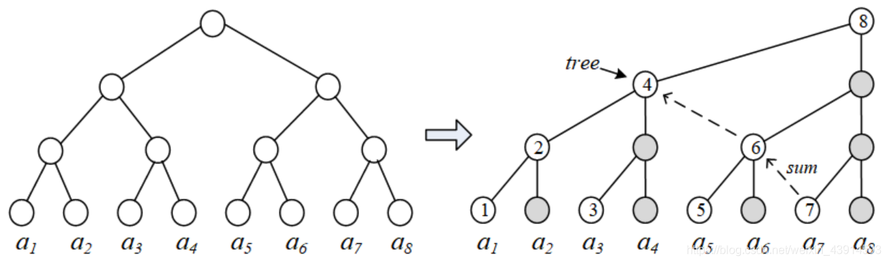
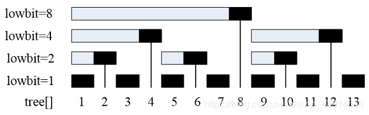

author: HeRaNO, Zhoier, Ir1d, Xeonacid, wangdehu, ouuan, ranwen, ananbaobeichicun, Ycrpro

## 引入

树状数组、线段树这两种数据结构用来解决一个常见的应用问题：高效率地查询和维护前缀和(或者区间和)。

所谓查询前缀和，即给出长度为n的数列𝐴=𝑎1,𝑎2,...,𝑎𝑛和一个查询𝑥≤𝑛，求𝑠𝑢𝑚(𝑥)=𝑎1+...+𝑎𝑥。区间\[i, j\]的和可以通过前缀和求得：𝑎𝑖+...+𝑎𝑗=𝑠𝑢𝑚(𝑗)−𝑠𝑢𝑚(𝑖−1)。

如果数列𝐴是静态不变的，代码很好写，预处理前缀和就好了，一次预处理的复杂度是O(n)的，然后每次查询都是O(1)的。但是，如果序列是动态变化的，例如改变其中一个元素𝑎𝑘的值，那么它后面的前缀和都会改变，需要重新计算，如果每次查询前元素都有变化，那么一次查询的的复杂度就变成了O(n)。

有两种数据结构可以高效地处理这个问题：树状数组、线段树。它们实现的两个功能：查询前缀和、修改元素值，复杂度都是𝑂(𝑙𝑜𝑔𝑛)的。

在学习线段树和树状数组之前，读者可以自己思考如何实现用𝑂(𝑙𝑜𝑔𝑛)的复杂度实现查询和维护前缀和。思路并不难得到，根据二分法或者分治法，把整个数列分为两半，然后每部分再继续分为两半......这样一来，查询和修改都能以𝑂(𝑙𝑜𝑔𝑛)的复杂度得到解决。这就是线段树和树状数组的基本思路，线段树差不多重现了这个思路，而树状数组借助一个神奇的𝑙𝑜𝑤𝑏𝑖𝑡()操作来简洁地实现。线段树的编码要更复杂一些，但是也更通用。

树状数组和线段树具有相似的功能，但他俩毕竟还有一些区别：树状数组能有的操作，线段树一定有；线段树有的操作，树状数组不一定有。树状数组只能处理具有逆运算的运算，例如加、减、异或运算，不能处理类似于求最大值、最小值的运算（实际上使用两个树状数组可以用于处理最大、小值的问题，见 [Efficient Range Minimum Queries using Binary Indexed Trees](http://history.ioinformatics.org/oi/files/volume9.pdf#page=41)）。但是树状数组的代码要比线段树短，思维更清晰，速度也更快，在解决一些单点修改的问题时，树状数组是不二之选。

树状数组主要用于处理：**单点修改区间查询** 的问题。使用差分数组和辅助数组可以将树状数组应用于 **区间修改单点查询** 和 **区间修改区间查询** 的问题。

本节介绍树状数组的概念和基本代码，然后给出它的经典应用：区间修改+单点查询、区间修改+区间查询、二维区间修改+区间查询、区间最值。

## 树状数组的单点修改区间查询

### 过程

树状数组（Binary Indexed Tree, BIT），从它的英文名可以看出，它是利用数的二进制特征进行检索的一种树状的结构。

如何利用二分的思想高效地求前缀和？以A = {a1,a2,...,a8}这8个元素为例，左图是二叉树的结构，右边把它画成树状。



右图圆圈中标记有数字的结点，存储的是称为树状数组的tree\[\]。一个结点上的tree\[\]的值，就是它树下的直连的子结点的和。例如 `𝑡𝑟𝑒𝑒[1]=𝑎1，𝑡𝑟𝑒𝑒[2]=𝑡𝑟𝑒𝑒[1]+𝑎2，𝑡𝑟𝑒𝑒[3]=𝑎3，𝑡𝑟𝑒𝑒[4]=𝑡𝑟𝑒𝑒[2]+𝑡𝑟𝑒𝑒[3]+𝑎4，...，𝑡𝑟𝑒𝑒[8]=𝑡𝑟𝑒𝑒[4]+𝑡𝑟𝑒𝑒[6]+𝑡𝑟𝑒𝑒[7]+𝑎8`。

利用tree\[\]，可以高效地完成下面两个操作：

（1）查询，即求前缀和sum，例如：`sum(8) = tree[8]，sum(7) = tree[7] + tree[6] + tree[4]，sum(6) = tree[6] + tree[4]`。右图中的虚线箭头是计算sum(7)的过程。显然，计算的复杂度是O(logn)的，这样就达到了快速计算前缀和的目的。

（2）维护。tree\[\]本身的维护也是高效的。当元素𝑎发生改变时，能以𝑂(𝑙𝑜𝑔𝑛)的高效率修改tree\[\]的值。例如更新了𝑎3，那么只需要修改`tree[3]、tree[4]、tree[8]...`，即修改它和它上面的那些结点：父结点（即𝑥+=𝑙𝑜𝑤𝑏𝑖𝑡(𝑥)）以及父结点的父结点。

有了方案，剩下的问题是，如何快速计算出tree\[\]？观察查询和维护两个操作，发现：

（1）查询的过程，是每次去掉二进制的最后的1。例如求`sum(7) = tree[7] + tree[6] + tree[4]`，步骤是：

    1. 7的二进制是111，去掉最后的1，得110，即tree[6]；
    2. 去掉6的二进制110的最后一个1，得100，即tree[4]；
    3. 的二进制是100，去掉1之后就没有了。

（2）维护的过程，是每次在二进制的最后的1上加1。例如更新了a3，需要修改`tree[3]、tree[4]、tree[]8...`等等，步骤是：

    1. 3的二进制是11，在最后的1上加上1得100，即4，修改tree[4]；
    2. 4的二进制是100，在最后的1上加1，得1000，即8，修改tree[]8；
    3. 继续修改tree[16]、tree[32]...等等。

最后，树状数组归结到一个关键问题：如何找到一个数的二进制的最后一个1。

* * *

**以下为OI Wiki老版本解释**

下面这张图展示了树状数组的工作原理：


这个结构和 [线段树](./seg.md) 有些类似：用一个大节点表示一些小节点的信息，进行查询的时候只需要查询一些大节点而不是所有的小节点。

最下面的八个方块就代表原始数据数组 $a$。他们上面的参差不齐的方块（与最上面的八个方块是同一个数组）代表数组 $a$ 的上级——$c$ 数组。$c$ 数组用来管理原始数据数组 $a$ 某一区间的和。

例如，从图中可以看出：  
$c_{2}$ 管理的是 $a_{1}$，$a_{2}$；  
$c_{4}$ 管理的是 $a_{1}$，$a_{2}$，$a_{3}$，$a_{4}$；  
$c_{6}$ 管理的是 $a_{5}$，$a_{6}$；  
$c_{7}$ 管理的是 $a_{7}$；  
$c_{8}$ 则管理全部 $8$ 个数。

如果要计算数组 $a$ 的区间和，比如说要算区间和 $\sum a_{4}...a_{7}$，可以先计算得到 $\sum a_{1}...a_{3}$ 再计算得到 $\sum a_{1}...a_{7}$，将后者减去前者得到 $\sum a_{4}...a_{7}$。在计算 $\sum a_{1}...a_{3}$ 和 $\sum a_{1}...a_{7}$ 时可以采用类似倍增的思想。  
例如，计算 $\sum a_{1}...a_{7}$ 的过程如下：  
从 $c_{7}$ 开始往前跳，发现 $c_{7}$ 只管理 $a_{7}$ 这个元素；那么你就会找 $c_{6}$，发现 $c_{6}$ 管理的是 $a_{5}$，$a_{6}$ 这两个元素；那么你就会直接跳到 $c_{4}$，发现 $c_{4}$ 就管理的是 $a_{1}，a_{2}，a_{3}，a_{4}$ 这些元素，至此已经到达元素 $a_{1}$，说明此时已经得到目标值 $\sum a_{1}...a_{7}$。  
计算 $\sum a_{1}...a_{3}$ 的过程之类似；


### 实现

那么问题来了，怎么知道 $c_{x}$ 管理的数组 $a$ 中的哪个区间呢？  
从上图中可以看出，若 $x\%(2^{n})==0$，$n$ 取最大整数值，那么 $c_{x}$ 管理的区间长度为 $2^{n}$。而 $n$ 恰好为 $x (x>=1)$ 二进制表示时最低位第一个 `1` 的右边 `0` 的个数。

例如：$x=6$ 时，$6_{(10)}=0110_{(2)}$，最低位 `1` 的右边 `0` 的个数为 $n=1$。因此 $c_{6}$ 管理的区间长度为 $2^{1}=2$，那么 $c_{x}$ 管理的区间即为：$a_{5}，a_{6}$。

为了便于计算 $x (x>=1)$ 对应的 $2^{n}$，引入一个函数——`lowbit(int)`：

𝑙𝑜𝑤𝑏𝑖𝑡(𝑥)=𝑥 & −𝑥，功能是找到x的二进制数的最后一个1。其原理是利用了负数的补码表示，补码是原码取反加一。例如𝑥=6=000001102，−𝑥=𝑥补=111110102，那么𝑙𝑜𝑤𝑏𝑖𝑡(𝑥)=𝑥 &−𝑥=102=2。

???+note "实现"
    === "C++"
    
        ```cpp
        int lowbit(int x) {
          // x 的二进制表示中，最低位的 1 的位置。
          // lowbit(0b01011000) == 0b00001000
          //          ~~~~^~~~
          // lowbit(0b01110010) == 0b00000010
          //          ~~~~~~^~
          return x & -x;
        }
        ```
    
    === "Python"
    
        ```python
        def lowbit(x):
            """
            x 的二进制表示中，最低位的 1 的位置。
            lowbit(0b01011000) == 0b00001000
                    ~~~~~^~~
            lowbit(0b01110010) == 0b00000010
                    ~~~~~~~^~
            """
            return x & -x
        ```

注释说明了 `lowbit` 的意思，对于 $x=88$，$88_{(10)}=01011000_{(2)}$   
$x$ 二进制最低位第一个 `1` 以及后面的 `0` 组成的二进制是 `1000`，说明，所以 $c_{88}$ 一共管理 $2^{3}=8$ 个 $a$ 数组中的元素。事实上，$c_{i}$ 管理的区间就是 $[i-\operatorname{lowbit}(i)+1, i]$。

在常见的计算机中，有符号数采用补码表示。在补码表示下，数 `x` 的相反数 `-x = ~x + 1`。

令𝑚=𝑙𝑜𝑤𝑏𝑖𝑡(𝑥)，定义𝑡𝑟𝑒𝑒\[𝑥\]值，是把𝑎𝑥和它前面共𝑚个数相加的结果，如上表所示。例如𝑙𝑜𝑤𝑏𝑖𝑡(6)=2，有𝑡𝑟𝑒𝑒\[6\]=𝑎5+𝑎6。

𝑡𝑟𝑒𝑒\[\]是通过𝑙𝑜𝑤𝑏𝑖𝑡()计算出的树状数组，它能够以二分的复杂度存储一个数列的数据。 具体地，tree\[x\]中储存的是\[𝑥−𝑙𝑜𝑤𝑏𝑖𝑡(𝑥)+1,𝑥\]中每个数的和。如下图，横线中的黑色表示𝑡𝑟𝑒𝑒\[𝑥\]，它等于横线上元素相加的和。



使用 lowbit 函数，我们可以实现很多操作，例如单点修改，将 $a_{x}$ 加上 $k$，只需要更新 $a_{x}$ 的所有上级：

???+note "实现"
    === "C++"

        ```cpp
        #define lowbit(x)  ((x) & - (x))   
        int tree[Maxn];
        void update(int x, int d) {   //修改元素ax,  ax = ax + d
            while(x <= Maxn) {
                tree[x] += d;  
                x += lowbit(x); 
            }
        }
        ```
    
    === "Python"
    
        ```python
        def add(x, k):
            while x <= n: # 不能越界
                c[x] = c[x] + k
                x = x + lowbit(x)
        ```

前缀求和：

???+note "实现"
    === "C++"

        ```cpp
        int sum(int x) {           //返回值是前缀和：ans = a1 + ... + ax
            int ans = 0;
            while(x > 0){
                ans += tree[x];  
                x -= lowbit(x);
            }
            return ans;
        }
        ```
    
    === "Python"
    
        ```python
        def getsum(x): # a[1]..a[x]的和
            ans = 0
            while x >= 1:
                ans = ans + c[x]
                x = x - lowbit(x)
            return ans
        ```

上述代码的使用方法是：

（1）初始化。主程序先清空数组tree\[\]，然后读取𝑎1，𝑎2，...，𝑎𝑛，用update()逐一处理这𝑛个数，得到tree\[\]数组。代码中并不需要定义数组𝑎，因为它隐含在𝑡𝑟𝑒𝑒[]中。

（2）求前缀和。用𝑠𝑢𝑚()函数计算𝑎1+𝑎2+...+𝑎𝑥。求和是基于数组tree\[\]的。

（3）修改元素。执行𝑢𝑝𝑑𝑎𝑡𝑒()，即修改数组𝑡𝑟𝑒𝑒\[\]。

从上面的使用方法可以看出，𝑡𝑟𝑒𝑒\[\]这个数据结构可以用于记录元素，以及计算前缀和。
值得注意的是，代码中并不需要定义和存储数组𝑎，因为它隐含在𝑡𝑟𝑒𝑒\[\]中，用𝑠𝑢𝑚()函数计算𝑎𝑖=𝑠𝑢𝑚(𝑖)−𝑠𝑢𝑚(𝑖−1)，复杂度𝑂(𝑙𝑜𝑔𝑛)。

下面介绍树状数组的经典应用，它们都结合了“差分数组”的概念，“差分数组”是用于区间查询的一个技巧。

## 区间修改 + 单点查询

一个序列𝐴=𝑎1,𝑎2,...,𝑎𝑛的更新（修改）有两种：

（1）单点修改。一次改一个数；

（2）区间修改。一次改变一个区间\[𝐿,𝑅\]内所有的数，例如把每个数统一加上𝑑。

树状数组的原始功能是“单点修改 + 区间查询”，是否能扩展为“区间修改”？只需一个简单而巧妙的操作（差分数组），就能把单点修改用来处理区间修改问题，实现高效的“区间修改 + 单点查询”，进一步也能做到“区间修改 + 区间查询”。

???+note "[Color the ball](https://vjudge.net/problem/HDU-1556)"
    **问题描述：** N个气球排成一排，从左到右依次编号为1, 2, 3 .... N。每次给定2个整数L, R`(L<= R)`，lele从气球L开始到气球R依次给每个气球涂一次颜色。但是N次以后lele已经忘记了第i个气球已经涂过几次颜色了，你能帮他算出每个气球被涂过几次颜色吗？
    
    **输入：** 每个测试实例第一行为一个整数N，`(N <= 100000)`。接下来的N行，每行包括2个整数`L, R(1 <= L<= R<= N)`。当N = 0，输入结束。
    
    **输出：** 每个测试实例输出一行，包括N个整数，第I个数代表第I个气球总共被涂色的次数。

???+note "解题思路"
    定义数组𝑎\[𝑖\]为气球𝑖被涂色的次数。
    
    如果用暴力处理N次区间修改，是𝑂(𝑁2)的。用树状数组，如果只是简单把区间\[𝐿,𝑅\]内的每个数𝑎\[𝑥\]用𝑢𝑝𝑑𝑎𝑡𝑒()进行单点修改，复杂度更差，是𝑂(𝑁2𝑙𝑜𝑔𝑁)的。下面把单点修改处理成区间修改，复杂度𝑂(𝑁𝑙𝑜𝑔𝑁)。
    
    如何用树状数组处理区间修改？题目要求把\[𝐿,𝑅\]区间内每个数加上𝑑，但是下面的解法不是对区间内每个数加𝑑，而是操作一个被称为“差分数组”的𝐷，它的定义是：
    
    `𝐷[𝑘]=𝑎[𝑘]−𝑎[𝑘−1]`，即原数组相邻元素的差。
    
    从定义可以推出：
    
    `𝑎[𝑘]=𝐷[1]+𝐷[2]+...+𝐷[𝑘]=∑𝑘𝑖=1𝐷(𝑖)`
    
    这个公式深刻地描述了𝑎和𝐷的关系，“差分是前缀和的逆运算”，它把求𝑎\[𝑘\]转化为求𝐷的前缀和，前缀和正适合用树状数组来处理。
    
    对于区间\[𝐿,𝑅\]的修改问题，对𝐷做以下操作：
    
    1. 把𝐷\[𝐿\]加上𝑑；
    2. 把𝐷\[𝑅+1\]减去𝑑。

    然后用树状数组函数𝑠𝑢𝑚()求前缀和`𝑠𝑢𝑚[𝑥]=𝐷[1]+𝐷[2]+...+𝐷[𝑥]`，有：

    1. `1≤𝑥<𝐿，前缀和𝑠𝑢𝑚[𝑥]`不变；
    2. `𝐿≤𝑥≤𝑅，前缀和𝑠𝑢𝑚[𝑥]`增加了𝑑；
    3. `𝑅<𝑥≤𝑁，前缀和𝑠𝑢𝑚[𝑥]`不变，因为被𝐷\[𝑅+1\]中减去的𝑑抵消了。

    𝑠𝑢𝑚\[𝑥\]的值与直接把\[𝐿,𝑅\]区间内每个数加上𝑑得到的𝑎\[𝑥\]是相等的。这样，就利用树状数组高效地计算出了区间修改后的𝑎\[𝑥\]。

???+note "参考代码"
    === "树状数组"
        ```cpp
        //tree[Maxn]，lowbit(x)，update()，sum()的代码前面已给出
        const int Maxn = 100010;
        int main(){
            int n;
            while(~scanf("%d",&n)) {  
                memset(tree,0,sizeof(tree));          //只需要一个tree[]数组
                for(int i=1;i<=n;i++) {               //区间修改
                    int L, R; 
                    scanf("%d%d",&L,&R);
                    update(L,1);                       //本题的d = 1
                    update(R+1,-1);
                }
                for(int i=1;i<=n;i++){                //单点查询
                    if(i!=n)  printf("%d ",sum(i));   //把sum(i)看成a[i]
                    else      printf("%d\n",sum(i));
                }
            }
            return 0;
        }
        ```

        代码中的第一个𝑓𝑜𝑟循环做了𝑛次区间修改，复杂度𝑂(𝑛𝑙𝑜𝑔𝑛)；第二个𝑓𝑜𝑟循环做了𝑛次单点查询，复杂度𝑂(𝑛𝑙𝑜𝑔𝑛)。加起来总复杂度仍是𝑂(𝑛𝑙𝑜𝑔𝑛)。

    === "差分数组"
        ```cpp
        #include<bits/stdc++.h>
        using namespace std;
        const int Maxn = 100010;
        int a[Maxn],D[Maxn];               //a是气球，D是差分数组
        int main(){
            int n;
            while(~scanf("%d",&n)) { 
                memset(a,0,sizeof(a)); memset(D,0,sizeof(D));
                for(int i=1;i<=n;i++){
                    int L,R; scanf("%d%d",&L,&R);
                    D[L]++;                 //差分，原理和前面树状数组一样
                    D[R+1]--;
                }
                for(int i=1;i<=n;i++){
                    a[i] = a[i-1] + D[i];          //求前缀和a[]，a[i]就是气球i的值
                    if(i!=n)  printf("%d ", a[i]);  //逐个打印结果
                    else      printf("%d\n",a[i]);
                }        
            }
            return 0;
        }
        ```

        不过，遇到“区间修改”这种题型，还是建议用树状数组来求解。原因是差分数组对“区间修改”是很高效的，但是对“单点查询”并不高效。即使只查询一个前缀和，差分数组仍然要计算所有的前缀和，复杂度𝑂(𝑛)；而树状数组做一次前缀和计算是𝑂(𝑙𝑜𝑔𝑛)的。

## 区间修改 + 区间查询

前面的例题完成的是“区间修改 + 单点查询”，下面考虑把单点查询扩展到区间查询，即查询的不是一个单点𝑎\[𝑥\]的值，而是区间\[𝑖,𝑗\]的和。

仅仅用一个树状数组，无法同时高效地完成“区间修改”和“区间查询”，因为这个树状数组的tree\[\]已经用于“区间修改”，它用𝑠𝑢𝑚()计算了单点𝑎\[𝑥\]，不能再用于求`𝑎[𝑖]~𝑎[𝑗]`的区间和。

读者可能想到再加一个树状数组，也许能接着高效地完成区间查询。但是如果这两个树状数组只是简单地一个做“区间修改”，一个做“区间查询”，合起来效率并不高。做一次长度为𝑘的区间修改，计算区间内每个𝑎\[𝑥\]的复杂度是𝑂(𝑙𝑜𝑔𝑛)的；如果继续用一个树状数组处理这𝑘个𝑎\[𝑥\]，复杂度是𝑂(𝑘𝑙𝑜𝑔𝑛)的；做𝑛次修改和询问，总复杂度𝑂(𝑛2𝑙𝑜𝑔𝑛)。

这两个树状数组需要紧密结合才能高效完成“区间修改 + 区间查询”，称为“二阶树状数组”，它也是“差分数组”概念和树状数组的结合。下面给出一个典型例题。

???+note "[【模板】线段树 1](https://www.luogu.com.cn/problem/P3372)"
    **问题描述：** 已知一个数列，进行两种操作：（1）把某区间每个数加上d；（2）求某区间所有数的和。
    
    **输入：** 第一行包含两个整数 n，m，分别表示该数列数字的个数和操作的总个数。第二行包含n个用空格分隔的整数，其中第i个数字表示数列第i项的初始值。接下来m行每行包含3或4个整数，表示一个操作，具体如下：
    
    （1）1 L R d：将区间[L, R]内每个数加上d。
    
    （2）2 L R：输出区间[L, R]内每个数的和。
    
    **输出：** 输出包含若干行整数，即为所有操作（2）的结果。
    
    `1≤𝑛，𝑚≤10^5，元素的值在[−2^63,2^63)内`。

???+note "解题思路"
    操作（1）是区间修改，操作（2）是区间查询。
    
    首先，求区间和`𝑠𝑢𝑚(𝐿,𝑅)=𝑎[𝐿]+𝑎[𝐿+1]+...+𝑎[𝑅]=𝑠𝑢𝑚(1,𝑅)−𝑠𝑢𝑚(1,𝐿−1)`，问题转化为求𝑠𝑢𝑚(1,𝑘)。
    
    定义一个差分数组𝐷，它和原数组a的关系仍然是`𝐷[𝑘]=𝑎[𝑘]−𝑎[𝑘−1]，有𝑎[𝑘]=𝐷[1]+𝐷[2]+...+𝐷[𝑘]`，下面推导区间和，看它和求前缀和有没有关系，如果有关系，就能用树状数组。

    `𝑎1+𝑎2+...+𝑎𝑘
    =𝐷1+(𝐷1+𝐷2)+(𝐷1+𝐷2+𝐷3)+...+(𝐷1+𝐷2+...+𝐷𝑘)
    =𝑘∗𝐷1+(𝑘−1)∗𝐷2+(𝑘−2)∗𝐷3+...+(𝑘−(𝑘−1))𝐷𝑘
    =𝑘(𝐷1+𝐷2+...+𝐷𝑘)−(𝐷2+2𝐷3+...+(𝑘−1)𝐷𝑘)
    =𝑘∑𝑘𝑖=1𝐷𝑖−∑𝑘𝑖=1(𝑖−1)𝐷𝑖`

    这是求两个前缀和，用两个树状数组分别处理，一个实现𝐷𝑖，一个实现(𝑖−1)𝐷𝑖。
    
    下面是“区间修改 + 区间查询”的代码，完全重现了上面推导出的结论。
    
    代码中的𝑢𝑝𝑑𝑎𝑡𝑒1()和𝑢𝑝𝑑𝑎𝑡𝑒2()、𝑠𝑢𝑚1()和𝑠𝑢𝑚2()几乎一样。也可以合起来写成𝑢𝑝𝑑𝑎𝑡𝑒1(𝑙𝑙 𝑥,𝑙𝑙 𝑑,𝑖𝑛𝑡 𝑣)的样子，用𝑣来区分处理𝑡𝑟𝑒𝑒1和𝑡𝑟𝑒𝑒2。不过像下面这样分开写更清晰，编码更快。
    
    代码的复杂度是𝑂(𝑚𝑙𝑜𝑔𝑛)。

???+note "参考代码"
    ```cpp
    #include<bits/stdc++.h>
    using namespace std;
    #define ll long long
    const int Maxn = 100010;
    #define lowbit(x)  ((x) & - (x))   
    ll tree1[Maxn],tree2[Maxn];         //2个树状数组
    void update1(ll x,ll d){
        while(x<=Maxn){
            tree1[x]+=d;  x+=lowbit(x);
        }
    }
    void update2(ll x,ll d){
        while(x<=Maxn){
            tree2[x]+=d;  x+=lowbit(x);
        }
    }
    ll   sum1(ll x){
        ll ans = 0;
        while(x>0) {
            ans+=tree1[x];x-=lowbit(x);
        }
        return ans;
    }
    ll   sum2(ll x){
        ll ans = 0;
        while(x>0) {
            ans+=tree2[x];x-=lowbit(x);
        }
        return ans;
    }
    int main(){
        ll n, m; scanf("%lld%lld",&n,&m);
        ll old = 0, a;
        for (int i=1;i<=n;i++) {        
            scanf("%lld",&a);      //输入每个初始值
            update1(i, a-old);     //差分数组原理，初始化
            update2(i,(i-1)*(a-old));
            old = a;
        }
        while (m--){                     //m个操作
            ll q, L, R, d; 
            scanf("%lld",&q);
            if (q==1){                   //区间修改
                scanf("%lld%lld%lld",&L, &R, &d);
                update1(L,d);            //第1个树状数组
                update1(R+1,-d); 
                update2(L,d*(L-1));      //第2个树状数组
                update2(R+1,-d*R);       //d*R = d*(R+1-1)
            }
            else {                       //区间询问
                scanf("%lld%lld",&L,&R);
                printf("%lld\n",R*sum1(R)-sum2(R) - (L-1)*sum1(L-1)+sum2(L-1));
            } 
        }
        return 0;
    }
    ```

## 二维区间修改 + 区间查询
前面的例题都是一维的，下面给出一个二维求“区间修改+区间查询”的例题。

???+note "[上帝造题的七分钟](https://www.luogu.com.cn/problem/P4514)"
    **输入：** 第一行是X n m，代表矩阵大小为n×m。从第二行开始到文件尾的每一行出现以下两种操作：
    
    L a b c d delta 代表将(a,b),(c,d)为顶点的矩形区域内所有数字加上delta。
    
    k a b c d 代表求(a,b),(c,d)为顶点的矩形区域内所有数字的和。
    
    **输出：** 针对每个k操作，输出答案。
    
    输入样例：
    
    X 4 4
    
    L 1 1 3 3 2
    
    L 2 2 4 4 1
    
    k 2 2 3 3
    
    输出样例：
    
    12
    
    注：`1 ≤ n ≤ 2048, 1 ≤ m ≤ 2048, −500 ≤ delta ≤ 500`, 操作不超过200000个,保证运算过程中及最终结果均不超过32位带符号整数类型的表示范围。

???+note "解题思路"
    本题需要用二维树状数组。二维的“区间修改+区间查询”，就是一维“区间修改+区间查询”的扩展，方法和推导过程类似。 
    
    （1）二维区间修改

    

    如何实现区间修改？需要结合二维的差分数组。定义一个二维的差分数组𝐷\[𝑖\]\[𝑗\]，它和矩阵元素𝑎\[𝑐\]\[𝑑\]的关系是：
    
    `𝐷[𝑖][𝑗]=𝑎[𝑖][𝑗]−𝑎[𝑖−1][𝑗]−𝑎[𝑖][𝑗−1]+𝑎[𝑖−1][𝑗−1]`，对照上图，`𝐷[𝑖][𝑗]`就是阴影的面积。
    
    `𝑎[𝑐][𝑑]=∑𝑐𝑖=1∑𝑑𝑗=1𝐷[𝑖][𝑗]`，看成对以(1,1)、(𝑐,𝑑)为顶点的矩阵内的`𝐷[𝑖][𝑗]`求和。
    
    它们同样满足“差分是前缀和的逆运算”关系。
    
    用二维树状数组实现𝐷\[𝑖\]\[𝑗\]，编码见后面的代码中的𝑢𝑝𝑑𝑎𝑡𝑒()和𝑠𝑢𝑚()。进行区间修改的时候，在𝑢𝑝𝑑𝑎𝑡𝑒()中，每次第𝑖行减少𝑙𝑜𝑤𝑏𝑖𝑡(𝑖)，第𝑗j列减𝑙𝑜𝑤𝑏𝑖𝑡(𝑗)，复杂度𝑂(𝑙𝑜𝑔𝑛𝑙𝑜𝑔𝑚)。
    
    （2）二维区间查询

    

    查询(a, b)、(c, d)为顶点的矩阵区间和，对照上图的阴影部分，有：

    `∑𝑐𝑖=𝑎∑𝑑𝑗=𝑏𝑎[𝑖][𝑗]=∑𝑐𝑖=1∑𝑑𝑗=1𝑎[𝑖][𝑗]−∑𝑐𝑖=1∑𝑏−1𝑗=1𝑎[𝑖][𝑗]−∑𝑎−1𝑖=1∑𝑑𝑗=1𝑎[𝑖][𝑗]+∑𝑎−1𝑖=1∑𝑏−1𝑗=1𝑎[𝑖][𝑗]`
    
    问题转化为计算`∑𝑛𝑖=1∑𝑚𝑗=1𝑎[𝑖][𝑗]`，根据它和差分数组D的关系进行变换\[1:1\]：
    
    `∑𝑛𝑖=1∑𝑚𝑗=1𝑎[𝑖][𝑗]
    =∑𝑛𝑖=1∑𝑚𝑗=1∑𝑖𝑘=1∑𝑗𝑙=1𝐷[𝑘][𝑙]
    =∑𝑛𝑖=1∑𝑚𝑗=1𝐷[𝑖][𝑗]×(𝑛−𝑖+1)×(𝑚−𝑗−1)
    =(𝑛+1)(𝑚+1)∑𝑛𝑖=1∑𝑚𝑗=1𝐷[𝑖][𝑗]−(𝑚+1)∑𝑛𝑖=1∑𝑚𝑗=1𝐷[𝑖][𝑗]×𝑖−(𝑛+1)∑𝑛𝑖=1∑𝑚𝑗=1𝐷[𝑖][𝑗]×𝑗+∑𝑛𝑖=1∑𝑚𝑗=1𝐷[𝑖][𝑗]×𝑖×𝑗`
    
    这是4个二维树状数组。

???+note "参考代码"

    ```cpp
    #include<bits/stdc++.h>
    using namespace std;
    const int N = 2050;
    int t1[N][N],t2[N][N],t3[N][N],t4[N][N];
    #define lowbit(x)  ((x) & - (x))  
    int n,m; 
    void update(int x,int y,int d){
        for(int i=x;i<=n;i+=lowbit(i))
            for(int j=y;j<=m;j+=lowbit(j)){
                t1[i][j] += d;
                t2[i][j] += x*d;
                t3[i][j] += y*d;
                t4[i][j] += x*y*d;
            }
    }
    int sum(int x,int y){
        int ans = 0;
        for(int i=x;i>0;i-=lowbit(i))
            for(int j=y;j>0;j-=lowbit(j))
                ans += (x+1)*(y+1)*t1[i][j] - (y+1)*t2[i][j] - (x+1)*t3[i][j] + t4[i][j];
        return ans;
    }
    int main(){
        char ch[2];	scanf("%s",ch);
        scanf("%d%d",&n,&m);     
    while(scanf("%s",ch)!=EOF){
            int a,b,c,d,delta;
            scanf("%d%d%d%d",&a,&b,&c,&d);
            if(ch[0]=='L'){
                scanf("%d",&delta);
                update(a,  b,   delta);    
                update(c+1,d+1, delta);
                update(a,  d+1,-delta); 
                update(c+1,b,  -delta);
            }
            else printf("%d\n",sum(c,d)+sum(a-1,b-1)-sum(a-1,d)-sum(c,b-1));
        }	
        return 0;
    }
    ```

### 偏序问题（逆序对 + 离散化）

偏序问题：

1. 一维偏序（逆序对）。给定数列a，求满足i < j且ai > aj的二元组(i, j)的数量。
2. 二维偏序。给定n个点的坐标，求出满足xi < xj、yi < yj的二元组(i, j)的数量。
3. 三维偏序。给定n个点的坐标，求满足xi < xj、yi < yj、zi < zj的二元组(i, j)的数量。

逆序对问题有两种解法：归并排序、树状数组。用树状数组解逆序对又简单又巧妙，是树状数组应用的绝佳例子。

???+note "[逆序对](https://www.luogu.com.cn/problem/P1908)"
    **题目描述：** 对于给定的一段正整数序列，逆序对就是序列中ai > aj且i < j的有序对。计算一段正整数序列中逆序对的数目。序列中可能有重复数字。
    
    **输入格式：** 第一行，一个数 n，表示序列中有 n个数。第二行n个数，表示给定的序列。序列中每个数字不超过 109。n <= 5×105。
    
    **输出格式：** 输出序列中逆序对的数目。
    
    输入样例：
    
    6
    
    5 4 2 6 3 1
    
    输出样例：
    
    11

???+note "解题思路"
    直接用两重循环暴力搜，复杂度O(n2)。用树状数组，复杂度O(nlogn)。
    
    用树状数组解逆序对用到一个技巧：把数字看成树状数组的下标。每处理一个数字，树状数组的下标所对应的元素数值加一，统计前缀和，就是逆序对的数量。倒序或正序处理数据都行，下面是例子。
    
    （1）倒序。用树状数组倒序处理数列，当前数字的前一个数的前缀和即为以该数为较大数的逆序对的个数。例如样例的{5, 4, 2, 6, 3, 1}，倒序处理数字：

        1. 数字1。把a\[1\]加一，计算a\[1\]前面的前缀和sum(0)，逆序对数量ans=ans+sum(0)=0；
        2. 数字3。把a\[3\]加一，计算a\[3\]前面的前缀和sum(2)，逆序对数量ans=ans+sum(2)=1；
        3. 数字6。把a\[6\]加一，计算a\[6\]前面的前缀和sum(5)，逆序对数量ans=ans+sum(5)=1+2=3；
        
        等等。
    
    （2）正序。当前已经处理的数字个数减掉当前数字的前缀和即为以该数为较小数的逆序对个数。例如样例的{5, 4, 2, 6, 3, 1}，正序处理数字：

        1. 数字5。把a\[5\]加一，当前处理了1个数，ans=ans+(1-sum(5))=0；
        2. 数字4。把a\[4\]加一，当前处理了2个数，ans=ans+(2-sum(4))=0+1=1；
        3. 数字2。把a\[2\]加一，ans=ans+(3-sum(2))=1+2=3；
        4. 数字6。把a\[6\]加一，ans=ans+(4-sum(6))=3+0=3；
    
    等等。
    
    不过，上面的处理方法“把数字看成树状数组的下标”有个问题，如果数字比较大，例如数字等于10^9^，那么树状数组的空间也要开到10^9^ = 1G，这远远超过了题目限制的空间。用“离散化”这个小技巧能解决这个问题。
    
    所谓离散化，就是把原来的数字，用它们的相对大小来替换原来的数值，而它们的顺序仍然不变，不影响逆序对的计算。例如{1, 20000,10, 300, 890000000}，它们的相对大小是{1, 4, 2, 3, 5}，这两个序列的逆序对数量是一样的。前者需要极大的空间，后者空间很小。有多少个数字，离散化后开的空间就是多大。 
    
    下面是洛谷 1908的代码，注意其中的离散化操作。离散化时计算“相对大小”需要用到排序，请仔细分析。

???+note "参考代码"
    ```cpp
    //lowbit(x)，update()，sum()的代码前面已给出
    const int Maxn = 500010;
    int tree[Maxn],rank[Maxn],n;
    struct point{
    int num,val;
    }a[Maxn];
    bool cmp(point x,point y){
        if(x.val == y.val)   return x.num < y.num;  //注意：相等的情况，先出现标记更小
        return x.val < y.val;
    }
    int main(){
        scanf("%d",&n);
        for(int i=1;i<=n;i++) {
            scanf("%d",&a[i].val);
            a[i].num = i;         //记录顺序，用于离散化
        }
        sort(a+1,a+1+n,cmp);      //排序
        for(int i=1;i<=n;i++)     //离散化，得到新的数字序列rank[]
            rank[a[i].num]=i;     
    long long ans=0; 
        /*for(int i=1;i<=n;i++){    //正序处理
            update(rank[i],1);
            ans += i-sum(rank[i]);
        }*/
        for(int i=n;i > 0;--i){     //倒序处理
            update(rank[i],1);
            ans += sum(rank[i]-1);
        }
        printf("%lld",ans);
        return 0;
    } 
    ```

## 区间最值

树状数组一般用来计算前缀和，不过，也能高效率地求区间最值，此时需要改写树状数组的代码。

???+note "[I hate it](https://vjudge.net/problem/HDU-1754)"
    **题目描述：** 求区间内最大值。
    
    **输入：** 第一行是正整数`N,M ( 0<N<=200000,0<M<5000 )`，代表数字个数和操作数。第二行包含N个整数，接下来M行，每行有一个询问，格式为：
    
    Q A B 代表一个询问，询问从第A到第B个数字中的最大值。
    
    U A B 代表一个更新，把第A个数字改为B。
    
    **输出：** 对每个询问，输出区间最大值。

???+note "解题思路"
    用暴力法，复杂度是O(MN)的。下面用树状数组求解。 

    在标准的前缀和树状数组中，tree\[x\]中储存的是\[x-lowbit(x)+1, x\]中每个数的和。在求最值的树状数组中，tree\[x\]记录\[x-lowbit(x)+1, x\]内所有数的最大值。
    
    （1）单点修改𝑢𝑝𝑑𝑎𝑡𝑒1(𝑥,𝑣𝑎𝑙𝑢𝑒)。用𝑣𝑎𝑙𝑢𝑒更新𝑡𝑟𝑒𝑒\[𝑥\]的最大值，并更新树状数组上被它影响的结点。例如修改𝑥 = 4，步骤是：
    
        1）修改𝑥子树上直连的𝑡𝑟𝑒𝑒\[2\]、𝑡𝑟𝑒𝑒\[3\]；
        
        2）𝑥的父结点𝑡𝑟𝑒𝑒\[8\]，以及𝑡𝑟𝑒𝑒\[8\]的直连子结点𝑡𝑟𝑒𝑒\[6\]、𝑡𝑟𝑒𝑒\[7\]；...等等。
    
    每一步复杂度是𝑂(𝑙𝑜𝑔𝑛)，共𝑂(𝑙𝑜𝑔𝑛)步，总复杂度是𝑂((𝑙𝑜𝑔𝑛)2)。注意一个特殊情况，初始化的时候需要修改所有n个数，复杂度𝑂(𝑛(𝑙𝑜𝑔𝑛)2)，符合要求。

    ```cpp
    void update1(int x,int value){
        while(x <= n){
            tree[x] = value;
            for(int i=1; i<lowbit(x); i<<=1)      //用子结点更新自己
                tree[x] = max(tree[x], tree[x-i]);
            x += lowbit(x);                       //父结点
        }
    }
    ```

    （2）区间最值查询query1()。区间 \[L, R\]的最值，分两种情况讨论。

        1）R - L >= lowbit( R)。对照“树状数组原理图”，即\[L, R\]范围包含了tree\[R\]直连子结点的个数，此时直接使用tree\[R\]的值：query1(L, R) = max(tree\[R\], query1(L, R−lowbit( R)))。

        2）当 R - L < lowbit(R) 时，上述包含关系不成立，先使用a\[R\]的值，然后往前递推：query1(L, R) = max(a\[R\], query1(L, R−1))。

    query1()的复杂度仍然是𝑂((𝑙𝑜𝑔𝑛)2)。

    ```cpp
    int query1(int L,int R){
        int ans = 0;
        while(L<=R)	{
            ans = max(ans,a[R]);
            R--;
            while(R-L>=lowbit(R)){
                ans = max(ans,tree[R]);
                R-=lowbit(R);
            }
        }
        return ans;
    }
    ```

???+note "参考代码"

    ```cpp
    #include<bits/stdc++.h>
    using namespace std;
    const int maxn=2e5+10; 
    int n,m,a[maxn],tree[maxn]; 
    int lowbit(int x){return x&(-x);}
    void update1(int x,int value){;}    //代码在前面
    int query1(int L,int R){;}          //代码在前面
    int main(){
        while(~scanf("%d%d",&n,&m))	{
            memset(tree,0,sizeof(tree));
            for(int i=1; i<=n; i++){
                scanf("%d",&a[i]);
                update1(i,a[i]);
            }
            while(m--){
                char s[5];int A,B;
                scanf("%s%d%d",s,&A,&B);
                if(s[0]=='Q')
                    printf("%d\n",query1(A,B));
                else{
                    a[A]=B;
                    update1(A,B);
                }
            }
        }
        return 0;
    }
    ```

## 离线处理

???+note "[No Pain No Game](https://vjudge.net/problem/HDU-4630)"
    **题目描述：** 给出一个序列，这个序列是1~n这n个数字的一个全排列。给出一个区间\[L, R\]，求区间内任意两个数的GCD（最大公约数）的最大值。
    
    **输入：** 第一行包括一个数T，后面有T个测试。每个测试的第一行是数字n，`1<=n<=50000`，第二行包括n个数，是1~n这n个数字的一个全排列。第三行包括数字Q，`1<=Q<=50000`，表示Q个询问。后面有Q行，每行有2个整数`L，R，1<=L<=R<=n`，表示一个询问。
    
    **输出：** 每个询问的结果打印一行。

???+note "解题思路"
    在区间\[L, R\]内，先求出区间内所有数的因子，出现2次的因子是公约数，最大的那个就是答案。
    
    有Q个区间询问，而Q很大，所以每次查询的复杂度需要达到𝑂(𝑙𝑜𝑔𝑛)才行。但是如果对每个询问都单独计算这个区间内的最大公约数，最快也是𝑂(𝑛)的，Q个询问就是𝑂(𝑛2)，超时。
    
    此时需要用离线处理，即先读取所有的询问，然后统一处理，计算结束后一起输出。
    
    前面的标准树状数组的代码，只能求区间和。能否改成求区间最值？把update()、sum()简单地改写成：

    ```cpp
    void update2(int x,int d){    
        while(x <= n){
            tree[x] = max(tree[x],d);  //改成：更新最大值
            x += lowbit(x);
        }
    }
    int query2(int x){              
        int ans = 0;
        while(x > 0){
            ans = max(ans,tree[x]);   //改成：求最大值
            x -= lowbit(x);
        }
        return ans;
    }
    ```

    对照“树状数组原理图”，执行𝑢𝑝𝑑𝑎𝑡𝑒2(𝑥,𝑑)的结果，是在\[𝑥,𝑛\]区间内，把𝑥的父结点（即𝑥+𝑙𝑜𝑤𝑏𝑖𝑡(𝑥),以及父结点的父结点）的𝑡𝑟𝑒𝑒\[\]值设置为𝑎𝑥的最大值；执行𝑞𝑢𝑒𝑟𝑦2(𝑥)，返回的是𝑎1 𝑎𝑥的最大值。
    
    上述代码并不能用于上一小结的“求区间\[L, R\]最值”问题。因为最值没有前缀和的那种线性关系，\[L, R\]的最值与\[1, L-1\]、\[1, R\]的最值并没有关系。但是在本题中很有用。
    
    首先将所有的询问\[L, R\]按左端点L从大到小排序。从最大的L1开始计算，用𝑢𝑝𝑑𝑎𝑡𝑒2()往父结点方向更新最大值，并用𝑞𝑢𝑒𝑟𝑦2(𝑅1)返回区间\[L1, R1\]的最大值，由于此时比L1小的那些询问还没有开始修改树状数组，也就不影响\[L1, R1\]的计算。下一步再从第二大的L2开始计算。在这个过程中，先计算的区间，能用于后计算的区间，从而提高了效率。

## 老版本--区间加 & 区间求和

若维护序列 $a$ 的差分数组 $b$，此时我们对 $a$ 的一个前缀 $r$ 求和，即 $\sum_{i=1}^{r} a_i$，由差分数组定义得 $a_i=\sum_{j=1}^i b_j$

进行推导

???+note "证明"
    $$
    \begin{aligned}
    &\sum_{i=1}^{r} a_i\\=&\sum_{i=1}^r\sum_{j=1}^i b_j\\=&\sum_{i=1}^r b_i\times(r-i+1)
    \\=&\sum_{i=1}^r b_i\times (r+1)-\sum_{i=1}^r b_i\times i
    \end{aligned}
    $$

区间和可以用两个前缀和相减得到，因此只需要用两个树状数组分别维护 $\sum b_i$ 和 $\sum i \times b_i$，就能实现区间求和。

代码如下

???+note "实现"
    === "C++"
    
        ```cpp
        int t1[MAXN], t2[MAXN], n;
    
        inline int lowbit(int x) { return x & (-x); }
    
        void add(int k, int v) {
          int v1 = k * v;
          while (k <= n) {
            t1[k] += v, t2[k] += v1;
            k += lowbit(k);
          }
        }
    
        int getsum(int *t, int k) {
          int ret = 0;
          while (k) {
            ret += t[k];
            k -= lowbit(k);
          }
          return ret;
        }
    
        void add1(int l, int r, int v) {
          add(l, v), add(r + 1, -v);  // 将区间加差分为两个前缀加
        }
    
        long long getsum1(int l, int r) {
          return (r + 1ll) * getsum(t1, r) - 1ll * l * getsum(t1, l - 1) -
                (getsum(t2, r) - getsum(t2, l - 1));
        }
        ```
    
    === "Python"
    
        ```python
        t1 = [0] * MAXN, t2 = [0] * MAXN; n = 0
    
        def lowbit(x):
            return x & (-x)
    
        def add(k, v):
            v1 = k * v
            while k <= n:
                t1[k] = t1[k] + v; t2[k] = t2[k] + v1
                k = k + lowbit(k)
    
        def getsum(t, k):
            ret = 0
            while k:
                ret = ret + t[k]
                k = k - lowbit(k)
            return ret
    
        def add1(l, r, v):
            add(l, v)
            add(r + 1, -v)
    
        def getsum1(l, r):
            return (r) * getsum(t1, r) - l * getsum(t1, l - 1) - \
                  (getsum(t2, r) - getsum(t2, l - 1))
        ```

## Tricks

### $O(n)$ 建树

方法一：

每一个节点的值是由所有与自己直接相连的儿子的值求和得到的。因此可以倒着考虑贡献，即每次确定完儿子的值后，用自己的值更新自己的直接父亲。

???+note "实现"
    === "C++"
    
        ```cpp
        // O(n) 建树
        void init() {
          for (int i = 1; i <= n; ++i) {
            t[i] += a[i];
            int j = i + lowbit(i);
            if (j <= n) t[j] += t[i];
          }
        }
        ```
    
    === "Python"
    
        ```python
        def init():
            for i in range(1, n + 1):
                t[i] = t[i] + a[i]
                j = i + lowbit(i)
                if j <= n:
                    t[j] = t[j] + t[i]
        ```

方法二：

前面讲到 $c_i$ 表示的区间是 $[i-\operatorname{lowbit}(i)+1, i]$，那么我们可以先预处理一个 $sum$ 前缀和数组，再计算 $c$ 数组。

???+note "实现"
    === "C++"
    
        ```cpp
        void init() {
          for (int i = 1; i <= n; ++i) {
            t[i] = sum[i] - sum[i - lowbit(i)];
          }
        }
        ```
    
    === "Python"
    
        ```python
        def init():
            for i in range(1, n + 1):
                t[i] = sum[i] - sum[i-lowbit(i)]
        ```

### $O(\log n)$ 查询第 $k$ 小/大元素

#### 过程

在此处只讨论第 $k$ 小，第 $k$ 大问题可以通过简单计算转化为第 $k$ 小问题。

参考「可持久化线段树」章节中，关于求区间第 $k$ 小的思想。将所有数字看成一个可重集合，即定义数组 $a$ 表示值为 $i$ 的元素在整个序列中出现了 $a_i$ 次。找第 $k$ 小就是找到最小的 $x$ 恰好满足 $\sum_{i=1}^{x}a_i \geq k$

因此可以想到算法：如果已经找到 $x$ 满足 $\sum_{i=1}^{x}a_i < k$，考虑能不能让 $x$ 继续增加，使其仍然满足这个条件。找到最大的 $x$ 后，$x+1$ 就是所要的值。
在树状数组中，节点是根据 2 的幂划分的，每次可以扩大 2 的幂的长度。令 $sum$ 表示当前的 $x$ 所代表的前缀和，有如下算法找到最大的 $x$：

1. 求出 $depth=\left \lfloor \log_2n \right \rfloor$
2. 计算 $t=\sum_{i=x+1}^{x+2^{depth}}a_i$
3. 如果 $sum+t < k$，则此时扩展成功，将 $2^{depth}$ 累加到 $x$ 上；否则扩展失败，对 $x$ 不进行操作
4. 将 $depth$ 减 1，回到步骤 2，直至 $depth$ 为 0

#### 实现

=== "C++"

    ```cpp
    // 权值树状数组查询第k小
    int kth(int k) {
      int cnt = 0, ret = 0;
      for (int i = log2(n); ~i; --i) {      // i 与上文 depth 含义相同
        ret += 1 << i;                      // 尝试扩展
        if (ret >= n || cnt + t[ret] >= k)  // 如果扩展失败
          ret -= 1 << i;
        else
          cnt += t[ret];  // 扩展成功后 要更新之前求和的值
      }
      return ret + 1;
    }
    ```

=== "Python"

    ```python
    # 权值树状数组查询第 k 小
    def kth(k):
        cnt = 0; ret = 0
        i = log2(n) # i 与上文 depth 含义相同
        while ~i:
            ret = ret + (1 << i) # 尝试扩展
            if ret >= n or cnt + t[ret] >= k: # 如果扩展失败
                ret = ret - (1 << i)
            else:
                cnt = cnt + t[ret] # 扩展成功后 要更新之前求和的值
        return ret + 1
    ```

### 时间戳优化

#### 过程

对付多组数据很常见的技巧。如果每次输入新数据时，都暴力清空树状数组，就可能会造成超时。因此使用 $tag$ 标记，存储当前节点上次使用时间（即最近一次是被第几组数据使用）。每次操作时判断这个位置 $tag$ 中的时间和当前时间是否相同，就可以判断这个位置应该是 0 还是数组内的值。

#### 实现

=== "C++"

    ```cpp
    // 时间戳优化
    int tag[MAXN], t[MAXN], Tag;

    void reset() { ++Tag; }

    void add(int k, int v) {
      while (k <= n) {
        if (tag[k] != Tag) t[k] = 0;
        t[k] += v, tag[k] = Tag;
        k += lowbit(k);
      }
    }

    int getsum(int k) {
      int ret = 0;
      while (k) {
        if (tag[k] == Tag) ret += t[k];
        k -= lowbit(k);
      }
      return ret;
    }
    ```

=== "Python"

    ```python
    # 时间戳优化
    tag = [0] * MAXN; t = [0] * MAXN; Tag = 0
    def reset():
        Tag = Tag + 1
    def add(k, v):
        while k <= n:
            if tag[k] != Tag:
                t[k] = 0
            t[k] = t[k] + v
            tag[k] = Tag
            k = k + lowbit(k)
    def getsum(k):
        ret = 0
        while k:
            if tag[k] == Tag:
                ret = ret + t[k]
            k = k - lowbit(k)
        return ret
    ```

## 例题

- [树状数组 1：单点修改，区间查询](https://loj.ac/problem/130)
- [树状数组 2：区间修改，单点查询](https://loj.ac/problem/131)
- [树状数组 3：区间修改，区间查询](https://loj.ac/problem/132)
- [二维树状数组 1：单点修改，区间查询](https://loj.ac/problem/133)
- [二维树状数组 3：区间修改，区间查询](https://loj.ac/problem/135)
- [MooFest](http://poj.org/problem?id=1990)
- [Inner Vertices](http://poj.org/problem?id=3109)
- [Matrix](http://poj.org/problem?id=2155)
- [Who Gets the Most Candies?](http://poj.org/problem?id=2886)
