author: Marcythm, Ir1d, Ycrpro, Xeonacid, konnyakuxzy, CJSoft, HeRaNO, ethan-enhe, ChungZH, Chrogeek, hsfzLZH1, billchenchina, orzAtalod, luoguojie, Early0v0, wy-luke

## 引入

线段树是算法竞赛中常用的用来维护 **区间信息** 的数据结构。

线段树可以在 $O(\log N)$ 的时间复杂度内实现单点修改、区间修改、区间查询（区间求和，求区间最大值，求区间最小值）等操作。

（1）区间最值问题。
有长度为n的数列，需要以下操作：

1. 求最值：给定i, j ≤ n，求区间[i, j]内的最值。
2. 修改元素：给定k和x，把第k个元素a[k]改成x。

如果用普通数组存储数列，上面2个操作，求最值的复杂度是O(n)，修改是O(1)。如果有m次“修改元素+查询最值”，那么总复杂度是O(mn)。如果m和n比较大，例如10^5^，那么整个程序的复杂度是10^10^数量级，这个复杂度在算法竞赛中是不可接受的。

（2）区间和问题。给出一个数列，先更改某些数的值，然后给定i, j ≤ n，求\[i, j\]的区间和。如果用数组存数据，一次求和是O(n)的；如果更改和询问的操作总次数是m，那么整个程序的复杂度是O(mn)。这样的复杂度也是不行的。

对于这两类问题，线段树都能在O(mlogn)的时间内解决。在上面两个基本应用场景的基础上，线段树还发展出了各种丰富的应用。

树状数组和线段树各有优点。

1. 逻辑结构。线段树基于二叉树，数据结构非常直观，更清晰易懂；另外，由于二叉树灵活而丰富，能用于更多场合，比树状数组适应面多。
2. 代码长度。线段树的编码需要维护二叉树，而树状数组只需简单地处理一个Tree数组，所以线段树的代码更长。不过，二叉树也可以用数组（满二叉树）来写，代码能稍微减少一点。

线段树维护的信息在很多时候可以认为是满足（幺）半群的性质的信息。

一个幺半群 $M=(S,\circ ,e)$，其中 $\circ$ 为在集合 $S$ 上定义的二元运算符，幺半群具有以下性质：

- 封闭性：$\forall x\in S$ 和 $\forall y\in S$ 有 $x\circ y\in S$。
- 结合律：$\forall x,y,z\in S$ 有 $(x\circ y)\circ z=x\circ (y\circ z)$。
- 存在幺元：即 $\exists e\in S$ 满足 $\forall x \in S$ 有 $e\circ x=x$，$e$ 为左幺元；或 $x\circ e=x$，$e$ 为右幺元。

我们观察到线段树上的信息一般满足这样的性质，一些数域上的加法与乘法自然，考虑二元的 $\max(x,y)$ 运算，此时幺元为 $-\infty$ 也满足这样的性质（一般左右幺元相同时简称为幺元）。

## 线段树(罗勇军版本)

概况地说，线段树是“分治法思想 + 二叉树结构 + lazy-tag技术”。

**线段树是分治法和二叉树的结合**

线段树是一棵二叉树，树上的结点是“线段”（或者理解为“区间”）。下图是包含10个元素的线段树，观察这棵树，它的基本特征是：

1. 用分治法自顶向下建立，每次分治左右子树各一半；
2. 每个结点都表示一个“线段”，非叶子结点包含多个元素，叶子结点只有一个元素；
3. 除了最后一层，其他层都是满的，这种结构的二叉树，层数是最少的。

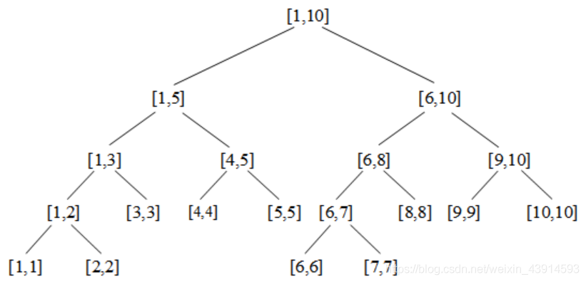

考查每个线段\[L, R\]，L是左端，R是右端。

1. L = R，说明这个结点只有一个元素，它是一个叶子结点。
2. L < R，说明这个结点代表的不只一个点，那么它有两个儿子，左儿子区间是\[L, M\]，右儿子区间是\[M+1, R\]，其中M = (L + R) / 2。例如：L = 1，R = 5，M = 3，左儿子是\[1, 3\]，右儿子是\[4, 5\]。

线段树是二叉树，一个区间每次折一半往下分，包含n个元素的线段树，最多分logn次就到达最低层。需要查找一个点或者区间的时候，顺着结点往下找，最多logn次就能找到。

结点所表示的“线段”的值，可以是区间和、最值或者其他根据题目灵活定义的值。

### 二叉树的实现

编码时，可以定义标准的二叉树数据结构；在竞赛中一般用静态数组实现的满二叉树，虽然比较浪费空间，但是编码稍微简单一点。

下面给的代码，都用静态分配的tree\[\]。父结点和子结点之间的访问非常简单，缺点是最后一行有大量结点被浪费。

```cpp
//定义根结点是tree[1]，即编号为1的结点是根
//（1）第一种方法：定义二叉树数据结构
struct{
    int L, R, data;             //用tree[i].data记录线段i的最值或区间和
}tree[MAXN*4];                  //分配静态数组，开4倍大
//（2）第二种方法：直接用数组表示二叉树，更节省空间
int tree[MAXN*4];	             //用tree[i]记录线段i的最值或区间和
//以上两种方式，都满足下面的父子关系。结点p是父，结点ls(p)是左儿子，rs(p)是右儿子
int ls(int x){ return x<<1;  }     //左儿子，编号是 p*2
int rs(int x){ return x<<1|1;}     //右儿子，编号是 p*2+1
```

注意，二叉树的空间需要开MAXN*4，即元素数量的4倍，下面说明原因。假设有一棵处理n个元素（叶子结点有n个）的线段树，且它的最后一层只有1个叶子，其他层都是满的；如果用满二叉树表示，它的结点总数是：最后一层有2n个结点（其中2n - 1个都浪费了没用到），前面所有的层有2n个结点，共4n个结点。空间的浪费是二叉树的本质决定的：它的每一层都按2倍递增。
建树的代码：

```cpp
void push_up(int p){                           //从下往上传递区间值
    tree[p] = tree[ls(p)] + tree[rs(p)];      //区间和
    //tree[p] = min(tree[ls(p)], tree[rs(p)]);//求最小值
}
void build(int p,int pl,int pr){           //结点编号p指向区间[pl, R]
    if(pl==pr){tree[p]=a[pl]; return; }    //最底层的叶子，存叶子的值
    int mid = (pl+pr) >> 1;                //分治：折半
    build(ls(p),pl,mid);                   //递归左儿子
    build(rs(p),mid+1,pr);                 //递归右儿子
    push_up(p);                            //从下往上传递区间值
}
```

**单点修改和区间修改**

如果只需修改一个元素（单点修改），直接修改叶子结点上元素的值，然后从下往上更新线段树，操作次数也是O(logn)。如果修改的是一个区间的元素（区间修改），需要用到lazy-tag技术。
单点修改包含于区间修改，后面几节给出区间修改的代码。

### 区间查询

**查询最值**

以数列{1, 4, 5, 8, 6, 2, 3, 9, 10, 7}为例。首先建立一棵用满二叉树实现的线段树，用于查询任意子区间的最小值。如下图所示，每个结点上圆圈内的数字是这棵子树的最小值。圆圈旁边的数字，例如根结点的"1:\[1,10\]"，1表示结点的编号，\[1,10\]是这个结点代表的元素范围，即第1到第10个元素。

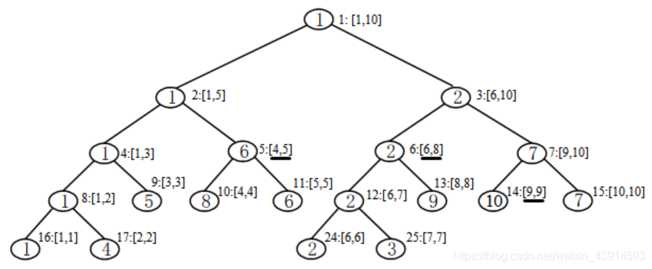

查询任意区间\[i, j\]的最小值。例如查区间\[4, 9\]的最小值，递归查询到区间`[4, 5]、[6, 8]、[9, 9]`，见图中画横线的线段，得最小值min{6, 2, 10} = 2。查询在O(logn)时间内完成。读者可以注意到，在这种情况下，线段树很像一个最小堆。

m次“单点修改+区间查询”的总复杂度是O(mlogn)。对规模100万的问题，也能轻松解决。

**查询区间和**

首先建立一棵用于查询{1, 4, 5, 8, 6, 2, 3, 9, 10, 7}区间和的线段树，每个结点上圆圈内的数字是这棵子树的和。

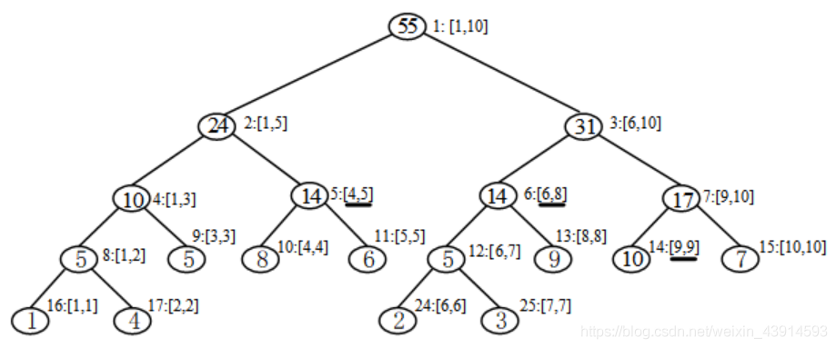

例如查区间\[4, 9\]的和，递归查询到区间`[4, 5]、[6, 8]、[9, 9]`，见图中画横线的线段，得sum{14, 14, 10} = 38。查询在O(logn)的时间内完成。

**区间查询代码**

下面以查询区间\[L, R\]的和为例，给出代码。查询递归到某个结点p（p表示的区间是\[pl, pr\]）时，有3种情况：

1. \[L, R\]完全覆盖了\[pl, pr\]，即L ≤ pl ≤ pr ≤ R，直接返回p的值即可。
2. \[L, R\]与\[pl, pr\]不相交，即 L > pr或者R < pl，退出。
3. \[L, R\]与\[pl, pr\]部分重叠，分别搜左右子结点。L < pr，继续递归左子结点，例如查询区间[4, 9]，与第2个结点[1, 5]有重叠，因为4 < 5。R > pl，继续递归右子结点，例如\[4, 9\]与第3个结点\[6, 10\]有重叠，因为9 > 6。

```cpp
int query(int L,int R,int p,int pl,int pr){             
    if(L<=pl && pr<=R) return tree[p];       //完全覆盖
    int mid = (pl+pr)>>1;
    if(L<=mid) res+=query(L,R,ls(p),pl,mid);   //L与左子节点有重叠  
    if(R>mid)  res+=query(L,R,rs(p),mid+1,pr); //R与右子节点有重叠
    return res;
}
//调用方式：query(L, R, 1, 1, n)
```

### 区间操作与lazy-tag

本节介绍线段树的核心技术“lazy-tag”，并给出“区间修改+区间查询”的模板。

在“树状数组”这一节，曾经以洛谷 3372题为例，用树状数组求解了“区间修改 + 区间查询”。本节用线段树求解，这是最标准的解法。

在树状数组这一节中，已经指出区间修改比单点修改复杂很多。最普通区间修改，例如对一个数列的\[L, R\]区间内每个元素统一加上d，如果在线段树上，一个个地修改这些元素，那么m次区间修改的复杂度是O(mnlogn)的。

解决的办法很容易想到，还是利用线段树的特征：线段树的结点tree\[i\]，记录了i这个区间的值。那么可以再定义一个tag\[i\]，用它统一记录i这个区间的修改，而不是一个个地修改区间内的每个元素，这个办法被称为“lazy-tag”。

lazy-tag（懒惰标记，或者延迟标记）。当修改的是一个线段区间时，就只对这个线段区间进行整体上的修改，其内部每个元素的内容先不做修改，只有当这个线段区间的一致性被破坏时，才把变化值传递给下一层的子区间。每次区间修改的复杂度是O(logn)的，一共m次操作，总复杂度是O(mlogn)的。区间i的lazy操作，用tag\[i\]记录。

下面举例说明区间修改函数update()的具体步骤。例如把\[4, 9\]区间内的每个元素加3，执行步骤是：

1. 左子树递归到结点5，即区间\[4, 5\]，完全包含在\[4, 9\]内，打标记tag\[5\] = 3，更新tree\[5\]为20，不再继续深入；
2. 左子树递归返回，更新tree\[2\]为30；
3. 右子树递归到结点6，即区间\[6, 8\]，完全包含在\[4, 9\]内，打标记tag\[6\]=3，更新tree\[6\]为23。
4. 右子树递归到结点14，即区间\[9, 9\]，打标记tag\[14\]=3，更新tree\[14\]=13；
5. 右子树递归返回，更新tree\[7\]=20；继续返回，更新tree\[3\]=43；
6. 返回到根节点，更新tree\[1\]=73。

详情见下图。

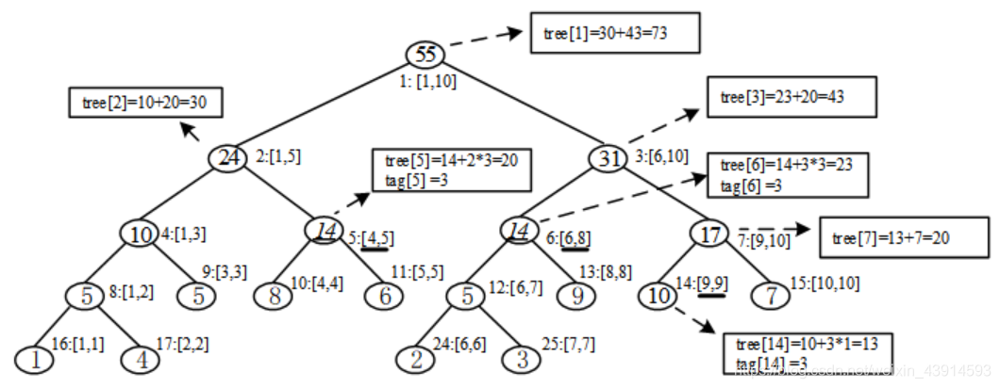

**push_down()**函数。在进行多次区间修改时，一个结点需要记录多个区间修改。而这些区间修改往往有冲突，例如做2次区间修改，一次是\[4, 9\]，一次是\[5, 8\]，它们都会影响5:\[4, 5\]这个结点。第一次修改\[4, 9\]覆盖了结点5，用tag\[5\]做了记录；而第二次修改\[5, 8\]不能覆盖结点5，需要再向下搜到结点11:\[5, 5\]，从而破坏了tag\[5\]，此时原tag\[5\]记录的区间统一修改就不得不往它的子结点传递和执行了，传递后tag\[5\]失去了意义，需要清空。所以lazy-tag的主要操作是解决多次区间修改，用push_down()函数完成。它首先检查结点p的tag\[p\]，如果有值，说明前面做区间修改时给p打了tag标记，接下来就把tag\[p\]传给左右子树，然后把tag\[p\]清零。

push_down()函数不仅在“区间修改”中用到，在“区间查询”中同样用到。

下面给出洛谷P3372的线段树代码，它是“区间修改+区间查询”的模板题。

注意代码中对二叉树的操作，特别是反复用到的变量pl和pr，它们是结点p所指向的原数列的区间位置\[pl, pr\]。p是二叉树的某个结点，范围是1 ≤ p ≤ MAXN*4；而pl、pr的范围是1 ≤ pl, pr ≤ n，n是数列元素的个数。用满二叉树实现线段树时，一个结点p所指向的\[pl, pr\]是确定的，也就是说，给定p，可以推算出它的\[pl, pr\]。

```cpp
//洛谷 P3372，线段树，区间修改 + 区间查询
#include<bits/stdc++.h>
using namespace std;
#define ll long long
const int MAXN = 1e5 + 10;
ll a[MAXN];      //记录数列的元素，从a[1]开始
ll tree[MAXN<<2];//tree[i]：第i个结点的值，表示一个线段区间的值，例如最值、区间和
ll tag[MAXN<<2]; //tag[i]：第i个结点的lazy-tag，统一记录这个区间的修改
ll ls(ll x){ return x<<1;  }     //定位左儿子：x*2
ll rs(ll x){ return x<<1|1;}     //定位右儿子：x*2 + 1
void push_up(ll p){              //从下往上传递区间值
    tree[p] = tree[ls(p)] + tree[rs(p)]; 
     //本题是区间和。如果求最小值，改为：tree[p] = min(tree[ls(p)], tree[rs(p)]);
}
void build(ll p,ll pl,ll pr){    //建树。p是结点编号，它指向区间[pl, pr]
    tag[p] = 0;                  //lazy-tag标记
    if(pl==pr){tree[p]=a[pl]; return;}  //最底层的叶子，赋值    
    ll mid = (pl+pr) >> 1;       //分治：折半
    build(ls(p),pl,mid);         //左儿子
    build(rs(p),mid+1,pr);       //右儿子
    push_up(p);                  //从下往上传递区间值
} 
void addtag(ll p,ll pl,ll pr,ll d){   //给结点p打tag标记，并更新tree
    tag[p] += d;                   //打上tag标记
    tree[p] += d*(pr-pl+1);        //计算新的tree
}
void push_down(ll p,ll pl,ll pr){     //不能覆盖时，把tag传给子树
    if(tag[p]){                       //有tag标记，这是以前做区间修改时留下的
        ll mid = (pl+pr)>>1; 
        addtag(ls(p),pl,mid,tag[p]);    //把tag标记传给左子树
        addtag(rs(p),mid+1,pr,tag[p]);  //把tag标记传给右子树
        tag[p]=0;                       //p自己的tag被传走了，归0
    }
}
void update(ll L,ll R,ll p,ll pl,ll pr,ll d){ //区间修改：把[L, R]内每个元素加上d
    if(L<=pl && pr<=R){  //完全覆盖，直接返回这个结点，它的子树不用再深入了    
        addtag(p, pl, pr,d);  //给结点p打tag标记，下一次区间修改到p这个结点时会用到
        return;                    
    }
    push_down(p,pl,pr);             //如果不能覆盖，把tag传给子树
    ll mid=(pl+pr)>>1;
    if(L<=mid) update(L,R,ls(p),pl,mid,d);    //递归左子树
    if(R>mid)  update(L,R,rs(p),mid+1,pr,d);  //递归右子树
    push_up(p);                               //更新
}
ll query(ll L,ll R,ll p,ll pl,ll pr){
           //查询区间[L,R]；p是当前结点（线段）的编号，[pl,pr]是结点p表示的线段区间
    if(pl>=L && R >= pr) return tree[p];       //完全覆盖，直接返回
    push_down(p,pl,pr);                        //不能覆盖，递归子树
    ll res=0;
    ll mid = (pl+pr)>>1;
    if(L<=mid) res+=query(L,R,ls(p),pl,mid);   //左子节点有重叠
    if(R>mid)  res+=query(L,R,rs(p),mid+1,pr); //右子节点有重叠
    return res;
}
int main(){
    ll n, m; scanf("%lld%lld",&n,&m);
    for(ll i=1;i<=n;i++)  scanf("%lld",&a[i]);
    build(1,1,n);                   //建树
    while(m--){
        ll q,L,R,d;
        scanf("%lld",&q);
        if (q==1){                   //区间修改：把[L,R]的每个元素加上d
           scanf("%lld%lld%lld",&L,&R,&d);
           update(L,R,1,1,n,d); 
        }
        else {                        //区间询问：[L,R]的区间和
           scanf("%lld%lld",&L,&R);
           printf("%lld\n",query(L,R,1,1,n));   
        }       
    }
    return 0;
}
```

下面把树状数组和线段树做个对比。

（1）时间复杂度。都是O(nlogn)，若时间限制为1秒，能解决MAXN = 10^6的问题。

（2）空间复杂度。树状数组定义了long long tree1\[MAXN\], tree2\[MAXN\]，空间为16M；线段树定义了long long a\[MAXN\], tree\[MAXN\*4\]，tag\[MAXN\*4\]，空间为72M。

具体的题目，可以根据情况选用树状数组和线段树。很多题目只能用线段树，如果两种都能用，建议先考虑用线段树。线段树的代码长很多，但是更容易理解、编码更清晰，做题时间更短。而树状数组的局限性很大，即使能用，也常常需要经过较难的思维转换，区间修改就是一个例子。

### 基础例题

???+note "[Can you answer these queries?](https://vjudge.net/problem/HDU-4027)"
    **题目描述：** 把区间内的每个数开平方；输出区间查询。
    
    **输入：** 有很多测试用例。每个用例的第一行是一个整数N，表示有N个数，1 <= N <= 100000。第二行包括N个整数Ei，Ei < 2^63。第三行是整数M，表示M个操作，1 <= M <= 100000。后面有M行，每行有三个整数T、X、Y，T=0表示修改，把\[X,Y\]区间的每个数开平方（开方结果向下取整）。T=1是查询，求\[X, Y\]的区间和。
    
    **输出：** 对每个用例，打印用例编号，然后对每个操作打印一行。

???+note "解题思路"
    标准的线段树区间修改是区间加或者区间最值，本题的修改是把区间每个数开方。
    
    如果按正规的区间修改，用lazy-tag标记区间，很难编码。注意本题的关键是开方计算，而一个数最多经过7次开方就变成了1，1继续开方仍保持1不变。利用这个特点，再结合线段树编码。
    
    编码：（1）一个区间内如果有数的开方结果不是1，则单独计算它；（2）一个区间的所有数减为1后，标记lazy-tag = 1，后面不再对这个区间做开方操作。具体编码的时候，不一定用到lazy-tag，直接判断区间和即可，如果区间和等于子树的叶子数，说明叶子的值都是1。
    
    复杂度：对N个数每个数开方7次，共7N次；再做M次修改和区间查询，复杂度O(MlogN)。总复杂度符合要求。

标准的线段树模板只有一种区间修改，一种区间查询，而竞赛题中一般出现的是同时有多种操作。下面的例题同时有三种区间修改，三种区间查询。

???+note "[Transformation](https://vjudge.net/problem/HDU-4578)"
    有n个整数，执行多种区间操作：
    
    add修改：区间内每个数加上c；
    
    multi修改：区间内每个数乘以c；
    
    change修改：区间内每个数统一改成c；
    
    sum求和：对区间内每个数的p次方求和，输出结果。1 <= p <= 3，即求和、平方和、立方和。

???+note "解题思路"
    此题有多种操作，每个操作如果单独编码，并不太难。但是题目要求同时做三种修改，并有三种求和询问，非常麻烦。
    
    三种修改add、multi、change，在结点上分别用三个lazy-tag标记。三个标记的关系是：

    1. 做change时，原有的add和multi标记失效（add=0, multi=1）；
    2. 做multi时，如果原有add标记，把add改为add*multi；
    3. pushdown时，先执行change，再multi，最后add。
    
    三种询问：求和sum1、平方和sum2、立方和sum3。对于change和multi标记，三种询问都容易计算。对于add标记，求和很容易，而平方和、立方和需要推理。
    
    1. 平方和。(𝑎+𝑐)^2^=𝑎^2^+𝑐^2^+2𝑎𝑐，即sum2\[new\] = sum2\[old\] + (R - L + 1)×c×c + 2×sum1×c，其中\[L, R\]是区间，sum2\[new\]和sum2\[old\]分别表示sum2的新值和旧值。
    2. 立方和。(𝑎+𝑐)^3^=𝑎^3^+𝑐^3^+3𝑐(𝑎^2^+𝑎𝑐)，即sum3\[new\] = sum3\[old\] + c×c×c + 3×c×(sum2\[old\] + sum\[old\]×c)。

线段树的结构是二分，在线段树上做二分查找很方便。

???+note "[Vases and Flowers](https://vjudge.net/problem/HDU-4614)"
    **题目描述：** Alice有N个花瓶，编号0 ~ N-1，一个花瓶中只能插一朵花。Alice经常收到很多花并插到花瓶中，她也经常清理花瓶。
    
    **输入：**第一行是整数T，表示测试样例数。对每个测试，第一行有两个整数N，M，1 < N, M < 50001，N是花瓶数量，M是Alice的操作次数。后面的M行，每行有3个整数，有两种操作：
    
    1 A F 收到F朵花，从第A个花瓶开始插，如果花瓶中原来有花，就跳过去插下一个花瓶，如果插到最后的花瓶花还没插完就丢弃。
    
    2 A B 清理从A到B的花瓶。
    
    **输出：** 对第1种操作，输出插入花瓶的第一个和最后一个位置，如果无法插入，输出“Can not put any one.”；对第2种操作，输出丢弃的花的数量。

???+note "解题思路"
    用线段树。把区间和定义为这个区间内插了花的花瓶的个数。
    
    第2种操作是标准的“区间求和+区间修改”，先查询\[A, B\]的区间和，输出丢弃的花的数量，然后区间更新，即把区间内所有数置零。
    
    第1种操作，关键是找到第一个和最后一个空花瓶。线段树本身是二分的结构，用二分法找。

    1. 找第一个空花瓶。在\[A, N-1\]区间内二分，找到第一个等于0的位置pos1。
    2. 找最后一个空花瓶。在\[pos1, N-1\]区间内，找到第F个0，就是最后一个位置pos2。
    3. 区间更新\[pos1, pos2\]，全部置1，表示都插了花。用lazy-tag标记。

在树状数组这一节介绍了离散化的小技巧，线段树中有同样的应用。

???+note "[Mayor's posters](http://poj.org/problem?id=2528)"
    **题目描述：** 有一个海报墙，从左到右共10000000个小块。上面贴了很多海报，这些海报的高度和墙的高度一样，长度不同。贴新海报时，它会覆盖原有的一些旧海报。问所有人贴完海报后，最后在海报墙上能看到多少张海报。注意覆盖的方法，例如海报总长度分成1~4块，海报\[1, 4\]、\[1, 2\]、\[3, 4\]，覆盖的是14，12，3~4块，后两张海报完全覆盖了第一张海报，最后能看到2张海报。

    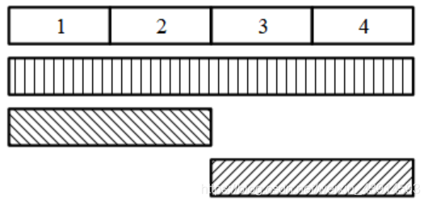

    **输入：** 第一行是数字c，表示测试用例数。每个测试的第一行是整数n，1 <= n <= 10000。后面 n 行，每行表示一张海报，其中第 i 行是2个整数 Li 和 Ri，表示海报所贴的左右位置，它覆盖墙上的区间\[Li, Ri\]。1 <= Li <= Ri <= 10000000。
    
    **输出：** 对每个测试，输出能看到的海报数量。

???+note "解题思路"
    用线段树求解，是标准的“区间修改+区间查询”。
    
    区间修改：第i次区间修改，把区间\[Li, Ri\]内的数字改为i，表示第i张海报。如果一个结点表示的区间是同一张海报，用lazy-tag标记。
    
    区间查询：暴力统计区间内有多少个不同的数字，一个数字是一张海报。可以用hash来分辨不同的数字：定义hash\[\]数组，过滤相同的数字。
    
    本题直接用题目给的\[Li, Ri\]来划分区间，会超内存。海报墙长度是MAXN = 10M，直接定义tree\[MAXN\*4\]、tag\[MAXN\*4\]，至少需要80M。
    
    观察到题目中只有n = 10000张海报，这10000张海报，只有20000个Li和Ri。用离散化的技巧可以大幅度减少空间，经离散化后MAXN = 20000 = 20k。
    
    离散化时需要注意本题的海报覆盖方法。例如先后贴3张海报\[1, 10000000\]、\[1, 500\]、\[7000, 10000000\]，最后能看到3张海报。其中有4个不同数字1、500、7000、10000000，如果简单地离散化成1、2、3、4，得到新海报\[1, 4\]、\[1, 2\]、\[3, 4\]，只能看到2张海报。错误的原因是把非连续的500、7000离散化成连续的2、3。
    
    正确的离散化方法是：做离散化操作时，如果相邻的数字不是连续的，那么这两个数离散化之后，它们之间应插一个数字。前面例子的正确离散化结果是\[1, 7\]、\[1, 3\]、\[5, 7\]，能看到3张海报。
    
    离散化常常用到几个STL函数：首先用sort()函数对所有的L、R排序，再用unique()函数去重，最后用lower_bound()函数所确定的相对位置作为离散化后的数字。

### 区间最值和区间历史最值

区间最值和区间历史最值问题也是线段树的常见考题，它考察一种特殊的情况，即同时做两种操作：修改区间最值、查询区间和。

修改区间最值而是指这样一类操作：给出三个数L、R、x，对区间\[L, R\]内的每个ai，修改为ai = max(ai, x)或ai = min(ai, x)。

上一节的基础例题都是对区间进行加减，然后再查询区间和，因为修改和查询是相关的，用lazy-tag处理起来很便利。但是对“区间修改最值 + 查询区间和”，能直接用lazy-tag吗？下面是一个模板题。

???+note "[Gorgeous Sequence](https://vjudge.net/problem/HDU-5306)"
    一个长度为n的序列{a1, a2, ..., an}，做m次操作，操作有三种：
    
    0 L R x 区间L ≤ i ≤ R内的每个ai，用min(ai, x)替换
    
    1 L R 打印L ≤ i ≤ R区间的最大值ai
    
    2 L R 打印L ≤ i ≤ R区间内所有ai的和
    
    数据范围：n, m ≤ 10^6^

???+note "解题思路"
    用线段树解题，肯定要用lazy-tag来实现高效的复杂度，这题如何设计？如果简单地用tag\[i\] = x表示结点i上的区间最值操作（题目中的0操作），但是它和查询区间和没有关系；如果定义一个tag2\[i\]来记录区间和，它又与修改区间最值没有直接关系。总之，修改区间最值和查询区间和没有直接联系，不能这么简单地处理。
    
    下面介绍一种区间最值的通用转化方法，复杂度O(mlogn)。这种方法定义了4个标记，把区间最值和区间和结合起来。
    
    对线段树的每个结点，定义4个标记：区间和sum、区间最大值ma、严格次大值se（初始值为 -1）、最大值个数t。下面演示它们是如何结合区间最值、区间和的。
    
    首先做区间最值的修改操作“0 L R x”，即用min(ai, x)替换区间\[L, R\]内的每个ai。根据\[L, R\]定位到线段树的结点，对区间的每个结点进行暴力搜索，搜到某个结点时，分3种情况：
    
    1. 当ma ≤ x时，这次修改不影响结点，退出；
    2. 当se < x < ma时，这次修改值影响最大值，更新sum = sum - t(ma - x) ，以及ma = x，然后打上标记后退出；
    3. 当se ≥ x 时，无法直接更新这个结点，递归它的左右儿子。

    上述算法的关键是严格次大值se，它起到了“剪枝”的作用。观察下面有10个叶子的线段树，圆圈内标记区间的最大值。如果一个结点的标记值和父亲的标记值相同，把标记删去，最后转化为右图。转化之后，线段树中只有n个标记，在有标记的结点中，父结点的标记值的都大于子树的标记值。维护区间次大值se，相当于维护子树的最大值。检查到某个结点i时，若x大于i的子结点标记值，不用深入；若小于，则需要DFS深入。

    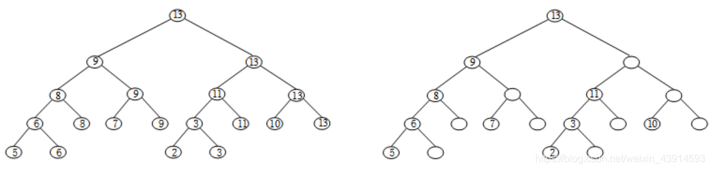

    最大值和严格次大值的关系
    
    这个算法的复杂度是多少？做一次查询最大值操作“1 L R”或查询区间和操作“2 L R”，显然是O(logn)的，下面讨论做一次修改区间最值时的复杂度。
    
    1. 极端情况1：x比所有元素都大。不用做任何修改，复杂度O(1)。这体现了最大值ma的作用。
    2. 极端情况2：x比所有元素都小，区间是全局，L=1，R = n。此时需要更新所有结点的ma = x，复杂度O(nlogn)，然后置所有结点的se = -1。看起来在这种极端情况下复杂度很高，但是如果再做一次更小x的全局修改，由于se = -1，不再需要递归子结点，复杂度O(1)。这体现了严格次大值se的作用。
    3. 一般情况。一次区间修改搜到的结点，根据前面对se的讨论，平均是O(logn)的。
    
    m次操作，总复杂度约为O(mlogn)。下面的代码重现了上面的解释

???+note "参考代码"

    ```cpp
    #include<bits/stdc++.h>
    using namespace std;
    #define ll long long
    const int MAXN = 1e6 + 10;
    ll sum[MAXN << 2], ma[MAXN << 2], se[MAXN << 2], num[MAXN << 2];//num:区间的最大值个数
    ll ls(ll x){ return x<<1;  }     
    ll rs(ll x){ return x<<1|1;}      
    void pushup(int p) {                     //从下往上传递
        sum[p] = sum[ls(p)] + sum[rs(p)];    //传递区间和
        ma[p] = max(ma[ls(p)], ma[rs(p)]);   //传递区间最大值
        if (ma[ls(p)] == ma[rs(p)]) {      
            se[p] = max(se[ls(p)], se[rs(p)]);
            num[p] = num[ls(p)] + num[rs(p)];
        }
        else {       
            se[p] = max(se[ls(p)],se[rs(p)]);
            se[p] = max(se[p],min(ma[ls(p)], ma[rs(p)]));
            num[p] = ma[ls(p)] > ma[rs(p)] ? num[ls(p)] : num[rs(p)];
        }
    }
    void build(int p, int pl, int pr) {
        if (pl == pr) {         //叶子
            scanf("%lld", &sum[p]);
            ma[p] = sum[p];  se[p] = -1;  num[p] = 1;
            return;
        }
        ll mid = (pl+pr) >> 1;       
        build(ls(p),pl,mid);         
        build(rs(p),mid+1,pr);       
        pushup(p);
    }
    void addtag(int p, int x) {
        if (x >= ma[p])    return;
        sum[p] -= num[p] * (ma[p] - x);
        ma[p] = x;
    }
    void pushdown(int p) {
        addtag(ls(p), ma[p]);  //把标记传给左子树
        addtag(rs(p), ma[p]);  //把标记传给左子树    
    }
    void update(int L, int R, int p, int pl, int pr, int x) {
        if (x >= ma[p])   return;     //情况（1）
        if (L<=pl && pr<=R && se[p] < x) { addtag(p, x); return;}  //情况（2）
        pushdown(p);                  //情况（3）
        ll mid = (pl+pr) >> 1;       
        if (L<=mid)   update(L, R, ls(p), pl, mid, x);
        if (R>mid)    update(L, R, rs(p), mid+1, pr, x);
        pushup(p);
    }
    int queryMax(int L, int R, int p, int pl, int pr) {
        if (pl>=L && R >= pr)  return ma[p];
        pushdown(p);
        int res = 0;
        ll mid = (pl+pr) >> 1;       
        if (L<=mid)   res = queryMax(L, R, ls(p), pl, mid);
        if (R>mid)    res = max(res, queryMax(L, R, rs(p), mid+1, pr));
        return res;
    }
    ll querySum(int L, int R, int p, int pl, int pr) {
        if (L <= pl && R >= pr)   return sum[p];    
        pushdown(p);
        ll res = 0;
        ll mid = (pl+pr) >> 1;       
        if (L<=mid)   res += querySum(L, R, ls(p), pl, mid);
        if (R>mid)    res += querySum(L, R, rs(p), mid+1, pr);
        return res;
    }
    int main(){
        int T;   scanf("%d", &T);
        while (T--) {
            int n,m; scanf("%d%d", &n, &m);
            build(1, 1, n);
            while (m--) {
                int q, L, R, x;
                scanf("%d%d%d", &q, &L, &R);
                if (q == 0){ scanf("%d", &x); update(L, R, 1, 1, n, x);}
                if (q == 1)  printf("%d\n", queryMax(L, R, 1, 1, n));
                if (q == 2)  printf("%lld\n", querySum(L, R, 1, 1, n));
            }
        }
        return 0;
    }
    ```
上面介绍了区间最值的基本题，包括修改最值和查询区间和，在这个基础上可以扩展更多的问题，例如：

1. 增加区间修改，把区间统一加上d；
2. 区间最值修改包括最小值、最大值；
3. 给出两个数列A和B，分别修改区间最值，然后求A、B的区间和。

### 区间合并

线段树非常适合做区间合并。

线段树的兄弟结点之间有相邻关系，这个特性方便线段树做区间合并操作。观察“线段\[1, 10\]的线段树结构”，发现同一个父结点的左右两个子结点，它们所代表的区间是是相邻的。例如结点4:\[1, 3\]和兄弟结点5:\[4, 5\]，它们的区间是相邻的；又例如结点12:\[6, 7\]和兄弟结点13:\[8, 8\]是相邻的。利用这个特性，在需要合并区间的时候，只需要从根结点往子树方向深入，就能确定相邻的区间。

???+note "[Tunnel Warfare](https://vjudge.net/problem/HDU-1540)"
    在一条线上有连续的n个村庄，两个相邻的村庄之间用地道连接。做m次操作，n, m ≤ 50,000。
    
    操作有三种：
    
    D x 第x个村庄被毁，它的地道也一同被毁
    
    Q x 查询第x个村庄所能到达的村庄总数（包括村庄x）
    
    R 重建刚才被毁的村庄

???+note "解题思路"
    这个简单题解释了线段树的区间合并如何实现。
    
    把村庄抽象成一个数，正常值为1，被破坏后变成0，题目转换为求最长连续1的个数。第x个村庄所连接的村庄，分为两部分：它左边的能到达的 + 它右边能到达的。
    
    用线段树的“单点修改+区间询问”解题。线段树的结点维护2个信息：
    
    1. 前缀最长1序列。从区间左端点开始的最大连续个数，用pre\[\]记录。
    2. 后缀最长1序列。从区间右端点开始往左的最大的连续个数，用suf\[\]记录。

    下面的图演示了区间合并，左图是线段树的一个父结点和左右儿子，右图是它们的合并关系。

    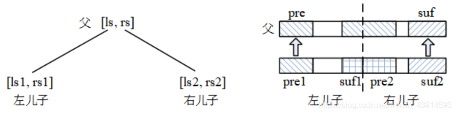

    右图中pre、suf是父结点的，pre1、suf1是左儿子的，pre2、suf2是右儿子的。它们的合并有以下关系：

    1. 若左儿子和右儿子都不满1，有：pre = pre1，suf = suf2；
    2. 若左儿子全是1，那么父结点的pre = 左儿子长度 + pre2；
    3. 若右儿子全是1，那么父结点的suf = pre1 + 右儿子长度。

???+note "参考代码"

    ```cpp
    #include<bits/stdc++.h>
    using namespace std;
    const int N = 50010;
    int ls(int x){ return x<<1;  }    
    int rs(int x){ return x<<1|1;}   
    int tree[N<<2], pre[N<<2], suf[N<<2];  //tree:记录元素的值；pre:前缀1的个数；suf：后缀1的个数
    int history[N];                        //记录村庄被毁的历史
    void push_up(int p,int len){           //len是结点p的长度
        pre[p]=pre[ls(p)];                 //父结点接收子结点的前缀信息
        suf[p]=suf[rs(p)];
        if(pre[ls(p)]==(len-(len>>1)))  pre[p]=pre[ls(p)]+pre[rs(p)]; //左儿子都是1
        if(suf[rs(p)]==(len>>1))        suf[p]=suf[ls(p)]+suf[rs(p)]; //右儿子都是1
    }
    void build(int p, int pl,int pr){
        if(pl==pr){tree[p]=pre[p]=suf[p]=1;  return;}
        int mid = (pl+pr) >> 1;
        build(ls(p),pl,mid);     
        build(rs(p),mid+1,pr);
        push_up(p,pr-pl+1);
    }
    void update(int x, int c, int p, int pl, int pr){
        if(pl==pr){ tree[p]=suf[p]=pre[p]=c; return; }   //更新叶子结点信息
        int mid=(pl+pr)>>1;
        if(x<=mid)    update(x,c,ls(p),pl,mid);
        else            update(x,c,rs(p),mid+1,pr);
        push_up(p,pr-pl+1);
    }
    int query(int x,int p,int pl,int pr){
        if(pl==pr)   return tree[p];    //返回叶子的值
        int mid=(pl+pr)>>1;
        if(x<=mid){                   //左子树
            if(x + suf[ls(p)] > mid)   return suf[ls(p)] + pre[rs(p)];
            else                       return query(x,ls(p),pl,mid);
        }
        else{                           //右子树
            if(mid + pre[rs(p)] >= x)  return pre[rs(p)] + suf[ls(p)];
            else                       return query(x,rs(p),mid+1,pr);
        }
    }
    int main(){
        int n,m,x,tot;   
        while(scanf("%d%d",&n,&m)>0)    {
            build(1, 1,n);
            tot=0;
            while(m--){
                char op[10]; scanf("%s",op);
                if(op[0]=='Q'){scanf("%d",&x);  printf("%d\n",query(x,1,1,n));}
                else if(op[0]=='D'){
                    scanf("%d",&x);
                    history[++tot]=x;            //记录毁灭的历史
                    update(x,0,1,1,n);
                }
                else {x=history[tot--]; update(x,1,1,1,n); }   //重建
            }
        }
    }
    ```

* * *

???+note "[Hotel](http://poj.org/problem?id=3667)"
    **题目描述：** 旅馆有n个连续的房间，编号从1到n。m个操作，操作有两种：
    
    1 D 入住。查询数量为D的连续房间，并且要最靠左，能找到的话返回这个区间的左端点并占用这些房间，找不到返回0
    
    2 X D 退房。从房间X开始，退出连续长度为D的房间
    
    **题解：** 此题与上一题差不多，用线段树维护最大连续区间长度，区间长度就是对应的房间数目，对应区间中最左边的端点是答案。定义pre维护前缀区间的最大长度，定义suf维护后缀区间的最大长度，定义sum维护最大连续区间长度。

* * *

???+note "[Sequence operation](https://vjudge.net/problem/HDU-3397)"
    **题目描述：** 一个包含n个字符的序列，字符都是'0'、'1'。有5种操作：
    
    修改操作：
    
    0 a b 把区间\[a , b\]所有字符改成'0'
    
    1 a b 把区间\[a , b\]所有字符改成'1'
    
    2 a b 把区间\[a , b\]内所有'1'改成'0'，'1'改成'0'
    
    输出操作Output operations:
    
    3 a b 输出\[a, b\]内'1'的个数
    
    4 a b 输出\[a , b\]中最长的连续'1'字符串的长度

    **题解** （1）对修改操作，这样定义第i个结点的lazy-tag：
    
    tag\[i\]\[0\] = 1：置0操作，向下传递时将左右区间全部赋值为0
    
    tag\[i\]\[1\] = 1：置1操作，向下传递时将左右区间全部赋值为1
    
    tag\[i\]\[2\] = 1：取反操作，向下传递时将左右区间的0变为1， 1变为0
    
    比较特殊的是取反操作。在结点i上，如果已经有置0或置1的tag标记，说明当前区间是全0或全1，但是因为lazy-tag，还没有传递给子孙，则把结点的tag\[\]\[0\]、tag\[\]\[1\]的值取反即可。如果没有置0值1标记，只有取反标记，把tag\[i\]\[2\]和1异或即可。
    
    （2）查询操作3就是查询区间和；查询操作4，与上一个例题一样，定义前缀最长1序列pre和后缀最长1序列suf。

### 扫描线

扫描线算法是线段树的经典应用，它能解决这些几何问题：矩形面积、矩形周长、多边形面积。

???+note "[Atlantis](https://vjudge.net/problem/HDU-1542)"
    **题目描述：** 平面上有一些矩形，它的边都平行于坐标轴。求它们的总面积，重叠的部分只算一次。
    
    **输入：** 有很多组测试，每组测试的第一行是整数n，后面有n行（1 ≤ n≤ 100），每行用4个实数定义一个矩形：x1，y1，x2，y2 (0 ≤ x1 < x2 ≤ 100000; 0 ≤ y1 < y2 ≤ 100000)，(x1, y1)是矩形左下角，(x2, y2)是右上角。输入以一个单独的0结束。
    
    **输出：**对每个测试，输出矩形总面积。

???+note "解题思路"
    用暴力法求总面积：先单独求每个矩形的面积，然后把所有矩形的面积加起来，最后减去任意两个矩形的交集。求矩形交集很花时间，需要两两配对，复杂度𝑂(𝑛^2)。
    
    下面用新的方法求面积。图7左图是两个矩形S、T，按从下到上的顺序（也可以从左到右），把两个矩形转为A、B、C三个新矩形，见中间的图，总面积 = A + B + C，这三个矩形没有重叠。通过这个转换，把复杂的重叠问题转化为无重叠的求和问题。

    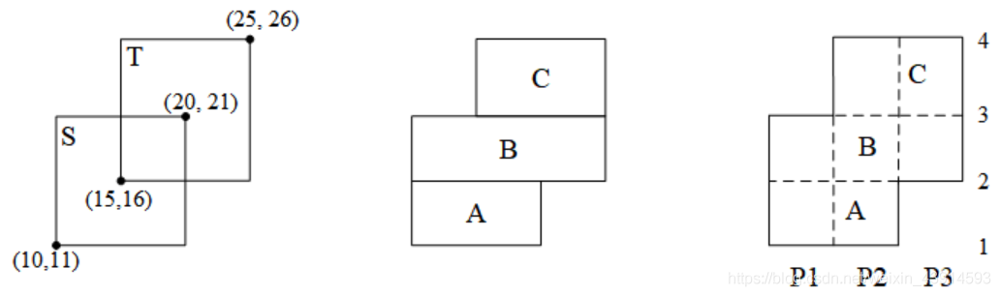

    如何求A、B、C的面积？矩形面积 = 宽 × 高，它们的高很容易知道，原来的两个矩形的4个顶点，把它们的4个y坐标相减，就是A、B、C的高，例如A的高是16 - 11 = 5，B的高是21 - 16 = 5。
    
    比较麻烦的是求A、B、C的宽。能根据原矩形S、T的参数进行计算吗？此时需要引进“入边、出边”的概念，矩形S的“入边”是它下面的边，“出边”是它上面的边。也就是说，遇到一个入边，就进入了一个矩形，遇到一个出边，就离开了一个矩形。对照图7的右图，矩形S的入边是第1条边，出边是第3条边；矩形T的入边是2，出边是4。
    
    在右图中，用P1、P2、P3记录从左到右的三个线段长度，有A宽 = P1 + P2，B宽 = P1 + P2 +P3，C宽 = P2 +P3。求A、B、C的宽，实际上就是判断什么时候用P1、P2、P3来计算。
    
    定义标志Tag1、Tag2、Tag3，分别用来判断是否用P1、P2、P3计算宽度。Tag的初值为0，当遇到入边时，Tag加1，遇到出边，Tag减1。当Tag > 0时，说明在矩形内部，是有效面积，P应该用于计算宽度。
    
    例如P1，从第一条边开始往上走：遇到边1，是入边，Tag1 = 1，说明P1对计算A的宽有效；走到边2，边2不在P1范围内，Tag1不变，P1对计算B的宽仍然有效；边3是出边，Tag1 = 0，P1对计算C的宽无效。
    
    再例如P2，遇到边1，是入边，Tag2 = 1，对计算A有效；走到边2，是入边，Tag2=2，对计算B有效；走到边3，是出边，Tag2 = 1，对计算C有效；走到边4，是出边，Tag2 = 0，不再用于计算。
    
    得到T值，就能计算A、B、C的宽。从第一条边往上走，逐个判断每条边。

    1. 求A的宽。到达边1，是入边，有Tag1 = Tag2 = 1，则A宽 = P1 + P2。
    2. 求B的宽。到达边2，是入边，有Tag1 = 1，Tag2 = 2，Tag3 = 1，则B宽 = P1 + P2 +P3。
    3. 求C的宽。到达边3，是出边，有Tag1 = 0，Tag2 = 1，Tag3 = 1，则C宽 = P2 +P3。
    4. 到达边4，是出边，有Tag1 = 0，Tag2 = 0，Tag3 = 0，说明没有矩形了。
    
    整个算法，就是用扫描线从低到高扫过所有矩形，每次扫描都计算其中一层的面积，被称为“扫描线算法”。上面给的矩形例子比较简单，读者可以画一个更复杂的图验证正确性。
    
    以上模型，如何用线段树实现？线段树的一个结点表示一个区间范围，而前图的宽度计算是P1、P2、P3的组合，相当于是区间和。把它画成下面的样子：

    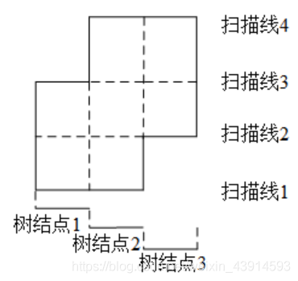

    把P1、P2、P3看成线段树的叶子结点，从最下面的第一条线开始往上扫描。一根扫描线，就是线段树的一个结点，结点的值是区间和，就是这条扫描线对应的新矩形的宽度。概况地说，“如果扫到的边是某矩形的入边，则往区间插入这条线段；如果扫到的边是某矩形的出边，则往区间删除这条线段”。
    
    “扫描线算法”用线段树解题需要做离散化。图8中的“树结点1、树结点2、...”是线段树的叶子结点，也就是说，原来的长度“P1、P2、...”在线段树中被处理成了“块”，用“1, 2, ...”编号即可。
    
    算法的复杂度是O(mlogn)。编码时：
    
    1. 读取所有的矩形，记录入边和出边；
    2. 对所有的边按y轴排序，确定扫描的顺序；
    3. 对x轴做离散化；
    4. 按从低到高的顺序，用每个扫描线的线段更新线段树，每个结点的值是这一层扫描线确定的新矩形面积；
    5. 对所有新矩形求和。
    
    下面是hdu 1542的代码，它完全重现了上面的解释。注意离散化常用的三个STL函数：sort()、unique()、lower_bound()。

???+note "参考代码"

    ```cpp
    #include<bits/stdc++.h>
    using namespace std;
    int ls(int x){ return x<<1;  }   
    int rs(int x){ return x<<1|1;}    
    const int MAXN = 20005;
    int Tag[MAXN];         //标志：线段是否有效，能否用于计算宽度
    double length[MAXN];   //存放区间i的总宽度
    double xx[MAXN];       //存放x坐标值，下标用lower_bound查找
    struct ScanLine{       //定义扫描线
        double y;                       //边的y坐标
        double right_x,left_x;          //边的x坐标:右、左
        int inout;                      //入边为1，出边为-1
        ScanLine(){}
        ScanLine(double y,double x2,double x1,int io):y(y),right_x(x2),left_x(x1),inout(io){}
    }line[MAXN];
    bool cmp(ScanLine &a,ScanLine &b) { return a.y<b.y; }   //y坐标排序
    void pushup(int p,int pl,int pr){          //从下往上传递区间值
        if(Tag[p]) length[p] = xx[pr]-xx[pl];//结点的Tag为正，这个线段对计算宽度有效。计算宽度。
        else if(pl+1 == pr)  length[p] = 0;    //叶子结点没有宽度
        else length[p] = length[ls(p)] + length[rs(p)];
    }
    void update(int L,int R,int io,int p,int pl,int pr){
        if(L<=pl && pr<=R){         //完全覆盖
            Tag[p] += io;             //结点的标志，用来判断能否用来计算宽度
            pushup(p,pl,pr);
            return;
        }
        if(pl+1 == pr) return;                  //叶子结点
        int mid = (pl+pr) >> 1;
        if(L<=mid)  update(L,R,io,ls(p),pl,mid);
        if(R>mid)   update(L,R,io,rs(p),mid,pr); //注意不是mid+1
        pushup(p,pl,pr);
    }
    int main(){    
        int n, t = 0;
        while(scanf("%d",&n),n){
            int cnt = 0;        //边的数量，包括入边和出边
            while(n--){ 
                double x1,x2,y1,y2; scanf("%lf%lf%lf%lf",&x1,&y1,&x2,&y2);//输入一个矩形
                line[++cnt] = ScanLine(y1,x2,x1,1);      //给入边赋值
                xx[cnt] = x1;                            //记录x坐标
                line[++cnt] = ScanLine(y2,x2,x1,-1);     //给出边赋值
                xx[cnt] = x2;                            //记录x坐标
            }
            sort(xx+1,xx+cnt+1);                         //对所有边的x坐标排序
            sort(line+1,line+cnt+1,cmp);                 //对扫描线按y轴方向从底到高排序
            int num = unique(xx+1,xx+cnt+1)-(xx+1); //离散化操作，用unique去重，返回个数
            memset(Tag,0,sizeof(Tag));
            memset(length,0,sizeof(length));              
            double ans = 0;
            for(int i=1;i<=cnt;++i) {                      //扫描所有入边和出边
                int L,R; 
                ans += length[1]*(line[i].y-line[i-1].y);//累加当前扫描线的面积。面积=宽*高
                L = lower_bound(xx+1,xx+num+1,line[i].left_x)-xx; 
                                            //x坐标离散化：用相对位置代替坐标值
                R = lower_bound(xx+1,xx+num+1,line[i].right_x)-xx;   
                update(L,R,line[i].inout,1,1,num);
            }
            printf("Test case #%d\nTotal explored area: %.2f\n\n",++t,ans);
        }
        return 0;
    }
    ```

下面是“矩形周长并”的模板题。

???+note "[Picture](https://vjudge.net/problem/HDU-1828)"
    **题目描述：** 在平面上有很多矩形，可以重叠，它们的边都平行于坐标轴。求所有矩形的并集的边界的长度。下面的左图是矩形，右边是周长。

    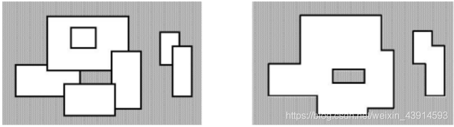

    **输入：** 第一行是整数n，表示矩形数量，后面有n行，每一行用4个整数表示一个矩形的左下角和右上角坐标。n<5000，坐标值范围[-10000,10000]，矩形面积都是正的。
    
    **输出：**矩形并的周长。


???+note "解题思路"
    周长问题和面积问题的思路差不多，但是要复杂一些，下面给出两种方法。
    
    （1）做两次扫描。容易想到：总周长 = 横线总长 + 竖线总长。然后用扫描线方法，从低到高扫横线，从左到右扫竖线，做两次扫描就得到了答案。
    
    以横线为例，将横线保存在一个表中，按y坐标排序（升序，从低到高扫描），另外每条横线带一个标记值，原矩形的入边（下边）为1，出边（上边）为-1，对应插入边和删除边。
    
    从低到高扫描横线，每扫到一条横线就计算这部分的横线值。在每个扫描线，“横线的长度 = 当前总区间被覆盖的长度与上一次总区间被覆盖长度之差的绝对值。”因为每添加一条边，如果没有使总区间覆盖长度发生变化，说明这条边在矩形内部，被包含了，不用计算；如果引起总区间长度发生变化，说明该边不被包含，应该计算。
    
    另外，一个矩形的入边（下边）和出边（上边），都应该被计算。上面提到的横线计算方法，“当前总区间长度与上一次总区间长度的差的绝对值”，仍可以用于同一个矩形的入边和出边的计算。当扫描到一个矩形的出边时，要在当前区间中去掉入边，这相当于恢复了出边的计算。如果不能理解，请参考下面的例子。
    
    下图是两个矩形A、B求横线的例子。

    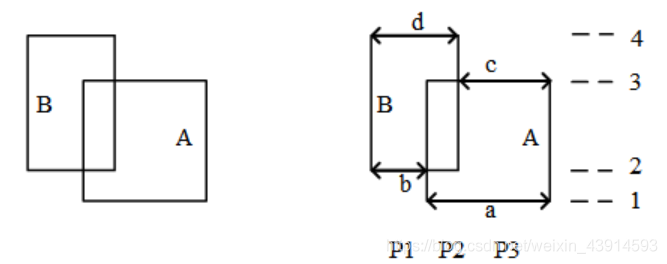

    从低到高扫描横线
    
    第1条扫描线，是矩形A的入边，插入这个边，现在的总区间是P2 + P3，横线长度 = |P2 + P3| = a；
    
    第2条扫描线，是矩形B的入边，插入这个边，现在的总区间是P1 + P2 + P3，横线长度 = |P1 + P2 + P3 - (P2 + P3)| = P1 = b；
    
    第3条扫描线，是矩形A的出边，删除这个边，现在的总区间是P1 + P2，横线长度 = |P1 + P2 - (P1 + P2 + P3)| = P3 = c；
    
    第4条扫描线，是矩形B的出边，删除这个边，现在的总区间是0，横线长度 = |0 - (P1+P2)| = d。
    
    横线的和 = a + b + c + d。
    
    同理可以计算竖线。
    
    （2）做一次扫描。其实不用做两次扫描，做一次就够了，在扫描横线的同时，计算竖线。
    
    把横线保存在一个表中，按y坐标排序，然后从下往上扫描所有横线。每扫描一条横线，都计算出两种值，一种是横线，一种是竖线。计算横线部分的方法和第（1）种方法一样。如何计算竖线部分?首先，一个矩形的一条入边有2条竖线，添加出边则不会产生竖线；其次，如果两个矩形的入边是连在一起的（矩形重叠），那么也只会产生2条竖线，而不是4条。
    
    这些竖线的长度是是“下一条横线的高度-现在这条横线的高度”。
    
    下面的例子给出了详细解释。

    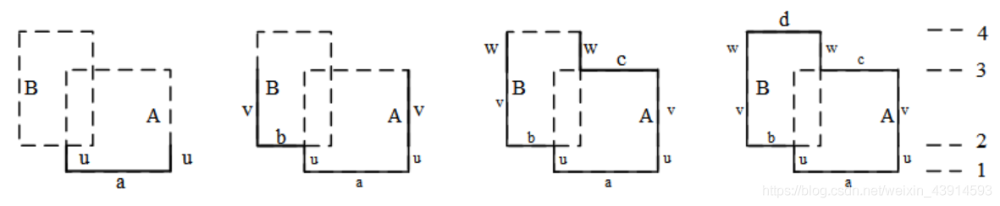

    扫描求周长
    
    上图左边给出了两个矩形A、B，从低到高有4条横线。定义num：当前区间有num条独立的边，竖线是2*num个。每增加一条入边有num += 1，每合并一条入边有num -=1，每增加一条出边num -=1。定义sum为总周长。
    
    从低到高扫描横线：
    
    （1）第1条扫描线。增加了一条入边a（a的计算见前面的分析）；num = 1，竖边个数2*num = 2，竖边是2个u。总周长sum = a + 2u。
    
    （2）第2条扫描线。增加了入边b，b和a是合在一起的，所以num = 1保持不变，新的2个竖边是v。更新总周长sum = sum + b + 2v。
    
    （3）第3条扫描线。增加了出边c，c是出边，与入边相减后，还剩下b边，所以num = 1，新的2个竖边是w。更新周长sum = sum + c +2w。
    
    （4）第4条扫描线。增加出边d，num = 0。更新周长sum = sum + d。
    
    下面给出用线段树实现上述算法的代码，代码完全重现了前面的解释。大部分代码与前面求“矩形面积并”的代码一样。

???+note "参考代码"

    ```cpp
    #include<bits/stdc++.h>
    using namespace std;
    int ls(int x){ return x<<1;  }   
    int rs(int x){ return x<<1|1;}  
    const int MAXN = 200005;
    struct ScanLine {
        int l, r, h, inout;  //inout=1 下边, inout=-1 上边
        ScanLine() {}
        ScanLine(int a, int b, int c, int d) :l(a), r(b), h(c), inout(d) {}
    }line[MAXN];
    bool cmp(ScanLine &a, ScanLine &b) { return a.h<b.h; }   //y坐标排序
    bool lbd[MAXN << 2], rbd[MAXN << 2];//标记这个结点的左右两个端点是否被覆盖（0表示没有，1表示有）
    int num[MAXN << 2];    //这个区间有多少条独立的边
    int Tag[MAXN << 2];    //标记这个结点是否有效 
    int length[MAXN << 2]; //这个区间的有效宽度
    void pushup(int p, int pl, int pr) {
        if (Tag[p]) {                 //结点的Tag为正，这个线段对计算宽度有效  
            lbd[p] = rbd[p] = 1;
            length[p] = pr - pl + 1;
            num[p] = 1;               //每条边有两个端点
        }
        else if (pl == pr) length[p]=num[p]=lbd[p]=rbd[p]=0;//叶子结点 
        else {     
            lbd[p] = lbd[ls(p)];      // 和左儿子共左端点
            rbd[p] = rbd[rs(p)];      //和右儿子共右端点
            length[p] = length[ls(p)] + length[rs(p)];
            num[p] = num[ls(p)] + num[rs(p)];
            if (lbd[rs(p)] && rbd[ls(p)]) num[p] -= 1;   //合并边
        }
    }
    void update(int L, int R, int io, int p, int pl, int pr) {
        if(L<=pl && pr<=R){    //完全覆盖
            Tag[p] += io;
            pushup(p, pl, pr);
            return;
        }
        int mid  = (pl + pr) >> 1;
        if (L<= mid) update(L, R, io, ls(p), pl, mid);
        if (mid < R) update(L, R, io, rs(p), mid+1, pr);
        pushup(p, pl, pr);
    }
    int main() {
        int n;
        while (~scanf("%d", &n)) {
            int cnt  = 0;
            int lbd = 10000, rbd = -10000;
            for (int i = 0; i < n; i++) {
                int x1, y1, x2, y2;
                scanf("%d%d%d%d", &x1, &y1, &x2, &y2);   //输入矩形
                lbd = min(lbd, x1);                      //横线最小x坐标
                rbd = max(rbd, x2);                      //横线最大x坐标
                line[++cnt] = ScanLine(x1, x2, y1, 1);   //给入边赋值
                line[++cnt] = ScanLine(x1, x2, y2, -1);  //给出边赋值
            }
            sort(line+1, line + cnt+1, cmp);    	   //排序。数据小，不用离散化 
            int ans = 0, last = 0;                     //last：上一次总区间被覆盖长度
            for (int i = 1; i <= cnt ; i++){           //扫描所有入边和出边
                if (line[i].l < line[i].r) 
                    update(line[i].l, line[i].r-1, line[i].inout, 1, lbd, rbd-1);
                ans += num[1]*2 * (line[i + 1].h - line[i].h);  //竖线
                ans += abs(length[1] - last);            //横线
                last = length[1];                 
            }
            printf("%d\n", ans);
        }
        return 0;
    }
    ```

### 二维线段树

    上一节“树状数组”介绍了二维的应用，并用平面几何进行了思维导引。本节介绍的二维线段树，不是一种平面二维几何的关系，而是“树套树”的结构。第一维线段树上的每个结点（代表了一个区间），都单独再建立一棵线段树，即第二维的线段树。
    
    如下图所示的例子，中间是第一维线段树，有7个结点（4个叶子），每个结点单独扩展一个线段树，见虚线圆圈，是第二维线段树。从这个图可以看出，它很耗费空间。设第一维有u个元素，建树需要4u个结点；第二维有v个元素，4v个结点；总结点数量是16uv。

    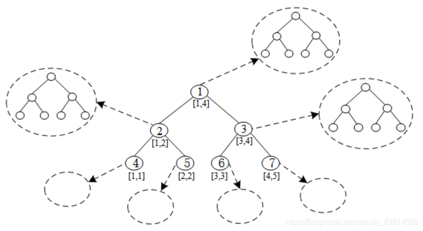

    二维线段树如何使用？设题目有两个限制条件x、y，那么用x建立第一维线段树，用y建立第二维线段树。查询同时满足两个区间\[xL, xR\]、\[yL, yR\]，首先在第一维线段树上查询区间\[xL, xR\]，找到符合条件的第一维结点，然后再查询第二维的线段树，找到\[yL, yR\]。显然，一次查询的复杂度是O(logu∙logv)的。

???+note "[Luck and Love](https://vjudge.net/problem/HDU-1823)"
    **题目描述：** 小w征婚，收到很多MM报名，小w想找到最有缘分的MM。
    
    **输入：** 有多个测试，第一个数字t，表示有t个操作，当t = 0时终止，接下来每行是一个操作。
    
    操作"I"，后面是一个MM的三个参数：整数H表示身高，浮点数A表示活泼度，浮点数L表示缘分。
    
    操作"Q"，后面跟着四个浮点数，H1、H2表示身高区间，A1、A2表示活泼度区间，输出符合身高和活泼度要求的MM中的缘分最高值。
    
    **输出：** 对每次询问，输出缘分最高值，若没有合适的，输出-1。
    
    数据范围：100 <= H1，H2 <= 200， 0.0 <= A1，A2，L <= 100.0

???+note "解题思路"
    暴力法：一次询问，逐个检查n个MM，找出符合身高和活泼度的，并记录其中缘分最大值，复杂度是O(n)；m次询问，复杂度是O(mn)。
    
    用“单点修改+区间查询”的二维线段树求解。二维线段树，第一维线段树是身高，第二维是活泼度。另外定义s[][]记录最大缘分，s\[i\]\[j\]表示第一维结点i、第二维结点j的最大缘分；因为结点i和j分别是身高区间和活泼度区间，所以查询适合的s\[\]\[\]就得到了答案。复杂度O(m(logn)2)。

???+note "参考代码"

    ```cpp
    #include<bits/stdc++.h>
    using namespace std;
    int ls(int x){ return x<<1;  }    
    int rs(int x){ return x<<1|1;} 
    int n=1000, s[1005][4005];      //s[i][j]：身高区间i，活泼区间j的最大缘分
    void subBuild(int xp, int p, int pl, int pr) {  //建立第二维线段树：活泼度线段树
        s[xp][p] = -1;
        if(pl == pr) return;
        int mid=(pl+pr)>>1;
        subBuild(xp, ls(p), pl, mid);
        subBuild(xp, rs(p), mid + 1, pr);    
    }
    void build(int p,int pl, int pr) {              //建立第一维线段树：身高线段树
        subBuild(p, 1, 0, n);
        if(pl == pr) return;
        int mid=(pl+pr)>>1;
        build(ls(p),pl, mid);
        build(rs(p),mid + 1, pr);    
    }
    void subUpdate(int xp, int y, int c, int p, int pl, int pr) {//更新第二维线段树
        if(pl == pr && pl == y) s[xp][p] = max(s[xp][p], c);
        else {
            int mid=(pl+pr)>>1;
            if(y <= mid) subUpdate(xp, y, c, ls(p), pl, mid);
            else subUpdate(xp, y, c, rs(p), mid + 1, pr);
            s[xp][p] = max(s[xp][ls(p)], s[xp][rs(p)]);
        }
    }
    void update(int x, int y, int c, int p, int pl, int pr){ //更新第一维线段树：身高x
        subUpdate(p, y, c, 1, 0, n);                         //更新第二维线段树：活泼度y
        if(pl != pr) {
            int mid=(pl+pr)>>1;
            if(x <= mid) update(x, y, c, ls(p), pl, mid);
            else update(x, y, c, rs(p), mid + 1, pr);
        }
    }
    int subQuery(int xp, int yL, int yR, int p, int pl, int pr) { //查询第二维线段树
        if(yL <= pl && pr <= yR) return s[xp][p];
        else {
            int mid=(pl+pr)>>1;
            int res = -1;
            if(yL <= mid) res = subQuery(xp, yL, yR, ls(p), pl, mid);
            if(yR >  mid) res = max(res, subQuery(xp, yL, yR, rs(p), mid + 1, pr));
            return res;
        }
    }
    int query(int xL, int xR, int yL, int yR, int p, int pl, int pr) {//查询第一维线段树
        if(xL <= pl && pr <= xR) return subQuery(p, yL, yR, 1, 0, n);  
                                        //满足身高区间时，查询活泼度区间
        else {                             //当前节点不满足身高区间
            int mid = (pl+pr)>>1;
            int res = -1;
            if(xL <= mid) res = query(xL, xR, yL, yR, ls(p), pl, mid);
            if(xR >  mid) res = max(res, query(xL, xR, yL, yR, rs(p), mid + 1, pr));
            return res;
        }
    }
    int main(){
        int t;
        while(scanf("%d", &t) && t) {        
            build(1,100, 200);
            while(t--) {
                char ch[2];
                scanf("%s", ch);
                if(ch[0] == 'I') {
                    int h;double c, d; scanf("%d%lf%lf", &h, &c, &d);
                    update(h, c * 10, d * 10, 1, 100, 200);
                } else {
                    int xL, xR, yL, yR; double c,d;
                    scanf("%d%d%lf%lf", &xL, &xR, &c, &d);
                    yL =  c * 10, yR = d * 10;                     //转整数
                    if(xL > xR) swap(xL, xR);
                    if(yL > yR) swap(yL, yR);
                    int ans = query(xL, xR, yL, yR, 1,100, 200);   //x：身高，y：活泼度
                    if(ans == -1) printf("-1\n");
                    else          printf("%.1f\n", ans / 10.0);
                }
            }
        }
        return 0;
    }
    ```

### 习题

基本题：

- [敌兵布阵](https://vjudge.net/problem/HDU-1166)
- [Just a Hook](https://vjudge.net/problem/HDU-1698)
- [Minimum Inversion Number](https://vjudge.net/problem/HDU-1394)
- [Billboard](https://vjudge.net/problem/HDU-2795)
- [Buy Tickets](http://poj.org/problem?id=2828)
- [Potted Flower](http://poj.org/problem?id=2750)
- [Lost Cows](http://poj.org/problem?id=2182)
- [Balanced Lineup](http://poj.org/problem?id=3264)

区间最值：

- [Matrix](https://darkbzoj.tk/problem/4695)
- [前进四](http://uoj.ac/problem/515)

历史最值：

- [CPU监控](https://darkbzoj.tk/problem/3064)

区间合并：

- [Memory Control](https://vjudge.net/problem/HDU-2871)
- [约会安排](https://vjudge.net/problem/HDU-4553)
- [Help with Intervals](http://poj.org/problem?id=3225)

扫描线：

- [Atlantis](https://vjudge.net/problem/HDU-1542)
- [Get The Treasury](https://vjudge.net/problem/HDU-3642)
- [覆盖的面积](https://vjudge.net/problem/HDU-1255)
- [Posters](https://vjudge.net/problem/HDU-3265)
- [Farming](https://vjudge.net/problem/HDU-3255)
- [Picture](http://poj.org/problem?id=1177)
- [Stars in Your Window](http://poj.org/problem?id=2482)
- [Brownie Points II](http://poj.org/problem?id=2464)

二维：

- [Mobile phones](http://poj.org/problem?id=1195)
- [Matrix](http://poj.org/problem?id=2155)

综合题：

- [Assign the task](https://vjudge.net/problem/HDU-3974)
- [The LCIS on the Tree](https://vjudge.net/problem/HDU-4718)
- [Boss Bo](https://vjudge.net/problem/HDU-5756)

## 线段树(OIWiki版本)

### 线段树的基本结构与建树

#### 过程

线段树将每个长度不为 $1$ 的区间划分成左右两个区间递归求解，把整个线段划分为一个树形结构，通过合并左右两区间信息来求得该区间的信息。这种数据结构可以方便的进行大部分的区间操作。

有个大小为 $5$ 的数组 $a=\{10,11,12,13,14\}$，要将其转化为线段树，有以下做法：设线段树的根节点编号为 $1$，用数组 $d$ 来保存我们的线段树，$d_i$ 用来保存线段树上编号为 $i$ 的节点的值（这里每个节点所维护的值就是这个节点所表示的区间总和）。

我们先给出这棵线段树的形态，如图所示：


图中每个节点中用红色字体标明的区间，表示该节点管辖的 $a$ 数组上的位置区间。如 $d_1$ 所管辖的区间就是 $[1,5]$（$a_1,a_2, \cdots ,a_5$），即 $d_1$ 所保存的值是 $a_1+a_2+ \cdots +a_5$，$d_1=60$ 表示的是 $a_1+a_2+ \cdots +a_5=60$。

通过观察不难发现，$d_i$ 的左儿子节点就是 $d_{2\times i}$，$d_i$ 的右儿子节点就是 $d_{2\times i+1}$。如果 $d_i$ 表示的是区间 $[s,t]$（即 $d_i=a_s+a_{s+1}+ \cdots +a_t$）的话，那么 $d_i$ 的左儿子节点表示的是区间 $[ s, \frac{s+t}{2} ]$，$d_i$ 的右儿子表示的是区间 $[ \frac{s+t}{2} +1,t ]$。

在实现时，我们考虑递归建树。设当前的根节点为 $p$，如果根节点管辖的区间长度已经是 $1$，则可以直接根据 $a$ 数组上相应位置的值初始化该节点。否则我们将该区间从中点处分割为两个子区间，分别进入左右子节点递归建树，最后合并两个子节点的信息。

#### 实现

此处给出代码实现，可参考注释理解：

=== "C++"
    ```cpp
    void build(int s, int t, int p) {
      // 对 [s,t] 区间建立线段树,当前根的编号为 p
      if (s == t) {
        d[p] = a[s];
        return;
      }
      int m = s + ((t - s) >> 1);
      // 移位运算符的优先级小于加减法，所以加上括号
      // 如果写成 (s + t) >> 1 可能会超出 int 范围
      build(s, m, p * 2), build(m + 1, t, p * 2 + 1);
      // 递归对左右区间建树
      d[p] = d[p * 2] + d[(p * 2) + 1];
    }
    ```

=== "Python"
    ```python
    def build(s, t, p):
        # 对 [s,t] 区间建立线段树,当前根的编号为 p
        if s == t:
            d[p] = a[s]
            return
        m = s + ((t - s) >> 1)
        # 移位运算符的优先级小于加减法，所以加上括号
        # 如果写成 (s + t) >> 1 可能会超出 int 范围
        build(s, m, p * 2); build(m + 1, t, p * 2 + 1)
        # 递归对左右区间建树
        d[p] = d[p * 2] + d[(p * 2) + 1]
    ```

关于线段树的空间：如果采用堆式存储（$2p$ 是 $p$ 的左儿子，$2p+1$ 是 $p$ 的右儿子），若有 $n$ 个叶子结点，则 d 数组的范围最大为 $2^{\left\lceil\log{n}\right\rceil+1}$。

分析：容易知道线段树的深度是 $\left\lceil\log{n}\right\rceil$ 的，则在堆式储存情况下叶子节点（包括无用的叶子节点）数量为 $2^{\left\lceil\log{n}\right\rceil}$ 个，又由于其为一棵完全二叉树，则其总节点个数 $2^{\left\lceil\log{n}\right\rceil+1}-1$。当然如果你懒得计算的话可以直接把数组长度设为 $4n$，因为 $\frac{2^{\left\lceil\log{n}\right\rceil+1}-1}{n}$ 的最大值在 $n=2^{x}+1(x\in N_{+})$ 时取到，此时节点数为 $2^{\left\lceil\log{n}\right\rceil+1}-1=2^{x+2}-1=4n-5$。

### 线段树的区间查询

#### 过程

区间查询，比如求区间 $[l,r]$ 的总和（即 $a_l+a_{l+1}+ \cdots +a_r$）、求区间最大值/最小值等操作。


仍然以最开始的图为例，如果要查询区间 $[1,5]$ 的和，那直接获取 $d_1$ 的值（$60$）即可。

如果要查询的区间为 $[3,5]$，此时就不能直接获取区间的值，但是 $[3,5]$ 可以拆成 $[3,3]$ 和 $[4,5]$，可以通过合并这两个区间的答案来求得这个区间的答案。

一般地，如果要查询的区间是 $[l,r]$，则可以将其拆成最多为 $O(\log n)$ 个 **极大** 的区间，合并这些区间即可求出 $[l,r]$ 的答案。

#### 实现

此处给出代码实现，可参考注释理解：

=== "C++"
    ```cpp
    int getsum(int l, int r, int s, int t, int p) {
      // [l, r] 为查询区间, [s, t] 为当前节点包含的区间, p 为当前节点的编号
      if (l <= s && t <= r)
        return d[p];  // 当前区间为询问区间的子集时直接返回当前区间的和
      int m = s + ((t - s) >> 1), sum = 0;
      if (l <= m) sum += getsum(l, r, s, m, p * 2);
      // 如果左儿子代表的区间 [s, m] 与询问区间有交集, 则递归查询左儿子
      if (r > m) sum += getsum(l, r, m + 1, t, p * 2 + 1);
      // 如果右儿子代表的区间 [m + 1, t] 与询问区间有交集, 则递归查询右儿子
      return sum;
    }
    ```

=== "Python"
    ```python
    def getsum(l, r, s, t, p):
        # [l, r] 为查询区间, [s, t] 为当前节点包含的区间, p 为当前节点的编号
        if l <= s and t <= r:
            return d[p] # 当前区间为询问区间的子集时直接返回当前区间的和
        m = s + ((t - s) >> 1); sum = 0
        if l <= m:
            sum = sum + getsum(l, r, s, m, p * 2)
        # 如果左儿子代表的区间 [s, m] 与询问区间有交集, 则递归查询左儿子
        if r > m:
            sum = sum + getsum(l, r, m + 1, t, p * 2 + 1)
        # 如果右儿子代表的区间 [m + 1, t] 与询问区间有交集, 则递归查询右儿子
        return sum
    ```

### 线段树的区间修改与懒惰标记

#### 过程

如果要求修改区间 $[l,r]$，把所有包含在区间 $[l,r]$ 中的节点都遍历一次、修改一次，时间复杂度无法承受。我们这里要引入一个叫做 **「懒惰标记」** 的东西。

懒惰标记，简单来说，就是通过延迟对节点信息的更改，从而减少可能不必要的操作次数。每次执行修改时，我们通过打标记的方法表明该节点对应的区间在某一次操作中被更改，但不更新该节点的子节点的信息。实质性的修改则在下一次访问带有标记的节点时才进行。

仍然以最开始的图为例，我们将执行若干次给区间内的数加上一个值的操作。我们现在给每个节点增加一个 $t_i$，表示该节点带的标记值。

最开始时的情况是这样的（为了节省空间，这里不再展示每个节点管辖的区间）：


现在我们准备给 $[3,5]$ 上的每个数都加上 $5$。根据前面区间查询的经验，我们很快找到了两个极大区间 $[3,3]$ 和 $[4,5]$（分别对应线段树上的 $3$ 号点和 $5$ 号点）。

我们直接在这两个节点上进行修改，并给它们打上标记：


我们发现，$3$ 号节点的信息虽然被修改了（因为该区间管辖两个数，所以 $d_3$ 加上的数是 $5 \times 2=10$），但它的两个子节点却还没更新，仍然保留着修改之前的信息。不过不用担心，虽然修改目前还没进行，但当我们要查询这两个子节点的信息时，我们会利用标记修改这两个子节点的信息，使查询的结果依旧准确。

接下来我们查询一下 $[4,4]$ 区间上各数字的和。

我们通过递归找到 $[4,5]$ 区间，发现该区间并非我们的目标区间，且该区间上还存在标记。这时候就到标记下放的时间了。我们将该区间的两个子区间的信息更新，并清除该区间上的标记。


现在 $6$、$7$ 两个节点的值变成了最新的值，查询的结果也是准确的。

#### 实现

接下来给出在存在标记的情况下，区间修改和查询操作的参考实现。

区间修改（区间加上某个值）：

=== "C++"
    ```cpp
    void update(int l, int r, int c, int s, int t, int p) {
      // [l, r] 为修改区间, c 为被修改的元素的变化量, [s, t] 为当前节点包含的区间, p
      // 为当前节点的编号
      if (l <= s && t <= r) {
        d[p] += (t - s + 1) * c, b[p] += c;
        return;
      }  // 当前区间为修改区间的子集时直接修改当前节点的值,然后打标记,结束修改
      int m = s + ((t - s) >> 1);
      if (b[p] && s != t) {
        // 如果当前节点的懒标记非空,则更新当前节点两个子节点的值和懒标记值
        d[p * 2] += b[p] * (m - s + 1), d[p * 2 + 1] += b[p] * (t - m);
        b[p * 2] += b[p], b[p * 2 + 1] += b[p];  // 将标记下传给子节点
        b[p] = 0;                                // 清空当前节点的标记
      }
      if (l <= m) update(l, r, c, s, m, p * 2);
      if (r > m) update(l, r, c, m + 1, t, p * 2 + 1);
      d[p] = d[p * 2] + d[p * 2 + 1];
    }
    ```

=== "Python"
    ```python
    def update(l, r, c, s, t, p):
        # [l, r] 为修改区间, c 为被修改的元素的变化量, [s, t] 为当前节点包含的区间, p
        # 为当前节点的编号
        if l <= s and t <= r:
            d[p] = d[p] + (t - s + 1) * c
            b[p] = b[p] + c
            return
        # 当前区间为修改区间的子集时直接修改当前节点的值, 然后打标记, 结束修改
        m = s + ((t - s) >> 1)
        if b[p] and s != t:
            # 如果当前节点的懒标记非空, 则更新当前节点两个子节点的值和懒标记值
            d[p * 2] = d[p * 2] + b[p] * (m - s + 1)
            d[p * 2 + 1] = d[p * 2 + 1] + b[p] * (t - m)
            # 将标记下传给子节点
            b[p * 2] = b[p * 2] + b[p]
            b[p * 2 + 1] = b[p * 2 + 1] + b[p]
            # 清空当前节点的标记
            b[p] = 0
        if l <= m:
            update(l, r, c, s, m, p * 2)
        if r > m:
            update(l, r, c, m + 1, t, p * 2 + 1)
        d[p] = d[p * 2] + d[p * 2 + 1]
    ```

区间查询（区间求和）：

=== "C++"
    ```cpp
    int getsum(int l, int r, int s, int t, int p) {
      // [l, r] 为查询区间, [s, t] 为当前节点包含的区间, p 为当前节点的编号
      if (l <= s && t <= r) return d[p];
      // 当前区间为询问区间的子集时直接返回当前区间的和
      int m = s + ((t - s) >> 1);
      if (b[p]) {
        // 如果当前节点的懒标记非空,则更新当前节点两个子节点的值和懒标记值
        d[p * 2] += b[p] * (m - s + 1), d[p * 2 + 1] += b[p] * (t - m);
        b[p * 2] += b[p], b[p * 2 + 1] += b[p];  // 将标记下传给子节点
        b[p] = 0;                                // 清空当前节点的标记
      }
      int sum = 0;
      if (l <= m) sum = getsum(l, r, s, m, p * 2);
      if (r > m) sum += getsum(l, r, m + 1, t, p * 2 + 1);
      return sum;
    }
    ```

=== "Python"
    ```python
    def getsum(l, r, s, t, p):
        # [l, r] 为查询区间, [s, t] 为当前节点包含的区间, p为当前节点的编号
        if l <= s and t <= r:
            return d[p]
        # 当前区间为询问区间的子集时直接返回当前区间的和
        m = s + ((t - s) >> 1)
        if b[p]:
            # 如果当前节点的懒标记非空, 则更新当前节点两个子节点的值和懒标记值
            d[p * 2] = d[p * 2] + b[p] * (m - s + 1)
            d[p * 2 + 1] = d[p * 2 + 1] + b[p] * (t - m)
            # 将标记下传给子节点
            b[p * 2] = b[p * 2] + b[p]
            b[p * 2 + 1] = b[p * 2 + 1] + b[p]
            # 清空当前节点的标记
            b[p] = 0
        sum = 0
        if l <= m:
            sum = getsum(l, r, s, m, p * 2)
        if r > m:
            sum = sum + getsum(l, r, m + 1, t, p * 2 + 1)
        return sum
    ```

如果你是要实现区间修改为某一个值而不是加上某一个值的话，代码如下：

=== "C++"
    ```cpp
    void update(int l, int r, int c, int s, int t, int p) {
      if (l <= s && t <= r) {
        d[p] = (t - s + 1) * c, b[p] = c;
        return;
      }
      int m = s + ((t - s) >> 1);
      // 额外数组储存是否修改值
      if (v[p]) {
        d[p * 2] = b[p] * (m - s + 1), d[p * 2 + 1] = b[p] * (t - m);
        b[p * 2] = b[p * 2 + 1] = b[p];
        v[p * 2] = v[p * 2 + 1] = 1;
        v[p] = 0;
      }
      if (l <= m) update(l, r, c, s, m, p * 2);
      if (r > m) update(l, r, c, m + 1, t, p * 2 + 1);
      d[p] = d[p * 2] + d[p * 2 + 1];
    }
    
    int getsum(int l, int r, int s, int t, int p) {
      if (l <= s && t <= r) return d[p];
      int m = s + ((t - s) >> 1);
      if (v[p]) {
        d[p * 2] = b[p] * (m - s + 1), d[p * 2 + 1] = b[p] * (t - m);
        b[p * 2] = b[p * 2 + 1] = b[p];
        v[p * 2] = v[p * 2 + 1] = 1;
        v[p] = 0;
      }
      int sum = 0;
      if (l <= m) sum = getsum(l, r, s, m, p * 2);
      if (r > m) sum += getsum(l, r, m + 1, t, p * 2 + 1);
      return sum;
    }
    ```

=== "Python"
    ```python
    def update(l, r, c, s, t, p):
        if l <= s and t <= r:
            d[p] = (t - s + 1) * c
            b[p] = c
            return
        m = s + ((t - s) >> 1)
        if v[p]:
            d[p * 2] = b[p] * (m - s + 1)
            d[p * 2 + 1] = b[p] * (t - m)
            b[p * 2] = b[p * 2 + 1] = b[p]
            v[p * 2] = v[p * 2 + 1] = 1
            v[p] = 0
        if l <= m:
            update(l, r, c, s, m, p * 2)
        if r > m:
            update(l, r, c, m + 1, t, p * 2 + 1)
        d[p] = d[p * 2] + d[p * 2 + 1]
    
    def getsum(l, r, s, t, p):
        if l <= s and t <= r:
            return d[p]
        m = s + ((t - s) >> 1)
        if v[p]:
            d[p * 2] = b[p] * (m - s + 1)
            d[p * 2 + 1] = b[p] * (t - m)
            b[p * 2] = b[p * 2 + 1] = b[p]
            v[p * 2] = v[p * 2 + 1] = 1
            v[p] = 0
        sum = 0
        if l <= m:
            sum = getsum(l, r, s, m, p * 2)
        if r > m:
            sum = sum + getsum(l, r, m + 1, t, p * 2 + 1)
        return sum
    ```

### 动态开点线段树

前面讲到堆式储存的情况下，需要给线段树开 $4n$ 大小的数组。为了节省空间，我们可以不一次性建好树，而是在最初只建立一个根结点代表整个区间。当我们需要访问某个子区间时，才建立代表这个区间的子结点。这样我们不再使用 $2p$ 和 $2p+1$ 代表 $p$ 结点的儿子，而是用 $\text{ls}$ 和 $\text{rs}$ 记录儿子的编号。总之，动态开点线段树的核心思想就是：**结点只有在有需要的时候才被创建**。

单次操作的时间复杂度是不变的，为 $O(\log n)$。由于每次操作都有可能创建并访问全新的一系列结点，因此 $m$ 次单点操作后结点的数量规模是 $O(m\log n)$。最多也只需要 $2n-1$ 个结点，没有浪费。

单点修改：

```cpp
// root 表示整棵线段树的根结点；cnt 表示当前结点个数
int n, cnt, root;
int sum[n * 2], ls[n * 2], rs[n * 2];

// 用法：update(root, 1, n, x, f); 其中 x 为待修改节点的编号
void update(int& p, int s, int t, int x, int f) {  // 引用传参
  if (!p) p = ++cnt;  // 当结点为空时，创建一个新的结点
  if (s == t) {
    sum[p] += f;
    return;
  }
  int m = s + ((t - s) >> 1);
  if (x <= m)
    update(ls[p], s, m, x, f);
  else
    update(rs[p], m + 1, t, x, f);
  sum[p] = sum[ls[p]] + sum[rs[p]];  // pushup
}
```

区间询问：

```cpp
// 用法：query(root, 1, n, l, r);
int query(int p, int s, int t, int l, int r) {
  if (!p) return 0;  // 如果结点为空，返回 0
  if (s >= l && t <= r) return sum[p];
  int m = s + ((t - s) >> 1), ans = 0;
  if (l <= m) ans += query(ls[p], s, m, l, r);
  if (r > m) ans += query(rs[p], m + 1, t, l, r);
  return ans;
}
```

区间修改也是一样的，不过下放标记时要注意如果缺少孩子，就直接创建一个新的孩子。或者使用标记永久化技巧。

## 一些优化

这里总结几个线段树的优化：

-   在叶子节点处无需下放懒惰标记，所以懒惰标记可以不下传到叶子节点。

-   下放懒惰标记可以写一个专门的函数 `pushdown`，从儿子节点更新当前节点也可以写一个专门的函数 `maintain`（或者对称地用 `pushup`），降低代码编写难度。

-   标记永久化：如果确定懒惰标记不会在中途被加到溢出（即超过了该类型数据所能表示的最大范围），那么就可以将标记永久化。标记永久化可以避免下传懒惰标记，只需在进行询问时把标记的影响加到答案当中，从而降低程序常数。具体如何处理与题目特性相关，需结合题目来写。这也是树套树和可持久化数据结构中会用到的一种技巧。

## C++ 模板

??? "SegTreeLazyRangeAdd 可以区间加/求和的线段树模板"
    ```cpp
    --8<-- "docs/ds/code/seg/seg_4.hpp"
    ```

??? "SegTreeLazyRangeSet 可以区间修改/求和的线段树模板"
    ```cpp
    --8<-- "docs/ds/code/seg/seg_5.hpp"
    ```

## 例题

???+ note "[luogu P3372【模板】线段树 1](https://www.luogu.com.cn/problem/P3372)"
    已知一个数列，你需要进行下面两种操作：
    
    -   将某区间每一个数加上 $k$。
    -   求出某区间每一个数的和。
    
    ??? "参考代码"
        ```cpp
        --8<-- "docs/ds/code/seg/seg_1.cpp"
        ```

???+ note "[luogu P3373【模板】线段树 2](https://www.luogu.com.cn/problem/P3373)"
    已知一个数列，你需要进行下面三种操作：
    
    -   将某区间每一个数乘上 $x$。
    -   将某区间每一个数加上 $x$。
    -   求出某区间每一个数的和。
    
    ??? "参考代码"
        ```cpp
        --8<-- "docs/ds/code/seg/seg_2.cpp"
        ```

???+ note "[HihoCoder 1078 线段树的区间修改](https://cn.vjudge.net/problem/HihoCoder-1078)"
    假设货架上从左到右摆放了 $N$ 种商品，并且依次标号为 $1$ 到 $N$，其中标号为 $i$ 的商品的价格为 $Pi$。小 Hi 的每次操作分为两种可能，第一种是修改价格：小 Hi 给出一段区间 $[L, R]$ 和一个新的价格 $\textit{NewP}$，所有标号在这段区间中的商品的价格都变成 $\textit{NewP}$。第二种操作是询问：小 Hi 给出一段区间 $[L, R]$，而小 Ho 要做的便是计算出所有标号在这段区间中的商品的总价格，然后告诉小 Hi。
    
    ??? "参考代码"
        ```cpp
        --8<-- "docs/ds/code/seg/seg_3.cpp"
        ```

???+ note "[2018 Multi-University Training Contest 5 Problem G. Glad You Came](https://vjudge.net/problem/HDU-6356)"
    ??? "解题思路"
        维护一下每个区间的永久标记就可以了，最后在线段树上跑一边 DFS 统计结果即可。注意打标记的时候加个剪枝优化，否则会 TLE。

## 线段树合并

### 过程

顾名思义，线段树合并是指建立一棵新的线段树，这棵线段树的每个节点都是两棵原线段树对应节点合并后的结果。它常常被用于维护树上或是图上的信息。

显然，我们不可能真的每次建满一颗新的线段树，因此我们需要使用上文的动态开点线段树。

线段树合并的过程本质上相当暴力：

假设两颗线段树为 A 和 B，我们从 1 号节点开始递归合并。

递归到某个节点时，如果 A 树或者 B 树上的对应节点为空，直接返回另一个树上对应节点，这里运用了动态开点线段树的特性。

如果递归到叶子节点，我们合并两棵树上的对应节点。

最后，根据子节点更新当前节点并且返回。

???+ note "线段树合并的复杂度"
    显然，对于两颗满的线段树，合并操作的复杂度是 $O(n\log n)$ 的。但实际情况下使用的常常是权值线段树，总点数和 $n$ 的规模相差并不大。并且合并时一般不会重复地合并某个线段树，所以我们最终增加的点数大致是 $n\log n$ 级别的。这样，总的复杂度就是 $O(n\log n)$ 级别的。当然，在一些情况下，可并堆可能是更好的选择。

### 实现

```cpp
int merge(int a, int b, int l, int r) {
  if (!a) return b;
  if (!b) return a;
  if (l == r) {
    // do something...
    return a;
  }
  int mid = (l + r) >> 1;
  tr[a].l = merge(tr[a].l, tr[b].l, l, mid);
  tr[a].r = merge(tr[a].r, tr[b].r, mid + 1, r);
  pushup(a);
  return a;
}
```

### 例题

???+ note "[luogu P4556 \[Vani 有约会\] 雨天的尾巴/【模板】线段树合并](https://www.luogu.com.cn/problem/P4556)"
    ??? "解题思路"
        线段树合并模板题，用差分把树上修改转化为单点修改，然后向上 dfs 线段树合并统计答案即可。
    
    ??? "参考代码"
        ```cpp
        --8<-- "docs/ds/code/seg/seg_6.cpp"
        ```

## 线段树分裂

### 过程

线段树分裂实质上是线段树合并的逆过程。线段树分裂只适用于有序的序列，无序的序列是没有意义的，常用在动态开点的权值线段树。

注意当分裂和合并都存在时，我们在合并的时候必须回收节点，以避免分裂时会可能出现节点重复占用的问题。

从一颗区间为 $[1,N]$ 的线段树中分裂出 $[l,r]$，建一颗新的树：

从 1 号结点开始递归分裂，当节点不存在或者代表的区间 $[s,t]$ 与 $[l,r]$ 没有交集时直接回溯。

当 $[s,t]$ 与 $[l,r]$ 有交集时需要开一个新结点。

当 $[s,t]$ 包含于 $[l,r]$ 时，需要将当前结点直接接到新的树下面，并把旧边断开。

???+ note "线段树分裂的复杂度"
    可以发现被断开的边最多只会有 $\log n$ 条，所以最终每次分裂的时间复杂度就是 $O(\log⁡ n)$，相当于区间查询的复杂度。

### 实现

```cpp
void split(int &p, int &q, int s, int t, int l, int r) {
  if (t < l || r < s) return;
  if (!p) return;
  if (l <= s && t <= r) {
    q = p;
    p = 0;
    return;
  }
  if (!q) q = New();
  int m = s + t >> 1;
  if (l <= m) split(ls[p], ls[q], s, m, l, r);
  if (m < r) split(rs[p], rs[q], m + 1, t, l, r);
  push_up(p);
  push_up(q);
}
```

### 例题

???+ note "[P5494【模板】线段树分裂](https://www.luogu.com.cn/problem/P5494)"
    ??? "解题思路"
        线段树分裂模板题，将 $[x,y]$ 分裂出来。
        
        -   将 $t$ 树合并入 $p$ 树：单次合并即可。
        -   $p$ 树中插入 $x$ 个 $q$：单点修改。
        -   查询 $[x,y]$ 中数的个数：区间求和。
        -   查询第 $k$ 小。
    
    ??? "参考代码"
        ```cpp
        --8<-- "docs/ds/code/seg/seg_7.cpp"
        ```

## 线段树优化建图

在建图连边的过程中，我们有时会碰到这种题目，一个点向一段连续的区间中的点连边或者一个连续的区间向一个点连边，如果我们真的一条一条连过去，那一旦点的数量多了复杂度就爆炸了，这里就需要用线段树的区间性质来优化我们的建图了。

下面是一个线段树。


每个节点都代表了一个区间，假设我们要向区间 $[2, 4]$ 连边。


在一些题目中，还会出现一个区间连向一个点的情况，则我们将上面第一张图的有向边全部反过来即可，上面的树叫做入树，下面这个叫做出树。


???+ note "[Legacy](https://codeforces.com/problemset/problem/786/B)"
    题目大意：有 $n$ 个点、$q$ 次操作。每一种操作为以下三种类型中的一种：
    
    -   操作一：连一条 $u \rightarrow v$ 的有向边，权值为 $w$。
    -   操作二：对于所有 $i \in [l,r]$ 连一条 $u \rightarrow i$ 的有向边，权值为 $w$。
    -   操作三：对于所有 $i \in [l,r]$ 连一条 $i \rightarrow u$ 的有向边，权值为 $w$。
    
    求从点 $s$ 到其他点的最短路。
    
    $1 \le n,q \le 10^5, 1 \le w \le 10^9$。
    
    ??? "参考代码"
        ```cpp
        --8<-- "docs/ds/code/seg/seg_8.cpp"
        ```

## 拓展 - 猫树

众所周知线段树可以支持高速查询某一段区间的信息和，比如区间最大子段和，区间和，区间矩阵的连乘积等等。

但是有一个问题在于普通线段树的区间询问在某些毒瘤的眼里可能还是有些慢了。

简单来说就是线段树建树的时候需要做 $O(n)$ 次合并操作，而每一次区间询问需要做 $O(\log{n})$ 次合并操作，询问区间和这种东西的时候还可以忍受，但是当我们需要询问区间线性基这种合并复杂度高达 $O(\log^2{w})$ 的信息的话，此时就算是做 $O(\log{n})$ 次合并有些时候在时间上也是不可接受的。

而所谓「猫树」就是一种不支持修改，仅仅支持快速区间询问的一种静态线段树。

构造一棵这样的静态线段树需要 $O(n\log{n})$ 次合并操作，但是此时的查询复杂度被加速至 $O(1)$ 次合并操作。

在处理线性基这样特殊的信息的时候甚至可以将复杂度降至 $O(n\log^2{w})$。

### 原理

在查询 $[l,r]$ 这段区间的信息和的时候，将线段树树上代表 $[l,l]$ 的节点和代表 $[r,r]$ 这段区间的节点在线段树上的 LCA 求出来，设这个节点 $p$ 代表的区间为 $[L,R]$，我们会发现一些非常有趣的性质：

1.  $[L,R]$ 这个区间一定包含 $[l,r]$。显然，因为它既是 $l$ 的祖先又是 $r$ 的祖先。

2.  $[l,r]$ 这个区间一定跨越 $[L,R]$ 的中点。由于 $p$ 是 $l$ 和 $r$ 的 LCA，这意味着 $p$ 的左儿子是 $l$ 的祖先而不是 $r$ 的祖先，$p$ 的右儿子是 $r$ 的祖先而不是 $l$ 的祖先。因此，$l$ 一定在 $[L,\mathit{mid}]$ 这个区间内，$r$ 一定在 $(\mathit{mid},R]$ 这个区间内。

有了这两个性质，我们就可以将询问的复杂度降至 $O(1)$ 了。

### 实现

具体来讲我们建树的时候对于线段树树上的一个节点，设它代表的区间为 $(l,r]$。

不同于传统线段树在这个节点里只保留 $[l,r]$ 的和，我们在这个节点里面额外保存 $(l,\mathit{mid}]$ 的后缀和数组和 $(\mathit{mid},r]$ 的前缀和数组。

这样的话建树的复杂度为 $T(n)=2T(n/2)+O(n)=O(n\log{n})$ 同理空间复杂度也从原来的 $O(n)$ 变成了 $O(n\log{n})$。

下面是最关键的询问了。

如果我们询问的区间是 $[l,r]$ 那么我们把代表 $[l,l]$ 的节点和代表 $[r,r]$ 的节点的 LCA 求出来，记为 $p$。

根据刚才的两个性质，$l,r$ 在 $p$ 所包含的区间之内并且一定跨越了 $p$ 的中点。

这意味这一个非常关键的事实是我们可以使用 $p$ 里面的前缀和数组和后缀和数组，将 $[l,r]$ 拆成 $[l,\mathit{mid}]+(\mathit{mid},r]$ 从而拼出来 $[l,r]$ 这个区间。

而这个过程仅仅需要 $O(1)$ 次合并操作！

不过我们好像忽略了点什么？

似乎求 LCA 的复杂度似乎还不是 $O(1)$，暴力求是 $O(\log{n})$ 的，倍增法则是 $O(\log{\log{n}})$ 的，转 ST 表的代价又太大……

### 堆式建树

具体来将我们将这个序列补成 $2$ 的整次幂，然后建线段树。

此时我们发现线段树上两个节点的 LCA 编号，就是两个节点二进制编号的最长公共前缀 LCP。

稍作思考即可发现发现在 $x$ 和 $y$ 的二进制下 `lcp(x,y)=x>>log[x^y]`。

所以我们预处理一个 `log` 数组即可轻松完成求 LCA 的工作。

这样我们就构建了一个猫树。

由于建树的时候涉及到求前缀和和求后缀和，所以对于线性基这种虽然合并是 $O(\log^2{w})$ 但是求前缀和却是 $O(n\log{n})$ 的信息，使用猫树可以将静态区间线性基从 $O(n\log^2{w}+m\log^2{w}\log{n})$ 优化至 $O(n\log{n}\log{w}+m\log^2{w})$ 的复杂度。

### 参考

-   [immortalCO 大爷的博客](https://immortalco.blog.uoj.ac/blog/2102)
-   [\[Kle77\]](http://ieeexplore.ieee.org/document/1675628/) V. Klee, "Can the Measure of be Computed in Less than O (n log n) Steps?," Am. Math. Mon., vol. 84, no. 4, pp. 284–285, Apr. 1977.
-   [\[BeW80\]](https://www.tandfonline.com/doi/full/10.1080/00029890.1977.11994336) Bentley and Wood, "An Optimal Worst Case Algorithm for Reporting Intersections of Rectangles," IEEE Trans. Comput., vol. C–29, no. 7, pp. 571–577, Jul. 1980.
