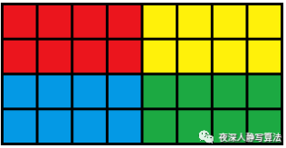
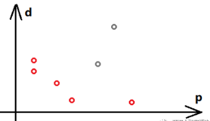

## 定义


ST 表是用于解决 **可重复贡献问题** 的数据结构。

???+ note "什么是可重复贡献问题？"
    **可重复贡献问题** 是指对于运算 $\operatorname{opt}$，满足 $x\operatorname{opt} x=x$，则对应的区间询问就是一个可重复贡献问题。例如，最大值有 $\max(x,x)=x$，gcd 有 $\operatorname{gcd}(x,x)=x$，所以 RMQ 和区间 GCD 就是一个可重复贡献问题。像区间和就不具有这个性质，如果求区间和的时候采用的预处理区间重叠了，则会导致重叠部分被计算两次，这是我们所不愿意看到的。另外，$\operatorname{opt}$ 还必须满足结合律才能使用 ST 表求解。

???+ note "什么是 RMQ？"
    RMQ 是英文 Range Maximum/Minimum Query 的缩写，表示区间最大（最小）值。解决 RMQ 问题有很多种方法，可以参考 [RMQ 专题](../topic/rmq.md)。

    RMQ 问题是指：对于长度为 n 的数列 A，回答若干询问 (A, I, j) (1<=i,j<=n)，返回数列 A 中区间在 [i,j] 中的最小 (大) 值所在的下标。也就是说，RMQ 问题是指求区间最值的问题。


## 引入

[ST 表模板题](https://www.luogu.com.cn/problem/P3865)

题目大意：给定 $n$ 个数，有 $m$ 个询问，对于每个询问，你需要回答区间 $[l,r]$ 中的最大值。

考虑暴力做法。每次都对区间 $[l,r]$ 扫描一遍，求出最大值。

显然，这个算法会超时。

## ST 表

ST 表基于 [倍增](../basic/binary-lifting.md) 思想，可以做到 $\Theta(n\log n)$ 预处理，$\Theta(1)$ 回答每个询问。但是不支持修改操作。

基于倍增思想，我们考虑如何求出区间最大值。可以发现，如果按照一般的倍增流程，每次跳 $2^i$ 步的话，询问时的复杂度仍旧是 $\Theta(\log n)$，并没有比线段树更优，反而预处理一步还比线段树慢。

我们发现 $\max(x,x)=x$，也就是说，区间最大值是一个具有「可重复贡献」性质的问题。即使用来求解的预处理区间有重叠部分，只要这些区间的并是所求的区间，最终计算出的答案就是正确的。

如果手动模拟一下，可以发现我们能使用至多两个预处理过的区间来覆盖询问区间，也就是说询问时的时间复杂度可以被降至 $\Theta(1)$，在处理有大量询问的题目时十分有效。

具体实现如下：

令 $f(i,j)$ 表示区间 $[i,i+2^j-1]$ 的最大值。

显然 $f(i,0)=a_i$。

根据定义式，第二维就相当于倍增的时候「跳了 $2^j-1$ 步」，依据倍增的思路，写出状态转移方程：$f(i,j)=\max(f(i,j-1),f(i+2^{j-1},j-1))$。


以上就是预处理部分。而对于查询，可以简单实现如下：

对于每个询问 $[l,r]$，我们把它分成两部分：$f(l,l+2^s-1)$ 与 $f(r-2^s+1,r)$，其中 $s=\left\lfloor\log_2(r-l+1)\right\rfloor$。两部分的结果的最大值就是回答。


根据上面对于「可重复贡献问题」的论证，由于最大值是「可重复贡献问题」，重叠并不会对区间最大值产生影响。又因为这两个区间完全覆盖了 $[l,r]$，可以保证答案的正确性。

## 模板代码

[ST 表模板题](https://www.luogu.com.cn/problem/P3865)

### C 风格模板

```cpp
--8<-- "docs/ds/code/sparse-table/sparse-table_1.cpp"
```

### C++ 风格模板

```cpp
--8<-- "docs/ds/code/sparse-table/sparse-table_2.hpp"
```

## 注意点

1.  输入输出数据一般很多，建议开启输入输出优化。

2.  每次用 [std::log](https://en.cppreference.com/w/cpp/numeric/math/log) 重新计算 log 函数值并不值得，建议进行如下的预处理：

$$
\begin{cases}
\texttt{Logn}[1] \gets 0, \\
\texttt{Logn}\left[i\right] \gets \texttt{Logn}\left[\frac{i}{2}\right] + 1.
\end{cases}
$$

## ST 表维护其他信息

除 RMQ 以外，还有其它的「可重复贡献问题」。例如「区间按位和」、「区间按位或」、「区间 GCD」，ST 表都能高效地解决。

需要注意的是，对于「区间 GCD」，ST 表的查询复杂度并没有比线段树更优（令值域为 $w$，ST 表的查询复杂度为 $\Theta(\log w)$，而线段树为 $\Theta(\log n+\log w)$，且值域一般是大于 $n$ 的），但是 ST 表的预处理复杂度也没有比线段树更劣，而编程复杂度方面 ST 表比线段树简单很多。

如果分析一下，「可重复贡献问题」一般都带有某种类似 RMQ 的成分。例如「区间按位与」就是每一位取最小值，而「区间 GCD」则是每一个质因数的指数取最小值。

## 二维的扩展

ST 算法可以扩展到二维，用四维的数组来保存状态，每个状态表示的是一个矩形区域中的最值，可以用来求解矩形区域内的最值问题。

`f[x][y][i][j]`代表矩形区域 \[(x,y), (x+2^i-1, y+2^j-1)\] 的最值，每个矩形的最值来自于四个子矩形的最值。预处理的过程和一维的情况一样，只不过把二层循环变成了四层循环。

```cpp
const int MAXM = 9;
const int MAXN = 301;

int RMQ_Pack(int r, int c) {
    return (r << MAXM | c);
}

void RMQ_Init(ValueType A[MAXN][MAXN], int XLen, int YLen, int f[MAXM][MAXM][MAXN][MAXN]) {
 int i, j, x, y, k;
    for (i = 0; i < MAXM; i++) {
        for (j = 0; j < MAXM; ++j) {
            for (x = 1; x + (1 << i) - 1 <= XLen; ++x) {
                for (y = 1; y + (1 << j) - 1 <= YLen; ++y) {
                    int &rf = f[x][y][i][j];

                    if (i == 0 && j == 0) {
                        rf = RMQ_Pack(x, y);     // 1                 
                    }
                    else if (i == 0) {
                        rf = RMQ_MinIndex(A, f[x][y][i][j - 1], f[x][y + (1 << (j - 1))][i][j - 1]);     // 2
                    }
                    else if (j == 0) {
                        rf = RMQ_MinIndex(A, f[x][y][i - 1][j], f[x + (1 << (i - 1))][y][i - 1][j]);     // 3
                    }
                    else {
                        int a = RMQ_MinIndex(A,
                            f[x][y][i - 1][j - 1], // 4
                            f[x + (1 << (i - 1))][y + (1 << (j - 1))][i - 1][j - 1]);                    // 5
                        int b = RMQ_MinIndex(A,      
                            f[x][y + (1 << (j - 1))][i - 1][j - 1],                                      // 6
                            f[x + (1 << (i - 1))][y][i - 1][j - 1]);                                     // 7
                        rf = RMQ_MinIndex(A, a, b);
                    }
                }
            }
        }
    }
}
```

1）因为是二维，如果要存储下标就要存储两个值，而且返回也要返回两个值，所以这里采用了一个打包的方法，把两个整数打包成一个整数，具体实现见RMQ_Pack（左移+位或效率优于乘法）。

2）i==0的情况代表矩形X维长度为1，所以退化成一维的情况，看代码的时候可以忽略 \[i\]和 \[x\]来看；

3）j==0的情况代表矩形Y维长度为1，同样退化成一维的情况，看代码的时候可以忽略 \[j\]和 \[y\]来看；

对于 4）5）6）7），这里我们画了一个图，如图二-4-1所示：



4）`f[x][y][i-1][j-1]` 代表 红色块；

5）`f[x+2^(i-1)][y+2^(j-1)][i-1][j-1]` 代表 绿色块；

6）`f[x][y+2^(j-1)][i-1][j-1]` 代表 黄色块；

7）`f[x+2^(i-1)][y][i-1][j-1]` 代表 蓝色块；

## 例题

???+note "逆序数问题"
    小明有 n(n<=10000) 个宾馆的列表，每个宾馆有价格 p\[i\] 和 距离 d\[i\]，对于宾馆 i，如果能够找到一个宾馆 j 同时满足 `(p[j]<p[i] 且 d[j]>d[i])`，那么  这家宾馆他就不会考虑，请给出小明的候选宾馆列表。

    把 p\[i\] 和 d\[i\] 看成是二维平面上的点。如图所示，红色的为候选列表，灰色的为淘汰列表。
    
    

    比较直观的感觉就是，在原点和当前点组成的矩形中，如果没有其他点，那么它就能够作为候选列表。
    
    那么，我们可以把宾馆数据按照 p\[i\] 递增排序，如果 p\[i\] 相等，则按照 d\[i\] 递减排序，对于某个 i ，如果所有的 j<i 都满足 `d[j]>=d[i]`，则 i 就是一个候选宾馆。
    
    再明确一点，规则可以转化成：如果所有的 `j<i 中的最小值 d[j']>=d[i]`，那么 i 就是一个候选宾馆。
    
    于是，对 d\[j\] 数组预处理 RMQ 即可。


## 总结

ST 表能较好的维护「可重复贡献」的区间信息（同时也应满足结合律），时间复杂度较低，代码量相对其他算法很小。但是，ST 表能维护的信息非常有限，不能较好地扩展，并且不支持修改操作。

## 练习

[RMQ 模板题](https://www.luogu.com.cn/problem/P3865)

[「SCOI2007」降雨量](https://loj.ac/problem/2279)

[\[USACO07JAN\] 平衡的阵容 Balanced Lineup](https://www.luogu.com.cn/problem/P2880)

## 附录：ST 表求区间 GCD 的时间复杂度分析

在算法运行的时候，可能要经过 $\Theta(\log n)$ 次迭代。每一次迭代都可能会使用 GCD 函数进行递归，令值域为 $w$，GCD 函数的时间复杂度最高是 $\Omega(\log w)$ 的，所以总时间复杂度看似有 $O(n\log n\log w)$。

但是，在 GCD 的过程中，每一次递归（除最后一次递归之外）都会使数列中的某个数至少减半，而数列中的数最多减半的次数为 $\log_2 (w^n)=\Theta(n\log w)$，所以，GCD 的递归部分最多只会运行 $O(n\log w)$ 次。再加上循环部分（以及最后一层递归）的 $\Theta(n\log n)$，最终时间复杂度则是 $O(n(\log w+\log x))$，由于可以构造数据使得时间复杂度为 $\Omega(n(\log w+\log x))$，所以最终的时间复杂度即为 $\Theta(n(\log w+\log x))$。

而查询部分的时间复杂度很好分析，考虑最劣情况，即每次询问都询问最劣的一对数，时间复杂度为 $\Theta(\log w)$。因此，ST 表维护「区间 GCD」的时间复杂度为预处理 $\Theta(n(\log n+\log w))$，单次查询 $\Theta(\log w)$。

线段树的相应操作是预处理 $\Theta(n\log x)$，查询 $\Theta(n(\log n+\log x))$。

这并不是一个严谨的数学论证，更为严谨的附在下方：

??? note "更严谨的证明"
    理解本段，可能需要具备 [时间复杂度](../basic/complexity.md) 的关于「势能分析法」的知识。
    
    先分析预处理部分的时间复杂度：
    
    设「待考虑数列」为在预处理 ST 表的时候当前层循环的数列。例如，第零层的数列就是原数列，第一层的数列就是第零层的数列经过一次迭代之后的数列，即 `st[1..n][1]`，我们将其记为 $A$。
    
    而势能函数就定义为「待考虑数列」中所有数的累乘的以二为底的对数。即：$\Phi(A)=\log_2\left(\prod\limits_{i=1}^n A_i\right)$。
    
    在一次迭代中，所花费的时间相当于迭代循环所花费的时间与 GCD 所花费的时间之和。其中，GCD 花费的时间有长有短。最短可能只有两次甚至一次递归，而最长可能有 $O(\log w)$ 次递归。但是，GCD 过程中，除最开头一层与最末一层以外，每次递归都会使「待考虑数列」中的某个结果至少减半。即，$\Phi(A)$ 会减少至少 $1$，该层递归所用的时间可以被势能函数均摊。
    
    同时，我们可以看到，$\Phi(A)$ 的初值最大为 $\log_2 (w^n)=\Theta(n\log w)$，而 $\Phi(A)$ 不增。所以，ST 表预处理部分的时间复杂度为 $O(n(\log w+\log n))$。
