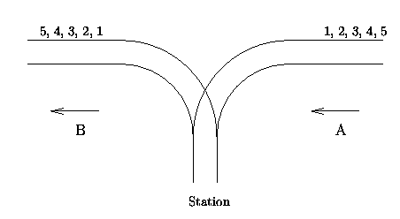

## 引入


栈是 OI 中常用的一种线性数据结构。请注意，本文主要讲的是栈这种数据结构，而非程序运行时的系统栈/栈空间。

栈的修改与访问是按照后进先出的原则进行的，因此栈通常被称为是后进先出（last in first out）表，简称 LIFO 表。

??? warning
    LIFO 表达的是 **当前在容器** 内最后进来的最先出去。
    
    我们考虑这样一个栈
    
    ```text
    push(1)
    pop(1)
    push(2)
    pop(2)
    ```
    
    如果从整体考虑，1 最先入栈，最先出栈，2 最后入栈，最后出栈，这样就成了一个先进先出表，显然是错误的。
    
    所以，在考虑数据结构是 LIFO 还是 FIFO 的时候，应当考虑在当前容器内的情况。

## 使用数组模拟栈

我们可以方便的使用数组来模拟一个栈，如下：

???+ note "实现"
    === "C++"
        ```cpp
        int st[N];
        // 这里使用 st[0] (即 *st) 代表栈中元素数量，同时也是栈顶下标
        
        // 压栈 ：
        st[++*st] = var1;
        // 取栈顶 ：
        int u = st[*st];
        // 弹栈 ：注意越界问题, *st == 0 时不能继续弹出
        if (*st) --*st;
        // 清空栈
        *st = 0;
        ```
    
    === "Python"
        ```python
        st = [0] * N
        # 这里使用 st[0] 代表栈中元素数量，同时也是栈顶下标
        
        # 压栈 ：
        st[st[0] + 1] = var1
        st[0] = st[0] + 1
        # 取栈顶：
        u = st[st[0]]
        # 弹栈：注意越界问题, *st == 0 时不能继续弹出
        if st[0]:
            st[0] = st[0] - 1
        # 清空栈
        st[0] = 0
        ```

## C++ STL 中的栈

C++ 中的 STL 也提供了一个容器 `std::stack`，使用前需要引入 `stack` 头文件。

???+ info "STL 中对 `stack` 的定义 "
    ```cpp
    // clang-format off
    template<
        class T,
        class Container = std::deque<T>
    > class stack;
    ```
    
    `T` 为 stack 中要存储的数据类型。
    
    `Container` 为用于存储元素的底层容器类型。这个容器必须提供通常语义的下列函数：
    
    -   `back()`
    -   `push_back()`
    -   `pop_back()`
    
    STL 容器 `std::vector`、`std::deque` 和 `std::list` 满足这些要求。如果不指定，则默认使用 `std::deque` 作为底层容器。

STL 中的 `stack` 容器提供了一众成员函数以供调用，其中较为常用的有：

-   元素访问
    -   `st.top()` 返回栈顶
-   修改
    -   `st.push()` 插入传入的参数到栈顶
    -   `st.pop()` 弹出栈顶
-   容量
    -   `st.empty()` 返回是否为空
    -   `st.size()` 返回元素数量

此外，`std::stack` 还提供了一些运算符。较为常用的是使用赋值运算符 `=` 为 `stack` 赋值，示例：

```cpp
// 新建两个栈 st1 和 st2
std::stack<int> st1, st2;

// 为 st1 装入 1
st1.push(1);

// 将 st1 赋值给 st2
st2 = st1;

// 输出 st2 的栈顶元素
cout << st2.top() << endl;
// 输出: 1
```

## 使用 Python 中的 list 模拟栈

在 Python 中，你可以使用列表来模拟一个栈：

???+ note "实现"
    ```python
    st = [5, 1, 4]
    
    # 使用 append() 向栈顶添加元素
    st.append(2)
    st.append(3)
    # >>> st
    # [5, 1, 4, 2, 3]
    
    # 使用 pop 取出栈顶元素
    st.pop()
    # >>> st
    # [5, 1, 4, 2]
    
    # 使用 clear 清空栈
    st.clear()
    ```

## 例题
???+note "[Text Reverse](http://acm.hdu.edu.cn/showproblem.php?pid=1062)"
    翻转字符串。例如，输入“olleh !dlrow”，输出“hello world!”。

    ??? note "参考代码"

        === "STL stack"

            ```cpp
            #include<bits/stdc++.h>
            using namespace std;
            int main(){
                int n;
                char ch;
                scanf("%d",&n);  getchar();
                while(n--){
                    stack<char> s;
                    while(true){
                        ch = getchar();                   //一次读入一个字符
                        if(ch==' '||ch=='\n'||ch==EOF){
                            while(!s.empty()){
                                printf("%c",s.top());     //输出栈顶
                                s.pop();                  //清除栈顶
                            }
                            if(ch=='\n'||ch==EOF)  break;
                            printf("");
                        }
                        else  
                            s.push(ch);                   //入栈
                    }
                    printf("\n");
                }
                return 0;
            }
            ```

        === "手写栈"

            ```cpp
            #include<bits/stdc++.h>
            const int maxn = 100000 + 100;
            struct mystack{
                char a[maxn];                         //存放栈元素，字符型
                int t = 0;                            //栈顶位置
                void push(char x){ a[++t] = x; }      //送入栈
                char top()       { return a[t]; }     //返回栈顶元素
                void pop()       { t--;         }     //弹出栈顶
                int empty()      { return t==0?1:0;}  //返回1表示空
            }st;
            int main(){
                int n;
                char ch;
                scanf("%d",&n);  getchar();
                while(n--){
                    while(true){
                        ch = getchar();                    //一次读入一个字符
                        if(ch==' '||ch=='\n'||ch==EOF){
                            while(!st.empty()){
                                printf("%c",st.top());     //输出栈顶
                                st.pop();                  //清除栈顶
                            }
                            if(ch=='\n'||ch==EOF)  break;
                            printf("");
                        }
                        else  
                            st.push(ch);                   //入栈
                    }
                    printf("\n");
                }
                return 0;
            }
            ```

## 习题
??? note "[P1449 后缀表达式](https://www.luogu.com.cn/problem/P1449)"
    所谓后缀表达式是指这样的一个表达式：式中不再引用括号，运算符号放在两个运算对象之后，所有计算按运算符号出现的顺序，严格地由左而右新进行（不用考虑运算符的优先级）。

    如：$\texttt{3*(5-2)+7}$ 对应的后缀表达式为：$\texttt{3.5.2.-*7.+@}$。在该式中，`@` 为表达式的结束符号。`.` 为操作数的结束符号。

    ??? tip
        1. 如果碰到数字，将其放入临时数组当中，方便以后求数字
        2. 如果碰到'.'，那么将临时数组中的字符串转化成数字（具体操作看程序注释），将其压入数字栈中
        3. 如果碰到运算符号，那么将栈顶的两个元素取出做相应的运算（注意：如果碰到-'或'/'应该用栈顶第二个元素减或除以栈顶元素！！！）
        4. 最后输出数字栈中剩余的最后一个元素即可

    ??? note "参考代码"

        ```cpp
        #include<iostream>
        #include<cstdio>
        using namespace std;
        long long stk[1000];
        int main(){
            long long i=0,now=0;
            char op;
            while((op=getchar())!='@'){
                if(op>='0'&&op<='9') now*=10,now+=op-'0';
                else if(op=='.'){
                    stk[++i]=now;
                    now=0;
                }
                else if(op=='+'){
                    stk[i-1]=stk[i-1]+stk[i];
                    stk[i]=0;
                    i--;
                }
                else if(op=='-'){
                    stk[i-1]=stk[i-1]-stk[i];
                    stk[i]=0;
                    i--;
                }
                else if(op=='*'){
                    stk[i-1]=stk[i-1]*stk[i];
                    stk[i]=0;
                    i--;
                }
                else if(op=='/'){
                    stk[i-1]=stk[i-1]/stk[i];
                    stk[i]=0;
                    i--;
                }
            }
            cout<<stk[1];
            return 0;
        }
        ```

??? note "[P1739 表达式括号匹配](https://www.luogu.com.cn/problem/P1739)"
    假设一个表达式有英文字母（小写）、运算符（`+`、`-`、`*`、`/`）和左右小（圆）括号构成，以 `@` 作为表达式的结束符。请编写一个程序检查表达式中的左右圆括号是否匹配，若匹配，则输出 `YES`；否则输出 `NO`。表达式长度小于 $255$，左圆括号少于 $20$ 个。

    ??? tip
        如果左右括号想要匹配，那么左右括号的个数必须相等。

        但是如果仅仅满足这个是不行的，举个例子：)(a+b)(
        
        此时第一个右括号出现在了左括号的左边，此时虽然左右括号的数量相等，但是明显不匹配。所以就还要加上第二种判断。

        每出现一个左括号+1，每出现一个右括号且该变量大于0时-1.最后整个字符串判断完之后如果这个变量值为0则原表达式是匹配的。（其实大概就是栈的思想）

    ??? note "参考代码"

        ```cpp
        #include<bits/stdc++.h>
        using namespace std;
        int main()
        {
            int c,tot=0;//tot初始化 
            while((c=getchar())!='@'){//当输入不为@时继续循环 
                if(c=='(')tot++;
                else if(c==')')tot--;
                if(tot==-1)break;//防止误判 
            }
            if(tot==0)cout<<"YES";//括号匹配要在正反括号数量相等的前提下 
            else cout<<"NO";
            return 0;
        }
        ```
    
??? note "[UVA514 车厢调度](https://www.luogu.com.cn/problem/U224112)"
    有一个火车站，铁路如图所示，每辆火车从A 驶入，再从 B 方向驶出，同时它的车厢可以重新组合。假设从 A 方向驶来的火车有 n 节 （n<=1000），分别按照顺序编号为 1，2，3，…， n。假定在进入车站前，每节车厢之间都不是连着的，并且它们可以自行移动到 B 处的铁轨上。另外假定车站 C 可以停放任意多节车厢。但是一旦进入车站 C，它就不能再回到 A 方向的铁轨上了，并且一旦当它进入 B 方向的铁轨，它就不能再回到车站 C。

    负责车厢调度的工作人员需要知道能否使它以 a1,a2,…,an 的顺序从 B 方向驶出，请来判断能否得到指定的车厢顺序。

    

    ??? tip
        在中转站C中，车厢符合先进后出的原则，因此是一个栈。

    ??? note "参考代码"

        ```cpp
        #include<iostream>
        #include<stdio.h>
        #include<stack>
        using namespace std;

        const int MAXN = 1000 + 10;
        int n, target[MAXN];

        int main()
        {
            while(scanf("%d", &n) == 1)     //输入  一共n辆火车
            {    
                stack<int> s;       //声明栈S
                int A = 1, B = 1;     // A:进站顺序 1,2,3,...,n   B:出站顺序（数组target的下标）
                for(int i = 1; i <= n; i++)
                {
                    scanf("%d", &target[i]);  //输入出站顺序
                }

                int ok = 1;   //标志，是否可以按顺序出站
                while(B <= n)
                {
                    if(A == target[B]) //要进站的火车与要出站的火车为同一辆，则进站后直接出站
                    {
                        A++; B++;
                    }
                    else if(!s.empty() && s.top() == target[B])  //栈（站）非空，栈顶与要出站的火车相同，则出站
                    {
                        s.pop();
                        B++;  //要出站的++
                    }
                    else if(A <= n)  //要进站的与出站的不同，只进站，先等着，当栈顶与目标相同时再出（上一个if）
                    {
                        s.push(A++);     
                    }
                    else
                    {
                        ok = 0;  //正常结束循环为b=n,  若前几种情况都不符合，则不能按照要求顺序出站，break
                        break;
                    }
                }
                printf("%s\n", ok ? "Yes" : "No");   
            }

            return 0;
        }
        ```

## 参考资料

1.  [std::stack - zh.cppreference.com](https://zh.cppreference.com/w/cpp/container/stack)
