author: Ir1d, sshwy, GavinZhengOI, Planet6174, ouuan, Marcythm, ylxmf2005, 0xis-cn

相关阅读：[双连通分量](./bcc.md)，

割点和桥更严谨的定义参见 [图论相关概念](./concept.md)。

## 割点

> 对于一个无向图，如果把一个点删除后这个图的极大连通分量数增加了，那么这个点就是这个图的割点（又称割顶）。

## 割边

和割点差不多，叫做桥。

> 对于一个无向图，如果删掉一条边后图中的连通分量数增加了，则称这条边为桥或者割边。严谨来说，就是：假设有连通图 $G=\{V,E\}$，$e$ 是其中一条边（即 $e \in E$），如果 $G-e$ 是不连通的，则边 $e$ 是图 $G$ 的一条割边（桥）。

比如说，下图中，


红色的边就是割边。

**割点与桥（割边）的关系：**

1）有割点不一定有桥,有桥一定存在割点

2）桥一定是割点依附的边。

下图中顶点C为割点，但和C相连的边都不是桥。

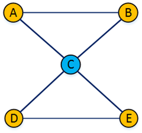

## 暴力方法求解割点集和割边集

暴力法的原理就是通过定义求解割点和割边。在图中去掉某个顶点，然后进行DFS遍历，如果连通分量增加，那么该顶点就是割点。如果在图中去掉某条边，然后进行DFS遍历，如果连通分量增加，那么该边就是割边。对每个顶点或者每个边进行一次上述操作，就可以求出这个图的所有割点和割边，我们称之为这个图的割点集和割边集。

在具体的代码实现中，并不需要真正删除该顶点和删除依附于该顶点所有边。对于割点，我们只需要在DFS前，将该顶点对应是否已访问的标记置为ture，然后从其它顶点为根进行DFS即可。对于割边，我们只需要禁止从这条边进行DFS后，如果联通分量增加了，那么这条边就是割边。

## Tarjan算法

如果我们尝试删除每个点，并且判断这个图的连通性，那么复杂度会特别的高。所以要介绍一个常用的算法：Tarjan。

判断一个顶点是不是割点除了从定义，还可以从DFS（深度优先遍历）的角度出发。我们先通过DFS定义两个概念。

假设DFS中我们从顶点U访问到了顶点V（此时顶点V还未被访问过），那么我们称顶点U为顶点V的**父顶点**，V为U的**孩子顶点**。在顶点U之前被访问过的顶点，我们就称之为U的**祖先顶点**。

显然如果顶点U的所有孩子顶点可以不通过父顶点U而访问到U的祖先顶点，那么说明此时去掉顶点U不影响图的连通性，U就不是割点。相反，如果顶点U至少存在一个孩子顶点，必须通过父顶点U才能访问到U的祖先顶点，那么去掉顶点U后，顶点U的祖先顶点和孩子顶点就不连通了，说明U是一个割点。

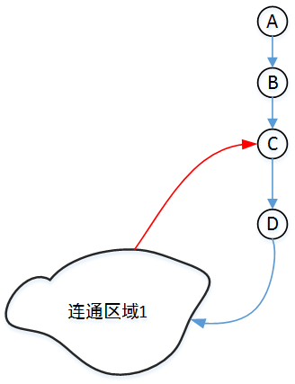

上图中的箭头表示DFS访问的顺序（而不表示有向图），对于顶点D而言，D的孩子顶点可以通过连通区域1红色的边回到D的祖先顶点C（此时C已被访问过），所以此时D不是割点。

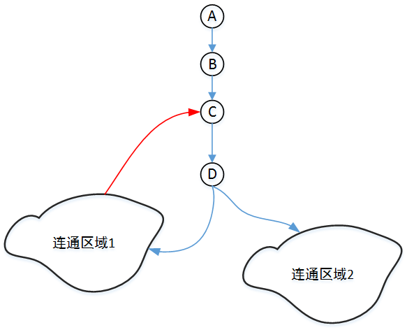

上图中的连通区域2中的顶点，必须通过D才能访问到D的祖先顶点，所以说此时D为割点。再次强调一遍，箭头仅仅表示DFS的访问顺序，而不是表示该图是有向图。

这里我们还需要考虑一个特殊情况，就是DFS的根顶点（一般情况下是编号为0的顶点），因为根顶点没有祖先顶点。其实根顶点是不是割点也很好判断，如果从根顶点出发，一次DFS就能访问到所有的顶点，那么根顶点就不是割点。反之，如果回溯到根顶点后，还有未访问过的顶点，需要在邻接顶点上再次进行DFS，根顶点就是割点。

### 实现

在具体实现Tarjan算法上，我们需要在DFS（深度优先遍历）中，额外定义三个数组dfn\[\]，low\[\]，parent\[\]
 
**dfn数组**

dfn数组的下标表示顶点的编号，数组中的值表示该顶点在DFS中的遍历顺序(或者说时间戳)，每访问到一个未访问过的顶点，访问顺序的值（时间戳）就增加1。子顶点的dfn值一定比父顶点的dfn值大（但不一定恰好大1，比如父顶点有两个及两个以上分支的情况）。在访问一个顶点后，它的dfn的值就确定下来了，不会再改变。
 
**low数组**

low数组的下标表示顶点的编号，数组中的值表示DFS中该顶点不通过父顶点能访问到的祖先顶点中最小的顺序值（或者说时间戳）。

每个顶点初始的low值和dfn值应该一样，在DFS中，我们根据情况不断更新low的值。

假设由顶点U访问到顶点V。当从顶点V回溯到顶点U时，

```cpp
如果 v 是 u 的儿子 low[u] = min(low[u], low[v]);
否则
low[u] = min(low[u], dfn[v]);
```

如果顶点U还有它分支，每个分支回溯时都进行上述操作，那么顶点low[u]就表示了不通过顶点U的父节点所能访问到的最早祖先节点。
 
**parent数组**

parent\[\]:下标表示顶点的编号，数组中的值表示该顶点的父顶点编号，它主要用于更新low值的时候排除父顶点，当然也可以其它的办法实现相同的功能。
 
### 一个具体的例子

现在我们来看一个例子，模仿程序计算各个顶点的dfn值和low值。下图中蓝色实线箭头表示已访问过的路径，无箭头虚线表示未访问路径。已访问过的顶点用黄色标记，未访问的顶点用白色标记，DFS当前正在处理的顶点用绿色表示。带箭头的蓝色虚线表示DFS回溯时的返回路径。
 
1）

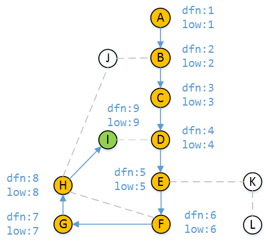

当DFS走到顶点H时，有三个分支，我们假设我们**先走H-I，然后走H-F，最后走H-J**。从H访问I时，顶点I未被访问过，所以I的dfn和low都为9。根据DFS的遍历顺序，我们应该从顶点I继续访问。
 
2）

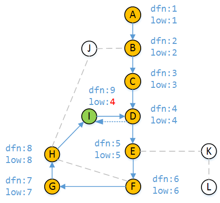

上图表示由顶点I访问顶点D，而此时发现D已被访问，当从D回溯到I时，由于

$dfn[D] < dfn[I]$

说明D是I的祖先顶点，所以到现在为止，顶点I不经过父顶点H能访问到的小时间戳为4。
 
3）

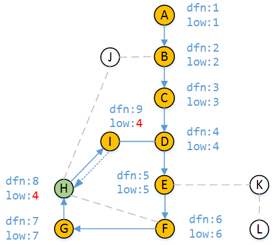

根据DFS的原理，我们从顶点I回到顶点H，显然到目前为止顶点H能访问到的最小时间戳也是4（因为我们到现在为止只知道能从H可以通过I访问到D），所以 $low[H] = 4$
 
4）

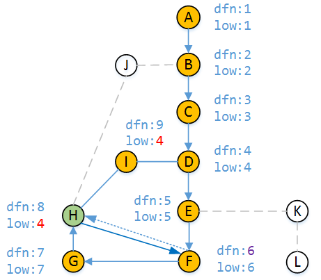

现在我们继续执行DFS，走H-F路径，发现顶点F已被访问且 $dfn[F] < dfn[H]$ ，说明F是H的祖先顶点，但此时顶点H能访问的最早时间戳是4，而F的时间戳是6，依据low值定义 $low[H]$ 仍然为4。
 
5）

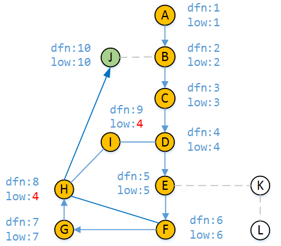

最后我们走H-J路径，顶点J未被访问过所以 $dfn[J] = 10   low[J] = 10$
 
6）

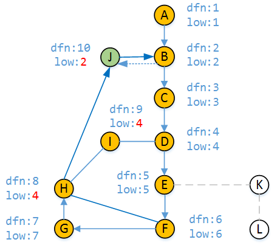

同理，由DFS访问顶点B，$dfn[J] > dfn[B]$ ，B为祖先顶点，顶点J不经过父顶点H能访问到的最早时间戳就是 $dfn[B]$，即 $low[J] = 2$
 
7）

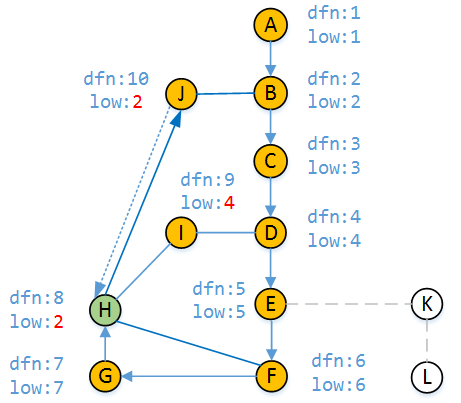

我们从顶点J回溯到顶点H，显然到目前为止顶点H能访问到的最早时间戳就更新为2（因为我们到现在为止知道了能从H访问到J），所以 $low[H] = 2$
 
8）
 
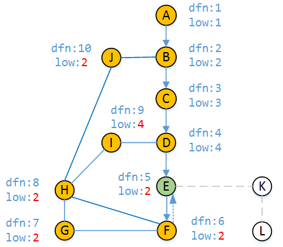

根据DFS原理，我们从H回退到顶点E（H回退到G,G回退到F，F回退到E的过程省略），所经过的顶点都会更新low值，因为这些顶点不用通过自己的父顶点就可以和顶点B相连。当回溯到顶点E时，还有未访问过的顶点，那么继续进行E-K分支的DFS。
 
9）

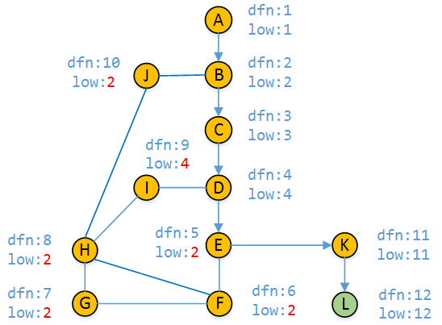

从E-K分支访问到顶点L时，顶点k和L的的dfn值和low值如图上图所示
 
10）

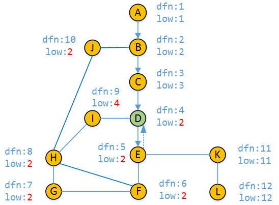

接着我们继续回溯到了顶点D（中间过程有所省略），并更新 $low[D]$
 
11）

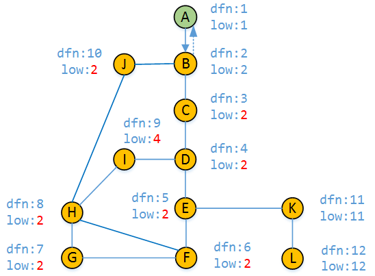

最后，按照DFS的原理，我们回退到顶点A，并且求出来了每个顶点的dfn值和low值。

### 割点及桥的判定方法

割点：判断顶点U是否为割点，用U顶点的dnf值和它的所有的孩子顶点的low值进行比较，如果存在至少一个孩子顶点V满足 $low[v] >= dnf[u]$，就说明顶点V访问顶点U的祖先顶点，必须通过顶点U，而不存在顶点V到顶点U祖先顶点的其它路径，所以顶点U就是一个割点。对于没有孩子顶点的顶点，显然不会是割点。

桥（割边）：$low[v] > dnf[u]$ 就说明V-U是桥

需要说明的是，Tarjan算法从图的任意顶点进行DFS都可以得出割点集和割边集。

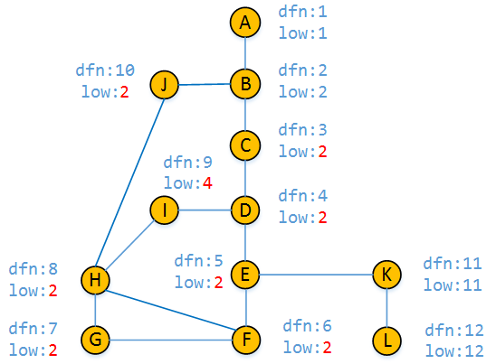

从上图的结果中我们可以看出，顶点B,顶点E和顶点K为割点，A-B以及E-K和K-L为割边。

### 代码实现 (下面的OIWIKI中有C++、Python版本)

```java
import java.io.BufferedReader;
import java.io.File;
import java.io.FileNotFoundException;
import java.io.FileReader;
import java.io.PrintWriter;
import java.io.Reader;
import java.io.StringWriter;
import java.util.LinkedList;
import java.util.List;
import java.util.Scanner;
 
public class CutVerEdge {
     
    /*用于标记已访问过的顶点*/
    private boolean[] marked;
     
    /*三个数组的作用不再解释*/
    private int[] low;
    private int[] dfn;
    private int[] parent;
     
    /*用于标记是否是割点*/
    private boolean[] isCutVer;
     
    /*存储割点集的容器*/
    private List<Integer> listV;
     
    /*存储割边的容器，容器中存储的是数组，每个数组只有两个元素，表示这个边依附的两个顶点*/
    private List<int[]> listE;
     
    private UndirectedGraph ug;
    private int visitOrder;/*时间戳变量*/
     
    /*定义图的边*/
    public static class Edge{
         
        /*边起始顶点*/
        private final int from;
         
        /*边终结顶点*/
        private final int to;
         
        public Edge(int from, int to){
            this.from = from;
            this.to= to;
        }
         
        public int from(){
            return this.from;
        }
         
        public int to(){
            return this.to;
        }
         
        public String toString(){
            return "[" + from + ", " + to +"] ";
        }
    }
     
     /*定义无向图*/
    public static class UndirectedGraph{
         
        private int vtxNum;/*顶点数量*/
        private int edgeNum;/*边数量*/
         
        /*临接表*/
        private LinkedList<Edge>[] adj;
         
        /*无向图的构造函数,通过txt文件构造图，无权值*/
        @SuppressWarnings("unchecked")
        public UndirectedGraph(Reader r){
             
            BufferedReader br = new BufferedReader(r);
            Scanner scn = new Scanner(br);
             
            /*图中顶点数*/
            vtxNum = scn.nextInt();
            /*图中边数*/
            edgeNum = scn.nextInt();
             
            adj = (LinkedList<Edge>[])new LinkedList[vtxNum];
             
            for(int i = 0; i < vtxNum; i++){
                adj[i] = new LinkedList<Edge>();
            }
             
            /*无向图,同一条边，添加两次*/
            for(int i = 0; i < edgeNum; i++){
                int from = scn.nextInt();
                int to = scn.nextInt();
                Edge e1 = new Edge(from, to);
                Edge e2 = new Edge(to, from);
                adj[from].add(e1);
                adj[to].add(e2);
            }
            scn.close();
        }
         
        /*图的显示方法*/
        @Override
        public String toString(){
            StringWriter sw = new StringWriter();
            PrintWriter pw = new PrintWriter(sw);
            for (int i = 0; i < vtxNum; i++) {
                pw.printf(" %-3d:  ", i);
                for (Edge e : adj[i]) {
                    pw.print(e);
                }
                pw.println();
            }
            return sw.getBuffer().toString();
        }
         
        /*返回顶点个数*/
        public int vtxNum(){
            return vtxNum;
        }
         
        /*返回边的数量*/
        public int edgeNum(){
            return edgeNum;
        }
         
    }
     
    public CutVerEdge(UndirectedGraph ug){
         
        this.ug = ug;
         
        marked = new boolean[ug.vtxNum()];
         
        low = new int[ug.vtxNum()];
        dfn = new int[ug.vtxNum()];
        parent = new int[ug.vtxNum()];
         
        isCutVer = new boolean[ug.vtxNum()];
         
        listV = new LinkedList<Integer>();
        listE = new LinkedList<int[]>();
         
        /*调用深度优先遍历，求解各个顶点的dfn值和low值*/
        dfs();
    }
     
     
    private void dfs(){
         
        int childTree  = 0;
        marked[0] = true;
        visitOrder = 1;
        parent[0] = -1;
         
        for(Edge e : ug.adj[0]){
            int w = e.to();
            if(!marked[w]){
                marked[w] = true;
                parent[w] = 0;
                dfs0(w);
                /*根顶点相连的边是否是桥*/
                if(low[w] > dfn[0]){
                    listE.add(new int[]{0, w});
                }
                childTree++;
            }
        }
        /*单独处理根顶点*/
        if(childTree >= 2){/*根顶点是割点的条件*/
            isCutVer[0] = true;
        }
    }
     
    /*除了根顶点的其它情况*/
    private void dfs0(int v){
        dfn[v] = low[v] = ++visitOrder;
        for(Edge e : ug.adj[v]){
            int w = e.to();
            if(!marked[w]){
                marked[w] = true;
                parent[w] = v;
                dfs0(w);
                low[v] = Math.min(low[v], low[w]);
                 
                /*判断割点*/
                if(low[w] >= dfn[v]){
                    isCutVer[v] = true;
                    /*判断桥*/
                    if(low[w] > dfn[v]){
                        listE.add(new int[]{v, w});
                    }
                }
            }else
            if(parent[v] != w && dfn[w] < dfn[v]){
                low[v] = Math.min(low[v], dfn[w]);
            }
        }
    }
     
    /*返回所有割点*/
    public List<Integer> allCutVer(){
        for(int i = 0; i < isCutVer.length; i++){
            if(isCutVer[i]){
                listV.add(i);
            }
        }
        return listV;
    }
     
    /*返回所有割边*/
    public List<int[]> allCutEdge(){
        return listE;
    }
     
    /*判断顶点v是否是割点*/
    public boolean isCutVer(int v){
        return isCutVer[v];
    }
     
    public static void main(String[] args) throws FileNotFoundException{
         
        File path = new File(System.getProperties()
                      .getProperty("user.dir"))
              .getParentFile();
 
        File f = new File(path, "algs4-data/tinyG2.txt");
        FileReader fr = new FileReader(f);
         
        UndirectedGraph ug = new UndirectedGraph(fr);
        System.out.println("\n-------图的邻接表示法-------");
        System.out.println(ug);
         
        System.out.println("\n-------图中的割点-------");
         
        CutVerEdge cve = new CutVerEdge(ug);
        for(int i : cve.allCutVer()){
            System.out.println(i);
        }
         
        System.out.println("\n-------图中的割边-----");
         
        for(int[] a : cve.allCutEdge()){
            System.out.println(a[0]+"  "+ a[1]);
        }
    }
}
```

* * *

以下为OIWIKI版本

* * *

## 过程

首先，我们上一个图：


很容易的看出割点是 2，而且这个图仅有这一个割点。

首先，我们按照 DFS 序给他打上时间戳（访问的顺序）。

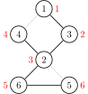

这些信息被我们保存在一个叫做 `dfn` 的数组中。

还需要另外一个数组 `low`，用它来存储不经过其父亲能到达的最小的时间戳。

例如 `low[2]` 的话是 1，`low[5]` 和 `low[6]` 是 3。

然后我们开始 DFS，我们判断某个点是否是割点的根据是：对于某个顶点 $u$，如果存在至少一个顶点 $v$（$u$ 的儿子），使得 $low_v \geq dfn_u$，即不能回到祖先，那么 $u$ 点为割点。

此根据惟独不适用于搜索的起始点，其需要特殊考虑：若该点不是割点，则其他路径亦能到达全部结点，因此从起始点只「向下搜了一次」，即在搜索树内仅有一个子结点。如果在搜索树内有两个及以上的儿子，那么他一定是割点了（设想上图从 2 开始搜索，搜索树内应有两个子结点：3 或 4 及 5 或 6）。如果只有一个儿子，那么把它删掉，不会有任何的影响。比如下面这个图，此处形成了一个环。


我们在访问 1 的儿子时候，假设先 DFS 到了 2，然后标记用过，然后递归往下，来到了 4，4 又来到了 3，当递归回溯的时候，会发现 3 已经被访问过了，所以不是割点。

更新 `low` 的伪代码如下：

```cpp
如果 v 是 u 的儿子 low[u] = min(low[u], low[v]);
否则
low[u] = min(low[u], dfn[v]);
```

### 例题

[洛谷 P3388【模板】割点（割顶）](https://www.luogu.com.cn/problem/P3388)

??? "例题代码"
    ```cpp
    --8<-- "docs/graph/code/cut/cut_1.cpp"
    ```

## 过程

和割点差不多，只要改一处：$low_v>dfn_u$ 就可以了，而且不需要考虑根节点的问题。

割边是和是不是根节点没关系的，原来我们求割点的时候是指点 $v$ 是不可能不经过父节点 $u$ 为回到祖先节点（包括父节点），所以顶点 $u$ 是割点。如果 $low_v=dfn_u$ 表示还可以回到父节点，如果顶点 $v$ 不能回到祖先也没有另外一条回到父亲的路，那么 $u-v$ 这条边就是割边。

### 实现

下面代码实现了求割边，其中，当 `isbridge[x]` 为真时，`(father[x],x)` 为一条割边。

=== "C++"

    ```cpp
    int low[MAXN], dfn[MAXN], dfs_clock;
    bool isbridge[MAXN];
    vector<int> G[MAXN];
    int cnt_bridge;
    int father[MAXN];

    void tarjan(int u, int fa) {
      father[u] = fa;
      low[u] = dfn[u] = ++dfs_clock;
      for (int i = 0; i < G[u].size(); i++) {
        int v = G[u][i];
        if (!dfn[v]) {
          tarjan(v, u);
          low[u] = min(low[u], low[v]);
          if (low[v] > dfn[u]) {
            isbridge[v] = true;
            ++cnt_bridge;
          }
        } else if (dfn[v] < dfn[u] && v != fa) {
          low[u] = min(low[u], dfn[v]);
        }
      }
    }
    ```

=== "Python"

    ```python
    low = [0] * MAXN; dfn = [0] * MAXN; dfs_clock = 0
    isbridge = [False] * MAXN
    G = [[0 for i in range(MAXN)] for j in range(MAXN)]
    cnt_bridge = 0
    father = [0] * MAXN

    def tarjan(u, fa):
        father[u] = fa
        low[u] = dfn[u] = dfs_clock
        dfs_clock = dfs_clock + 1
        for i in range(0, len(G[u])):
            v = G[u][i]
            if dfn[v] == False:
                tarjan(v, u)
                low[u] = min(low[u], low[v])
                if low[v] > dfn[u]:
                    isbridge[v] = True
                    cnt_bridge = cnt_bridge + 1
            elif dfn[v] < dfn[u] and v != fa:
                low[u] = min(low[u], dfn[v])
    ```

## 练习

-   [P3388【模板】割点（割顶）](https://www.luogu.com.cn/problem/P3388)
-   [POJ2117 Electricity](https://vjudge.net/problem/POJ-2117)
-   [HDU4738 Caocao's Bridges](https://vjudge.net/problem/HDU-4738)
-   [HDU2460 Network](https://vjudge.net/problem/HDU-2460)
-   [POJ1523 SPF](https://vjudge.net/problem/POJ-1523)

Tarjan 算法还有许多用途，常用的例如求强连通分量，缩点，还有求 2-SAT 的用途等。
