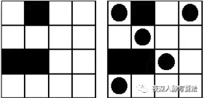
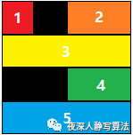
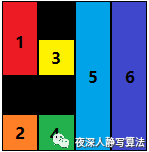
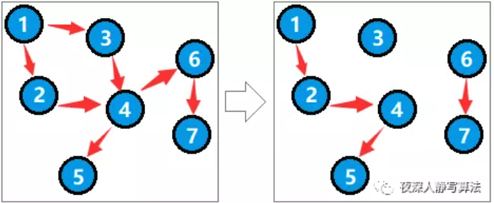
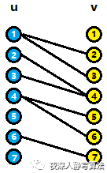
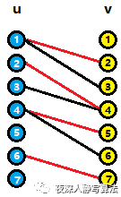
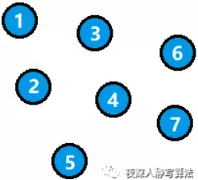
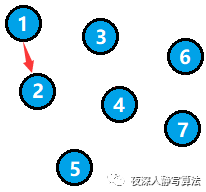
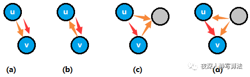
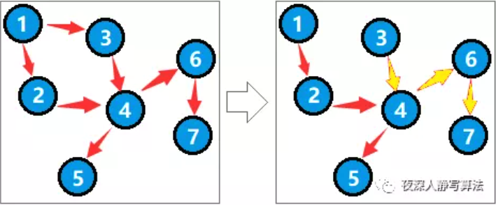

author: accelsao, thallium, Chrogeek, Enter-tainer, ksyx, StudyingFather, H-J-Granger, Henry-ZHR, countercurrent-time, william-song-shy, 5ab-juruo, XiaoQuQuSD

为了描述方便将两个集合分成左和右两个部分，所有匹配边都是横跨左右两个集合，可以假想成男女配对。

假设图有 $n$ 个顶点，$m$ 条边。

## 题目描述

给定一个二分图 $G$，即分左右两部分，各部分之间的点没有边连接，要求选出一些边，使得这些边没有公共顶点，且边的数量最大。

## 增广路算法 Augmenting Path Algorithm

因为增广路长度为奇数，路径起始点非左即右，所以我们先考虑从左边的未匹配点找增广路。
注意到因为交错路的关系，增广路上的第奇数条边都是非匹配边，第偶数条边都是匹配边，于是左到右都是非匹配边，右到左都是匹配边。
于是我们给二分图 **定向**，问题转换成，有向图中从给定起点找一条简单路径走到某个未匹配点，此问题等价给定起始点 $s$ 能否走到终点 $t$。
那么只要从起始点开始 DFS 遍历直到找到某个未匹配点，$O(m)$。
未找到增广路时，我们拓展的路也称为 **交错树**。

### 性质

因为要枚举 $n$ 个点，总复杂度为 $O(nm)$。

### 实现

```cpp
struct augment_path {
  vector<vector<int> > g;
  vector<int> pa;  // 匹配
  vector<int> pb;
  vector<int> vis;  // 访问
  int n, m;         // 两个点集中的顶点数量
  int dfn;          // 时间戳记
  int res;          // 匹配数

  augment_path(int _n, int _m) : n(_n), m(_m) {
    assert(0 <= n && 0 <= m);
    pa = vector<int>(n, -1);
    pb = vector<int>(m, -1);
    vis = vector<int>(n);
    g.resize(n);
    res = 0;
    dfn = 0;
  }

  void add(int from, int to) {
    assert(0 <= from && from < n && 0 <= to && to < m);
    g[from].push_back(to);
  }

  bool dfs(int v) {
    vis[v] = dfn;
    for (int u : g[v]) {
      if (pb[u] == -1) {
        pb[u] = v;
        pa[v] = u;
        return true;
      }
    }
    for (int u : g[v]) {
      if (vis[pb[u]] != dfn && dfs(pb[u])) {
        pa[v] = u;
        pb[u] = v;
        return true;
      }
    }
    return false;
  }

  int solve() {
    while (true) {
      dfn++;
      int cnt = 0;
      for (int i = 0; i < n; i++) {
        if (pa[i] == -1 && dfs(i)) {
          cnt++;
        }
      }
      if (cnt == 0) {
        break;
      }
      res += cnt;
    }
    return res;
  }
};
```

## 转为网络最大流模型

二分图最大匹配可以转换成网络流模型。

将源点连上左边所有点，右边所有点连上汇点，容量皆为 $1$。原来的每条边从左往右连边，容量也皆为 $1$，最大流即最大匹配。

如果使用 [Dinic 算法](../flow/max-flow.md#dinic-算法) 求该网络的最大流，可在 $O(\sqrt{n}m)$ 求出。

Dinic 算法分成两部分，第一部分用 $O(m)$ 时间 BFS 建立网络流，第二步是 $O(nm)$ 时间 DFS 进行增广。

但因为容量为 $1$，所以实际时间复杂度为 $O(m)$。

接下来前 $O(\sqrt{n})$ 轮，复杂度为 $O(\sqrt{n}m)$。$O(\sqrt{n})$ 轮以后，每条增广路径长度至少 $\sqrt{n}$，而这样的路径不超过 $\sqrt{n}$，所以此时最多只需要跑 $\sqrt{n}$ 轮，整体复杂度为 $O(\sqrt{n}m)$。

代码可以参考 [Dinic 算法](../flow/max-flow.md#dinic-算法) 的参考实现，这里不再给出。

## 补充

### 二分图最小点覆盖（König 定理）

最小点覆盖：选最少的点，满足每条边至少有一个端点被选。

二分图中，最小点覆盖 $=$ 最大匹配。

???+ note "证明"
    将二分图点集分成左右两个集合，使得所有边的两个端点都不在一个集合。
    
    考虑如下构造：从左侧未匹配的节点出发，按照匈牙利算法中增广路的方式走，即先走一条未匹配边，再走一条匹配边。由于已经求出了最大匹配，所以这样的「增广路」一定以匹配边结束，即增广路是不完整的。在所有经过这样「增广路」的节点上打标记。则最后构造的集合是：所有左侧未打标记的节点和所有右侧打了标记的节点。
    
    首先，这个集合的大小等于最大匹配。左边未打标记的点都一定对应着一个匹配边（否则会以这个点为起点开始标记），右边打了标记的节点一定在一条不完整的增广路上，也会对应一个匹配边。假设存在一条匹配边左侧标记了，右侧没标记，左边的点只能是通过另一条匹配边走过来，此时左边的点有两条匹配边，不符合最大匹配的规定；假设存在一条匹配边左侧没标记，右侧标记了，那就会从右边的点沿着这条匹配边走过来，从而左侧也有标记。因此，每一条匹配的边两侧一定都有标记（在不完整的增广路上）或都没有标记，匹配边的两个节点中必然有一个被选中。
    
    其次，这个集合是一个点覆盖。由于我们的构造方式是：所有左侧未打标记的节点和所有右侧打了标记的节点。假设存在左侧打标记且右侧没打标记的边，对于匹配边，上一段已经说明其不存在，对于非匹配边，右端点一定会由这条非匹配边经过，从而被打上标记。因此，这样的构造能够覆盖所有边。
    
    同时，不存在更小的点覆盖。为了覆盖最大匹配的所有边，至少要有最大匹配边数的点数。

???+question "棋盘布局"
    给定一个 n*n 的棋盘，黑白格子组成，白色格子可以放置棋子，黑色格子不能放置棋子，如果一行或者一列上有其它棋子，并且中间没有任何黑色格子，那么这样的放置是非法的，求尽量放置最多的棋子（类似国际象棋中的 "车"）。
    
    

首先将棋盘进行行分块，分在同一块的一行上只能放一个棋子，如下图所示：



再进行列分块，分在同一块的一列上只能放一个棋子，如下图所示：



那么我们发现，任何一个格子都属于 一个行分块和一个列分块，假设一格格子 (r,c)，它的行分块编号为 x，列分块编号为 y，每个能够放置棋子的点一定是要么行分块要么列分块来决定的。那么，我们把每个能够放置棋子的点看成是二分图的边，即建立边 ：x->y，选择最少的行列分块（对应于二分图的点）覆盖所有的格子（对应于二分图的边），就相当于把所有的格子上的位置都占据满了。

转换成最小顶点覆盖问题，求构造后的图的二分图最大匹配即可。

### 最小边覆盖

选了一条边就相当于覆盖了它的两个端点。最小边覆盖就是选择最少的边集，覆盖所有的点集。

二分图的最小边覆盖 $=$ 顶点总数 $-$ 孤立点数 $-$ 二分图最大匹配。

???+note "证明"
    取最少的边，那么一定是优先选择能够一次性覆盖两个点的那种边，即匹配边。假设二分图左边的点数为 |X| ，右边的点数为 |Y|，二分图的最大匹配点数为 |M|，那么通过匹配边覆盖的点数为 |M|\*2，剩下的孤立点有 |S| 个是不需要被覆盖的，所以还有 |X|+|Y|-|S|-|M|\*2 个点没有被覆盖，只能通过对应的边数来覆盖。
    
    所以边覆盖的数目为|M|+(|X|+|Y|-|M|\*2-|S|) = |X|+|Y|-|S|-|M| 。

???+question "01覆盖"
    给定一个 n\*n 的 01 矩阵，每次可以选择 1 x 2 或者 2 x 1 的格子去覆盖 0，且允许重复覆盖，问最少需要选择的格子数。

对于矩阵中任意一个 0，检测四个相邻方向，是否也是 0，如果是，则建立一条边。那么问题就转变成，选择最少的边，覆盖所有点。转化成最小边覆盖问题求解。

### 二分图最大独立集

最大独立集：选最多的点，满足两两之间没有边相连。

因为在最小点覆盖中，任意一条边都被至少选了一个顶点，所以对于其点集的补集，任意一条边都被至多选了一个顶点，所以不存在边连接两个点集中的点，且该点集最大。因此二分图中，最大独立集 $=n-$ 最小点覆盖。

???+note "证明"
    这个是非常好理解的，不需要一大堆证明。因为最小顶点覆盖，覆盖了所有的边，所以消去这些顶点，所有的边也就被消去了，从而剩下的点之间两两都不相邻，所以这些剩余点构成了一个点独立集。又由于最小顶点覆盖已经是最少的能够覆盖所有边的点集，不能再少了，所以剩下的点集就是最大的，这就是最大独立集的最直观描述。

???+question "单身男女"
    在学校里，给定一些男孩和女孩的关系图，默认男孩和男孩，女孩和女孩之间都没有关系，求一个最大的集合，使得所有选出来的孩子之间都没有关系。

典型的求最大独立集的问题。求出最大匹配后，用总的点数减去即可。

### 最大完全子图

选取最多的点，使得图中任意两点都有关系。

二分图的最大完全子图 $=$ 补图的最大独立集。

参考最大独立集，正好是最大独立集相反的情况，所以对原图建立补图，再求最大独立集即可。

???+question "男女交友"
    n 个男孩之间都有关系，m 个女孩之间也都有关系，某些男孩和某些女孩之间有关系，现在需要挑出一些孩子集合，使得所有的孩子都相互有关系，求集合最大值。

这是一个求最大完全子图的问题，如果不是二分图，这将是一个 NP 问题，但是这里是个二分图，我们可以先建立补图，然后问题转换成挑出一些孩子集合，两两之间都没有关系（这时候男孩子和男孩子之间，女孩子和女孩子之间都没有关系了），于是转变成二分图最大独立集问题求解。

### 有向无环图的最小路径覆盖
1）不相交的情况

定义：选择一些路径，覆盖所有的点集，且各路径的点集之间不允许有交集，要求路径数最少。

举例：如下图所示，得到的路径为：(1->2->4->5) (6->7) (3)，答案为 3。



说明：由于各路径的点集之间不允许有交集，所以不是 (1->2->4->5) 和 (3->4->6->7) ，因为这种方案下结点4被用了两次。

结论：有向无环图的最小(不相交)路径覆盖 = 原图结点数 - 拆点后二分图最大匹配数

实现：首先将每个结点 u 拆成两个结点 ul 和 ur，如果原图存在边 u->v，则在拆点后的图上建立边：ul->vr。由于原图是有向无环图，所以拆点后的图是一个二分图。如图所示：



对拆点后的图求一次二分图最大匹配，得到：



那么有向无环图的最小(不相交)路径覆盖 = 原图结点数（7） - 拆点后二分图最大匹配数（4）= 3

证明：分成以下几个点去理解就行：

1）初始状态，所有顶点都是一条路径，总共 n 条路径；



2）每增加一对匹配，对应到原图是连接两个结点，并且这两个结点一定不在同一个连通块（这个在下文进行证明），所以总连通块减一，也就是路径数减一；要使得路径数最少，那么增加的匹配数最大。对应二分图最大匹配。



每增加一对匹配：ul->vr，对应原图加了一条 u->v 的边，假设 u 和 v 在同一个连通块内，那么有如下四种情况（橙色边为原本的连接情况，红色边为当前增加匹配后增加的新边）：



（a） 出现大于一条出边， 出现大于一条入边的情况，和二分图匹配的定义矛盾，这种情况不合法；

（b）产生了圈，和有向无环图的前提矛盾，所以这种情况不可能出现；

（c） 出现大于一条出边的情况，对应到二分图和两个点进行了匹配，和二分图匹配的定义矛盾，这种情况不合法；

（d） 出现大于一条入边的情况，和二分图匹配的定义矛盾，这种情况不合法；
基于以上四种情况都不合法，所以每增加一条匹配边，在原图中的两个点势必不在一个连通块内，得证。

2）相交的情况

定义：选择一些路径，覆盖所有的点集，且各路径的点集之间允许有交集，要求路径数最少。

举例：如下图所示，得到的路径为： (1->2->4->5) (3->4->6->7)，答案为 2。



结论：首先对原图求一次传递闭包得到一个新图，有向无环图的最小(相交)路径覆盖 = 新图结点数 - 拆点后二分图最大匹配数。

证明：因为路径之间是允许相交的，所以对于 2 条路径 a->b->c 和 d->b->e， 这个点可以被 2 条路径用，只要建立 a->c 和 d->e 的边，就可以当成求最小不相交路径覆盖的情况来求解了。

## 习题

??? note "[UOJ #78. 二分图最大匹配](https://uoj.ac/problem/78)"
    模板题
    
    ```cpp
    #include <bits/stdc++.h>
    using namespace std;
    
    struct augment_path {
      vector<vector<int> > g;
      vector<int> pa;  // 匹配
      vector<int> pb;
      vector<int> vis;  // 访问
      int n, m;         // 顶点和边的数量
      int dfn;          // 时间戳记
      int res;          // 匹配数
    
      augment_path(int _n, int _m) : n(_n), m(_m) {
        assert(0 <= n && 0 <= m);
        pa = vector<int>(n, -1);
        pb = vector<int>(m, -1);
        vis = vector<int>(n);
        g.resize(n);
        res = 0;
        dfn = 0;
      }
    
      void add(int from, int to) {
        assert(0 <= from && from < n && 0 <= to && to < m);
        g[from].push_back(to);
      }
    
      bool dfs(int v) {
        vis[v] = dfn;
        for (int u : g[v]) {
          if (pb[u] == -1) {
            pb[u] = v;
            pa[v] = u;
            return true;
          }
        }
        for (int u : g[v]) {
          if (vis[pb[u]] != dfn && dfs(pb[u])) {
            pa[v] = u;
            pb[u] = v;
            return true;
          }
        }
        return false;
      }
    
      int solve() {
        while (true) {
          dfn++;
          int cnt = 0;
          for (int i = 0; i < n; i++) {
            if (pa[i] == -1 && dfs(i)) {
              cnt++;
            }
          }
          if (cnt == 0) {
            break;
          }
          res += cnt;
        }
        return res;
      }
    };
    
    int main() {
      int n, m, e;
      cin >> n >> m >> e;
      augment_path solver(n, m);
      int u, v;
      for (int i = 0; i < e; i++) {
        cin >> u >> v;
        u--, v--;
        solver.add(u, v);
      }
      cout << solver.solve() << "\n";
      for (int i = 0; i < n; i++) {
        cout << solver.pa[i] + 1 << " ";
      }
      cout << "\n";
    }
    ```

- [P1640 [SCOI2010]连续攻击游戏](https://www.luogu.com.cn/problem/P1640)
- [Codeforces 1139E - Maximize Mex](https://codeforces.com/problemset/problem/1139/E)
- [The Perfect Stall](http://poj.org/problem?id=1274)
- [Optimal Milking](http://poj.org/problem?id=2112)
- [Sorting Slides](http://poj.org/problem?id=1486)
- [Evacuation](http://poj.org/problem?id=3057)
- [Merry Christmas](https://vjudge.net/problem/aizu-2251)

### 最大匹配模板题

- [Courses](https://vjudge.net/problem/HDU-1083)
- [过山车](https://vjudge.net/problem/HDU-2063)
- [Card Game Cheater](https://vjudge.net/problem/HDU-1528)
- [Ollivanders: Makers of Fine Wands since 382 BC.](https://vjudge.net/problem/HDU-1179)
- [T-Shirt Gumbo](http://poj.org/problem?id=2584)
- [The Accomodation of Students](https://vjudge.net/problem/HDU-2444)

### 染色 + 最大匹配

- [Help the vendor and get some M](https://vjudge.net/problem/HDU-2194)
- [Oil Skimming](https://vjudge.net/problem/HDU-4185)
- [Uncle Tom's Inherited Land](https://vjudge.net/problem/HDU-1507)
- [I'm Telling the Truth](https://vjudge.net/problem/HDU-3729)

### 最小顶点覆盖

- [Strategic Game](https://vjudge.net/problem/HDU-1054)
- [Asteroids](http://poj.org/problem?id=3041)
- [Matrix](https://vjudge.net/problem/HDU-2119)
- [Muddy Fields](http://poj.org/problem?id=2226)
- [Machine Schedule](https://vjudge.net/problem/HDU-1150)
- [50 years, 50 colors](https://vjudge.net/problem/HDU-1498)
- [棋盘游戏](https://vjudge.net/problem/HDU-1281)
- [Fire Net](https://vjudge.net/problem/HDU-1045)
- [Battle ships](https://vjudge.net/problem/HDU-5093)
- [无题II](https://vjudge.net/problem/HDU-2236)
- [National Treasures](https://vjudge.net/problem/HDU-3360)
- [Monkeys](https://vjudge.net/problem/HDU-6178)

### 最大独立集

- [Girls and Boys](http://poj.org/problem?id=1466)
- [Cat vs. Dog](https://vjudge.net/problem/HDU-2768)
- [Kindergarten](http://poj.org/problem?id=3692)

### 最小边覆盖

- [Antenna Placement](http://poj.org/problem?id=3020)
- [Purifying Machine](http://poj.org/problem?id=2724)

### 最小路径覆盖

- [Air Raid](https://vjudge.net/problem/HDU-1151)
- [Taxi Cab Scheme](https://vjudge.net/problem/HDU-1350)
- [Treasure Exploration](http://poj.org/problem?id=2594)
- [Repairing Company](http://poj.org/problem?id=3216)

## 参考资料

1.  <http://www.matrix67.com/blog/archives/116>
