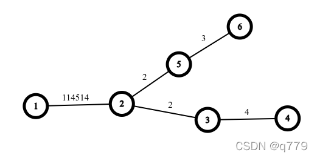

**树上任意两节点之间最长的简单路径即为树的「直径」。**

前置知识：[树基础](./tree-basic.md)。

## 引入

显然，一棵树可以有多条直径，他们的长度相等。

可以用两次 DFS 或者树形 DP 的方法在 $O(n)$ 时间求出树的直径。

## 例题

???+note "[SPOJ PT07Z, Longest path in a tree](https://www.spoj.com/problems/PT07Z/)"
    给定一棵 $n$ 个节点的树，求其直径的长度。$1\leq n\leq 10^4$。

## 做法 1. 两次 DFS

### 过程

首先从任意节点 $y$ 开始进行第一次 DFS，到达距离其最远的节点，记为 $z$，然后再从 $z$ 开始做第二次 DFS，到达距离 $z$ 最远的节点，记为 $z'$，则 $\delta(z,z')$ 即为树的直径。

显然，如果第一次 DFS 到达的节点 $z$ 是直径的一端，那么第二次 DFS 到达的节点 $z'$ 一定是直径的一端。我们只需证明在任意情况下，$z$ 必为直径的一端。

定理：在一棵树上，从任意节点 $y$ 开始进行一次 DFS，到达的距离其最远的节点 $z$ 必为直径的一端。

???+note "证明"
    使用反证法。记出发节点为 $y$。设真实的直径是 $\delta(s,t)$，而从 $y$ 进行的第一次 DFS 到达的距离其最远的节点 $z$ 不为 $t$ 或 $s$。共分三种情况：
    
    - 若 $y$ 在 $\delta(s,t)$ 上：
    
    
    
    有 $\delta(y,z) > \delta(y,t) \Longrightarrow \delta(x,z) > \delta(x,t) \Longrightarrow \delta(s,z) > \delta(s,t)$，与 $\delta(s,t)$ 为树上任意两节点之间最长的简单路径矛盾。
    
    - 若 $y$ 不在 $\delta(s,t)$ 上，且 $\delta(y,z)$ 与 $\delta(s,t)$ 存在重合路径：
    
    
    
    有 $\delta(y,z) > \delta(y,t) \Longrightarrow \delta(x,z) > \delta(x,t) \Longrightarrow \delta(s,z) > \delta(s,t)$，与 $\delta(s,t)$ 为树上任意两节点之间最长的简单路径矛盾。
    
    - 若 $y$ 不在 $\delta(s,t)$ 上，且 $\delta(y,z)$ 与 $\delta(s,t)$ 不存在重合路径：
    
    
    
    有 $\delta(y,z) > \delta(y,t) \Longrightarrow \delta(x',z) > \delta(x',t) \Longrightarrow \delta(x,z) > \delta(x,t) \Longrightarrow \delta(s,z) > \delta(s,t)$，与 $\delta(s,t)$ 为树上任意两节点之间最长的简单路径矛盾。
    
    综上，三种情况下假设均会产生矛盾，故原定理得证。

???+warning "负权边"
    上述证明过程建立在所有路径均不为负的前提下。如果树上存在负权边，则上述证明不成立。故若存在负权边，则无法使用两次 DFS 的方式求解直径。

### 实现

代码实现如下。

```cpp
const int N = 10000 + 10;

int n, c, d[N];
vector<int> E[N];

void dfs(int u, int fa) {
  for (int v : E[u]) {
    if (v == fa) continue;
    d[v] = d[u] + 1;
    if (d[v] > d[c]) c = v;
    dfs(v, u);
  }
}

int main() {
  scanf("%d", &n);
  for (int i = 1; i < n; i++) {
    int u, v;
    scanf("%d %d", &u, &v);
    E[u].push_back(v), E[v].push_back(u);
  }
  dfs(1, 0);
  d[c] = 0, dfs(c, 0);
  printf("%d\n", d[c]);
  return 0;
}
```

如果需要求出一条直径上所有的节点，则可以在第二次 DFS 的过程中，记录每个点的前序节点，即可从直径的一端一路向前，遍历直径上所有的节点。

## 做法 2. 树形 DP

### 过程

我们记录当 $1$ 为树的根时，每个节点作为子树的根向下，所能延伸的最远距离 $d_1$，和次远距离 $d_2$，那么直径就是所有 $d_1 + d_2$ 的最大值。

树形 DP 可以在存在负权边的情况下求解出树的直径。

### 实现

代码实现如下。

```cpp
const int N = 10000 + 10;

int n, d = 0;
int d1[N], d2[N];
vector<int> E[N];

void dfs(int u, int fa) {
  d1[u] = d2[u] = 0;
  for (int v : E[u]) {
    if (v == fa) continue;
    dfs(v, u);
    int t = d1[v] + 1;
    if (t > d1[u])
      d2[u] = d1[u], d1[u] = t;
    else if (t > d2[u])
      d2[u] = t;
  }
  d = max(d, d1[u] + d2[u]);
}

int main() {
  scanf("%d", &n);
  for (int i = 1; i < n; i++) {
    int u, v;
    scanf("%d %d", &u, &v);
    E[u].push_back(v), E[v].push_back(u);
  }
  dfs(1, 0);
  printf("%d\n", d);
  return 0;
}
```

如果需要求出一条直径上所有的节点，则可以在 DP 的过程中，记录下每个节点能向下延伸的最远距离与次远距离所对应的子节点，之后再找到对应的 $u$，使得 $d = d_1u + d_2u$，即可分别沿着从 $u$ 开始的最远距离和次远距离对应的子节点一路向下，遍历直径上所有的节点。

## 性质

#### 若树上所有边边权均为正，则树的所有直径中点重合

证明：使用反证法。设两条中点不重合的直径分别为 $\delta(s,t)$ 与 $\delta(s',t')$，中点分别为 $x$ 与 $x'$。显然，$\delta(s,x) = \delta(x,t) = \delta(s',x') = \delta(x',t')$。


有 $\delta(s,t') = \delta(s,x) + \delta(x,x') + \delta(x',t') > \delta(s,x) + \delta(x,t) = \delta(s,t)$，与 $\delta(s,t)$ 为树上任意两节点之间最长的简单路径矛盾，故性质得证。

## 习题

- [CodeChef, Diameter of Tree](https://www.codechef.com/problems/DTREE)

??? note "[Educational Codeforces Round 35, Problem F, Tree Destruction](https://codeforces.com/contest/911/problem/F)"
    给定一棵树，每次可以选定树上的两个叶子，并删去其中的一个。答案每次加上两个选定的叶子之间的距离。求最后答案的最大值。

    ??? tip
        首先，距离树上的任意一个节点最远的节点一定是某条直径的某个端点。
        
        首先求出树的某一条直径，令其端点分别为L, R。把L看成树的根，那么R一定是叶子结点。对于那些非直径上的点，离他们最远的点肯定是L或R中的一个（可能也有其他的，但是L或R肯定已经最大了）。所以依次把这些非直径上的点删掉，删掉的时候在L和R中选择一个就行了。最后把直径删掉即可。令直径的两个端点为 x1,x2

        $Ans=\sum{Max(dis(i,x1),dis(i,x2))}$

    ??? note "参考代码"

        ```cpp
        #include<bits/stdc++.h>
        using namespace std;
        const int maxn=200008;
        struct sj{
            int to,next;
        }a[maxn*2];
        int head[maxn],size,x,y,road[maxn];
        int root,flag,n,cnt,far[5],kk,vis[maxn];
        int dis[maxn][3],v[maxn],num; 
        long long ans;
        int ans1[maxn],ans2[maxn],siz;
        void add(int x,int y)
        {
            a[++size].to=y;
            a[size].next=head[x];
            head[x]=size;
        }
        
        void dfs(int x)
        {
            v[x]=1; 
            if(cnt>kk)
            far[root==1?1:2]=x,kk=cnt;      
            for(int i=head[x];i;i=a[i].next)
            {
                int tt=a[i].to;
                if(!v[tt])
                    cnt++,dfs(tt);
            }   
            v[x]=0; cnt--;
        }
        
        void fuck(int x)
        {
            v[x]=1;
            if(x==far[2]){flag=1;}
        
            for(int i=head[x];i;i=a[i].next)
            {
                int tt=a[i].to;
                if(!v[tt])
                fuck(tt);
                if(flag){road[++num]=x;vis[x]=1;break;}
            }
            v[x]=0;
        }
        
        void getans(int x)
        {
            v[x]=1;
            for(int i=head[x];i;i=a[i].next)
            {
                int tt=a[i].to;
                if(!v[tt]&&!vis[tt])
                    getans(tt),ans+=max(dis[tt][1],dis[tt][2]);
            }
            if(dis[x][1]>dis[x][2])
            ans1[++siz]=far[1];
            else ans1[++siz]=far[2];
            ans2[siz]=x;
            v[x]=0;
        }
        
        void getdis(int x,int to)
        {
            v[x]=1;
            for(int i=head[x];i;i=a[i].next)
            {
                int tt=a[i].to;
                if(!v[tt])
                {dis[tt][to]=dis[x][to]+1; getdis(tt,to);}
            }
            v[x]=0;
        }
        
        int main()
        {
            cin>>n;
            for(int i=1;i<n;i++)
            {
                scanf("%d%d",&x,&y),
                add(x,y), add(y,x);
            }
            root=1; dfs(root); 
            root=far[1]; kk=0; 
            cnt=0;  dfs(root); 
            fuck(root);
            
            getdis(far[1],1); getdis(far[2],2);
            for(int i=2;i<num;i++)
            getans(road[i]),siz--;
        
            for(int i=1;i<=kk;i++)ans+=i;
            cout<<ans<<endl;
            for(int i=1;i<=siz;i++)
            cout<<ans1[i]<<' '<<ans2[i]<<' '<<ans2[i]<<endl;
            for(int i=1;i<num;i++)
            cout<<far[1]<<' '<<road[i]<<' '<<road[i]<<endl;
        }
        ```

??? note "[ZOJ 3820, Building Fire Stations](https://vjudge.net/problem/ZOJ-3820)"
    给一颗节点数>=2的树，在树上标记两个点，使得所有点到离它最近的点的最大距离最小。

    ??? tip
        解法1：首先先求这个树的直径，然后在树的直径的中点处把树分成两棵树，然后在把两棵树分别取中点的最大值就是ans值。

        解法2：一个点的话明显就是中心了。换成了两个点，那么先考虑一下，明显这两个点在直径上是最优的，那么接下来，就可以二分一下距离，这样就可以求出相应的点的位置，接下来通过bfs判断是否满足要求就行了。

    ??? note "参考代码"

        === "解法1"

            ```cpp
            #include<stdio.h>
            #include<string.h>
            #include<algorithm>
            #include<vector>
            #include<queue>
            using namespace std;
            const int maxn = 2*1e5 + 100;
            int vis[maxn], fa[maxn];
            vector<int> G[maxn];
            vector<int> P;
            int bfs(int s, int t)
            {
                queue<int> Q;
                P.clear();
                memset(vis, 0, sizeof(vis));
                memset(fa, -1, sizeof(fa));
                int ans = 1, k = s;
                vis[s] = 1;
                Q.push(s);
                vis[t] = -1;
                while(!Q.empty())
                {
                    int x = Q.front();
                    Q.pop();
                    for(int i = 0; i < G[x].size(); i++)
                    {
                        int v = G[x][i];
                        if(vis[v] != 0)
                            continue;
                        vis[v] = vis[x] + 1;
                        fa[v] = x;
                        if(ans < vis[v])
                        {
                            ans = vis[v];
                            k = v;
                        }
                        Q.push(v);
                    }
                }
                for(int i = k; i != -1; i = fa[i])
                    P.push_back(i);
                return k;
            }
            pair<int, int> get_ans(int s, int t)
            {
                int p1 = bfs(s, t);
                int p2 = bfs(p1, t);
                int len = P.size()/2;
                int x = P[len];
                pair<int, int> ans(x, len);
                return ans;
            }
            struct Node
            {
                int one, two, len;
                Node(int o, int t, int l) : one(o), two(t), len(l) {}
            };
            Node station(int s, int t)
            {
                int len = -1, one = -1, two = -1;
                pair<int, int> st;
                st = get_ans(s, t);
                len = max(len, st.second);
                one = st.first;
                st = get_ans(t, s);
                len = max(len, st.second);
                two = st.first;
                return Node(one, two, len);
            }
            void solve(int n)
            {
                Node ans(-1, -1, -1), res(-1, -1, -1);
                int p1 = bfs(1, n+1);
                int p2 = bfs(p1, n+1);
                int len = P.size()/2;
                int a = P[len-1], b = P[len], c = P[len+1];
                if(P.size()%2 == 0)
                {
                    ans = station(a, b);
                }
                else
                {
                    ans = station(a, b);
                    res = station(b, c);
                    if(ans.len > res.len)
                        ans = res;
                }
                printf("%d %d %d\n", ans.len, ans.one, ans.two);
            }
            int main()
            {
                int T, n, a, b;
                scanf("%d", &T);
                while(T--)
                {
                    scanf("%d", &n);
                    for(int i = 0; i <= n; i++)
                        G[i].clear();
                    for(int i = 1; i < n; i++)
                    {
                        scanf("%d%d", &a, &b);
                        G[a].push_back(b);
                        G[b].push_back(a);
                    }
                    solve(n);
                }
                return 0;
            }
            ```

        === "解法2"

            ```cpp
            #include<iostream>
            #include<cstdio>
            #include<cstring>
            #include<string>
            #include<algorithm>
            #include<map>
            #include<queue>
            #include<stack>
            #include<set>
            #include<cmath>
            #include<vector>
            #include<bitset>
            #define inf 0x3f3f3f3f
            #define Inf 0x3FFFFFFFFFFFFFFFLL
            #define eps 1e-6
            #define pi acos(-1.0)
            using namespace std;
            typedef long long ll;
            const int maxn = 200000 + 10;
            struct Edge
            {
                int v,next;
                Edge(int v = 0,int next = 0):v(v),next(next){}
            }edges[maxn<<1];
            int head[maxn],d[maxn],pa[maxn],S[maxn],nEdge;
            int rp[maxn],vis[maxn],cnt,ux,uy,ans,m;
            void AddEdges(int u,int v)
            {
                edges[++nEdge] = Edge(v,head[u]);
                head[u] = nEdge;
                edges[++nEdge] = Edge(u,head[v]);
                head[v] = nEdge;
            }
            bool check(int limit)
            {
                cnt++;
                int a = rp[limit + 1];
                int b = rp[m - limit];
                if(limit + 1 >= m - limit)
                {
                    a = rp[m/2];
                    b = rp[m/2 + 1];
                }
                int tail = 0,u,v;
                d[a] = d[b] = 0;
                S[tail++] = a;
                S[tail++] = b;
                vis[a] = vis[b] = cnt;
                for(int i = 0;i < tail;++i)
                {
                    u = S[i];
                    if(d[u] > limit) return false;
                    for(int k = head[u];k != -1;k = edges[k].next)
                    {
                        v = edges[k].v;
                        if(vis[v] == cnt) continue;
                        vis[v] = cnt;
                        pa[v] = u;
                        d[v] = d[u] + 1;
                        S[tail++] = v;
                    }
                }
                if(limit < ans)
                {
                    ans = limit;
                    ux = a;
                    uy = b;
                }
                return true;
            }
            void solve()
            {
                pa[1] = -1;
                int tail = 0,maxd = 0,mpos,u,v;
                S[tail++] = 1;
                d[1] = 0;
                for(int i = 0;i < tail;++i)
                {
                    u = S[i];
                    if(d[u] > maxd)
                    {
                        maxd = d[u];
                        mpos = u;
                    }
                    for(int k = head[u];k != -1;k = edges[k].next)
                    {
                        v = edges[k].v;
                        if(v == pa[u]) continue;
                        d[v] = d[u] + 1;
                        pa[v] = u;
                        S[tail++] = v;
                    }
                }
                pa[mpos] = -1;
                tail = 0;
                S[tail++] = mpos;
                d[mpos] = 0;
                maxd = 0;
                for(int i = 0;i < tail;++i)
                {
                    u = S[i];
                    if(d[u] > maxd)
                    {
                        maxd = d[u];
                        mpos = u;
                    }
                    for(int k = head[u];k != -1;k = edges[k].next)
                    {
                        v = edges[k].v;
                        if(v == pa[u]) continue;
                        pa[v] = u;
                        d[v] = d[u] + 1;
                        S[tail++] = v;
                    }
                }
                m = 0;
                u = mpos;
                while(u != -1)
                {
                    rp[++m] = u;
                    u = pa[u];
                }
                int L = 0,R = tail,mid;
                ans = inf;
                cnt = 0;
                memset(vis,0,sizeof(vis));
                while(L < R)
                {
                    mid = (L + R)>>1;
                    if(check(mid)) R = mid;
                    else L = mid + 1;
                }
                check(L);
            }
            int main()
            {
                int t;
                scanf("%d",&t);
                while(t--)
                {
                    memset(head,0xff,sizeof(head));
                    nEdge = -1;
                    int n,u,v;
                    scanf("%d",&n);
                    for(int i = 1;i < n;++i)
                    {
                        scanf("%d%d",&u,&v);
                        AddEdges(u,v);
                    }
                    solve();
                    printf("%d %d %d\n",ans,ux,uy);
                }
                return 0;
            }
            ```

??? note "[CEOI2019/CodeForces 1192B. Dynamic Diameter](https://codeforces.com/contest/1192/problem/B)"
    给一棵固定形态的树，边有边权，每次修改一条边权，在线求出修改后树的直径。

    ??? tip
        写出树的全dfs序。生成方式为：每当一个点进栈或入栈时，记录它的编号。

        考虑这个dfs序上两点之间的距离。设某个节点在dfs序中第一次出现的位置为$where_i$，第i个位置的节点为$what_i$

        两个点分别为u和v。可以发现，在dfs上，u和v之间一定会包含它们的lca，则：

        $dis_{u,v}=max_{where_u \leq x \leq where_v}{\{dep_u+dep_v-2*dep_{what_x}\}}$

        树的直径即为上述表达式的最大值。

        考虑到直径的形式为u-lca-v的形式，我们可以在dfs序上看成是L、M、R的这三部分组成，其中L和R要尽可能大，M要尽可能小（代码中先加了符号，所以还是最大的）。考虑线段树，维护当前区间的最大值、M、LM、MR和LMR，最后的答案即为线段树根节点的LMR。不难证明，可以进行如下合并：

        $val=max{\{val_l,val_r\}}$

        $M=max{\{M_l,M_r\}}$（取了负号）

        $LM=max{\{LM_l,LM_r,val_l+M_r\}}$

        $MR=max{\{RM_l,RM_r,M_l+val_r\}}$

        $LMR=max{\{LMR_l,LMR_r,LM_l+val_r,val_l+RM_r\}}$

        对于修改操作，相当于是区间修改，直接打标记即可。

        时间复杂度：$O(n+qlogn)$

    ??? note "参考代码"

        ```cpp
        #include<bits/stdc++.h>
        using namespace std;
        const int maxn=1E5+5;
        typedef long long int ll;
        int n,m;
        int size=1,head[maxn*2];
        int dfn,dfnFirst[maxn],dfnLast[maxn],what[maxn*2],fa[maxn];
        ll lastans,weight[maxn],dep[maxn];
        ll val[maxn*8],M[maxn*8],LM[maxn*8],MR[maxn*8],LMR[maxn*8],tag[maxn*8];
        struct edge
        {
            int to,next;
            ll w;
        }E[maxn*2];
        inline void addE(int u,int v,ll w)
        {
            E[++size].to=v;
            E[size].next=head[u];
            E[size].w=w;
            head[u]=size;
        }
        void dfs(int u,int F,ll d)
        {
            what[dfnFirst[u]=++dfn]=u;
            dep[u]=d;
            fa[u]=F;
            for(int i=head[u];i;i=E[i].next)
            {
                int v=E[i].to;
                if(v==F)
                    continue;
                weight[v]=E[i].w;
                dfs(v,u,d+E[i].w);
                what[++dfn]=u;
            }
            dfnLast[u]=dfn;
        }
        inline void pushdown(int l,int r,int num)
        {
            val[num]+=tag[num];
            M[num]-=tag[num]*2;
            LM[num]-=tag[num];
            MR[num]-=tag[num];
            if(l!=r)
                tag[num<<1]+=tag[num],tag[num<<1|1]+=tag[num];
            tag[num]=0;
        }
        inline void update(int l,int r,int num)
        {
            if(l==r)
                return;
            val[num]=max(val[num<<1],val[num<<1|1]);
            M[num]=max(M[num<<1],M[num<<1|1]);
            LM[num]=max(max(LM[num<<1],LM[num<<1|1]),val[num<<1]+M[num<<1|1]);
            MR[num]=max(max(MR[num<<1],MR[num<<1|1]),M[num<<1]+val[num<<1|1]);
            LMR[num]=max(max(LMR[num<<1],LMR[num<<1|1]),max(LM[num<<1]+val[num<<1|1],val[num<<1]+MR[num<<1|1]));
        }
        void build(int l,int r,int num)
        {
            if(l==r)
            {
                int pos=what[l];
                val[num]=dep[pos];
                M[num]=-2*dep[pos];
                LM[num]=MR[num]=-dep[pos];
                return;
            }
            int mid=(l+r)>>1;
            build(l,mid,num<<1),build(mid+1,r,num<<1|1);
            update(l,r,num);
        }
        void add(int L,int R,int l,int r,ll x,int num)
        {
            if(L<=l&&r<=R)
            {
                tag[num]+=x;
                pushdown(l,r,num);
                return;
            }
            pushdown(l,r,num);
            int mid=(l+r)>>1;
            if(R<=mid)
                add(L,R,l,mid,x,num<<1);
            else if(mid<L)
                add(L,R,mid+1,r,x,num<<1|1);
            else
                add(L,R,l,mid,x,num<<1),add(L,R,mid+1,r,x,num<<1|1);
            pushdown(l,mid,num<<1);
            pushdown(mid+1,r,num<<1|1);
            update(l,r,num);
        }
        int main()
        {
            ios::sync_with_stdio(false);
            ll W;
            cin>>n>>m>>W;
            for(int i=2;i<=n;++i)
            {
                int x,y;
                ll z;
                cin>>x>>y>>z;
                addE(x,y,z);
                addE(y,x,z);
            }
            dfs(1,1,0);
            build(1,2*n-1,1);
            while(m--)
            {
                ll x,y;
                cin>>x>>y;
                x=(x+lastans)%(n-1)+1;
                y=(y+lastans)%W;
                if(fa[E[x<<1].to]==E[x<<1|1].to)
                    x=E[x<<1].to;
                else
                    x=E[x<<1|1].to;
                add(dfnFirst[x],dfnLast[x],1,2*n-1,y-weight[x],1);
                weight[x]=y;
                lastans=LMR[1];
                cout<<lastans<<endl;
            }
            return 0;
        }
        ```

??? note "[IPSC 2019 网络赛，Lightning Routing I](https://nanti.jisuanke.com/t/41398)"

    ??? tip

    ??? note "参考代码"

        ```cpp
        ```

??? note "[NOIP2007 提高组 树网的核](https://www.luogu.com.cn/problem/P1099)"

    ??? tip

    ??? note "参考代码"

        ```cpp
        ```

??? note "[SDOI2011 消防](https://www.luogu.com.cn/problem/P2491)"
    给定一棵树 , 边有边权，求一条边长度和 ≤ s 的路径, 使其他所有点到这条路径的距离的最大值最小 .

    ??? tip
        这是一棵树，而且还要求路径的最大值，很容易想到这个枢纽要建在直径上

        当 s 大于等于直径时显然成立，考虑 s 小于直径的情况，枢纽全部建在直径上仍是最优解

        以下为证明：

        假设只有一个枢纽结点（在直径上），我们以它为中心扩展出一条路径

        离这个点最远的结点一定在直径上，而且是直径的端点

        此时的最大值就是这条路径的长度

        那么如果扩展枢纽结点，只有在直径上扩展，才可能更新这个最大值

        因此枢纽一定在直径上

        证毕。于是，我们可以想到个暴力做法

        先找出直径，然后枚举每一个直径上的点 u 作为枢纽的起点进行扩展

        找到满足条件且最远的 v ，并对每组 (u,v) 计算出直径的两个端点到枢纽的最大距离

        再计算出非直径的结点到枢纽的最大距离即可，时间复杂度 $O(n^2)$

        注：因为两端到枢纽的距离不一定是最大值，可以参考下图
        
        

        那么怎么优化呢

        注意到选择的枢纽长度随结点数量的增加单调递增

        因此我们可以考虑使用尺取法

        这样，算法的流程就变成了

        找出直径

        对于每个极大枢纽，统计两端到其距离的最大值的最小值
        
        统计非直径结点到枢纽距离的最大值
        
        时间复杂度 O(n)

    ??? note "参考代码"

        ```cpp
        #include <bits/stdc++.h>
        using namespace std;
        #define int long long
        #define INF 0x3f3f3f3f3f3f3f3f
        #define N (int)(3e5+15)
        struct Edge
        {
            int u,v,w,next;
        }e[N<<1];
        int n,s,ans=INF;
        int pos=1,head[N],x,y,dis[N],pre[N],pd[N];
        void addEdge(int u,int v,int w)
        {
            e[++pos]={u,v,w,head[u]};
            head[u]=pos;
        }
        void dfs(int u,int f)
        {
            pre[u]=f;
            for(int i=head[u]; i; i=e[i].next)
            {
                int v=e[i].v;
                if(v==f||pd[v])continue;
                dis[v]=dis[u]+e[i].w;
                dfs(v,u);
            }
        }
        signed main()
        {
            ios::sync_with_stdio(0);
            cin.tie(0);cout.tie(0);
            cin >> n >> s;
            for(int i=1,u,v,w; i<n; i++)
            {
                cin >> u >> v >> w;
                addEdge(u,v,w);
                addEdge(v,u,w);
            }
            dis[1]=1;dfs(1,0);
            x=max_element(dis+1,dis+1+n)-dis;
            dis[x]=0;dfs(x,0);
            y=max_element(dis+1,dis+1+n)-dis;
            for(int i=y,j=y; i; i=pre[i])
            {
                pd[i]=1;
                while(dis[j]-dis[i]>s)j=pre[j];
                ans=min(ans,max(dis[i],dis[y]-dis[j]));
            }
            for(int i=y; i; i=pre[i])
            {
                dis[i]=0;
                dfs(i,pre[i]);
            }
            for(int i=1; i<=n; i++)
                ans=max(ans,dis[i]);
            cout << ans << endl;
            return 0;
        }
        ```

??? note "[APIO2010 巡逻](https://www.luogu.com.cn/problem/P3629)"
    有一棵边权为均1的树，要求从点1经过所有的点并会到点1，现在可以加入 $k(1\leq k\leq 2)$ 条边，而且加入的边必须仅仅经过一次，求加入边后最少的回到点1的距离。

    ??? tip
        很容易发现，如果一条边都不加，那么肯定树中的每一条边都要经过两次。那么答案就是2(n−1)。但是现在加入一条边(x,y)，那么从x走到y之后就可以直接返回x，就可以使原来x到y的路径只走一遍。那么我们为了保证减少更多的路，那么肯定就是在树的直径的两端脸上一条边!

        那么对于k=1的情况就讨论完了，答案就是2(n−1)−树的直径+1。
        
        那么接下来讨论k=2的情况。
        
        在k=1的基础上，我们要再加一条边，那么会有两种选择：

        1. 新加入的边和之前加入的边互不干扰，即新加入的边所组成的环和原来加入的边所组成的环不重合。
        2. 新加入的边和之前加入的边有地方重合了。那么可以发现，为了保证满足新加入的边也走一遍，重合的地方就会多走一遍。那么之前减去的地方就要加回来。
        
        那么应该怎么做呢？
        
        不难看出，第二问的“要加回来”其实就是把边权取反的意思。因为把边权取反之后如果在走这条边就相当于加回来了。
        
        那么就再跑一遍树的直径，答案就是2(n−1)−树的直径1−树的直径2+2。
        
        注意第二遍要用树形DP，因为会出现负边权。

    ??? note "参考代码"

        ```cpp
        #include <cstdio>
        #include <cstring>
        #include <algorithm>
        using namespace std;

        const int N=100100;
        int n,k,x,y,q,p,tot=1,sum,ans1,ans2,head[N],father[N],f[N];

        struct edge
        {
            int next,to,dis;
        }e[N*2];

        void add(int from,int to)
        {
            e[++tot].to=to;
            e[tot].dis=1;
            e[tot].next=head[from];
            head[from]=tot;
        }

        void dfs1(int x,int fa,int s)
        {
            if (s>sum) sum=s,p=x;
            for (int i=head[x];~i;i=e[i].next)
                if (e[i].to!=fa)
                    dfs1(e[i].to,x,s+e[i].dis);
        }

        void dfs2(int x,int fa,int s)
        {
            if (s>ans1) ans1=s,q=x;
            for (int i=head[x];~i;i=e[i].next)
                if (e[i].to!=fa)
                {
                    father[e[i].to]=x;
                    dfs2(e[i].to,x,s+e[i].dis);
                }
        }

        void dp(int x,int fa)
        {
            for (int i=head[x];~i;i=e[i].next)
            {
                int y=e[i].to;
                if (y==fa) continue;
                dp(y,x);
                ans2=max(ans2,f[x]+f[y]+e[i].dis);
                f[x]=max(f[x],f[y]+e[i].dis);
            }
        }

        void change(int x,int y)  //把边权取反
        {
            if (x==y) return;
            for (int i=head[x];~i;i=e[i].next)
                if (e[i].to==father[x])
                {
                    e[i].dis=-1;
                    e[i^1].dis=-1;
                    change(e[i].to,y);
                }
        }

        int main()
        {
            memset(head,-1,sizeof(head));
            scanf("%d%d",&n,&k);
            for (int i=1;i<n;i++)
            {
                scanf("%d%d",&x,&y);
                add(x,y);
                add(y,x);
            }
            dfs1(1,0,0);
            dfs2(p,0,0);  //求第一遍树的直径
            if (k==1) return !printf("%d\n",2*(n-1)-ans1+1);  //k=1
            change(q,p);
            dp(1,0);  //求第二遍树的直径
            printf("%d\n",2*(n-1)-ans1-ans2+2);  //k=2
            return 0;
        }
        ```
