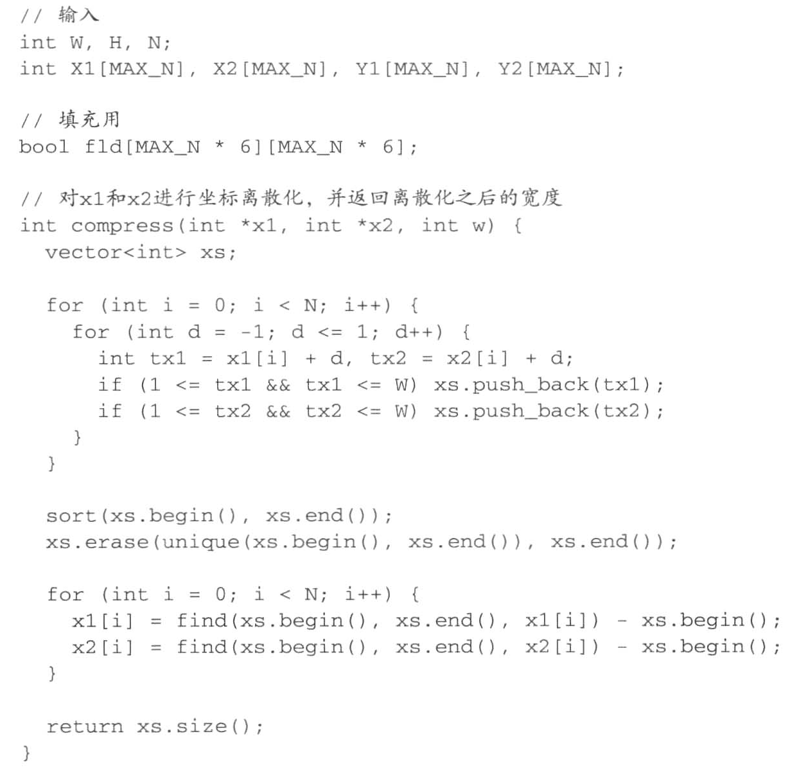
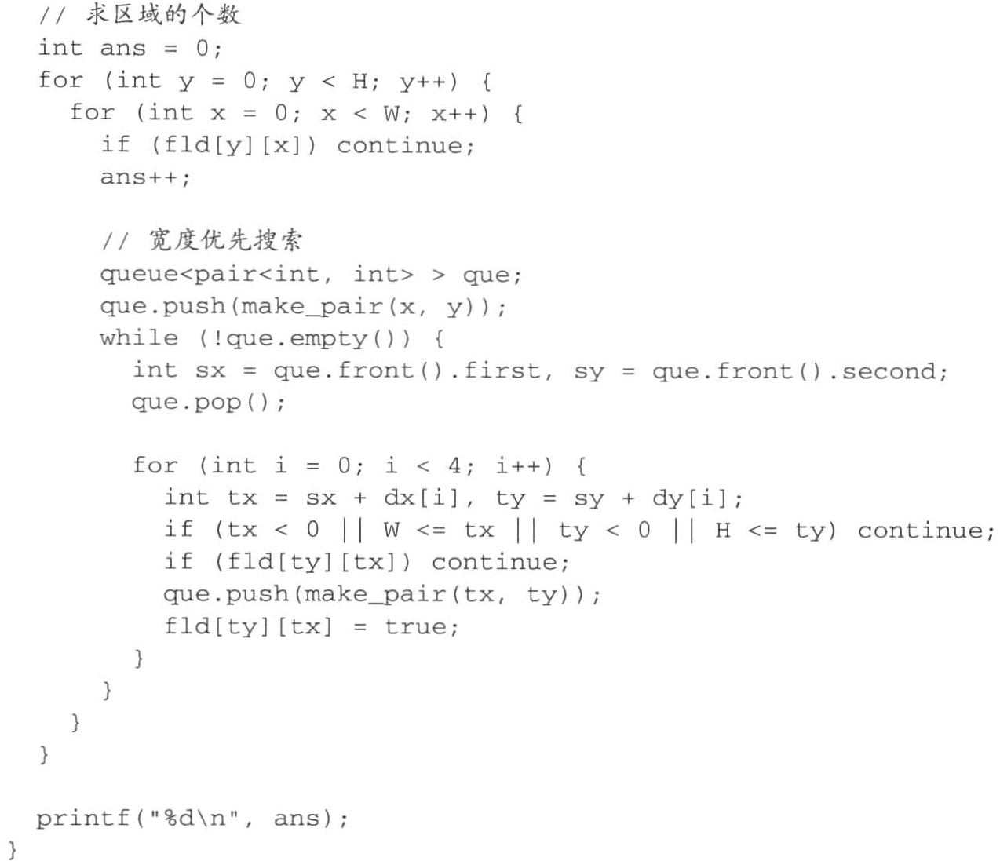

author: GavinZhengOI, PlanariaIce

## 简介

离散化是一种数据处理的技巧，本质上可以看成是一种 [哈希](../string/hash.md#hash-的思想)，其保证数据在哈希以后仍然保持原来的全/偏序关系。

通俗地讲就是当有些数据因为本身很大或者类型不支持，自身无法作为数组的下标来方便地处理，而影响最终结果的只有元素之间的相对大小关系时，我们可以将原来的数据按照排名来处理问题，即离散化。

用来离散化的可以是大整数、浮点数、字符串等等。

## 实现

将一个数组离散化，并进行查询是比较常用的应用场景。

### 方法一

通常原数组中会有重复的元素，一般把相同的元素离散化为相同的数据。

方法如下：

1.  创建原数组的副本。

2.  将副本中的值从小到大排序。

3.  将排序好的副本去重。

4.  查找原数组的每一个元素在副本中的位置，位置即为排名，将其作为离散化后的值。

```cpp
// arr[i] 为初始数组,下标范围为 [1, n]

for (int i = 1; i <= n; ++i)  // step 1
  tmp[i] = arr[i];
std::sort(tmp + 1, tmp + n + 1);                          // step 2
int len = std::unique(tmp + 1, tmp + n + 1) - (tmp + 1);  // step 3
for (int i = 1; i <= n; ++i)                              // step 4
  arr[i] = std::lower_bound(tmp + 1, tmp + len + 1, arr[i]) - tmp;
```

参考实现中使用的 STL 算法可参考 [STL 算法](../lang/csl/algorithm.md)。

同样地，我们也可以对 [std::vector](../lang/csl/sequence-container.md#vector) 进行离散化：

```cpp
// std::vector<int> arr;
std::vector<int> tmp(arr);  // tmp 是 arr 的一个副本
std::sort(tmp.begin(), tmp.end());
tmp.erase(std::unique(tmp.begin(), tmp.end()), tmp.end());
for (int i = 0; i < n; ++i)
  arr[i] = std::lower_bound(tmp.begin(), tmp.end(), arr[i]) - tmp.begin();
```

### 方法二

根据题目要求，有时候会把相同的元素跟据输入顺序离散化为不同的数据。

此时再用 `std::lower_bound()` 函数实现就有些困难了，需要换一种思路：

1.  创建原数组的副本，同时记录每个元素出现的位置。

2.  将副本按值从小到大排序，当值相同时，按出现顺序从小到大排序。

3.  将离散化后的数字放回原数组。

```cpp
struct Data {
  int idx, val;

  bool operator<(const Data& o) const {
    if (val == o.val)
      return idx < o.idx;  // 当值相同时，先出现的元素离散化后的值更小
    return val < o.val;
  }
} tmp[maxn];  // 也可以使用 std::pair

for (int i = 1; i <= n; ++i) tmp[i] = (Data){i, arr[i]};
std::sort(tmp + 1, tmp + n + 1);
for (int i = 1; i <= n; ++i) arr[tmp[i].idx] = i;
```

### 复杂度

对于方法一，去重复杂度为 $O(n)$，排序复杂度为 $O(n \log n)$，最后的 $n$ 次查找复杂度为 $O(n \log n)$。

对于方法二，排序复杂度为 $O(n \log n)$。

故两种方法的总时间复杂度都为 $O(n \log n)$。

空间复杂度为 $O(n)$。

## 习题

-   [\[HAOI2014\] 贴海报](https://www.luogu.com.cn/problem/P3740)
-   [\[NOI2015\] 程序自动分析](https://www.luogu.com.cn/problem/P1955)

???+note "区域的个数"
    

???+note "解题思路"
    
    

???+note "参考代码"
    
    
    

