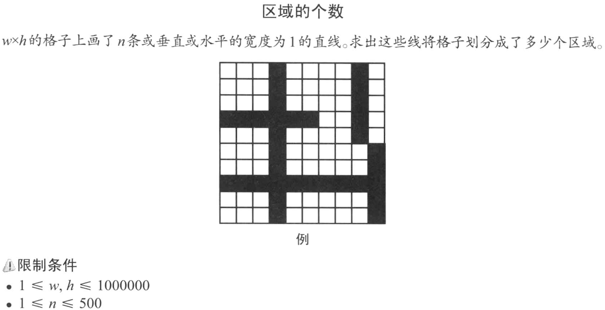
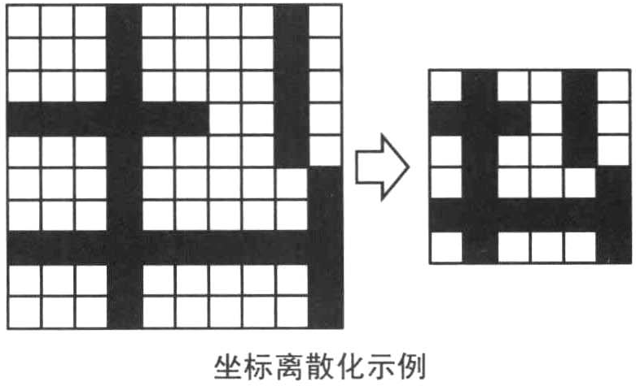

author: GavinZhengOI

## 简介

离散化本质上可以看成是一种 [哈希](../string/hash.md)，其保证数据在哈希以后仍然保持原来的全/偏序关系。

通俗地讲就是当有些数据因为本身很大或者类型不支持，自身无法作为数组的下标来方便地处理，而影响最终结果的只有元素之间的相对大小关系时，我们可以将原来的数据按照从大到小编号来处理问题，即离散化。

用来离散化的可以是大整数、浮点数、字符串等等。

## 实现

C++ 离散化有现成的 STL 算法：

### 离散化数组

将一个数组离散化，并进行查询是比较常用的应用场景：

```cpp
// a[i] 为初始数组,下标范围为 [1, n]
// len 为离散化后数组的有效长度
std::sort(a + 1, a + 1 + n);

len = std::unique(a + 1, a + n + 1) - a - 1;
// 离散化整个数组的同时求出离散化后本质不同数的个数。
```

在完成上述离散化之后可以使用 `std::lower_bound` 函数查找离散化之后的排名（即新编号）：

```cpp
std::lower_bound(a + 1, a + len + 1, x) - a;  // 查询 x 离散化后对应的编号
```

同样地，我们也可以对 `vector` 进行离散化：

```cpp
// std::vector<int> a, b; // b 是 a 的一个副本
std::sort(a.begin(), a.end());
a.erase(std::unique(a.begin(), a.end()), a.end());
for (int i = 0; i < n; ++i)
  b[i] = std::lower_bound(a.begin(), a.end(), b[i]) - a.begin();
```

## 例题

???+note "区域的个数"
    

???+note "解题思路"
    
    

???+note "参考代码"
    
    
    