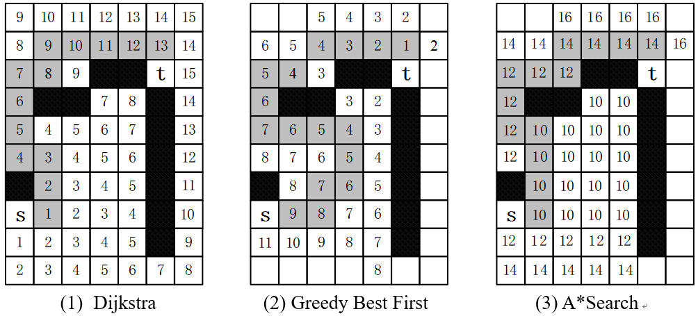
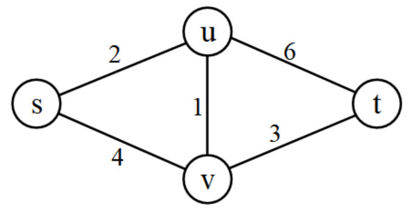
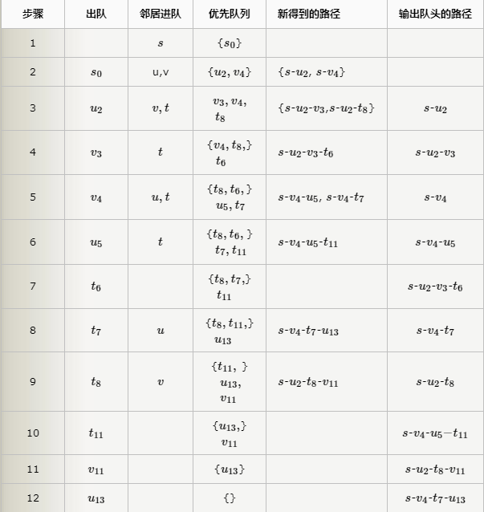
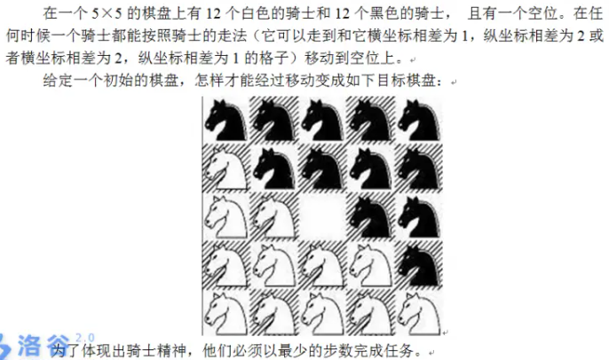

本页面将简要介绍 A\*算法。

## 定义

A\*搜索算法（英文：A\*search algorithm，A\*读作 A-star），简称 A\*算法，是一种在图形平面上，对于有多个节点的路径求出最低通过成本的算法。它属于图遍历（英文：Graph traversal）和最佳优先搜索算法（英文：Best-first search），亦是 [BFS](./bfs.md) 的改进。

## 简介

定义起点 $s$，终点 $t$，从起点（初始状态）开始的距离函数 $g(x)$，到终点（最终状态）的估计距离函数 $h(x)$，到终点（最终状态）的真实距离函数 $h^{\ast}(x)$[^note1]，以及每个点的估价函数 $f(x)=g(x)+h(x)$。

A\*算法每次从优先队列中取出一个 $f$ 最小的元素，然后更新相邻的状态。

如果 $h\leq h*$，则 A\*算法能找到最优解。

上述条件下，如果 $h$ 满足三角形不等式，则 A\*算法不会将重复结点加入队列。

当 $h=0$ 时，A\*算法变为 [Dijkstra](./../graph/shortest-path.md#dijkstra)；当 $h=0$ 并且边权为 $1$ 时变为 [BFS](./bfs.md)。

## A\*搜索算法详解
A\*算法的技术可以概况为：A\*算法 = 贪心最优搜索 + BFS + 优先队列。

在图问题中，“Dijkstra + 优先队列”就是“BFS + 优先队列”，此时也可以概况为：“A\*算法 = 贪心最优搜索 + Dijkstra + 优先队列”。

下面以图的最短路径问题为例，推理出A\*算法的原理。

注意，除了图这种应用场合，A\*算法还能在更多场合下得到应用。

### 贪心最优搜索

贪心最优搜索（Greedy Best First Search ）是一种启发式搜索，效率很高，但是得到的解不一定是最优的。

算法的基本思路就是贪心：从起点出发，在它的邻居结点中选择下一个结点时，挑那个到终点最近的结点。当然，实际上不可能提前知道结点到终点的距离，更不用说挑选出最近的邻居点了。所以，只能采用估计的方法，例如在网格图中，根据曼哈顿距离来估算邻居结点到终点的距离。
如何编程？仍然用“BFS + 优先队列”，不过，在优先队列中排序的，不是从起点s到当前点i的距离，而是从当前点i到终点t的距离。

很明显，贪心最优搜索避开了大量结点，只挑那些“好”结点，速度极快，但是显然得到的路径不一定最优。

在无障碍的网格图中，贪心最优搜索算法的结果是最优解。因为用于估算的曼哈顿距离就是实际存在的最短路，所以每次找到的下一个结点，显然是最优的。

在有障碍的网格图中，根据曼哈顿距离选下一跳结点，路线会一直走到碰壁，然后再绕路，最后得到的不一定是最短路径。

贪心搜索的算法思想是：“只看终点，不管起点”。走一步看一步，不回头重新选择，走错了也不改正。而且，用曼哈顿距离这种简单的估算，也不能提前绕开障碍。
贪心最优搜索的图解，见下面“三种算法对比”。

### Dijkstra（BFS）

用优先队列实现的Dijkstra（BFS） ，能比较高效地求得一个起点到所有其他点的最短路径。Dijkstra算法有BFS的通病：下一步的搜索是盲目的，没有方向感。即使给定了终点，Dijkstra也需把几乎所有的点和边放进优先队列进行处理，直到优先队列弹出终点为止。所以它适合用来求一个起点到所有其他结点的最优路径，而不是只求到一个终点的路径。

Dijkstra的算法思想是：“只看起点，不管终点”。等遍历得差不多了，总会碰到终点的。

Dijkstra的图解，见下面“1.5 三种算法对比”。

### A\*算法的原理和复杂度
A\*算法是贪心最优搜索和Dijkstra的结合，“既看起点，又看终点”。它比Dijkstra快，因为它不像Dijkstra一样盲目；它有贪心搜索的预测能力，而且能得到最优解。

它是如何结合这两个算法的？

设起点是s，终点是t，算法走到当前位置i点，把s-t的路径分为两部分：s-i-t。
1. s-i的路径，由Dijkstra保证最优性；
2. i-t的路径，由贪心搜索进行预测，选择i的下一个结点；
3. 当走到i碰壁时，i将被丢弃，并回退到上一层重新选择新的点j，j仍由Dijkstra保证最优性。
以上思路可以用一个估价函数来具体操作：

f(i) = g(i) + h(i)

f(i)是对i点的评估，g(i)是从s到k的代价，h(i)是从k到t的代价。

若g = 0，则f = h，A\*就退化为贪心搜索；

若h = 0，则f = g，A\*就退化为Dijkstra。

A\*每次根据最小的f(i)来选择下一个点。 g(i)是已经走过的路径，是已知的；h(i)是预测未走过的路径；所以f(i)的性能取决于h(i)的计算。

A\*算法的复杂度，在最差情况下的上界是Dijkstra，或者BFS+队列，一般情况下会更优。

### A\*算法的最优性
A\*算法的解是最优的吗？答案是确定的，它的解和Dijkstra的解一样，是最短路径。

当k到达终点t时，有h(t) = 0，那么f(t) = g(t) + h(t) = g(t)，而g(t)是通过Dijkstra求得的最优解，所以在终点t这个位置，A*算法的解是最优的。

总结：A\*算法通过Dijkstra获得最优性结果；通过贪心最优搜索预测扩展方向，减少搜索的结点数量。

### 三种算法对比

下面这张图 ，准确地说明了三种算法的区别。图中起点是s，终点是t，黑格是障碍。图中精心设置了障碍的位置，以演示三种算法是如何绕过障碍的。



三种算法对比

三个算法都基于"BFS+优先队列"。有数字的格子是搜索过的结点，并进入优先队列处理。阴影格是最后得到的一条完整路径。格子中的数字是距离，按曼哈顿距离计算。Dijkstra（BFS）算法遍历的格子最多，贪心最优搜索算法遍历的格子最少。

1. Dijkstra（BFS）算法。格子中的数字，是从起点s到这个格子的最短距离。算法搜索格子时，把这些格子到起点的距离送入优先队列，当弹出时，就得到了s到这些格子的最短路径。最后，当终点t从优先队列弹出时，即得到s到t的最短距离14。
2. 贪心最优搜索。格子中的数字，是从这个格子到终点t的曼哈顿距离。读者可以仔细分析它的工作过程，这里简单说明如下：从s沿最小曼哈顿距离，一直走到碰壁处的2；2从优先队列弹出后，剩下最小的是3；3弹出后，剩下最小的是4；......；持续这个过程，那些看起来更近但是最终碰壁的结点被逐个弹走，直到拐过障碍，最后到达t。得到的路径不是最优路径。
3. A\*搜索。例如格子i中的数字，是“s到i的最短路 + i到t的曼哈顿距离”。算法在扩展格子的过程中，标记数字的格子都会进入优先队列。在图示中，先弹出所有标记为10的格子，再弹出标记为12的格子，直到最后弹出终点t。最后得到的s-t最短路径也是14。

如何打印出完整的一条路径？三个算法都基于BFS，而BFS记录路径是非常简单的：在结点u扩展邻居点v的时候，在v上记录它的前驱结点u，即可以从v回溯到u；到达目的后，从终点逐步回溯到起点，就得到了路径。在Dijkstra算法中，每次从优先队列中弹出的，都是得到了最短路径的结点，从它们扩展出来的邻居结点，也会继续形成最短路径，所以能根据前驱和后继结点的关系，方便地打印出一条完整的最短路径。A\*算法用Dijkstra算法来确定前驱后继的关系，也一样可以打印出一条最短路径。贪心最优搜索的路径打印最简单，就是普通BFS的路径打印。

### 函数h的设计
在二维平面上，有3种方法可以近似计算h。下面的(i.x, i.y)是i点的坐标，(t.x, t.y)是终点t的坐标。

（1）曼哈顿距离。应用场景：只能在四个方向（上，下，左，右）移动。

h(i) = abs (i.x – t.x) + abs (i.y – t.y)

（2）对角线距离。应用场景：可以在八个方向上移动，例如国际象棋的国王的移动。

h(i) = max {abs(i.x – t.x), abs(i.y – t.y)}

（3）欧几里得距离。应用场景：可以向任何方向移动。

h(i) = sqrt ( (i.x – t.x)2 + (i.y – t.y)2 )

非平面问题，需要设计合适的h函数，后面的例题中有一些比较复杂的h函数。

设计h时注意以下基本规则：
1. g和h应该用同样的计算方法。例如h是曼哈顿距离，g也应该是曼哈顿距离。如果计算方法不同，f = g + h就没有意义了。
2. 根据应用情况正确选择h。各个结点的h值，应该能正确反映它们到终点的距离远近。例如下一跳结点有2个选项：A(280, 319)、B(300, 300)，如果用曼哈顿距离应该选A，用欧氏距离应该选B。如果只能走四个方向（需要按曼哈顿距离计算路径），用欧式距离计算就会出错。
3. h应该优于实际存在的所有路径。前面的例子中，h(i)小于等于i-t的所有可能路径长度，也就是说，最后得到的实际路径，长度大于h(i)。这个规则可以用下面两点讨论来说明。
    - h(i)比i-t的实际存在的最优路径长。假设这条实际的最优路径是path，由于程序是根据h(i)来扩展下一个结点的，所以很可能会放弃path，而选择另一条非最优的路径，这会造成错误。
    - h(i)比i-t的所有实际存在的路径都短。此时i-t上并不存在一条长度为h(i)的路径，如果程序根据h(i)来扩展下一结点，最后肯定会碰壁；但是不要紧，程序会利用BFS的队列操作弹走这些错误的点，退回到合适的结点，从而扩展出实际的路径，所以仍能保证正确性。

上面第（3）点最重要，应用A\*算法时应特别注意。

## 例题

???+note "[K短路](http://poj.org/problem?id=2449)"
    给定一个图，定义起点s和终点t，以及数字k；求s到t的第k短的路。允许环路。相同长度的不同路径，也被认为是完全不同的。
    
    K短路问题是A\*算法应用的经典例子，几乎完全套用了A*算法的估价函数。

    ??? tip
        下面分别用暴力法和A\*算法求解。
        
        （1）暴力法：BFS + 优先队列
        
        用BFS搜索所有的路径，用优先队列让路径按从短到长的顺序输出。
        
        “BFS+优先队列”求最短路，在“BFS+优先队列”这一节中曾讲解过。其原理是当再次扩展到某个点i时，如果这次的新路径比上次到达i的路径更短，就替代它；优点队列可以让结点按路径长短先后输出，从而保证最优性。队列的元素是一个二元组(i, dist(s-i))，即结点i和路径s-i的长度。
        
        BFS求所有路径，就是最简单的“BFS + 优先队列”，再次扩展邻居i时，计算它到s的距离，然后直接进队列，并不与上次i进队列的情况进行比较。一个结点i会进入优先队列很多次，因为可以从它的多个邻居分别走过来；每一次代表了一个从s到i的路径。优先队列可以让这些路径按dist从短到长的顺序输出，i从优先队列中第x次弹出，就是s到i的第x个短路。对于终点t，统计它出队列的次数，第K次时停止，这就是第K短路。
        
        在K短路问题中，路径有可能形成环路。有的题目允许环路，有的不允许。如果允许环路，那么想在环路上绕多少圈都可以，环路上的结点反复进入队列，K可以无限大。
        
        在最短路算法中并不需要判断环路，因为更新操作有去掉环路的隐含作用。
        
        复杂度：因暴力法需要生成几乎所有的路径，而路径数量是指数增长的，所以暴力法的复杂度非常高。
        
        下面用一个简单的图例解释BFS暴力搜索所有路径的过程。

        

        一个简单图
        
        下面的表格给出了算法的步骤。结点后面的下标表示从s到这个结点的路径长度，例如u2，就是二元组(u, 2)，即结点u，以及s-u的路径长度2。步骤中没有列出环路。

        

        从第二列的“出队”可以看到，共产生10个路径，按从短到长的顺序排队输出。从起点s到终点t共有4条路径，t在第7、8、9、10步出队的时候，输出了第1、第2、第3、第4路径。表格中也列出了s到每个结点的多个路径和它们的长度，例如s-u有3个路径，s-v有3个路径。
        
        （2）A\*算法求K短路
        
        从暴力法可以知道：
        
        1）从优先队列弹出的顺序，是按这些结点到s的距离排序的。
        
        2）一个结点i从优先队列第x次弹出，就是s-i的第x短路；终点t从队列中第K次弹出，就是s-t的第K短路。
        
        如何优化暴力法？是否可以套用A\*算法？
        
        联想前面讲解A\*算法求最短路的例子，A*算法的估价函数f(i) = g(i) + h(i)，g是从起点s到i的距离，h是i到终点t的最短距离（例子中是曼哈顿距离）。
        
        那么在K短路问题中，可以设计几乎一样的估价函数。g(i)仍然是起点s到i的距离；而h(i)，只是把曼哈顿距离改为从i到t的最短距离。这个最短距离如何求？用Dijkstra算法，以终点t为起点，求所有结点到t的最短距离即可。
        
        编程非常简单。仍用暴力法的“BFS+优先队列”，但是在优先队列中，用于计算的不再是g(i)，而是f(i)。当终点t第K次弹出队列时，就是第K短路。
        
        根据前面对A\*算法原理的解释，求K短路的过程将得到很大优化。虽然在最差情况下，算法复杂度的上界仍是暴力法的复杂度，但优化是很明显的。

???+note "[Power Hungry Cows](http://poj.org/problem?id=1945)"
    **题目描述：** 两个变量a、b，初始值a = 1, b = 0。每一步可以执行一次a×2，b×2，a+b，|a-b|之一的操作，并把结果再存回a或者b。问最快多少步能得到一个整数P，1 <= P <= 20,000。
    
    例如P = 31，需要6步：
    
    a  b
    
    初始值：    1  0
    
    a×2，存到b： 1  2
    
    b×2：    1  4
    
    b×2：    1  8
    
    b×2：    1  16
    
    b×2：    1  32
    
    b-a：     1  31
    
    **样例输入：**
    
    31
    
    **样例输出：**
    
    6

    ??? tip
        （1）BFS+剪枝
        
        这一题是典型的BFS。从{a, b}可以转移到8种情况，即{2a, a}、{2a, b}、{2b,a}、{2b,b}等等。把每种{a, b}看成一个状态，那么1个状态可以转移到8个状态。编码时，再加上去重和剪枝。此题P不是太大，“BFS+剪枝”可行。
        
        （2）A\*算法
        
        如何设计估价函数f(i) = g(i) + h(i) ？
        
        g(i)是从初始态到i状态的步数。h(i)是从i状态到终点的预估最少步数，它应该小于实际的步数。如何设计呢？容易观察到，{a, b}中的较大数，一直乘以2递增，是最快的。例如样例中的31，在起点状态，2^5 > 31，经5步可以超过目标值，所以h = 5。

???+note "[八数码](https://www.luogu.com.cn/problem/P1379)" 
    题目大意：在 $3\times 3$ 的棋盘上，摆有八个棋子，每个棋子上标有 $1$ 至 $8$ 的某一数字。棋盘中留有一个空格，空格用 $0$ 来表示。空格周围的棋子可以移到空格中，这样原来的位置就会变成空格。给出一种初始布局和目标布局（为了使题目简单，设目标状态如下），找到一种从初始布局到目标布局最少步骤的移动方法。
    
    ```plain
        123
        804
        765
    ```

    ??? tip
        $h$ 函数可以定义为，不在应该在的位置的数字个数。
        
        容易发现 $h$ 满足以上两个性质，此题可以使用 A\*算法求解。

    ??? note "参考代码"
        ```cpp
        --8<-- "docs/search/code/astar/astar_1.cpp"
        ```

???+note "[k 短路](https://www.luogu.com.cn/problem/P2483)" 
    按顺序求一个有向图上从结点 $s$ 到结点 $t$ 的所有路径最小的前任意多（不妨设为 $k$）个。

    ??? tip
        很容易发现，这个问题很容易转化成用 A\*算法解决问题的标准程式。
        
        初始状态为处于结点 $s$，最终状态为处于结点 $t$，距离函数为从 $s$ 到当前结点已经走过的距离，估价函数为从当前结点到结点 $t$ 至少要走过的距离，也就是当前结点到结点 $t$ 的最短路。
        
        就这样，我们在预处理的时候反向建图，计算出结点 $t$ 到所有点的最短路，然后将初始状态塞入优先队列，每次取出 $f(x)=g(x)+h(x)$ 最小的一项，计算出其所连结点的信息并将其也塞入队列。当你第 $k$ 次走到结点 $t$ 时，也就算出了结点 $s$ 到结点 $t$ 的 $k$ 短路。
        
        由于设计的距离函数和估价函数，每个状态需要存储两个参数，当前结点 $x$ 和已经走过的距离 $v$。
        
        我们可以在此基础上加一点小优化：由于只需要求出第 $k$ 短路，所以当我们第 $k+1$ 次或以上走到该结点时，直接跳过该状态。因为前面的 $k$ 次走到这个点的时候肯定能因此构造出 $k$ 条路径，所以之后再加边更无必要。

    ??? note "参考代码"
        ```cpp
        --8<-- "docs/search/code/astar/astar_2.cpp"
        ```

## 习题

??? note "[八数码难题](https://www.luogu.com.cn/problem/P1379)"
    在 3×3 的棋盘上，摆有八个棋子，每个棋子上标有 1 至 8 的某一数字。棋盘中留有一个空格，空格用 0 来表示。空格周围的棋子可以移到空格中。要求解的问题是：给出一种初始布局（初始状态）和目标布局（为了使题目简单,设目标状态为 123804765），找到一种最少步骤的移动方法，实现从初始布局到目标布局的转变。

    ??? tip
        首先我们可以将这个3x3的矩阵转化为一个九位数字，存入队列时也会方便很多，按方向尝试0周围的数字，判重记答案时可以使用map。然后就这样进行单向的BFS，accepted！

        重要优化：双向BFS
        双向BFS的使用要求之一就是知道终止状态，这道题目实在是在合适不过了。 这里可以将判重数组的值设为0,1,2，分别代表未访问过，顺序访问过，逆序访问过，当某个状态被顺序逆序都访问过时，那么这就是连接答案的那个状态。如果看到这里还不甚理解，不用着急，代码是比较清晰的。

    ??? note "参考代码"

        ```cpp
        #include<bits/stdc++.h>
        #define ll long long int
        using namespace std;
        int n,g=123804765;
        short a[4][4],fx,fy,nx,ny;
        int dx[4]={1,-1,0,0};
        int dy[4]={0,0,1,-1}; //代表向四个方向移动
        queue<int> q;
        map<int,int> v;
        map<int,int> ans;
        void solve()
        {
            if(n==g) 		 //特判
            {
                printf("0");
                exit(0);
            }				
            q.push(n);		//起始状态与终止状态同时入队
            q.push(g);
            ans[n]=0;
            ans[g]=1;		
            v[g]=2;			//将两个方向标记成不同的数字
            v[n]=1;
            while(!q.empty())
            {
                ll now,cur=q.front();
                q.pop();
                now=cur;
                for(int i=3;i>=1;i--)
                    for(int j=3;j>=1;j--)
                    {
                        a[i][j]=now%10,now/=10;
                        if(a[i][j]==0) fx=i,fy=j;
                    }
                for(int i=0;i<4;i++)
                {
                    nx=fx+dx[i];
                    ny=fy+dy[i];
                    if(nx<1 || nx>3 || ny<1 || ny>3) continue;
                    swap(a[fx][fy],a[nx][ny]);
                    now=0;
                    for(int p=1;p<=3;p++)
                        for(int j=1;j<=3;j++)
                            now=now*10+a[p][j];	//数字转矩阵
                    if(v[now]==v[cur]) 
                    {
                        swap(a[fx][fy],a[nx][ny]); //一定要先换回来再跳过
                        continue;
                    }
                    if(v[now]+v[cur]==3)		//说明新延伸出的点已被另一方向访问过
                    {
                        printf("%d",ans[cur]+ans[now]);//两方向步数和即为总步数
                        exit(0);
                    }
                    ans[now]=ans[cur]+1;
                    v[now]=v[cur];				//与上一状态的方向保持一致
                    q.push(now);
                    swap(a[fx][fy],a[nx][ny]); //不要忘记将还回来
                }	
            }
        }
        int main()
        {
            scanf("%d",&n);
            solve();
        }
        ```

??? note "[骑士精神](https://www.luogu.com.cn/problem/P2324)"
    

    ??? tip
        迭代加深的A*算法

        所谓迭代加深就是每次限制搜索深度， 这样可以在整个搜索树深度很大而答案深度又很小的情况下大大提高效率

        因为最大步数不超过15， 所以直接枚举1到15作为最大步数进行迭代加深搜索判断

        在这里我们的A*估价函数设置为当前状态还有多少个位置与目标状态不对应

        若当前步数+估价函数值>枚举的最大步数 则直接返回

        当然这只是基本思路，搜索还可以有很大优化

        我们在搜索中再加入最优性剪枝， 显然当前枚举下一个状态时如果回到上一个状态肯定不是最优， 所以我们在枚举下一状态时加入对这种情况的判断

    ??? note "参考代码"

        ```cpp
        #include<iostream>
        #include<cstdio>
        #include<vector>
        #include<queue>
        #include<algorithm>
        #include<cstring>
        using namespace std;

        int read()
        {
            int f=1,x=0;
            char ss=getchar();
            while(ss<'0'||ss>'9'){if(ss=='-')f=-1;ss=getchar();}
            while(ss>='0'&&ss<='9'){x=x*10+ss-'0';ss=getchar();}
            return f*x;
        }

        int n;
        int ans[6][6]=
        {{0,0,0,0,0,0},
        {0,1,1,1,1,1},
        {0,0,1,1,1,1},
        {0,0,0,2,1,1},
        {0,0,0,0,0,1},
        {0,0,0,0,0,0}};
        int nxtx[]={1,1,2,2,-2,-2,-1,-1};
        int nxty[]={2,-2,1,-1,1,-1,2,-2};
        int a[10][10],k;
        int judge;

        int check()
        {
            for(int i=1;i<=5;++i)
            for(int j=1;j<=5;++j)
            if(ans[i][j]!=a[i][j])return 0;
            return 1;
        }

        int test(int step)
        {
            int cnt=0;
            for(int i=1;i<=5;++i)
            for(int j=1;j<=5;++j)
            if(ans[i][j]!=a[i][j]){ if(++cnt+step>k) return 0;}
            return 1;
        }

        void A_star(int step,int x,int y,int pre)//pre记录上一步怎么到当前状态
        {
            if(step==k){ if(check())judge=1; return;}
            if(judge) return;
            for(int i=0;i<8;++i)
            {
                int nx=x+nxtx[i],ny=y+nxty[i];
                if(nx<1||nx>5||ny<1||ny>5||i+pre==7) continue;//加入了上述的最优性剪枝
                swap(a[x][y],a[nx][ny]);
                if(test(step)&&!judge) A_star(step+1,nx,ny,i);//A*估价再向下搜索
                swap(a[x][y],a[nx][ny]);
            }
        }

        int main()
        {
            n=read();
            while(n--)
            {
                int x,y; judge=0;
                for(int i=1;i<=5;++i)
                {
                    char ss[7]; scanf("%s",&ss);
                    for(int j=0;j<5;++j)
                    if(ss[j]=='*') a[i][j+1]=2,x=i,y=j+1;
                    else a[i][j+1]=ss[j]-'0';
                }
                for(k=1;k<=15;++k)
                {
                    A_star(0,x,y,-1);
                    if(judge) { printf("%d\n",k); break;}
                }
                if(!judge)printf("-1\n");
            }
            return 0;
        }
        ```

??? note "[Cow Jogging](https://www.luogu.com.cn/problem/P2901)"
    贝西终于尝到了懒惰的后果，决定每周从谷仓到池塘慢跑几次来健身。当然，她不想跑得太累，所以她只打算从谷仓慢跑下山到池塘，然后悠闲地散步回谷仓。

    同时，贝西不想跑得太远，所以她只想沿着通向池塘的最短路径跑步。一共有 $M$ 条道路，其中每一条都连接了两个牧场。这些牧场从 $1$ 到 $N$ 编号，如果 $X>Y$，则说明牧场 $X$ 的地势高于牧场 $Y$，即下坡的道路是从 $X$ 通向 $Y$ 的，$N$ 为贝西所在的牛棚（最高点），$1$ 为池塘（最低点）。

    然而，一周之后，贝西开始对单调的路线感到厌烦，她希望可以跑不同的路线。比如说，她希望能有 $K$ 种不同的路线。同时，为了避免跑得太累，她希望这 $K$ 条路线是从牛棚到池塘的路线中最短的 $K$ 条。如果两条路线包含的道路组成的序列不同，则这两条路线被认为是不同的。

    请帮助贝西算算她的训练强度，即将牧场网络里最短的 $K$ 条路径的长度分别算出来。你将会被提供一份牧场间路线的列表，每条道路用 $(X_i, Y_i, D_i)$ 表示，意为从 $X_i$ 到 $Y_i$ 有一条长度为 $D_i$ 的下坡道路。

    ??? tip
        顾名思义，就是求一张图的第 K 短的路径。考虑如何用 A∗ 优化这个过程。我们先求出所有的点到终点的距离 $dis_i$ ，然后跑一遍 A* 算法。 $d^∗$ 函数就是当前状态（点）的 dis 值，记从起点到当前点的花费为 t，故而 $f^∗ = d^∗ + g = dis + t$ 。

        我们发现这个 $d^∗$ 函数是相当优秀的。首先，它一定 ≤ d，为什么？因为从一个点到终点的花费肯定 ≥ dis（否则 dis 就不是最短路径了呀）。其次，它足够优秀，足够大，是我们暂时能想到的，最好求，最大的 $d^∗$ 函数了。

        这么做还有一个好处，就是第 u 次到达终点就是第 u 短路。

        1. 求出所有的 dis (一遍SPFA/dijkstra) 搞定
        2. 把起点入队列
        3. 扩展 dis + t 最小的点
        4. 然后它是终点，则记录，如果求出 K 短路，再见
        5. 不断进行 3 直至出解

    ??? note "参考代码"

        ```cpp
        typedef long long ll;int n,m,k;
        const int N=1e3+100,M=1e6+100;
        struct edge{int next,to;ll len;};
        edge e[M],E[M];int h[N],H[N],tot,Tot;
        inline void add(int a,int b,int c){
            e[++tot]=(edge){h[a],b,c};h[a]=tot;
        }//链式前向星——正向图 
        inline void Add(int a,int b,int c){
            E[++Tot]=(edge){H[a],b,c};H[a]=Tot;
        }//链式前向星——反向图 
        int dis[N];//点到终点的长度 
        bool vis[N];//SPFA判重用数组 
        inline void spfa_algorithm(){
            queue<int> q;q.push(1);
            memset(dis,127,sizeof(dis));
            memset(vis,true,sizeof(vis));
            vis[1]=false;dis[1]=0;
            while (q.size()){
                int u=q.front();q.pop();vis[u]=1;
                for(int i=H[u];i;i=E[i].next){
                    register int to=E[i].to;
                    if (dis[to]>dis[u]+E[i].len){
                        dis[to]=dis[u]+E[i].len;//updata
                        if (vis[to]){vis[to]=0;q.push(to);}
                    }//单源最短路的松弛操作 
                }//特别注意，我们跑的是反向图 
            }
        }
        struct node{int pos;ll len;};
        bool operator < (node a,node b){
            return a.len+dis[a.pos]>b.len+dis[b.pos];
        }//特别注意，因为使用了STL的优先队列
        //所以这里的“小于”必须定义为“大于” 
        int A_star_algorithm(int &ret){
            priority_queue<node> q;
            q.push((node){n,0});
            while (q.size()){
                node z=q.top();q.pop();
                if (z.pos==1){//又到终点了 
                    printf("%lld\n",z.len);
                    if ((--ret)==0) return 0;
                }
                register int u=z.pos,i;
                for(i=h[u];i;i=e[i].next){
                    register int to=e[i].to;
                    q.push((node){to,z.len+e[i].len});
                }
            }
            return ret;
        }
        int main(){
            n=read();m=read();k=read();
            for(int i=1,u,v,w;i<=m;i++){
                u=read();v=read();w=read();
                add(u,v,w);Add(v,u,w);
            }
            spfa_algorithm();
            A_star_algorithm(k);
            while (k--) printf("-1\n");
            return 0;
        }
        ```

## 参考资料与注释

[^note1]: 此处的 h 意为 heuristic。详见 [启发式搜索 - 维基百科](https://zh.wikipedia.org/wiki/%E5%90%AF%E5%8F%91%E5%BC%8F%E6%90%9C%E7%B4%A2) 和 [A\*search algorithm - Wikipedia](https://en.wikipedia.org/wiki/A*_search_algorithm#Bounded_relaxation) 的 Bounded relaxation 一节。
