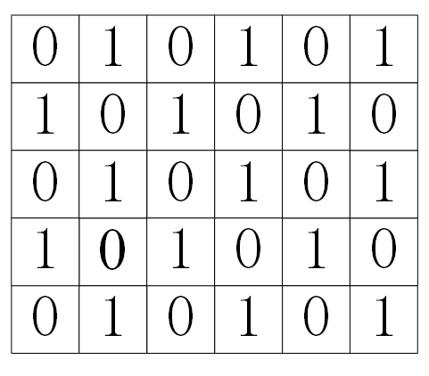
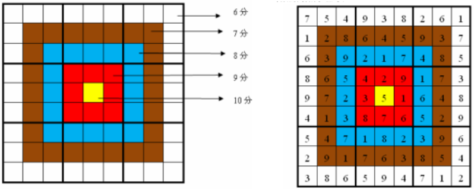

本页面将简要介绍回溯法的概念和应用。

## 简介

回溯法（剪枝）是一种经常被用在 [深度优先搜索（DFS）](./dfs.md) 和 [广度优先搜索（BFS）](./bfs.md) 的技巧。

剪枝是搜索常用的优化手段，常常能把指数级的复杂度，优化到近似多项式的复杂度。

剪枝其本质是：走不通就回头：把不会产生答案的，或不必要的枝条“剪掉”。剪枝的关键在于剪枝的判断：什么枝该剪、在什么地方减。

BFS的剪枝通常是判重，如果搜索到某一层时，出现重复的状态，就剪枝。例如经典的八数码问题，核心问题就是去重，把曾经搜过的八数码的组合剪去。

DFS的剪枝技术较多，有可行性剪枝、最优性剪枝、搜索顺序剪枝、排除等效冗余、记忆化搜索等等。

可行性剪枝：对当前状态进行检查，如果当前条件不合法就不再继续，直接返回。

搜索顺序剪枝：搜索树有多个层次和分支，不同的搜索顺序会产生不同的搜索树形态，复杂度也相差很大。

最优性剪枝：在最优化问题的搜索过程中，如果当前花费的代价已超过前面搜索到的最优解，那么本次搜索已经没有继续进行下去的意义，此时停止对当前分支的搜索进行回溯。

排除等效冗余：搜索的不同分支，最后的结果是一样的，那么只搜一个分支就够了。

记忆化搜索：在递归的过程中，有许多分支被反复计算，会大大降低算法的执行效率。用记忆化搜索，将已经计算出来的结果保存起来，以后需要用到的时候直接取出结果，避免重复运算，从而提高了算法的效率。记忆化搜索一般在DP中讲解，

一个题目中可能用到多种剪枝技术，请通过下面的例题掌握剪枝。

## 过程

1. 构造空间树；

2. 进行遍历；

3. 如遇到边界条件，即不再向下搜索，转而搜索另一条链；

4. 达到目标条件，输出结果。

## 例题

???+note "[Catch That Cow](http://poj.org/problem?id=3278)"
    在一根直线上，奶牛在K位置，农夫在N位置。农夫想抓到牛，他有3种移动方法，例如他在X位置，他可以移动到X-1、X+1、2X的位置。问农夫最快要移动多少次，能从N到达K。0 ≤ N, K ≤ 100,000。

    ??? tip
        从N到K的最短路径问题，显然用BFS，每一步有3个分支。
        
        可行性剪枝：如果农夫当前位置大于k，那么农夫只能不断做X-1操作，而不能使用变大的X+1、2X这2种操作。

???+note "[数字三角形](https://www.luogu.com.cn/problem/P1118)"
    写出一个1至N的排列ai，然后每次将相邻两个数相加，构成新的序列，再对新序列进行这样的操作，显然每次构成的序列都比上一次的序列长度少1，直到只剩下一个数字位置。下面是一个例子：
    
    3  1  2  4
    
    4  3  6
    
    7  9
    
    16
    
    最后得到16这样一个数字。
    
    现在倒着玩这样一个游戏，如果知道N，知道最后得到的数字的大小sum，请你求出最初序列ai，为1至N的一个排列。若答案有多种可能，则输出字典序最小的那一个。n≤12, sum≤12345。

    ??? tip
        1) 暴力法。对1～N这N个数做从小到大的全排列，对每个全排列进行三角形的计算，判断是否等于N。
        
        对每个排列进行三角形计算，需要O(N2)次。例如第1行有5个数{a,b,c,d,e}，那么第2行计算4次，第3行计算3次...等等，总次数是O(N2)的。
        
        a    b    c    d    e
        
        a+b    b+c   c+d   d+e
        
        a+2b+c b+2c+d c+2d+e
        
        a+3b+3c+d b+3c+3d+e
        
        a+4b+6c+4d+e
        
        共有N!=4亿个排列，总复杂度是O(N!N2)的，显然会超时。
        
        2) 三角计算优化+剪枝。
        
        三角计算的优化。对排列进行三角形计算，并不需要按部就班地算，比如{a,b,c,d,e}这5个数，直接算最后一行的公式a+4b+6c+4d+e就好了，复杂度是O(N)的。不同的N有不同的系数，比如5个数的系数是{1,4,6,4,1}，提前算出所有N的系数备用。可以发现，这些系数正好是杨辉三角。
        
        剪枝。即使有了杨辉三角的优化，总复杂度还是有O(N!N)，所以必须进行最优性剪枝。对某个排列求三角形和时，如果前面几个元素和已经大于sum，那么后面的元素就不用再算了。例如，N=9时，计算到排列{2,1,3,4,5,6,7,8,9}，如果前5个元素{2,1,3,4,5}求和已经大于sum，那么后面的{6,7,8,9}～{9,8,7,6}都可以跳过，下一个排序从{2,1,3,4,6,5,7,8,9}开始。本题sum≤12345，和不大，用这个简单的剪枝方法可以通过。
        
        3) 可以用DFS求全排列，也可以直接用STL 的next_permutation()求全排列。

???+note "[吃奶酪](https://www.luogu.com.cn/problem/P1433)"
    房间里有n块奶酪。一只小老鼠要把它们都吃掉，问至少要跑多少距离？1≤n≤15。

    ??? tip
        1. 这是一个全排列问题，15个奶酪有15!=1.3万亿种排列。
        2. 暴力法：用DFS搜所有的排列，代码很容易写。
        3. 在测试数据比较水的情况下，可以用最优性剪枝。在DFS中，用sum记录当前最短距离，每次计算新的路径时，如果超过了sum，就退出。剪枝的效率和测试数据有关，如果碰巧有很恶劣的数据，会超时。
        4. 本题的标准解法是状态压缩DP，它不受测试数据的影响，复杂度是$O(n2^n)$。

???+note "[Tempter of the Bone](http://acm.hdu.edu.cn/showproblem.php?pid=1010)"
    **题目描述：** 一个迷宫有N*M格，有一些格子是地板能走，有一些格子是障碍不能走。给一个起点S和一个终点D。一只小狗从S出发，每步走一块地板，在每个地板不能停留，而且走过的地板都不能再走。给定一个T，问小狗能正好走T步到达D吗？
    
    **输入输出：** 有很多测试样例，每个测试中，第1行是整数N，M，T， 1 < N, M < 7, 0 < T < 50。后面有N行，每行M个字符，有这些字符：'X': 墙；'S': 起点；'D': 终点；'.': 地板。最后一行是'0 0 0'，表示结束。如果狗能逃出，输出YES，否则输出NO。
    
    输入输出样例：
    
    输入
    
    4 4 5
    
    S.X.
    
    ..X.
    
    ..XD
    
    ....
    
    3 4 5
    
    S.X.
    
    ..X.
    
    ...D
    
    0 0 0
    
    输出
    
    NO
    
    YES。

    ??? tip
        搜索用BFS还是DFS？对于路径问题，应该用DFS，因为DFS“一路深入”，天然就产生了一条路径，而BFS逐层推进，把层与层之间连续的路径打断了，想表示一个路径很困难。
        
        首先考虑暴力搜索的复杂度。在所有可能的路径中，看其中是否有长度为T的路径。
        
        直接搜所有的路径，会超时。有多少可能的路径呢？这题图很小，但是路径数量很惊人。1 < N, M < 7，最多36个格子，设最长路径是36，每个点有3个出口，那么就有3^36个路径，是天文数字。即使在DFS的时候加上一点限制条件，即格子不能重复走，那么也会搜到百万以上的的路径。
        
        这一题最重要的技术，网上称为“奇偶剪枝”。不过，本文认为“奇偶剪枝”这个说法不准确，称为“奇偶判断”更合适，因为它并不需要在DFS内部剪枝，见本节后面的讨论。
        
        首先看2个容易发现的可行性剪枝：
        
        （1）当前走了k步，如果k>T，已经走的超过了限制步数，还没有找到D点，则剪掉。在k>T的基础上，可以发现下面更好一点的剪枝。
        
        （2）设从起点S走了k步到了当前位置(x,y)，而(x,y)到D点(c,d)的最短距离为f，如果有k+f>T，也就是T−k−f<0，这说明剩下还允许走的步数比最短距离还少，肯定走不到了，剪掉。记tmp=T−k−f。f很容易求，它就是曼哈顿距离：f=abs(c−x)+abs(d−y)。这是理论上的最短距离，中间可能有障碍，不过不影响逻辑。
        
        由于剪枝（2）比剪枝（1）严格，所以保留（2）就行了，（1）是多余的。
        
        以上2个优化很有限，真正有用的是“奇偶剪枝”：若tmp是偶数，则可能有解；若tmp是奇数，肯定无解。
        
        下面描述“奇偶剪枝”的原理。令tmp=T−k−f=T′−f，T′是当前位置(x,y)到D点要走的距离，那么tmp表示在最短路径之外，还必须要走的步数，那么只能绕路了。比较简单的绕路方法是：在最短路径上找2个相邻点u,v，现在不直接走(u-v)，而是从u出发绕一圈再到v，新路径是(u-...-v)；读者可以发现，在这种方格图上，原来(u-v)的步数是1，绕路后，(u-...-v)的步数一定比1大偶数步，也就是tmp是个偶数。如果不用这个简单办法绕路，改用别的绕路方法，tmp也是偶数。
        
        其实，上述解释过于繁琐了，下面的图解更加透彻，而且还能得到更简洁的结果。
        
        实际上在这个题目中，只需要对起点S、终点D做一次奇偶判断就够了，DFS内部不用再做。因为，从S走到方格中的任何一点x，x与D的奇偶性，与S和D的奇偶性相同。
        
        所以，奇偶判断应该在DFS之前做，判断有解后再进行DFS。DFS内部的奇偶判断是多余的；奇偶判断并不能减少DFS内部搜索的数量，因为这是独立的两件事。
        
        以上说法，用下面的图来解释方格图的奇偶性，就能明白。

        

        方格图的奇偶性
        
        对每个方格用0、1进行交错标记。从0格子走一步，只能到1格子，从1格子走一步只能到0格子。图中任取2个点为起点S和终点D，如果它们都是0或1，那么偶数步才能走到；如果一个是0一个是1，那么奇数步才能走到。这就是奇偶判断的原理。
        
        所以，给定起点S、终点D，以及限制的步数T，可以立刻判断是否有解：（1）S和D同0或同1，T是偶数，可能有解；T是奇数，必定无解。（2）S和D不同，T是奇数，可能有解；T是偶数，必定无解。
        
        如果判断可能有解，有以下推论：从S出发到任何一个点x，x到D也可能有解，因为x和D，与S和D的奇偶性相同。例如：S和D都是0，T是偶数，可能有解；现在S走一步到x，x是1，D还是0，T也减少1变成了奇数，那么从x到D仍满足可能有解的判断。
        
        但是，方格的0、1标记如何得到呢？或者换个说法：给定S和D，如何判断它们的0、1是否相同呢？很简单，用曼哈顿距离，即上面的f=abs(c−x)+abs(d−y)就可以。如果S和D的曼哈顿距离f是奇数，说明S和D一个是0一个是1；如果f是偶数，说明S和D同0或同1。
        
        在本题中，如果T−f是奇数则肯定无解，因为：假设T是奇数，那么f只能是偶数，也就是说限制走奇数步T，但是S和D之间的路径是偶数步的，互相矛盾。
        
        最后，从以上分析可以知道，奇偶判断只能用在方格图上。方格里允许有不可走的障碍，这些障碍不影响逻辑正确性。

    ??? note "参考代码"

        ```cpp
        #include <bits/stdc++.h>
        using namespace std;
        char mat[8][8],visit[8][8];
        int n, m, t;
        int flag;           //flag=1，表示找到了答案
        int a, b, c, d;     //起点S(a,b)，终点D(c,d)
        int dir[4][2] = {{1,0}, {-1,0}, {0,1}, {0,-1}};        //上下左右4个方向
        #define CHECK(xx,yy) (xx>=0 && xx<n && yy>=0 && yy<m)  //是否在迷宫中
        void dfs(int x, int y, int time){     
            if(flag)  return;                   //逐层退出DFS，有多少层DFS，就退多少次
            
            if(mat[x][y] == 'D'){        
                if(time == t)    flag = 1;      //找到答案
                return;                         //D只能走一次，所以不管对不对，都返回   
            }    
            //if(time > t)     return;          //剪枝(1)：因为有剪枝(2)，(1)就多余了
        int tmp = t - time - abs(c-x) - abs(d-y);
            if(tmp < 0)     return;             //剪枝（2）
            //if(tmp & 1)   return;             //奇偶剪枝：不应该在这里做
            
            for(int i=0; i<4; i++){             //上下左右
                int xx = x + dir[i][0], yy = y + dir[i][1];
                if(CHECK(xx,yy)  && mat[xx][yy]!='X' && !visit[xx][yy]){      
                    visit[xx][yy] = 1;          //地板标记为走过，不能再走        
                    dfs(xx, yy, time + 1);      //遍历所有的路径
                    visit[xx][yy] = 0;          //递归返回，这块地板恢复为没走过
                }
            }    
            return;
        }
        int main(){
            while(~scanf("%d%d%d",&n,&m,&t)){
                if(n==0 && m==0 && t==0)    break;
                for(int i=0;i<n;i++)
                    for(int j=0;j<m;j++){
                        cin>>mat[i][j];
                        if(mat[i][j] == 'S') a=i,b=j;
                        if(mat[i][j] == 'D') c=i,d=j;
                    }
                memset(visit, 0, sizeof(visit));
                int tmp = t - abs(c-a) - abs(d-b);  //在DFS之前，做奇偶判断
                if(tmp & 1){                        //无解，不用DFS了
                    puts("NO"); 
                    continue;
                }
                flag = 0;
                visit[a][b] = 1;                    //标记起点已经走过
                dfs(a, b, 0);                       //搜索路径
                
                if(flag) puts("YES");
                else     puts("NO");
            }
            return 0;
        }
        ```

???+note "[小木棍](https://www.luogu.com.cn/problem/P1120)"
    乔治有一些同样长的小木棍，他把这些木棍随意砍成几段，直到每段的长都不超过50。现在，他想把小木棍拼接成原来的样子，但是却忘记了自己开始时有多少根木棍和它们的长度。给出每段小木棍的长度，编程帮他找出原始木棍的最小可能长度。N表示砍过以后的小木棍的总数，N≤65。

    ??? tip
        （1）暴力法。尝试原始木棍所有可能的长度，看是否能拼接好这N个小木棍。例如：设原始木棍长度为D，搜索所有的木棍组合，如果能够把N个木棍都拼接成长度为D的木棍，则D就是一个合适的长度；在所有合适的长度中，取最小值输出。
        
        用DFS搜索所有的组合。复杂度：对一个D的检查，小木棍的组合是O(N!)的。
        
        （2）剪枝:

        1. 优化搜索顺序。把小木棍按长度从大到小排序，然后按从大到小的顺序做拼接的尝试。过程是：对于给定的可能长度D，从最长的小木棍开始拼接，在拼接时，继续从下一个较长的小木棍开始；持续这个操作，直到所有木棍都拼接成功或某一个没有拼接成功为止。一旦不能拼接，这个D就不用再尝试。
        2. 排除等效冗余。上面优化搜索顺序中，是用贪心的策略进行搜索，为什么这里可以用贪心？因为是不同顺序的拼接是等效的，例如先拼长的x，再拼短的y，和先拼短y，再拼长x是一样的。
        3. 对长度D的优化。其实并不用检查大范围的D，因为D是小木棍总长度的一个约数，例如总长度是10，那么D只可能是1、2、5、10。计算小木棍的总长度，找到它的大于最长小木棍长度的所有约数，这就是原始木棍的可能长度D。然后按从小到大排序，尝试拼接，如果成功，则输出结果，后面不再尝试。

???+note "[Sequence one](http://acm.hdu.edu.cn/showproblem.php?pid=2610)"
    给定一个序列，包含n个整数，每个整数不大于231，输出它的前P个不递减序列，如果不够P个，就输出所有的。不递减序列见这个例子：3个整数{1, 3, 2}，它的前5个序列是{1}、{3}、{2}、{1, 3}、{1, 2}；输出时，首先按子序列长度排序，相同长度的，按出现顺序排序，所以{3}在{2}前面，{1, 3}在{1, 2}前面。这个例子里没有长度为3的不递减序列。$1\lt n\leq 1000，1\lt p\leq 10000$。

    ??? tip
        （1）暴力法
        
        分3部分：生成所有的子序列、去掉重复的序列、去掉递减序列。
        
        1. 生成所有子序列。用DFS编码比较简单，题目求不同长度的序列，可以按长度分别DFS。
        2. 去重。简单的办法是用STL的set来做，理论上对一个子序列进行判重的复杂度是O(logn)的。
        3. 去掉递减序列。在DFS的时候，如果子序列中的下一个元素比上一个元素大，就退出。
        
        暴力法的复杂度：上述步骤看起来不错，但是会超时。虽然只需要输出前P个子序列，但是要搜索的范围远远超过P。去重很花时间；去掉递减序列也很花时间，长度为2及以上的子序列有大量是递减的。
        
        （2）去重的优化和可行性剪枝
        
        本题的去重和去掉递减序列都可以优化。
        
        1)去重的优化。思路是：用某元素a为首元素，在原始序列中生成不递减子序列后，后面如果再遇到相等的a，就不用再生成子序列了，因为前面已经用a在整个范围内搜过了；这个思路可以推广到第二个元素、第三个元素等等。
        
        下面以序列A[]={1, 2, 1, 5, 1, 4, 1, 7}为 例说明，它的不递减子序列有{1}、{2}、{5}、{4}、{7}、{1, 2}、{1, 1}、{1, 5}、{1, 4}、{1, 7}、{2, 5}、{2, 4}、{2, 7}、{5, 7}等等。
        
        ①以A[0]=1为首，生成了{1}、{1,2}、{1,1}、{1,5}、{1,4}等序列；下次准备以A[2]=1为首生成子序列时，发现前面有A[0]=A[2]=1，那么就丢弃以A[2]=1为首的所有子序列，因为前面已经用A[0]=1为首，在整个序列中得到了{1}、{1,5}、{1,4}等序列。
        
        ②以A[3]=5为首的子序列，确定子序列的第二个元素时，在A[3]后面的{1, 4, 1, 7}范围内，按①的方法操作，例如检查{1, 7}的1时，这个1已经在{1, 4, 1, 7}的第一个位置出现过，所以应该丢弃。
        
        复杂度分析：上面的去重方法，对一个子序列做一次判重的复杂度是O(n)的，似乎比STL set的O(logn)差；不过，前者剪去了很多子序列，需要判重的子序列比后者少很多。
        
        2)去掉递减序列的剪枝。如果短的子序列没有合法的，那么更长的也不合法。例如，搜索长度为4的子序列，发现没有非递减的，那么大于4的非递减子序列也不存在，剪去。
        
        [Sequence two](http://acm.hdu.edu.cn/showproblem.php?pid=2611)是类似的题目，请读者自己了解。

???+note "[Sudoku]http://poj.org/problem?id=2676"
    九宫格问题，又称数独问题。把一个9行9列的网格，再细分为9个3*3的子网格，要求每行、每列、每个子网格内都只能填1到9中的一个数字，每行、每列、每个子网格内都不允许出现相同的数字。
    
    给出一个填写了部分格子的九宫格，要求填完九宫格并输出，如果有多种结果，则只需输出其中一种。

    ??? tip
        此题较难。

        1. 用DFS搜索每个空格子。
        2. 用位运算记录格子状态。每行、每列、每个九宫格，分别用一个9位的二进制数保存哪些数字还可以填。对于每个位置，把它在的行，列，九宫格对应的数取 & 运算就可以得到剩余哪些数可以填。并用lowbit(x)取出能填的数。
        3. 优化搜索顺序剪枝。从最容易确定数字的行（或列）开始填数，也就是0最少的行（或列）；在后续每个状态下，也选择0最少的行（或列）填数。
        4. 可行性剪枝。每格填的数只能是对应行、列和宫中没出现过的。
        
        下面的洛谷P1074是本题的扩展。

???+note "[靶形数独](https://www.luogu.com.cn/problem/P1074)"
    靶形数独的方格同普通数独一样，在 9 格宽×9 格高的大九宫格中有9 个 3 格宽×3 格高的小九宫格（用粗黑色线隔开的）。在这个大九宫格中，有一些数字是已知的，根据这些数字，利用逻辑推理，在其他的空格上填入 1 到 9的数字。每个数字在每个小九宫格内不能重复出现，每个数字在每行、每列也不能重复出现。但靶形数独有一点和普通数独不同，即每一个方格都有一个分值，而且如同一个靶子一样，离中心越近则分值越高。
    
    比赛的要求是：每个人必须完成一个给定的数独（每个给定数独可能有不同的填法），而且要争取更高的总分数。而这个总分数即每个方格上的分值和完成这个数独时填在相应格上的数字的乘积的总和。如右图，在这个已经填完数字的靶形数独游戏中，总分数为 2829。游戏规定，将以总分数的高低决出胜负。

    

    ??? tip
        此题较难，几个关键点是：
        
        1. 九宫格的表示。把每个格子对应的分数、每个格子属于哪个小九宫格，用二维数组打表，方便搜索时使用。
        2. 优化搜索顺序剪枝。从最容易确定数字的行（或列）开始填数，也就是0最少的行（或列）；在后续每个状态下，也选择0最少的行（或列）填数。
        3. 可行性剪枝。每格填的数只能是对应行、列和宫中没出现过的。

???+ note "[USACO 1.5.4 Checker Challenge](https://www.luogu.com.cn/problem/P1219)"
    现在有一个如下的 $6 \times 6$ 的跳棋棋盘，有六个棋子被放置在棋盘上，使得每行，每列，每条对角线（包括两条主对角线的所有对角线）上都至多有一个棋子。
    
    ```plain
    0   1   2   3   4   5   6
      -------------------------
    1 |   | O |   |   |   |   |
      -------------------------
    2 |   |   |   | O |   |   |
      -------------------------
    3 |   |   |   |   |   | O |
      -------------------------
    4 | O |   |   |   |   |   |
      -------------------------
    5 |   |   | O |   |   |   |
      -------------------------
    6 |   |   |   |   | O |   |
      -------------------------
    ```
    
    上面的布局可以用序列 $\{2,4,6,1,3,5\}$ 来描述，第 $i$ 个数字表示在第 $i$ 行的第 $a_i$ 列有一个棋子，如下所示
    
    行号 $i$：$\{1,2,3,4,5,6\}$
    
    列号 $a_i$：$\{2,4,6,1,3,5\}$
    
    这只是跳棋放置的一个方案。请编一个程序找出所有方案并把它们以上面的序列化方法输出，按字典顺序排列。你只需输出前 $3$ 个解并在最后一行输出解的总个数。特别注意：你需要优化你的程序以保证在更大棋盘尺寸下的程序效率。

    ??? note "参考代码"
        ```cpp
        --8<-- "docs/search/code/backtracking/backtracking_1.cpp"
        ```

???+note "[迷宫](https://www.luogu.com.cn/problem/P1605)"
    现有一个尺寸为 $N \times M$ 的迷宫，迷宫里有 $T$ 处障碍，障碍处不可通过。给定起点坐标和终点坐标，且每个方格最多经过一次，问有多少种从起点坐标到终点坐标的方案。在迷宫中移动有上、下、左、右四种移动方式，每次只能移动一个方格。数据保证起点上没有障碍。

    ??? note "参考代码"
        ```cpp
        --8<-- "docs/search/code/backtracking/backtracking_2.cpp"
        ```
