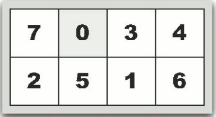

BFS 是图论中的一种遍历算法，更详细的内容详见 [BFS](../graph/bfs.md)。

BFS 在搜索中也很常用，将每个状态对应为图中的一个点即可。

BFS和DFS的实现：“BFS=队列”，“DFS=递归”。

为什么“BFS=队列”呢？以老鼠走迷宫为例，从起点s开始，一层一层地扩散出去。处理完离s近的第i层之后，再处理第i+1层。这一操作用队列最方便，处理第i层的节点a时，把a的第i+1层的邻居，放到队列尾部即可。

队列内的节点有2个特征：
1. 处理完第i层后，才会处理第i+1层；
2. 队列中最多有2层节点，其中第i层节点都在第i+1层前面。


下面给出BFS遍历图二叉树的代码。分别给出了静态版和指针版二叉树的代码，竞赛中一般用静态版二叉树，不易出错。两个代码都使用STL的queue队列。

???+note "BFS参考代码"
    === "静态版二叉树"

        ```cpp
        #include <bits/stdc++.h>
        using namespace std;
        const int maxn = 100005;
        struct Node{                  //静态二叉树
            char value;
            int lchild, rchild;    
        }node[maxn];
        int index = 0;                 //记录节点
        int newNode(char val){
            node[index].value = val;
            node[index].lchild = -1;   //-1表示空
            node[index].rchild = -1;
            return index ++;
        }
        void insert(int &father, int child, int l_r){     //插入孩子
            if(l_r == 0)              //左孩子
                node[father].lchild = child;
            else                      //右孩子
                node[father].rchild = child;	
        }
        int buildtree(){              //建一棵二叉树
            int A = newNode('A');int B = newNode('B');int C = newNode('C');
            int D = newNode('D');int E = newNode('E');int F = newNode('F');
            int G = newNode('G');int H = newNode('H');int I = newNode('I');
            insert(E,B,0);  insert(E,G,1);       //E的左孩子是B，右孩子是G
            insert(B,A,0);  insert(B,D,1);
            insert(G,F,0);  insert(G,I,1);
            insert(D,C,0);  insert(I,H,0);
            int root = E;
            return root;
        }
        int main(){   
            int root = buildtree();
            queue <int> q;        
            q.push(root);                          //从根节点开始
            while(q.size()){
                int tmp = q.front();  
                cout << node[tmp].value << " ";    //打印队头
                q.pop();                           //去掉队头
                if(node[tmp].lchild != -1) q.push(node[tmp].lchild);   //左孩子入队
                if(node[tmp].rchild != -1) q.push(node[tmp].rchild);   //右孩子入队     
            }
            return 0;
        }
        ```

    === "指针版二叉树"

        ```cpp
        #include "bits/stdc++.h"
        using namespace std;
        struct node{                         //指针二叉树
        char value;
        node l, r;
        node(char value = '#', node l = NULL, node r = NULL):value(value), l(l), r(r){}
        };
        void remove_tree(node root){         //释放空间
        if(root == NULL) return;
        remove_tree(root->l);
        remove_tree(root->r);
        delete root;
        }
        int main(){
        node  A,B,C,D,E,F,G,H,I;             //以下建一棵二叉树
        A = new node('A'); B = new node('B'); C = new node('C');
        D = new node('D'); E = new node('E'); F = new node('F');
        G = new node('G'); H = new node('H'); I = new node('I');
        E->l = B; E->r = G;      B->l = A; B->r = D;
        G->l = F; G->r = I;      D->l = C; I->l = H;   //以上建了一棵二叉树
        queue <node> q;               
        q.push(*E);
        while(q.size()){
            node *tmp;
            tmp = &(q.front());  
            cout << tmp->value << " ";            //打印队头
            q.pop();                              //去掉队头
            if(tmp->l) q.push(*(tmp->l));         //左孩子入队
            if(tmp->r) q.push(*(tmp->r));         //右孩子入队
        }
        remove_tree(E); 
        return 0;
        }
        ```

## 习题
- [力扣的BFS题](https://leetcode-cn.com/tag/breadth-first-search/)

??? note "[Seven Puzzle](https://vjudge.net/problem/Aizu-0121#author=floatery)"
    7数码问题。在2×4的棋盘上，摆有7个棋子，每个棋子上标有1至7的某一数字，不同棋子上标的数字不相同。棋盘上还有一个空格（用0表示），与空格相邻（上下左右）的棋子可以移到空格中，该棋子原先位置成为空格。给出一个初始状态（保证可以转移到最终状态），找出一种从初始状态转变成给定最终状态的移动棋子步数最少的移动步骤。

    **输入**：多组输入，每组8个数，表示初始状态前四个数为第一行从左到右，后四个数为第二行从左到右。 

    

    ??? tip
        采取逆向思维，用广度优先搜索解决。先不考虑如何用最小步数从输入状态到达最终状态，所有结果的最终状态都是（01234567），那么反过来想，只要求出最终状态到达所有结果时的最小步数并记录下来，接下来就是查表了。
    
    ??? note "参考代码"

        ```cpp
        #include<iostream>
        #include<cstdio>
        #include<cstring>
        #include<string>
        #include<queue>
        #include<map>
        #include<algorithm>
        using namespace std;
        typedef pair<string,int>P;

        string str="01234567"; 
        int dir[4]={1,-1,4,-4};
        map<string,int>m;  //状态所对应步数 
        queue<P>que;

        bool jud(int f,int i){
            if(f+dir[i]<0||f+dir[i]>7)return false;
            if(f==3&&i==0)return false;
            if(f==4&&i==1)return false;
            return true;
        }

        void bfs(){
            que.push(P(str,0));
            m[str]=0;
            while(!que.empty()){
                P p=que.front();
                que.pop();
                for(int i=0;i<4;i++){
                    int f=p.second;
                    string s=p.first;
                    if(jud(f,i)){
                        int step=m[s];
                        swap(s[f],s[f+dir[i]]);
                        if(!m.count(s)){
                            m[s]=step+1;
                            que.push(P(s,f+dir[i]));
                        }
                    }
                }
            }

        } 


        int main()
        {
            bfs();
            string line;
            while (getline(cin, line))
            {
                line.erase(remove(line.begin(), line.end(), ' '), line.end());
                cout << m[line] << endl;
            }

            return 0;
        }
        ```

??? note "[Meteor Shower](http://poj.org/problem?id=3669)"
    流星陨落，砸到地面，Bessie听说了这个消息，想不被砸死，于是就想逃，他从报告里得知了陨石降落的时间和具体位置，并且陨石的威力可以波及坠落位置的四个相邻位置，现在Bessie从零点出发，每个单位时间移动一个单位距离，现在有M颗陨石，坐标为（xi，yi），时间为ti，问Bessie最少需要多少单位时间可以到达一个安全的位置。

    ??? tip
        使用广度优先搜索解题，首先要明确每次调用队列转移的状态是什么，在这里，显然是Bessie移动到每个位置所需要的的时间，我们使用结构体（struct）来封装这个状态。

        ```cpp
        struct meteor
        {
            int x,y,t;
        };
        ```

        x，y，t表示Bessie所在的坐标和到达该位置的时间，来表示Bessie所处的状态。

        然后，我们需要记录，陨石毁灭每个点坐标的最小时间，在陨石不会降落的地点，我们使用一个足够大的数（INF）来进行初始化，表示这个位置不会被毁灭，所以我们要这样进行初始化：

        然后我们就要需要编写bfs函数，首先判断原点是否有陨石降落和降落的时间（否则就不用走或者刚开始就被砸死了）。

        在这之后，我们将Bessie的初始状态{0,0,0}入队，然后就开始搜索的过程，首先向四个方向判断是否有陨石降落和降落和降落的时间（如果无陨石降落，则表现为INF，此时此地就为最小时间），如过此时的t+1<陨石降落的时间，则不能往这个方向走，因为这样行动会被砸死。当新状态同时满足有陨石坠落并且t+1>陨石降落的时间，则将该点状态入队，继续进行下一轮搜索。

    ??? note "参考代码"

        ```cpp
        #include<iostream>
        #include<cstring>
        #include<queue>
        #include<algorithm>
        #include<cstdio>
        #define maxn 310
        #define maxm 50010
        using namespace std;
        const int inf=100000;
        struct meteor
        {
            int x,y,t;
        };
        int dx[]={1,0,-1,0,0};
        int dy[]={0,1,0,-1,0};
        int maze[maxn][maxn];

        int bfs()
        {
            queue<meteor>q;
            if(maze[0][0]>0)
            {
                q.push(meteor{0,0,0});
            }
                while(!q.empty())
                {
                    meteor tem=q.front();
                    q.pop();
                    int x=tem.x,y=tem.y,t=tem.t;
                    if(maze[x][y]==inf)return t;
                    for(int i=0;i<4;i++)
                    {
                        int nx=x+dx[i],ny=y+dy[i];
                        if(nx>=0&&ny>=0&&t+1<maze[nx][ny])
                        {
                            if(maze[nx][ny]!=inf)maze[nx][ny]=t+1;
                            //else return t+1;
                            q.push(meteor{nx,ny,t+1});
                            
                        }
                    }
                }
            
            return -1;
        }
        int main()
        {
            ios::sync_with_stdio(false);
            for(int i=0;i<maxn;i++)
            {
                for(int j=0;j<maxn;j++)
                {
                    maze[i][j]=inf;
                }
            }
            int M,x,y,t;
            cin>>M;
            for(int i=0;i<M;i++)
            {
                cin>>x>>y>>t;
                int nx,ny;
                for(int i=0;i<5;i++)
                {
                    nx=x+dx[i];
                    ny=y+dy[i];
                    if(nx>=0&&nx<=300&&ny>=0&&ny<=300)
                    maze[nx][ny]=min(maze[nx][ny],t);
                }
            }
            cout<<bfs()<<endl;
        }
        ```

??? note "[Cheese](https://vjudge.net/problem/Aizu-0558#author=MyyyyoYang)"
    在H * W的地图上有N个奶酪工厂，每个工厂分别生产硬度为1-N的奶酪。有一只老鼠准备从出发点吃遍每一个工厂的奶酪。老鼠有一个体力值，初始时为1，每吃一个工厂的奶酪体力值增加1（每个工厂只能吃一次），且老鼠只能吃硬度不大于当前体力值的奶酪。 老鼠从当前格到上下左右相邻的无障碍物的格需要时间1单位，有障碍物的格不能走。走到工厂上时即可吃到该工厂的奶酪，吃奶酪时间不计。问吃遍所有奶酪最少用时

    ??? tip
        求S--->1---->2---->....---->n-1----->n的最短距离，显然是一道迷宫BFS问题。
    
    ??? note "参考代码"

        ```cpp
        #include<queue>
        #include<iostream>
        using namespace std;
        #include<algorithm> 
        const int INF=1e9;
        const int MAX=1000+10;
        int dx[]={1,0,-1,0},dy[]={0,1,0,-1};
        //也可以考虑用二维方向数组解决 
        typedef pair<int,int> P; 
        char maze[MAX][MAX];
        int N,M;
        int sx,sy;//起点
        int gx,gy;//终点
        int d[MAX][MAX];//到各个位置最短距离的数组
        void init(){//请读者思考，为什么在bfs()之前要初始化 
            for(int i=0;i<N;i++)
                for(int j=0;j<M;j++)
                    d[i][j]=INF;
        }
        int bfs(){
            queue<P>que;
            que.push(P(sx,sy));
            d[sx][sy]=0;
            while(que.size()){
                P p=que.front();
                que.pop();
                if(p.first==gx&&p.second==gy)
                    break;//终点结束
                //四个方向循环
                for(int i=0;i<4;i++){
                    int nx=p.first+dx[i],ny=p.second+dy[i];
                    //判断check
                    if(nx>=0&&ny>=0&&nx<N&&ny<M&&maze[nx][ny]!='X'&&d[nx][ny]==INF){
                        que.push(P(nx,ny));
                        d[nx][ny]=d[p.first][p.second]+1;
                    } 
                } 	
            }
            return d[gx][gy];
        } 
        int main(){
            int nn;//从1-2-3----nn依次计算； 
            cin>>N>>M>>nn; 
            for(int i=0;i<N;i++)
                    scanf("%s",maze[i]);
            //找起点
            for(int i=0;i<N;i++)
                for(int j=0;j<M;j++)
                    if(maze[i][j]=='S'){
                        sx=i,sy=j;//起点之后会发生改变，尤其注意 
                    }
                    else if(maze[i][j]>='1'&&maze[i][j]<='9')
                        maze[i][j]=maze[i][j]-'0';
            int ans=0,cnt=1,flag=0;
            //循环是一个向下的过程，而此题是一个空间内的任意任意变化 
            for(int i=0;i<N;i++){ 
                for(int j=0;j<M;j++){ 
                    if(maze[i][j]==cnt){
                        init();
                        gx=i,gy=j;
                        ans+=bfs();
                        sx=gx,sy=gy;
                        //cout<<"------>>>>>>"<<ans<<endl;
                        cnt++;
                        i=0,j=0; 
                        if(cnt==nn+1){
                            flag=1;
                            break;
                        }
                    } 
                }
                if(flag)
                    break;
            }
            cout<<ans<<endl;		
        }
        ```
