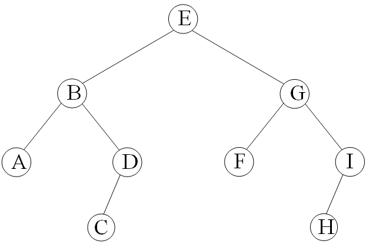

BFS 是图论中的一种遍历算法，更详细的内容详见 [BFS](../graph/bfs.md)。

BFS 在搜索中也很常用，将每个状态对应为图中的一个点即可。

BFS和DFS的实现：“BFS=队列”，“DFS=递归”。

为什么“BFS=队列”呢？以老鼠走迷宫为例，从起点s开始，一层一层地扩散出去。处理完离s近的第i层之后，再处理第i+1层。这一操作用队列最方便，处理第i层的节点a时，把a的第i+1层的邻居，放到队列尾部即可。

队列内的节点有2个特征：
1. 处理完第i层后，才会处理第i+1层；
2. 队列中最多有2层节点，其中第i层节点都在第i+1层前面。



下面给出BFS遍历图二叉树的代码。分别给出了静态版和指针版二叉树的代码，竞赛中一般用静态版二叉树，不易出错。两个代码都使用STL的queue队列。

???+note "BFS参考代码"
    === "静态版二叉树"

        ```cpp
        #include <bits/stdc++.h>
        using namespace std;
        const int maxn = 100005;
        struct Node{                  //静态二叉树
            char value;
            int lchild, rchild;    
        }node[maxn];
        int index = 0;                 //记录节点
        int newNode(char val){
            node[index].value = val;
            node[index].lchild = -1;   //-1表示空
            node[index].rchild = -1;
            return index ++;
        }
        void insert(int &father, int child, int l_r){     //插入孩子
            if(l_r == 0)              //左孩子
                node[father].lchild = child;
            else                      //右孩子
                node[father].rchild = child;	
        }
        int buildtree(){              //建一棵二叉树
            int A = newNode('A');int B = newNode('B');int C = newNode('C');
            int D = newNode('D');int E = newNode('E');int F = newNode('F');
            int G = newNode('G');int H = newNode('H');int I = newNode('I');
            insert(E,B,0);  insert(E,G,1);       //E的左孩子是B，右孩子是G
            insert(B,A,0);  insert(B,D,1);
            insert(G,F,0);  insert(G,I,1);
            insert(D,C,0);  insert(I,H,0);
            int root = E;
            return root;
        }
        int main(){   
            int root = buildtree();
            queue <int> q;        
            q.push(root);                          //从根节点开始
            while(q.size()){
                int tmp = q.front();  
                cout << node[tmp].value << " ";    //打印队头
                q.pop();                           //去掉队头
                if(node[tmp].lchild != -1) q.push(node[tmp].lchild);   //左孩子入队
                if(node[tmp].rchild != -1) q.push(node[tmp].rchild);   //右孩子入队     
            }
            return 0;
        }
        ```

    === "指针版二叉树"

        ```cpp
        #include "bits/stdc++.h"
        using namespace std;
        struct node{                         //指针二叉树
        char value;
        node l, r;
        node(char value = '#', node l = NULL, node r = NULL):value(value), l(l), r(r){}
        };
        void remove_tree(node root){         //释放空间
        if(root == NULL) return;
        remove_tree(root->l);
        remove_tree(root->r);
        delete root;
        }
        int main(){
        node  A,B,C,D,E,F,G,H,I;             //以下建一棵二叉树
        A = new node('A'); B = new node('B'); C = new node('C');
        D = new node('D'); E = new node('E'); F = new node('F');
        G = new node('G'); H = new node('H'); I = new node('I');
        E->l = B; E->r = G;      B->l = A; B->r = D;
        G->l = F; G->r = I;      D->l = C; I->l = H;   //以上建了一棵二叉树
        queue <node> q;               
        q.push(*E);
        while(q.size()){
            node *tmp;
            tmp = &(q.front());  
            cout << tmp->value << " ";            //打印队头
            q.pop();                              //去掉队头
            if(tmp->l) q.push(*(tmp->l));         //左孩子入队
            if(tmp->r) q.push(*(tmp->r));         //右孩子入队
        }
        remove_tree(E); 
        return 0;
        }
        ```

## 习题
- [力扣的BFS题](https://leetcode-cn.com/tag/breadth-first-search/)
- [Seven Puzzle](https://vjudge.net/problem/Aizu-0121#author=floatery)
- [Meteor Shower](http://poj.org/problem?id=3669)
- [Cheese](https://vjudge.net/problem/Aizu-0558#author=MyyyyoYang)