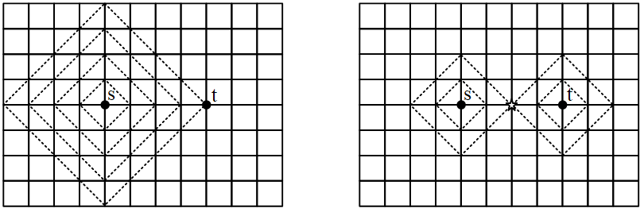
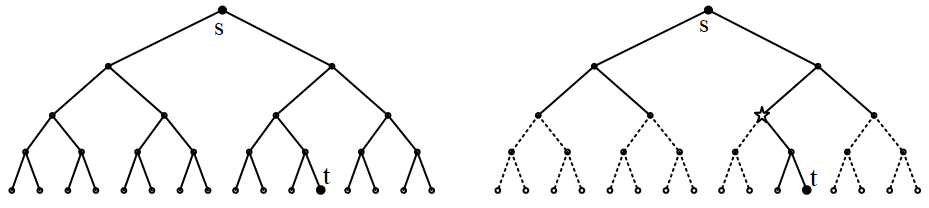
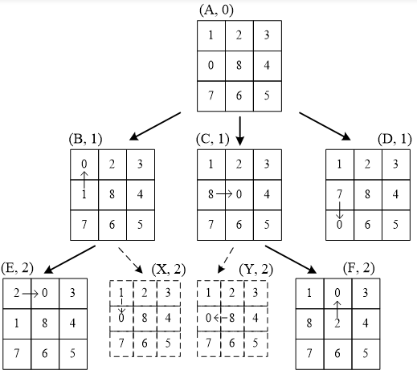
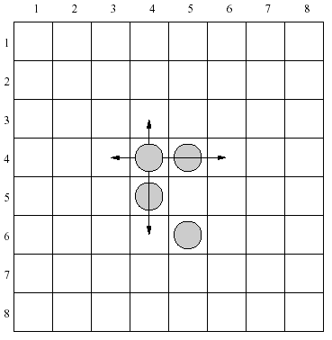
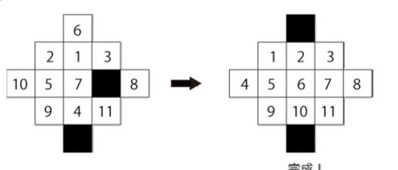
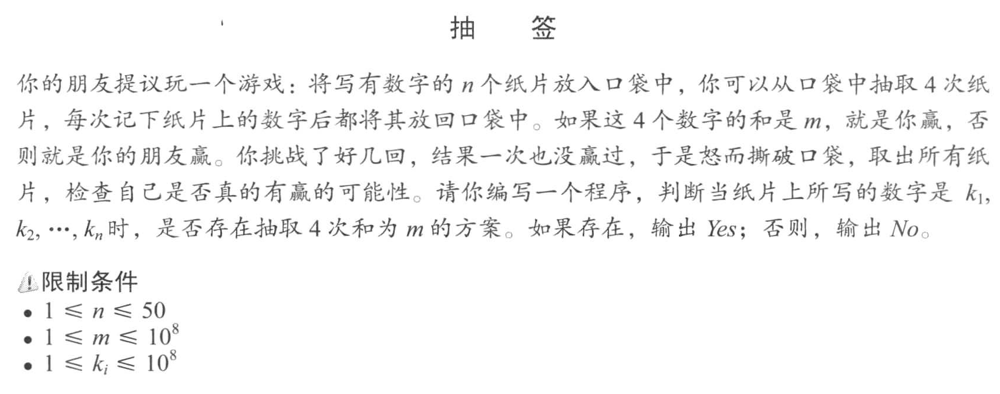
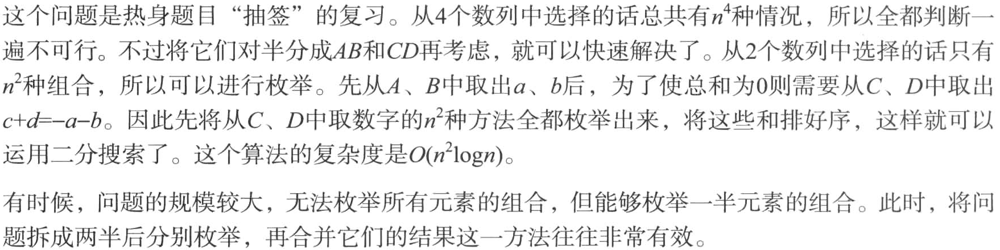
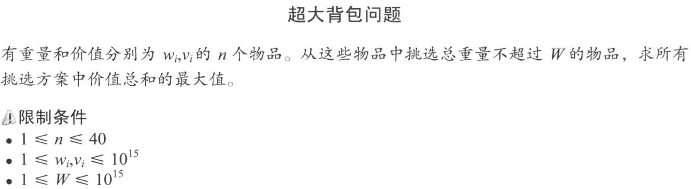
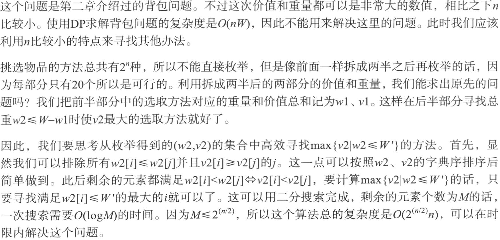

author: FFjet, ChungZH, frank-xjh, hsfzLZH1, Xarfa, AndrewWayne

本页面将简要介绍两种双向搜索算法：「双向同时搜索」和「Meet in the middle」。

## 双向同时搜索

### 定义

双向同时搜索的基本思路是从状态图上的起点和终点同时开始进行 [广搜](./bfs.md) 或 [深搜](./dfs.md)。

如果发现搜索的两端相遇了，那么可以认为是获得了可行解。

双向广搜的应用场合：有确定的起点和终点，并且能把从起点到终点的单个搜索，变换为分别从起点出发和从终点出发的“相遇”问题，可以用双向广搜。

从起点s（正向搜索）和终点t（逆向搜索）同时开始搜索，当两个搜索产生相同的一个子状态v时就结束。得到的s-v-t是一条最佳路径，当然，最佳路径可能不止这一条。

注意，和普通BFS一样，双向广搜在搜索时并没有“方向感”，所谓“正向搜索”和“逆向搜索”其实是盲目的，它们从s和t逐层扩散出去，直到相遇为止。

与只做一次BFS相比，双向BFS能在多大程度上改善算法复杂度？下面以网格图和树形结构为例，推出一般性结论。

（1）网格图。

用BFS求下面图中两个黑点s和t间的最短路。左图是一个BFS；右图是双向BFS，在中间的五角星位置相遇。



（1）单个BFS         （2）双向BFS

图1 网格图搜索

设两点的距离是k。左边的BFS，从起点s扩展到t，一共访问了2k(k+1)≈2k2个结点；右边的双向BFS，相遇时一共访问了约k2个结点。两者差2倍，改善并不明显。

在这个网格图中，BFS扩展的第k和第k+1层，结点数量相差(k+1)/k倍，即结点数量是线性增长的。

（2）树形结构。



（1）单个BFS         （2）双向BFS

图2 二叉树搜索

以二叉树为例，求根结点s到最后一行的黑点t的最短路。

左图做一次BFS，从第1层到第k-1层，共访问1+2+...+2k−1≈2k个结点。右图是双向BFS，分别从上往下和从下往上BFS，在五角星位置相遇，共访问约2×2k/2个结点。双向广搜比做一次BFS改善了2k/2倍，优势巨大。

在二叉树的例子中，BFS扩展的第k和第k+1层，结点数量相差2倍，即结点数量是指数增长的。
从上面2个例子可以得到一般性结论：

1. 做BFS扩展的时候，下一层结点（一个结点表示一个状态）数量增加越快，双向广搜越有效率。
2. 是否用双向广搜替代普通BFS，除了（1）以外，还应根据总状态数量的规模来决定。双向BFS的优势，从根本上说，是它能减少需要搜索的状态数量。有时虽然下一层数量是指数增长的，但是由于去重或者限制条件，总状态数并不多，也就没有必要使用双向BFS。例如后面的例题“hdu 1195 open the lock”，密码范围1111～9999，共约9000种，用BFS搜索时，最多有9000个状态进入队列，就没有必要使用双向BFS。而例题HDU 1401 Solitaire，可能的棋局状态有1500万种，走8步棋会扩展出168种状态，大于1500万，相当于扩展到所有可能的棋局，此时应该使用双向BFS。

很多教材和网文讲解双向广搜时，常用八数码问题做例子。下图演示了从状态A移动到状态F的搜索过程。

八数码共有9! = 362880种状态，不太多，用普通BFS也行。不过，用双向广搜更好，因为八数码每次扩展，下一层的状态数量是上一层的2～4倍，比二叉树的增长还快，效率的提升也就更高。



图3 八数码问题的搜索树

### 过程

双向广搜的队列，有两种实现方法：

1. 合用一个队列。正向BFS和逆向BFS用同一个队列，适合正反2个BFS平衡的情况。正向搜索和逆向搜索交替进行，两个方向的搜索交替扩展子状态，先后入队。直到两个方向的搜索产生相同的子状态，即相遇了，结束。这种方法适合正反方向扩展的新结点数量差不多的情况，例如上面的八数码问题。
2. 分成两个队列。正向BFS和逆向BFS的队列分开，适合正反2个BFS不平衡的情况。让子状态少的BFS先扩展下一层，另一个子状态多的BFS后扩展，可以减少搜索的总状态数，尽快相遇。例题见后面的“洛谷p1032 字串变换”。

和普通BFS一样，双向广搜在扩展队列时也需要处理去重问题。把状态入队列的时候，先判断这个状态是否曾经入队，如果重复了，就丢弃。

双向广搜的步骤：

```text
将开始结点和目标结点加入队列 q
标记开始结点为 1
标记目标结点为 2
while (队列 q 不为空)
{
  从 q.front() 扩展出新的 s 个结点
  
  如果 新扩展出的结点已经被其他数字标记过
    那么 表示搜索的两端碰撞
    那么 循环结束
  
  如果 新的 s 个结点是从开始结点扩展来的
    那么 将这个 s 个结点标记为 1 并且入队 q 
    
  如果 新的 s 个结点是从目标结点扩展来的
    那么 将这个 s 个结点标记为 2 并且入队 q
}
```

### 例题

???+note "[open the lock](http://acm.hdu.edu.cn/showproblem.php?pid=1195)"
    **题目描述：** 打开密码锁。密码由四位数字组成，数字从1到9。可以在任何数字上加上1或减去1，当'9'加1时，数字变为'1'，而'1'减1时，数字变为'9'。相邻的数字可以交换。每个动作是一步。任务是使用最少的步骤来打开锁。注意：最左边的数字不是最右边的数字的邻居。
    
    **输入：** 输入文件以整数T开头，表示测试用例的数量。
    
    每个测试用例均以四位数N开头，指示密码锁定的初始状态。然后紧跟另一行带有四个下标M的行，指示可以打开锁的密码。每个测试用例后都有一个空白行。
    
    **输出：** 对于每个测试用例，一行中打印最少的步骤。
    
    样例输入：
    
    2
    
    1234
    
    2144
    
    1111
    
    9999
    
    样例输出：
    
    2
    
    4

???+note "解题思路"
    题目中的4位数字，走一步能扩展出11种情况；如果需要走10步，就可能有11^10种情况，数量非常多，看起来用双向广搜能大大提高搜索效率。不过，这一题用普通BFS也行，因为并没有11^10种情况，密码范围1111～9999，只有约9000种。用BFS搜索时，最多有9000个状态进入队列，没有必要使用双向广搜。
    
    密码进入队列时，应去重，去掉重复的密码。去重用hash最方便。

* * *

???+note "[Solitaire](http://acm.hdu.edu.cn/showproblem.php?pid=1401)"
    8×8的方格，放4颗棋子在初始位置，给定4个最终位置，问在8步内是否能从初始位置走到最终位置。规则：每个棋子能上下左右移动，若4个方向已经有一棋子则可以跳到下一个空白位置。例如，图中(4,4)位置的棋子有4种移动方法。

    

???+note "解题思路"

    在8×8的方格上放4颗棋子，有64×63×62×61≈1500万种布局。走一步棋，4颗棋子共有16种走法，连续走8步棋，会扩展出168种棋局，168大于1500万，走8步可能会遍历到1500万棋局。
    
    此题应该使用双向BFS。从起点棋局走4步，从终点棋局走4步，如果能相遇就有一个解，共扩展出2*164=131072种棋局，远远小于1500万。
    
    本题也需要处理去重问题，扩展下一个新棋局时，看它是否在队列中处理过。用hash的方法，定义char vis[8][8][8][8][8][8][8][8]表示棋局，其中包含4个棋子的坐标。当vis=1时表示正向搜过这个棋局，vis=2表示逆向搜过。例如4个棋子的坐标是(a.x, a.y)、(b.x, b.y)、(c.x, c.y)、(d.x, d.y)，那么：
    
    vis[a.x][a.y][b.x][b.y][c.x][c.y][d.x][d.y] = 1
    
    表示这个棋局被正向搜过。
    
    4个棋子需要先排序，然后再用vis记录。如果不排序，一个棋局就会有很多种表示，不方便判重。
    
    char vis[8][8][8][8][8][8][8][8] 用了8^8 = 16M空间。如果定义为int,占用64M空间，超过题目的限制。

* * *

???+note "[Eleven puzzle](http://acm.hdu.edu.cn/showproblem.php?pid=3095)"
    如图是13个格子的拼图，数字格可以移动到黑色格子。左图是开始局面，右图是终点局面。一次移动一个数字格，问最少移动几次可以完成。

    

???+note "解题思路"
    1. 可能的局面有13!，极大。
    2. 用一个BFS，复杂度过高。每次移动1个黑格，移动方法最少1种，最多8种。如果移动10次，那么最多有810 ≈ 10亿种。
    3. 用双向广搜，能减少到2×8^5 = 65536种局面。
    4. 判重：可以用hash，或者用STL的map。

* * *

???+note "[字串变换](https://www.luogu.com.cn/problem/P1032)"
    **题目描述：** 已知有两个字串A,B及一组字串变换的规则（至多6个规则）:
    
    A1->B1
    
    A2->B2
    
    规则的含义为：在A中的子串 A1可以变换为B1，A2可以变换为 B2…。
    
    例如：A=abcd，B=xyz，
    
    变换规则为：
    
    abc→xu，ud→y，y→yz
    
    则此时，A可以经过一系列的变换变为B，其变换的过程为：
    
    abcd→xud→xy→xyz。
    
    共进行了3次变换，使得A变换为B。
    
    **输入输出：** 给定字串A、B和变换规则，问能否在10步内将A变换为B，输出最少的变换步数。字符串长度的上限为20。


???+note "解题思路"
    1. 若用一个BFS，每层扩展6个规则，经过10步，共610 ≈ 6千万次变换。
    2. 用双向BFS，可以用2*65 = 15552次变换搜完10步。
    3. 用两个队列分别处理正向BFS和逆向BFS。由于起点和终点的串不同，它们扩展的下一层数量也不同，也就是进入2个队列的串的数量不同，先处理较小的队列，可以加快搜索速度。2个队列见下面的代码示例[完整代码](https://blog.csdn.net/qq_45772483/article/details/104504951)。

    ```cpp
    void bfs(string A, string B){        //起点是A，终点是B
        queue <string> qa, qb;           //定义2个队列
        qa.push(A);                      //正向队列
        qb.push(B);                      //逆向队列 
        while(qa.size() && qb.size()){   
            if (qa.size() < qb.size())   //如果正向BFS队列小，先扩展它
                extend(qa, ...);         //扩展时，判断是否相遇
            else                         //否则扩展逆向BFS
                extend(qb, ...);         //扩展时，判断是否相遇
        }
    }
    ```

## Meet in the middle

???+warning
    本节要介绍的不是 [**二分搜索**](../basic/binary.md)（二分搜索的另外一个译名为「折半搜索」）。

### 引入

Meet in the middle 算法没有正式译名，常见的翻译为「折半搜索」、「双向搜索」或「中途相遇」。

它适用于输入数据较小，但还没小到能直接使用暴力搜索的情况。

### 过程

Meet in the middle 算法的主要思想是将整个搜索过程分成两半，分别搜索，最后将两半的结果合并。

### 性质

暴力搜索的复杂度往往是指数级的，而改用 meet in the middle 算法后复杂度的指数可以减半，即让复杂度从 $O(a^b)$ 降到 $O(a^{b/2})$。

### 例题

???+note "[4 Sum](http://poj.org/problem?id=2785)"
    

???+note "解题思路"
    

???+note "超大背包问题"
    

???+note "解题思路"
    

???+note "例题 [「USACO09NOV」灯 Lights](https://www.luogu.com.cn/problem/P2962)"
    有 $n$ 盏灯，每盏灯与若干盏灯相连，每盏灯上都有一个开关，如果按下一盏灯上的开关，这盏灯以及与之相连的所有灯的开关状态都会改变。一开始所有灯都是关着的，你需要将所有灯打开，求最小的按开关次数。
    
    $1\le n\le 35$。

??? note "解题思路"
    如果这道题暴力 DFS 找开关灯的状态，时间复杂度就是 $O(2^{n})$, 显然超时。不过，如果我们用 meet in middle 的话，时间复杂度可以优化至 $O(n2^{n/2})$。meet in middle 就是让我们先找一半的状态，也就是找出只使用编号为 $1$ 到 $\mathrm{mid}$ 的开关能够到达的状态，再找出只使用另一半开关能到达的状态。如果前半段和后半段开启的灯互补，将这两段合并起来就得到了一种将所有灯打开的方案。具体实现时，可以把前半段的状态以及达到每种状态的最少按开关次数存储在 map 里面，搜索后半段时，每搜出一种方案，就把它与互补的第一段方案合并来更新答案。

??? note "参考代码"
    ```cpp
    --8<-- "docs/search/code/bidirectional/bidirectional_1.cpp"
    ```

## 习题
- [Subset](http://poj.org/problem?id=3977)
- [Sumsets](http://poj.org/problem?id=2549)
- [Cubic Eight-Puzzle](http://poj.org/problem?id=3131)
- [万圣节](https://vjudge.net/problem/UVA-1601)

## 外部链接

- [What is meet in the middle algorithm w.r.t. competitive programming? - Quora](https://www.quora.com/What-is-meet-in-the-middle-algorithm-w-r-t-competitive-programming)
- [Meet in the Middle Algorithm - YouTube](https://www.youtube.com/watch?v=57SUNQL4JFA)
