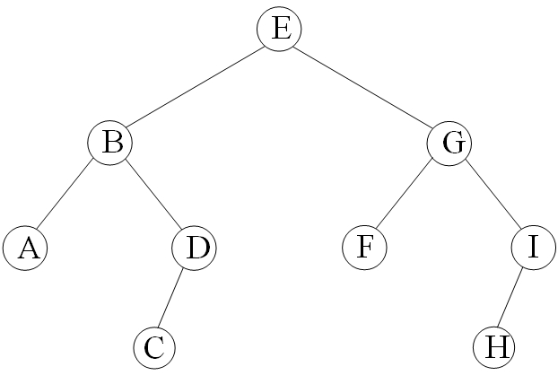
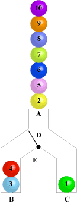
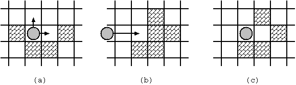

## 引入

DFS 为图论中的概念，详见 [DFS（图论）](../graph/dfs.md) 页面。在 **搜索算法** 中，该词常常指利用递归函数方便地实现暴力枚举的算法，与图论中的 DFS 算法有一定相似之处，但并不完全相同。

## DFS代码框架
DFS的代码看起来比较简单，但是逻辑上难以理解，不容易编码。

读者在大量编码的基础上，再回头体会这个框架的作用。

```cpp
ans;                  //答案，用全局变量表示
void dfs(层数，其他参数){
    if (出局判断){    //到达最底层，或者满足条件退出 
        更新答案;     //答案一般用全局变量表示
        return;       //返回到上一层
    }
    (剪枝)            //在进一步DFS之前剪枝
    for (枚举下一层可能的情况)    //对每一个情况继续DFS 
        if (used[i] == 0) {       //如果状态i没有用过，就可以进入下一层
            used[i] = 1;   //标记状态i,表示已经用过，在更底层不能再使用
            dfs(层数+1，其他参数);    //下一层 
            used[i] = 0;   //恢复状态，回溯时，不影响上一层对这个状态的使用
            }
    return;          //返回到上一层
}
```



下面给出DFS遍历图二叉树的代码。分别给出了静态版和指针版二叉树的代码。

它们输出了图1二叉树的各种DFS操作，有时间戳、DFS序、树深度、子树节点数，另外还给出了二叉树的中序输出、先序输出、后序输出。

DFS访问节点，经常用到以下操作：

- 节点第一次被访问的时间戳。用dfn[i]表示节点i第一次被访问的时间戳，函数dfn_order()打印出了时间戳：

dfn[E]=1; dfn[B]=2; dfn[A]=3; dfn[D]=4; dfn[C]=5; dfn[G]=6; dfn[F]=7; dfn[I]=8; dfn[H]=9。

时间戳就是先序输出。

- DFS序。在递归时，每个节点会来回访问2次，即第1次访问和第2次回溯。函数visit_order()打印出了DFS序：

{E B A A D C C D B G F F I H H I G E}

这个序列有一个重要特征：每个节点出现2次，被这2次包围起来的，是以它为父节点的一棵子树。例如序列中的{B A A D C C D B}，就是B为父节点的一棵子树，又例如{I H H I}，是以I为父节点的一棵子树。这个特征是递归操作产生的。

- 树的深度。从根节点往子树DFS，每个节点第一次被访问时，深度加1，从这个节点回溯时，深度减1。用deep[i]表示节点i的深度，函数deep_node()打印出了深度：
deep[E]=1; deep[B]=2; deep[A]=3; deep[D]=3; deep[C]=4; deep[G]=2; deep[F]=3; deep[I]=3; deep[H]=4。

- 子树节点总数。用num[i]表示以i为父亲的子树上的节点总数，例如，以B为父节点的子树，共有4个节点{A B C D}。只需要简单地DFS一次就能完成，每个节点的数量等于它的2个子树的数量相加，再加1，即加它自己。函数num_node()做了计算并打印出了以每个节点为父亲的子树上的节点数量。
另外还有树的重心：在一棵中，找到一个节点，把树变为以该点为根的有根树，并且最大子树的结点数最小。本文没有给出代码。

竞赛中一般用静态版二叉树写代码。作为对照，后面也给出指针版二叉树的代码。

???+note "参考代码"
    === "静态版二叉树"

        ```cpp
        #include <bits/stdc++.h>
        using namespace std;
        const int maxn = 100005;
        struct Node{
            char value;
            int lchild, rchild;    
        }node[maxn];
        int index = 0;                 //记录节点
        int newNode(char val){         //新建节点
            node[index].value = val;
            node[index].lchild = -1;   //-1表示空
            node[index].rchild = -1;
            return index ++;
        }
        void insert(int &father, int child, int l_r){   //插入孩子
            if(l_r == 0)              //左孩子
                node[father].lchild = child;
            else                      //右孩子
                node[father].rchild = child;	
        }
        int dfn[maxn] = {0};              //dfn[i]是节点i的时间戳
        int dfn_timer = 0;
        void dfn_order (int father){      
            if(father != -1){
                dfn[father] = ++dfn_timer; 
                printf("dfn[%c]=%d; ", node[father].value, dfn[father]);    
                                            //打印访问节点的时间戳
                dfn_order (node[father].lchild);
                dfn_order (node[father].rchild);        
            }
        }
        int visit_timer = 0;     
        void visit_order (int father){        //打印DFS序
            if(father != -1){
                printf("visit[%c]=%d; ", node[father].value, ++visit_timer);  
                                            //打印DFS序：第1次访问节点 
                visit_order (node[father].lchild);
                visit_order (node[father].rchild);
                printf("visit[%c]=%d; ", node[father].value, ++visit_timer);  
                                            //打印DFS序：第2次回溯
            }
        }
        int deep[maxn] = {0};                 //deep[i]是节点i的深度
        int deep_timer = 0;         
        void deep_node (int father){      
            if(father != -1){
                deep[father] = ++deep_timer; 
                printf("deep[%c]=%d; ",node[father].value,deep[father]);    
                                            //打印树的深度，第一次访问时，深度+1 
                deep_node (node[father].lchild);
                deep_node (node[father].rchild);
                deep_timer--;                 //回溯时，深度-1
            }
        }
        int num[maxn] = {0};        //num[i]是以i为父亲的子树上的节点总数
        int num_node (int father){          
            if(father == -1)  return 0;
            else{
                num[father] = num_node (node[father].lchild) + 
                            num_node (node[father].rchild) + 1; 
                printf("num[%c]=%d; ", node[father].value, num[father]); //打印数量
                return num[father];
            }
        }
        void preorder (int father){                 //求先序序列
            if(father != -1){
                cout << node[father].value <<" ";   //先序输出
                preorder (node[father].lchild);
                preorder (node[father].rchild);
            }
        }
        void inorder (int father){                   //求中序序列
            if(father != -1){
                inorder (node[father].lchild);;
                cout << node[father].value <<" ";    //中序输出
                inorder (node[father].rchild);
            }
        }
        void postorder (int father){                 //求后序序列
            if(father != -1){
                postorder (node[father].lchild);;
                postorder (node[father].rchild);
                cout << node[father].value <<" ";    //后序输出
            }
        }
        int buildtree(){                             //建一棵树
            int A = newNode('A');int B = newNode('B');int C = newNode('C');
            int D = newNode('D');int E = newNode('E');int F = newNode('F');
            int G = newNode('G');int H = newNode('H');int I = newNode('I');
            insert(E,B,0);  insert(E,G,1);         //E的左孩子是B，右孩子是G
            insert(B,A,0);  insert(B,D,1);
            insert(G,F,0);  insert(G,I,1);
            insert(D,C,0);  insert(I,H,0);
            int root = E;
            return root;
        }
        int main(){
            int root = buildtree();
            cout <<"dfn order: ";     dfn_order(root); cout <<endl;     //打印时间戳
            cout <<"visit order: "; visit_order(root); cout <<endl;     //打印DFS序
            cout <<"deep order: ";    deep_node(root); cout <<endl;     //打印节点深度
            cout <<"num of tree: ";    num_node(root); cout <<endl;  //打印子树上的节点数
            cout <<"in order:   ";      inorder(root); cout << endl;    //打印中序序列
            cout <<"pre order:  ";     preorder(root); cout << endl;    //打印先序序列
            cout <<"post order: ";    postorder(root); cout << endl;    //打印后序序列
            return 0;
        }
        /*输出是：
        dfn order: dfn[E]=1; dfn[B]=2; dfn[A]=3; dfn[D]=4; dfn[C]=5; dfn[G]=6; dfn[F]=7; dfn[I]=8; dfn[H]=9;
        visit order: visit[E]=1; visit[B]=2; visit[A]=3; visit[A]=4; visit[D]=5; visit[C]=6; visit[C]=7; visit[D]=8; visit[B]=9; visit[G]=10; visit[F]=11; visit[F]=12; visit[I]=13; visit[H]=14; visit[H]=15; visit[I]=16; visit[G]=17; visit[E]=18;
        deep order: deep[E]=1; deep[B]=2; deep[A]=3; deep[D]=3; deep[C]=4; deep[G]=2; deep[F]=3; deep[I]=3; deep[H]=4;
        num of tree: num[A]=1; num[C]=1; num[D]=2; num[B]=4; num[F]=1; num[H]=1; num[I]=2; num[G]=4; num[E]=9;
        in order:   A B C D E F G H I
        pre order:  E B A D C G F I H
        post order: A C D B F H I G E
        */
        ```
    === "指针版二叉树"

        ```cpp
        #include "bits/stdc++.h"
        using namespace std;

        struct node{
            char value;
            node *l, *r;
            node(char value = '#', node *l = NULL, node r = NULL):value(value), l(l), r(r){}
        };

        void preorder (node root){          //求先序序列
            if(root != NULL){
                cout << root->value <<" ";   //先序输出
                preorder (root ->l);
                preorder (root ->r);
            }
        }
        void inorder (node root){           //求中序序列
            if(root != NULL){
                inorder (root ->l);
                cout << root->value <<" ";   //中序输出
                inorder (root ->r);
            }
        }
        void postorder (node root){          //求后序序列
            if(root != NULL){
                postorder (root ->l);
                postorder (root ->r);
                cout << root->value <<" ";    //后序输出
            }
        }
        void remove_tree(node root){         //释放空间
            if(root == NULL) return;
            remove_tree(root->l);
            remove_tree(root->r);
            delete root;
        }
        int main(){
            node  A, B,C,D,E,F,G,H,I;
            A = new node('A'); B = new node('B'); C = new node('C');
            D = new node('D'); E = new node('E'); F = new node('F');
            G = new node('G'); H = new node('H'); I = new node('I');
            E->l = B; E->r = G;      B->l = A; B->r = D;
            G->l = F; G->r = I;      D->l = C;       I->l = H;
            cout <<"in order:   ";    inorder(E); cout << endl;    //打印中序序列
            cout <<"pre order:  ";   preorder(E); cout << endl;    //打印先序序列
            cout <<"post order: ";  postorder(E); cout << endl;    //打印后序序列
            remove_tree(E); 
            return 0;
        }
        ```

## 例题

考虑这个例子：

???+ note "例题"
    把正整数 $n$ 分解为 $3$ 个不同的正整数，如 $6=1+2+3$，排在后面的数必须大于等于前面的数，输出所有方案。

对于这个问题，如果不知道搜索，应该怎么办呢？

当然是三重循环，参考代码如下：

???+ note "实现"
    === "C++"
    
        ```cpp
        for (int i = 1; i <= n; ++i)
          for (int j = i; j <= n; ++j)
            for (int k = j; k <= n; ++k)
              if (i + j + k == n) printf("%d = %d + %d + %d\n", n, i, j, k);
        ```
    
    === "Python"
    
        ```python
        for i in range(1, n + 1):
            for j in range(i, n + 1):
                for k in range(j, n + 1):
                    if i + j + k == n:
                        print("%d = %d + %d + %d" % (n, i, j, k))
        ```
    
    === "Java"
    
        ```Java
        for (int i = 1; i < n + 1; i++) {
            for (int j = i; j < n + 1; j++) {
                for (int k = j; k < n + 1; k++) {
                    if (i + j + k == n) System.out.printf("%d = %d + %d + %d%n", n, i, j, k);
                }
            }
        }
        ```

那如果是分解成四个整数呢？再加一重循环？

那分解成小于等于 $m$ 个整数呢？

这时候就需要用到递归搜索了。

该类搜索算法的特点在于，将要搜索的目标分成若干「层」，每层基于前几层的状态进行决策，直到达到目标状态。

考虑上述问题，即将正整数 $n$ 分解成小于等于 $m$ 个正整数之和，且排在后面的数必须大于等于前面的数，并输出所有方案。

设一组方案将正整数 $n$ 分解成 $k$ 个正整数 $a_1, a_2, \ldots, a_k$ 的和。

我们将问题分层，第 $i$ 层决定 $a_i$。则为了进行第 $i$ 层决策，我们需要记录三个状态变量：$n-\sum_{j=1}^i{a_j}$，表示后面所有正整数的和；以及 $a_{i-1}$，表示前一层的正整数，以确保正整数递增；以及 $i$，确保我们最多输出 $m$ 个正整数。

为了记录方案，我们用 arr 数组，第 i 项表示 $a_i$. 注意到 arr 实际上是一个长度为 $i$ 的栈。

代码如下：

???+ note "实现"
    === "C++"
    
        ```cpp
        int m, arr[103];  // arr 用于记录方案
    
        void dfs(int n, int i, int a) {
          if (n == 0) {
            for (int j = 1; j <= i - 1; ++j) printf("%d ", arr[j]);
            printf("\n");
          }
          if (i <= m) {
            for (int j = a; j <= n; ++j) {
              arr[i] = j;
              dfs(n - j, i + 1, j);  // 请仔细思考该行含义。
            }
          }
        }
    
        // 主函数
        scanf("%d%d", &n, &m);
        dfs(n, 1, 1);
        ```
    
    === "Python"
    
        ```python
        arr = [0] * 103  # arr 用于记录方案
    
        def dfs(n, i, a):
            if n == 0:
                print(arr[1:i])
            if i <= m:
                for j in range(a, n + 1):
                    arr[i] = j
                    dfs(n - j, i + 1, j)  # 请仔细思考该行含义。
    
        # 主函数
        n, m = map(int, input().split())
        dfs(n, 1, 1)
        ```
    
    === "Java"
    
        ```Java
        static int m;

        // arr 用于记录方案
        static int[] arr = new int[103];
        
        public static void dfs(int n, int i, int a) {
            if (n == 0) {
                for (int j = 1; j <= i - 1; j++) System.out.printf("%d ", arr[j]);
                System.out.println();
            }
            if (i <= m) {
                for (int j = a; j <= n; ++j) {
                    arr[i] = j;
                    dfs(n - j, i + 1, j); // 请仔细思考该行含义。
                }
            }
        }
        
        // 主函数
        final int N = new Scanner(System.in).nextInt();
        m = new Scanner(System.in).nextInt();
        dfs(N, 1, 1);
        ```

???+note "[Luogu P1706 全排列问题](https://www.luogu.com.cn/problem/P1706)"
    === "C++ 代码："
        ```cpp
        --8<-- "docs/search/code/dfs/dfs_1.cpp"
        ```

## 习题
- [力扣的DFS题](https://leetcode-cn.com/tag/depth-first-search/)

??? note "[Red and Black](http://poj.org/problem?id=1979)"
    有一个长方形的房间，上面铺着正方形的瓷砖。每块瓷砖的颜色不是红色就是黑色。
    
    一个男人站在一块黑色的瓷砖上。从一个瓦片，他可以移动到四个相邻瓦片中的一个。但是他不能在红瓦上移动，他只能在黑瓦上移动。

    编写一个程序，通过重复上面描述的动作来计算他可以到达的黑色方块的数量。

    ??? tip
        判断起点，向四周深度搜索，简单。

    ??? note "参考代码"

        ```cpp
        #include <iostream>
        #include <algorithm>
        #include <cmath>
        using namespace std;
        char a[35][35];
        int n,m;
        int res=0;
        int dx[4]={1,-1,0,0};
        int dy[4]={0,0,1,-1};
        void dfs(int x,int y)
        {
            res++;
            a[x][y]='#';
            for(int i=0;i<4;i++){
                int nx=x+dx[i],ny=y+dy[i];
                if(nx>=0&&nx<n&&ny>=0&&ny<m&&a[nx][ny]=='.'){
                    dfs(nx,ny);
                }
            }
            return ;
        }
        void solve()
        {
            for(int i=0;i<n;i++){
                for(int j=0;j<m;j++){
                    if(a[i][j]=='@'){
                        dfs(i,j);
                    }
                }
            }
        }
        int main()
        {
            while(cin>>m>>n&&n!=0&&m!=0){

                res=0;
                for(int i=0;i<n;i++){
                    for(int j=0;j<m;j++){
                        cin>>a[i][j];
                    }
                }
                solve();
                cout<<res<<endl;
            }
            return 0;
        }
        ```
??? note "[Ball](https://vjudge.net/problem/Aizu-0033#author=baobaobear)"
    

    如图所示，容器中间有一枢轴，下方分为两路。容器上方开口，从1到10连续编号的小球从容器开口A放入。通过调整枢轴E的方向，可以使小球经过D而落入左侧B筒或者右侧C筒。现给出从A放入小球的顺序，请你判断能否最终小球落入B和C时，号码大的球总是位于号码小的球的上侧。如果可能则在一行中输出”YES”，否则输出 “NO”

    ??? tip
        解法1： 深搜。用vis数组做标记，1的代表第一个数组，0的代表第二个数组。通过dfs生成第一个递增的数组，然后检查余下数字组成的第二个数组。

        ```cpp
        #include <cstdio>
        #include <cstring>
        #include <cstdlib>
        #include <algorithm>
        #include <iostream>
        #include <cmath>
        #include <vector>
        #include <map>
        #include <stack>
        using namespace std;
        const int maxn = 10001;
        int a[maxn];
        int vis[maxn];
        void dfs(int pre , int cur)
        {
            if(cur < 10 && a[pre] < a[cur])
            {
                vis[cur] = 1;
                dfs(cur , cur + 1);
            }
            else if(cur < 10 && a[pre] > a[cur]){
                dfs(pre , cur + 1);
            }
        }
        
        int main()
        {
            int n;
            cin >> n;
            while(n --){
                for(int i = 0 ; i < 10 ; i ++){
                    cin >> a[i];
                }
                bool flag = false;
                for(int i = 0 ; i < 10 ; i ++){
                    memset(vis , 0 , sizeof(vis));
                    vis[i] = 1;
                    dfs(i , i + 1);
                    int pre = 0;
                    for(int j = 0 ; j < 10 ; j ++){
                        if(vis[j] == 0){
                            if(pre > a[j]){
                                flag = true;
                                break;
                            }
                            else pre = a[j];
                        }
                    }
                    if(!flag){
                        cout << "YES" << endl;
                        break;
                    }
                }
                if(flag) cout << "NO" << endl;
        
            }
        }
        ```

        解法2：贪心，每次找到符合条件且是两边最上层的数最大的那个方向加进去

        ```java
        import java.util.Scanner;
        public class Main{
            public static void main(String[] args) {
                Scanner sc = new Scanner(System.in);
                int n = sc.nextInt();
                int arr[] = new int[10];
                while(n--!=0) {
                    for (int i = 0; i < arr.length; i++) {
                        arr[i] = sc.nextInt();
                    }
                    int a=0,b=0;
                    int res = 1;
                    for (int i = 0; i < arr.length; i++) {
                        int ans = 0;
                        if(a<arr[i] && ((a>=b)||b>=arr[i])) {
                            a = arr[i];
                            ans=1;
                            continue;
                        }
                        if(b<arr[i] && ((b>=a)||a>=arr[i])) {
                            b = arr[i];
                            ans=1;
                            continue;
                        }
                        if(ans==0) {
                            res=0;break;
                        }
                    }
                    if(res==1)
                        System.out.println("YES");
                    else
                        System.out.println("NO");
                    
                }
                
            }
        
        }
        ```
    
??? note "[Curling 2.0](http://poj.org/problem?id=3009)"
    给你一个w * h的矩形格子，其中有包含一个数字“2”和一个数字“3”，剩下的格子由“0”和“1”组成，目的是计算从“2”走到“3”的最短步数，“1”代表障碍物，“0”代表可以通行。“2”可以往周围四个方向走，如果往某一个方向走，那么停下来的条件是，当这个方向上存在障碍物“1”，且会停在这个障碍物的前一个格子，并会击碎这个障碍物;如果选择的方向上没有障碍物“1”也没有终点“3”，那么就会一直运动下去，直到出界。如果遇到“3”，那么就算一种到达终点的方法。每选择往一个方向运动，就算一步。如果不能到达或者到达的步数大于10,那么就算失败，输出-1.

    

    拿题目给的图再说明下吧～

    图a:球可以往上和右运动，往上运动直到遇到障碍物才会停下，如果没有障碍物就会出界;往右运动，走一个格子后就会遇到障碍物，此时球停在第二行第三列，且第二行第四列的障碍物被击碎，变为空白格，即“0”。不能往下运动，因为与球相邻的就存在障碍物“1”,球至少运动一个格子才会击碎阻碍它的障碍物。

    图b:球如果往右运动的话，会停在第二行第二列的位置，且第二行第三列的障碍物会被击碎变为空白格。

    图c：球可以往上，左，右运动，往上和左会出界，往右会停在第二行第三列的位置，且第二行第四列的障碍物会被击碎。

    ??? tip
        dfs+回溯的变形 把每次走一步变成每次走一大行即可
    
    ??? note "参考代码"

        ```cpp
        #include <iostream>
        #include <cmath>
        #include <cstdio>
        #include <cstring>
        #include <cstdlib>
        #include <stack>
        #include <queue>
        #include <vector>
        #include <algorithm>
        #include <string>

        typedef long long LL;
        using namespace std;
        const int MAXN = 20;
        int map[MAXN + 3][MAXN + 3];
        int stepX[] = {-1, 1, 0, 0};//四个方向：上、下、左、右
        int stepY[] = {0, 0, -1, 1};
        int ans;//最短步数
        int w, h;//w 为宽度(y) ，h为高度(x)，注意下
        int stX, stY, edX, edY;//开始时“2”的位置和“3”的位置坐标

        int check(int x, int y) {//返回 非2 代表可以往这个方向走 返回 非1 代表会停下来
            if(map[x][y] == 0 || map[x][y] == 2 ) return 1;
            else if(map[x][y] == -1 || map[x][y] == 1) return 2;//出界或者有障碍物
            else return 3;
        }

        void backtrack(int x, int y, int t) {
            if(x == edX && y == edY || t > 10) {//到达终点或者深度大于10
                ans = (t < ans ? t : ans);//更新最短步数
            }
            else {
                for(int i = 0; i < 4; i++) {//往四个方向试探
                    int tx = x, ty = y;
                    if(check(tx + stepX[i], y + stepY[i]) != 2) { //可以往当前方向运动
                        while(check(tx + stepX[i], ty + stepY[i]) == 1) { //没有障碍物 或 未到达终点的话就一直运动下去
                            tx += stepX[i], ty += stepY[i];
                        }
                        if(map[tx + stepX[i]][ty + stepY[i]] == 1) {//遇到障碍物停止运动
                            map[tx + stepX[i]][ty + stepY[i]] = 0;//击碎障碍物
                            t++;             //步数加1
                            backtrack(tx, ty, t);//继续从障碍物前一个格子开始走
                            --t;        //回溯时恢复现场
                            map[tx + stepX[i]][ty + stepY[i]] = 1;
                        }
                        else if(map[tx + stepX[i]][ty + stepY[i]] == 3) {//遇到终点停止运动
                            t++;
                            backtrack(tx + stepX[i], ty + stepY[i], t);
                            --t;
                        }
                    }
                }
            }
        }

        int main() {
            while(scanf("%d%d", &w, &h), w || h ) {
                memset(map, -1, sizeof(map));
                stX = stY = edX = edY = -1;
                for(int i = 1; i <= h; i++) {
                    for(int j = 1; j <= w; j++) {
                        scanf("%d", &map[i][j]);
                        if(map[i][j] == 2) stX = i, stY = j; //起点
                        else if(map[i][j] == 3) edX = i, edY = j;//终点
                    }
                }
                ans = MAXN;
                backtrack(stX, stY, 0);
                printf("%d\n", ans > 10 ? -1 : ans);
            }
            return 0;
        }
        ```
