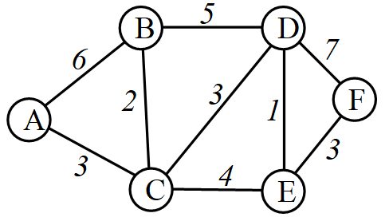
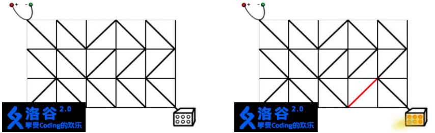
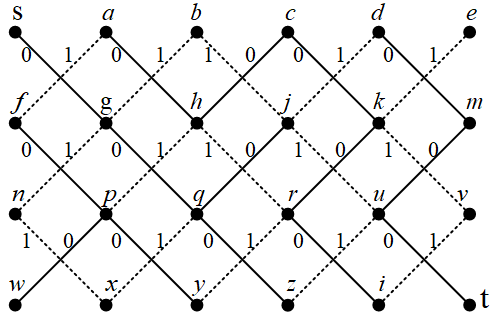

本页面将简要介绍启发式搜索及其用法。

## 定义

启发式搜索（英文：heuristic search）是一种在普通搜索算法的基础上引入了启发式函数的搜索算法。

启发式函数的作用是基于已有的信息对搜索的每一个分支选择都做估价，进而选择分支。简单来说，启发式搜索就是对取和不取都做分析，从中选取更优解或删去无效解。

由于概念过于抽象，这里使用例题讲解。

???+note "[「NOIP2005 普及组」采药](https://www.luogu.com.cn/problem/P1048)"
    题目大意：有 $N$ 种物品和一个容量为 $W$ 的背包，每种物品有重量 $w_i$ 和价值 $v_i$ 两种属性，要求选若干个物品（每种物品只能选一次）放入背包，使背包中物品的总价值最大，且背包中物品的总重量不超过背包的容量。

??? note "解题思路"
    我们写一个估价函数 $f$，可以剪掉所有无效的 $0$ 枝条（就是剪去大量无用不选枝条）。
    
    估价函数 $f$ 的运行过程如下：
    
    我们在取的时候判断一下是不是超过了规定体积（可行性剪枝）；在不取的时候判断一下不取这个时，剩下的药所有的价值 + 现有的价值是否大于目前找到的最优解（最优性剪枝）。

??? note "示例代码"
    ```cpp
    --8<-- "docs/search/code/heuristic/heuristic_1.cpp"
    ```

## BFS + 优先队列

### 优先队列

普通队列中的元素是按先后顺序进出队列的，先进先出。在优先队列中，元素被赋予了优先级，每次弹出队列的，是具有最高优先级的元素。优先级根据需求来定义，例如定义最小值为最高优先级。

优先队列有多种实现方法。最简单的是暴力法，在n个数中扫描最小值，复杂度是O(n)。暴力法不能体现优先队列的优势，真正的优先队列一般用堆这种数据结构实现[堆的概念和代码实现](https://www.cnblogs.com/luoyj/p/12409990.html)，插入元素和弹出最高优先级元素，复杂度都是O(logn)。

虽然基于堆的优先队列很容易手写，不过竞赛中一般不用自己写，而是直接用STL的priority_queue。

### 最短路问题
BFS 结合优先队列，可解决最短路径问题。

1.算法描述

下面描述“BFS+优先队列”求最短距离的算法步骤。以下图为例，起点是A，求A到其它结点的最短路。图的结点总数是V，边的总数是E。



网络图

算法的过程，用到了贪心的思想。从起点A开始，逐层扩展它的邻居，放到优先队列里，并从优先队列中弹出距离A最近的点，就得到了这个点到A的最短距离；当新的点放进队列里时，如果经过它，使得队列里面的它的邻居到A更近，就更这些邻居点的距离。

以上图为例，步骤是：

（1）开始时，把起点A放到优先队列Q里：{A0}。下标表示从A出发到这个点的路径长度，A到自己的距离是0。

（2）从队列中弹出最小值，即A，扩展A的邻居结点，放到优先队列Q里：{B6,C3}。下标表示从A出发到这个点的路径长度。一条路径上包含了多个结点。Q中记录的是各结点到起点A的路径长度，其中有一个最短，优先队列Q可以快速取出它。

（3）从优先队列Q中弹出最小值，即距离起点A最短的结点，这次是C。在这一步，找到了A到C的最短路径长度，C是第一个被确定最短路径的结点。考察C的邻居，其中的新邻居D、E直接放到Q里：{B5,D6,E7}；队列里的旧邻居B，看经过C到B是否距离更短，如果更短，就更新，所以B6更新为B5，现在A经过C到B，总距离是5。

（4）继续从优先队列Q中取出距离最短的结点，这次是B，在这一步，找到了A到B的最短路径长度，路径是A-C-B。考察B的邻居，B没有新邻居放进Q；B在Q中的旧邻居D，通过B到它也并没有更近，所以不用更新。Q现在是{D6,E7}。

继续以上过程，每个结点都会进入Q并弹出，最后Q为空时结束。

在优先队列Q里找最小值，也就是找距离最短的结点，复杂度是O(logV)。“BFS+优先队列”求最短路径，算法的总复杂度是O((V+E)logV)。共检查V+E次，每次优先队列是O(logV)。

如果不用优先队列，直接在V个点中找最小值，是O(V)的，总复杂度O(V2)。

O(V2)是否一定比O((V+E)logV)好？下面将讨论这个问题。

（1）稀疏图中，点和边的数量差不多，V ≈ E，用优先队列的复杂度O((V+E)logV)可以写成O(VlogV)，它比O(V2)好，是非常好的优化。

（2）稠密图中，点少于边，$V\lt E$ 且 V2≈E，复杂度O((V+E)logV)可以写成O(V2logV)，它比O(V2)差。这种情况下，用优先队列，反而不如直接用暴力搜。

2.BFS与Dijkstra

读者如果学过最短路径算法Dijkstra，就会发现，实际上这就是上一节中用优先队列实现的BFS，即：“Dijkstra + 优先队列 = BFS + 优先队列（队列中放的是从起点到当前点的距离）”。

上面括号中的“队列中放的是从起点到当前点的距离”的注解，说明了它们的区别，即“Dijkstra + 优先队列”和“BFS + 优先队列”并不完全相同。例如，如果在BFS时进入优先队列的是“从当前点到终点的距离”，那么就是贪心最优搜索（Greedy Best First Search）。

根据前面的讨论，Dijkstra 算法也有下面的结论：

（1）稀疏图，用“Dijkstra + 优先队列”，复杂度O((V+E)logV)=O(VlogV)；

（2）稠密图，如果V2≈E，不用优先队列，直接在所有结点中找距离最短的那个点，总复杂度O(V2)。

稀疏图的存储用邻接表或链式前向星，稠密图用邻接矩阵。

### 例题

???+note "[Obstacle Course](http://acm.hdu.edu.cn/showproblem.php?pid=3152)"
    **题目描述：** 一个N*N的矩阵，每个结点上有一个费用。从起点[0][0]出发到终点[N-1][N-1]，求最短的路径，即经过的结点的费用和最小。每次移动，可以沿上下左右四个方向走一步。
    
    **输入：** 第一行是N，后面跟着N行，每一行有N个数字。最后一行是0，表示终止。2<=N<=125。
    
    输出：最小费用。
    
    输入样例：
    
    3
    
    5 5 4
    
    3 9 1
    
    3 2 7
    
    5
    
    3 7 2 0 1
    
    2 8 0 9 1
    
    1 2 1 8 1
    
    9 8 9 2 0
    
    3 6 5 1 5
    
    0
    
    输出样例：
    
    Problem 1: 20
    
    Problem 2: 19

    ??? note "参考代码"

        ```cpp
        #include<bits/stdc++.h>
        using namespace std;
        const int maxn=150, INF=1<<30;
        int dir[4][2]={{0,1},{1,0},{0,-1},{-1,0}};
        int n, graph[maxn][maxn], vis[maxn][maxn];   //vis记录到起点的最短距离
        struct node{
            int x,y,sum;
            friend bool operator <(node a,node b) {
                return a.sum > b.sum;
            }
        };
        int bfs(){                                  //dijkstra
            fill(&vis[0][0], &vis[maxn][0], INF);
            vis[0][0] = graph[0][0];                //起点到自己的距离
        priority_queue <node> q;
            node first = {0, 0, graph[0][0]};       
            q.push(first);                          //起点进队
            while(q.size()) {
                node now = q.top(); q.pop();        //每次弹出已经找到最短距离的结点
                if(now.x==n-1 && now.y==n-1)        //终点：右下角
                    return now.sum;                 //返回      
                for(int i=0; i<4; i++){             //上下左右
                    node t = now;                   //扩展now的邻居
                    t.x += dir[i][0];
                    t.y += dir[i][1];
                    if(0<=t.x && t.x<n && 0<=t.y && t.y<n) {  //在图内
                        t.sum += graph[t.x][t.y];
                        if(vis[t.x][t.y] <= t.sum) continue;  
                                            //邻居已经被搜过，并且距离更短，不用更新
                        if(vis[t.x][t.y] == INF)   q.push(t); //如果没进过队列，就进队
                        vis[t.x][t.y] = t.sum;                //更新这个结点到起点的距离
                    }
                }
            }
            return -1;
        }
        int main(){
            int k = 1;
            while(cin>>n, n){    
                for(int i=0; i<n; i++)
                    for(int j=0; j<n; j++)
                        cin >> graph[i][j];
                cout<<"Problem "<< k++ <<": "<< bfs() << endl;
            }
            return 0;
        }
        ```

### 习题

???+note "[ROADS](http://poj.org/problem?id=1724)"
    给出总钱数 pay（题上的Ｋ），再给出总点数ｎ，总边数ｍ。
    
    接下来输入ｍ条边，每条边都是单向边，每条边有四个信息ａ，ｂ，ｌ，ｃ。
    
    表示从ａ到ｂ有一条边长为ｌ，过路费为ｃ的边。
    
    每过一条边都要交过路费，若当前总钱数小于过路费，则不能走，问从１走到ｎ的最短路（距离最短，花费在总钱数以内）。

    ??? tip
        用dis[i][j]表示从1到i点，花费为j的最短路径，跑spfa，求出最短路

    ??? note "参考代码"

        ```cpp
        #include <cstdio>
        #include <cstring>
        #include <queue>
        #include <algorithm>
        using namespace std ;
        #define INF 0x3f3f3f3f
        struct nn{
            int v , l , t ;
            int next ;
        }edge[20000];
        struct node{
            int u , t ;
        }p , q ;
        int head[110] , cnt ;
        int dis[110][11000] , vis[110][11000] ;
        queue <node> que ;
        void add(int u,int v,int l,int t) {
            edge[cnt].v = v ; edge[cnt].l = l ;
            edge[cnt].t = t ;
            edge[cnt].next = head[u] ; head[u] = cnt++ ;
        }
        int main() {
            int k , n , m , i ;
            int u , v , l , t , min1 ;
            while( scanf("%d %d %d", &k, &n, &m) != EOF ) {
                memset(head,-1,sizeof(head)) ;
                memset(dis,INF,sizeof(dis)) ;
                memset(vis,0,sizeof(vis)) ;
                while( !que.empty() ) que.pop() ;
                cnt= 0 ;
                while( m-- ) {
                    scanf("%d %d %d %d", &u, &v, &l, &t) ;
                    add(u,v,l,t) ;
                }
                dis[1][0] = 0 ;
                vis[1][0] = 1 ;
                p.u = 1 ; p.t = 0 ;
                que.push(p) ;
                while( !que.empty() ) {
                    p = que.front() ;
                    que.pop() ;
                    vis[ p.u ][ p.t ] = 0 ;
                    for(i = head[ p.u ] ; i != -1 ; i = edge[i].next) {
                        if( p.t+edge[i].t <= k && dis[ p.u ][ p.t ]+edge[i].l < dis[ edge[i].v ][ p.t+edge[i].t ] ) {
                            dis[ edge[i].v ][ p.t+edge[i].t ] = dis[ p.u ][ p.t ] + edge[i].l ;
                            if( !vis[ edge[i].v ][ p.t+edge[i].t ] ) {
                                vis[ edge[i].v ][ p.t+edge[i].t ] = 1 ;
                                q.u = edge[i].v ;
                                q.t = p.t+ edge[i].t ;
                                que.push(q) ;
                            }
                        }
                    }
                }
                min1 = INF ;
                for(i = 0 ; i <= k ; i++)
                    min1 = min(min1,dis[n][i]) ;
                if( min1 == INF ) min1 = -1 ;
                printf("%d\n", min1) ;
            }
            return 0;
        }
        ```

???+note "[Jack and Jill](http://poj.org/problem?id=1729)"
    两个人分别从H到S，h到s。地图上*无法走，可以走到之前走的地方，到达s或者S后就停止。每一个单位时间走可上下左右走一步。求各个单位时间的距离最短的路线。

    ??? tip
        一个结构体保存两个人的状态，优先队列优化，bfs求解最优解。

    ??? note "参考代码"

        ```cpp
        #include<cstdio>
        #include<cstring>
        #include<cmath>
        #include<algorithm>
        #include<vector>
        #include<stack>
        #include<iostream>
        #include<queue>
        #define Min(a,b) a<b?a:b
        using namespace std;
        struct node
        {
            int hx,hy;
            int Hx,Hy;
            int dist;
            char moveh,moveH;
            int id,pre;
            bool operator < (const node& a) const
            {
                return dist<a.dist;
            }
        };
        int dirx[]={0,-1,0,1};
        int diry[]={1,0,-1,0};
        char move[]="ENWS";
        int vis[50][50][50][50];
        int n;
        int p;
        node st[1000010];
        char g[110][110];
        priority_queue<node> que;
        int dist(int x1,int y1,int x2,int y2)
        {
            return (x1-x2)*(x1-x2)+(y1-y2)*(y1-y2);
        }
        void BFS(int hx,int hy,int Hx,int Hy)
        {
            while(!que.empty())
                que.pop();
            int i,j;
            memset(vis,-1,sizeof(vis));
            node x,y;
            p=0;
            x.hx=hx,x.hy=hy,x.Hx=Hx,x.Hy=Hy;
            x.id=p;
            x.pre=-1;
            int dis=dist(hx,hy,Hx,Hy);
            x.dist=dis;
            st[p++]=x;
            que.push(x);
            while(!que.empty())
            {
                y=que.top();
                que.pop();
                if(g[y.hx][y.hy]=='s'&&g[y.Hx][y.Hy]=='S')
                {
                    printf("%.2f\n",sqrt(1.0*y.dist));
                    stack<char> st1,st2;
                    while(y.pre!=-1)
                    {
                        if(y.moveH!='e')
                            st1.push(y.moveH);
                        if(y.moveh!='e')
                            st2.push(y.moveh);
                        y=st[y.pre];
                    }
                    while(!st1.empty())
                    {
                        printf("%c",st1.top());
                        st1.pop();
                    }
                    puts("");
                    while(!st2.empty())
                    {
                        printf("%c",st2.top());
                        st2.pop();
                    }
                    puts("");
                    break;
                }
                for(i=0;i<4;i++)
                {
                    int a=y.hx+dirx[i];
                    int b=y.hy+diry[i];
                    char moveh=move[i];
                    if(g[y.hx][y.hy]=='s')
                        a=y.hx,b=y.hy,moveh='e';
                    if(a>=0&&a<n&&b>=0&&b<n&&g[a][b]!='*'&&g[a][b]!='S'&&g[a][b]!='H')
                    {
                        for(j=0;j<4;j++)
                        {
                            int c=y.Hx+dirx[j];
                            int d=y.Hy+diry[j];
                            char moveH=move[j];
                            if(g[y.Hx][y.Hy]=='S')
                                c=y.Hx,d=y.Hy,moveH='e';
                            if(c>=0&&c<n&&d>=0&&d<n&&g[c][d]!='*'&&g[c][d]!='s'&&g[c][d]!='h')
                            {
                                dis=dist(a,b,c,d);
                                dis=Min(dis,y.dist);
                                if(dis>vis[a][b][c][d]||vis[a][b][c][d]==-1)
                                {
                                    x.hx=a,x.hy=b,x.Hx=c,x.Hy=d;
                                    x.id=p;
                                    x.dist=dis;
                                    x.pre=y.id;
                                    x.moveh=moveh;
                                    x.moveH=moveH;
                                    st[p++]=x;
                                    que.push(x);
                                    vis[a][b][c][d]=dis;
                                }
                            }
                            if(g[y.Hx][y.Hy]=='S')
                                break;
                        }
                    }
                    if(g[y.hx][y.hy]=='s')
                        break;
                }
            }
        }
        int i,j;
        int hx,hy,Hx,Hy;
        int main()
        {
            while(scanf("%d",&n)&&n)
            {
                for(i=0;i<n;i++)
                {
                    scanf(" %s",g[i]);
                    for(j=0;j<n;j++)
                        if(g[i][j]=='h')
                            hx=i,hy=j;
                        else
                            if(g[i][j]=='H')
                                Hx=i,Hy=j;
                }
                BFS(hx,hy,Hx,Hy);
                //memset(g,0,sizeof(g));
            }
            return 0;
        }
        ```
        
???+note "[Ignatius and the Princess I](https://vjudge.net/problem/hdu-1026)"
    最短时间内出迷宫。迷宫里要杀怪，每个怪有一定HP，也就是说要耗一定时。输出方案。

    ??? tip
        要的是最短的时间，而按照普通bfs搜到的是最短的路径，需要使用优先队列，使时间的优先级较高。

        另外题目还要求最后输出最短路径，可以用一个和迷宫一样的数组，保存每个点上一步的节点，这样BFS结束后，从终点往前找，并压入栈中，一直到起点位置。然后按时间序列输出，当时间小于该点应消耗的时间时，说明在这点上打怪了，按题目输出即可。
    ??? note "参考代码"

        ```cpp
        #include "cstdio"
        #include "cstring"
        #include "string"
        #include "iostream"
        #include "queue"
        #include "vector"
        using namespace std;
        #define inf 1<<28
        struct status
        {
            int x,y,dep;
            status() {}
            status(int x,int y,int dep):x(x),y(y),dep(dep) {}
            bool operator < (const status &a) const
            {
                return dep > a.dep;
            }
        };
        int n,m,dir[4][2]={-1,0,1,0,0,-1,0,1},map[105][105],spec[105][105],vis[105][105],ans;
        status path[105][105];
        void bfs(int x,int y)
        {
            priority_queue<status> Q;
            Q.push(status(x,y,map[x][y]-1));
            vis[x][y]=true;
            bool flag=false;
            while(!Q.empty())
            {
                if(flag) break;
                status t=Q.top();Q.pop();
                for(int s=0;s<4;s++)
                {
                    int X=t.x+dir[s][0],Y=t.y+dir[s][1];
                    if(vis[X][Y]||X<0||X>=n||Y<0||Y>=m||!map[X][Y]) continue;
                    vis[X][Y]=true;
                    path[X][Y].x=t.x;
                    path[X][Y].y=t.y;
                    Q.push(status(X,Y,t.dep+map[X][Y]));
                    if(X==0&&Y==0) {flag=true;ans=min(ans,t.dep+map[X][Y]);break;}
                }
            }
        }
        int main()
        {
            ios::sync_with_stdio(false);
            string tt;
            while(cin>>n>>m)
            {
                memset(vis,0,sizeof(vis));
                memset(spec,0,sizeof(spec));
                ans=inf;
                for(int i=0; i<n; i++)
                {
                    cin>>tt;
                    for(int j=0; j<tt.size(); j++)
                    {
                        if(tt[j]=='X') map[i][j]=0;
                        else if(tt[j]=='.') map[i][j]=1;
                        else {map[i][j]=tt[j]-'0'+1;spec[i][j]=tt[j]-'0';}
                    }
                }
                bfs(n-1,m-1);
                if(ans==inf) printf("God please help our poor hero.\n");
                else
                {
                    printf("It takes %d seconds to reach the target position, let me show you the way.\n",ans);
                    int no=1,x=0,y=0;
                    while(no<=ans)
                    {
                        int fx=path[x][y].x,fy=path[x][y].y;
                        if(map[fx][fy]) printf("%ds:(%d,%d)->(%d,%d)\n",no++,x,y,fx,fy);
                        for(int i=1;i<=spec[fx][fy];i++) printf("%ds:FIGHT AT (%d,%d)\n",no++,fx,fy);
                        x=fx,y=fy;
                    }
                }
                printf("FINISH\n");
            }
        }
        ```
        
???+note "[倒水](https://vjudge.net/problem/UVA-10603)"
    给定三个水杯，a,b,c ，并且 a,b 为空杯，c 倒满，

    给定一个容量  d  要求给出当，杯中有出现容量为d 的情况时，给出最少的水交换容量，

    如果没有 则给出d'  要求  d' 尽可能得接近  d

    ??? tip
        使用爆搜，广度优先遍历，对应的记录每一个状态下的 每一个杯子的含有的水量和已经交换的水的容量

        当出现d容量的情况时退出，否则从 d 开始往下遍历最接近d 容量的 d' 的交换容量值。

        同时需要注意，由于是最少的容量交换值，所以要用优先队列先拿出容量最小的节点求解。

    ??? note "参考代码"

        ```cpp
        #include<iostream>
        #include<queue>
        #include<cstring>
        using namespace std;
        const int MAXN = 205;
        
        struct node{
            //三杯水的容量 
            int v[3];
            //在这个状态下的 倒水量 
            int dist;
            bool operator <(const node &b) const{
                // 优先队列的 operator 和 普通的sort  是相反的，
                //即 从小到大，用 >  反之用  > 
                return dist>b.dist;
            }
        } nnode;
        
        // 出现杯子为 i升水的时候需要倒水的量 
        int ans[MAXN],cap[3];
        bool vis[MAXN][MAXN];
        
        //更新最小倒水量 
        void update_ans(const node &a){
            for(int i=0;i<3;i++){
                //ans 表示对应水量的 倒水量 
                int d = a.v[i];
                if(ans[d]<0 || a.dist < ans[d]) ans[d] = a.dist;
            }
        } 
        
        void bfs( int d){
            
            nnode.v[0] = 0; nnode.v[1] = 0; nnode.v[2] = cap[2];
            nnode.dist = 0;
            priority_queue<node> que;
            que.push(nnode);
            vis[0][0] = 1;
            while(!que.empty()){
                node now = que.top(); que.pop();
                update_ans(now);
                if(ans[d] >= 0) break;
                
                for(int i=0;i<3;i++)
                    for(int j=0;j<3;j++)
                        if(i!=j){
                            if(now.v[i]<=0 || now.v[j] >=cap[j]) continue;
                            //保证每次都是在都是独立改变 
                            node temp = now;
                            
                            //计算能倒的水 
                            int water = min(temp.v[i],cap[j] - temp.v[j]);
                            
                            temp.v[i] -= water;
                            temp.v[j] += water;
                            temp.dist += water;
                            
                            if(vis[temp.v[0]][temp.v[1]]) continue;
                            vis[temp.v[0]][temp.v[1]] = 1;
                            que.push(temp);	
                        }
            }
        
        }
        
        int main(){
            int T,a,b,c,d;
            scanf("%d",&T);
            while(T--){
                scanf("%d%d%d%d",&cap[0],&cap[1],&cap[2],&d);
                memset(ans,-1,sizeof(ans));
                memset(vis,0,sizeof(vis));
                bfs(d);
                while(d>=0){
                    if(ans[d]>=0) {
                        printf("%d %d\n",ans[d],d);
                        break;
                    }
                    d--;
                }
            } 
            return 0;
        } 
        ```
        
## BFS + 双端队列

在“简单数据结构”这一节中，讲解了“双端队列和单调队列”。双端队列是一种具有队列和栈性质的数据结构，它能而且只能在两端进行插入和删除。双端队列的经典应用是实现单调队列。下面讲解双端队列在BFS中的应用。

“BFS + 双端队列”可以解决一种特殊图的最短路问题：图的结点和结点之间的边权是0或者1。
一般求解最短路，高效的算法是Dijkstra，或者“BFS+优先队列”，复杂度O((V+E)logV)，V是结点数，E是边数。但是，在这类特殊图中，用“BFS+双端队列”可以在O(V)时间内求得最短路。

双端队列的经典应用是单调队列，“BFS+双端队列”的队列也是一个单调队列。

### 例题

???+note "[Switch the Lamp On](https://www.luogu.com.cn/problem/P4667)"
    **题目描述：** Casper正在设计电路。有一种正方形的电路元件，在它的两组相对顶点中，有一组会用导线连接起来，另一组则不会。有 N×M 个这样的元件，你想将其排列成N行，每行M 个。电源连接到板的左上角。灯连接到板的右下角。只有在电源和灯之间有一条电线连接的情况下，灯才会亮着。为了打开灯，任何数量的电路元件都可以转动90°(两个方向)。

    

    在上面的左图中，灯是关着的。在右图中，右数第二列的任何一个电路元件被旋转90°，电源和灯都会连接，灯被打开。现在请你编写一个程序，求出最小需要多少旋转多少电路元件。
    
    **输入格式：**
    
    输入的第一行包含两个整数N和M，表示盘子的尺寸。 在以下N行中，每一行有M个符号\或/，表示连接对应电路元件对角线的导线的方向。 1≤N, M≤500。
    
    输出格式：
    
    如果可以打开灯，那么输出一个整数，表示最少转动电路元件的数量。
    
    如果不可能打开灯，输出"NO SOLUTION"。
    
    样例输入：
    
    3 5
    
    \/\
    
    \///
    
    /\\
    
    样例输出：
    
    1

    ??? tip
        （1）建模为最短路径问题
        
        题目可以转换为最短路径问题。把起点s到终点t的路径长度，记录为需要转的元件数量。从一个点到邻居点，如果元件不转，距离是0，如果需要转元件，距离是1。题目要求找s到t的最短路径。样例的网络图如下图，其中实线是0，虚线是1。

        

        样例的网络图
        
        （2）BFS +优先队列
        
        用上一节的最短路径算法“BFS+优先队列”，复杂度是O((V+E)logV)。题目中结点数V = N×M = 250,000，边数E = 2×N×M = 500,000，O((V+E)logV) ≈ 1.5千万，题目给的时间限制是150ms，超时。
        
        （3）BFS + 双端队列
        
        如果读者透彻理解“BFS + 优先队列”的思想，就能知道优先队列的作用，是在队列中找到距离起点最短的那个结点，并弹出它。使用优先队列的原因是，每个结点到起点的距离不同，需要用优先队列来排序，找最小值。
        
        在特殊的情况下，有没有更快的办法找到最小值？
        
        这种特殊情况就是本题，边权是0或者1。简单地说，就是：“边权为0，插到队头；边权为1，插入队尾”，这样就省去了排序操作。
        
        下面解释“BFS + 双端队列”计算最短路径的过程。
        
        1. 把起点s放进队列。
        2. 弹出队头s。扩展s的直连邻居g，边权为0的距离最短，直接插到队头；边权为1的直接插入队尾。在样例中，当前队列是：{g0}，下标记录结点到起点s的最短距离。
        3. 弹出队头g0，扩展它的邻居b、n、q，现在队列是：{q0,b1,n1}，其中的q0，因为边权为0，直接放到了队头。g被弹出，表示它到s的最短路已经找到，后面不再进队。
        4. 弹出q0，扩展它的邻居g、j、x、z，现在队列是{j0,z0,b1,n1,x1},其中j0、z0边权为0，直接放到队头。
        
        等等。
        
        注意几个关键：
        
        1. 如果允许结点多次进队，那么先进队时算出的最短距离，大于后进队时算出的最短距离。所以后进队的结点，出队时直接丢弃。当然，最好不允许结点再次进队，在代码中加个判断即可，代码中的dis[nx][ny] > dis[u.x][u.y] + d起到了这个作用。
        2. 结点出队时，已经得到了它到起点s的最短路。
        3. 结点进队时，应该计算它到s的路径长度再入队。例如u出队，它的邻居v进队，进队时，v的距离是s-u-v，也就是u到s的最短距离加上(u,v)的边权。
        
        为什么“BFS+双端队列”的算法过程是正确的？仔细思考可以发现，出队的结点到起点的最短距离是按0、1、2...的顺序输出的，也就是说，距离为0的结点先输出，然后是距离为1的结点.....这就是双端队列的作用，它保证距离更近的点总在队列前面，队列是单调的。
        
        算法的复杂度，因为每个结点只入队和出队一次，所以复杂度是O(V)，V是结点数量。

    ??? note "参考代码"

        ```cpp
        #include<bits/stdc++.h>
        using namespace std;
        const int dir[4][2] = {{-1,-1},{-1,1},{1,-1},{1,1}}; //4个方向的位移
        const int ab[4] = {2,1,1,2};                         //4个元件期望的方向
        const int cd[4][2] = {{-1,-1},{-1,0},{0,-1},{0,0}};  //4个元件编号的位移
        int graph[505][505],dis[505][505];            //dis记录结点到起点s的最短路
        struct P{
            int x,y,dis;
        }u;
        int Get(){
            char c; 
            while((c=getchar())!='/' && c != '\\') ;    //字符不是'/'和'\'
            return c=='/'?1:2;
        } 
        int main(){
            int n, m; cin >>n >>m;
            memset(dis,0x3f,sizeof(dis));
            
        for(int i=1;i<=n;++i) 
                for(int j=1;j<=m;++j)  
                    graph[i][j] = Get();
        deque <P> dq;
            dq.push_back((P){1,1,0});
            dis[1][1]=0;
            while(!dq.empty()){
                u = dq.front(), dq.pop_front();  //front()读队头,pop_front()弹出队头
                int nx,ny;
                for(int i=0;i<=3;++i) {          //4个方向
                    nx = u.x+dir[i][0];
                    ny = u.y+dir[i][1];
                    int d = 0;                   //边权
                    d = graph[u.x+cd[i][0]][u.y+cd[i][1]]!=ab[i]; //若方向不相等,则d=1
                    if(nx && ny && nx<n+2 && ny<m+2 && dis[nx][ny]>dis[u.x][u.y]+d){    
                        //如果一个结点再次进队，那么距离应该更小。实际上，由于再次进队时，距离肯定更大，所以这里的作用是阻止再次入队。
                        dis[nx][ny] = dis[u.x][u.y]+d;
                        if(d==0)  dq.push_front((P){nx, ny, dis[nx][ny]}); //边权为0，插到队头
                        else      dq.push_back ((P){nx, ny, dis[nx][ny]}); //边权为1，插到队尾
                
                        if(nx==n+1 && ny==m+1)     //到终点退出。不退也行，队列空自动退出
                            break;               
                    }
                }    
            }
            if(dis[n+1][m+1] != 0x3f3f3f3f)     //可能无解，即s到t不通
                cout << dis[n+1][m+1]; 
            else 
                cout <<"NO SOLUTION";  
            return 0; 
        }  
        ```
