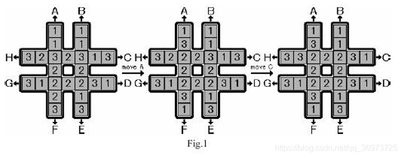

前置知识：[A\*](./astar.md) 算法、[迭代加深搜索](./iterative.md)。

本页面将简要介绍 IDA \* 算法。

## 定义

IDA \* 为采用了迭代加深算法的 A \* 算法。

## 优点

由于 IDA \* 改成了深度优先的方式，相对于 A \* 算法，它的优点如下：

1.  不需要判重，不需要排序，利于深度剪枝。
2.  空间需求减少：每个深度下实际上是一个深度优先搜索，不过深度有限制，使用 DFS 可以减小空间消耗。

## 缺点

1.  重复搜索：即使前后两次搜索相差微小，回溯过程中每次深度变大都要再次从头搜索。

## 实现（伪代码）

```Pascal
Procedure IDA_STAR(StartState)
Begin
  PathLimit := H(StartState) - 1;
  Succes := False;
  Repeat
    inc(PathLimit);
    StartState.g = 0;
    Push(OpenStack, StartState);
    Repeat
      CurrentState := Pop(OpenStack);
      If Solution(CurrentState) then
        Success = True
      Elseif PathLimit >= CurrentState.g + H(CurrentState) then
        For each Child(CurrentState) do
          Push(OpenStack, Child(CurrentState));
    until Success or empty(OpenStack);
  until Success or ResourceLimtsReached;
end;
```

## 例题

???+note "[埃及分数](https://loj.ac/p/10022)"
    在古埃及，人们使用单位分数的和（即 $\frac{1}{a}$，$a\in\mathbb{N}^*$）表示一切有理数。例如，$\frac{2}{3}=\frac{1}{2}+\frac{1}{6}$，但不允许 $\frac{2}{3}=\frac{1}{3}+\frac{1}{3}$，因为在加数中不允许有相同的。
    
    对于一个分数 $\frac{a}{b}$，表示方法有很多种，其中加数少的比加数多的好，如果加数个数相同，则最小的分数越大越好。例如，$\frac{19}{45}=\frac{1}{5}+\frac{1}{6}+\frac{1}{18}$ 是最优方案。
    
    输入整数 $a,b$（$0<a<b<500$），试编程计算最佳表达式。
    
    样例输入：
    
    ```text
    495 499
    ```
    
    样例输出：
    
    ```text
    Case 1: 495/499=1/2+1/5+1/6+1/8+1/3992+1/14970
    ```

    ??? tip
        这道题目理论上可以用回溯法求解，但是解答树会非常「恐怖」——不仅深度没有明显的上界，而且加数的选择理论上也是无限的。换句话说，如果用宽度优先遍历，连一层都扩展不完，因为每一层都是 **无限大** 的。
        
        解决方案是采用迭代加深搜索：从小到大枚举深度上限 $\textit{maxd}$，每次执行只考虑深度不超过 $\textit{maxd}$ 的节点。这样，只要解的深度有限，则一定可以在有限时间内枚举到。
        
        深度上限 $\mathit{maxd}$ 还可以用来 **剪枝**。按照分母递增的顺序来进行扩展，如果扩展到 i 层时，前 $i$ 个分数之和为 $\frac{c}{d}$，而第 $i$ 个分数为 $\frac{1}{e}$，则接下来至少还需要 $\frac{\frac{a}{b}-\frac{c}{d}}{\frac{1}{e}}$ 个分数，总和才能达到 $\frac{a}{b}$。例如，当前搜索到 $\frac{19}{45}=\frac{1}{5}+\frac{1}{100}+\cdots$，则后面的分数每个最大为 $\frac{1}{101}$，至少需要 $\frac{\frac{19}{45}-\frac{1}{5}}{\frac{1}{101}}=23$ 项总和才能达到 $\frac{19}{45}$，因此前 $22$ 次迭代是根本不会考虑这棵子树的。这里的关键在于：可以估计至少还要多少步才能出解。
        
        注意，这里使用 **至少** 一词表示估计都是乐观的。形式化地，设深度上限为 $\textit{maxd}$，当前结点 $n$ 的深度为 $g(n)$，乐观估价函数为 $h(n)$，则当 $g(n)+h(n)>\textit{maxd}$ 时应该剪枝。这样的算法就是 IDA\*。当然，在实战中不需要严格地在代码里写出 $g(n)$ 和 $h(n)$，只需要像刚才那样设计出乐观估价函数，想清楚在什么情况下不可能在当前的深度限制下出解即可。
        
        > 如果可以设计出一个乐观估价函数，预测从当前结点至少还需要扩展几层结点才有可能得到解，则迭代加深搜索变成了 IDA \* 算法。

    ??? 示例代码
        ```cpp
        --8<-- "docs/search/code/idastar/idastar_1.cpp"
        ```

## 习题

??? note "[UVa1343 旋转游戏](https://www.luogu.com.cn/problem/UVA1343)"
    棋盘上由数字1，2，3组成，往A,B,C,D,E,F,G,H8个方向旋转棋盘，使得中间8个数相等，最多有几步。
    

    ??? tip
        可以使用 IDA* 算法求解。

        首先我们来确定 dfs 的框架——在每个状态下枚举执行哪种操作，然后沿着该分支深入即可。有一个很明显的剪枝是记录上一次的操作，不执行上次操作的逆操作，避免来回操作。

        接下来我们设计估价函数。通过仔细观察可以发现，在每个状态下，如果中间 8 个格子里出现次数最多的数字是 k，而中间八个格子里剩下的数字有 m 个与 k 不同，那么把中间 8 个格子里的数字都变成 k 至少需要 m 次操作。因此，我们就以这个 m 估价即可。

        总而言之，我们采用迭代加深，由 1 开始从小到大依次限制操作次数（搜索深度），在 dfs 的每个状态下，若“ 当前操作次数 + 估价 > 深度限制 ”，则从当前分支回溯。

    ??? note "参考代码"

        ```cpp
        #include<bits/stdc++.h>
        using namespace std;
        bool flag=false;
        char c[20];
        int a[9]={5,4,7,6,1,0,3,2,-1};//先把A-H看成1-8,A对应F,B对应E...
        //这里的a[8]=-1其实是一个是否为深搜第一层的特判 
        int mp[24];
        int pos[8][7]=
        {
        {0,2,6,11,15,20,22},    //A
        {1,3,8,12,17,21,23},    //B
        {10,9,8,7,6,5,4},       //C
        {19,18,17,16,15,14,13}, //D
        {23,21,17,12,8,3,1},    //E
        {22,20,15,11,6,2,0},    //F
        {13,14,15,16,17,18,19}, //G
        {4,5,6,7,8,9,10}      //H
        };
        int center[8]={6,7,8,11,12,15,16,17};
        //看英文就知道这是中间8块的编号
        void change(int x)//x表示那一条(A-H)
        {
            int k=mp[pos[x][0]];
            for(int i=0;i<6;i++)
                mp[pos[x][i]]=mp[pos[x][i + 1]];
            mp[pos[x][6]]=k;
        }
        bool cmp(int a,int b)
        {
            return a>b;
        }
        int luck()//乐观估计函数
        {
            int cnt[3]={0,0,0};
            for(int i=0;i<8;i++)
                cnt[mp[center[i]]-1]++;
            sort(cnt,cnt+3,cmp);
            return 8-cnt[0];
        }
        void dfs(int dep,int lastx,int maxdep)
        //dep是当前深度,lastx是上一次选的操作,maxdep是边界
        {
            if(flag)return;
            if(dep>maxdep||dep+luck()>maxdep)return;
            if(luck()==0)
            {
                flag=true;
                c[dep]='\0';
                cout<<c<<endl;
                cout<<mp[center[0]]<<endl;
                return;
            }
            for(int i=0;i<8;i++)//i枚举变那一条(A-H) 
            {
                if(i!=a[lastx])
                {
                    change(i);
                    c[dep]=i+'A';//存下来 
                    dfs(dep+1,i,maxdep);
                    change(a[i]);
                }
            }
        }
        int main()
        {
            while(true)
            {
                for(int i=0;i<24;i++)
                {
                    cin>>mp[i];
                    if(i==0 && mp[i]==0) return 0;
                }
                if(!luck())
                {
                    cout<<"No moves needed"<<endl;
                    cout<<mp[center[0]]<<endl;
                    continue;
                }
                else
                {
                    flag=false;
                    for(int maxdep=1;!flag;maxdep++)
                    dfs(0,8,maxdep);
                }
            }
            return 0;
        }
        ```
