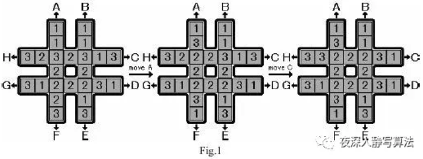
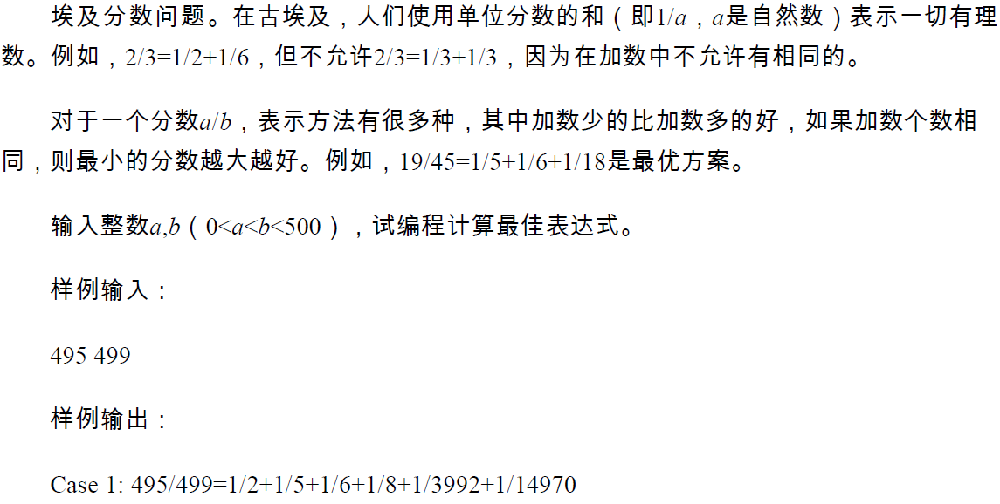
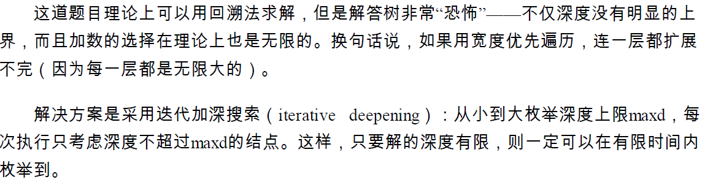
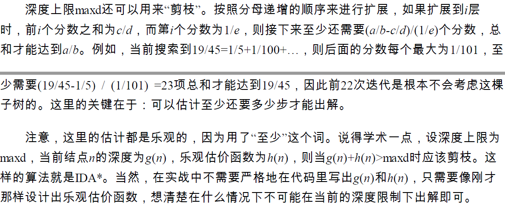
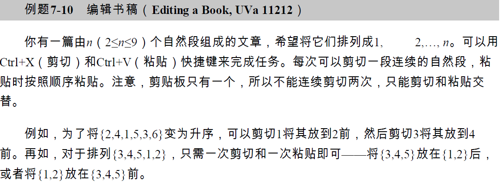
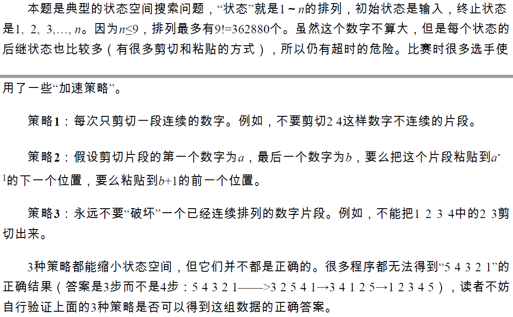
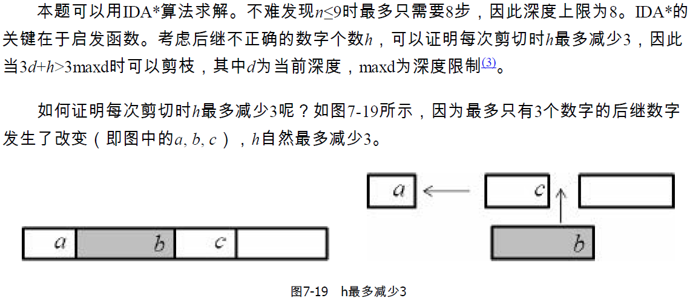
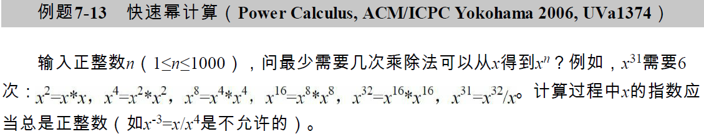
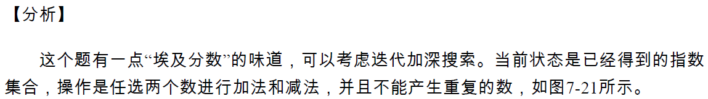
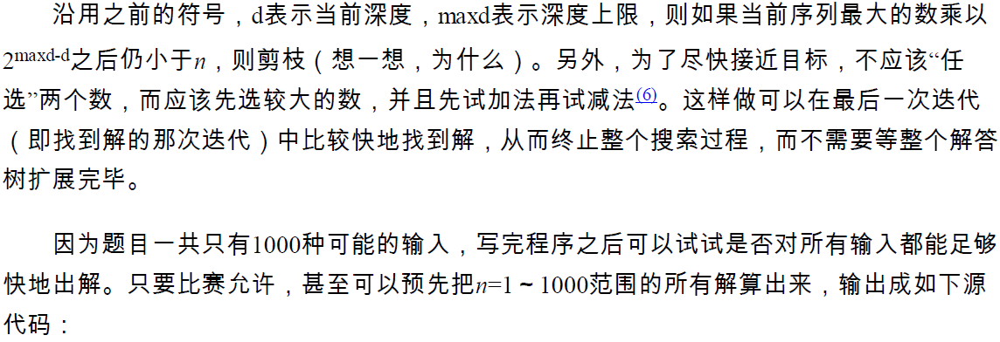

## 定义

迭代加深是一种 **每次限制搜索深度的** 深度优先搜索。

## 解释

迭代加深搜索的本质还是深度优先搜索，只不过在搜索的同时带上了一个深度 $d$，当 $d$ 达到设定的深度时就返回，一般用于找最优解。如果一次搜索没有找到合法的解，就让设定的深度加一，重新从根开始。

既然是为了找最优解，为什么不用 BFS 呢？我们知道 BFS 的基础是一个队列，队列的空间复杂度很大，当状态比较多或者单个状态比较大时，使用队列的 BFS 就显出了劣势。事实上，迭代加深就类似于用 DFS 方式实现的 BFS，它的空间复杂度相对较小。

当搜索树的分支比较多时，每增加一层的搜索复杂度会出现指数级爆炸式增长，这时前面重复进行的部分所带来的复杂度几乎可以忽略，这也就是为什么迭代加深是可以近似看成 BFS 的。

## 过程

首先设定一个较小的深度作为全局变量，进行 DFS。每进入一次 DFS，将当前深度加一，当发现 $d$ 大于设定的深度 $\textit{limit}$ 就返回。如果在搜索的途中发现了答案就可以回溯，同时在回溯的过程中可以记录路径。如果没有发现答案，就返回到函数入口，增加设定深度，继续搜索。

???+note "实现（伪代码）"
    ```text
    IDDFS(u,d)
        if d>limit
            return
        else
            for each edge (u,v)
                IDDFS(v,d+1)
    return
    ```

## 注意事项

在大多数的题目中，广度优先搜索还是比较方便的，而且容易判重。当发现广度优先搜索在空间上不够优秀，而且要找最优解的问题时，就应该考虑迭代加深。

## 例题

???+note "[The Rotation Game](https://vjudge.net/problem/UVA-1343)"
    如图所示，一个“井”字形的玩具，上面有三种数字1、2、3，给出8种操作方式，A表示将第一个竖着的列循环上移一格，并且A和F是一个逆操作，B、C、D...的操作方式依此类推，初始状态给定，目标状态是中间8个数字相同。问最少的操作方式，并且要求给出操作的序列，步数一样的时候选择字典序最小的输出。图中的操作序列为AC。

    

    ??? tip
        大致分析一下，一共24个格子，每个格子三种情况，所以最坏情况状态总数为3^24，但实际上，我们可以分三种情况讨论，先确定中间的8个数字的值，假设为1的话，2和3就可以看成是一样的，于是状态数变成了2^24 。
        
        对三种情况分别进行迭代加深搜索，令当前需要搜索的中间8个数字为k，首先枚举本次搜索的最大深度 maxDepth（即需要的步数），从初始状态进行状态扩展，每次扩展 8 个结点，当搜索到深度为depth的时候，那么剩下可以移动的步数为 maxDepth - depth，我们发现每次移动，中间的 8 个格子最多多一个 k，所以如果当前状态下中间 8 个格子有 sum 个 k，那么需要的剩余步数的理想最小值 s = 8 - sum，那么估价函数：
        
        h=depth+(8-sum)
        
        当h>maxDepth时，表明在当前这种状态下，不可能在 maxDepth 歩以内达成目标，直接回溯。
        
        当某个深度maxDepth至少有一个可行解时，整个算法也就结束了，可以设定一个标记，直接回溯到最上层，或者在DFS的返回值给定，对于某个搜索树，只要该子树下有解就返回 1，否则返回 0。
        
        迭代加深适合深度不是很深，但是每次扩展的结点数很多的搜索问题。

???+note "埃及分数"
    

    ??? tip
        
        

???+note "书稿编辑"
    

    ??? tip
        
        

???+note "快速幂"
    

    ??? tip
        
        

    ??? note "参考代码"

        ```cpp
        #include<cstdio>
        #pragma warning(disable:4996)
        int n, dmax, cur; int power[32] = { 1 }, buf[100000] = { 1 };
        inline bool Enumerate(const int& d) {
            if (d == dmax)return cur == n;
            if (cur * power[dmax - d] < n)return false;
            buf[d] = cur; //for (int i = 0; i <= d; ++i) { printf("%d ", buf[i]); }putchar('\n');
            for (int i = 0; i <= d; ++i) {
                cur = buf[d] + buf[i]; if (Enumerate(d + 1) == true)return true;
                cur = buf[d] - buf[i]; if (Enumerate(d + 1) == true)return true;
                cur = buf[d];
            }
            return false;
        }
        int main() {
            for (int i = 1; i <= 31; ++i)power[i] = power[i - 1] * 2;
            for (;;) {
                scanf("%d", &n); if (n == 0)return 0;
                for (dmax = 0;; ++dmax) { cur = 1; if (Enumerate(0) == true)break; }
                printf("%d\n", dmax);
            }
        }
        ```