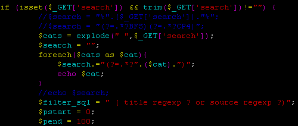
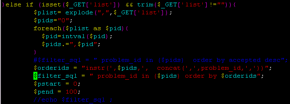

本章主要介绍如何基于[HustOJ](https://github.com/zhblue/hustoj)搭建你自己的[GoldenShadow OJ](http://35.185.251.187/)和[Daniel OJ](http://129.146.31.65/)。

## 安装

```console
foo@bar:~$sudo apt update
foo@bar:~$sudo apt install vim
foo@bar:~$wget http://dl.hustoj.com/install-ubuntu22.04.sh
```

#delete docker install commands at the end of script

```console
foo@bar:~$sudo bash install-ubuntu22.04.sh
```

#Remember your database account for HUST Online Judge:

```console
foo@bar:~$sudo vi /home/judge/src/install/Dockerfile, 
```

#comment out python, keep python3，

#comment out fp-compiler

#change openjdk-16-jdk to openjdk-11-jdk

```console
foo@bar:~$sudo bash docker.sh
foo@bar:~$sudo vi /home/judge/etc/judge.conf
```

#enable OJ_USE_DOCKER=1

#enable OJ_PYTHON_FREE=1

OJ_TIME_LIMIT_TO_TOTAL=0

```console
foo@bar:~$sudo reboot
foo@bar:~$cd /home/judge/backup
foo@bar:~$sudo bash /home/judge/src/install/restore.sh hustoj_%Y%m%d.tar.bz2
foo@bar:~$sudo vi /home/judge/src/web/include/db_info.inc.php
```

static  $OJ_NAME="GoldenShadow";  //name on the top left

static  $OJ_ADMIN="yuanruizhao@inscighteducation.org";

#static  $OJ_REGISTER=false; //disable new user register

static  $OJ_NEED_LOGIN=true; //require login to access info

static  $OJ_LONG_LOGIN=true; //enable long login session

static  $OJ_KEEP_TIME="180";  //login session cookie valid for XX days

## 多tag查询

```console
foo@bar:~$sudo vi /home/judge/src/web/problemset.php
```



修改题单为按plist中的id排序



## Make your name
```console
foo@bar:~$sudo vi /home/judge/src/web/include/init.php
```

$OJ_LANG="en";

```console
foo@bar:~$sudo vi /home/judge/src/web/template/syzoj/index.php
```

<?php $show_title="$MSG_HOME - $OJ_NAME"; ?>

```console
foo@bar:~$sudo pkill -9 judged && sudo judged
```

Enjoy!!

## Backup

```console
foo@bar:~$sudo bash /home/judge/src/install/bak.sh
```
